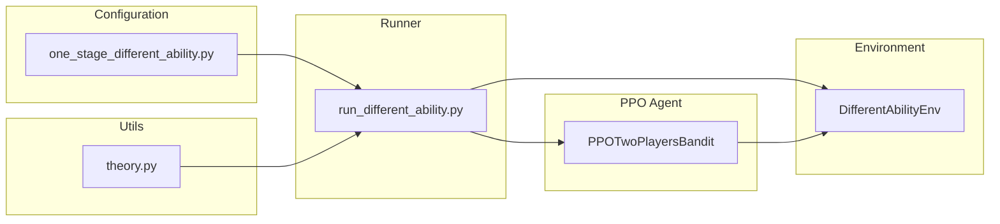

# One-Stage Different Ability Experiment Implementation

## Overview

Implement experiment type **III.2.c "Players with Different Abilities"** from `docs/experiment_plan.md` using the **additive ability model**:

- Output: `y_i = e_i + l_i + ε_i` where `ε_i ~ U(-q, q)`
- Default ability parameters: `l1 = 10, l2 = 5` (player 1 has advantage)
- Cost function: `C(e) = k * e²` (same k for both players)
- Symmetric equilibrium effort: `e* = ((2q - Δl) * (w_H - w_L)) / (8kq²)` where `Δl = l1 - l2`

## Key Files

### Existing (reuse)

- [envs/different_ability_env.py](envs/different_ability_env.py) - Environment already implements the additive model correctly
- [config/different_ability_two_players.py](config/different_ability_two_players.py) - Has theoretical formula and config builder
- [agents/ppo_two_players_clean.py](agents/ppo_two_players_clean.py) - PPO agent (can be reused with ability-aware state)

### To Create

- `config/one_stage_different_ability.py` - Standardized config matching naming convention
- `run/run_different_ability.py` - Run script (follows `run_different_cost.py` pattern)
- Update `utils/theory.py` - Add different ability theoretical formulas

## Architecture




## Implementation Details

### 1. Config File (`config/one_stage_different_ability.py`)

Create standardized config following the `one_stage_different_cost.py` pattern:

- Default parameters: `l1=10, l2=5, k=0.0004, w_h=6.5, w_l=3.0`
- Pre-computed theoretical values for `q ∈ {25, 40, 55}`
- PPO hyperparameters matching baseline
- Convergence evaluation settings

### 2. Theory Module Update (`utils/theory.py`)

Add functions:

- `e_star_two_players_different_ability(q, w_h, w_l, k, l1, l2)` - equilibrium effort
- `p_win_different_ability(e1, e2, l1, l2, q)` - win probability at equilibrium

### 3. Run Script (`run/run_different_ability.py`)

Following `run_different_cost.py` pattern:

- Gradient solver with per-player independent optimization
- PPO training with self-play (single shared agent since symmetric equilibrium)
- Convergence tracking and JSON output
- CSV result saving

### 4. CLI Arguments

```
--method {gradient,ppo}   # Algorithm choice
--q FLOAT                 # Noise parameter (or sweep all)
--l1 FLOAT               # Player 1 ability (default: 10)
--l2 FLOAT               # Player 2 ability (default: 5)
--episodes INT           # PPO training steps
--seed INT               # RNG seed
--enable-convergence-eval # Enable convergence evaluation
--cheap-gate-profile     # Convergence profile
```

## Theoretical Background

For additive ability model with `l1 > l2`:

- Symmetric equilibrium: both players exert `e* = ((2q - (l1-l2)) * (w_h-w_l)) / (8kq²)`
- Player 1 wins with probability `> 0.5` due to ability advantage
- Win probability uses triangular CDF for `ε1 - ε2 ~ Tri(-2q, 2q)`

Example with default parameters (`l1=10, l2=5, k=0.0004, w_h=6.5, w_l=3.0`):

- q=25: e* ≈ 78.75
- q=40: e* ≈ 51.56
- q=55: e* ≈ 38.07

## Output Files


| Output           | Location                                                                       |
| ---------------- | ------------------------------------------------------------------------------ |
| Convergence JSON | `results/convergence_history/different_ability_{method}_q{q}_convergence.json` |
| Results CSV      | `results/different_ability_two_players.csv`                                    |
| Training logs    | `results/logs/different_ability_*.log`                                         |


## Testing

1. Verify theoretical formula matches config calculations
2. Run gradient baseline and confirm convergence to e*
3. Run PPO training and verify convergence
4. Compare both players' efforts (should be symmetric at equilibrium)
5. Verify win probability asymmetry (player 1 > 50%)

