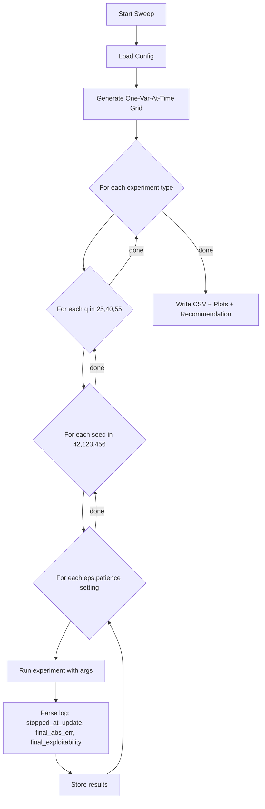

# Exploit Ablation Experiment

## Current State

- **Two-players and three-players**: Full exploitability evaluation with stopping criterion already implemented
- **Different-cost and different-ability**: No exploitability evaluation (only cheap gate tracking)
- Existing sweep tools provide a pattern for single-variable ablation

## Design: One-Variable-at-a-Time Sweep

**Parameter Settings (8 unique combinations):**

| Setting ID | exploit_eps | patience_exploit | Type |

|------------|-------------|------------------|------|

| baseline   | 0.05        | 5                | default |

| eps_001    | 0.01        | 5                | sweep eps |

| eps_003    | 0.03        | 5                | sweep eps |

| eps_010    | 0.10        | 5                | sweep eps |

| eps_020    | 0.20        | 5                | sweep eps |

| pat_01     | 0.05        | 1                | sweep patience |

| pat_03     | 0.05        | 3                | sweep patience |

| pat_10     | 0.05        | 10               | sweep patience |

**Run Matrix:**

- 4 experiment types: two_players, three_players, different_cost, different_ability
- 3 q values: 25, 40, 55
- 3 seeds: 42, 123, 456
- 8 (eps, patience) settings
- **Total: 4 x 3 x 3 x 8 = 288 runs** (M=8192 fixed)

## Implementation

### Phase 1: Add Exploitability to Asymmetric Games

**1. Create `eval_exploitability_asymmetric()` in a shared module**

New file: [`utils/exploit_asymmetric.py`](utils/exploit_asymmetric.py)

```python
def eval_exploitability_asymmetric(
    agent1, agent2,
    q: float,
    effort_bounds: tuple[float, float],
    M: int,
    grid_cfg: dict,
    seed: int,
    w_h: float, w_l: float,
    k1: float, k2: float,
    l1: float, l2: float,
    game_type: str  # "different_cost" or "different_ability"
) -> dict:
    """
    Compute exploitability for both players in asymmetric games.
    
    Returns dict with full debugging signal:
    {
        # Core exploitability values
        "exploit_1": float,           # Player 1's exploitability = max(0, u_br_1 - u_policy_1)
        "exploit_2": float,           # Player 2's exploitability = max(0, u_br_2 - u_policy_2)
        
        # Best response efforts (argmax points)
        "br_effort_1": float,         # Player 1's best response effort against player 2's policy
        "br_effort_2": float,         # Player 2's best response effort against player 1's policy
        
        # Utility decomposition for diagnosis
        "u_policy_1": float,          # Player 1's utility under current policy pair
        "u_policy_2": float,          # Player 2's utility under current policy pair
        "u_br_1": float,              # Player 1's utility when deviating to BR
        "u_br_2": float,              # Player 2's utility when deviating to BR
        
        # Grid search metadata
        "grid_candidates_1": int,     # Number of candidates evaluated for player 1
        "grid_candidates_2": int,     # Number of candidates evaluated for player 2
        "M_used": int,                # Monte Carlo samples used
        "seed_used": int,             # RNG seed for reproducibility
        
        # Derived convenience fields
        "exploit_max": float,         # max(exploit_1, exploit_2)
        "exploit_sum": float,         # exploit_1 + exploit_2
    }
    """
```

**Exploitability Definition (locked down):**

For player i deviating against opponent j's policy π_j:

```
exploit_i = max(0, max_e [U_i(e, π_j)] - U_i(π_i, π_j))
          = max(0, u_br_i - u_policy_i)
```

Where:

- `u_policy_i = E[U_i(π_i, π_j)]` via Monte Carlo with M samples
- `u_br_i = max_e E[U_i(e, π_j)]` via coarse-to-fine grid search
- `br_effort_i = argmax_e E[U_i(e, π_j)]`

Key differences from symmetric version:

- Player 1 deviates against player 2's policy (and vice versa)
- Cost/ability parameters differ per player
- Payoff functions account for asymmetry (k1≠k2 or l1≠l2)

**2. Integrate into [`run/run_different_cost.py`](run/run_different_cost.py)**

Add CLI arguments:

- `--exploit-eps` (default 0.05)
- `--exploit-patience` (default 5)
- `--exploit-every-updates` (default 10)

Stopping logic with structured logging:

```python
# Evaluate exploitability for both players
exploit_result = eval_exploitability_asymmetric(agent1, agent2, ...)

exploit_1 = exploit_result["exploit_1"]
exploit_2 = exploit_result["exploit_2"]
exploit_max = exploit_result["exploit_max"]

# Log both players' exploit values every evaluation
print(f"[Exploit] upd={update} exploit_1={exploit_1:.4f} exploit_2={exploit_2:.4f} "
      f"exploit_max={exploit_max:.4f} br_effort_1={exploit_result['br_effort_1']:.2f} "
      f"br_effort_2={exploit_result['br_effort_2']:.2f} streak={joint_exploit_ok_streak}/{patience_exploit}")

# Both players must pass independently
if exploit_1 < exploit_eps and exploit_2 < exploit_eps:
    joint_exploit_ok_streak += 1
else:
    joint_exploit_ok_streak = 0

if joint_exploit_ok_streak >= patience_exploit:
    stop_reason = "exploitability"
    converged_flag = 1
    break
```

**Stop reason tracking:**

```python
# Initialize at start of training
stop_reason = "max_updates"  # default if we exhaust episodes

# Set appropriately when stopping
if joint_exploit_ok_streak >= patience_exploit:
    stop_reason = "exploitability"
elif cheap_gate_triggered and not exploit_eval_enabled:
    stop_reason = "cheap_gate"
# else: stop_reason remains "max_updates"
```

**3. Integrate into [`run/run_different_ability.py`](run/run_different_ability.py)**

Same pattern as different-cost with ability-specific payoff.

### Phase 2: Create Unified Sweep Script

**New file: [`tools/sweep_exploit_ablation.py`](tools/sweep_exploit_ablation.py)**



**CLI interface:**

```bash
python tools/sweep_exploit_ablation.py \
    --experiments two_players,three_players,different_cost,different_ability \
    --q-values 25,40,55 \
    --seeds 42,123,456 \
    --output-dir results/exploit_ablation/ \
    --parallel 4 \
    --resume
```

**Parallel execution (`--parallel N`):**

```python
from concurrent.futures import ProcessPoolExecutor, as_completed

def run_sweep(tasks, parallel=1, output_dir="results/exploit_ablation"):
    """Run all experiments with optional parallelism."""
    completed_runs = load_completed_runs(output_dir)  # for --resume
    pending_tasks = [t for t in tasks if task_id(t) not in completed_runs]
    
    results = []
    with ProcessPoolExecutor(max_workers=parallel) as executor:
        futures = {executor.submit(run_single_experiment, t): t for t in pending_tasks}
        for future in as_completed(futures):
            result = future.result()
            results.append(result)
            # Write per-run JSON immediately for resume support
            write_run_json(result, output_dir)
    
    return results
```

**Resume support (`--resume`):**

- Each completed run writes its JSON immediately
- On restart, script scans `output_dir/runs/*.json` for completed task IDs
- Skips already-completed (experiment, q, seed, eps, patience) combinations
- Aggregates all results at the end

### Phase 3: Output and Analysis

**1. Structured Per-Run Output**

Each run writes a JSON file: `results/exploit_ablation/runs/{experiment}_q{q}_seed{seed}_eps{eps}_pat{patience}.json`

```python
{
    # Run identification
    "experiment": "different_cost",
    "q": 40.0,
    "seed": 42,
    "exploit_eps": 0.05,
    "patience_exploit": 5,
    "M": 8192,
    
    # Stopping info
    "stop_reason": "exploitability",  # "exploitability" | "max_updates" | "cheap_gate"
    "stopped_at_update": 1523,
    "joint_exploit_ok_streak": 5,     # streak at stop time
    
    # Final exploitability (at stop)
    "final_exploit_1": 0.042,
    "final_exploit_2": 0.038,
    "final_exploit_max": 0.042,       # max(exploit_1, exploit_2)
    
    # Final best-response efforts
    "final_br_effort_1": 22.5,
    "final_br_effort_2": 18.3,
    
    # Final utility decomposition
    "final_u_policy_1": 3.21,
    "final_u_policy_2": 2.89,
    "final_u_br_1": 3.25,
    "final_u_br_2": 2.93,
    
    # Policy quality metrics
    "final_effort_1": 21.83,          # policy mean effort player 1
    "final_effort_2": 17.92,          # policy mean effort player 2
    "e_star_1": 21.875,               # closed-form equilibrium player 1
    "e_star_2": 17.5,                 # closed-form equilibrium player 2
    "final_abs_err_1": 0.045,         # |effort_1 - e_star_1|
    "final_abs_err_2": 0.42,          # |effort_2 - e_star_2|
    "final_abs_err_max": 0.42,        # max of both
    
    # Convergence history (sparse, only when evaluated)
    "exploit_history": [
        {"update": 100, "exploit_1": 0.15, "exploit_2": 0.18, "streak": 0},
        {"update": 110, "exploit_1": 0.08, "exploit_2": 0.09, "streak": 0},
        ...
    ]
}
```

**2. CSV Output:** `results/exploit_ablation/summary.csv`

| experiment | exploit_eps | patience | q | seed | stop_reason | stopped_at_update | joint_exploit_ok_streak | final_exploit_1 | final_exploit_2 | final_exploit_max | final_abs_err_1 | final_abs_err_2 | final_abs_err_max | final_effort_1 | final_effort_2 | e_star_1 | e_star_2 |

|------------|-------------|----------|---|------|-------------|-------------------|-------------------------|-----------------|-----------------|-------------------|-----------------|-----------------|-------------------|----------------|----------------|----------|----------|

| different_cost | 0.05 | 5 | 40 | 42 | exploitability | 1523 | 5 | 0.042 | 0.038 | 0.042 | 0.045 | 0.42 | 0.42 | 21.83 | 17.92 | 21.875 | 17.5 |

**3. Convergence Plots:**

- Per experiment type: overlay curves for different settings
- X-axis: training update
- Y-axis: policy effort (with ground truth e* horizontal line)
- Markers at stopping points, color-coded by stop_reason
- Secondary plot: exploitability over time for both players

**4. Best Settings Recommendation:**

Metric: Minimize final_abs_err while avoiding false stops (patience too low) or wasted compute (eps too tight).

Heuristic ranking:

1. Filter settings where >90% of runs stopped with `stop_reason=exploitability` (not max_updates)
2. Rank by median(final_abs_err_max) ascending
3. Tiebreak by median(stopped_at_update) ascending (prefer faster stops at same quality)
4. Report: % of runs that stopped via exploitability vs max_updates per setting

## File Changes Summary

| File | Action |

|------|--------|

| `utils/exploit_asymmetric.py` | **Create** - asymmetric exploitability functions |

| `run/run_different_cost.py` | **Modify** - add exploitability stopping |

| `run/run_different_ability.py` | **Modify** - add exploitability stopping |

| `tools/sweep_exploit_ablation.py` | **Create** - unified ablation sweep |

| `tools/plot_exploit_ablation.py` | **Create** - visualization script |

## Risks and Mitigations

- **Risk**: Asymmetric exploitability computation may have edge cases
  - **Mitigation**: Validate against known closed-form equilibria first
- **Risk**: 288 runs takes significant compute
  - **Mitigation**: Script supports `--parallel N` for concurrent execution and `--resume` for interrupted runs