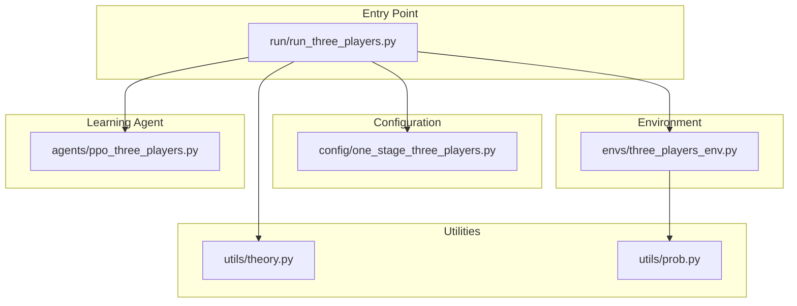

# One-Stage Three-Player Experiment Implementation

## Overview

This plan implements a simplified symmetric three-player one-stage tournament experiment:

- One winner receives `w_h`, two losers receive `w_l`
- Pure self-play only (no opponent/lag modes)
- Direct output format (no stage1/stage2 CSV field mapping)
- Theoretical equilibrium: `e* = (w_h - w_l) / (4 * k * q)`

## Architecture




## Files to Modify/Create

### 1. Update Config: [config/one_stage_three_players.py](config/one_stage_three_players.py)

**Current state**: Basic game parameters only (24 lines)

**Changes needed**: Add PPO hyperparameters (simplified, no opponent/stage mapping):

- Core game params: `w_h`, `w_l`, `k`, `q_list`, `effort_range`, `num_players=3`
- PPO schedule: `steps_per_update`, `minibatch_size`, `update_epochs`, `episodes`
- Learning rate: `lr_start`, `lr_end`
- Entropy: `entropy_coef_start`, `entropy_coef_end`
- Clip range: `clip_range_start`, `clip_range_end`
- Convergence settings with cheap gate profiles

**Removed** (not needed):

- `stage1_weight`, `stage2_weight` (no stage mapping)
- `opponent_mode`, `opponent_sync_interval`, `opponent_ema_tau` (self-play only)
- `opponent_history_sample_p`, `lag_warmup_updates`, `lag_fade_updates` (no opponent lag)

### 2. Create Environment: [envs/three_players_env.py](envs/three_players_env.py)

**Purpose**: Gym-like environment for three-player tournament

**Key methods** (following `TwoPlayersEnv` pattern):

- `__init__(w_h, w_l, k, q, effort_bounds, seed)` - Initialize game parameters
- `step(efforts: Tuple[Tensor, Tensor, Tensor])` - Execute one step with 3 efforts
- `expected_utility(e_i, e_j, e_k)` - Compute expected utility for player i
- `draw_noise_batch(batch_size)` - Draw uniform noise for 3 players
- `sample_noisy_outputs(e1, e2, e3, eps1, eps2, eps3)` - Determine winner

**Win probability**: Use `win_prob_three_players(e_i, e_j, e_k, q)` from `utils/prob.py` (line 150)

**Payoff structure**:

- Winner gets `w_h`, two losers get `w_l`
- Cost: `k * e_i^2` for each player
- Utility: `payoff - cost`

### 3. Create PPO Agent: [agents/ppo_three_players.py](agents/ppo_three_players.py)

**Approach**: Simplified adaptation of `ppo_two_players_clean.py` for pure self-play

**Key changes from two-player version**:

- `collect_rollouts()` stores transitions from all 3 players (symmetric self-play)
- Buffer stores 3x transitions per environment step (vs 2x for two-player)
- `num_players = 3` parameter

**Removed** (not needed):

- Opponent policy tracking (`opponent_net`, `sync_opponent()`)
- Opponent snapshot history (`opponent_snapshots`)
- EMA/periodic opponent sync modes
- `opponent_history_sample_p` and related sampling logic

**Shared components** (reuse from two-player):

- `ActorCritic` and `ActorCriticMeanConc` networks (unchanged)
- `PPOConfig` dataclass (simplified - remove opponent fields)
- Core PPO update logic (`_update()` method)
- Beta distribution policy parameterization

### 4. Create Run Script: [run/run_three_players.py](run/run_three_players.py)

**Purpose**: Main entry point for three-player experiments (self-play only)

**Key functions to adapt from `run_two_players.py**`:


| Function                     | Changes Needed                                                   |
| ---------------------------- | ---------------------------------------------------------------- |
| `run_gradient()`             | Use 3-player gradient from `win_prob_three_players_grad()`       |
| `run_ppo()`                  | Use 3-player env, collect 3 transitions per step, self-play only |
| `eval_exploitability()`      | Evaluate deviation against 2 symmetric opponents                 |
| `_batch_payoffs_uniform()`   | Handle 3-player payoff calculation (1 winner, 2 losers)          |
| `_stochastic_fd_gradients()` | Compute gradients for all 3 players                              |


**Removed functions** (not needed):

- All opponent policy logic (`_use_opponent_policy`, opponent lag schedules)
- Stage mapping helpers (`_map_to_stage_fields`)
- `build_csv_row` complexity (direct output instead)

**CLI arguments** (simplified):

- `--method` (ppo/gradient)
- `--q` (noise parameter)
- `--episodes` (training steps)
- `--seed` (random seed)
- `--theory-align-v2` (mean+concentration head)
- `--enable-convergence-eval` / `--no-convergence-eval`
- `--cheap-gate-profile` (relaxed/default/conservative)

**Output files**:

- `results/convergence_history/ppo_3p_q{q}_seed{seed}_{ablation}_convergence.json`
- Console logging (no complex CSV mapping)

### 5. Update Theory Utils (if needed): [utils/theory.py](utils/theory.py)

**Already implemented** at line 35:

```python
def e_star_three_players(q, w_h, w_l, k) -> float:
    return (w_h - w_l) / (4.0 * q * k)
```

No changes needed.

### 6. Update Probability Utils (if needed): [utils/prob.py](utils/prob.py)

**Already implemented** at line 150:

```python
def win_prob_three_players(e_i, e_j, e_k, q) -> float
def win_prob_three_players_grad(e_i, e_j, e_k, q) -> tuple[float, float, float]
```

No changes needed.

## Implementation Order

1. **Config first** - Expand `one_stage_three_players.py` with PPO params
2. **Environment second** - Create `three_players_env.py` (can test independently)
3. **Agent third** - Create `ppo_three_players.py` (depends on env)
4. **Run script last** - Create `run_three_players.py` (integrates all)

## Validation Checklist

- Three-player environment returns correct win probabilities at equilibrium (1/3 each)
- Gradient method converges to theoretical `e* = (w_h - w_l) / (4 * k * q)`
- PPO self-play learns symmetric equilibrium
- Convergence history JSON captures all 3 agent efforts
- All three agents converge to same effort (symmetry)

## Sample Commands

```bash
# Gradient baseline
python run/run_three_players.py --method gradient --q 40

# PPO training (self-play is the only mode)
python run/run_three_players.py --method ppo --q 40 --episodes 2048000 --seed 42

# PPO with convergence evaluation
python run/run_three_players.py --method ppo --q 40 --episodes 2048000 --seed 42 \
  --enable-convergence-eval --cheap-gate-profile relaxed

# Sweep all q values
python run/run_three_players.py --method ppo --episodes 2048000 --seed 42
```

## Key Simplifications vs Two-Player


| Feature         | Two-Player            | Three-Player  |
| --------------- | --------------------- | ------------- |
| Opponent policy | EMA/periodic/snapshot | None          |
| CSV output      | Stage1/Stage2 mapping | Direct fields |
| Lag schedules   | warmup + fade         | None          |


