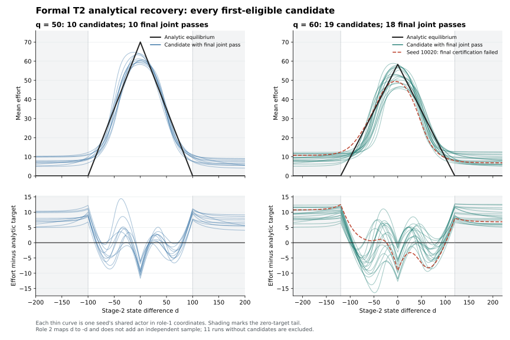
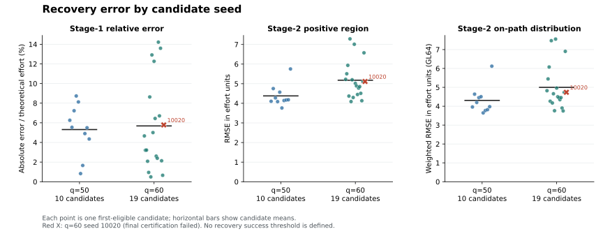

# 正式 T=2 held-out 验证结果

**40条运行全部完成，程序返回码均为0。q=50的端到端联合通过率为10/20（50%），q=60为18/20（90%）。共29条找到first-eligible候选，其中28条通过原最终认证及完整网格浓度要求。**

本轮唯一protocol为G1 A400/B600/C1000上限、全程LR=0.0003、shared actor、hard snapshot；仅把C的k_stop改为1。每q使用seeds10001–10020，共20个配对seed、40条运行。没有重跑、替换seed、更换候选或改变阈值。

## Search success 与 Final certification

方括号为各自分母下的95% Wilson区间，单位为百分比。按q分别报告，不把两个q的配对运行合成40个独立样本推断。

| 指标 | q=50 | q=60 |
| --- | --- | --- |
| Search success | 10/20 = 50.0% [29.9, 70.1] | 19/20 = 95.0% [76.4, 99.1] |
| Conditional final certification | 10/10 = 100.0% [72.2, 100.0] | 18/19 = 94.7% [75.4, 99.1] |
| Conditional final joint | 10/10 = 100.0% [72.2, 100.0] | 18/19 = 94.7% [75.4, 99.1] |
| End-to-end final joint | 10/20 = 50.0% [29.9, 70.1] | 18/20 = 90.0% [69.9, 97.2] |
| Budget exhaustion，无候选 | 10/20 = 50.0% [29.9, 70.1] | 1/20 = 5.0% [0.9, 23.6] |

final_overall_pass保留原有效性、偏离阈值和数值细化条件；final_joint_pass再要求同一θ的dense C_all≤0.04。29个候选的浓度全部通过，因此本轮两个候选通过计数相同。无候选run的末点评估仅作诊断，未计入候选认证率。

29个候选全部在第一次同点有效、BR及浓度通过的C检查后停止，没有继续PPO更新。q50/seed10002、q50/seed10013、q60/seed10004恰在C1000首次达标，按计划计入搜索成功；不能用strictly_before_cap字段代替search success。

## 唯一的候选最终认证失败

q=60、seed10020在C100（global update=1000）找到候选：development dReach/ΔW=0.009343448073410254，final=0.01005528337171735。最终值比0.01高0.00005528337171735，因此按原规则记为认证失败。

该候选的dense C_all=0.035053993392965804；development/final均有效，偏离细化差=0.0007118352983070952、EXP细化差=0.000015271009667139346，均低于0.002。数值细化通过与最终绝对阈值通过是两件事，本例只在后者失败。未因接近阈值而放宽规则、继续训练或改选权重。

## 11条没有first-eligible候选的运行

q50有10条、q60有1条。110次C检查全部数值有效、浓度通过，BR通过为0。直接判据原因全部是BR偏离未达标，尚未定位优化器、采样或预算的机制根因。

| q | seed | 最低dev偏离 | C update | 同点浓度 | 最低浓度 | 其C update | 同点dev偏离 |
| --- | --- | --- | --- | --- | --- | --- | --- |
| 50 | 10005 | 0.011857860 | 400 | 0.034397 | 0.030506 | 1000 | 0.021483381 |
| 50 | 10006 | 0.016076580 | 900 | 0.030781 | 0.030213 | 1000 | 0.044642203 |
| 50 | 10007 | 0.013611519 | 200 | 0.037905 | 0.032917 | 1000 | 0.028391895 |
| 50 | 10008 | 0.010030272 | 500 | 0.032709 | 0.028992 | 1000 | 0.011340142 |
| 50 | 10010 | 0.014619606 | 200 | 0.036885 | 0.031331 | 1000 | 0.042294586 |
| 50 | 10011 | 0.010471043 | 100 | 0.036937 | 0.030207 | 1000 | 0.045204922 |
| 50 | 10012 | 0.011518135 | 300 | 0.035000 | 0.030244 | 1000 | 0.028827658 |
| 50 | 10015 | 0.010906116 | 800 | 0.031877 | 0.030804 | 1000 | 0.021984338 |
| 50 | 10016 | 0.012105439 | 1000 | 0.031313 | 0.031313 | 1000 | 0.012105439 |
| 50 | 10020 | 0.015234648 | 900 | 0.032345 | 0.031635 | 1000 | 0.018485481 |
| 60 | 10017 | 0.010588612 | 400 | 0.033689 | 0.029810 | 1000 | 0.011149554 |

最低值分别报告其同点另一项；不能拼接两个不同checkpoint制造联合通过。q50/seed10008最低dev值为0.010030272007853558，仍高于0.01，不能四舍五入后记为通过。每条无候选run只有C100、200、…、1000的10次观察，本结论不覆盖未检查的iterate。

## Analytical recovery

29个first-eligible候选全部进入恢复统计，包括最终认证未通过的q60/seed10020；11个无候选末点排除。以下概览为各q全部候选的均值±样本SD，详细分布及联合通过子集另列。没有新增恢复通过阈值。

| 指标 | q50全部候选，n=10 | q60全部候选，n=19 |
| --- | --- | --- |
| 第一期相对误差% | 5.3123 ± 2.5565 | 5.6820 ± 4.5675 |
| 正努力域RMSE | 4.3786 ± 0.5533 | 5.1749 ± 0.9288 |
| 完整D2 RMSE | 6.3393 ± 0.8404 | 7.3263 ± 0.8543 |
| On-path RMSE | 4.3082 ± 0.7200 | 4.9985 ± 1.1714 |
| d=0相对误差% | 12.8859 ± 2.7662 | 10.2521 ± 7.1855 |
| 跨期绝对差 | 1.9493 ± 1.6871 | 3.1355 ± 2.4211 |

29个候选在d=0均低于解析峰值。偏离认证通过不能替代解析动作恢复；本报告只陈述已测得的误差。

理论第一期努力分别为46.666667、38.888889，第二期峰值分别为70、58.333333。完整D2为±(100+2q)，正努力域为abs(d)<2q，边界±2q归tail；0.5网格等权计算形状误差。On-path按冻结共享均值策略root努力差抵消后的三角分布加权，不能直接当成训练Beta随机策略的状态分布。跨期差ehat1−E[ehat2]与E[ehat2]−g1分别报告；两角色映射不增加样本数。

详细表中SD采用ddof=1，分位数采用NumPy linear规则，IQR=Q75−Q25；主要on-path值保留原分半GL64，四档网格细化只作敏感性分析。

### q=50, all_candidates, n=10

| Metric | Mean ± sample SD | Median | IQR [Q25, Q75] | Range |
| --- | ---: | ---: | ---: | ---: |
| Stage-1 effort | 45.768180 ± 2.712022 | 45.136257 | 4.796646 [43.489645, 48.286291] | [42.591716, 49.587059] |
| Stage-1 signed error | -0.898486 ± 2.712022 | -1.530409 | 4.796646 [-3.177022, 1.619624] | [-4.074950, 2.920392] |
| Stage-1 absolute error | 2.479086 ± 1.193019 | 2.575231 | 1.166035 [2.094698, 3.260732] | [0.387292, 4.074950] |
| Stage-1 relative error (%) | 5.312327 ± 2.556470 | 5.518352 | 2.498645 [4.488638, 6.987284] | [0.829911, 8.732036] |
| Full D2 MAE | 5.590118 ± 0.693408 | 5.561284 | 0.897767 [5.176177, 6.073944] | [4.262375, 6.484323] |
| Full D2 RMSE | 6.339271 ± 0.840376 | 6.200710 | 0.771711 [6.009809, 6.781520] | [4.667869, 7.508379] |
| Full D2 maximum absolute error | 11.076754 ± 1.585091 | 11.056616 | 1.222147 [10.372759, 11.594907] | [8.633339, 14.450036] |
| Positive-region MAE | 3.479365 ± 0.344873 | 3.375148 | 0.508805 [3.244734, 3.753539] | [3.082092, 4.011452] |
| Positive-region RMSE | 4.378560 ± 0.553260 | 4.174400 | 0.383393 [4.111308, 4.494701] | [3.761126, 5.751734] |
| Positive-region maximum absolute error | 10.873559 ± 1.616005 | 10.753836 | 1.410203 [10.106392, 11.516595] | [8.633339, 14.450036] |
| Effort at d=0 | 60.979890 ± 1.936357 | 60.547544 | 2.905442 [59.655560, 62.561002] | [58.305054, 63.891900] |
| d=0 signed error | -9.020110 ± 1.936357 | -9.452456 | 2.905442 [-10.344440, -7.438998] | [-11.694946, -6.108100] |
| d=0 absolute error | 9.020110 ± 1.936357 | 9.452456 | 2.905442 [7.438998, 10.344440] | [6.108100, 11.694946] |
| d=0 relative error (%) | 12.885871 ± 2.766224 | 13.503509 | 4.150631 [10.627141, 14.777772] | [8.725857, 16.707065] |
| Actual grid maximum effort | 61.149698 ± 2.155528 | 60.605075 | 3.151225 [59.659026, 62.810251] | [58.311069, 64.676742] |
| Role-1 maximum location | -2.800000 ± 4.295993 | -2.250000 | 2.000000 [-3.000000, -1.000000] | [-13.000000, 3.000000] |
| Absolute maximum location | 3.500000 ± 3.681787 | 2.750000 | 1.750000 [1.250000, 3.000000] | [0.500000, 13.000000] |
| Tail mean effort | 7.685120 ± 1.415221 | 7.492635 | 1.172193 [7.226802, 8.398995] | [5.087755, 9.722108] |
| Tail maximum effort | 10.303500 ± 1.314324 | 10.425423 | 1.383635 [9.708804, 11.092439] | [7.421447, 12.254842] |
| Evenness mean discrepancy | 2.033924 ± 0.857248 | 1.803918 | 1.278587 [1.432954, 2.711541] | [0.948491, 3.431416] |
| Evenness maximum discrepancy | 5.943175 ± 3.795619 | 5.039240 | 1.560579 [4.322570, 5.883149] | [1.482794, 13.725213] |
| On-path expected effort (GL64) | 45.699205 ± 1.455921 | 45.462581 | 1.553995 [44.767995, 46.321991] | [44.193934, 49.083116] |
| On-path expectation signed error | -0.967462 ± 1.455921 | -1.204086 | 1.553995 [-1.898671, -0.344676] | [-2.472733, 2.416449] |
| On-path expectation absolute error | 1.450752 ± 0.906174 | 1.653853 | 1.527941 [0.761360, 2.289300] | [0.111001, 2.472733] |
| On-path MAE (GL64) | 3.395335 ± 0.415692 | 3.311378 | 0.548646 [3.099102, 3.647749] | [2.877168, 4.194106] |
| On-path RMSE (GL64) | 4.308217 ± 0.720022 | 4.087219 | 0.638167 [3.852455, 4.490622] | [3.646408, 6.120397] |
| Cross-stage signed gap | 0.068976 ± 2.657632 | -0.100451 | 2.477241 [-1.803929, 0.673313] | [-3.681363, 4.978024] |
| Cross-stage absolute gap | 1.949292 ± 1.687117 | 1.450773 | 2.691254 [0.633168, 3.324421] | [0.185145, 4.978024] |
| Cross-stage absolute gap / g1 (%) | 4.177053 ± 3.615250 | 3.108798 | 5.766972 [1.356788, 7.123759] | [0.396740, 10.667193] |

q50联合通过子集与全部10个候选相同，统计不重复列出。

### q=60, all_candidates, n=19

| Metric | Mean ± sample SD | Median | IQR [Q25, Q75] | Range |
| --- | ---: | ---: | ---: | ---: |
| Stage-1 effort | 39.154977 ± 2.869534 | 39.143120 | 3.013327 [37.755974, 40.769301] | [33.603597, 44.417266] |
| Stage-1 signed error | 0.266088 ± 2.869534 | 0.254231 | 3.013327 [-1.132915, 1.880412] | [-5.285292, 5.528378] |
| Stage-1 absolute error | 2.209684 ± 1.776231 | 1.813966 | 2.103671 [0.879720, 2.983391] | [0.190992, 5.528378] |
| Stage-1 relative error (%) | 5.682044 ± 4.567451 | 4.664484 | 5.409439 [2.262137, 7.671576] | [0.491122, 14.215828] |
| Full D2 MAE | 6.465293 ± 0.741194 | 6.555861 | 0.638932 [6.165232, 6.804164] | [4.628787, 7.492823] |
| Full D2 RMSE | 7.326265 ± 0.854276 | 7.456995 | 0.979249 [6.796272, 7.775521] | [5.082219, 8.515443] |
| Full D2 maximum absolute error | 11.716563 ± 1.697724 | 11.917456 | 2.041163 [10.444984, 12.486147] | [8.849393, 16.400974] |
| Positive-region MAE | 4.304335 ± 0.723024 | 4.211651 | 0.730333 [3.798072, 4.528405] | [3.416838, 5.829516] |
| Positive-region RMSE | 5.174892 ± 0.928827 | 5.015923 | 0.886530 [4.478126, 5.364655] | [4.088329, 7.286651] |
| Positive-region maximum absolute error | 11.546493 ± 1.738281 | 11.745561 | 2.049225 [10.219178, 12.268403] | [8.669850, 16.400974] |
| Effort at d=0 | 52.352918 ± 4.191566 | 52.272868 | 7.479931 [49.015361, 56.495291] | [45.629591, 58.308376] |
| d=0 signed error | -5.980415 ± 4.191566 | -6.060466 | 7.479931 [-9.317973, -1.838042] | [-12.703742, -0.024958] |
| d=0 absolute error | 5.980415 ± 4.191566 | 6.060466 | 7.479931 [1.838042, 9.317973] | [0.024958, 12.703742] |
| d=0 relative error (%) | 10.252141 ± 7.185542 | 10.389370 | 12.822738 [3.150929, 15.973667] | [0.042785, 21.777843] |
| Actual grid maximum effort | 52.505747 ± 4.223689 | 52.332812 | 7.530641 [49.107037, 56.637678] | [45.662525, 58.897382] |
| Role-1 maximum location | 0.157895 ± 5.294265 | 1.000000 | 8.500000 [-4.250000, 4.250000] | [-10.000000, 8.000000] |
| Absolute maximum location | 4.368421 ± 2.812878 | 4.500000 | 3.000000 [2.750000, 5.750000] | [0.000000, 10.000000] |
| Tail mean effort | 9.040167 ± 1.117031 | 9.150254 | 1.133916 [8.575437, 9.709353] | [5.995381, 11.065276] |
| Tail maximum effort | 11.325385 ± 1.125488 | 11.625894 | 1.546027 [10.444984, 11.991011] | [8.849393, 12.745895] |
| Evenness mean discrepancy | 3.285638 ± 1.398674 | 2.987037 | 2.260517 [2.200625, 4.461142] | [1.236323, 5.967824] |
| Evenness maximum discrepancy | 7.751869 ± 4.093471 | 7.342442 | 4.176530 [4.738035, 8.914565] | [2.746201, 19.840701] |
| On-path expected effort (GL64) | 37.707180 ± 2.780493 | 37.874391 | 4.406163 [35.408949, 39.815112] | [32.967226, 42.129161] |
| On-path expectation signed error | -1.181709 ± 2.780493 | -1.014498 | 4.406163 [-3.479940, 0.926223] | [-5.921662, 3.240273] |
| On-path expectation absolute error | 2.399983 ± 1.767836 | 2.128037 | 2.652134 [1.010656, 3.662790] | [0.203834, 5.921662] |
| On-path MAE (GL64) | 4.181246 ± 0.948019 | 3.849342 | 0.715237 [3.647580, 4.362817] | [2.981877, 6.191772] |
| On-path RMSE (GL64) | 4.998453 ± 1.171392 | 4.659066 | 0.896822 [4.305277, 5.202099] | [3.750756, 7.554767] |
| Cross-stage signed gap | 1.447797 ± 3.745241 | 1.230142 | 4.925753 [-1.381835, 3.543918] | [-4.942820, 7.869393] |
| Cross-stage absolute gap | 3.135515 ± 2.421106 | 1.993624 | 3.033087 [1.381835, 4.414923] | [0.625678, 7.869393] |
| Cross-stage absolute gap / g1 (%) | 8.062752 ± 6.225701 | 5.126461 | 7.799367 [3.553291, 11.352658] | [1.608887, 20.235581] |

### q=60, final_joint_pass, n=18

| Metric | Mean ± sample SD | Median | IQR [Q25, Q75] | Range |
| --- | ---: | ---: | ---: | ---: |
| Stage-1 effort | 39.294698 ± 2.885455 | 39.421352 | 2.880997 [37.921527, 40.802524] | [33.603597, 44.417266] |
| Stage-1 signed error | 0.405809 ± 2.885455 | 0.532463 | 2.880997 [-0.967362, 1.913635] | [-5.285292, 5.528378] |
| Stage-1 absolute error | 2.207505 ± 1.827701 | 1.533172 | 2.316378 [0.854406, 3.170785] | [0.190992, 5.528378] |
| Stage-1 relative error (%) | 5.676442 ± 4.699801 | 3.942441 | 5.956402 [2.197045, 8.153447] | [0.491122, 14.215828] |
| Full D2 MAE | 6.466288 ± 0.762670 | 6.593038 | 0.665672 [6.155316, 6.820989] | [4.628787, 7.492823] |
| Full D2 RMSE | 7.325719 ± 0.879039 | 7.548444 | 1.005465 [6.791521, 7.796986] | [5.082219, 8.515443] |
| Full D2 maximum absolute error | 11.673620 ± 1.736292 | 11.849253 | 2.001346 [10.366578, 12.367923] | [8.849393, 16.400974] |
| Positive-region MAE | 4.308833 ± 0.743712 | 4.170527 | 0.769429 [3.775855, 4.545285] | [3.416838, 5.829516] |
| Positive-region RMSE | 5.178365 ± 0.955629 | 4.951664 | 0.972346 [4.463079, 5.435425] | [4.088329, 7.286651] |
| Positive-region maximum absolute error | 11.505061 ± 1.778996 | 11.644585 | 2.018197 [10.144564, 12.162761] | [8.669850, 16.400974] |
| Effort at d=0 | 52.524779 ± 4.243643 | 52.488830 | 7.418235 [49.111364, 56.529599] | [45.629591, 58.308376] |
| d=0 signed error | -5.808554 ± 4.243643 | -5.844503 | 7.418235 [-9.221969, -1.803734] | [-12.703742, -0.024958] |
| d=0 absolute error | 5.808554 ± 4.243643 | 5.844503 | 7.418235 [1.803734, 9.221969] | [0.024958, 12.703742] |
| d=0 relative error (%) | 9.957521 ± 7.274817 | 10.019149 | 12.716974 [3.092116, 15.809090] | [0.042785, 21.777843] |
| Actual grid maximum effort | 52.676066 ± 4.278475 | 52.696421 | 7.567520 [49.113908, 56.681428] | [45.662525, 58.897382] |
| Role-1 maximum location | 0.444444 ± 5.293972 | 1.000000 | 8.250000 [-3.625000, 4.625000] | [-10.000000, 8.000000] |
| Absolute maximum location | 4.333333 ± 2.890146 | 4.250000 | 3.250000 [2.625000, 5.875000] | [0.000000, 10.000000] |
| Tail mean effort | 9.036987 ± 1.149327 | 9.194933 | 1.169757 [8.561492, 9.731249] | [5.995381, 11.065276] |
| Tail maximum effort | 11.260710 ± 1.121199 | 11.618752 | 1.591096 [10.366578, 11.957674] | [8.849393, 12.745895] |
| Evenness mean discrepancy | 3.195843 ± 1.381720 | 2.917350 | 2.071043 [2.151633, 4.222676] | [1.236323, 5.967824] |
| Evenness maximum discrepancy | 7.675912 ± 4.198346 | 6.722886 | 3.890083 [4.720075, 8.610159] | [2.746201, 19.840701] |
| On-path expected effort (GL64) | 37.801228 ± 2.829837 | 38.210404 | 4.615754 [35.239654, 39.855408] | [32.967226, 42.129161] |
| On-path expectation signed error | -1.087661 ± 2.829837 | -0.678485 | 4.615754 [-3.649235, 0.966519] | [-5.921662, 3.240273] |
| On-path expectation absolute error | 2.373617 ± 1.815240 | 1.892100 | 2.865314 [1.008736, 3.874049] | [0.203834, 5.921662] |
| On-path MAE (GL64) | 4.195633 ± 0.973367 | 3.804739 | 0.787543 [3.625371, 4.412914] | [2.981877, 6.191772] |
| On-path RMSE (GL64) | 5.012963 ± 1.203594 | 4.579940 | 1.038552 [4.284604, 5.323156] | [3.750756, 7.554767] |
| Cross-stage signed gap | 1.493471 ± 3.848373 | 1.415965 | 5.117166 [-1.401694, 3.715471] | [-4.942820, 7.869393] |
| Cross-stage absolute gap | 3.274950 ± 2.411520 | 2.092812 | 3.212259 [1.466612, 4.678871] | [0.684099, 7.869393] |
| Cross-stage absolute gap / g1 (%) | 8.421300 ± 6.201053 | 5.381516 | 8.260096 [3.771287, 12.031383] | [1.759112, 20.235581] |

### On-path求积敏感性

These are numerical sensitivity differences in effort units, not certification criteria. Each row gives the maximum absolute discrepancy across all candidates of the indicated q.

| q | Trapezoid step | E[e2] vs GL64 | MAE vs GL64 | RMSE vs GL64 | E[e2] vs previous step | MAE vs previous step | RMSE vs previous step |
| --- | ---: | ---: | ---: | ---: | ---: | ---: | ---: |
| 50 | 0.5 | 0.000236831921 | 0.0036318489 | 0.000789269132 | NA | NA | NA |
| 50 | 0.25 | 5.94257201e-05 | 0.0035037243 | 0.00019719406 | 0.000177406201 | 0.000388676565 | 0.000592075072 |
| 50 | 0.125 | 1.50170574e-05 | 0.00348176309 | 4.91145761e-05 | 4.44086627e-05 | 9.40609605e-05 | 0.000148079484 |
| 50 | 0.0625 | 4.10061575e-06 | 0.00347273911 | 1.21258088e-05 | 1.1071235e-05 | 2.84369981e-05 | 3.69887673e-05 |
| 60 | 0.5 | 0.000139923439 | 0.00263584726 | 0.000394437372 | NA | NA | NA |
| 60 | 0.25 | 3.44980967e-05 | 0.00286166676 | 9.85016658e-05 | 0.000105425342 | 0.000255671221 | 0.000295935706 |
| 60 | 0.125 | 8.87599757e-06 | 0.00289169709 | 2.44349224e-05 | 2.62308396e-05 | 6.35596235e-05 | 7.40667434e-05 |
| 60 | 0.0625 | 2.44409225e-06 | 0.0029026727 | 5.89948956e-06 | 6.540982e-06 | 1.57328774e-05 | 1.85354329e-05 |

### 原指标复算

| Check | Maximum absolute difference | Exact matches / candidates |
| --- | ---: | ---: |
| actor_e1_vs_final_array | 0 | 29/29 |
| actor_e1_vs_recovery | 0 | 29/29 |
| actor_e2_role1_vs_array | 0 | 29/29 |
| actor_e2_role2_vs_array | 0 | 29/29 |
| array_role2_vs_reversed_role1 | 0 | 29/29 |
| onpath_gl64_expected_e2 | 7.1054273576e-15 | 17/29 |
| onpath_gl64_mae | 8.881784197e-16 | 16/29 |
| onpath_gl64_rmse | 8.881784197e-16 | 25/29 |
| peak_d0_abs_error | 0 | 29/29 |
| positive_mae | 0 | 29/29 |
| positive_max_abs | 0 | 29/29 |
| positive_rmse | 0 | 29/29 |
| stage1_abs_error | 0 | 29/29 |
| stage1_relative_pct | 0 | 29/29 |
| symmetry_max_abs | 0 | 29/29 |
| symmetry_mean_abs | 0 | 29/29 |
| tail_max | 0 | 29/29 |
| tail_mean | 0 | 29/29 |
| theory_g1 | 0 | 29/29 |
| theory_g2_array | 0 | 29/29 |
| theory_g2_d0 | 0 | 29/29 |

Source helpers: experiments/two_stage_first_eligible_recovery_20260914/analyze_recovery.py

Reproduce on vector2: cd . && OMP_NUM_THREADS=1 MKL_NUM_THREADS=1 OPENBLAS_NUM_THREADS=1 .venv/bin/python -B experiments/two_stage_formal_T2_20260915/recovery_analysis.py

Outputs: recovery_metrics.csv (29 candidates), recovery_metrics.json (candidate rows, four q/subset aggregates, per-checkpoint recomputation and four-step sensitivity), figures/recovery_curves.svg/.png and figures/recovery_errors.svg/.png.

## Experimental Evaluation：实际成本

每格为均值±样本SD；中位数[Q25,Q75]；范围。以下成本以每个q的全部20条运行统计，包括预算耗尽者。

| 指标 | q=50 | q=60 |
| --- | --- | --- |
| 总PPO updates | 1755.0 ± 328.4；2000.0 [1475.0, 2000.0]；范围[1100.0, 2000.0] | 1330.0 ± 297.5；1200.0 [1175.0, 1400.0]；范围[1000.0, 2000.0] |
| A updates | 400.0 ± 0.0；400.0 [400.0, 400.0]；范围[400.0, 400.0] | 400.0 ± 0.0；400.0 [400.0, 400.0]；范围[400.0, 400.0] |
| B updates | 600.0 ± 0.0；600.0 [600.0, 600.0]；范围[600.0, 600.0] | 595.0 ± 22.4；600.0 [600.0, 600.0]；范围[500.0, 600.0] |
| C updates | 755.0 ± 328.4；1000.0 [475.0, 1000.0]；范围[100.0, 1000.0] | 335.0 ± 292.5；200.0 [175.0, 400.0]；范围[100.0, 1000.0] |
| episodes | 898560 ± 168158；1024000 [755200, 1024000]；范围[563200, 1024000] | 680960 ± 152337；614400 [601600, 716800]；范围[512000, 1024000] |
| learner transitions | 1399040 ± 252237；1587200 [1184000, 1587200]；范围[896000, 1587200] | 1071360 ± 230067；972800 [953600, 1126400]；范围[793600, 1587200] |
| development calls | 17.6 ± 3.3；20.0 [14.8, 20.0]；范围[11.0, 21.0] | 13.3 ± 3.0；12.0 [11.8, 14.0]；范围[10.0, 20.0] |
| 训练wall seconds | 211.27 ± 42.83；233.61 [175.60, 236.19]；范围[132.97, 301.58] | 161.77 ± 43.13；145.88 [140.32, 164.27]；范围[115.39, 282.77] |
| 最终离线评价seconds | 1.88 ± 0.02；1.88 [1.87, 1.89]；范围[1.84, 1.91] | 1.83 ± 0.03；1.84 [1.80, 1.86]；范围[1.76, 1.87] |
| 单run总wall seconds | 213.16 ± 42.83；235.51 [177.48, 238.08]；范围[134.88, 303.50] | 163.62 ± 43.11；147.72 [142.18, 166.07]；范围[117.27, 284.57] |

后台批次实际elapsed=879.086秒（约14分39秒），最多10路并行；原服务器日志时间为2026-09-15 13:45:19至2026-09-15 13:59:58。单run耗时之和不能当作批次elapsed。上述原始离线评价耗时不含本次追加的恢复复算及制表时间。

仅在找到候选的子集中，q50首次候选global update均值为1510.0（n=10），q60为1294.7368（n=19）；这两个条件均值不能替代全部run平均成本1755.0和1330.0。没有同批held-out seeds下的旧停止规则对照，因此不能把相对2000上限的节省量解释为已测得的因果改进。

## 40条运行主表

S=search success，F=原final_overall_pass，C=最终浓度通过，J=端到端joint。NA表示没有正式候选；该run末点评价不混入此表的候选指标。

| q | seed | S | F | C | J | 首次global/C | 候选final偏离 | 候选C_all | 总updates |
| --- | --- | --- | --- | --- | --- | --- | --- | --- | --- |
| 50 | 10001 | 是 | 是 | 是 | 是 | 1500/500 | 0.006850366 | 0.033883 | 1500 |
| 50 | 10002 | 是 | 是 | 是 | 是 | 2000/1000 | 0.008767826 | 0.032572 | 2000 |
| 50 | 10003 | 是 | 是 | 是 | 是 | 1400/400 | 0.009519749 | 0.033513 | 1400 |
| 50 | 10004 | 是 | 是 | 是 | 是 | 1400/400 | 0.008347358 | 0.033996 | 1400 |
| 50 | 10005 | 否 | NA | NA | 否 | NA | NA | NA | 2000 |
| 50 | 10006 | 否 | NA | NA | 否 | NA | NA | NA | 2000 |
| 50 | 10007 | 否 | NA | NA | 否 | NA | NA | NA | 2000 |
| 50 | 10008 | 否 | NA | NA | 否 | NA | NA | NA | 2000 |
| 50 | 10009 | 是 | 是 | 是 | 是 | 1500/500 | 0.006855380 | 0.033052 | 1500 |
| 50 | 10010 | 否 | NA | NA | 否 | NA | NA | NA | 2000 |
| 50 | 10011 | 否 | NA | NA | 否 | NA | NA | NA | 2000 |
| 50 | 10012 | 否 | NA | NA | 否 | NA | NA | NA | 2000 |
| 50 | 10013 | 是 | 是 | 是 | 是 | 2000/1000 | 0.005787643 | 0.030330 | 2000 |
| 50 | 10014 | 是 | 是 | 是 | 是 | 1300/300 | 0.008776860 | 0.035261 | 1300 |
| 50 | 10015 | 否 | NA | NA | 否 | NA | NA | NA | 2000 |
| 50 | 10016 | 否 | NA | NA | 否 | NA | NA | NA | 2000 |
| 50 | 10017 | 是 | 是 | 是 | 是 | 1100/100 | 0.009481665 | 0.036461 | 1100 |
| 50 | 10018 | 是 | 是 | 是 | 是 | 1200/200 | 0.008852108 | 0.037651 | 1200 |
| 50 | 10019 | 是 | 是 | 是 | 是 | 1700/700 | 0.009408829 | 0.031721 | 1700 |
| 50 | 10020 | 否 | NA | NA | 否 | NA | NA | NA | 2000 |
| 60 | 10001 | 是 | 是 | 是 | 是 | 1300/300 | 0.009928832 | 0.033760 | 1300 |
| 60 | 10002 | 是 | 是 | 是 | 是 | 1100/100 | 0.009693073 | 0.036059 | 1100 |
| 60 | 10003 | 是 | 是 | 是 | 是 | 1400/400 | 0.008939689 | 0.032711 | 1400 |
| 60 | 10004 | 是 | 是 | 是 | 是 | 2000/1000 | 0.009588008 | 0.028962 | 2000 |
| 60 | 10005 | 是 | 是 | 是 | 是 | 1200/200 | 0.009749602 | 0.034332 | 1200 |
| 60 | 10006 | 是 | 是 | 是 | 是 | 1100/100 | 0.007144423 | 0.036272 | 1100 |
| 60 | 10007 | 是 | 是 | 是 | 是 | 1200/200 | 0.009739653 | 0.034085 | 1200 |
| 60 | 10008 | 是 | 是 | 是 | 是 | 1200/200 | 0.009139705 | 0.035648 | 1200 |
| 60 | 10009 | 是 | 是 | 是 | 是 | 1900/900 | 0.009710212 | 0.030052 | 1900 |
| 60 | 10010 | 是 | 是 | 是 | 是 | 1100/100 | 0.009384423 | 0.035556 | 1100 |
| 60 | 10011 | 是 | 是 | 是 | 是 | 1200/200 | 0.009550921 | 0.033322 | 1200 |
| 60 | 10012 | 是 | 是 | 是 | 是 | 1400/400 | 0.007581104 | 0.032673 | 1400 |
| 60 | 10013 | 是 | 是 | 是 | 是 | 1200/200 | 0.008269330 | 0.035835 | 1200 |
| 60 | 10014 | 是 | 是 | 是 | 是 | 1400/400 | 0.009402206 | 0.034609 | 1400 |
| 60 | 10015 | 是 | 是 | 是 | 是 | 1200/200 | 0.008437682 | 0.034956 | 1200 |
| 60 | 10016 | 是 | 是 | 是 | 是 | 1200/200 | 0.006930189 | 0.034940 | 1200 |
| 60 | 10017 | 否 | NA | NA | 否 | NA | NA | NA | 2000 |
| 60 | 10018 | 是 | 是 | 是 | 是 | 1400/400 | 0.007365960 | 0.033836 | 1400 |
| 60 | 10019 | 是 | 是 | 是 | 是 | 1100/100 | 0.008951538 | 0.035463 | 1100 |
| 60 | 10020 | 是 | 否 | 是 | 否 | 1000/100 | 0.010055283 | 0.035054 | 1000 |

## 核对与结论范围

40份运行配置与正式manifest逐条匹配，程序全部正常结束；618次训练development调用（A161/B239/C218）全部有效，40份保存末点的development/final数值有效性及两项细化条件均通过。原始末点浓度40/40通过，其中正式候选为29/29。独立复核未发现首次停止时点或配置偏差。

这次held-out结果说明：找到候选后的原最终联合通过为28/29，但q50在既定预算内仅一半run找到候选。first-eligible规则保留了已观察到的候选，不能据此声称解决q50的搜索鲁棒性问题，也不能从verifier通过推出逐点解析恢复。

旧35/35是原四配置中‘曾找到候选’的条件结果，不能直接替代本轮单一protocol的端到端成功率。本批没有旧规则的配对控制，不能仅凭这些数字断定停止规则的因果收益或A400相对于A600的优劣。

运行状态以launch_status.json及各run/status.json为准。输入manifest中planned_not_started为准备阶段快照，保留原输入，不代表当前运行状态。

## 产物与复现

- REPORT.md / REPORT.html：本报告；HTML内嵌科学图。

- formal_results.csv/json：40条分类、数值指标和成本；C_checks.csv：全部218次C检查；never_eligible_runs.csv：11条无候选诊断。

- recovery_metrics.csv/json、figures/：29个候选的恢复明细、候选/认证通过子集汇总与数值细化。

- summarize_formal.py、recovery_analysis.py、make_report.py：离线复现脚本；只读原始运行结果，不调用PPO更新。

目录：experiments/two_stage_formal_T2_20260915

报告生成时间：2026-09-15T18:12:33.136973+00:00。
