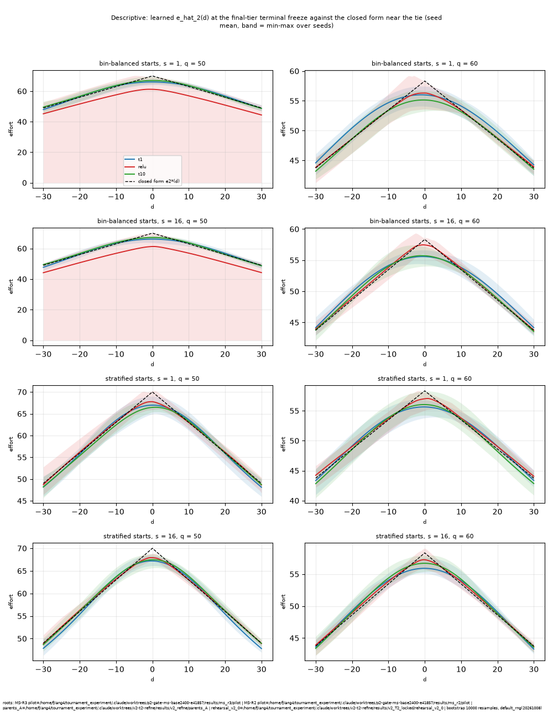
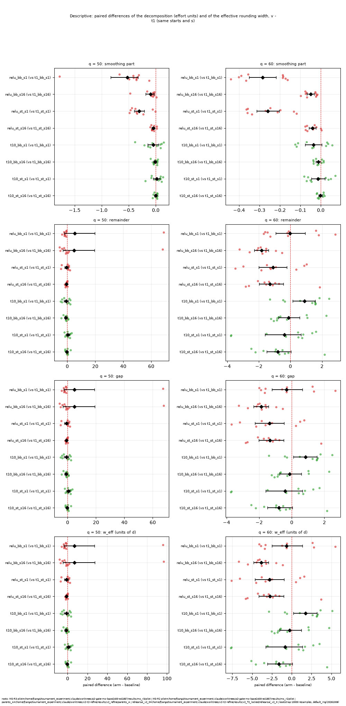
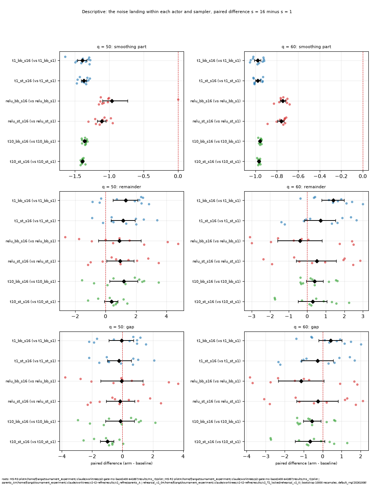
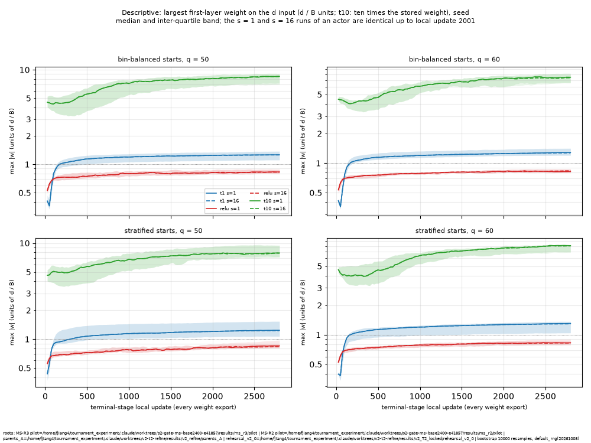
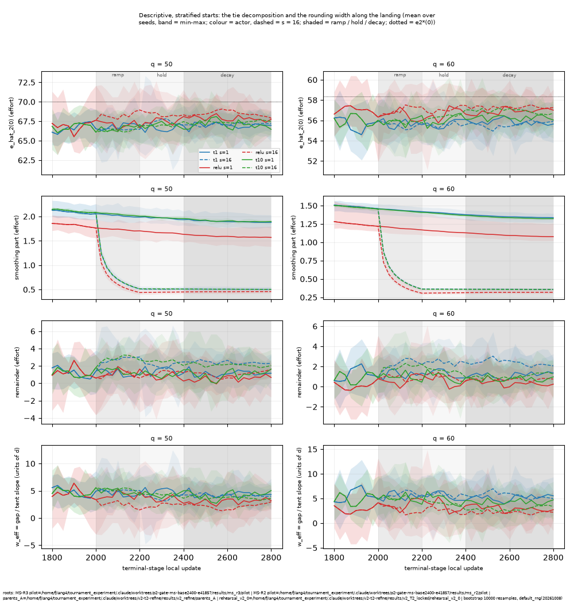
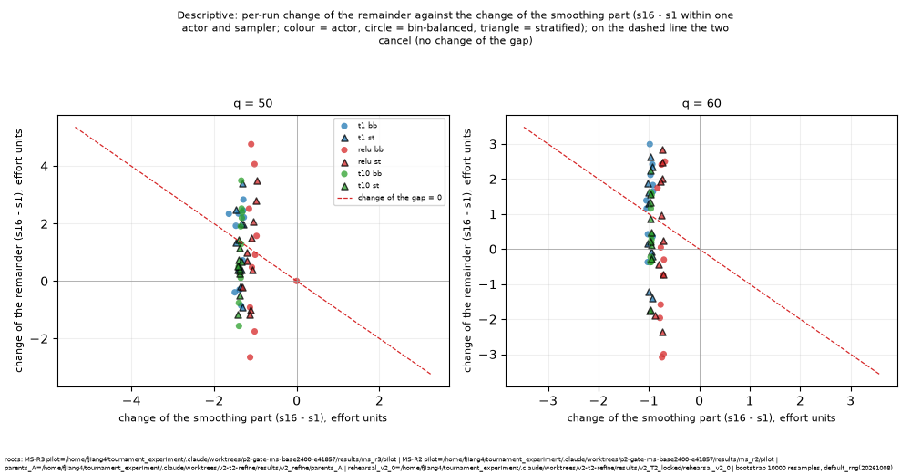

# MS-R3 pilot (P2): results of the 240 runs

Date: 2026-10-08. Branch `ms-r3`. The twelve arms of D4 (`{t1,relu,t10}_{bb,st}_s{1,16}`: the actor variant crossed with the start sampler, bin-balanced or stratified, and the terminal-stage concentration scale s in {1, 16}), 20 runs per arm (q in {50, 60} x seeds 10501-10510), terminal stage fixed at 2800 updates, stage 1 as `MS_base` (600 updates, scale reset to 1.0). Everything below is read from `results/ms_r3/analysis/` (written by `tools/ms/r3_analysis.py`; its criterion and its transmission and interaction tables are recomputed independently by `tools/ms/r3_blind_criterion.py`, agreement of 684 numbers) and the launch files. Every table is printed by `python reports/ms/r3/report_scripts/pilot_tables.py --block <name> [--arm <arm> | --actor <actor>]` (the block is named at each table), the supervised-screen numbers by `screen_tables.py`; the figures are the PNG files of `results/ms_r3/analysis/figures/` (`tie_profile_runs.png` is drawn by `reports/ms/r3/report_scripts/tie_profile_runs.py`). The blocks `primary_median`, `robust` and `failures` are post hoc supplements, not part of D6; they are labelled where they appear.

Reading the tables. `arm - baseline` differences of |peak error| (`stage2_peak_rel_err_abs`, final tier) are negative when the arm is better. The signed peak error is `(e_hat_2(0) - e_2*(0)) / e_2*(0)` at the terminal-stage freeze; the gap is `e_2*(0) - e_hat_2(0)` (`e_2*(0)` = 70.0 at q = 50 and 58.33 at q = 60), the sum of the smoothing part `e_2*(0) - e_sigma(0)` and the remainder `e_sigma(0) - e_hat_2(0)` (`reports/ms/r2/01_decomposition.md`); where the signed peak error is negative in every run, |peak error| equals gap / `e_2*(0)`. `w_eff` = gap / (`e_2*(0)` / 2q) is the rounding width in units of d. `*` marks a 95 % percentile bootstrap interval that excludes 0 (10,000 resamples, a fresh `default_rng(20261008)` per (q, statistic)). Ten seeds per (arm, q): an interval that contains 0 does not show that an effect is absent, and a mean of ten is moved by one failed run (section 3.2). `parents_A` and `rehearsal_v2_0` are the same terminal-stage candidate (MS-R1 `03_checks.md`, C-MS1).

## 1. Checks first (prompt section 3.2)

Output `results/ms_r3/pilot/launch_checks.json` (tool `tools/ms/r3_launch_checks.py`); the C-R6 check of P1 (the unchanged v2.0 entry point, 20 of 20 identical to `rehearsal_v2_0`) is in `03_checks.md` section 3.

| check | result |
|---|---|
| status exit 0 / manifest at the launch commit, clean tree / files complete / global-RNG assertions / tail-share coverage | 240/240 / 240/240 / 240/240 / 240/240 / 240/240 |
| start-share tests (flagged at \|z\| > 3; expected by chance) | 720 tests, 0 flagged (1.9 expected) |
| applied scale equals the D3 schedule at every update; 1.0 throughout stage 1 | 240/240 (expected 240) |
| C-INIT (one `init_state_sha256` across all arms of every (q, seed)) | 20/20 (expected 20) |
| C-NL (s = 16 against s = 1 within each (actor, starts, q, seed) through update 2001, u02025 differs) | 120/120 (expected 120) |
| C-MS5 (each `t1` arm against the MS-R2 `NL_*` arm, whole run, bit for bit) | 80/80 (expected 80) |
| all checks pass | True |

Launch and runs (block `launch`):

- launch record `results/ms_r3/pilot/launch_20261008_002423.json`: wave `r3`, 240 planned, 240 finished, state `done`, workers 40, started 20261008_002423
- nonzero exits: 0; wall per run min 542 s, median 617 s, max 721 s
- HEAD `b41ecefd`, code commit argument `b41ecefd6dc6327f21825dad381b980ad74c23ac`; `git diff --stat <code commit> HEAD -- run utils envs agents protocols` is empty; `git status --porcelain` lists 1920 entries
- parameter file SHA-256 `0fbfc01857c5abe339ab1926361cd57d6e988da20e754fd6dea3ffa4e076b406`; nproc 64, load average at start 11.1, 12.1, 12.8, at the end 22.1, 41.1, 47.7, free disk 998 GB

All checks pass and no stop condition was met; no run was lost, re-run or flagged (`results/ms_r3/pilot/crashed/` does not exist). C-MS5 compared each `t1` arm with MS-R2's `NL_*` arm over the whole run (all 136 weight exports, the whole per-update series with the five stream positions, the check rows of both stages, the freeze arrays, the bin maps, the stage-1 table and the gate values) and found them bit for bit identical in 80 of 80 comparisons: the four `t1` arms of this pilot are MS-R2's four `NL_*` arms re-run on the new code, and their rows below equal the rows of `reports/ms/r2/04_pilot.md`.

## 2. Primary criterion (D6)

For each variant v, starts and s: |peak error| at the terminal freeze, paired by (q, seed) against the `t1` arm with the same starts and s. (a) The interval of the mean paired difference lies below 0 at both q; (b) no run that passes G-A with its G-N(eta) part under `t1` fails it under v. Block `primary`:

| arm | baseline | (a) q=50 mean [95% CI] | met q=50 | (a) q=60 mean [95% CI] | met q=60 | pairs | (b) | overall |
|---|---|---|---|---|---|---|---|---|
| `relu_bb_s1` | `t1_bb_s1` | +0.06907 [-0.03629, +0.26956] | no | -0.00535 [-0.02069, +0.01116] | no | 10+10 | violated (q50/10504 q50/10506) | not met |
| `relu_bb_s16` | `t1_bb_s16` | +0.06906 [-0.04565, +0.27448] | no | -0.03024 [-0.03721, -0.02308] * | yes | 10+10 | violated (q50/10504) | not met |
| `relu_st_s1` | `t1_st_s1` | -0.01077 [-0.03037, +0.00587] | no | -0.02339 [-0.03867, -0.00821] * | yes | 10+10 | violated (q50/10506) | not met |
| `relu_st_s16` | `t1_st_s16` | -0.01039 [-0.01625, -0.00467] * | yes | -0.02059 [-0.03090, -0.00684] * | yes | 10+10 | violated (q50/10506) | not met |
| `t10_bb_s1` | `t1_bb_s1` | -0.01330 [-0.03590, +0.00859] | no | +0.01456 [+0.00187, +0.02646] * | no | 10+10 | holds | not met |
| `t10_bb_s16` | `t1_bb_s16` | -0.01451 [-0.02852, -0.00249] * | yes | -0.00235 [-0.01285, +0.00998] | no | 10+10 | holds | not met |
| `t10_st_s1` | `t1_st_s1` | +0.00721 [-0.00705, +0.02204] | no | -0.00681 [-0.02749, +0.01108] | no | 10+10 | holds | not met |
| `t10_st_s16` | `t1_st_s16` | -0.00381 [-0.01302, +0.00667] | no | -0.01358 [-0.02552, +0.00059] | no | 10+10 | holds | not met |

**Not met in any of the eight rows.** Part (a) holds at both q in one row, `relu_st_s16` (-0.0104 [-0.0163, -0.0047] and -0.0206 [-0.0309, -0.0068]); `relu_bb_s16` and `relu_st_s1` meet it at q = 60 only, `t10_bb_s16` at q = 50 only, and no `t10` row at both q. Part (b) is violated in all four `relu` rows and holds in all four `t10` rows: the runs named are `q50/10504` (a run whose tie effort collapsed to zero, section 3.2) and `q50/10506` (a run with a dead region in the middle stratum, section 3.2); each passed G-A and G-N(eta) under the `t1` arm of the same (q, seed) and fails G-A (eta and RMSE) under `relu`. The mean difference of the two bin-balanced `relu` rows at q = 50 is positive (+0.0691 in both) because of the collapsed run (|peak error| 0.9999 there): the figure shows it at the right edge of the q = 50 panel.

Supplement (post hoc, descriptive; block `primary_median`): the same pairs by their MEDIAN difference with the percentile bootstrap interval of the median (same resamples), which one collapsed run does not move.

| arm | baseline | q=50: mean | q=50: median [95% CI of the median] | q=50: seeds lower | q=60: mean | q=60: median [95% CI of the median] | q=60: seeds lower |
|---|---|---|---|---|---|---|---|
| `relu_bb_s1` | `t1_bb_s1` | +0.0691 | -0.0243 [-0.0374, -0.0156] * | 9/10 | -0.0054 | -0.0080 [-0.0283, +0.0217] | 7/10 |
| `relu_bb_s16` | `t1_bb_s16` | +0.0691 | -0.0194 [-0.0549, +0.0035] | 7/10 | -0.0302 | -0.0296 [-0.0400, -0.0216] * | 10/10 |
| `relu_st_s1` | `t1_st_s1` | -0.0108 | -0.0032 [-0.0348, +0.0112] | 6/10 | -0.0234 | -0.0263 [-0.0432, +0.0044] | 7/10 |
| `relu_st_s16` | `t1_st_s16` | -0.0104 | -0.0102 [-0.0186, -0.0013] * | 8/10 | -0.0206 | -0.0242 [-0.0311, -0.0165] * | 9/10 |
| `t10_bb_s1` | `t1_bb_s1` | -0.0133 | -0.0053 [-0.0531, +0.0226] | 6/10 | +0.0146 | +0.0238 [-0.0053, +0.0284] | 3/10 |
| `t10_bb_s16` | `t1_bb_s16` | -0.0145 | -0.0083 [-0.0297, +0.0023] | 8/10 | -0.0023 | -0.0121 [-0.0163, +0.0172] | 7/10 |
| `t10_st_s1` | `t1_st_s1` | +0.0072 | +0.0020 [-0.0130, +0.0290] | 4/10 | -0.0068 | +0.0069 [-0.0348, +0.0172] | 4/10 |
| `t10_st_s16` | `t1_st_s16` | -0.0038 | -0.0029 [-0.0155, +0.0044] | 5/10 | -0.0136 | -0.0143 [-0.0293, -0.0057] * | 9/10 |

The median difference is negative in all eight `relu` cells (6 to 10 of 10 seeds lower) with the interval below 0 in four (`relu_bb_s1` at q = 50, `relu_bb_s16` at q = 60, `relu_st_s16` at both q); for `t10` it is negative in five of eight cells and the interval is below 0 in one (`t10_st_s16` at q = 60) and above 0 in none. The criterion of D6 is the mean-based one of the table above.

## 3. One section per actor

### 3.1 `t1` (the current actor: tanh on d / B; the four arms are MS-R2's `NL_*` arms re-run)

| arm | q | n | abs(peak)<=0.05 | mean abs(peak) | signed peak mean [95% CI] | signed<0 | RMSE_pos | tail mean | tail max | eta2/DW | G-A+G-N(eta) | R0 (median) | R (median) |
|---|---|---|---|---|---|---|---|---|---|---|---|---|---|
| t1_bb_s1 | 50 | 10 | 5 | 0.0565 | -0.0565 [-0.0697, -0.0437] * | 10 | 0.0199 | 0.0064 | 0.0330 | 0.00127 | 10/10 | 0.0301 | 0.0916 |
| t1_bb_s1 | 60 | 10 | 8 | 0.0401 | -0.0401 [-0.0500, -0.0314] * | 10 | 0.0176 | 0.0078 | 0.0305 | 0.00061 | 10/10 | 0.0247 | 0.0652 |
| t1_bb_s16 | 50 | 10 | 3 | 0.0557 | -0.0557 [-0.0676, -0.0447] * | 10 | 0.0186 | 0.0069 | 0.0340 | 0.00133 | 10/10 | 0.0324 | 0.0961 |
| t1_bb_s16 | 60 | 10 | 6 | 0.0472 | -0.0472 [-0.0544, -0.0404] * | 10 | 0.0166 | 0.0084 | 0.0327 | 0.00055 | 10/10 | 0.0325 | 0.0567 |
| t1_st_s1 | 50 | 10 | 7 | 0.0434 | -0.0434 [-0.0556, -0.0312] * | 10 | 0.0190 | 0.0074 | 0.0337 | 0.00123 | 10/10 | 0.0228 | 0.0886 |
| t1_st_s1 | 60 | 10 | 6 | 0.0461 | -0.0461 [-0.0566, -0.0364] * | 10 | 0.0197 | 0.0081 | 0.0326 | 0.00060 | 10/10 | 0.0299 | 0.0597 |
| t1_st_s16 | 50 | 10 | 8 | 0.0401 | -0.0401 [-0.0461, -0.0336] * | 10 | 0.0146 | 0.0075 | 0.0333 | 0.00070 | 10/10 | 0.0255 | 0.0786 |
| t1_st_s16 | 60 | 10 | 7 | 0.0415 | -0.0415 [-0.0481, -0.0337] * | 10 | 0.0142 | 0.0088 | 0.0329 | 0.00043 | 10/10 | 0.0297 | 0.0503 |

| arm | q | n | sigma_2(0) | gap | smoothing part | remainder | remainder median | remainder seed SD | gap % of e*(0) | smoothing % of e*(0) | remainder % of e*(0) |
|---|---|---|---|---|---|---|---|---|---|---|---|
| t1_bb_s1 | 50 | 10 | 2.414 | 3.958 | 1.905 | 2.053 | 1.518 | 1.471 | 5.65 | 2.72 | 2.93 |
| t1_bb_s1 | 60 | 10 | 2.450 | 2.338 | 1.343 | 0.995 | 0.792 | 0.875 | 4.01 | 2.30 | 1.71 |
| t1_bb_s16 | 50 | 10 | 0.651 | 3.897 | 0.514 | 3.383 | 3.297 | 1.342 | 5.57 | 0.73 | 4.83 |
| t1_bb_s16 | 60 | 10 | 0.665 | 2.755 | 0.365 | 2.390 | 2.419 | 0.707 | 4.72 | 0.63 | 4.10 |
| t1_st_s1 | 50 | 10 | 2.378 | 3.035 | 1.877 | 1.158 | 0.683 | 1.478 | 4.34 | 2.68 | 1.65 |
| t1_st_s1 | 60 | 10 | 2.438 | 2.691 | 1.337 | 1.355 | 1.166 | 1.032 | 4.61 | 2.29 | 2.32 |
| t1_st_s16 | 50 | 10 | 0.641 | 2.809 | 0.506 | 2.303 | 2.500 | 0.761 | 4.01 | 0.72 | 3.29 |
| t1_st_s16 | 60 | 10 | 0.655 | 2.422 | 0.359 | 2.064 | 2.196 | 0.735 | 4.15 | 0.62 | 3.54 |

| arm | q | w_eff (units of d) | w_eff median | R0/\|peak\| final tier (mean) | linearised 2k/(2k+a) | location-free peak error | argmax d (median, min, max) | symmetry error/e2*(0) (mean) | max abs d-weight, last export (d/B, median) | bend width B/max abs w (units of d, median) |
|---|---|---|---|---|---|---|---|---|---|---|
| t1_bb_s1 | 50 | 5.65 | 5.02 | 0.602 | 0.588 | -0.0558 | +0.2, -3.5, +1.5 | 0.0341 | 1.260 | 159 |
| t1_bb_s1 | 60 | 4.81 | 4.35 | 0.682 | 0.673 | -0.0391 | -1.0, -4.0, +1.5 | 0.0300 | 1.284 | 171 |
| t1_bb_s16 | 50 | 5.57 | 5.38 | 0.602 | 0.588 | -0.0553 | +0.0, -3.5, +1.0 | 0.0246 | 1.255 | 159 |
| t1_bb_s16 | 60 | 5.67 | 5.71 | 0.683 | 0.673 | -0.0465 | -0.8, -3.0, +2.0 | 0.0247 | 1.270 | 173 |
| t1_st_s1 | 50 | 4.34 | 3.81 | 0.599 | 0.588 | -0.0425 | -0.2, -1.0, +3.5 | 0.0281 | 1.237 | 162 |
| t1_st_s1 | 60 | 5.54 | 5.26 | 0.683 | 0.673 | -0.0455 | -0.5, -2.0, +3.0 | 0.0342 | 1.303 | 169 |
| t1_st_s16 | 50 | 4.01 | 4.25 | 0.598 | 0.588 | -0.0399 | -0.5, -1.0, +1.0 | 0.0208 | 1.225 | 164 |
| t1_st_s16 | 60 | 4.98 | 5.22 | 0.682 | 0.673 | -0.0411 | +0.0, -2.5, +1.5 | 0.0207 | 1.291 | 170 |

The rows equal those of MS-R2 (C-MS5): |peak error| 0.0565 / 0.0401 (`t1_bb_s1`, q = 50 / 60), gap 5.65 % / 4.01 % of `e_2*(0)`; the rounding width `w_eff` is 4.0-5.7 units of d in the eight cells; the largest first-layer d-weight is 1.23-1.30 (units of d / B), i.e. the sharpest tanh unit bends over 159-173 units of d. R0 / |peak error| is 0.598-0.683 against the linearised 2k / (2k + a) of 0.588 (q = 50) and 0.673 (q = 60). No `t1` run fails a gate.

### 3.2 `relu` (ReLU hidden units, input d / B)

| arm | q | n | abs(peak)<=0.05 | mean abs(peak) | signed peak mean [95% CI] | signed<0 | RMSE_pos | tail mean | tail max | eta2/DW | G-A+G-N(eta) | R0 (median) | R (median) |
|---|---|---|---|---|---|---|---|---|---|---|---|---|---|
| relu_bb_s1 | 50 | 10 | 8 | 0.1256 | -0.1256 [-0.3229, -0.0214] * | 10 | 0.0818 | 0.0023 | 0.0298 | 0.02908 | 8/10 | 0.0145 | 0.0934 |
| relu_bb_s1 | 60 | 10 | 7 | 0.0347 | -0.0347 [-0.0507, -0.0195] * | 10 | 0.0170 | 0.0027 | 0.0290 | 0.00051 | 10/10 | 0.0219 | 0.0549 |
| relu_bb_s16 | 50 | 10 | 7 | 0.1247 | -0.1247 [-0.3234, -0.0177] * | 10 | 0.0717 | 0.0014 | 0.0239 | 0.02660 | 9/10 | 0.0120 | 0.0780 |
| relu_bb_s16 | 60 | 10 | 10 | 0.0170 | -0.0152 [-0.0251, -0.0055] * | 7 | 0.0116 | 0.0018 | 0.0259 | 0.00032 | 10/10 | 0.0105 | 0.0412 |
| relu_st_s1 | 50 | 10 | 9 | 0.0326 | -0.0319 [-0.0423, -0.0205] * | 9 | 0.0438 | 0.0023 | 0.0271 | 0.01101 | 9/10 | 0.0201 | 0.0990 |
| relu_st_s1 | 60 | 10 | 9 | 0.0227 | -0.0227 [-0.0338, -0.0127] * | 10 | 0.0156 | 0.0030 | 0.0318 | 0.00039 | 10/10 | 0.0097 | 0.0491 |
| relu_st_s16 | 50 | 10 | 10 | 0.0297 | -0.0297 [-0.0338, -0.0255] * | 10 | 0.0183 | 0.0019 | 0.0261 | 0.00229 | 9/10 | 0.0168 | 0.0689 |
| relu_st_s16 | 60 | 10 | 10 | 0.0209 | -0.0185 [-0.0290, -0.0079] * | 9 | 0.0124 | 0.0023 | 0.0280 | 0.00036 | 10/10 | 0.0148 | 0.0413 |

| arm | q | n | sigma_2(0) | gap | smoothing part | remainder | remainder median | remainder seed SD | gap % of e*(0) | smoothing % of e*(0) | remainder % of e*(0) |
|---|---|---|---|---|---|---|---|---|---|---|---|
| relu_bb_s1 | 50 | 10 | 1.747 | 8.793 | 1.378 | 7.415 | 0.197 | 22.017 | 12.56 | 1.97 | 10.59 |
| relu_bb_s1 | 60 | 10 | 1.931 | 2.026 | 1.058 | 0.967 | 0.843 | 1.559 | 3.47 | 1.81 | 1.66 |
| relu_bb_s16 | 50 | 10 | 0.529 | 8.731 | 0.417 | 8.314 | 0.979 | 21.727 | 12.47 | 0.60 | 11.88 |
| relu_bb_s16 | 60 | 10 | 0.574 | 0.885 | 0.315 | 0.570 | 0.599 | 0.989 | 1.52 | 0.54 | 0.98 |
| relu_st_s1 | 50 | 10 | 1.989 | 2.236 | 1.570 | 0.666 | 0.736 | 1.205 | 3.19 | 2.24 | 0.95 |
| relu_st_s1 | 60 | 10 | 1.964 | 1.327 | 1.077 | 0.250 | -0.215 | 1.045 | 2.27 | 1.85 | 0.43 |
| relu_st_s16 | 50 | 10 | 0.582 | 2.081 | 0.459 | 1.622 | 1.488 | 0.494 | 2.97 | 0.66 | 2.32 |
| relu_st_s16 | 60 | 10 | 0.580 | 1.077 | 0.318 | 0.759 | 0.748 | 1.050 | 1.85 | 0.55 | 1.30 |

| arm | q | w_eff (units of d) | w_eff median | R0/\|peak\| final tier (mean) | linearised 2k/(2k+a) | location-free peak error | argmax d (median, min, max) | symmetry error/e2*(0) (mean) | max abs d-weight, last export (d/B, median) | bend width B/max abs w (units of d, median) |
|---|---|---|---|---|---|---|---|---|---|---|
| relu_bb_s1 | 50 | 12.56 | 2.44 | 0.635 | 0.588 | -0.1158 | -0.2, -4.5, +89.0 | 0.0500 | 0.831 | 241 |
| relu_bb_s1 | 60 | 4.17 | 3.86 | 0.631 | 0.673 | -0.0295 | +0.0, -4.5, +3.5 | 0.0330 | 0.822 | 268 |
| relu_bb_s16 | 50 | 12.47 | 2.03 | 0.625 | 0.588 | -0.1194 | +0.5, -2.0, +91.5 | 0.0404 | 0.825 | 243 |
| relu_bb_s16 | 60 | 1.82 | 1.87 | 1.056 | 0.673 | -0.0083 | -1.0, -2.5, +2.5 | 0.0365 | 0.836 | 263 |
| relu_st_s1 | 50 | 3.19 | 3.37 | 0.873 | 0.588 | -0.0285 | -0.5, -4.0, +3.0 | 0.0908 | 0.850 | 235 |
| relu_st_s1 | 60 | 2.73 | 1.72 | 0.667 | 0.673 | -0.0191 | +0.8, -4.0, +3.5 | 0.0319 | 0.828 | 266 |
| relu_st_s16 | 50 | 2.97 | 2.83 | 0.596 | 0.588 | -0.0265 | -0.5, -2.5, +3.0 | 0.0431 | 0.835 | 240 |
| relu_st_s16 | 60 | 2.22 | 2.20 | 0.763 | 0.673 | -0.0154 | +0.0, -2.0, +2.0 | 0.0311 | 0.825 | 267 |

Robust summaries (post hoc, descriptive; block `robust`; all twelve arms, so that `relu` can be read against `t1` and `t10`):

| arm | q | median gap | median abs(peak) | gap <= 1 | gap <= 2 | gap > 10 | median RMSE_pos/e2*(0) | median w_eff | gate failures (G-A and G-N(eta)) | max symmetry error/e2*(0) |
|---|---|---|---|---|---|---|---|---|---|---|
| t1_bb_s1 | 50 | 3.51 | 0.0502 | 0 | 0 | 0 | 0.0195 | 5.02 | 0 | 0.067 |
| t1_bb_s1 | 60 | 2.11 | 0.0362 | 1 | 4 | 0 | 0.0179 | 4.35 | 0 | 0.058 |
| t1_bb_s16 | 50 | 3.77 | 0.0538 | 0 | 1 | 0 | 0.0175 | 5.38 | 0 | 0.081 |
| t1_bb_s16 | 60 | 2.78 | 0.0476 | 0 | 1 | 0 | 0.0159 | 5.71 | 0 | 0.046 |
| t1_st_s1 | 50 | 2.67 | 0.0381 | 0 | 3 | 0 | 0.0183 | 3.81 | 0 | 0.049 |
| t1_st_s1 | 60 | 2.56 | 0.0438 | 0 | 3 | 0 | 0.0201 | 5.26 | 0 | 0.056 |
| t1_st_s16 | 50 | 2.98 | 0.0425 | 0 | 2 | 0 | 0.0149 | 4.25 | 0 | 0.029 |
| t1_st_s16 | 60 | 2.54 | 0.0435 | 1 | 2 | 0 | 0.0140 | 5.22 | 0 | 0.027 |
| relu_bb_s1 | 50 | 1.71 | 0.0244 | 2 | 6 | 1 | 0.0229 | 2.44 | 2 | 0.149 |
| relu_bb_s1 | 60 | 1.87 | 0.0321 | 3 | 5 | 0 | 0.0158 | 3.86 | 0 | 0.044 |
| relu_bb_s16 | 50 | 1.42 | 0.0203 | 3 | 6 | 1 | 0.0174 | 2.03 | 1 | 0.091 |
| relu_bb_s16 | 60 | 0.91 | 0.0156 | 5 | 8 | 0 | 0.0107 | 1.87 | 0 | 0.055 |
| relu_st_s1 | 50 | 2.36 | 0.0337 | 2 | 3 | 0 | 0.0209 | 3.37 | 1 | 0.547 |
| relu_st_s1 | 60 | 0.84 | 0.0144 | 6 | 6 | 0 | 0.0166 | 1.72 | 0 | 0.049 |
| relu_st_s16 | 50 | 1.98 | 0.0283 | 0 | 6 | 0 | 0.0125 | 2.83 | 1 | 0.180 |
| relu_st_s16 | 60 | 1.07 | 0.0183 | 4 | 8 | 0 | 0.0123 | 2.20 | 0 | 0.044 |
| t10_bb_s1 | 50 | 2.86 | 0.0408 | 1 | 3 | 0 | 0.0218 | 4.08 | 0 | 0.063 |
| t10_bb_s1 | 60 | 3.10 | 0.0532 | 0 | 2 | 0 | 0.0194 | 6.39 | 0 | 0.058 |
| t10_bb_s16 | 50 | 2.86 | 0.0408 | 0 | 1 | 0 | 0.0133 | 4.08 | 0 | 0.043 |
| t10_bb_s16 | 60 | 2.51 | 0.0429 | 0 | 2 | 0 | 0.0123 | 5.15 | 0 | 0.044 |
| t10_st_s1 | 50 | 3.33 | 0.0476 | 0 | 0 | 0 | 0.0177 | 4.76 | 0 | 0.049 |
| t10_st_s1 | 60 | 2.27 | 0.0389 | 2 | 4 | 0 | 0.0170 | 4.67 | 0 | 0.041 |
| t10_st_s16 | 50 | 2.34 | 0.0334 | 0 | 3 | 0 | 0.0135 | 3.34 | 0 | 0.029 |
| t10_st_s16 | 60 | 1.73 | 0.0297 | 3 | 5 | 0 | 0.0135 | 3.57 | 0 | 0.042 |

Reading (descriptive). **The typical `relu` run has a smaller tie deficit than the typical `t1` run.** The median gap is 1.71 / 1.87 (`relu_bb_s1`, q = 50 / 60), 1.42 / 0.91 (`relu_bb_s16`), 2.36 / 0.84 (`relu_st_s1`) and 1.98 / 1.07 (`relu_st_s16`) effort units against 3.51 / 2.11, 3.77 / 2.78, 2.67 / 2.56 and 2.98 / 2.54 for the matching `t1` arms; 3-6 of 10 `relu` runs have a gap of at most 1 effort unit in each of the four q = 60 arms against 0-1 of 10 for `t1` (at q = 50: 0-3 against 0). The smoothing part and sigma_2(0) are lower than under `t1` in all eight cells (sigma_2(0) at s = 1: 1.75 / 1.93 / 1.99 / 1.96 against 2.41 / 2.45 / 2.38 / 2.44), and the tail mean is lower in all eight (0.0014-0.0030 of `e_2*(0)` against 0.0064-0.0088). The largest first-layer d-weight is 0.82-0.85 (bend width 235-268 units of d). The PPO diagnostics differ from `t1`: the mean KL per update is 0.0113-0.0117 in the training segment against 0.0070-0.0080 for `t1` and `t10`, and in the hold segment at s = 16 0.076-0.089 against 0.030-0.036 with clip fractions of 0.19-0.24 against 0.16-0.19 (block `segments`, section 10).

**Five `relu` runs fail G-A, all at q = 50** (block `failures`, post hoc):

| arm | q | seed | gap | e_hat_2(0) | RMSE_pos/e2*(0) | eta_2/DW | eta_dev/DW | G-A: eta / RMSE / tail | G-N(eta) | symmetry error/e2*(0) | R0 |
|---|---|---|---|---|---|---|---|---|---|---|---|
| relu_bb_s1 | 50 | 10504 | 70.000 | 0.000 | 0.5779 | 0.25926 | 0.25896 | F/F/P | P | 0.057 | 1.0000 |
| relu_bb_s1 | 50 | 10506 | 2.894 | 67.106 | 0.0738 | 0.02149 | 0.02146 | F/F/P | P | 0.149 | 0.0247 |
| relu_bb_s16 | 50 | 10504 | 70.000 | 0.000 | 0.5780 | 0.25926 | 0.25896 | F/F/P | P | 0.039 | 1.0000 |
| relu_st_s1 | 50 | 10506 | 3.477 | 66.523 | 0.2433 | 0.09928 | 0.09887 | F/F/P | P | 0.547 | 0.0298 |
| relu_st_s16 | 50 | 10506 | 1.963 | 68.037 | 0.0695 | 0.01805 | 0.01753 | F/F/P | P | 0.180 | 0.0167 |

- **`q50/10504` (`relu_bb_s1` and `relu_bb_s16`, one run up to update 2001): the policy lost its tie effort.** e_hat_2(0) = 0.0001 (the mean clamp, effort 1e-4) at the freeze, gap 70.00, RMSE_pos / `e_2*(0)` 0.578, eta_2 / DW 0.259, stage-1 error -1.0000. In its check table (`ms_checks_stage2.csv`) the tie effort is learned normally for 825 updates (gap 0.5-7.9 effort units, R0 <= 0.07), then R0 goes from 0.070 (local 825) to 0.978 (850), 0.899 (875) and 0.9997 (900) and stays there to update 2800; its RMSE_pos was already 0.35-0.41 of `e_2*(0)` at local 750-825. The same seed under `relu_st_s1` and `relu_st_s16` has gaps 2.27 and 2.68 and passes.
- **`q50/10506` (four `relu` arms): a dead region in the middle stratum, with a good tie.** The gaps are 2.89, 0.84, 3.48 and 1.96 (`relu_bb_s1`, `relu_bb_s16`, `relu_st_s1`, `relu_st_s16`); three of the four runs fail G-A (eta and RMSE) with RMSE_pos / `e_2*(0)` of 0.074, 0.243 and 0.070 and eta_2 / DW of 0.021, 0.099 and 0.018; the symmetry error is 0.149, 0.547 and 0.180 of `e_2*(0)` (0.547 is 38.3 effort units, at |d| = 35 in `relu_st_s1`). In `relu_st_s1` the middle stratum has a mean signed error of -19.8 effort units on d < 0 (max |error| 44.5; strata tables, section 11). The fourth run (`relu_bb_s16`) passes.
- Seeds 10504 and 10506 at q = 50 are the only gate failures of the pilot: no `t1` run and no `t10` run fails a gate.

Hidden-unit activity of the `relu` actors (post hoc, descriptive; `reports/ms/r3/report_scripts/relu_units.py`, `results/ms_r3/analysis/relu_units.csv`): a unit is counted alive when its ReLU output is positive somewhere on D_2 at the freeze (stage input (1, d / B), step 0.5 in d).

| arm | q | layer-1 units alive (of 64): median [min, max] | layer-2 units alive (of 64): median [min, max] |
|---|---|---|---|
| relu_bb_s1 | 50 | 44.0 [40, 48] | 44.0 [43, 49] |
| relu_bb_s1 | 60 | 41.5 [36, 47] | 47.0 [43, 49] |
| relu_bb_s16 | 50 | 44.0 [40, 48] | 43.0 [43, 49] |
| relu_bb_s16 | 60 | 41.5 [37, 47] | 47.0 [43, 49] |
| relu_st_s1 | 50 | 45.5 [39, 50] | 45.5 [42, 51] |
| relu_st_s1 | 60 | 42.0 [37, 45] | 45.5 [39, 50] |
| relu_st_s16 | 50 | 45.5 [39, 50] | 45.5 [42, 51] |
| relu_st_s16 | 60 | 42.0 [37, 45] | 45.5 [39, 50] |

The five failed runs (the network output over D_2: minimum / maximum / value at d = 0):

| arm | q | seed | layer-1 alive | layer-2 alive | effort min / max / at d = 0 over D_2 |
|---|---|---|---|---|---|
| relu_bb_s1 | 50 | 10504 | 44 | 46 | 0.00 / 3.98 / 0.00 |
| relu_bb_s1 | 50 | 10506 | 42 | 47 | 0.00 / 67.12 / 67.11 |
| relu_bb_s16 | 50 | 10504 | 44 | 46 | 0.00 / 2.73 / 0.00 |
| relu_st_s1 | 50 | 10506 | 43 | 47 | 0.00 / 67.06 / 66.52 |
| relu_st_s16 | 50 | 10506 | 43 | 47 | 0.00 / 68.24 / 68.04 |

Over the 80 `relu` runs 36-50 of the 64 first-layer units and 39-51 of the 64 second-layer units are alive, i.e. 14-28 first-layer units are never active on D_2, in good and failed runs alike; the failed runs have 42-44 first-layer and 46-47 second-layer alive units, inside the range of the others. The collapsed run's output is below 4 effort units everywhere on D_2 (it has 44 and 46 alive units).

The figure (every run thin, the seed median thick; the collapsed run lies below the plotted range) shows the `relu` median closer to the cusp than the `t1` and `t10` medians in most panels; the analysis figure with seed means and min-max bands (`tie_profile_near_tie.png`) is pulled down in the two bin-balanced q = 50 panels by the collapsed run.

### 3.3 `t10` (tanh hidden units, input 10 d / B)

| arm | q | n | abs(peak)<=0.05 | mean abs(peak) | signed peak mean [95% CI] | signed<0 | RMSE_pos | tail mean | tail max | eta2/DW | G-A+G-N(eta) | R0 (median) | R (median) |
|---|---|---|---|---|---|---|---|---|---|---|---|---|---|
| t10_bb_s1 | 50 | 10 | 6 | 0.0432 | -0.0432 [-0.0561, -0.0305] * | 10 | 0.0222 | 0.0036 | 0.0214 | 0.00110 | 10/10 | 0.0244 | 0.0915 |
| t10_bb_s1 | 60 | 10 | 5 | 0.0546 | -0.0546 [-0.0665, -0.0434] * | 10 | 0.0191 | 0.0043 | 0.0258 | 0.00069 | 10/10 | 0.0364 | 0.0558 |
| t10_bb_s16 | 50 | 10 | 9 | 0.0412 | -0.0412 [-0.0473, -0.0352] * | 10 | 0.0133 | 0.0043 | 0.0257 | 0.00056 | 10/10 | 0.0244 | 0.0600 |
| t10_bb_s16 | 60 | 10 | 7 | 0.0449 | -0.0449 [-0.0540, -0.0361] * | 10 | 0.0126 | 0.0047 | 0.0249 | 0.00046 | 10/10 | 0.0293 | 0.0463 |
| t10_st_s1 | 50 | 10 | 6 | 0.0506 | -0.0506 [-0.0576, -0.0435] * | 10 | 0.0179 | 0.0043 | 0.0260 | 0.00082 | 10/10 | 0.0286 | 0.0769 |
| t10_st_s1 | 60 | 10 | 7 | 0.0393 | -0.0393 [-0.0515, -0.0268] * | 10 | 0.0191 | 0.0048 | 0.0260 | 0.00062 | 10/10 | 0.0265 | 0.0577 |
| t10_st_s16 | 50 | 10 | 8 | 0.0363 | -0.0363 [-0.0453, -0.0280] * | 10 | 0.0132 | 0.0046 | 0.0241 | 0.00066 | 10/10 | 0.0199 | 0.0655 |
| t10_st_s16 | 60 | 10 | 9 | 0.0279 | -0.0279 [-0.0368, -0.0190] * | 10 | 0.0137 | 0.0058 | 0.0294 | 0.00034 | 10/10 | 0.0202 | 0.0409 |

| arm | q | n | sigma_2(0) | gap | smoothing part | remainder | remainder median | remainder seed SD | gap % of e*(0) | smoothing % of e*(0) | remainder % of e*(0) |
|---|---|---|---|---|---|---|---|---|---|---|---|
| t10_bb_s1 | 50 | 10 | 2.356 | 3.027 | 1.859 | 1.168 | 1.004 | 1.518 | 4.32 | 2.66 | 1.67 |
| t10_bb_s1 | 60 | 10 | 2.385 | 3.187 | 1.307 | 1.880 | 1.809 | 1.153 | 5.46 | 2.24 | 3.22 |
| t10_bb_s16 | 50 | 10 | 0.637 | 2.882 | 0.503 | 2.379 | 2.360 | 0.718 | 4.12 | 0.72 | 3.40 |
| t10_bb_s16 | 60 | 10 | 0.642 | 2.618 | 0.352 | 2.266 | 2.150 | 0.900 | 4.49 | 0.60 | 3.88 |
| t10_st_s1 | 50 | 10 | 2.402 | 3.540 | 1.896 | 1.643 | 1.417 | 0.824 | 5.06 | 2.71 | 2.35 |
| t10_st_s1 | 60 | 10 | 2.413 | 2.294 | 1.323 | 0.972 | 0.955 | 1.230 | 3.93 | 2.27 | 1.67 |
| t10_st_s16 | 50 | 10 | 0.640 | 2.542 | 0.505 | 2.036 | 1.824 | 1.020 | 3.63 | 0.72 | 2.91 |
| t10_st_s16 | 60 | 10 | 0.651 | 1.630 | 0.357 | 1.274 | 1.381 | 0.886 | 2.79 | 0.61 | 2.18 |

| arm | q | w_eff (units of d) | w_eff median | R0/\|peak\| final tier (mean) | linearised 2k/(2k+a) | location-free peak error | argmax d (median, min, max) | symmetry error/e2*(0) (mean) | max abs d-weight, last export (d/B, median) | bend width B/max abs w (units of d, median) |
|---|---|---|---|---|---|---|---|---|---|---|
| t10_bb_s1 | 50 | 4.32 | 4.08 | 0.599 | 0.588 | -0.0428 | +0.2, -1.0, +1.5 | 0.0388 | 8.510 | 24 |
| t10_bb_s1 | 60 | 6.56 | 6.39 | 0.685 | 0.673 | -0.0528 | +0.5, -4.0, +3.0 | 0.0379 | 7.491 | 29 |
| t10_bb_s16 | 50 | 4.12 | 4.08 | 0.598 | 0.588 | -0.0401 | +0.0, -1.5, +3.5 | 0.0290 | 8.474 | 24 |
| t10_bb_s16 | 60 | 5.39 | 5.15 | 0.683 | 0.673 | -0.0440 | -0.5, -3.0, +1.0 | 0.0236 | 7.407 | 30 |
| t10_st_s1 | 50 | 5.06 | 4.76 | 0.601 | 0.588 | -0.0495 | +1.0, -1.0, +3.0 | 0.0350 | 7.890 | 25 |
| t10_st_s1 | 60 | 4.72 | 4.67 | 0.614 | 0.673 | -0.0390 | -0.2, -2.0, +2.0 | 0.0265 | 8.089 | 27 |
| t10_st_s16 | 50 | 3.63 | 3.34 | 0.597 | 0.588 | -0.0355 | +0.8, -1.5, +2.5 | 0.0234 | 7.840 | 26 |
| t10_st_s16 | 60 | 3.35 | 3.57 | 0.672 | 0.673 | -0.0274 | -0.2, -2.0, +1.5 | 0.0289 | 8.033 | 27 |

Reading (descriptive). **The finer d input did not change the tie deficit.** The mean |peak error| is within 0.015 of the `t1` arm's in every arm (0.0432 / 0.0546 for `t10_bb_s1` against 0.0565 / 0.0401), the rounding width `w_eff` is 3.4-6.6 units of d (`t1`: 4.0-5.7), the median gap 1.73-3.33 (`t1`: 2.11-3.77), although the largest first-layer d-weight is 7.4-8.5 (units of d / B, ten times the stored 0.74-0.85) and the sharpest unit bends over 24-30 units of d against 159-173 for `t1`. The tail mean is lower than under `t1` in all eight cells (0.0036-0.0058 of `e_2*(0)`), and RMSE_pos at s = 16 is lower in all four arms (0.0126-0.0137 against 0.0142-0.0186). The PPO diagnostics are those of `t1` (KL in the training segment 0.0075-0.0080, hold at s = 16 0.030-0.035). No `t10` run fails a gate.

## 4. Paired changes against `t1` (secondary; blocks `secondary` and `directions`)

Per variant and metric over the eight (starts, s, q) cells (block `directions`):

| variant | metric | cells | mean change < 0 | interval below 0 | interval above 0 | range of the mean changes |
|---|---|---|---|---|---|---|
| relu | abs(peak error) | 8 | 6 | 4 | 0 | -0.0302 to +0.0691 |
| relu | signed peak error | 8 | 2 | 0 | 4 | -0.0691 to +0.0321 |
| relu | gap | 8 | 6 | 4 | 0 | -1.870 to +4.835 |
| relu | smoothing part | 8 | 8 | 8 | 0 | -0.528 to -0.041 |
| relu | remainder | 8 | 6 | 4 | 0 | -1.820 to +5.362 |
| relu | sigma_2(0) | 8 | 8 | 8 | 0 | -0.667 to -0.059 |
| relu | RMSE_pos/e2*(0) | 8 | 4 | 3 | 0 | -0.0050 to +0.0620 |
| relu | tail mean/e2*(0) | 8 | 8 | 8 | 0 | -0.0066 to -0.0040 |
| relu | eta_2/DW | 8 | 4 | 1 | 0 | -0.00023 to +0.02781 |
| relu | R0 | 8 | 6 | 4 | 0 | -0.0196 to +0.0812 |
| relu | R | 8 | 4 | 2 | 0 | -0.0163 to +0.2029 |
| relu | w_eff (units of d) | 8 | 6 | 4 | 0 | -3.847 to +6.907 |
| relu | location-free peak error | 8 | 2 | 0 | 4 | -0.0641 to +0.0382 |
| relu | symmetry error/e2*(0) | 8 | 1 | 0 | 5 | -0.0024 to +0.0627 |
| relu | max abs first-layer d-weight (d/B) | 8 | 8 | 8 | 0 | -0.446 to -0.356 |
| t10 | abs(peak error) | 8 | 6 | 1 | 1 | -0.0145 to +0.0146 |
| t10 | signed peak error | 8 | 2 | 1 | 1 | -0.0146 to +0.0145 |
| t10 | gap | 8 | 6 | 1 | 1 | -1.016 to +0.849 |
| t10 | smoothing part | 8 | 7 | 1 | 0 | -0.046 to +0.019 |
| t10 | remainder | 8 | 6 | 1 | 1 | -1.004 to +0.885 |
| t10 | sigma_2(0) | 8 | 7 | 1 | 0 | -0.065 to +0.024 |
| t10 | RMSE_pos/e2*(0) | 8 | 6 | 2 | 0 | -0.0053 to +0.0023 |
| t10 | tail mean/e2*(0) | 8 | 8 | 8 | 0 | -0.0038 to -0.0026 |
| t10 | eta_2/DW | 8 | 6 | 1 | 0 | -0.00077 to +0.00009 |
| t10 | R0 | 8 | 6 | 1 | 1 | -0.0094 to +0.0101 |
| t10 | R | 8 | 6 | 2 | 0 | -0.0397 to +0.0046 |
| t10 | w_eff (units of d) | 8 | 6 | 1 | 1 | -1.629 to +1.747 |
| t10 | location-free peak error | 8 | 2 | 1 | 1 | -0.0137 to +0.0152 |
| t10 | symmetry error/e2*(0) | 8 | 2 | 0 | 2 | -0.0077 to +0.0083 |
| t10 | max abs first-layer d-weight (d/B) | 8 | 0 | 0 | 8 | +6.042 to +7.068 |

The full paired table (block `secondary`; 10 pairs per cell, "seeds lower" = seeds in which the arm is lower; the two bin-balanced `relu` rows at q = 50 contain the collapsed run):

| arm | baseline | metric | q=50: mean [95% CI] (arm - baseline) | q=50: seeds lower | q=60: mean [95% CI] (arm - baseline) | q=60: seeds lower |
|---|---|---|---|---|---|---|
| `relu_bb_s1` | `t1_bb_s1` | abs(peak error) | +0.0691 [-0.0363, +0.2696] | 9/10 | -0.0054 [-0.0207, +0.0112] | 7/10 |
| `relu_bb_s1` | `t1_bb_s1` | signed peak error | -0.0691 [-0.2696, +0.0363] | 1/10 | +0.0054 [-0.0112, +0.0207] | 3/10 |
| `relu_bb_s1` | `t1_bb_s1` | gap | +4.835 [-2.540, +18.869] | 9/10 | -0.312 [-1.207, +0.651] | 7/10 |
| `relu_bb_s1` | `t1_bb_s1` | smoothing part | -0.528 [-0.832, -0.325] * | 10/10 | -0.285 [-0.352, -0.219] * | 10/10 |
| `relu_bb_s1` | `t1_bb_s1` | remainder | +5.362 [-2.157, +19.669] | 9/10 | -0.028 [-0.926, +0.942] | 7/10 |
| `relu_bb_s1` | `t1_bb_s1` | sigma_2(0) | -0.667 [-1.050, -0.411] * | 10/10 | -0.519 [-0.641, -0.399] * | 10/10 |
| `relu_bb_s1` | `t1_bb_s1` | RMSE_pos/e2*(0) | +0.0620 [-0.0012, +0.1761] | 4/10 | -0.0006 [-0.0038, +0.0026] | 5/10 |
| `relu_bb_s1` | `t1_bb_s1` | tail mean/e2*(0) | -0.0040 [-0.0052, -0.0029] * | 10/10 | -0.0051 [-0.0057, -0.0045] * | 10/10 |
| `relu_bb_s1` | `t1_bb_s1` | eta_2/DW | +0.02781 [-0.00030, +0.07975] | 5/10 | -0.00009 [-0.00033, +0.00017] | 6/10 |
| `relu_bb_s1` | `t1_bb_s1` | R0 | +0.0811 [-0.0223, +0.2816] | 9/10 | -0.0037 [-0.0143, +0.0078] | 7/10 |
| `relu_bb_s1` | `t1_bb_s1` | R | +0.2029 [-0.0057, +0.5355] | 5/10 | -0.0092 [-0.0210, +0.0024] | 5/10 |
| `relu_bb_s1` | `t1_bb_s1` | w_eff (units of d) | +6.907 [-3.629, +26.956] | 9/10 | -0.642 [-2.483, +1.339] | 7/10 |
| `relu_bb_s1` | `t1_bb_s1` | location-free peak error | -0.0600 [-0.2499, +0.0401] | 1/10 | +0.0096 [-0.0095, +0.0278] | 3/10 |
| `relu_bb_s1` | `t1_bb_s1` | symmetry error/e2*(0) | +0.0158 [-0.0042, +0.0419] | 3/10 | +0.0029 [-0.0042, +0.0093] | 3/10 |
| `relu_bb_s1` | `t1_bb_s1` | max abs first-layer d-weight (d/B) | -0.356 [-0.515, -0.173] * | 9/10 | -0.446 [-0.533, -0.346] * | 10/10 |
| `relu_bb_s16` | `t1_bb_s16` | abs(peak error) | +0.0691 [-0.0456, +0.2745] | 7/10 | -0.0302 [-0.0372, -0.0231] * | 10/10 |
| `relu_bb_s16` | `t1_bb_s16` | signed peak error | -0.0691 [-0.2745, +0.0456] | 3/10 | +0.0321 [+0.0243, +0.0399] * | 0/10 |
| `relu_bb_s16` | `t1_bb_s16` | gap | +4.834 [-3.195, +19.214] | 7/10 | -1.870 [-2.327, -1.420] * | 10/10 |
| `relu_bb_s16` | `t1_bb_s16` | smoothing part | -0.097 [-0.189, -0.035] * | 9/10 | -0.050 [-0.067, -0.033] * | 10/10 |
| `relu_bb_s16` | `t1_bb_s16` | remainder | +4.931 [-3.127, +19.380] | 7/10 | -1.820 [-2.274, -1.376] * | 10/10 |
| `relu_bb_s16` | `t1_bb_s16` | sigma_2(0) | -0.122 [-0.239, -0.045] * | 9/10 | -0.091 [-0.123, -0.060] * | 10/10 |
| `relu_bb_s16` | `t1_bb_s16` | RMSE_pos/e2*(0) | +0.0531 [-0.0053, +0.1661] | 5/10 | -0.0050 [-0.0077, -0.0026] * | 10/10 |
| `relu_bb_s16` | `t1_bb_s16` | tail mean/e2*(0) | -0.0054 [-0.0061, -0.0048] * | 10/10 | -0.0066 [-0.0073, -0.0059] * | 10/10 |
| `relu_bb_s16` | `t1_bb_s16` | eta_2/DW | +0.02527 [-0.00081, +0.07693] | 7/10 | -0.00023 [-0.00035, -0.00014] * | 10/10 |
| `relu_bb_s16` | `t1_bb_s16` | R0 | +0.0812 [-0.0279, +0.2846] | 7/10 | -0.0196 [-0.0242, -0.0149] * | 10/10 |
| `relu_bb_s16` | `t1_bb_s16` | R | +0.1399 [-0.0300, +0.4597] | 7/10 | -0.0163 [-0.0262, -0.0070] * | 9/10 |
| `relu_bb_s16` | `t1_bb_s16` | w_eff (units of d) | +6.906 [-4.565, +27.448] | 7/10 | -3.847 [-4.788, -2.921] * | 10/10 |
| `relu_bb_s16` | `t1_bb_s16` | location-free peak error | -0.0641 [-0.2619, +0.0466] | 3/10 | +0.0382 [+0.0321, +0.0444] * | 0/10 |
| `relu_bb_s16` | `t1_bb_s16` | symmetry error/e2*(0) | +0.0158 [+0.0018, +0.0317] * | 2/10 | +0.0119 [+0.0053, +0.0206] * | 0/10 |
| `relu_bb_s16` | `t1_bb_s16` | max abs first-layer d-weight (d/B) | -0.358 [-0.512, -0.181] * | 9/10 | -0.433 [-0.518, -0.336] * | 10/10 |
| `relu_st_s1` | `t1_st_s1` | abs(peak error) | -0.0108 [-0.0304, +0.0059] | 6/10 | -0.0234 [-0.0387, -0.0082] * | 7/10 |
| `relu_st_s1` | `t1_st_s1` | signed peak error | +0.0114 [-0.0059, +0.0320] | 4/10 | +0.0234 [+0.0082, +0.0387] * | 3/10 |
| `relu_st_s1` | `t1_st_s1` | gap | -0.799 [-2.239, +0.411] | 6/10 | -1.365 [-2.256, -0.479] * | 7/10 |
| `relu_st_s1` | `t1_st_s1` | smoothing part | -0.307 [-0.397, -0.209] * | 10/10 | -0.260 [-0.314, -0.204] * | 10/10 |
| `relu_st_s1` | `t1_st_s1` | remainder | -0.492 [-1.893, +0.694] | 3/10 | -1.105 [-2.005, -0.220] * | 7/10 |
| `relu_st_s1` | `t1_st_s1` | sigma_2(0) | -0.389 [-0.502, -0.264] * | 10/10 | -0.474 [-0.573, -0.372] * | 10/10 |
| `relu_st_s1` | `t1_st_s1` | RMSE_pos/e2*(0) | +0.0247 [-0.0016, +0.0707] | 5/10 | -0.0040 [-0.0074, -0.0010] * | 8/10 |
| `relu_st_s1` | `t1_st_s1` | tail mean/e2*(0) | -0.0050 [-0.0060, -0.0040] * | 10/10 | -0.0051 [-0.0061, -0.0043] * | 10/10 |
| `relu_st_s1` | `t1_st_s1` | eta_2/DW | +0.00978 [-0.00054, +0.02963] | 5/10 | -0.00020 [-0.00043, +0.00000] | 7/10 |
| `relu_st_s1` | `t1_st_s1` | R0 | -0.0057 [-0.0164, +0.0036] | 6/10 | -0.0162 [-0.0268, -0.0057] * | 7/10 |
| `relu_st_s1` | `t1_st_s1` | R | +0.0870 [-0.0224, +0.2773] | 6/10 | -0.0106 [-0.0195, -0.0027] * | 8/10 |
| `relu_st_s1` | `t1_st_s1` | w_eff (units of d) | -1.141 [-3.198, +0.587] | 6/10 | -2.807 [-4.640, -0.986] * | 7/10 |
| `relu_st_s1` | `t1_st_s1` | location-free peak error | +0.0140 [-0.0034, +0.0343] | 4/10 | +0.0264 [+0.0113, +0.0414] * | 2/10 |
| `relu_st_s1` | `t1_st_s1` | symmetry error/e2*(0) | +0.0627 [+0.0018, +0.1699] * | 3/10 | -0.0024 [-0.0102, +0.0064] | 6/10 |
| `relu_st_s1` | `t1_st_s1` | max abs first-layer d-weight (d/B) | -0.394 [-0.549, -0.240] * | 10/10 | -0.394 [-0.510, -0.266] * | 10/10 |
| `relu_st_s16` | `t1_st_s16` | abs(peak error) | -0.0104 [-0.0162, -0.0047] * | 8/10 | -0.0206 [-0.0309, -0.0068] * | 9/10 |
| `relu_st_s16` | `t1_st_s16` | signed peak error | +0.0104 [+0.0047, +0.0162] * | 2/10 | +0.0231 [+0.0083, +0.0346] * | 1/10 |
| `relu_st_s16` | `t1_st_s16` | gap | -0.727 [-1.137, -0.327] * | 8/10 | -1.345 [-2.019, -0.483] * | 9/10 |
| `relu_st_s16` | `t1_st_s16` | smoothing part | -0.046 [-0.069, -0.022] * | 8/10 | -0.041 [-0.058, -0.023] * | 9/10 |
| `relu_st_s16` | `t1_st_s16` | remainder | -0.681 [-1.099, -0.279] * | 8/10 | -1.304 [-1.979, -0.437] * | 9/10 |
| `relu_st_s16` | `t1_st_s16` | sigma_2(0) | -0.059 [-0.087, -0.027] * | 8/10 | -0.075 [-0.106, -0.043] * | 9/10 |
| `relu_st_s16` | `t1_st_s16` | RMSE_pos/e2*(0) | +0.0037 [-0.0034, +0.0155] | 7/10 | -0.0018 [-0.0034, -0.0003] * | 7/10 |
| `relu_st_s16` | `t1_st_s16` | tail mean/e2*(0) | -0.0056 [-0.0065, -0.0044] * | 10/10 | -0.0065 [-0.0081, -0.0052] * | 10/10 |
| `relu_st_s16` | `t1_st_s16` | eta_2/DW | +0.00159 [-0.00023, +0.00510] | 7/10 | -0.00007 [-0.00016, +0.00003] | 7/10 |
| `relu_st_s16` | `t1_st_s16` | R0 | -0.0063 [-0.0099, -0.0028] * | 8/10 | -0.0126 [-0.0205, -0.0031] * | 9/10 |
| `relu_st_s16` | `t1_st_s16` | R | +0.0269 [-0.0178, +0.1032] | 6/10 | -0.0085 [-0.0182, +0.0025] | 7/10 |
| `relu_st_s16` | `t1_st_s16` | w_eff (units of d) | -1.039 [-1.625, -0.467] * | 8/10 | -2.767 [-4.153, -0.995] * | 9/10 |
| `relu_st_s16` | `t1_st_s16` | location-free peak error | +0.0134 [+0.0075, +0.0194] * | 1/10 | +0.0256 [+0.0114, +0.0367] * | 1/10 |
| `relu_st_s16` | `t1_st_s16` | symmetry error/e2*(0) | +0.0223 [+0.0004, +0.0545] * | 4/10 | +0.0104 [+0.0032, +0.0172] * | 3/10 |
| `relu_st_s16` | `t1_st_s16` | max abs first-layer d-weight (d/B) | -0.404 [-0.548, -0.262] * | 10/10 | -0.400 [-0.514, -0.274] * | 10/10 |
| `t10_bb_s1` | `t1_bb_s1` | abs(peak error) | -0.0133 [-0.0359, +0.0086] | 6/10 | +0.0146 [+0.0019, +0.0265] * | 3/10 |
| `t10_bb_s1` | `t1_bb_s1` | signed peak error | +0.0133 [-0.0086, +0.0359] | 4/10 | -0.0146 [-0.0265, -0.0019] * | 7/10 |
| `t10_bb_s1` | `t1_bb_s1` | gap | -0.931 [-2.513, +0.601] | 6/10 | +0.849 [+0.109, +1.543] * | 3/10 |
| `t10_bb_s1` | `t1_bb_s1` | smoothing part | -0.046 [-0.150, +0.049] | 5/10 | -0.036 [-0.076, +0.005] | 6/10 |
| `t10_bb_s1` | `t1_bb_s1` | remainder | -0.885 [-2.413, +0.589] | 6/10 | +0.885 [+0.151, +1.571] * | 3/10 |
| `t10_bb_s1` | `t1_bb_s1` | sigma_2(0) | -0.058 [-0.189, +0.061] | 5/10 | -0.065 [-0.139, +0.009] | 6/10 |
| `t10_bb_s1` | `t1_bb_s1` | RMSE_pos/e2*(0) | +0.0023 [-0.0030, +0.0079] | 3/10 | +0.0015 [-0.0024, +0.0054] | 3/10 |
| `t10_bb_s1` | `t1_bb_s1` | tail mean/e2*(0) | -0.0027 [-0.0035, -0.0021] * | 10/10 | -0.0034 [-0.0040, -0.0029] * | 10/10 |
| `t10_bb_s1` | `t1_bb_s1` | eta_2/DW | -0.00017 [-0.00060, +0.00029] | 5/10 | +0.00009 [-0.00025, +0.00047] | 5/10 |
| `t10_bb_s1` | `t1_bb_s1` | R0 | -0.0082 [-0.0221, +0.0053] | 6/10 | +0.0101 [+0.0013, +0.0185] * | 3/10 |
| `t10_bb_s1` | `t1_bb_s1` | R | +0.0046 [-0.0156, +0.0216] | 4/10 | -0.0057 [-0.0231, +0.0131] | 6/10 |
| `t10_bb_s1` | `t1_bb_s1` | w_eff (units of d) | -1.330 [-3.590, +0.859] | 6/10 | +1.747 [+0.225, +3.175] * | 3/10 |
| `t10_bb_s1` | `t1_bb_s1` | location-free peak error | +0.0130 [-0.0088, +0.0356] | 4/10 | -0.0137 [-0.0255, -0.0013] * | 7/10 |
| `t10_bb_s1` | `t1_bb_s1` | symmetry error/e2*(0) | +0.0046 [-0.0090, +0.0160] | 2/10 | +0.0079 [-0.0042, +0.0196] | 4/10 |
| `t10_bb_s1` | `t1_bb_s1` | max abs first-layer d-weight (d/B) | +6.838 [+6.020, +7.616] * | 0/10 | +6.058 [+5.129, +6.902] * | 0/10 |
| `t10_bb_s16` | `t1_bb_s16` | abs(peak error) | -0.0145 [-0.0285, -0.0025] * | 8/10 | -0.0023 [-0.0128, +0.0100] | 7/10 |
| `t10_bb_s16` | `t1_bb_s16` | signed peak error | +0.0145 [+0.0025, +0.0285] * | 2/10 | +0.0023 [-0.0100, +0.0128] | 3/10 |
| `t10_bb_s16` | `t1_bb_s16` | gap | -1.016 [-1.997, -0.174] * | 8/10 | -0.137 [-0.749, +0.582] | 7/10 |
| `t10_bb_s16` | `t1_bb_s16` | smoothing part | -0.011 [-0.039, +0.015] | 5/10 | -0.013 [-0.024, -0.001] * | 6/10 |
| `t10_bb_s16` | `t1_bb_s16` | remainder | -1.004 [-1.967, -0.177] * | 8/10 | -0.124 [-0.741, +0.595] | 7/10 |
| `t10_bb_s16` | `t1_bb_s16` | sigma_2(0) | -0.014 [-0.050, +0.018] | 5/10 | -0.023 [-0.045, -0.001] * | 6/10 |
| `t10_bb_s16` | `t1_bb_s16` | RMSE_pos/e2*(0) | -0.0053 [-0.0096, -0.0019] * | 8/10 | -0.0040 [-0.0068, -0.0016] * | 8/10 |
| `t10_bb_s16` | `t1_bb_s16` | tail mean/e2*(0) | -0.0026 [-0.0038, -0.0016] * | 10/10 | -0.0038 [-0.0043, -0.0032] * | 10/10 |
| `t10_bb_s16` | `t1_bb_s16` | eta_2/DW | -0.00077 [-0.00118, -0.00037] * | 9/10 | -0.00009 [-0.00026, +0.00013] | 7/10 |
| `t10_bb_s16` | `t1_bb_s16` | R0 | -0.0090 [-0.0176, -0.0015] * | 8/10 | -0.0016 [-0.0089, +0.0070] | 7/10 |
| `t10_bb_s16` | `t1_bb_s16` | R | -0.0397 [-0.0577, -0.0226] * | 9/10 | -0.0056 [-0.0160, +0.0071] | 7/10 |
| `t10_bb_s16` | `t1_bb_s16` | w_eff (units of d) | -1.451 [-2.852, -0.249] * | 8/10 | -0.282 [-1.542, +1.198] | 7/10 |
| `t10_bb_s16` | `t1_bb_s16` | location-free peak error | +0.0152 [+0.0031, +0.0291] * | 2/10 | +0.0025 [-0.0101, +0.0135] | 3/10 |
| `t10_bb_s16` | `t1_bb_s16` | symmetry error/e2*(0) | +0.0044 [-0.0128, +0.0158] | 1/10 | -0.0011 [-0.0102, +0.0072] | 5/10 |
| `t10_bb_s16` | `t1_bb_s16` | max abs first-layer d-weight (d/B) | +6.758 [+5.984, +7.499] * | 0/10 | +6.042 [+5.075, +6.956] * | 0/10 |
| `t10_st_s1` | `t1_st_s1` | abs(peak error) | +0.0072 [-0.0071, +0.0220] | 4/10 | -0.0068 [-0.0275, +0.0111] | 4/10 |
| `t10_st_s1` | `t1_st_s1` | signed peak error | -0.0072 [-0.0220, +0.0071] | 6/10 | +0.0068 [-0.0111, +0.0275] | 6/10 |
| `t10_st_s1` | `t1_st_s1` | gap | +0.505 [-0.494, +1.543] | 4/10 | -0.397 [-1.604, +0.646] | 4/10 |
| `t10_st_s1` | `t1_st_s1` | smoothing part | +0.019 [-0.046, +0.076] | 4/10 | -0.014 [-0.046, +0.020] | 6/10 |
| `t10_st_s1` | `t1_st_s1` | remainder | +0.486 [-0.518, +1.508] | 4/10 | -0.383 [-1.605, +0.671] | 4/10 |
| `t10_st_s1` | `t1_st_s1` | sigma_2(0) | +0.024 [-0.058, +0.096] | 4/10 | -0.025 [-0.084, +0.036] | 6/10 |
| `t10_st_s1` | `t1_st_s1` | RMSE_pos/e2*(0) | -0.0011 [-0.0065, +0.0043] | 5/10 | -0.0005 [-0.0057, +0.0051] | 7/10 |
| `t10_st_s1` | `t1_st_s1` | tail mean/e2*(0) | -0.0031 [-0.0040, -0.0022] * | 10/10 | -0.0033 [-0.0042, -0.0025] * | 10/10 |
| `t10_st_s1` | `t1_st_s1` | eta_2/DW | -0.00040 [-0.00093, +0.00011] | 6/10 | +0.00002 [-0.00029, +0.00030] | 5/10 |
| `t10_st_s1` | `t1_st_s1` | R0 | +0.0043 [-0.0044, +0.0134] | 4/10 | -0.0047 [-0.0191, +0.0077] | 4/10 |
| `t10_st_s1` | `t1_st_s1` | R | -0.0304 [-0.0563, -0.0074] * | 6/10 | +0.0030 [-0.0112, +0.0174] | 6/10 |
| `t10_st_s1` | `t1_st_s1` | w_eff (units of d) | +0.721 [-0.705, +2.204] | 4/10 | -0.817 [-3.299, +1.330] | 4/10 |
| `t10_st_s1` | `t1_st_s1` | location-free peak error | -0.0071 [-0.0212, +0.0063] | 6/10 | +0.0065 [-0.0111, +0.0268] | 6/10 |
| `t10_st_s1` | `t1_st_s1` | symmetry error/e2*(0) | +0.0069 [+0.0001, +0.0133] * | 3/10 | -0.0077 [-0.0182, +0.0034] | 6/10 |
| `t10_st_s1` | `t1_st_s1` | max abs first-layer d-weight (d/B) | +7.068 [+6.011, +8.192] * | 0/10 | +6.529 [+5.689, +7.289] * | 0/10 |
| `t10_st_s16` | `t1_st_s16` | abs(peak error) | -0.0038 [-0.0130, +0.0067] | 5/10 | -0.0136 [-0.0255, +0.0006] | 9/10 |
| `t10_st_s16` | `t1_st_s16` | signed peak error | +0.0038 [-0.0067, +0.0130] | 5/10 | +0.0136 [-0.0006, +0.0255] | 1/10 |
| `t10_st_s16` | `t1_st_s16` | gap | -0.267 [-0.911, +0.467] | 5/10 | -0.792 [-1.488, +0.034] | 9/10 |
| `t10_st_s16` | `t1_st_s16` | smoothing part | -0.000 [-0.021, +0.018] | 4/10 | -0.002 [-0.011, +0.007] | 6/10 |
| `t10_st_s16` | `t1_st_s16` | remainder | -0.267 [-0.907, +0.461] | 5/10 | -0.790 [-1.493, +0.039] | 9/10 |
| `t10_st_s16` | `t1_st_s16` | sigma_2(0) | -0.000 [-0.026, +0.023] | 4/10 | -0.004 [-0.019, +0.013] | 6/10 |
| `t10_st_s16` | `t1_st_s16` | RMSE_pos/e2*(0) | -0.0015 [-0.0034, +0.0006] | 7/10 | -0.0005 [-0.0031, +0.0023] | 6/10 |
| `t10_st_s16` | `t1_st_s16` | tail mean/e2*(0) | -0.0028 [-0.0037, -0.0019] * | 10/10 | -0.0031 [-0.0044, -0.0020] * | 10/10 |
| `t10_st_s16` | `t1_st_s16` | eta_2/DW | -0.00004 [-0.00024, +0.00019] | 7/10 | -0.00009 [-0.00018, +0.00001] | 8/10 |
| `t10_st_s16` | `t1_st_s16` | R0 | -0.0023 [-0.0079, +0.0041] | 5/10 | -0.0094 [-0.0176, +0.0004] | 9/10 |
| `t10_st_s16` | `t1_st_s16` | R | -0.0053 [-0.0169, +0.0075] | 7/10 | -0.0054 [-0.0141, +0.0044] | 7/10 |
| `t10_st_s16` | `t1_st_s16` | w_eff (units of d) | -0.381 [-1.302, +0.667] | 5/10 | -1.629 [-3.062, +0.071] | 9/10 |
| `t10_st_s16` | `t1_st_s16` | location-free peak error | +0.0044 [-0.0062, +0.0134] | 3/10 | +0.0137 [-0.0005, +0.0259] | 1/10 |
| `t10_st_s16` | `t1_st_s16` | symmetry error/e2*(0) | +0.0026 [-0.0007, +0.0057] | 4/10 | +0.0083 [+0.0032, +0.0132] * | 2/10 |
| `t10_st_s16` | `t1_st_s16` | max abs first-layer d-weight (d/B) | +6.935 [+5.897, +8.009] * | 0/10 | +6.449 [+5.610, +7.202] * | 0/10 |

Reading (descriptive). For `relu`: the smoothing part, sigma_2(0), the tail mean and the largest first-layer weight are lower in all eight cells (intervals below 0 in all eight); |peak error|, the gap, the remainder, R0 and `w_eff` are lower in six of eight with the interval below 0 in four and none above 0 (the two cells with higher means are the bin-balanced q = 50 cells that contain the collapsed run); RMSE_pos is lower in four cells (intervals below 0 in three) and higher in the four q = 50 cells that contain failed runs, with no interval above 0; eta_2 is lower in four cells (one interval below 0) and R in four (two below 0). For `t10`: the tail mean is lower in all eight cells (intervals below 0), the largest first-layer weight is higher in all eight (+6.0 to +7.1 in units of d / B), |peak error|, the gap and `w_eff` change by -0.0145 to +0.0146, -1.02 to +0.85 and -1.6 to +1.7 with one interval below 0 and one above 0.

## 5. The noise landing within each actor (s = 16 against s = 1)

Paired changes of the same (actor, starts, q, seed) between its s = 1 and s = 16 runs (the C-NL pairs; block `landing`):

| arm | baseline | metric | q=50: mean [95% CI] (arm - baseline) | q=50: seeds lower | q=60: mean [95% CI] (arm - baseline) | q=60: seeds lower |
|---|---|---|---|---|---|---|
| `t1_bb_s16` | `t1_bb_s1` | abs(peak error) | -0.0009 [-0.0130, +0.0104] | 4/10 | +0.0072 [-0.0035, +0.0174] | 3/10 |
| `t1_bb_s16` | `t1_bb_s1` | gap | -0.061 [-0.907, +0.726] | 4/10 | +0.417 [-0.206, +1.013] | 3/10 |
| `t1_bb_s16` | `t1_bb_s1` | smoothing part | -1.392 [-1.465, -1.328] * | 10/10 | -0.978 [-1.009, -0.948] * | 10/10 |
| `t1_bb_s16` | `t1_bb_s1` | remainder | +1.331 [+0.482, +2.108] * | 3/10 | +1.395 [+0.787, +1.983] * | 1/10 |
| `t1_bb_s16` | `t1_bb_s1` | sigma_2(0) | -1.763 [-1.856, -1.682] * | 10/10 | -1.784 [-1.841, -1.729] * | 10/10 |
| `t1_bb_s16` | `t1_bb_s1` | RMSE_pos/e2*(0) | -0.0012 [-0.0045, +0.0025] | 7/10 | -0.0010 [-0.0026, +0.0007] | 7/10 |
| `t1_bb_s16` | `t1_bb_s1` | R0 | -0.0006 [-0.0080, +0.0064] | 4/10 | +0.0049 [-0.0025, +0.0120] | 3/10 |
| `t1_bb_s16` | `t1_bb_s1` | w_eff (units of d) | -0.087 [-1.295, +1.037] | 4/10 | +0.858 [-0.423, +2.085] | 3/10 |
| `t1_st_s16` | `t1_st_s1` | abs(peak error) | -0.0032 [-0.0144, +0.0083] | 6/10 | -0.0046 [-0.0193, +0.0094] | 5/10 |
| `t1_st_s16` | `t1_st_s1` | gap | -0.226 [-1.011, +0.582] | 6/10 | -0.269 [-1.123, +0.551] | 5/10 |
| `t1_st_s16` | `t1_st_s1` | smoothing part | -1.371 [-1.410, -1.334] * | 10/10 | -0.978 [-1.000, -0.955] * | 10/10 |
| `t1_st_s16` | `t1_st_s1` | remainder | +1.145 [+0.367, +1.950] * | 2/10 | +0.709 [-0.150, +1.531] | 4/10 |
| `t1_st_s16` | `t1_st_s1` | sigma_2(0) | -1.737 [-1.786, -1.690] * | 10/10 | -1.784 [-1.823, -1.742] * | 10/10 |
| `t1_st_s16` | `t1_st_s1` | RMSE_pos/e2*(0) | -0.0044 [-0.0082, -0.0007] * | 6/10 | -0.0054 [-0.0084, -0.0027] * | 9/10 |
| `t1_st_s16` | `t1_st_s1` | R0 | -0.0020 [-0.0089, +0.0050] | 6/10 | -0.0032 [-0.0134, +0.0065] | 5/10 |
| `t1_st_s16` | `t1_st_s1` | w_eff (units of d) | -0.323 [-1.444, +0.832] | 6/10 | -0.553 [-2.311, +1.133] | 5/10 |
| `relu_bb_s16` | `relu_bb_s1` | abs(peak error) | -0.0009 [-0.0206, +0.0193] | 5/10 | -0.0177 [-0.0375, +0.0024] | 7/10 |
| `relu_bb_s16` | `relu_bb_s1` | gap | -0.061 [-1.440, +1.351] | 5/10 | -1.141 [-2.333, +0.061] | 7/10 |
| `relu_bb_s16` | `relu_bb_s1` | smoothing part | -0.961 [-1.096, -0.734] * | 9/10 | -0.744 [-0.770, -0.719] * | 10/10 |
| `relu_bb_s16` | `relu_bb_s1` | remainder | +0.900 [-0.484, +2.331] | 4/10 | -0.397 [-1.592, +0.806] | 6/10 |
| `relu_bb_s16` | `relu_bb_s1` | sigma_2(0) | -1.218 [-1.389, -0.933] * | 10/10 | -1.356 [-1.404, -1.312] * | 10/10 |
| `relu_bb_s16` | `relu_bb_s1` | RMSE_pos/e2*(0) | -0.0101 [-0.0222, -0.0020] * | 7/10 | -0.0054 [-0.0086, -0.0025] * | 8/10 |
| `relu_bb_s16` | `relu_bb_s1` | R0 | -0.0005 [-0.0125, +0.0117] | 5/10 | -0.0110 [-0.0243, +0.0026] | 6/10 |
| `relu_bb_s16` | `relu_bb_s1` | w_eff (units of d) | -0.088 [-2.058, +1.930] | 5/10 | -2.347 [-4.800, +0.125] | 7/10 |
| `relu_st_s16` | `relu_st_s1` | abs(peak error) | -0.0028 [-0.0156, +0.0101] | 6/10 | -0.0018 [-0.0191, +0.0148] | 5/10 |
| `relu_st_s16` | `relu_st_s1` | gap | -0.154 [-1.082, +0.811] | 6/10 | -0.250 [-1.364, +0.811] | 5/10 |
| `relu_st_s16` | `relu_st_s1` | smoothing part | -1.110 [-1.174, -1.048] * | 10/10 | -0.759 [-0.793, -0.733] * | 10/10 |
| `relu_st_s16` | `relu_st_s1` | remainder | +0.956 [+0.061, +1.873] * | 3/10 | +0.509 [-0.598, +1.563] | 4/10 |
| `relu_st_s16` | `relu_st_s1` | sigma_2(0) | -1.407 [-1.487, -1.328] * | 10/10 | -1.384 [-1.446, -1.337] * | 10/10 |
| `relu_st_s16` | `relu_st_s1` | RMSE_pos/e2*(0) | -0.0254 [-0.0602, -0.0051] * | 9/10 | -0.0032 [-0.0054, -0.0007] * | 8/10 |
| `relu_st_s16` | `relu_st_s1` | R0 | -0.0027 [-0.0098, +0.0043] | 6/10 | +0.0003 [-0.0113, +0.0111] | 4/10 |
| `relu_st_s16` | `relu_st_s1` | w_eff (units of d) | -0.220 [-1.546, +1.158] | 6/10 | -0.513 [-2.807, +1.668] | 5/10 |
| `t10_bb_s16` | `t10_bb_s1` | abs(peak error) | -0.0021 [-0.0160, +0.0111] | 5/10 | -0.0098 [-0.0173, -0.0015] * | 7/10 |
| `t10_bb_s16` | `t10_bb_s1` | gap | -0.146 [-1.121, +0.775] | 5/10 | -0.569 [-1.009, -0.086] * | 7/10 |
| `t10_bb_s16` | `t10_bb_s1` | smoothing part | -1.357 [-1.376, -1.339] * | 10/10 | -0.955 [-0.961, -0.950] * | 10/10 |
| `t10_bb_s16` | `t10_bb_s1` | remainder | +1.211 [+0.253, +2.115] * | 2/10 | +0.386 [-0.050, +0.866] | 4/10 |
| `t10_bb_s16` | `t10_bb_s1` | sigma_2(0) | -1.719 [-1.743, -1.697] * | 10/10 | -1.742 [-1.753, -1.733] * | 10/10 |
| `t10_bb_s16` | `t10_bb_s1` | RMSE_pos/e2*(0) | -0.0089 [-0.0122, -0.0059] * | 10/10 | -0.0064 [-0.0086, -0.0041] * | 10/10 |
| `t10_bb_s16` | `t10_bb_s1` | R0 | -0.0014 [-0.0099, +0.0067] | 5/10 | -0.0068 [-0.0121, -0.0011] * | 7/10 |
| `t10_bb_s16` | `t10_bb_s1` | w_eff (units of d) | -0.208 [-1.601, +1.107] | 5/10 | -1.171 [-2.075, -0.177] * | 7/10 |
| `t10_st_s16` | `t10_st_s1` | abs(peak error) | -0.0143 [-0.0209, -0.0084] * | 9/10 | -0.0114 [-0.0249, +0.0016] | 7/10 |
| `t10_st_s16` | `t10_st_s1` | gap | -0.998 [-1.466, -0.588] * | 9/10 | -0.664 [-1.454, +0.096] | 7/10 |
| `t10_st_s16` | `t10_st_s1` | smoothing part | -1.391 [-1.403, -1.377] * | 10/10 | -0.966 [-0.972, -0.960] * | 10/10 |
| `t10_st_s16` | `t10_st_s1` | remainder | +0.393 [-0.071, +0.800] | 2/10 | +0.302 [-0.485, +1.060] | 3/10 |
| `t10_st_s16` | `t10_st_s1` | sigma_2(0) | -1.762 [-1.778, -1.745] * | 10/10 | -1.762 [-1.773, -1.752] * | 10/10 |
| `t10_st_s16` | `t10_st_s1` | RMSE_pos/e2*(0) | -0.0047 [-0.0077, -0.0018] * | 8/10 | -0.0054 [-0.0108, -0.0006] * | 7/10 |
| `t10_st_s16` | `t10_st_s1` | R0 | -0.0087 [-0.0127, -0.0051] * | 9/10 | -0.0079 [-0.0173, +0.0011] | 7/10 |
| `t10_st_s16` | `t10_st_s1` | w_eff (units of d) | -1.426 [-2.094, -0.839] * | 9/10 | -1.366 [-2.991, +0.197] | 7/10 |

Transmission ratio = (mean change of the gap) / (mean change of the smoothing part); 1 = the whole smoothing reduction reached the gap (written without the minus sign of the literal MS-R2 formula, MS-R2 decision 10; block `transmission`):

| actor | starts | q | n pairs | mean change of the gap | mean change of the smoothing part | ratio [95% CI] | per-seed ratios |
|---|---|---|---|---|---|---|---|
| t1 | bb | 50 | 10 | -0.061 | -1.392 | +0.044 [-0.525, +0.653] | 10501:-0.428025;10502:-0.89633;10503:1.21709;10504:0.446876;10505:-0.735523;10506:-0.30843;10507:1.63567;10508:1.26183;10509:-0.670999;10510:-1.2003 |
| t1 | bb | 60 | 10 | +0.417 | -0.978 | -0.426 [-1.045, +0.206] | 10501:0.584722;10502:0.611987;10503:1.36217;10504:-0.981928;10505:-0.107116;10506:-0.791748;10507:-1.59553;10508:-0.320781;10509:-1.18782;10510:-2.04951 |
| t1 | st | 50 | 10 | -0.226 | -1.371 | +0.165 [-0.425, +0.735] | 10501:0.72767;10502:1.67666;10503:-0.542848;10504:-0.708453;10505:-1.59839;10506:0.705104;10507:0.640353;10508:1.13073;10509:0.0786392;10510:-0.501866 |
| t1 | st | 60 | 10 | -0.269 | -0.978 | +0.275 [-0.561, +1.155] | 10501:-1.53218;10502:-0.848969;10503:0.847533;10504:1.07688;10505:-1.71986;10506:1.21197;10507:2.4892;10508:-0.614965;10509:-0.302731;10510:2.21463 |
| relu | bb | 50 | 10 | -0.061 | -0.961 | +0.064 [-1.397, +1.507] | 10501:3.35567;10502:0.0895732;10503:2.72365;10504:0;10505:-0.619613;10506:1.81398;10507:-2.9896;10508:0.557;10509:-3.32899;10510:-1.18292 |
| relu | bb | 60 | 10 | -1.141 | -0.744 | +1.534 [-0.083, +3.152] | 10501:5.17173;10502:3.06943;10503:1.42848;10504:0.938777;10505:2.03534;10506:-2.221;10507:3.51934;10508:5.23587;10509:-1.11308;10510:-2.66194 |
| relu | st | 50 | 10 | -0.154 | -1.110 | +0.139 [-0.765, +0.947] | 10501:0.63058;10502:-1.85535;10503:0.425251;10504:-0.373421;10505:-0.979559;10506:1.15966;10507:1.89784;10508:-2.6656;10509:0.179377;10510:2.01542 |
| relu | st | 60 | 10 | -0.250 | -0.759 | +0.329 [-1.085, +1.776] | 10501:2.01458;10502:-1.76785;10503:4.25412;10504:-1.50849;10505:-2.8616;10506:1.529;10507:-0.268872;10508:0.651011;10509:3.13991;10510:-2.3543 |
| t10 | bb | 50 | 10 | -0.146 | -1.357 | +0.107 [-0.575, +0.816] | 10501:-0.40523;10502:0.638321;10503:-0.65728;10504:2.12074;10505:-0.893603;10506:-0.819072;10507:-1.60909;10508:1.54445;10509:0.0368264;10510:0.918521 |
| t10 | bb | 60 | 10 | -0.569 | -0.955 | +0.596 [+0.090, +1.053] * | 10501:1.38632;10502:0.810668;10503:0.711614;10504:-0.639125;10505:-0.691514;10506:-0.207468;10507:1.38898;10508:1.23557;10509:1.3462;10510:0.596823 |
| t10 | st | 50 | 10 | -0.998 | -1.391 | +0.718 [+0.424, +1.051] * | 10501:0.801074;10502:1.35655;10503:0.159167;10504:1.81773;10505:0.728061;10506:0.690865;10507:0.483044;10508:-0.0206439;10509:0.501837;10510:0.635601 |
| t10 | st | 60 | 10 | -0.664 | -0.966 | +0.687 [-0.099, +1.500] | 10501:2.78498;10502:0.496581;10503:2.79657;10504:1.29824;10505:0.102435;10506:-0.382253;10507:-1.33427;10508:-0.620545;10509:0.879617;10510:0.787908 |

The interaction (v_s16 - v_s1) - (t1_s16 - t1_s1) (block `interaction`):

| variant | starts | metric | q=50: mean [95% CI] | q=50: seeds < 0 | q=60: mean [95% CI] | q=60: seeds < 0 |
|---|---|---|---|---|---|---|
| relu | bb | abs(peak error) | -0.0000 [-0.0222, +0.0231] | 6/10 | -0.0249 [-0.0431, -0.0078] * | 8/10 |
| relu | bb | gap | -0.001 [-1.553, +1.619] | 6/10 | -1.558 [-2.640, -0.531] * | 8/10 |
| relu | bb | remainder | -0.431 [-1.984, +1.212] | 7/10 | -1.793 [-2.883, -0.763] * | 8/10 |
| relu | bb | smoothing part | +0.431 [+0.289, +0.644] * | 0/10 | +0.235 [+0.186, +0.285] * | 0/10 |
| relu | st | abs(peak error) | +0.0004 [-0.0165, +0.0204] | 7/10 | +0.0028 [-0.0190, +0.0256] | 5/10 |
| relu | st | gap | +0.072 [-1.148, +1.529] | 7/10 | +0.019 [-1.381, +1.456] | 5/10 |
| relu | st | remainder | -0.189 [-1.370, +1.226] | 7/10 | -0.200 [-1.594, +1.232] | 5/10 |
| relu | st | smoothing part | +0.261 [+0.184, +0.330] * | 0/10 | +0.219 [+0.180, +0.256] * | 0/10 |
| t10 | bb | abs(peak error) | -0.0012 [-0.0186, +0.0180] | 6/10 | -0.0169 [-0.0299, -0.0042] * | 8/10 |
| t10 | bb | gap | -0.085 [-1.305, +1.260] | 6/10 | -0.986 [-1.741, -0.246] * | 8/10 |
| t10 | bb | remainder | -0.120 [-1.310, +1.220] | 6/10 | -1.009 [-1.756, -0.275] * | 8/10 |
| t10 | bb | smoothing part | +0.035 [-0.034, +0.111] | 4/10 | +0.023 [-0.005, +0.052] | 4/10 |
| t10 | st | abs(peak error) | -0.0110 [-0.0252, +0.0017] | 7/10 | -0.0068 [-0.0279, +0.0156] | 7/10 |
| t10 | st | gap | -0.772 [-1.765, +0.116] | 7/10 | -0.395 [-1.630, +0.910] | 7/10 |
| t10 | st | remainder | -0.753 [-1.753, +0.138] | 6/10 | -0.407 [-1.636, +0.906] | 7/10 |
| t10 | st | smoothing part | -0.019 [-0.059, +0.026] | 7/10 | +0.012 [-0.013, +0.036] | 4/10 |

Reading (descriptive). The landing lowers sigma_2(0) in every cell of every actor (10 of 10 seeds in all twelve) and the smoothing part by 0.74-1.39 effort units (10 of 10 seeds in eleven cells, 9 of 10 in `relu_bb_s16` at q = 50). The mean change of the gap is small for `t1` (-0.27 to +0.42), as in MS-R2, and the remainder rises (+0.71 to +1.40; intervals above 0 in three of four cells). For `t10` the mean change of the gap is -0.15, -0.57, -1.00 and -0.66 (`t10_bb` q = 50 / 60, `t10_st` q = 50 / 60; intervals below 0 in two cells: `t10_bb_s16` at q = 60 and `t10_st_s16` at q = 50) and the remainder rises less (+0.30 to +1.21); the transmission ratios are 0.11, 0.60, 0.72 and 0.69 (intervals excluding 0 in two cells, 0.596 [0.090, 1.053] and 0.718 [0.424, 1.051]) against -0.43 to +0.28 for `t1` (none excluding 0). For `relu` the mean change of the gap is -0.06, -1.14, -0.15 and -0.25 with transmission ratios of 0.06, 1.53, 0.14 and 0.33, none with an interval excluding 0 (the bin-balanced q = 50 cell has the collapsed run in both of its arms). On |peak error| and on the gap the interaction excludes 0 in two cells, `relu` bin-balanced at q = 60 (|peak error| -0.0249 [-0.0431, -0.0078], gap -1.558 [-2.640, -0.531]) and `t10` bin-balanced at q = 60 (-0.0169 [-0.0299, -0.0042], gap -0.986 [-1.741, -0.246]); on the smoothing part it excludes 0 in all four `relu` cells (+0.43, +0.24, +0.26, +0.22: the landing lowers the smoothing part of `relu` by less than that of `t1`, whose smoothing part is higher at s = 1).

## 6. The quadrature check (D6)

Per (actor, starts, q) from arm means: F^2 = gap(s1)^2 - smoothing(s1)^2; quadrature prediction sqrt(F^2 + smoothing(s16)^2); additive prediction gap(s1) - (smoothing(s1) - smoothing(s16)); the observed gap(s16) next to both (block `quadrature`; F^2 is positive in all twelve cells):

| actor | starts | q | gap(s1) | smoothing(s1) | smoothing(s16) | F^2 | quadrature gap(s16) | additive gap(s16) | observed gap(s16) | error quad / add | closer |
|---|---|---|---|---|---|---|---|---|---|---|---|
| t1 | bb | 50 | 3.958 | 1.905 | 0.514 | +12.036 | 3.507 | 2.566 | 3.897 | 0.390 / 1.331 | quadrature |
| t1 | bb | 60 | 2.338 | 1.343 | 0.365 | +3.661 | 1.948 | 1.359 | 2.755 | 0.807 / 1.395 | quadrature |
| t1 | st | 50 | 3.035 | 1.877 | 0.506 | +5.686 | 2.437 | 1.663 | 2.809 | 0.371 / 1.145 | quadrature |
| t1 | st | 60 | 2.691 | 1.337 | 0.359 | +5.457 | 2.363 | 1.713 | 2.422 | 0.059 / 0.709 | quadrature |
| relu | bb | 50 | 8.793 | 1.378 | 0.417 | +75.413 | 8.694 | 7.832 | 8.731 | 0.037 / 0.900 | quadrature |
| relu | bb | 60 | 2.026 | 1.058 | 0.315 | +2.983 | 1.755 | 1.282 | 0.885 | 0.871 / 0.397 | additive |
| relu | st | 50 | 2.236 | 1.570 | 0.459 | +2.535 | 1.657 | 1.125 | 2.081 | 0.424 / 0.956 | quadrature |
| relu | st | 60 | 1.327 | 1.077 | 0.318 | +0.601 | 0.838 | 0.568 | 1.077 | 0.239 / 0.509 | quadrature |
| t10 | bb | 50 | 3.027 | 1.859 | 0.503 | +5.707 | 2.441 | 1.671 | 2.882 | 0.440 / 1.211 | quadrature |
| t10 | bb | 60 | 3.187 | 1.307 | 0.352 | +8.449 | 2.928 | 2.232 | 2.618 | 0.310 / 0.386 | quadrature |
| t10 | st | 50 | 3.540 | 1.896 | 0.505 | +8.933 | 3.031 | 2.149 | 2.542 | 0.490 / 0.393 | additive |
| t10 | st | 60 | 2.294 | 1.323 | 0.357 | +3.514 | 1.908 | 1.328 | 1.630 | 0.278 / 0.302 | quadrature |

The quadrature prediction is closer to the observed gap(s16) than the additive one in 10 of the 12 cells (the additive one in `relu` bin-balanced at q = 60 and `t10` stratified at q = 50). The observed gap is above the quadrature prediction in eight cells and below it in four (`relu` bin-balanced q = 60, `t10` bin-balanced q = 60, `t10` stratified at both q); for `t1` it is above in all four, as the preamble reported for the MS-R2 runs (reproduced in `01_supervised_screen.md` section 4). The `relu` bin-balanced q = 50 cell is dominated by the collapsed run (F^2 = 75.4).

## 7. The predictions of D6 against the outcome (descriptive; block `predictions`)

| actor | starts | q | P1 abs(peak) s=1, arm / t1 | P2 remainder / smoothing at s=1 | P2 share of runs with abs(remainder) < smoothing | P3 abs(peak) at s=16 / floor | P3 transmission | P4 RMSE_pos s=1, arm / t1 | P4 RMSE_pos s=16, arm / t1 |
|---|---|---|---|---|---|---|---|---|---|
| t1 | bb | 50 | nan / nan (n/a of n/a seeds lower) | 1.077 | 0.60 | 0.0557 / 0.0073 = 7.58 | 0.044 [-0.525, 0.653] | 0.0199 / 0.0199 | 0.0186 / 0.0186 |
| t1 | bb | 60 | nan / nan (n/a of n/a seeds lower) | 0.741 | 0.70 | 0.0472 / 0.0063 = 7.55 | -0.426 [-1.045, 0.206] | 0.0176 / 0.0176 | 0.0166 / 0.0166 |
| t1 | st | 50 | nan / nan (n/a of n/a seeds lower) | 0.617 | 0.70 | 0.0401 / 0.0072 = 5.55 | 0.165 [-0.425, 0.735] | 0.0190 / 0.0190 | 0.0146 / 0.0146 |
| t1 | st | 60 | nan / nan (n/a of n/a seeds lower) | 1.014 | 0.60 | 0.0415 / 0.0062 = 6.75 | 0.275 [-0.561, 1.155] | 0.0197 / 0.0197 | 0.0142 / 0.0142 |
| relu | bb | 50 | 0.1256 / 0.0565 (9 of 10 seeds lower) | 5.381 | 0.70 | 0.1247 / 0.0060 = 20.91 | 0.064 [-1.397, 1.507] | 0.0818 / 0.0199 | 0.0717 / 0.0186 |
| relu | bb | 60 | 0.0347 / 0.0401 (7 of 10 seeds lower) | 0.914 | 0.50 | 0.0170 / 0.0054 = 3.15 | 1.534 [-0.083, 3.152] | 0.0170 / 0.0176 | 0.0116 / 0.0166 |
| relu | st | 50 | 0.0326 / 0.0434 (6 of 10 seeds lower) | 0.424 | 0.70 | 0.0297 / 0.0066 = 4.53 | 0.139 [-0.765, 0.947] | 0.0438 / 0.0190 | 0.0183 / 0.0146 |
| relu | st | 60 | 0.0227 / 0.0461 (7 of 10 seeds lower) | 0.232 | 0.70 | 0.0209 / 0.0055 = 3.84 | 0.329 [-1.085, 1.776] | 0.0156 / 0.0197 | 0.0124 / 0.0142 |
| t10 | bb | 50 | 0.0432 / 0.0565 (6 of 10 seeds lower) | 0.628 | 0.60 | 0.0412 / 0.0072 = 5.73 | 0.107 [-0.575, 0.816] | 0.0222 / 0.0199 | 0.0133 / 0.0186 |
| t10 | bb | 60 | 0.0546 / 0.0401 (3 of 10 seeds lower) | 1.438 | 0.40 | 0.0449 / 0.0060 = 7.43 | 0.596 [0.090, 1.053] | 0.0191 / 0.0176 | 0.0126 / 0.0166 |
| t10 | st | 50 | 0.0506 / 0.0434 (4 of 10 seeds lower) | 0.867 | 0.60 | 0.0363 / 0.0072 = 5.03 | 0.718 [0.424, 1.051] | 0.0179 / 0.0190 | 0.0132 / 0.0146 |
| t10 | st | 60 | 0.0393 / 0.0461 (4 of 10 seeds lower) | 0.734 | 0.60 | 0.0279 / 0.0061 = 4.57 | 0.687 [-0.099, 1.500] | 0.0191 / 0.0197 | 0.0137 / 0.0142 |

- **(P1) `relu` and `t10` have lower |peak error| than `t1` at s = 1 under both starts.** `relu`: lower in three of the four (starts, q) cells (mean |peak error| 0.0347 / 0.0326 / 0.0227 against 0.0401 / 0.0434 / 0.0461), higher in the bin-balanced q = 50 cell (0.1256 against 0.0565, the collapsed run; 9 of 10 seeds lower there). `t10`: lower in two of four (bin-balanced q = 50 and stratified q = 60), higher in the other two (0.0546 against 0.0401; 0.0506 against 0.0434).
- **(P2) For `relu` and `t10` at s = 1 the remainder is small against the smoothing part.** The ratio of the mean remainder to the mean smoothing part at s = 1 is below 1 in six of eight cells (`relu` 0.91 / 0.42 / 0.23, `t10` 0.63 / 0.87 / 0.73; `t1` 0.62-1.08, above 1 in two of four) and above 1 in two (`relu` bin-balanced q = 50 with the collapsed run, 5.38; `t10` bin-balanced q = 60, 1.44); in 40-70 % of the runs the absolute remainder is below the smoothing part (`t1`: 60-70 %).
- **(P3) The noise landing transmits and |peak error| approaches the smoothing floor at s = 16.** The ratio of the mean |peak error| at s = 16 to the floor sigma_2(0) / (sqrt(pi) q) relative to `e_2*(0)` is 3.1-7.4 for `relu` and `t10` outside the collapsed-run cell (`t1`: 5.6-7.6): no cell is at 1; the transmission ratios near 1 are those of section 5 (`t10` 0.60-0.72 in three cells, `relu` 1.53 with an interval [-0.083, 3.152]).
- **(P4) RMSE_pos is lower for `relu` and `t10`.** At s = 16 `t10` is lower in all four cells (0.0126-0.0137 against 0.0142-0.0186) and `relu` in the two q = 60 cells (0.0116 and 0.0124); at s = 1 `relu` is lower in the two q = 60 cells and `t10` in the two stratified cells; the `relu` q = 50 cells are higher (the failed runs).

The expectation that the RL fit is worse than the supervised screen holds in general (section 15).

## 8. The starts effect (stratified - bin-balanced within an actor and s; block `starts`)

| arm | baseline | metric | q=50: mean [95% CI] (arm - baseline) | q=50: seeds lower | q=60: mean [95% CI] (arm - baseline) | q=60: seeds lower |
|---|---|---|---|---|---|---|
| `t1_st_s1` | `t1_bb_s1` | abs(peak error) | -0.0132 [-0.0298, +0.0035] | 7/10 | +0.0061 [-0.0087, +0.0230] | 6/10 |
| `t1_st_s1` | `t1_bb_s1` | gap | -0.923 [-2.083, +0.246] | 7/10 | +0.354 [-0.507, +1.342] | 6/10 |
| `t1_st_s1` | `t1_bb_s1` | smoothing part | -0.028 [-0.129, +0.069] | 4/10 | -0.006 [-0.050, +0.038] | 5/10 |
| `t1_st_s1` | `t1_bb_s1` | remainder | -0.895 [-2.024, +0.263] | 7/10 | +0.360 [-0.479, +1.335] | 6/10 |
| `t1_st_s1` | `t1_bb_s1` | RMSE_pos/e2*(0) | -0.0008 [-0.0052, +0.0031] | 3/10 | +0.0021 [-0.0005, +0.0048] | 3/10 |
| `t1_st_s1` | `t1_bb_s1` | tail mean/e2*(0) | +0.0010 [+0.0000, +0.0020] * | 3/10 | +0.0003 [-0.0004, +0.0011] | 5/10 |
| `t1_st_s1` | `t1_bb_s1` | w_eff (units of d) | -1.319 [-2.976, +0.352] | 7/10 | +0.727 [-1.043, +2.761] | 6/10 |
| `t1_st_s16` | `t1_bb_s16` | abs(peak error) | -0.0156 [-0.0311, -0.0009] * | 7/10 | -0.0057 [-0.0194, +0.0066] | 7/10 |
| `t1_st_s16` | `t1_bb_s16` | gap | -1.089 [-2.180, -0.062] * | 7/10 | -0.332 [-1.130, +0.384] | 7/10 |
| `t1_st_s16` | `t1_bb_s16` | smoothing part | -0.008 [-0.040, +0.023] | 4/10 | -0.006 [-0.018, +0.006] | 5/10 |
| `t1_st_s16` | `t1_bb_s16` | remainder | -1.080 [-2.154, -0.070] * | 7/10 | -0.327 [-1.124, +0.392] | 7/10 |
| `t1_st_s16` | `t1_bb_s16` | RMSE_pos/e2*(0) | -0.0040 [-0.0083, -0.0003] * | 9/10 | -0.0024 [-0.0048, -0.0003] * | 6/10 |
| `t1_st_s16` | `t1_bb_s16` | tail mean/e2*(0) | +0.0006 [-0.0004, +0.0017] | 4/10 | +0.0004 [-0.0008, +0.0017] | 4/10 |
| `t1_st_s16` | `t1_bb_s16` | w_eff (units of d) | -1.555 [-3.114, -0.088] * | 7/10 | -0.684 [-2.324, +0.790] | 7/10 |
| `relu_st_s1` | `relu_bb_s1` | abs(peak error) | -0.0930 [-0.2916, +0.0141] | 5/10 | -0.0120 [-0.0315, +0.0065] | 6/10 |
| `relu_st_s1` | `relu_bb_s1` | gap | -6.557 [-20.450, +0.971] | 5/10 | -0.699 [-1.838, +0.377] | 6/10 |
| `relu_st_s1` | `relu_bb_s1` | smoothing part | +0.192 [-0.016, +0.517] | 4/10 | +0.018 [-0.009, +0.046] | 3/10 |
| `relu_st_s1` | `relu_bb_s1` | remainder | -6.749 [-20.950, +0.918] | 5/10 | -0.717 [-1.838, +0.339] | 6/10 |
| `relu_st_s1` | `relu_bb_s1` | RMSE_pos/e2*(0) | -0.0381 [-0.1661, +0.0502] | 6/10 | -0.0014 [-0.0048, +0.0019] | 5/10 |
| `relu_st_s1` | `relu_bb_s1` | tail mean/e2*(0) | +0.0000 [-0.0009, +0.0010] | 6/10 | +0.0003 [-0.0003, +0.0010] | 5/10 |
| `relu_st_s1` | `relu_bb_s1` | w_eff (units of d) | -9.367 [-29.214, +1.387] | 5/10 | -1.437 [-3.780, +0.775] | 6/10 |
| `relu_st_s16` | `relu_bb_s16` | abs(peak error) | -0.0950 [-0.2921, +0.0125] | 4/10 | +0.0039 [-0.0091, +0.0173] | 4/10 |
| `relu_st_s16` | `relu_bb_s16` | gap | -6.650 [-20.447, +0.878] | 4/10 | +0.193 [-0.824, +1.118] | 4/10 |
| `relu_st_s16` | `relu_bb_s16` | smoothing part | +0.042 [-0.014, +0.137] | 4/10 | +0.003 [-0.006, +0.012] | 3/10 |
| `relu_st_s16` | `relu_bb_s16` | remainder | -6.692 [-20.593, +0.881] | 4/10 | +0.189 [-0.833, +1.118] | 4/10 |
| `relu_st_s16` | `relu_bb_s16` | RMSE_pos/e2*(0) | -0.0534 [-0.1709, +0.0132] | 6/10 | +0.0008 [-0.0006, +0.0022] | 2/10 |
| `relu_st_s16` | `relu_bb_s16` | tail mean/e2*(0) | +0.0005 [-0.0003, +0.0013] | 3/10 | +0.0005 [-0.0004, +0.0013] | 5/10 |
| `relu_st_s16` | `relu_bb_s16` | w_eff (units of d) | -9.500 [-29.210, +1.255] | 4/10 | +0.396 [-1.695, +2.301] | 4/10 |
| `t10_st_s1` | `t10_bb_s1` | abs(peak error) | +0.0073 [-0.0055, +0.0211] | 5/10 | -0.0153 [-0.0280, -0.0024] * | 7/10 |
| `t10_st_s1` | `t10_bb_s1` | gap | +0.512 [-0.387, +1.475] | 5/10 | -0.893 [-1.632, -0.140] * | 7/10 |
| `t10_st_s1` | `t10_bb_s1` | smoothing part | +0.037 [+0.015, +0.058] * | 1/10 | +0.015 [+0.010, +0.022] * | 0/10 |
| `t10_st_s1` | `t10_bb_s1` | remainder | +0.475 [-0.409, +1.419] | 5/10 | -0.908 [-1.641, -0.161] * | 7/10 |
| `t10_st_s1` | `t10_bb_s1` | RMSE_pos/e2*(0) | -0.0043 [-0.0087, +0.0006] | 8/10 | +0.0001 [-0.0046, +0.0051] | 5/10 |
| `t10_st_s1` | `t10_bb_s1` | tail mean/e2*(0) | +0.0007 [+0.0003, +0.0011] * | 2/10 | +0.0005 [+0.0000, +0.0008] * | 2/10 |
| `t10_st_s1` | `t10_bb_s1` | w_eff (units of d) | +0.732 [-0.553, +2.107] | 5/10 | -1.837 [-3.356, -0.288] * | 7/10 |
| `t10_st_s16` | `t10_bb_s16` | abs(peak error) | -0.0049 [-0.0155, +0.0059] | 6/10 | -0.0169 [-0.0259, -0.0069] * | 8/10 |
| `t10_st_s16` | `t10_bb_s16` | gap | -0.340 [-1.083, +0.412] | 6/10 | -0.988 [-1.509, -0.404] * | 8/10 |
| `t10_st_s16` | `t10_bb_s16` | smoothing part | +0.003 [-0.004, +0.009] | 4/10 | +0.005 [+0.002, +0.008] * | 2/10 |
| `t10_st_s16` | `t10_bb_s16` | remainder | -0.343 [-1.082, +0.407] | 6/10 | -0.992 [-1.513, -0.408] * | 8/10 |
| `t10_st_s16` | `t10_bb_s16` | RMSE_pos/e2*(0) | -0.0001 [-0.0020, +0.0018] | 6/10 | +0.0011 [-0.0019, +0.0042] | 5/10 |
| `t10_st_s16` | `t10_bb_s16` | tail mean/e2*(0) | +0.0004 [-0.0003, +0.0010] | 4/10 | +0.0011 [+0.0007, +0.0014] * | 0/10 |
| `t10_st_s16` | `t10_bb_s16` | w_eff (units of d) | -0.486 [-1.548, +0.589] | 6/10 | -2.032 [-3.104, -0.831] * | 8/10 |

For `t1` the stratified arm has the lower gap at both s at q = 50 (the interval excludes 0 at s = 16: -1.089 [-2.180, -0.062]) and no difference at q = 60 (mean differences +0.35 and -0.33, intervals contain 0), as in MS-R2. For `t10` the stratified arms have the lower gap at q = 60 (-0.893 [-1.632, -0.140] and -0.988 [-1.509, -0.404]) and no detectable difference at q = 50. For `relu` the point estimates are negative at q = 50 (-6.6, from the collapsed run in the bin-balanced arms) and -0.70 / +0.19 at q = 60; no interval excludes 0.

## 9. Tie and resolution metrics (D5)

The rounding width, R0 / |peak error|, the location-free peak (its argmax d is where the learned kink sits), the symmetry error and the largest first-layer d-weight at the freeze are in the `resolution` tables of section 3 (all arms in one table here):

| arm | q | w_eff (units of d) | w_eff median | R0/\|peak\| final tier (mean) | linearised 2k/(2k+a) | location-free peak error | argmax d (median, min, max) | symmetry error/e2*(0) (mean) | max abs d-weight, last export (d/B, median) | bend width B/max abs w (units of d, median) |
|---|---|---|---|---|---|---|---|---|---|---|
| t1_bb_s1 | 50 | 5.65 | 5.02 | 0.602 | 0.588 | -0.0558 | +0.2, -3.5, +1.5 | 0.0341 | 1.260 | 159 |
| t1_bb_s1 | 60 | 4.81 | 4.35 | 0.682 | 0.673 | -0.0391 | -1.0, -4.0, +1.5 | 0.0300 | 1.284 | 171 |
| t1_bb_s16 | 50 | 5.57 | 5.38 | 0.602 | 0.588 | -0.0553 | +0.0, -3.5, +1.0 | 0.0246 | 1.255 | 159 |
| t1_bb_s16 | 60 | 5.67 | 5.71 | 0.683 | 0.673 | -0.0465 | -0.8, -3.0, +2.0 | 0.0247 | 1.270 | 173 |
| t1_st_s1 | 50 | 4.34 | 3.81 | 0.599 | 0.588 | -0.0425 | -0.2, -1.0, +3.5 | 0.0281 | 1.237 | 162 |
| t1_st_s1 | 60 | 5.54 | 5.26 | 0.683 | 0.673 | -0.0455 | -0.5, -2.0, +3.0 | 0.0342 | 1.303 | 169 |
| t1_st_s16 | 50 | 4.01 | 4.25 | 0.598 | 0.588 | -0.0399 | -0.5, -1.0, +1.0 | 0.0208 | 1.225 | 164 |
| t1_st_s16 | 60 | 4.98 | 5.22 | 0.682 | 0.673 | -0.0411 | +0.0, -2.5, +1.5 | 0.0207 | 1.291 | 170 |
| relu_bb_s1 | 50 | 12.56 | 2.44 | 0.635 | 0.588 | -0.1158 | -0.2, -4.5, +89.0 | 0.0500 | 0.831 | 241 |
| relu_bb_s1 | 60 | 4.17 | 3.86 | 0.631 | 0.673 | -0.0295 | +0.0, -4.5, +3.5 | 0.0330 | 0.822 | 268 |
| relu_bb_s16 | 50 | 12.47 | 2.03 | 0.625 | 0.588 | -0.1194 | +0.5, -2.0, +91.5 | 0.0404 | 0.825 | 243 |
| relu_bb_s16 | 60 | 1.82 | 1.87 | 1.056 | 0.673 | -0.0083 | -1.0, -2.5, +2.5 | 0.0365 | 0.836 | 263 |
| relu_st_s1 | 50 | 3.19 | 3.37 | 0.873 | 0.588 | -0.0285 | -0.5, -4.0, +3.0 | 0.0908 | 0.850 | 235 |
| relu_st_s1 | 60 | 2.73 | 1.72 | 0.667 | 0.673 | -0.0191 | +0.8, -4.0, +3.5 | 0.0319 | 0.828 | 266 |
| relu_st_s16 | 50 | 2.97 | 2.83 | 0.596 | 0.588 | -0.0265 | -0.5, -2.5, +3.0 | 0.0431 | 0.835 | 240 |
| relu_st_s16 | 60 | 2.22 | 2.20 | 0.763 | 0.673 | -0.0154 | +0.0, -2.0, +2.0 | 0.0311 | 0.825 | 267 |
| t10_bb_s1 | 50 | 4.32 | 4.08 | 0.599 | 0.588 | -0.0428 | +0.2, -1.0, +1.5 | 0.0388 | 8.510 | 24 |
| t10_bb_s1 | 60 | 6.56 | 6.39 | 0.685 | 0.673 | -0.0528 | +0.5, -4.0, +3.0 | 0.0379 | 7.491 | 29 |
| t10_bb_s16 | 50 | 4.12 | 4.08 | 0.598 | 0.588 | -0.0401 | +0.0, -1.5, +3.5 | 0.0290 | 8.474 | 24 |
| t10_bb_s16 | 60 | 5.39 | 5.15 | 0.683 | 0.673 | -0.0440 | -0.5, -3.0, +1.0 | 0.0236 | 7.407 | 30 |
| t10_st_s1 | 50 | 5.06 | 4.76 | 0.601 | 0.588 | -0.0495 | +1.0, -1.0, +3.0 | 0.0350 | 7.890 | 25 |
| t10_st_s1 | 60 | 4.72 | 4.67 | 0.614 | 0.673 | -0.0390 | -0.2, -2.0, +2.0 | 0.0265 | 8.089 | 27 |
| t10_st_s16 | 50 | 3.63 | 3.34 | 0.597 | 0.588 | -0.0355 | +0.8, -1.5, +2.5 | 0.0234 | 7.840 | 26 |
| t10_st_s16 | 60 | 3.35 | 3.57 | 0.672 | 0.673 | -0.0274 | -0.2, -2.0, +1.5 | 0.0289 | 8.033 | 27 |

R0 as the terminal-stage tie-accuracy metric (block `r0`: Spearman correlation of R0 with |peak error| over the freeze values of the 40 runs of an actor per q, and over all terminal-stage checks):

| scope | actors | q | n | Spearman(R0, abs(peak)) |
|---|---|---|---|---|
| freeze | all | 50 | 120 | 1.000 |
| freeze | t1 | 50 | 40 | 1.000 |
| freeze | relu | 50 | 40 | 0.993 |
| freeze | t10 | 50 | 40 | 1.000 |
| checks | all | 50 | 4920 | 0.923 |
| checks | t1 | 50 | 1640 | 0.981 |
| checks | relu | 50 | 1640 | 0.852 |
| checks | t10 | 50 | 1640 | 0.964 |
| freeze | all | 60 | 120 | 0.995 |
| freeze | t1 | 60 | 40 | 1.000 |
| freeze | relu | 60 | 40 | 0.970 |
| freeze | t10 | 60 | 40 | 1.000 |
| checks | all | 60 | 4920 | 0.946 |
| checks | t1 | 60 | 1640 | 0.986 |
| checks | relu | 60 | 1640 | 0.890 |
| checks | t10 | 60 | 1640 | 0.980 |

At the freeze the rank correlation is 1.000 for `t1` and `t10` at both q (1.000 and 0.995 over all 120 runs) and 0.993 / 0.970 for `relu`; over all 4,920 checks it is 0.923 (q = 50) and 0.946 (q = 60), `relu` 0.852 / 0.890. R0 / |peak error| is within 0.015 of the linearised value in fifteen of the sixteen `t1` and `t10` cells (0.597-0.685 against 0.588 / 0.673; the exception is `t10_st_s1` at q = 60, 0.614 against 0.673); for `relu` the cell means are 0.596-1.056 and differ from the linearised value by more than 0.03 in six of the eight cells.

The largest first-layer d-weight over training, per actor (seed medians and inter-quartile bands; every export):

Block `first_layer` (median [min, max] over the seeds at four exports):

| arm | q | u400 | u1200 | u2000 | u2800 |
|---|---|---|---|---|---|
| t1_bb_s1 | 50 | 1.104 [0.815, 1.612] | 1.210 [0.889, 1.664] | 1.243 [0.924, 1.648] | 1.260 [0.944, 1.693] |
| t1_bb_s1 | 60 | 1.122 [0.783, 1.494] | 1.213 [0.861, 1.537] | 1.252 [0.875, 1.572] | 1.284 [0.893, 1.606] |
| t1_bb_s16 | 50 | 1.104 [0.815, 1.612] | 1.210 [0.889, 1.664] | 1.243 [0.924, 1.648] | 1.255 [0.936, 1.664] |
| t1_bb_s16 | 60 | 1.122 [0.783, 1.494] | 1.213 [0.861, 1.537] | 1.252 [0.875, 1.572] | 1.270 [0.887, 1.583] |
| t1_st_s1 | 50 | 1.046 [0.752, 1.394] | 1.154 [0.814, 1.524] | 1.203 [0.878, 1.585] | 1.237 [0.904, 1.615] |
| t1_st_s1 | 60 | 1.106 [0.791, 1.434] | 1.216 [0.842, 1.544] | 1.271 [0.848, 1.603] | 1.303 [0.854, 1.651] |
| t1_st_s16 | 50 | 1.046 [0.752, 1.394] | 1.154 [0.814, 1.524] | 1.203 [0.878, 1.585] | 1.225 [0.889, 1.610] |
| t1_st_s16 | 60 | 1.106 [0.791, 1.434] | 1.216 [0.842, 1.544] | 1.271 [0.848, 1.603] | 1.291 [0.858, 1.631] |
| relu_bb_s1 | 50 | 0.735 [0.647, 1.005] | 0.813 [0.681, 1.540] | 0.820 [0.715, 1.724] | 0.831 [0.791, 1.542] |
| relu_bb_s1 | 60 | 0.749 [0.618, 0.945] | 0.795 [0.716, 1.038] | 0.819 [0.742, 1.045] | 0.822 [0.764, 1.055] |
| relu_bb_s16 | 50 | 0.735 [0.647, 1.005] | 0.813 [0.681, 1.540] | 0.820 [0.715, 1.724] | 0.825 [0.718, 1.543] |
| relu_bb_s16 | 60 | 0.749 [0.618, 0.945] | 0.795 [0.716, 1.038] | 0.819 [0.742, 1.045] | 0.836 [0.746, 1.052] |
| relu_st_s1 | 50 | 0.713 [0.658, 0.856] | 0.769 [0.705, 0.956] | 0.815 [0.766, 1.032] | 0.850 [0.783, 1.053] |
| relu_st_s1 | 60 | 0.735 [0.680, 0.910] | 0.791 [0.736, 0.977] | 0.815 [0.764, 1.009] | 0.828 [0.777, 1.034] |
| relu_st_s16 | 50 | 0.713 [0.658, 0.856] | 0.769 [0.705, 0.956] | 0.815 [0.766, 1.032] | 0.835 [0.781, 1.037] |
| relu_st_s16 | 60 | 0.735 [0.680, 0.910] | 0.791 [0.736, 0.977] | 0.815 [0.764, 1.009] | 0.825 [0.775, 1.026] |
| t10_bb_s1 | 50 | 5.161 [2.819, 6.524] | 7.538 [4.532, 9.042] | 8.112 [5.405, 9.714] | 8.510 [5.856, 9.991] |
| t10_bb_s1 | 60 | 4.429 [2.774, 6.042] | 6.445 [3.578, 8.293] | 7.321 [3.984, 9.253] | 7.491 [4.180, 9.963] |
| t10_bb_s16 | 50 | 5.161 [2.819, 6.524] | 7.538 [4.532, 9.042] | 8.112 [5.405, 9.714] | 8.474 [5.905, 9.793] |
| t10_bb_s16 | 60 | 4.429 [2.774, 6.042] | 6.445 [3.578, 8.293] | 7.321 [3.984, 9.253] | 7.407 [4.166, 9.727] |
| t10_st_s1 | 50 | 5.429 [3.175, 6.918] | 6.921 [4.095, 10.595] | 7.749 [4.962, 11.686] | 7.890 [5.647, 12.258] |
| t10_st_s1 | 60 | 4.135 [2.898, 5.954] | 6.807 [4.397, 8.239] | 7.654 [5.237, 9.375] | 8.089 [5.404, 9.908] |
| t10_st_s16 | 50 | 5.429 [3.175, 6.918] | 6.921 [4.095, 10.595] | 7.749 [4.962, 11.686] | 7.840 [5.350, 11.793] |
| t10_st_s16 | 60 | 4.135 [2.898, 5.954] | 6.807 [4.397, 8.239] | 7.654 [5.237, 9.375] | 8.033 [5.293, 9.812] |

The learned peak is below `e_2*(0)` in every cell (location-free peak error negative in all cells), and its argmax d lies between -4.5 and +3.5 units of d in every run except the collapsed run (89.0 and 91.5).

## 10. Along the run

Segment means of the PPO diagnostics and the segment-end values of the tie quantities (block `segments`; training 1-2000, ramp 2001-2200, hold 2201-2400, decay 2401-2800):

| arm | q | segment | local | KL | clip frac | adv SD | value loss | scale [min, max] | end check | e_hat(0) at end | sigma(0) at end | smoothing at end | remainder at end |
|---|---|---|---|---|---|---|---|---|---|---|---|---|---|
| t1_bb_s1 | 50 | training | 1-2000 | 0.0071 | 0.068 | 0.069 | 0.012 | 1, 1 | 2000 | 64.56 | 2.653 | 2.094 | 3.346 |
| t1_bb_s1 | 50 | ramp | 2001-2200 | 0.0081 | 0.077 | 0.045 | 0.001 | 1, 1 | 2200 | 66.55 | 2.549 | 2.012 | 1.436 |
| t1_bb_s1 | 50 | hold | 2201-2400 | 0.0083 | 0.077 | 0.043 | 0.001 | 1, 1 | 2400 | 65.46 | 2.494 | 1.969 | 2.576 |
| t1_bb_s1 | 50 | decay | 2401-2800 | 0.0061 | 0.057 | 0.042 | 0.001 | 1, 1 | 2800 | 66.04 | 2.414 | 1.905 | 2.053 |
| t1_bb_s1 | 60 | training | 1-2000 | 0.0070 | 0.071 | 0.060 | 0.011 | 1, 1 | 2000 | 55.15 | 2.688 | 1.474 | 1.708 |
| t1_bb_s1 | 60 | ramp | 2001-2200 | 0.0083 | 0.081 | 0.037 | 0.001 | 1, 1 | 2200 | 54.27 | 2.608 | 1.430 | 2.632 |
| t1_bb_s1 | 60 | hold | 2201-2400 | 0.0084 | 0.079 | 0.036 | 0.001 | 1, 1 | 2400 | 55.66 | 2.527 | 1.385 | 1.286 |
| t1_bb_s1 | 60 | decay | 2401-2800 | 0.0061 | 0.057 | 0.035 | 0.001 | 1, 1 | 2800 | 56.00 | 2.450 | 1.343 | 0.995 |
| t1_bb_s16 | 50 | training | 1-2000 | 0.0071 | 0.068 | 0.069 | 0.012 | 1, 1 | 2000 | 64.56 | 2.653 | 2.094 | 3.346 |
| t1_bb_s16 | 50 | ramp | 2001-2200 | 0.0217 | 0.136 | 0.019 | 0.000 | 1, 16 | 2200 | 65.48 | 0.657 | 0.519 | 3.998 |
| t1_bb_s16 | 50 | hold | 2201-2400 | 0.0344 | 0.171 | 0.012 | 0.000 | 16, 16 | 2400 | 66.69 | 0.653 | 0.515 | 2.798 |
| t1_bb_s16 | 50 | decay | 2401-2800 | 0.0166 | 0.114 | 0.012 | 0.000 | 16, 16 | 2800 | 66.10 | 0.651 | 0.514 | 3.383 |
| t1_bb_s16 | 60 | training | 1-2000 | 0.0070 | 0.071 | 0.060 | 0.011 | 1, 1 | 2000 | 55.15 | 2.688 | 1.474 | 1.708 |
| t1_bb_s16 | 60 | ramp | 2001-2200 | 0.0239 | 0.146 | 0.016 | 0.000 | 1, 16 | 2200 | 54.95 | 0.670 | 0.367 | 3.019 |
| t1_bb_s16 | 60 | hold | 2201-2400 | 0.0357 | 0.189 | 0.010 | 0.000 | 16, 16 | 2400 | 55.42 | 0.670 | 0.367 | 2.544 |
| t1_bb_s16 | 60 | decay | 2401-2800 | 0.0173 | 0.122 | 0.010 | 0.000 | 16, 16 | 2800 | 55.58 | 0.665 | 0.365 | 2.390 |
| t1_st_s1 | 50 | training | 1-2000 | 0.0070 | 0.065 | 0.079 | 0.012 | 1, 1 | 2000 | 66.54 | 2.603 | 2.055 | 1.405 |
| t1_st_s1 | 50 | ramp | 2001-2200 | 0.0080 | 0.072 | 0.053 | 0.001 | 1, 1 | 2200 | 66.92 | 2.516 | 1.986 | 1.097 |
| t1_st_s1 | 50 | hold | 2201-2400 | 0.0083 | 0.073 | 0.051 | 0.001 | 1, 1 | 2400 | 66.90 | 2.450 | 1.934 | 1.166 |
| t1_st_s1 | 50 | decay | 2401-2800 | 0.0058 | 0.051 | 0.050 | 0.001 | 1, 1 | 2800 | 66.97 | 2.378 | 1.877 | 1.158 |
| t1_st_s1 | 60 | training | 1-2000 | 0.0070 | 0.068 | 0.070 | 0.011 | 1, 1 | 2000 | 55.89 | 2.660 | 1.458 | 0.989 |
| t1_st_s1 | 60 | ramp | 2001-2200 | 0.0085 | 0.076 | 0.046 | 0.001 | 1, 1 | 2200 | 55.56 | 2.586 | 1.418 | 1.352 |
| t1_st_s1 | 60 | hold | 2201-2400 | 0.0085 | 0.077 | 0.045 | 0.001 | 1, 1 | 2400 | 56.09 | 2.512 | 1.377 | 0.871 |
| t1_st_s1 | 60 | decay | 2401-2800 | 0.0059 | 0.053 | 0.043 | 0.001 | 1, 1 | 2800 | 55.64 | 2.438 | 1.337 | 1.355 |
| t1_st_s16 | 50 | training | 1-2000 | 0.0070 | 0.065 | 0.079 | 0.012 | 1, 1 | 2000 | 66.54 | 2.603 | 2.055 | 1.405 |
| t1_st_s16 | 50 | ramp | 2001-2200 | 0.0197 | 0.127 | 0.022 | 0.000 | 1, 16 | 2200 | 66.46 | 0.649 | 0.512 | 3.024 |
| t1_st_s16 | 50 | hold | 2201-2400 | 0.0306 | 0.159 | 0.014 | 0.000 | 16, 16 | 2400 | 67.03 | 0.645 | 0.509 | 2.458 |
| t1_st_s16 | 50 | decay | 2401-2800 | 0.0156 | 0.106 | 0.014 | 0.000 | 16, 16 | 2800 | 67.19 | 0.641 | 0.506 | 2.303 |
| t1_st_s16 | 60 | training | 1-2000 | 0.0070 | 0.068 | 0.070 | 0.011 | 1, 1 | 2000 | 55.89 | 2.660 | 1.458 | 0.989 |
| t1_st_s16 | 60 | ramp | 2001-2200 | 0.0204 | 0.140 | 0.019 | 0.000 | 1, 16 | 2200 | 55.75 | 0.662 | 0.363 | 2.219 |
| t1_st_s16 | 60 | hold | 2201-2400 | 0.0312 | 0.178 | 0.012 | 0.000 | 16, 16 | 2400 | 55.58 | 0.660 | 0.362 | 2.387 |
| t1_st_s16 | 60 | decay | 2401-2800 | 0.0170 | 0.119 | 0.012 | 0.000 | 16, 16 | 2800 | 55.91 | 0.655 | 0.359 | 2.064 |
| relu_bb_s1 | 50 | training | 1-2000 | 0.0116 | 0.079 | 0.068 | 0.012 | 1, 1 | 2000 | 59.72 | 2.035 | 1.605 | 8.672 |
| relu_bb_s1 | 50 | ramp | 2001-2200 | 0.0184 | 0.106 | 0.035 | 0.001 | 1, 1 | 2200 | 60.28 | 1.938 | 1.529 | 8.191 |
| relu_bb_s1 | 50 | hold | 2201-2400 | 0.0181 | 0.108 | 0.034 | 0.001 | 1, 1 | 2400 | 61.00 | 1.839 | 1.451 | 7.548 |
| relu_bb_s1 | 50 | decay | 2401-2800 | 0.0102 | 0.071 | 0.031 | 0.001 | 1, 1 | 2800 | 61.21 | 1.747 | 1.378 | 7.415 |
| relu_bb_s1 | 60 | training | 1-2000 | 0.0116 | 0.088 | 0.059 | 0.011 | 1, 1 | 2000 | 57.56 | 2.177 | 1.193 | -0.425 |
| relu_bb_s1 | 60 | ramp | 2001-2200 | 0.0173 | 0.120 | 0.030 | 0.000 | 1, 1 | 2200 | 55.48 | 2.100 | 1.151 | 1.700 |
| relu_bb_s1 | 60 | hold | 2201-2400 | 0.0176 | 0.120 | 0.029 | 0.000 | 1, 1 | 2400 | 55.93 | 2.022 | 1.108 | 1.293 |
| relu_bb_s1 | 60 | decay | 2401-2800 | 0.0103 | 0.081 | 0.028 | 0.000 | 1, 1 | 2800 | 56.31 | 1.931 | 1.058 | 0.967 |
| relu_bb_s16 | 50 | training | 1-2000 | 0.0116 | 0.079 | 0.068 | 0.012 | 1, 1 | 2000 | 59.72 | 2.035 | 1.605 | 8.672 |
| relu_bb_s16 | 50 | ramp | 2001-2200 | 0.0519 | 0.155 | 0.017 | 0.000 | 1, 16 | 2200 | 59.77 | 0.513 | 0.405 | 9.827 |
| relu_bb_s16 | 50 | hold | 2201-2400 | 0.0786 | 0.188 | 0.011 | 0.000 | 16, 16 | 2400 | 60.73 | 0.522 | 0.412 | 8.854 |
| relu_bb_s16 | 50 | decay | 2401-2800 | 0.0279 | 0.121 | 0.010 | 0.000 | 16, 16 | 2800 | 61.27 | 0.529 | 0.417 | 8.314 |
| relu_bb_s16 | 60 | training | 1-2000 | 0.0116 | 0.088 | 0.059 | 0.011 | 1, 1 | 2000 | 57.56 | 2.177 | 1.193 | -0.425 |
| relu_bb_s16 | 60 | ramp | 2001-2200 | 0.0523 | 0.192 | 0.014 | 0.000 | 1, 16 | 2200 | 57.16 | 0.550 | 0.302 | 0.868 |
| relu_bb_s16 | 60 | hold | 2201-2400 | 0.0841 | 0.236 | 0.009 | 0.000 | 16, 16 | 2400 | 57.15 | 0.563 | 0.309 | 0.877 |
| relu_bb_s16 | 60 | decay | 2401-2800 | 0.0345 | 0.151 | 0.009 | 0.000 | 16, 16 | 2800 | 57.45 | 0.574 | 0.315 | 0.570 |
| relu_st_s1 | 50 | training | 1-2000 | 0.0117 | 0.082 | 0.078 | 0.012 | 1, 1 | 2000 | 67.63 | 2.234 | 1.763 | 0.602 |
| relu_st_s1 | 50 | ramp | 2001-2200 | 0.0168 | 0.109 | 0.045 | 0.001 | 1, 1 | 2200 | 66.66 | 2.159 | 1.704 | 1.639 |
| relu_st_s1 | 50 | hold | 2201-2400 | 0.0172 | 0.109 | 0.044 | 0.001 | 1, 1 | 2400 | 68.11 | 2.068 | 1.632 | 0.260 |
| relu_st_s1 | 50 | decay | 2401-2800 | 0.0106 | 0.074 | 0.042 | 0.001 | 1, 1 | 2800 | 67.76 | 1.989 | 1.570 | 0.666 |
| relu_st_s1 | 60 | training | 1-2000 | 0.0113 | 0.084 | 0.068 | 0.011 | 1, 1 | 2000 | 56.32 | 2.224 | 1.219 | 0.796 |
| relu_st_s1 | 60 | ramp | 2001-2200 | 0.0169 | 0.117 | 0.038 | 0.001 | 1, 1 | 2200 | 55.99 | 2.132 | 1.169 | 1.171 |
| relu_st_s1 | 60 | hold | 2201-2400 | 0.0173 | 0.118 | 0.036 | 0.001 | 1, 1 | 2400 | 56.61 | 2.060 | 1.129 | 0.597 |
| relu_st_s1 | 60 | decay | 2401-2800 | 0.0111 | 0.080 | 0.035 | 0.001 | 1, 1 | 2800 | 57.01 | 1.964 | 1.077 | 0.250 |
| relu_st_s16 | 50 | training | 1-2000 | 0.0117 | 0.082 | 0.078 | 0.012 | 1, 1 | 2000 | 67.63 | 2.234 | 1.763 | 0.602 |
| relu_st_s16 | 50 | ramp | 2001-2200 | 0.0466 | 0.167 | 0.020 | 0.000 | 1, 16 | 2200 | 68.95 | 0.556 | 0.439 | 0.610 |
| relu_st_s16 | 50 | hold | 2201-2400 | 0.0756 | 0.204 | 0.013 | 0.000 | 16, 16 | 2400 | 68.33 | 0.571 | 0.450 | 1.224 |
| relu_st_s16 | 50 | decay | 2401-2800 | 0.0289 | 0.131 | 0.013 | 0.000 | 16, 16 | 2800 | 67.92 | 0.582 | 0.459 | 1.622 |
| relu_st_s16 | 60 | training | 1-2000 | 0.0113 | 0.084 | 0.068 | 0.011 | 1, 1 | 2000 | 56.32 | 2.224 | 1.219 | 0.796 |
| relu_st_s16 | 60 | ramp | 2001-2200 | 0.0495 | 0.191 | 0.017 | 0.000 | 1, 16 | 2200 | 57.33 | 0.559 | 0.306 | 0.698 |
| relu_st_s16 | 60 | hold | 2201-2400 | 0.0885 | 0.236 | 0.011 | 0.000 | 16, 16 | 2400 | 57.47 | 0.573 | 0.314 | 0.549 |
| relu_st_s16 | 60 | decay | 2401-2800 | 0.0327 | 0.151 | 0.011 | 0.000 | 16, 16 | 2800 | 57.26 | 0.580 | 0.318 | 0.759 |
| t10_bb_s1 | 50 | training | 1-2000 | 0.0080 | 0.070 | 0.069 | 0.012 | 1, 1 | 2000 | 66.37 | 2.602 | 2.054 | 1.572 |
| t10_bb_s1 | 50 | ramp | 2001-2200 | 0.0090 | 0.076 | 0.044 | 0.001 | 1, 1 | 2200 | 66.70 | 2.514 | 1.985 | 1.312 |
| t10_bb_s1 | 50 | hold | 2201-2400 | 0.0093 | 0.077 | 0.043 | 0.001 | 1, 1 | 2400 | 66.49 | 2.443 | 1.929 | 1.578 |
| t10_bb_s1 | 50 | decay | 2401-2800 | 0.0068 | 0.057 | 0.041 | 0.001 | 1, 1 | 2800 | 66.97 | 2.356 | 1.859 | 1.168 |
| t10_bb_s1 | 60 | training | 1-2000 | 0.0078 | 0.072 | 0.060 | 0.011 | 1, 1 | 2000 | 55.87 | 2.611 | 1.431 | 1.030 |
| t10_bb_s1 | 60 | ramp | 2001-2200 | 0.0089 | 0.080 | 0.036 | 0.001 | 1, 1 | 2200 | 55.93 | 2.530 | 1.387 | 1.021 |
| t10_bb_s1 | 60 | hold | 2201-2400 | 0.0090 | 0.080 | 0.035 | 0.001 | 1, 1 | 2400 | 54.92 | 2.462 | 1.350 | 2.059 |
| t10_bb_s1 | 60 | decay | 2401-2800 | 0.0068 | 0.060 | 0.034 | 0.001 | 1, 1 | 2800 | 55.15 | 2.385 | 1.307 | 1.880 |
| t10_bb_s16 | 50 | training | 1-2000 | 0.0080 | 0.070 | 0.069 | 0.012 | 1, 1 | 2000 | 66.37 | 2.602 | 2.054 | 1.572 |
| t10_bb_s16 | 50 | ramp | 2001-2200 | 0.0201 | 0.127 | 0.018 | 0.000 | 1, 16 | 2200 | 67.26 | 0.643 | 0.507 | 2.232 |
| t10_bb_s16 | 50 | hold | 2201-2400 | 0.0295 | 0.156 | 0.012 | 0.000 | 16, 16 | 2400 | 66.44 | 0.646 | 0.510 | 3.047 |
| t10_bb_s16 | 50 | decay | 2401-2800 | 0.0165 | 0.108 | 0.012 | 0.000 | 16, 16 | 2800 | 67.12 | 0.637 | 0.503 | 2.379 |
| t10_bb_s16 | 60 | training | 1-2000 | 0.0078 | 0.072 | 0.060 | 0.011 | 1, 1 | 2000 | 55.87 | 2.611 | 1.431 | 1.030 |
| t10_bb_s16 | 60 | ramp | 2001-2200 | 0.0214 | 0.134 | 0.015 | 0.000 | 1, 16 | 2200 | 55.67 | 0.649 | 0.355 | 2.305 |
| t10_bb_s16 | 60 | hold | 2201-2400 | 0.0314 | 0.165 | 0.010 | 0.000 | 16, 16 | 2400 | 56.36 | 0.647 | 0.355 | 1.621 |
| t10_bb_s16 | 60 | decay | 2401-2800 | 0.0165 | 0.114 | 0.010 | 0.000 | 16, 16 | 2800 | 55.72 | 0.642 | 0.352 | 2.266 |
| t10_st_s1 | 50 | training | 1-2000 | 0.0075 | 0.068 | 0.080 | 0.012 | 1, 1 | 2000 | 66.10 | 2.639 | 2.083 | 1.818 |
| t10_st_s1 | 50 | ramp | 2001-2200 | 0.0089 | 0.073 | 0.053 | 0.001 | 1, 1 | 2200 | 67.07 | 2.540 | 2.005 | 0.921 |
| t10_st_s1 | 50 | hold | 2201-2400 | 0.0091 | 0.074 | 0.052 | 0.001 | 1, 1 | 2400 | 66.49 | 2.480 | 1.957 | 1.556 |
| t10_st_s1 | 50 | decay | 2401-2800 | 0.0065 | 0.054 | 0.050 | 0.001 | 1, 1 | 2800 | 66.46 | 2.402 | 1.896 | 1.643 |
| t10_st_s1 | 60 | training | 1-2000 | 0.0076 | 0.072 | 0.070 | 0.011 | 1, 1 | 2000 | 56.01 | 2.652 | 1.454 | 0.866 |
| t10_st_s1 | 60 | ramp | 2001-2200 | 0.0094 | 0.080 | 0.045 | 0.001 | 1, 1 | 2200 | 56.48 | 2.566 | 1.407 | 0.450 |
| t10_st_s1 | 60 | hold | 2201-2400 | 0.0093 | 0.079 | 0.044 | 0.001 | 1, 1 | 2400 | 56.09 | 2.491 | 1.366 | 0.880 |
| t10_st_s1 | 60 | decay | 2401-2800 | 0.0067 | 0.057 | 0.042 | 0.001 | 1, 1 | 2800 | 56.04 | 2.413 | 1.323 | 0.972 |
| t10_st_s16 | 50 | training | 1-2000 | 0.0075 | 0.068 | 0.080 | 0.012 | 1, 1 | 2000 | 66.10 | 2.639 | 2.083 | 1.818 |
| t10_st_s16 | 50 | ramp | 2001-2200 | 0.0227 | 0.127 | 0.022 | 0.000 | 1, 16 | 2200 | 66.82 | 0.653 | 0.515 | 2.668 |
| t10_st_s16 | 50 | hold | 2201-2400 | 0.0332 | 0.161 | 0.014 | 0.000 | 16, 16 | 2400 | 67.45 | 0.647 | 0.510 | 2.039 |
| t10_st_s16 | 50 | decay | 2401-2800 | 0.0177 | 0.108 | 0.014 | 0.000 | 16, 16 | 2800 | 67.46 | 0.640 | 0.505 | 2.036 |
| t10_st_s16 | 60 | training | 1-2000 | 0.0076 | 0.072 | 0.070 | 0.011 | 1, 1 | 2000 | 56.01 | 2.652 | 1.454 | 0.866 |
| t10_st_s16 | 60 | ramp | 2001-2200 | 0.0222 | 0.137 | 0.019 | 0.000 | 1, 16 | 2200 | 55.74 | 0.659 | 0.361 | 2.228 |
| t10_st_s16 | 60 | hold | 2201-2400 | 0.0345 | 0.173 | 0.012 | 0.000 | 16, 16 | 2400 | 57.04 | 0.656 | 0.359 | 0.934 |
| t10_st_s16 | 60 | decay | 2401-2800 | 0.0178 | 0.117 | 0.012 | 0.000 | 16, 16 | 2800 | 56.70 | 0.651 | 0.357 | 1.274 |

Seed means of e_hat_2(0), the smoothing part, the remainder, `w_eff` and R0 at six checks (block `trajectory`):

| arm | q | u1800: e_hat, smoothing, remainder, w_eff, R0 | u2000: e_hat, smoothing, remainder, w_eff, R0 | u2200: e_hat, smoothing, remainder, w_eff, R0 | u2400: e_hat, smoothing, remainder, w_eff, R0 | u2600: e_hat, smoothing, remainder, w_eff, R0 | u2800: e_hat, smoothing, remainder, w_eff, R0 |
|---|---|---|---|---|---|---|---|
| t1_bb_s1 | 50 | 66.20, 2.14, 1.66, 5.43, 0.0328 | 64.56, 2.09, 3.35, 7.77, 0.0509 | 66.55, 2.01, 1.44, 4.93, 0.0296 | 65.46, 1.97, 2.58, 6.49, 0.0397 | 66.05, 1.92, 2.03, 5.64, 0.0340 | 66.04, 1.91, 2.05, 5.65, 0.0342 |
| t1_bb_s1 | 60 | 55.09, 1.53, 1.72, 6.68, 0.0383 | 55.15, 1.47, 1.71, 6.55, 0.0374 | 54.27, 1.43, 2.63, 8.35, 0.0480 | 55.66, 1.39, 1.29, 5.50, 0.0314 | 55.10, 1.36, 1.87, 6.65, 0.0380 | 56.00, 1.34, 0.99, 4.81, 0.0273 |
| t1_bb_s16 | 50 | 66.20, 2.14, 1.66, 5.43, 0.0328 | 64.56, 2.09, 3.35, 7.77, 0.0509 | 65.48, 0.52, 4.00, 6.45, 0.0391 | 66.69, 0.52, 2.80, 4.73, 0.0285 | 66.27, 0.51, 3.21, 5.32, 0.0375 | 66.10, 0.51, 3.38, 5.57, 0.0336 |
| t1_bb_s16 | 60 | 55.09, 1.53, 1.72, 6.68, 0.0383 | 55.15, 1.47, 1.71, 6.55, 0.0374 | 54.95, 0.37, 3.02, 6.97, 0.0410 | 55.42, 0.37, 2.54, 5.99, 0.0342 | 54.89, 0.37, 3.08, 7.09, 0.0406 | 55.58, 0.36, 2.39, 5.67, 0.0323 |
| t1_st_s1 | 50 | 66.10, 2.13, 1.78, 5.58, 0.0336 | 66.54, 2.05, 1.41, 4.94, 0.0298 | 66.92, 1.99, 1.10, 4.40, 0.0265 | 66.90, 1.93, 1.17, 4.43, 0.0266 | 67.04, 1.89, 1.07, 4.23, 0.0253 | 66.97, 1.88, 1.16, 4.34, 0.0260 |
| t1_st_s1 | 60 | 56.23, 1.51, 0.59, 4.32, 0.0243 | 55.89, 1.46, 0.99, 5.03, 0.0285 | 55.56, 1.42, 1.35, 5.70, 0.0325 | 56.09, 1.38, 0.87, 4.62, 0.0263 | 56.23, 1.35, 0.76, 4.33, 0.0243 | 55.64, 1.34, 1.35, 5.54, 0.0316 |
| t1_st_s16 | 50 | 66.10, 2.13, 1.78, 5.58, 0.0336 | 66.54, 2.05, 1.41, 4.94, 0.0298 | 66.46, 0.51, 3.02, 5.05, 0.0304 | 67.03, 0.51, 2.46, 4.24, 0.0253 | 66.84, 0.51, 2.65, 4.51, 0.0271 | 67.19, 0.51, 2.30, 4.01, 0.0240 |
| t1_st_s16 | 60 | 56.23, 1.51, 0.59, 4.32, 0.0243 | 55.89, 1.46, 0.99, 5.03, 0.0285 | 55.75, 0.36, 2.22, 5.31, 0.0302 | 55.58, 0.36, 2.39, 5.65, 0.0323 | 55.40, 0.36, 2.57, 6.03, 0.0345 | 55.91, 0.36, 2.06, 4.98, 0.0283 |
| relu_bb_s1 | 50 | 61.42, 1.66, 6.92, 12.25, 0.1268 | 59.72, 1.61, 8.67, 14.68, 0.1282 | 60.28, 1.53, 8.19, 13.89, 0.1236 | 61.00, 1.45, 7.55, 12.86, 0.1195 | 60.59, 1.41, 8.00, 13.44, 0.1205 | 61.21, 1.38, 7.41, 12.56, 0.1152 |
| relu_bb_s1 | 60 | 56.45, 1.25, 0.63, 3.88, 0.0316 | 57.56, 1.19, -0.42, 1.58, 0.0237 | 55.48, 1.15, 1.70, 5.87, 0.0332 | 55.93, 1.11, 1.29, 4.94, 0.0336 | 56.63, 1.08, 0.63, 3.50, 0.0205 | 56.31, 1.06, 0.97, 4.17, 0.0233 |
| relu_bb_s16 | 50 | 61.42, 1.66, 6.92, 12.25, 0.1268 | 59.72, 1.61, 8.67, 14.68, 0.1282 | 59.77, 0.40, 9.83, 14.62, 0.1369 | 60.73, 0.41, 8.85, 13.24, 0.1213 | 61.68, 0.41, 7.91, 11.89, 0.1179 | 61.27, 0.42, 8.31, 12.47, 0.1148 |
| relu_bb_s16 | 60 | 56.45, 1.25, 0.63, 3.88, 0.0316 | 57.56, 1.19, -0.42, 1.58, 0.0237 | 57.16, 0.30, 0.87, 2.41, 0.0183 | 57.15, 0.31, 0.88, 2.44, 0.0200 | 57.63, 0.31, 0.39, 1.45, 0.0242 | 57.45, 0.31, 0.57, 1.82, 0.0127 |
| relu_st_s1 | 50 | 67.23, 1.85, 0.91, 3.95, 0.0315 | 67.63, 1.76, 0.60, 3.38, 0.0326 | 66.66, 1.70, 1.64, 4.78, 0.0397 | 68.11, 1.63, 0.26, 2.70, 0.0225 | 67.54, 1.59, 0.86, 3.51, 0.0210 | 67.76, 1.57, 0.67, 3.19, 0.0203 |
| relu_st_s1 | 60 | 56.61, 1.28, 0.44, 3.54, 0.0219 | 56.32, 1.22, 0.80, 4.14, 0.0251 | 55.99, 1.17, 1.17, 4.81, 0.0285 | 56.61, 1.13, 0.60, 3.55, 0.0214 | 57.26, 1.09, -0.02, 2.20, 0.0171 | 57.01, 1.08, 0.25, 2.73, 0.0146 |
| relu_st_s16 | 50 | 67.23, 1.85, 0.91, 3.95, 0.0315 | 67.63, 1.76, 0.60, 3.38, 0.0326 | 68.95, 0.44, 0.61, 1.50, 0.0202 | 68.33, 0.45, 1.22, 2.39, 0.0233 | 68.91, 0.45, 0.63, 1.56, 0.0243 | 67.92, 0.46, 1.62, 2.97, 0.0177 |
| relu_st_s16 | 60 | 56.61, 1.28, 0.44, 3.54, 0.0219 | 56.32, 1.22, 0.80, 4.14, 0.0251 | 57.33, 0.31, 0.70, 2.07, 0.0245 | 57.47, 0.31, 0.55, 1.77, 0.0108 | 57.34, 0.32, 0.68, 2.05, 0.0210 | 57.26, 0.32, 0.76, 2.22, 0.0154 |
| t10_bb_s1 | 50 | 65.29, 2.14, 2.57, 6.73, 0.0409 | 66.37, 2.05, 1.57, 5.18, 0.0312 | 66.70, 1.98, 1.31, 4.71, 0.0283 | 66.49, 1.93, 1.58, 5.01, 0.0302 | 66.91, 1.88, 1.21, 4.41, 0.0266 | 66.97, 1.86, 1.17, 4.32, 0.0259 |
| t10_bb_s1 | 60 | 55.35, 1.49, 1.50, 6.14, 0.0349 | 55.87, 1.43, 1.03, 5.06, 0.0289 | 55.93, 1.39, 1.02, 4.95, 0.0281 | 54.92, 1.35, 2.06, 7.01, 0.0401 | 55.96, 1.32, 1.06, 4.88, 0.0278 | 55.15, 1.31, 1.88, 6.56, 0.0375 |
| t10_bb_s16 | 50 | 65.29, 2.14, 2.57, 6.73, 0.0409 | 66.37, 2.05, 1.57, 5.18, 0.0312 | 67.26, 0.51, 2.23, 3.91, 0.0234 | 66.44, 0.51, 3.05, 5.08, 0.0306 | 66.44, 0.51, 3.05, 5.08, 0.0307 | 67.12, 0.50, 2.38, 4.12, 0.0246 |
| t10_bb_s16 | 60 | 55.35, 1.49, 1.50, 6.14, 0.0349 | 55.87, 1.43, 1.03, 5.06, 0.0289 | 55.67, 0.36, 2.30, 5.47, 0.0311 | 56.36, 0.35, 1.62, 4.06, 0.0294 | 56.34, 0.35, 1.64, 4.11, 0.0232 | 55.72, 0.35, 2.27, 5.39, 0.0307 |
| t10_st_s1 | 50 | 66.85, 2.15, 1.00, 4.50, 0.0271 | 66.10, 2.08, 1.82, 5.57, 0.0336 | 67.07, 2.00, 0.92, 4.18, 0.0251 | 66.49, 1.96, 1.56, 5.02, 0.0301 | 66.65, 1.91, 1.44, 4.78, 0.0296 | 66.46, 1.90, 1.64, 5.06, 0.0304 |
| t10_st_s1 | 60 | 56.20, 1.50, 0.63, 4.39, 0.0247 | 56.01, 1.45, 0.87, 4.77, 0.0271 | 56.48, 1.41, 0.45, 3.82, 0.0214 | 56.09, 1.37, 0.88, 4.62, 0.0261 | 56.14, 1.34, 0.85, 4.50, 0.0254 | 56.04, 1.32, 0.97, 4.72, 0.0268 |
| t10_st_s16 | 50 | 66.85, 2.15, 1.00, 4.50, 0.0271 | 66.10, 2.08, 1.82, 5.57, 0.0336 | 66.82, 0.52, 2.67, 4.55, 0.0273 | 67.45, 0.51, 2.04, 3.64, 0.0247 | 67.32, 0.51, 2.17, 3.83, 0.0229 | 67.46, 0.51, 2.04, 3.63, 0.0217 |
| t10_st_s16 | 60 | 56.20, 1.50, 0.63, 4.39, 0.0247 | 56.01, 1.45, 0.87, 4.77, 0.0271 | 55.74, 0.36, 2.23, 5.33, 0.0303 | 57.04, 0.36, 0.93, 2.66, 0.0189 | 57.16, 0.36, 0.81, 2.41, 0.0147 | 56.70, 0.36, 1.27, 3.35, 0.0186 |

## 11. Strata (final tier, terminal freeze)

Near-tie stratum (|d| < 20), block `strata_near`:

| arm | q | d<0: mean signed err | d<0: RMSE | d<0: max abs err (mean, max) | d<0: max r/s (mean, max) | d>0: mean signed err | d>0: RMSE | d>0: max abs err (mean, max) | d>0: max r/s (mean, max) |
|---|---|---|---|---|---|---|---|---|---|
| t1_bb_s1 | 50 | -0.294 | 1.927 | 3.713, 5.549 | 0.090, 0.134 | -0.189 | 1.825 | 3.727, 5.479 | 0.028, 0.042 |
| t1_bb_s1 | 60 | +0.745 | 1.651 | 2.667, 3.986 | 0.063, 0.085 | +0.252 | 1.318 | 2.402, 4.019 | 0.026, 0.041 |
| t1_bb_s16 | 50 | -0.343 | 1.667 | 3.703, 5.868 | 0.085, 0.145 | -0.152 | 1.753 | 3.755, 5.982 | 0.027, 0.048 |
| t1_bb_s16 | 60 | +0.217 | 1.290 | 2.589, 3.692 | 0.055, 0.074 | -0.043 | 1.353 | 2.641, 3.751 | 0.029, 0.039 |
| t1_st_s1 | 50 | -0.213 | 1.657 | 2.980, 4.865 | 0.079, 0.117 | -0.088 | 1.461 | 2.893, 4.617 | 0.021, 0.034 |
| t1_st_s1 | 60 | -0.074 | 1.484 | 2.755, 4.342 | 0.057, 0.088 | -0.168 | 1.131 | 2.463, 4.245 | 0.023, 0.038 |
| t1_st_s16 | 50 | -0.151 | 1.071 | 2.545, 3.537 | 0.054, 0.077 | -0.231 | 1.072 | 2.505, 3.508 | 0.017, 0.023 |
| t1_st_s16 | 60 | +0.106 | 1.146 | 2.343, 2.967 | 0.049, 0.065 | +0.024 | 1.083 | 2.341, 2.996 | 0.021, 0.029 |
| relu_bb_s1 | 50 | -5.691 | 7.689 | 9.095, 69.650 | 0.174, 1.180 | -6.265 | 7.222 | 8.728, 69.650 | 0.114, 0.980 |
| relu_bb_s1 | 60 | -0.274 | 1.537 | 2.434, 4.502 | 0.049, 0.083 | -0.313 | 0.891 | 1.971, 4.497 | 0.020, 0.045 |
| relu_bb_s16 | 50 | -6.405 | 7.367 | 8.918, 69.650 | 0.169, 1.180 | -6.300 | 7.289 | 8.710, 69.650 | 0.113, 0.980 |
| relu_bb_s16 | 60 | +0.237 | 0.984 | 1.445, 2.660 | 0.027, 0.045 | +0.135 | 0.587 | 1.071, 2.320 | 0.015, 0.031 |
| relu_st_s1 | 50 | -0.142 | 1.599 | 2.495, 3.786 | 0.069, 0.091 | -0.285 | 1.234 | 2.295, 3.705 | 0.015, 0.025 |
| relu_st_s1 | 60 | +0.032 | 1.078 | 1.668, 3.140 | 0.038, 0.059 | +0.164 | 0.672 | 1.362, 2.924 | 0.013, 0.026 |
| relu_st_s16 | 50 | -0.073 | 0.649 | 1.728, 2.490 | 0.037, 0.051 | -0.201 | 0.750 | 1.767, 2.498 | 0.013, 0.024 |
| relu_st_s16 | 60 | +0.187 | 0.801 | 1.346, 2.251 | 0.028, 0.046 | +0.120 | 0.560 | 1.119, 2.415 | 0.012, 0.026 |
| t10_bb_s1 | 50 | +0.125 | 1.787 | 3.203, 4.779 | 0.082, 0.107 | +0.012 | 1.459 | 2.986, 4.716 | 0.023, 0.031 |
| t10_bb_s1 | 60 | -0.580 | 1.641 | 2.975, 4.879 | 0.058, 0.093 | -0.695 | 1.356 | 3.017, 4.801 | 0.030, 0.046 |
| t10_bb_s16 | 50 | +0.215 | 1.233 | 2.584, 3.958 | 0.051, 0.077 | +0.054 | 1.137 | 2.613, 3.954 | 0.022, 0.037 |
| t10_bb_s16 | 60 | +0.054 | 1.244 | 2.610, 4.085 | 0.049, 0.079 | -0.347 | 0.985 | 2.396, 4.054 | 0.022, 0.039 |
| t10_st_s1 | 50 | -1.040 | 1.578 | 3.274, 4.402 | 0.062, 0.086 | -0.361 | 1.150 | 3.167, 4.221 | 0.018, 0.026 |
| t10_st_s1 | 60 | -0.135 | 1.410 | 2.528, 3.847 | 0.054, 0.094 | -0.359 | 1.188 | 2.421, 3.840 | 0.023, 0.038 |
| t10_st_s16 | 50 | +0.079 | 1.248 | 2.452, 4.081 | 0.060, 0.111 | +0.174 | 1.062 | 2.319, 3.996 | 0.015, 0.024 |
| t10_st_s16 | 60 | +0.430 | 1.071 | 1.969, 2.798 | 0.043, 0.067 | +0.266 | 0.862 | 1.765, 2.671 | 0.017, 0.030 |
| parents_A | 50 | -0.199 | 2.401 | 4.580, 8.199 | 0.101, 0.151 | -0.631 | 2.101 | 4.410, 8.220 | 0.033, 0.065 |
| parents_A | 60 | +0.156 | 1.768 | 3.255, 5.083 | 0.073, 0.108 | -0.075 | 1.604 | 3.078, 5.138 | 0.030, 0.055 |
| rehearsal_v2_0 | 50 | -0.199 | 2.401 | 4.580, 8.199 | 0.101, 0.151 | -0.631 | 2.101 | 4.410, 8.220 | 0.033, 0.065 |
| rehearsal_v2_0 | 60 | +0.156 | 1.768 | 3.255, 5.083 | 0.073, 0.108 | -0.075 | 1.604 | 3.078, 5.138 | 0.030, 0.055 |

Middle stratum (20 <= |d| < 2q), block `strata_mid`:

| arm | q | d<0: mean signed err | d<0: RMSE | d<0: max abs err (mean, max) | d<0: max r/s (mean, max) | d>0: mean signed err | d>0: RMSE | d>0: max abs err (mean, max) | d>0: max r/s (mean, max) |
|---|---|---|---|---|---|---|---|---|---|
| t1_bb_s1 | 50 | -0.453 | 1.340 | 2.278, 3.378 | 0.082, 0.120 | -0.306 | 0.980 | 2.181, 4.350 | 0.024, 0.050 |
| t1_bb_s1 | 60 | +0.170 | 1.009 | 2.359, 3.056 | 0.058, 0.076 | +0.128 | 0.709 | 1.850, 2.481 | 0.022, 0.040 |
| t1_bb_s16 | 50 | -0.360 | 1.259 | 2.648, 3.917 | 0.087, 0.140 | -0.158 | 0.963 | 2.325, 4.764 | 0.020, 0.051 |
| t1_bb_s16 | 60 | -0.082 | 0.959 | 2.042, 2.915 | 0.052, 0.077 | +0.052 | 0.730 | 1.790, 2.562 | 0.022, 0.038 |
| t1_st_s1 | 50 | -0.152 | 1.357 | 2.594, 3.357 | 0.089, 0.151 | -0.346 | 1.046 | 2.372, 3.112 | 0.021, 0.030 |
| t1_st_s1 | 60 | -0.094 | 1.255 | 2.295, 3.057 | 0.057, 0.074 | -0.342 | 0.840 | 1.751, 2.145 | 0.022, 0.036 |
| t1_st_s16 | 50 | -0.233 | 1.089 | 2.070, 2.765 | 0.074, 0.097 | -0.249 | 0.836 | 2.092, 2.277 | 0.019, 0.027 |
| t1_st_s16 | 60 | -0.077 | 0.750 | 1.790, 2.238 | 0.045, 0.061 | -0.273 | 0.707 | 1.711, 2.080 | 0.019, 0.024 |
| relu_bb_s1 | 50 | -2.731 | 5.291 | 9.973, 56.000 | 0.293, 1.700 | -2.911 | 4.514 | 7.993, 56.000 | 0.101, 0.800 |
| relu_bb_s1 | 60 | -0.223 | 1.045 | 1.919, 2.911 | 0.044, 0.069 | -0.122 | 0.653 | 1.498, 1.733 | 0.019, 0.029 |
| relu_bb_s16 | 50 | -2.696 | 4.335 | 8.151, 56.000 | 0.236, 1.700 | -2.865 | 3.912 | 7.142, 56.000 | 0.101, 0.800 |
| relu_bb_s16 | 60 | +0.150 | 0.693 | 1.576, 2.269 | 0.036, 0.046 | +0.004 | 0.508 | 1.524, 2.132 | 0.023, 0.040 |
| relu_st_s1 | 50 | -2.472 | 4.042 | 7.399, 44.539 | 0.184, 0.993 | -1.173 | 2.075 | 3.384, 15.444 | 0.038, 0.177 |
| relu_st_s1 | 60 | -0.028 | 1.051 | 1.941, 3.013 | 0.047, 0.071 | -0.010 | 0.675 | 1.718, 1.996 | 0.022, 0.032 |
| relu_st_s16 | 50 | -0.687 | 1.651 | 3.696, 17.469 | 0.104, 0.419 | -0.330 | 0.943 | 2.206, 5.155 | 0.021, 0.032 |
| relu_st_s16 | 60 | +0.049 | 0.736 | 1.619, 2.633 | 0.040, 0.077 | -0.264 | 0.692 | 1.773, 2.039 | 0.025, 0.036 |
| t10_bb_s1 | 50 | -0.124 | 1.798 | 3.094, 4.487 | 0.082, 0.145 | -0.348 | 1.115 | 1.823, 2.650 | 0.024, 0.033 |
| t10_bb_s1 | 60 | -0.239 | 1.189 | 2.022, 2.979 | 0.043, 0.053 | -0.060 | 0.661 | 1.407, 1.931 | 0.021, 0.032 |
| t10_bb_s16 | 50 | +0.320 | 0.979 | 1.832, 2.537 | 0.050, 0.071 | -0.043 | 0.578 | 1.504, 1.913 | 0.017, 0.024 |
| t10_bb_s16 | 60 | -0.139 | 0.666 | 1.454, 1.943 | 0.035, 0.047 | -0.203 | 0.483 | 1.348, 1.754 | 0.015, 0.026 |
| t10_st_s1 | 50 | -0.078 | 1.478 | 2.448, 3.887 | 0.063, 0.088 | -0.232 | 0.781 | 1.558, 1.908 | 0.020, 0.027 |
| t10_st_s1 | 60 | -0.648 | 1.174 | 2.131, 3.460 | 0.059, 0.096 | -0.463 | 0.883 | 1.724, 2.847 | 0.021, 0.035 |
| t10_st_s16 | 50 | -0.357 | 0.985 | 1.870, 3.024 | 0.062, 0.100 | -0.147 | 0.597 | 1.581, 1.875 | 0.015, 0.027 |
| t10_st_s16 | 60 | +0.004 | 0.884 | 1.792, 2.479 | 0.038, 0.053 | +0.059 | 0.526 | 1.524, 1.912 | 0.018, 0.024 |
| parents_A | 50 | +0.080 | 1.431 | 2.929, 4.873 | 0.092, 0.160 | -0.258 | 1.115 | 2.454, 4.047 | 0.027, 0.042 |
| parents_A | 60 | -0.008 | 1.110 | 2.475, 3.560 | 0.063, 0.109 | +0.181 | 0.882 | 2.048, 2.888 | 0.025, 0.038 |
| rehearsal_v2_0 | 50 | +0.080 | 1.431 | 2.929, 4.873 | 0.092, 0.160 | -0.258 | 1.115 | 2.454, 4.047 | 0.027, 0.042 |
| rehearsal_v2_0 | 60 | -0.008 | 1.110 | 2.475, 3.560 | 0.063, 0.109 | +0.181 | 0.882 | 2.048, 2.888 | 0.025, 0.038 |

Tail stratum (|d| >= 2q), block `strata_tail`:

| arm | q | d<0: mean signed err | d<0: RMSE | d<0: max abs err (mean, max) | d<0: max r/s (mean, max) | d>0: mean signed err | d>0: RMSE | d>0: max abs err (mean, max) | d>0: max r/s (mean, max) |
|---|---|---|---|---|---|---|---|---|---|
| t1_bb_s1 | 50 | +0.407 | 0.520 | 1.788, 2.201 | 0.026, 0.032 | +0.485 | 0.649 | 2.273, 4.577 | 0.027, 0.061 |
| t1_bb_s1 | 60 | +0.456 | 0.563 | 1.651, 1.863 | 0.029, 0.032 | +0.452 | 0.567 | 1.741, 1.947 | 0.026, 0.030 |
| t1_bb_s16 | 50 | +0.442 | 0.578 | 1.981, 2.727 | 0.029, 0.040 | +0.521 | 0.688 | 2.328, 4.984 | 0.028, 0.067 |
| t1_bb_s16 | 60 | +0.494 | 0.614 | 1.825, 2.329 | 0.032, 0.040 | +0.489 | 0.605 | 1.796, 2.168 | 0.027, 0.033 |
| t1_st_s1 | 50 | +0.500 | 0.619 | 2.126, 2.844 | 0.031, 0.041 | +0.531 | 0.652 | 2.177, 2.876 | 0.026, 0.035 |
| t1_st_s1 | 60 | +0.466 | 0.558 | 1.660, 2.204 | 0.029, 0.039 | +0.481 | 0.581 | 1.764, 2.148 | 0.026, 0.033 |
| t1_st_s16 | 50 | +0.501 | 0.610 | 1.993, 2.524 | 0.029, 0.037 | +0.545 | 0.672 | 2.247, 2.497 | 0.027, 0.030 |
| t1_st_s16 | 60 | +0.515 | 0.607 | 1.746, 2.390 | 0.030, 0.042 | +0.517 | 0.619 | 1.839, 2.250 | 0.028, 0.035 |
| relu_bb_s1 | 50 | +0.196 | 0.426 | 1.796, 3.731 | 0.026, 0.054 | +0.132 | 0.333 | 1.658, 2.446 | 0.019, 0.026 |
| relu_bb_s1 | 60 | +0.133 | 0.315 | 1.429, 2.070 | 0.025, 0.036 | +0.181 | 0.379 | 1.616, 1.869 | 0.023, 0.028 |
| relu_bb_s16 | 50 | +0.071 | 0.209 | 1.203, 1.974 | 0.017, 0.028 | +0.129 | 0.315 | 1.567, 2.605 | 0.019, 0.031 |
| relu_bb_s16 | 60 | +0.077 | 0.214 | 1.111, 1.849 | 0.019, 0.032 | +0.136 | 0.307 | 1.387, 2.161 | 0.021, 0.032 |
| relu_st_s1 | 50 | +0.175 | 0.391 | 1.738, 2.925 | 0.025, 0.042 | +0.153 | 0.356 | 1.670, 2.404 | 0.020, 0.029 |
| relu_st_s1 | 60 | +0.150 | 0.354 | 1.604, 3.113 | 0.028, 0.054 | +0.199 | 0.398 | 1.673, 2.101 | 0.024, 0.030 |
| relu_st_s16 | 50 | +0.097 | 0.246 | 1.251, 2.059 | 0.018, 0.030 | +0.171 | 0.380 | 1.779, 2.834 | 0.021, 0.034 |
| relu_st_s16 | 60 | +0.074 | 0.196 | 0.997, 2.014 | 0.017, 0.035 | +0.194 | 0.388 | 1.607, 2.193 | 0.025, 0.038 |
| t10_bb_s1 | 50 | +0.227 | 0.297 | 1.234, 1.572 | 0.018, 0.023 | +0.282 | 0.379 | 1.441, 1.698 | 0.017, 0.019 |
| t10_bb_s1 | 60 | +0.231 | 0.314 | 1.240, 1.883 | 0.022, 0.033 | +0.276 | 0.387 | 1.460, 1.670 | 0.021, 0.023 |
| t10_bb_s16 | 50 | +0.295 | 0.386 | 1.546, 2.326 | 0.022, 0.034 | +0.303 | 0.419 | 1.658, 2.109 | 0.019, 0.023 |
| t10_bb_s16 | 60 | +0.252 | 0.319 | 1.144, 1.543 | 0.020, 0.027 | +0.293 | 0.398 | 1.426, 1.699 | 0.021, 0.026 |
| t10_st_s1 | 50 | +0.309 | 0.400 | 1.578, 2.465 | 0.023, 0.036 | +0.293 | 0.409 | 1.696, 2.111 | 0.019, 0.023 |
| t10_st_s1 | 60 | +0.233 | 0.296 | 1.078, 1.787 | 0.019, 0.031 | +0.328 | 0.434 | 1.500, 1.897 | 0.022, 0.028 |
| t10_st_s16 | 50 | +0.323 | 0.391 | 1.354, 2.035 | 0.020, 0.030 | +0.325 | 0.426 | 1.600, 1.949 | 0.018, 0.022 |
| t10_st_s16 | 60 | +0.292 | 0.373 | 1.354, 1.667 | 0.023, 0.029 | +0.379 | 0.498 | 1.684, 2.079 | 0.025, 0.032 |
| parents_A | 50 | +0.541 | 0.704 | 2.390, 2.762 | 0.035, 0.041 | +0.597 | 0.789 | 2.651, 4.280 | 0.033, 0.058 |
| parents_A | 60 | +0.578 | 0.709 | 2.010, 2.318 | 0.035, 0.041 | +0.557 | 0.695 | 2.045, 2.507 | 0.031, 0.039 |
| rehearsal_v2_0 | 50 | +0.541 | 0.704 | 2.390, 2.762 | 0.035, 0.041 | +0.597 | 0.789 | 2.651, 4.280 | 0.033, 0.058 |
| rehearsal_v2_0 | 60 | +0.578 | 0.709 | 2.010, 2.318 | 0.035, 0.041 | +0.557 | 0.695 | 2.045, 2.507 | 0.031, 0.039 |

## 12. Stage 1 (descriptive; blocks `stage1`, `stage1_paired`)

| arm | q | n | signed error mean [95% CI] | abs error mean | R_1 final (median) | G-S | S1 | G-F | G-N(Gmax) |
|---|---|---|---|---|---|---|---|---|---|
| t1_bb_s1 | 50 | 10 | +0.0002 [-0.0113, +0.0112] | 0.0141 | 0.0183 | 10/10 | 10/10 | 10/10 | 10/10 |
| t1_bb_s1 | 60 | 10 | +0.0021 [-0.0037, +0.0078] | 0.0081 | 0.0119 | 10/10 | 10/10 | 10/10 | 10/10 |
| t1_bb_s16 | 50 | 10 | +0.0007 [-0.0084, +0.0099] | 0.0132 | 0.0206 | 10/10 | 10/10 | 10/10 | 10/10 |
| t1_bb_s16 | 60 | 10 | -0.0023 [-0.0129, +0.0074] | 0.0139 | 0.0181 | 10/10 | 10/10 | 10/10 | 10/10 |
| t1_st_s1 | 50 | 10 | -0.0048 [-0.0171, +0.0076] | 0.0185 | 0.0315 | 10/10 | 10/10 | 10/10 | 10/10 |
| t1_st_s1 | 60 | 10 | -0.0004 [-0.0098, +0.0094] | 0.0137 | 0.0181 | 10/10 | 10/10 | 10/10 | 10/10 |
| t1_st_s16 | 50 | 10 | -0.0051 [-0.0142, +0.0045] | 0.0127 | 0.0121 | 10/10 | 10/10 | 10/10 | 10/10 |
| t1_st_s16 | 60 | 10 | -0.0045 [-0.0106, +0.0012] | 0.0077 | 0.0086 | 10/10 | 10/10 | 10/10 | 10/10 |
| relu_bb_s1 | 50 | 10 | -0.0997 [-0.3026, +0.0067] | 0.1095 | 0.0177 | 9/10 | 9/10 | 8/10 | 10/10 |
| relu_bb_s1 | 60 | 10 | -0.0023 [-0.0070, +0.0033] | 0.0075 | 0.0097 | 10/10 | 10/10 | 10/10 | 10/10 |
| relu_bb_s16 | 50 | 10 | -0.0998 [-0.3021, +0.0061] | 0.1085 | 0.0099 | 9/10 | 9/10 | 9/10 | 10/10 |
| relu_bb_s16 | 60 | 10 | -0.0032 [-0.0074, +0.0012] | 0.0061 | 0.0142 | 10/10 | 10/10 | 10/10 | 10/10 |
| relu_st_s1 | 50 | 10 | +0.0004 [-0.0093, +0.0120] | 0.0142 | 0.0171 | 10/10 | 10/10 | 9/10 | 10/10 |
| relu_st_s1 | 60 | 10 | -0.0008 [-0.0081, +0.0064] | 0.0100 | 0.0121 | 10/10 | 10/10 | 10/10 | 10/10 |
| relu_st_s16 | 50 | 10 | -0.0060 [-0.0152, +0.0036] | 0.0151 | 0.0250 | 10/10 | 10/10 | 9/10 | 10/10 |
| relu_st_s16 | 60 | 10 | -0.0006 [-0.0069, +0.0053] | 0.0088 | 0.0123 | 10/10 | 10/10 | 10/10 | 10/10 |
| t10_bb_s1 | 50 | 10 | -0.0076 [-0.0195, +0.0029] | 0.0153 | 0.0148 | 10/10 | 10/10 | 10/10 | 10/10 |
| t10_bb_s1 | 60 | 10 | -0.0119 [-0.0193, -0.0044] * | 0.0142 | 0.0181 | 10/10 | 10/10 | 10/10 | 10/10 |
| t10_bb_s16 | 50 | 10 | -0.0035 [-0.0104, +0.0037] | 0.0103 | 0.0155 | 10/10 | 10/10 | 10/10 | 10/10 |
| t10_bb_s16 | 60 | 10 | -0.0036 [-0.0107, +0.0038] | 0.0104 | 0.0158 | 10/10 | 10/10 | 10/10 | 10/10 |
| t10_st_s1 | 50 | 10 | -0.0032 [-0.0131, +0.0083] | 0.0146 | 0.0201 | 10/10 | 10/10 | 10/10 | 10/10 |
| t10_st_s1 | 60 | 10 | +0.0020 [-0.0062, +0.0111] | 0.0110 | 0.0111 | 10/10 | 10/10 | 10/10 | 10/10 |
| t10_st_s16 | 50 | 10 | +0.0031 [-0.0080, +0.0131] | 0.0163 | 0.0262 | 10/10 | 10/10 | 10/10 | 10/10 |
| t10_st_s16 | 60 | 10 | +0.0011 [-0.0084, +0.0098] | 0.0137 | 0.0166 | 10/10 | 10/10 | 10/10 | 10/10 |
| rehearsal_v2_0 | 50 | 10 | -0.0118 [-0.0221, -0.0015] * | 0.0175 | n/a | 10/10 | 10/10 | 10/10 | 10/10 |
| rehearsal_v2_0 | 60 | 10 | +0.0009 [-0.0101, +0.0115] | 0.0145 | n/a | 10/10 | 10/10 | 10/10 | 10/10 |

Paired differences of the stage-1 quantities, `v - t1` (same starts and s) and every arm against `rehearsal_v2_0`:

| arm | baseline | metric | q=50: mean [95% CI] (arm - baseline) | q=50: seeds lower | q=60: mean [95% CI] (arm - baseline) | q=60: seeds lower |
|---|---|---|---|---|---|---|
| `relu_bb_s1` | `t1_bb_s1` | stage-1 abs error | +0.0954 [-0.0098, +0.2979] | 6/10 | -0.0007 [-0.0051, +0.0041] | 7/10 |
| `relu_bb_s1` | `t1_bb_s1` | stage-1 signed error | -0.0999 [-0.3060, +0.0140] | 6/10 | -0.0044 [-0.0125, +0.0040] | 6/10 |
| `relu_bb_s1` | `t1_bb_s1` | R_1 final | +0.0909 [-0.0225, +0.2972] | 4/10 | -0.0020 [-0.0058, +0.0020] | 7/10 |
| `relu_bb_s16` | `t1_bb_s16` | stage-1 abs error | +0.0953 [-0.0063, +0.2926] | 6/10 | -0.0078 [-0.0126, -0.0028] * | 8/10 |
| `relu_bb_s16` | `t1_bb_s16` | stage-1 signed error | -0.1005 [-0.3088, +0.0091] | 5/10 | -0.0009 [-0.0100, +0.0078] | 4/10 |
| `relu_bb_s16` | `t1_bb_s16` | R_1 final | +0.0885 [-0.0134, +0.2826] | 7/10 | -0.0066 [-0.0132, -0.0004] * | 6/10 |
| `relu_st_s1` | `t1_st_s1` | stage-1 abs error | -0.0042 [-0.0140, +0.0073] | 8/10 | -0.0037 [-0.0104, +0.0033] | 6/10 |
| `relu_st_s1` | `t1_st_s1` | stage-1 signed error | +0.0052 [-0.0133, +0.0231] | 4/10 | -0.0004 [-0.0134, +0.0123] | 5/10 |
| `relu_st_s1` | `t1_st_s1` | R_1 final | -0.0132 [-0.0290, +0.0042] | 8/10 | -0.0057 [-0.0126, +0.0009] | 7/10 |
| `relu_st_s16` | `t1_st_s16` | stage-1 abs error | +0.0024 [-0.0056, +0.0099] | 5/10 | +0.0011 [-0.0027, +0.0051] | 5/10 |
| `relu_st_s16` | `t1_st_s16` | stage-1 signed error | -0.0009 [-0.0162, +0.0137] | 4/10 | +0.0039 [-0.0024, +0.0103] | 3/10 |
| `relu_st_s16` | `t1_st_s16` | R_1 final | +0.0119 [-0.0027, +0.0256] | 3/10 | +0.0016 [-0.0037, +0.0062] | 3/10 |
| `t10_bb_s1` | `t1_bb_s1` | stage-1 abs error | +0.0012 [-0.0082, +0.0103] | 3/10 | +0.0061 [-0.0005, +0.0131] | 4/10 |
| `t10_bb_s1` | `t1_bb_s1` | stage-1 signed error | -0.0079 [-0.0201, +0.0071] | 7/10 | -0.0140 [-0.0243, -0.0033] * | 7/10 |
| `t10_bb_s1` | `t1_bb_s1` | R_1 final | -0.0048 [-0.0229, +0.0095] | 4/10 | +0.0086 [-0.0020, +0.0186] | 3/10 |
| `t10_bb_s16` | `t1_bb_s16` | stage-1 abs error | -0.0029 [-0.0096, +0.0033] | 5/10 | -0.0035 [-0.0096, +0.0026] | 6/10 |
| `t10_bb_s16` | `t1_bb_s16` | stage-1 signed error | -0.0042 [-0.0154, +0.0071] | 6/10 | -0.0013 [-0.0138, +0.0100] | 5/10 |
| `t10_bb_s16` | `t1_bb_s16` | R_1 final | -0.0049 [-0.0155, +0.0066] | 7/10 | -0.0034 [-0.0099, +0.0031] | 6/10 |
| `t10_st_s1` | `t1_st_s1` | stage-1 abs error | -0.0038 [-0.0133, +0.0058] | 6/10 | -0.0027 [-0.0104, +0.0059] | 7/10 |
| `t10_st_s1` | `t1_st_s1` | stage-1 signed error | +0.0016 [-0.0175, +0.0213] | 5/10 | +0.0024 [-0.0133, +0.0182] | 5/10 |
| `t10_st_s1` | `t1_st_s1` | R_1 final | -0.0090 [-0.0217, +0.0034] | 6/10 | -0.0034 [-0.0119, +0.0051] | 7/10 |
| `t10_st_s16` | `t1_st_s16` | stage-1 abs error | +0.0037 [-0.0049, +0.0107] | 3/10 | +0.0060 [-0.0004, +0.0124] | 3/10 |
| `t10_st_s16` | `t1_st_s16` | stage-1 signed error | +0.0082 [-0.0030, +0.0190] | 4/10 | +0.0056 [-0.0056, +0.0146] | 2/10 |
| `t10_st_s16` | `t1_st_s16` | R_1 final | +0.0108 [-0.0018, +0.0229] | 3/10 | +0.0071 [+0.0005, +0.0145] * | 2/10 |

| arm | baseline | metric | q=50: mean [95% CI] (arm - baseline) | q=50: seeds lower | q=60: mean [95% CI] (arm - baseline) | q=60: seeds lower |
|---|---|---|---|---|---|---|
| `t1_bb_s1` | `rehearsal_v2_0` | stage-1 abs error | -0.0034 [-0.0112, +0.0053] | 7/10 | -0.0063 [-0.0149, +0.0020] | 5/10 |
| `t1_bb_s1` | `rehearsal_v2_0` | stage-1 signed error | +0.0120 [-0.0011, +0.0254] | 3/10 | +0.0012 [-0.0127, +0.0153] | 5/10 |
| `t1_bb_s16` | `rehearsal_v2_0` | stage-1 abs error | -0.0043 [-0.0106, +0.0021] | 8/10 | -0.0006 [-0.0061, +0.0050] | 5/10 |
| `t1_bb_s16` | `rehearsal_v2_0` | stage-1 signed error | +0.0125 [+0.0014, +0.0214] * | 2/10 | -0.0033 [-0.0109, +0.0051] | 6/10 |
| `t1_st_s1` | `rehearsal_v2_0` | stage-1 abs error | +0.0009 [-0.0107, +0.0112] | 4/10 | -0.0008 [-0.0077, +0.0066] | 6/10 |
| `t1_st_s1` | `rehearsal_v2_0` | stage-1 signed error | +0.0070 [-0.0067, +0.0199] | 4/10 | -0.0013 [-0.0174, +0.0138] | 4/10 |
| `t1_st_s16` | `rehearsal_v2_0` | stage-1 abs error | -0.0048 [-0.0165, +0.0058] | 4/10 | -0.0068 [-0.0148, +0.0005] | 5/10 |
| `t1_st_s16` | `rehearsal_v2_0` | stage-1 signed error | +0.0067 [-0.0103, +0.0236] | 4/10 | -0.0054 [-0.0190, +0.0077] | 6/10 |
| `relu_bb_s1` | `rehearsal_v2_0` | stage-1 abs error | +0.0920 [-0.0116, +0.2933] | 8/10 | -0.0070 [-0.0127, -0.0016] * | 6/10 |
| `relu_bb_s1` | `rehearsal_v2_0` | stage-1 signed error | -0.0879 [-0.2972, +0.0246] | 4/10 | -0.0032 [-0.0128, +0.0087] | 8/10 |
| `relu_bb_s16` | `rehearsal_v2_0` | stage-1 abs error | +0.0910 [-0.0129, +0.2927] | 8/10 | -0.0083 [-0.0141, -0.0031] * | 9/10 |
| `relu_bb_s16` | `rehearsal_v2_0` | stage-1 signed error | -0.0880 [-0.2962, +0.0232] | 3/10 | -0.0041 [-0.0137, +0.0046] | 6/10 |
| `relu_st_s1` | `rehearsal_v2_0` | stage-1 abs error | -0.0033 [-0.0095, +0.0017] | 7/10 | -0.0045 [-0.0104, +0.0019] | 6/10 |
| `relu_st_s1` | `rehearsal_v2_0` | stage-1 signed error | +0.0122 [-0.0054, +0.0319] | 2/10 | -0.0017 [-0.0103, +0.0075] | 6/10 |
| `relu_st_s16` | `rehearsal_v2_0` | stage-1 abs error | -0.0025 [-0.0106, +0.0044] | 5/10 | -0.0057 [-0.0137, +0.0013] | 5/10 |
| `relu_st_s16` | `rehearsal_v2_0` | stage-1 signed error | +0.0058 [-0.0050, +0.0160] | 4/10 | -0.0015 [-0.0150, +0.0113] | 4/10 |
| `t10_bb_s1` | `rehearsal_v2_0` | stage-1 abs error | -0.0022 [-0.0102, +0.0046] | 6/10 | -0.0003 [-0.0091, +0.0084] | 3/10 |
| `t10_bb_s1` | `rehearsal_v2_0` | stage-1 signed error | +0.0042 [-0.0063, +0.0148] | 5/10 | -0.0129 [-0.0262, +0.0017] | 7/10 |
| `t10_bb_s16` | `rehearsal_v2_0` | stage-1 abs error | -0.0073 [-0.0158, +0.0005] | 6/10 | -0.0041 [-0.0099, +0.0023] | 6/10 |
| `t10_bb_s16` | `rehearsal_v2_0` | stage-1 signed error | +0.0083 [-0.0025, +0.0200] | 5/10 | -0.0045 [-0.0164, +0.0057] | 6/10 |
| `t10_st_s1` | `rehearsal_v2_0` | stage-1 abs error | -0.0029 [-0.0110, +0.0049] | 6/10 | -0.0035 [-0.0131, +0.0063] | 6/10 |
| `t10_st_s1` | `rehearsal_v2_0` | stage-1 signed error | +0.0086 [-0.0098, +0.0276] | 3/10 | +0.0011 [-0.0132, +0.0151] | 5/10 |
| `t10_st_s16` | `rehearsal_v2_0` | stage-1 abs error | -0.0012 [-0.0091, +0.0068] | 5/10 | -0.0008 [-0.0064, +0.0048] | 6/10 |
| `t10_st_s16` | `rehearsal_v2_0` | stage-1 signed error | +0.0149 [-0.0046, +0.0335] | 4/10 | +0.0002 [-0.0115, +0.0122] | 5/10 |

All stage-1 gates pass in every `t1` and `t10` run. In `relu` the failures are the damaged runs: the collapsed run (stage-1 error -1.0000) fails G-S, S1 and G-F in both its arms, and the seed-10506 runs fail G-F in `relu_bb_s1`, `relu_st_s1` and `relu_st_s16`; G-N(Gmax) holds in every run.

## 13. Gates, start shares and budget (blocks `gates`, `shares`, `budget`)

| arm | q | runs done | G-A (eta) | G-A (RMSE) | G-A (tail) | G-A | G-N(eta) | G-A and G-N(eta) | G-S | S1 | G-F | G-N(Gmax) | v2.0 combination |
|---|---|---|---|---|---|---|---|---|---|---|---|---|---|
| t1_bb_s1 | 50 | 10 | 10 | 10 | 10 | 10 | 10 | 10 | 10.0 | 10.0 | 10.0 | 10.0 | 10.0 |
| t1_bb_s1 | 60 | 10 | 10 | 10 | 10 | 10 | 10 | 10 | 10.0 | 10.0 | 10.0 | 10.0 | 10.0 |
| t1_bb_s16 | 50 | 10 | 10 | 10 | 10 | 10 | 10 | 10 | 10.0 | 10.0 | 10.0 | 10.0 | 10.0 |
| t1_bb_s16 | 60 | 10 | 10 | 10 | 10 | 10 | 10 | 10 | 10.0 | 10.0 | 10.0 | 10.0 | 10.0 |
| t1_st_s1 | 50 | 10 | 10 | 10 | 10 | 10 | 10 | 10 | 10.0 | 10.0 | 10.0 | 10.0 | 10.0 |
| t1_st_s1 | 60 | 10 | 10 | 10 | 10 | 10 | 10 | 10 | 10.0 | 10.0 | 10.0 | 10.0 | 10.0 |
| t1_st_s16 | 50 | 10 | 10 | 10 | 10 | 10 | 10 | 10 | 10.0 | 10.0 | 10.0 | 10.0 | 10.0 |
| t1_st_s16 | 60 | 10 | 10 | 10 | 10 | 10 | 10 | 10 | 10.0 | 10.0 | 10.0 | 10.0 | 10.0 |
| relu_bb_s1 | 50 | 10 | 8 | 8 | 10 | 8 | 10 | 8 | 9.0 | 9.0 | 8.0 | 10.0 | 8.0 |
| relu_bb_s1 | 60 | 10 | 10 | 10 | 10 | 10 | 10 | 10 | 10.0 | 10.0 | 10.0 | 10.0 | 10.0 |
| relu_bb_s16 | 50 | 10 | 9 | 9 | 10 | 9 | 10 | 9 | 9.0 | 9.0 | 9.0 | 10.0 | 9.0 |
| relu_bb_s16 | 60 | 10 | 10 | 10 | 10 | 10 | 10 | 10 | 10.0 | 10.0 | 10.0 | 10.0 | 10.0 |
| relu_st_s1 | 50 | 10 | 9 | 9 | 10 | 9 | 10 | 9 | 10.0 | 10.0 | 9.0 | 10.0 | 9.0 |
| relu_st_s1 | 60 | 10 | 10 | 10 | 10 | 10 | 10 | 10 | 10.0 | 10.0 | 10.0 | 10.0 | 10.0 |
| relu_st_s16 | 50 | 10 | 9 | 9 | 10 | 9 | 10 | 9 | 10.0 | 10.0 | 9.0 | 10.0 | 9.0 |
| relu_st_s16 | 60 | 10 | 10 | 10 | 10 | 10 | 10 | 10 | 10.0 | 10.0 | 10.0 | 10.0 | 10.0 |
| t10_bb_s1 | 50 | 10 | 10 | 10 | 10 | 10 | 10 | 10 | 10.0 | 10.0 | 10.0 | 10.0 | 10.0 |
| t10_bb_s1 | 60 | 10 | 10 | 10 | 10 | 10 | 10 | 10 | 10.0 | 10.0 | 10.0 | 10.0 | 10.0 |
| t10_bb_s16 | 50 | 10 | 10 | 10 | 10 | 10 | 10 | 10 | 10.0 | 10.0 | 10.0 | 10.0 | 10.0 |
| t10_bb_s16 | 60 | 10 | 10 | 10 | 10 | 10 | 10 | 10 | 10.0 | 10.0 | 10.0 | 10.0 | 10.0 |
| t10_st_s1 | 50 | 10 | 10 | 10 | 10 | 10 | 10 | 10 | 10.0 | 10.0 | 10.0 | 10.0 | 10.0 |
| t10_st_s1 | 60 | 10 | 10 | 10 | 10 | 10 | 10 | 10 | 10.0 | 10.0 | 10.0 | 10.0 | 10.0 |
| t10_st_s16 | 50 | 10 | 10 | 10 | 10 | 10 | 10 | 10 | 10.0 | 10.0 | 10.0 | 10.0 | 10.0 |
| t10_st_s16 | 60 | 10 | 10 | 10 | 10 | 10 | 10 | 10 | 10.0 | 10.0 | 10.0 | 10.0 | 10.0 |
| parents_A | 50 | 10 | 10 | 10 | 10 | 10 | 10 | 10 | nan | nan | nan | nan | nan |
| parents_A | 60 | 10 | 10 | 10 | 10 | 10 | 10 | 10 | nan | nan | nan | nan | nan |
| rehearsal_v2_0 | 50 | 10 | 10 | 10 | 10 | 10 | 10 | 10 | 10.0 | 10.0 | 10.0 | 10.0 | 10.0 |
| rehearsal_v2_0 | 60 | 10 | 10 | 10 | 10 | 10 | 10 | 10 | 10.0 | 10.0 | 10.0 | 10.0 | 10.0 |

| arm | q | design lambda_P | measured tail | measured near-tie | measured middle | learner clamp share (mean) |
|---|---|---|---|---|---|---|
| t1_bb_s1 | 50 | - | 0.5001 | 0.1000 | 0.3999 | 0.0199 |
| t1_bb_s1 | 60 | - | 0.4547 | 0.0909 | 0.4544 | 0.0059 |
| t1_bb_s16 | 50 | - | 0.5001 | 0.1000 | 0.3999 | 0.0128 |
| t1_bb_s16 | 60 | - | 0.4547 | 0.0909 | 0.4544 | 0.0036 |
| t1_st_s1 | 50 | 0.3500 | 0.4999 | 0.2309 | 0.2692 | 0.0066 |
| t1_st_s1 | 60 | 0.3500 | 0.4545 | 0.2350 | 0.3105 | 0.0013 |
| t1_st_s16 | 50 | 0.3500 | 0.4999 | 0.2316 | 0.2684 | 0.0041 |
| t1_st_s16 | 60 | 0.3500 | 0.4545 | 0.2362 | 0.3093 | 0.0007 |
| relu_bb_s1 | 50 | - | 0.5001 | 0.1000 | 0.3999 | 0.2326 |
| relu_bb_s1 | 60 | - | 0.4547 | 0.0909 | 0.4544 | 0.1653 |
| relu_bb_s16 | 50 | - | 0.5001 | 0.1000 | 0.3999 | 0.2157 |
| relu_bb_s16 | 60 | - | 0.4547 | 0.0909 | 0.4544 | 0.1542 |
| relu_st_s1 | 50 | 0.3500 | 0.4999 | 0.2261 | 0.2740 | 0.1931 |
| relu_st_s1 | 60 | 0.3500 | 0.4545 | 0.2267 | 0.3188 | 0.1456 |
| relu_st_s16 | 50 | 0.3500 | 0.4999 | 0.2253 | 0.2748 | 0.1722 |
| relu_st_s16 | 60 | 0.3500 | 0.4545 | 0.2263 | 0.3192 | 0.1311 |
| t10_bb_s1 | 50 | - | 0.5001 | 0.1000 | 0.3999 | 0.0091 |
| t10_bb_s1 | 60 | - | 0.4547 | 0.0909 | 0.4544 | 0.0095 |
| t10_bb_s16 | 50 | - | 0.5001 | 0.1000 | 0.3999 | 0.0046 |
| t10_bb_s16 | 60 | - | 0.4547 | 0.0909 | 0.4544 | 0.0043 |
| t10_st_s1 | 50 | 0.3500 | 0.4999 | 0.2305 | 0.2695 | 0.0078 |
| t10_st_s1 | 60 | 0.3500 | 0.4545 | 0.2306 | 0.3149 | 0.0052 |
| t10_st_s16 | 50 | 0.3500 | 0.4999 | 0.2317 | 0.2684 | 0.0037 |
| t10_st_s16 | 60 | 0.3500 | 0.4545 | 0.2324 | 0.3131 | 0.0021 |

| arm | q | terminal-stage updates | stage-1 updates | total episodes | wall s (median) |
|---|---|---|---|---|---|
| t1_bb_s1 | 50 | 2800 | 600 | 1740800 | 621 |
| t1_bb_s1 | 60 | 2800 | 600 | 1740800 | 596 |
| t1_bb_s16 | 50 | 2800 | 600 | 1740800 | 621 |
| t1_bb_s16 | 60 | 2800 | 600 | 1740800 | 590 |
| t1_st_s1 | 50 | 2800 | 600 | 1740800 | 617 |
| t1_st_s1 | 60 | 2800 | 600 | 1740800 | 610 |
| t1_st_s16 | 50 | 2800 | 600 | 1740800 | 614 |
| t1_st_s16 | 60 | 2800 | 600 | 1740800 | 598 |
| relu_bb_s1 | 50 | 2800 | 600 | 1740800 | 611 |
| relu_bb_s1 | 60 | 2800 | 600 | 1740800 | 608 |
| relu_bb_s16 | 50 | 2800 | 600 | 1740800 | 623 |
| relu_bb_s16 | 60 | 2800 | 600 | 1740800 | 602 |
| relu_st_s1 | 50 | 2800 | 600 | 1740800 | 609 |
| relu_st_s1 | 60 | 2800 | 600 | 1740800 | 588 |
| relu_st_s16 | 50 | 2800 | 600 | 1740800 | 629 |
| relu_st_s16 | 60 | 2800 | 600 | 1740800 | 614 |
| t10_bb_s1 | 50 | 2800 | 600 | 1740800 | 630 |
| t10_bb_s1 | 60 | 2800 | 600 | 1740800 | 604 |
| t10_bb_s16 | 50 | 2800 | 600 | 1740800 | 620 |
| t10_bb_s16 | 60 | 2800 | 600 | 1740800 | 609 |
| t10_st_s1 | 50 | 2800 | 600 | 1740800 | 610 |
| t10_st_s1 | 60 | 2800 | 600 | 1740800 | 602 |
| t10_st_s16 | 50 | 2800 | 600 | 1740800 | 623 |
| t10_st_s16 | 60 | 2800 | 600 | 1740800 | 601 |

## 14. Every arm against `parents_A` with MS-R1's criterion (descriptive; block `vs_parents`)

| arm | (a) q=50 mean [95% CI] | met q=50 | (a) q=60 mean [95% CI] | met q=60 | (b) | overall |
|---|---|---|---|---|---|---|
| `t1_bb_s1` | -0.00905 [-0.02589, +0.01113] | no | -0.01327 [-0.02432, -0.00189] * | yes | holds | not met |
| `t1_bb_s16` | -0.00992 [-0.02332, +0.00492] | no | -0.00612 [-0.01894, +0.00895] | no | holds | not met |
| `t1_st_s1` | -0.02224 [-0.03909, -0.00811] * | yes | -0.00721 [-0.02581, +0.01080] | no | holds | not met |
| `t1_st_s16` | -0.02547 [-0.04438, -0.01128] * | yes | -0.01182 [-0.02356, -0.00007] * | yes | holds | met |
| `relu_bb_s1` | +0.06001 [-0.04595, +0.25745] | no | -0.01862 [-0.03196, -0.00480] * | yes | violated (q50/10504 q50/10506) | not met |
| `relu_bb_s16` | +0.05914 [-0.05705, +0.26085] | no | -0.03636 [-0.05246, -0.01923] * | yes | violated (q50/10504) | not met |
| `relu_st_s1` | -0.03302 [-0.05187, -0.01475] * | yes | -0.03060 [-0.04746, -0.01564] * | yes | violated (q50/10506) | not met |
| `relu_st_s16` | -0.03586 [-0.05419, -0.01937] * | yes | -0.03241 [-0.05111, -0.01368] * | yes | violated (q50/10506) | not met |
| `t10_bb_s1` | -0.02235 [-0.04542, -0.00239] * | yes | +0.00129 [-0.01458, +0.01925] | no | holds | not met |
| `t10_bb_s16` | -0.02443 [-0.04382, -0.00679] * | yes | -0.00847 [-0.02241, +0.00790] | no | holds | not met |
| `t10_st_s1` | -0.01503 [-0.03426, +0.00329] | no | -0.01402 [-0.03199, +0.00487] | no | holds | not met |
| `t10_st_s16` | -0.02929 [-0.05022, -0.00813] * | yes | -0.02540 [-0.03878, -0.00869] * | yes | holds | met |

`parents_A` is 1600 updates; the arms here are 2800, so the comparison confounds budget with the actor, the sampler and the scale (the `t1` rows are MS-R2's: `t1_st_s16` meets the criterion, as `NL_st_s16` did). Two rows meet it, `t1_st_s16` and `t10_st_s16`; `relu_st_s1` and `relu_st_s16` meet part (a) at both q but violate part (b).

## 15. The RL fit next to the supervised screen (block `screen_vs_rl`; `01_supervised_screen.md`)

The supervised screen fits the tent with exact targets at the same optimiser budget; its tip deficit is the quantity that the RL runs call the gap:

| actor | starts | q | screen: median tip deficit | RL s=1: gap mean / median | RL s=16: gap mean / median | RL s=1 median gap / screen median |
|---|---|---|---|---|---|---|
| t1 | bb | 50 | 1.643 | 3.958 / 3.512 | 3.897 / 3.769 | 2.14 |
| t1 | bb | 60 | 6.320 | 2.338 / 2.114 | 2.755 / 2.776 | 0.33 |
| t1 | st | 50 | 0.712 | 3.035 / 2.667 | 2.809 / 2.978 | 3.74 |
| t1 | st | 60 | 1.169 | 2.691 / 2.557 | 2.422 / 2.538 | 2.19 |
| relu | bb | 50 | 0.483 | 8.793 / 1.710 | 8.731 / 1.421 | 3.54 |
| relu | bb | 60 | 0.032 | 2.026 / 1.874 | 0.885 / 0.909 | 59.00 |
| relu | st | 50 | 0.081 | 2.236 / 2.359 | 2.081 / 1.978 | 29.22 |
| relu | st | 60 | 0.025 | 1.327 / 0.838 | 1.077 / 1.069 | 34.09 |
| t10 | bb | 50 | 0.528 | 3.027 / 2.858 | 2.882 / 2.855 | 5.41 |
| t10 | bb | 60 | 0.478 | 3.187 / 3.104 | 2.618 / 2.505 | 6.50 |
| t10 | st | 50 | 0.437 | 3.540 / 3.334 | 2.542 / 2.336 | 7.63 |
| t10 | st | 60 | 0.335 | 2.294 / 2.272 | 1.630 / 1.733 | 6.79 |

The median RL gap is larger than the screen's median deficit in 11 of the 12 cells (by factors of 2.1-59) and smaller in one (`t1` bin-balanced at q = 60, 0.33 of the screen's 6.32, the cell in which the screen's `t1` actors often plateau). The screen's ordering of the actors at q = 60 (bin-balanced: `relu` 0.03 < `t10` 0.48 < `t1` 6.32) is reproduced in the RL runs only in part: `relu` has the lowest median gap at q = 60 in all four arms, `t10` is lower than `t1` in three of the four q = 60 arms (by 0.3-0.8 effort units) and higher in one (`bb_s1`, 3.10 against 2.11).

## 16. Anomalies

1. **One `relu` run lost its tie effort after 825 updates** (`relu_bb_s1` and `relu_bb_s16`, q = 50, seed 10504; section 3.2): the largest effect on every mean of that cell. Both arms share the run through update 2001 (C-NL).
2. **A dead region in the middle stratum** in the seed-10506 `relu` runs at q = 50 (sections 3.2, 11): a good tie (gap 0.84-3.48) with a mean middle-stratum error of -19.8 effort units on d < 0 in `relu_st_s1`.
3. **`relu` changes more per update**: KL and clip fraction are higher than under `t1` and `t10` in every segment (section 3.2).
4. **sigma_2(0) is lower under `relu` already at s = 1** (1.75-1.99 against 2.38-2.45); the mechanism is not examined here.
5. **R0 / |peak error| departs from the linearised value for `relu`** in six of eight cells, including `relu_bb_s16` at q = 60 (1.056, with mean |peak error| 0.017 and 10 of 10 runs at 0.05 or below).
6. **`t10` has sharp first-layer units and the `t1` tie deficit** (section 3.3): the finer input resolution is there (bend width 24-30 units of d) and the rounding width is not reduced; this does not transfer from the supervised screen (section 15).
7. **No run was lost, re-run or flagged by a check**; no `t1` run and no `t10` run fails a gate.

## 17. Where the numbers are

| content | path |
|---|---|
| per-run table | `results/ms_r3/analysis/per_run.csv` |
| criterion, secondary, noise landing, transmission, interaction, starts effect, references | `criterion.csv`, `paired_secondary.csv`, `paired_seed_level.csv`, `noise_landing.csv`, `transmission.csv`, `transmission_seed_level.csv`, `interaction.csv`, `interaction_seed_level.csv`, `starts_effect.csv`, `paired_vs_parents_A.csv`, `criterion_vs_parents_A.csv`, `paired_vs_rehearsal_v2_0.csv`, `paired_vs_ms_r2_nl.csv` |
| quadrature check, predictions, decomposition | `quadrature_check.csv`, `predictions.csv`, `freeze_decomposition.csv` |
| tie and resolution metrics | `per_run.csv` (`t2_R0_over_peak_*`, `peak_locfree_*`, `sym_err_*`, `w_eff`, `w1d_*`), `r0.csv`, `r0_spearman.csv`, `first_layer_weights.csv` (every export, with a `stage` column), `first_layer_summary.csv`, `first_layer_units.csv`, `tie_profile.csv` |
| along the run | `trajectory_checks.csv`, `trajectory_by_arm.csv`, `segments.csv` |
| strata, stage 1, gates, budget | `strata.csv`, `strata_summary.csv`, `stage1.csv`, `stage1_vs_t1.csv`, `stage1_R1.csv`, `gates.csv`, `budget.csv` |
| figures | `results/ms_r3/analysis/figures/` (nine analysis figures and `tie_profile_runs.png`) |
| independent recomputation | `results/ms_r3/analysis/blind_recomputation.txt` (agreement of 684 numbers) |
| analysis record | `results/ms_r3/analysis/analysis_info.json`, `summary.txt` |
