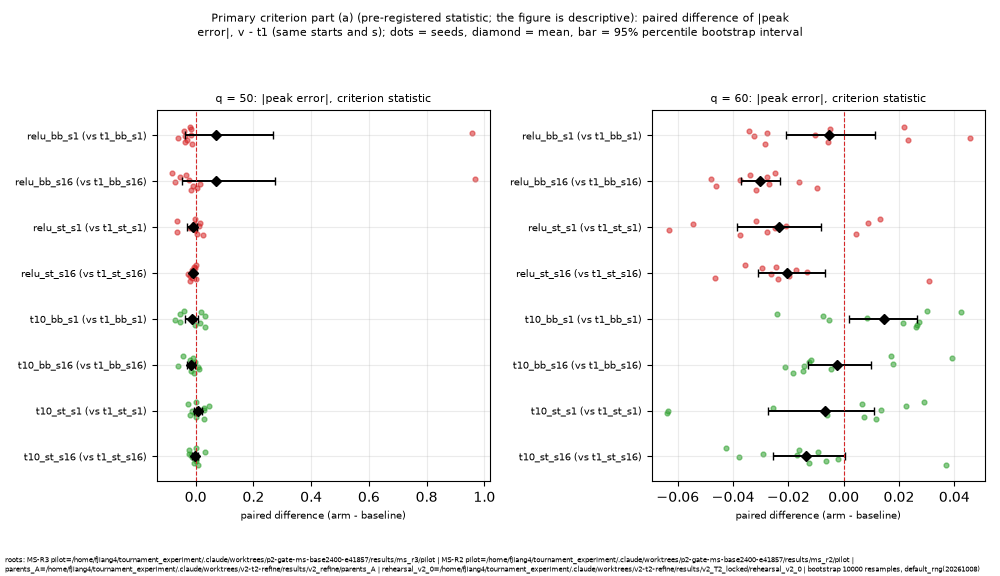
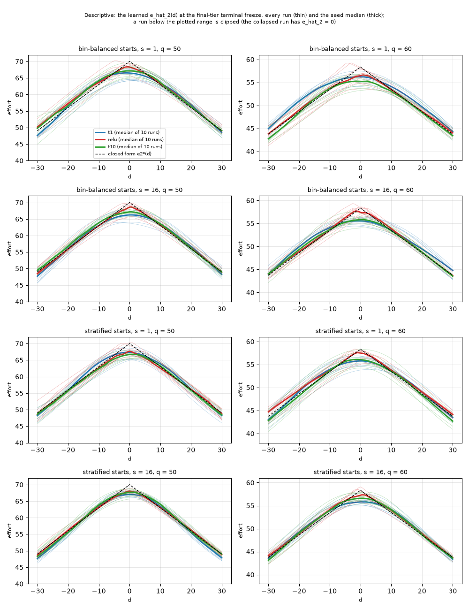

# MS-R3: inputs for the decision after the pilot

Date: 2026-10-08. Branch `ms-r3`. This report collects what the 240 runs of `04_pilot.md`, the supervised screen (`01_supervised_screen.md`) and the diagnostics of the MS-R1 and MS-R2 actors (`01b_rl_actor_diagnostics.md`) bear on. It selects nothing and proposes no protocol: the decision on the next round is the PI's (prompt section 5). Every number is read from `results/ms_r3/analysis/`, `results/ms_r3/supervised_screen/` or `results/ms_r3/rl_actor_diagnostics/` through the scripts under `reports/ms/r3/report_scripts/` (`pilot_tables.py` blocks `side_by_side`, `directions`, `robust`, `tie_effort`, `transmission`, `quadrature`, `r0`, `screen_vs_rl`; `relu_units.py`); `04_pilot.md` has the tests and the full tables. The blocks `directions`, `side_by_side`, `tie_effort` and `screen_vs_rl` summarise the pre-registered tables or put them next to the screen; `robust` and `relu_units.py` are post hoc supplements; none adds a test.

## 1. The twelve arms side by side (block `side_by_side`; means over ten seeds, medians where marked; effort units for the decomposition)

`rehearsal_v2_0` stands for the `parents_A` candidate (same terminal stage, MS-R1 C-MS1). The two bin-balanced `relu` rows at q = 50 contain one collapsed run (gap 70.00, `04_pilot.md` section 3.2).

| arm | q | mean abs(peak) | abs(peak)<=0.05 | sigma_2(0) | smoothing part | remainder | gap | w_eff | RMSE_pos/e2*(0) | tail mean/e2*(0) | eta2/DW | R0 (median) | R (median) |
|---|---|---|---|---|---|---|---|---|---|---|---|---|---|
| t1_bb_s1 | 50 | 0.0565 | 5/10 | 2.414 | 1.905 | 2.053 | 3.958 | 5.65 | 0.0199 | 0.0064 | 0.00127 | 0.0301 | 0.0916 |
| t1_bb_s1 | 60 | 0.0401 | 8/10 | 2.450 | 1.343 | 0.995 | 2.338 | 4.81 | 0.0176 | 0.0078 | 0.00061 | 0.0247 | 0.0652 |
| t1_bb_s16 | 50 | 0.0557 | 3/10 | 0.651 | 0.514 | 3.383 | 3.897 | 5.57 | 0.0186 | 0.0069 | 0.00133 | 0.0324 | 0.0961 |
| t1_bb_s16 | 60 | 0.0472 | 6/10 | 0.665 | 0.365 | 2.390 | 2.755 | 5.67 | 0.0166 | 0.0084 | 0.00055 | 0.0325 | 0.0567 |
| t1_st_s1 | 50 | 0.0434 | 7/10 | 2.378 | 1.877 | 1.158 | 3.035 | 4.34 | 0.0190 | 0.0074 | 0.00123 | 0.0228 | 0.0886 |
| t1_st_s1 | 60 | 0.0461 | 6/10 | 2.438 | 1.337 | 1.355 | 2.691 | 5.54 | 0.0197 | 0.0081 | 0.00060 | 0.0299 | 0.0597 |
| t1_st_s16 | 50 | 0.0401 | 8/10 | 0.641 | 0.506 | 2.303 | 2.809 | 4.01 | 0.0146 | 0.0075 | 0.00070 | 0.0255 | 0.0786 |
| t1_st_s16 | 60 | 0.0415 | 7/10 | 0.655 | 0.359 | 2.064 | 2.422 | 4.98 | 0.0142 | 0.0088 | 0.00043 | 0.0297 | 0.0503 |
| relu_bb_s1 | 50 | 0.1256 | 8/10 | 1.747 | 1.378 | 7.415 | 8.793 | 12.56 | 0.0818 | 0.0023 | 0.02908 | 0.0145 | 0.0934 |
| relu_bb_s1 | 60 | 0.0347 | 7/10 | 1.931 | 1.058 | 0.967 | 2.026 | 4.17 | 0.0170 | 0.0027 | 0.00051 | 0.0219 | 0.0549 |
| relu_bb_s16 | 50 | 0.1247 | 7/10 | 0.529 | 0.417 | 8.314 | 8.731 | 12.47 | 0.0717 | 0.0014 | 0.02660 | 0.0120 | 0.0780 |
| relu_bb_s16 | 60 | 0.0170 | 10/10 | 0.574 | 0.315 | 0.570 | 0.885 | 1.82 | 0.0116 | 0.0018 | 0.00032 | 0.0105 | 0.0412 |
| relu_st_s1 | 50 | 0.0326 | 9/10 | 1.989 | 1.570 | 0.666 | 2.236 | 3.19 | 0.0438 | 0.0023 | 0.01101 | 0.0201 | 0.0990 |
| relu_st_s1 | 60 | 0.0227 | 9/10 | 1.964 | 1.077 | 0.250 | 1.327 | 2.73 | 0.0156 | 0.0030 | 0.00039 | 0.0097 | 0.0491 |
| relu_st_s16 | 50 | 0.0297 | 10/10 | 0.582 | 0.459 | 1.622 | 2.081 | 2.97 | 0.0183 | 0.0019 | 0.00229 | 0.0168 | 0.0689 |
| relu_st_s16 | 60 | 0.0209 | 10/10 | 0.580 | 0.318 | 0.759 | 1.077 | 2.22 | 0.0124 | 0.0023 | 0.00036 | 0.0148 | 0.0413 |
| t10_bb_s1 | 50 | 0.0432 | 6/10 | 2.356 | 1.859 | 1.168 | 3.027 | 4.32 | 0.0222 | 0.0036 | 0.00110 | 0.0244 | 0.0915 |
| t10_bb_s1 | 60 | 0.0546 | 5/10 | 2.385 | 1.307 | 1.880 | 3.187 | 6.56 | 0.0191 | 0.0043 | 0.00069 | 0.0364 | 0.0558 |
| t10_bb_s16 | 50 | 0.0412 | 9/10 | 0.637 | 0.503 | 2.379 | 2.882 | 4.12 | 0.0133 | 0.0043 | 0.00056 | 0.0244 | 0.0600 |
| t10_bb_s16 | 60 | 0.0449 | 7/10 | 0.642 | 0.352 | 2.266 | 2.618 | 5.39 | 0.0126 | 0.0047 | 0.00046 | 0.0293 | 0.0463 |
| t10_st_s1 | 50 | 0.0506 | 6/10 | 2.402 | 1.896 | 1.643 | 3.540 | 5.06 | 0.0179 | 0.0043 | 0.00082 | 0.0286 | 0.0769 |
| t10_st_s1 | 60 | 0.0393 | 7/10 | 2.413 | 1.323 | 0.972 | 2.294 | 4.72 | 0.0191 | 0.0048 | 0.00062 | 0.0265 | 0.0577 |
| t10_st_s16 | 50 | 0.0363 | 8/10 | 0.640 | 0.505 | 2.036 | 2.542 | 3.63 | 0.0132 | 0.0046 | 0.00066 | 0.0199 | 0.0655 |
| t10_st_s16 | 60 | 0.0279 | 9/10 | 0.651 | 0.357 | 1.274 | 1.630 | 3.35 | 0.0137 | 0.0058 | 0.00034 | 0.0202 | 0.0409 |
| rehearsal_v2_0 | 50 | 0.0656 | 2/10 | 2.918 | 2.304 | 2.288 | 4.592 | 6.56 | 0.0225 | 0.0081 | 0.00162 | 0.0377 | 0.1005 |
| rehearsal_v2_0 | 60 | 0.0533 | 5/10 | 2.990 | 1.640 | 1.472 | 3.112 | 6.40 | 0.0201 | 0.0097 | 0.00089 | 0.0340 | 0.0764 |

The same arms by medians and counts that one failed run does not move (post hoc, descriptive; block `robust`):

| arm | q | median gap | median abs(peak) | gap <= 1 | gap <= 2 | gap > 10 | median RMSE_pos/e2*(0) | median w_eff | gate failures (G-A and G-N(eta)) | max symmetry error/e2*(0) |
|---|---|---|---|---|---|---|---|---|---|---|
| t1_bb_s1 | 50 | 3.51 | 0.0502 | 0 | 0 | 0 | 0.0195 | 5.02 | 0 | 0.067 |
| t1_bb_s1 | 60 | 2.11 | 0.0362 | 1 | 4 | 0 | 0.0179 | 4.35 | 0 | 0.058 |
| t1_bb_s16 | 50 | 3.77 | 0.0538 | 0 | 1 | 0 | 0.0175 | 5.38 | 0 | 0.081 |
| t1_bb_s16 | 60 | 2.78 | 0.0476 | 0 | 1 | 0 | 0.0159 | 5.71 | 0 | 0.046 |
| t1_st_s1 | 50 | 2.67 | 0.0381 | 0 | 3 | 0 | 0.0183 | 3.81 | 0 | 0.049 |
| t1_st_s1 | 60 | 2.56 | 0.0438 | 0 | 3 | 0 | 0.0201 | 5.26 | 0 | 0.056 |
| t1_st_s16 | 50 | 2.98 | 0.0425 | 0 | 2 | 0 | 0.0149 | 4.25 | 0 | 0.029 |
| t1_st_s16 | 60 | 2.54 | 0.0435 | 1 | 2 | 0 | 0.0140 | 5.22 | 0 | 0.027 |
| relu_bb_s1 | 50 | 1.71 | 0.0244 | 2 | 6 | 1 | 0.0229 | 2.44 | 2 | 0.149 |
| relu_bb_s1 | 60 | 1.87 | 0.0321 | 3 | 5 | 0 | 0.0158 | 3.86 | 0 | 0.044 |
| relu_bb_s16 | 50 | 1.42 | 0.0203 | 3 | 6 | 1 | 0.0174 | 2.03 | 1 | 0.091 |
| relu_bb_s16 | 60 | 0.91 | 0.0156 | 5 | 8 | 0 | 0.0107 | 1.87 | 0 | 0.055 |
| relu_st_s1 | 50 | 2.36 | 0.0337 | 2 | 3 | 0 | 0.0209 | 3.37 | 1 | 0.547 |
| relu_st_s1 | 60 | 0.84 | 0.0144 | 6 | 6 | 0 | 0.0166 | 1.72 | 0 | 0.049 |
| relu_st_s16 | 50 | 1.98 | 0.0283 | 0 | 6 | 0 | 0.0125 | 2.83 | 1 | 0.180 |
| relu_st_s16 | 60 | 1.07 | 0.0183 | 4 | 8 | 0 | 0.0123 | 2.20 | 0 | 0.044 |
| t10_bb_s1 | 50 | 2.86 | 0.0408 | 1 | 3 | 0 | 0.0218 | 4.08 | 0 | 0.063 |
| t10_bb_s1 | 60 | 3.10 | 0.0532 | 0 | 2 | 0 | 0.0194 | 6.39 | 0 | 0.058 |
| t10_bb_s16 | 50 | 2.86 | 0.0408 | 0 | 1 | 0 | 0.0133 | 4.08 | 0 | 0.043 |
| t10_bb_s16 | 60 | 2.51 | 0.0429 | 0 | 2 | 0 | 0.0123 | 5.15 | 0 | 0.044 |
| t10_st_s1 | 50 | 3.33 | 0.0476 | 0 | 0 | 0 | 0.0177 | 4.76 | 0 | 0.049 |
| t10_st_s1 | 60 | 2.27 | 0.0389 | 2 | 4 | 0 | 0.0170 | 4.67 | 0 | 0.041 |
| t10_st_s16 | 50 | 2.34 | 0.0334 | 0 | 3 | 0 | 0.0135 | 3.34 | 0 | 0.029 |
| t10_st_s16 | 60 | 1.73 | 0.0297 | 3 | 5 | 0 | 0.0135 | 3.57 | 0 | 0.042 |

## 2. What the actor changes in each component of the gap and in global accuracy

### 2.1 Direction counts over the eight (starts, s, q) cells (block `directions`; the change is v - t1 of the same starts and s, paired by (q, seed))

| variant | metric | cells | mean change < 0 | interval below 0 | interval above 0 | range of the mean changes |
|---|---|---|---|---|---|---|
| relu | abs(peak error) | 8 | 6 | 4 | 0 | -0.0302 to +0.0691 |
| relu | signed peak error | 8 | 2 | 0 | 4 | -0.0691 to +0.0321 |
| relu | gap | 8 | 6 | 4 | 0 | -1.870 to +4.835 |
| relu | smoothing part | 8 | 8 | 8 | 0 | -0.528 to -0.041 |
| relu | remainder | 8 | 6 | 4 | 0 | -1.820 to +5.362 |
| relu | sigma_2(0) | 8 | 8 | 8 | 0 | -0.667 to -0.059 |
| relu | RMSE_pos/e2*(0) | 8 | 4 | 3 | 0 | -0.0050 to +0.0620 |
| relu | tail mean/e2*(0) | 8 | 8 | 8 | 0 | -0.0066 to -0.0040 |
| relu | eta_2/DW | 8 | 4 | 1 | 0 | -0.00023 to +0.02781 |
| relu | R0 | 8 | 6 | 4 | 0 | -0.0196 to +0.0812 |
| relu | R | 8 | 4 | 2 | 0 | -0.0163 to +0.2029 |
| relu | w_eff (units of d) | 8 | 6 | 4 | 0 | -3.847 to +6.907 |
| relu | location-free peak error | 8 | 2 | 0 | 4 | -0.0641 to +0.0382 |
| relu | symmetry error/e2*(0) | 8 | 1 | 0 | 5 | -0.0024 to +0.0627 |
| relu | max abs first-layer d-weight (d/B) | 8 | 8 | 8 | 0 | -0.446 to -0.356 |
| t10 | abs(peak error) | 8 | 6 | 1 | 1 | -0.0145 to +0.0146 |
| t10 | signed peak error | 8 | 2 | 1 | 1 | -0.0146 to +0.0145 |
| t10 | gap | 8 | 6 | 1 | 1 | -1.016 to +0.849 |
| t10 | smoothing part | 8 | 7 | 1 | 0 | -0.046 to +0.019 |
| t10 | remainder | 8 | 6 | 1 | 1 | -1.004 to +0.885 |
| t10 | sigma_2(0) | 8 | 7 | 1 | 0 | -0.065 to +0.024 |
| t10 | RMSE_pos/e2*(0) | 8 | 6 | 2 | 0 | -0.0053 to +0.0023 |
| t10 | tail mean/e2*(0) | 8 | 8 | 8 | 0 | -0.0038 to -0.0026 |
| t10 | eta_2/DW | 8 | 6 | 1 | 0 | -0.00077 to +0.00009 |
| t10 | R0 | 8 | 6 | 1 | 1 | -0.0094 to +0.0101 |
| t10 | R | 8 | 6 | 2 | 0 | -0.0397 to +0.0046 |
| t10 | w_eff (units of d) | 8 | 6 | 1 | 1 | -1.629 to +1.747 |
| t10 | location-free peak error | 8 | 2 | 1 | 1 | -0.0137 to +0.0152 |
| t10 | symmetry error/e2*(0) | 8 | 2 | 0 | 2 | -0.0077 to +0.0083 |
| t10 | max abs first-layer d-weight (d/B) | 8 | 0 | 0 | 8 | +6.042 to +7.068 |

- **The tie deficit, `relu`.** Lower in six of eight cells by the mean (intervals below 0 in four, none above) and lower in all eight by the median gap (by 0.24 to 2.35 effort units; the two cells with higher means contain the collapsed run). The typical `relu` run has a gap of 0.84-2.36 effort units (median, eight arms) against 2.11-3.77 for `t1`; 3-6 of 10 runs per q = 60 arm have a gap of at most 1 effort unit (`t1`: 0-1). The gain comes with failures: five of the 40 `relu` runs at q = 50 fail G-A; they come from two (q, seed) cases, seed 10504 (a policy collapsed to zero effort; two arms share the run up to update 2001) and seed 10506 (a dead middle-stratum region; three arms; `04_pilot.md` 3.2), none of the 40 at q = 60, none of the 160 `t1` and `t10` runs.
- **The tie deficit, `t10`.** No detectable change of the mean |peak error| (within 0.015 of `t1`'s in every arm). Lower in six of eight cells by the median gap (by 0.27 to 0.91) and higher in two (+0.67, +0.99); by the mean in six of eight with one interval below 0 and one above 0. The rounding width is 3.4-6.6 units of d (`t1`: 4.0-5.7) although the sharpest first-layer unit bends over 24-30 units of d instead of 159-173 (+6.0 to +7.1 in the largest d-weight, units of d / B).
- **Policy noise and the smoothing part.** sigma_2(0) and the smoothing part are lower under `relu` in all eight cells (sigma_2(0) at s = 1: 1.75-1.99 against 2.38-2.45), under `t10` they change little (-0.05 to +0.02 for the smoothing part, -0.06 to +0.02 for sigma_2(0); one interval below 0 in each).
- **The tail.** The tail mean is lower in all eight cells for both variants (`relu` 0.0014-0.0030, `t10` 0.0036-0.0058, `t1` 0.0064-0.0088 of `e_2*(0)`).
- **Global accuracy.** RMSE_pos is lower for `t10` in six of eight cells (intervals below 0 in two) and for `relu` in four (three below 0; the other four contain failed runs); at s = 16 `t10` is lower in all four cells and `relu` in the two q = 60 cells.

### 2.2 The tie effort: the closed form, the smoothed target and the learned value (block `tie_effort`; means over ten seeds)

| arm | q | e*(0) | e_sigma(0) | e_hat_2(0) | e_hat_2(0) seed SD |
|---|---|---|---|---|---|
| t1_bb_s1 | 50 | 70.00 | 68.09 | 66.04 | 1.56 |
| t1_bb_s1 | 60 | 58.33 | 56.99 | 56.00 | 0.91 |
| t1_bb_s16 | 50 | 70.00 | 69.49 | 66.10 | 1.37 |
| t1_bb_s16 | 60 | 58.33 | 57.97 | 55.58 | 0.71 |
| t1_st_s1 | 50 | 70.00 | 68.12 | 66.97 | 1.47 |
| t1_st_s1 | 60 | 58.33 | 57.00 | 55.64 | 1.01 |
| t1_st_s16 | 50 | 70.00 | 69.49 | 67.19 | 0.75 |
| t1_st_s16 | 60 | 58.33 | 57.97 | 55.91 | 0.73 |
| relu_bb_s1 | 50 | 70.00 | 68.62 | 61.21 | 21.53 |
| relu_bb_s1 | 60 | 58.33 | 57.27 | 56.31 | 1.55 |
| relu_bb_s16 | 50 | 70.00 | 69.58 | 61.27 | 21.58 |
| relu_bb_s16 | 60 | 58.33 | 58.02 | 57.45 | 0.99 |
| relu_st_s1 | 50 | 70.00 | 68.43 | 67.76 | 1.29 |
| relu_st_s1 | 60 | 58.33 | 57.26 | 57.01 | 1.06 |
| relu_st_s16 | 50 | 70.00 | 69.54 | 67.92 | 0.49 |
| relu_st_s16 | 60 | 58.33 | 58.02 | 57.26 | 1.04 |
| t10_bb_s1 | 50 | 70.00 | 68.14 | 66.97 | 1.54 |
| t10_bb_s1 | 60 | 58.33 | 57.03 | 55.15 | 1.16 |
| t10_bb_s16 | 50 | 70.00 | 69.50 | 67.12 | 0.72 |
| t10_bb_s16 | 60 | 58.33 | 57.98 | 55.72 | 0.90 |
| t10_st_s1 | 50 | 70.00 | 68.10 | 66.46 | 0.85 |
| t10_st_s1 | 60 | 58.33 | 57.01 | 56.04 | 1.24 |
| t10_st_s16 | 50 | 70.00 | 69.49 | 67.46 | 1.02 |
| t10_st_s16 | 60 | 58.33 | 57.98 | 56.70 | 0.89 |

## 3. Does the noise landing transmit under each actor?

Transmission ratio (mean change of the gap) / (mean change of the smoothing part) between the s = 16 and the s = 1 arm of the same actor and starts (block `transmission`; 1 = the whole smoothing reduction reaches the gap):

| actor | starts | q | n pairs | mean change of the gap | mean change of the smoothing part | ratio [95% CI] | per-seed ratios |
|---|---|---|---|---|---|---|---|
| t1 | bb | 50 | 10 | -0.061 | -1.392 | +0.044 [-0.525, +0.653] | 10501:-0.428025;10502:-0.89633;10503:1.21709;10504:0.446876;10505:-0.735523;10506:-0.30843;10507:1.63567;10508:1.26183;10509:-0.670999;10510:-1.2003 |
| t1 | bb | 60 | 10 | +0.417 | -0.978 | -0.426 [-1.045, +0.206] | 10501:0.584722;10502:0.611987;10503:1.36217;10504:-0.981928;10505:-0.107116;10506:-0.791748;10507:-1.59553;10508:-0.320781;10509:-1.18782;10510:-2.04951 |
| t1 | st | 50 | 10 | -0.226 | -1.371 | +0.165 [-0.425, +0.735] | 10501:0.72767;10502:1.67666;10503:-0.542848;10504:-0.708453;10505:-1.59839;10506:0.705104;10507:0.640353;10508:1.13073;10509:0.0786392;10510:-0.501866 |
| t1 | st | 60 | 10 | -0.269 | -0.978 | +0.275 [-0.561, +1.155] | 10501:-1.53218;10502:-0.848969;10503:0.847533;10504:1.07688;10505:-1.71986;10506:1.21197;10507:2.4892;10508:-0.614965;10509:-0.302731;10510:2.21463 |
| relu | bb | 50 | 10 | -0.061 | -0.961 | +0.064 [-1.397, +1.507] | 10501:3.35567;10502:0.0895732;10503:2.72365;10504:0;10505:-0.619613;10506:1.81398;10507:-2.9896;10508:0.557;10509:-3.32899;10510:-1.18292 |
| relu | bb | 60 | 10 | -1.141 | -0.744 | +1.534 [-0.083, +3.152] | 10501:5.17173;10502:3.06943;10503:1.42848;10504:0.938777;10505:2.03534;10506:-2.221;10507:3.51934;10508:5.23587;10509:-1.11308;10510:-2.66194 |
| relu | st | 50 | 10 | -0.154 | -1.110 | +0.139 [-0.765, +0.947] | 10501:0.63058;10502:-1.85535;10503:0.425251;10504:-0.373421;10505:-0.979559;10506:1.15966;10507:1.89784;10508:-2.6656;10509:0.179377;10510:2.01542 |
| relu | st | 60 | 10 | -0.250 | -0.759 | +0.329 [-1.085, +1.776] | 10501:2.01458;10502:-1.76785;10503:4.25412;10504:-1.50849;10505:-2.8616;10506:1.529;10507:-0.268872;10508:0.651011;10509:3.13991;10510:-2.3543 |
| t10 | bb | 50 | 10 | -0.146 | -1.357 | +0.107 [-0.575, +0.816] | 10501:-0.40523;10502:0.638321;10503:-0.65728;10504:2.12074;10505:-0.893603;10506:-0.819072;10507:-1.60909;10508:1.54445;10509:0.0368264;10510:0.918521 |
| t10 | bb | 60 | 10 | -0.569 | -0.955 | +0.596 [+0.090, +1.053] * | 10501:1.38632;10502:0.810668;10503:0.711614;10504:-0.639125;10505:-0.691514;10506:-0.207468;10507:1.38898;10508:1.23557;10509:1.3462;10510:0.596823 |
| t10 | st | 50 | 10 | -0.998 | -1.391 | +0.718 [+0.424, +1.051] * | 10501:0.801074;10502:1.35655;10503:0.159167;10504:1.81773;10505:0.728061;10506:0.690865;10507:0.483044;10508:-0.0206439;10509:0.501837;10510:0.635601 |
| t10 | st | 60 | 10 | -0.664 | -0.966 | +0.687 [-0.099, +1.500] | 10501:2.78498;10502:0.496581;10503:2.79657;10504:1.29824;10505:0.102435;10506:-0.382253;10507:-1.33427;10508:-0.620545;10509:0.879617;10510:0.787908 |

Under `t1` it does not (-0.43 to +0.28, as in MS-R2). Under `t10` the ratio is 0.11, 0.60, 0.72 and 0.69 (two intervals excluding 0), with mean gap changes of -0.15 to -1.00 effort units and two intervals below 0 (`04_pilot.md` section 5). Under `relu` the ratios are 0.06, 1.53, 0.14 and 0.33, none with an interval excluding 0 (the q = 50 bin-balanced cell contains the collapsed run in both arms). The quadrature model (block `quadrature`) is closer to the observed gap(s16) than the additive one in 10 of 12 cells:

| actor | starts | q | gap(s1) | smoothing(s1) | smoothing(s16) | F^2 | quadrature gap(s16) | additive gap(s16) | observed gap(s16) | error quad / add | closer |
|---|---|---|---|---|---|---|---|---|---|---|---|
| t1 | bb | 50 | 3.958 | 1.905 | 0.514 | +12.036 | 3.507 | 2.566 | 3.897 | 0.390 / 1.331 | quadrature |
| t1 | bb | 60 | 2.338 | 1.343 | 0.365 | +3.661 | 1.948 | 1.359 | 2.755 | 0.807 / 1.395 | quadrature |
| t1 | st | 50 | 3.035 | 1.877 | 0.506 | +5.686 | 2.437 | 1.663 | 2.809 | 0.371 / 1.145 | quadrature |
| t1 | st | 60 | 2.691 | 1.337 | 0.359 | +5.457 | 2.363 | 1.713 | 2.422 | 0.059 / 0.709 | quadrature |
| relu | bb | 50 | 8.793 | 1.378 | 0.417 | +75.413 | 8.694 | 7.832 | 8.731 | 0.037 / 0.900 | quadrature |
| relu | bb | 60 | 2.026 | 1.058 | 0.315 | +2.983 | 1.755 | 1.282 | 0.885 | 0.871 / 0.397 | additive |
| relu | st | 50 | 2.236 | 1.570 | 0.459 | +2.535 | 1.657 | 1.125 | 2.081 | 0.424 / 0.956 | quadrature |
| relu | st | 60 | 1.327 | 1.077 | 0.318 | +0.601 | 0.838 | 0.568 | 1.077 | 0.239 / 0.509 | quadrature |
| t10 | bb | 50 | 3.027 | 1.859 | 0.503 | +5.707 | 2.441 | 1.671 | 2.882 | 0.440 / 1.211 | quadrature |
| t10 | bb | 60 | 3.187 | 1.307 | 0.352 | +8.449 | 2.928 | 2.232 | 2.618 | 0.310 / 0.386 | quadrature |
| t10 | st | 50 | 3.540 | 1.896 | 0.505 | +8.933 | 3.031 | 2.149 | 2.542 | 0.490 / 0.393 | additive |
| t10 | st | 60 | 2.294 | 1.323 | 0.357 | +3.514 | 1.908 | 1.328 | 1.630 | 0.278 / 0.302 | quadrature |

No cell reaches the smoothing floor at s = 16: the ratio of the mean |peak error| to the floor is 3.1-7.4 for `relu` and `t10` (outside the collapsed-run cell) and 5.6-7.6 for `t1` (`04_pilot.md` section 7).

## 4. R0 as the tie-accuracy metric (block `r0`)

| scope | actors | q | n | Spearman(R0, abs(peak)) |
|---|---|---|---|---|
| freeze | all | 50 | 120 | 1.000 |
| freeze | t1 | 50 | 40 | 1.000 |
| freeze | relu | 50 | 40 | 0.993 |
| freeze | t10 | 50 | 40 | 1.000 |
| checks | all | 50 | 4920 | 0.923 |
| checks | t1 | 50 | 1640 | 0.981 |
| checks | relu | 50 | 1640 | 0.852 |
| checks | t10 | 50 | 1640 | 0.964 |
| freeze | all | 60 | 120 | 0.995 |
| freeze | t1 | 60 | 40 | 1.000 |
| freeze | relu | 60 | 40 | 0.970 |
| freeze | t10 | 60 | 40 | 1.000 |
| checks | all | 60 | 4920 | 0.946 |
| checks | t1 | 60 | 1640 | 0.986 |
| checks | relu | 60 | 1640 | 0.890 |
| checks | t10 | 60 | 1640 | 0.980 |

R0 = r_2(0) / s_2 needs no closed form. Its rank correlation with |peak error| at the freeze is 1.000 for `t1` and `t10` at both q and 0.993 / 0.970 for `relu`; over the checks of local update 1800-2800 of an actor (41 per run) 0.98-0.99 (`t1`), 0.96-0.98 (`t10`), 0.85-0.89 (`relu`). R0 / |peak error| is within 0.015 of the linearised 2k / (2k + a) in fifteen of the sixteen `t1` and `t10` cells (the exception, `t10_st_s1` at q = 60: 0.614 against 0.673) and differs from it by more than 0.03 in six of the eight `relu` cells: R0 and |peak error| separate in the `relu` cells in which some runs overshoot `e_2*(0)` at the tie (five runs with a non-negative signed peak error and R0 / |peak error| of 1.95-3.36, in `relu_bb_s16` at q = 60, `relu_st_s16` at q = 60 and `relu_st_s1` at q = 50), and the three dead-region runs that fail G-A have R0 / |peak error| of 0.595-0.601; only the collapsed run is at 1.0. The collapsed run has R0 = 0.9999976 and |peak error| = 0.9999986 (agreement), the three dead-region runs that fail G-A have R0 of 0.017-0.030 and gaps of 2.0-3.5 (their failure is in the middle stratum, which R0 at the tie does not see).

## 5. What the sampler adds (descriptive; block `starts` of `04_pilot.md` section 8)

For `t1` the stratified arm has the lower gap at q = 50 (-0.92 at s = 1, -1.09 [-2.18, -0.06] at s = 16) and no difference at q = 60, as in MS-R2. For `t10` it has the lower gap at q = 60 (-0.89 [-1.63, -0.14] and -0.99 [-1.51, -0.40]) and no detectable difference at q = 50. For `relu` no interval excludes 0; the q = 50 differences (-6.6) come from the collapsed run in the bin-balanced arms.

## 6. The RL fit next to the supervised screen (block `screen_vs_rl`)

| actor | starts | q | screen: median tip deficit | RL s=1: gap mean / median | RL s=16: gap mean / median | RL s=1 median gap / screen median |
|---|---|---|---|---|---|---|
| t1 | bb | 50 | 1.643 | 3.958 / 3.512 | 3.897 / 3.769 | 2.14 |
| t1 | bb | 60 | 6.320 | 2.338 / 2.114 | 2.755 / 2.776 | 0.33 |
| t1 | st | 50 | 0.712 | 3.035 / 2.667 | 2.809 / 2.978 | 3.74 |
| t1 | st | 60 | 1.169 | 2.691 / 2.557 | 2.422 / 2.538 | 2.19 |
| relu | bb | 50 | 0.483 | 8.793 / 1.710 | 8.731 / 1.421 | 3.54 |
| relu | bb | 60 | 0.032 | 2.026 / 1.874 | 0.885 / 0.909 | 59.00 |
| relu | st | 50 | 0.081 | 2.236 / 2.359 | 2.081 / 1.978 | 29.22 |
| relu | st | 60 | 0.025 | 1.327 / 0.838 | 1.077 / 1.069 | 34.09 |
| t10 | bb | 50 | 0.528 | 3.027 / 2.858 | 2.882 / 2.855 | 5.41 |
| t10 | bb | 60 | 0.478 | 3.187 / 3.104 | 2.618 / 2.505 | 6.50 |
| t10 | st | 50 | 0.437 | 3.540 / 3.334 | 2.542 / 2.336 | 7.63 |
| t10 | st | 60 | 0.335 | 2.294 / 2.272 | 1.630 / 1.733 | 6.79 |

The RL gap is larger than the screen's deficit in 11 of 12 cells (by factors of 2.1-59; the exception is `t1` bin-balanced at q = 60, where the screen's actors often plateau). The screen separates `relu` (0.02-0.48) and `t10` (0.33-0.53) from `t1` (0.71-6.32); the RL runs separate `relu` (median gap 0.84-2.36) from `t1` (2.11-3.77) and not `t10`. The largest first-layer d-weights of the RL actors at the freeze (`t1` 1.23-1.30, `relu` 0.82-0.85, `t10` 7.4-8.5, all in units of d / B) are in the range of the screen's for `t1` and `relu` (1.16-1.51 and 0.79-0.87) and about half the screen's for `t10` (13.1-17.9; `01_supervised_screen.md` section 2.2): the RL `t10` actors have units much sharper than `t1`'s, about half as sharp as the screen's `t10` actors', and not the screen's small tip deficit.

## 7. What is not settled

1. **Why the typical `relu` run is better and a few are not.** The effect on the typical run is in the direction of the PI's reading (a unit with a kink at any weight lowers the tie deficit); the failure rate (five runs from two (q, seed) cases among 40 at q = 50, 0 of 40 at q = 60) cannot be estimated from ten seeds per arm, and the mechanism of the two failures is not established. The activity of the hidden units does not separate them: in every `relu` run 36-50 of 64 first-layer units and 39-51 of 64 second-layer units are active somewhere on D_2 at the freeze (the failed runs 42-44 and 46-47; `relu_units.csv`), i.e. 14-28 first-layer units are never active, in good and failed runs alike (the constant stage input 1 against a zero-bias initialisation is a candidate reason, not tested); the collapsed run's output is below 4 effort units everywhere. The higher KL and clip fraction of `relu` per update are a co-variate, not a cause.
2. **Why `t10` does not transfer from the supervised screen.** The sharper first-layer units are present in the RL actors (bend width 24-30 units of d), the rounding width is the `t1` one (3.4-6.6 against 4.0-5.7 units of d). Nothing in this round separates an optimisation explanation (the same PPO updates move the sharp units less usefully), a noise explanation (the policy noise at s = 1) and others; the partial transmission of the noise landing under `t10` (0.6-0.7 in three cells) and the stratified sampler's lower gap at q = 60 (-0.89 and -0.99) are the places where `t10` differs from `t1` in the tie (a post hoc reading: the gap is lower by 0.57-1.00 effort units in two landing cells with intervals below 0).
3. **Whether a kink and a lower noise floor together reach the floor.** No arm reaches the smoothing floor at s = 16 (ratio 3.1-7.4); the cell closest to it is `relu_bb_s16` at q = 60 (mean |peak error| 0.0170 against a floor of 0.0054; 10 of 10 runs at 0.05 or below). The next are `relu_st_s16` at q = 60 (3.84) and q = 50 (4.53); none of the arms was designed to test the combination beyond this grid.
4. **The size of an effect that ten seeds can show.** The primary intervals of the `relu` and `t10` rows have half-widths 0.006-0.16; the `relu` bin-balanced rows at q = 50 are dominated by one run. An interval that contains 0 does not show the absence of an effect (the criterion is the pre-registered statement, nothing else is a test).
5. **Longer training as a remedy.** In the supervised fit four times the budget lowers the `t1` median deficit to 0.65 / 0.87 (q = 50 / 60) (`01_supervised_screen.md` section 5); no RL run of this round used more than 2800 updates.
6. **Later stages.** Only T = 2 stages were run; the T = 3 smoke tests of P1 (reduced budgets, `relu` and `t10`) show that the pipeline runs, not how the variants train at T = 3. Stage 1 passes all gates in every `t1` and `t10` run and in every `relu` run except the failed ones.
7. **Fresh seeds** (40501-40520), a lock, a T = 3 run and a second pilot were not run (prompt section 5).
