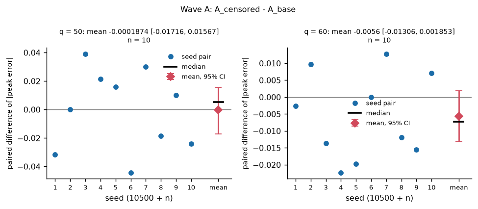
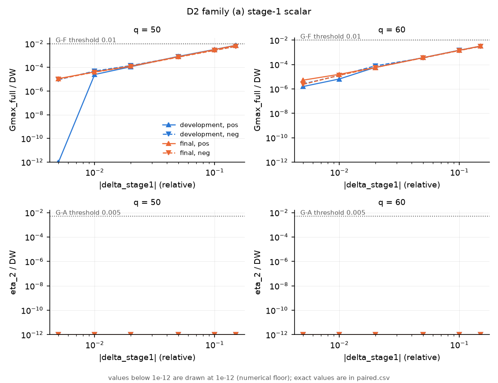
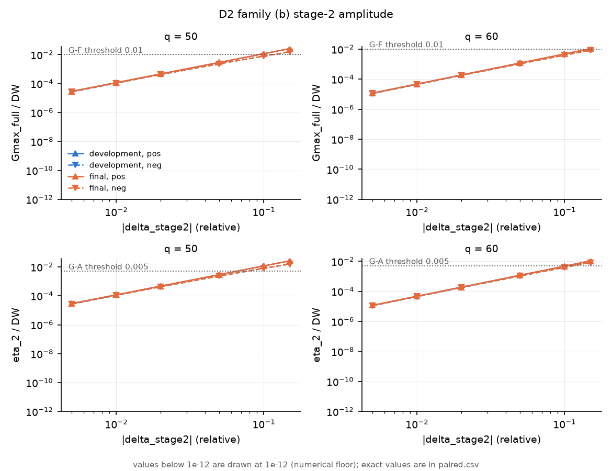
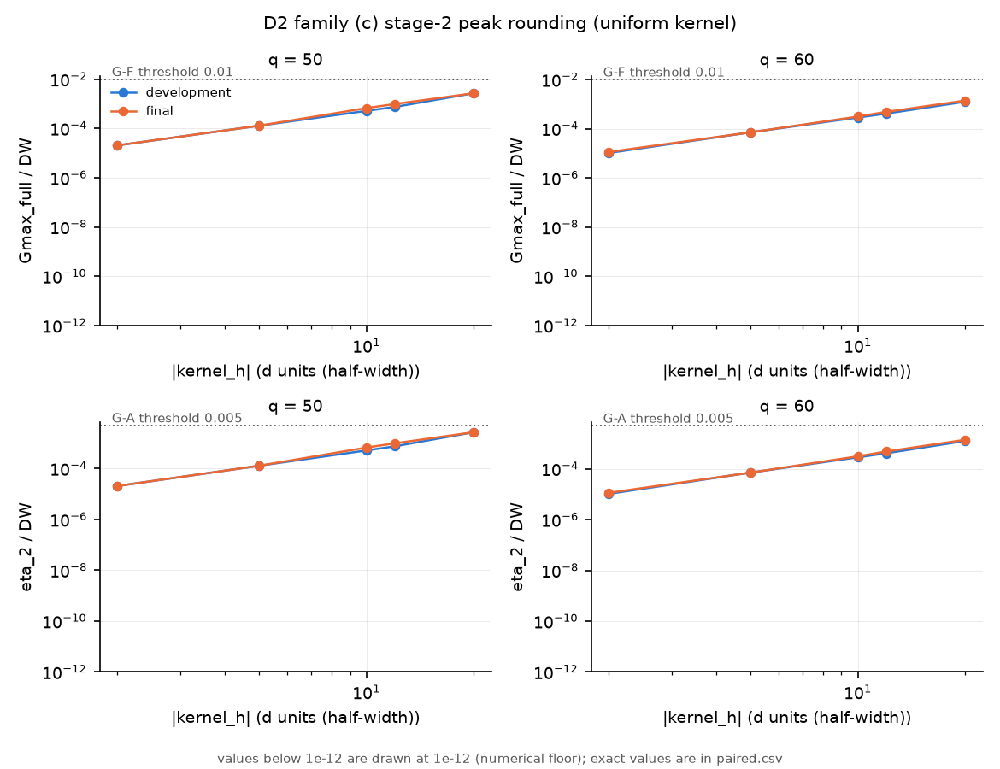
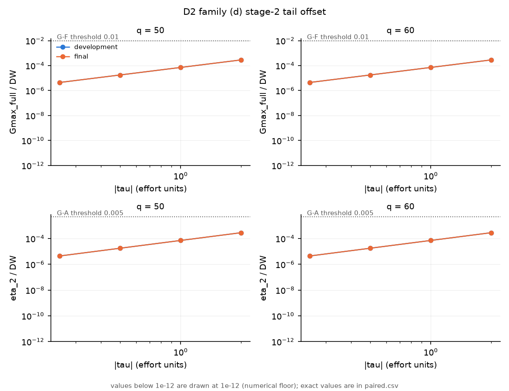
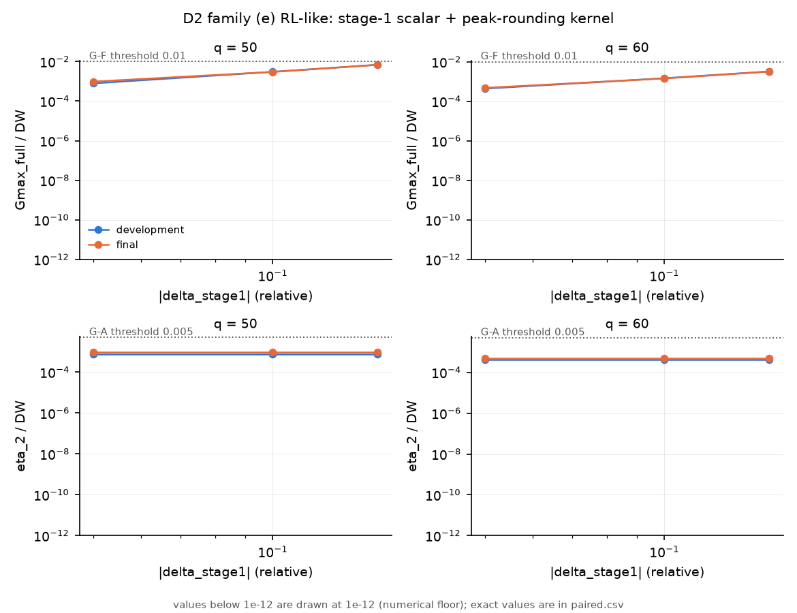

# T=2 refinement work (R1, v2.0, R2b, R2c): summary report for the PI

Folder `reports/t2_refine_100526/`; written for the author of the PI's note of 2026-10-02; English body with a Chinese executive summary (section 0). **How to read the numbers:** a tag such as `[R1-01]` is an item of the evidence pack (`evidence/manifest.csv`: source path, SHA-256, source commit; the copy is under `evidence/<source path>`); `[FG-xx]` is a figure under `figures/`; "computed here" marks a value that the report derived from pack tables (the scripts are in `report_scripts/`; the numbers were then checked independently, and the ledger of that check is `pi_record/01_factcheck.md`); "report only" marks a number that exists only in the prose of a round report. Verdict words ("met", "not met", "holds", "violated", "not reached on the grid") are those of the round reports. Sections: 0 summary (中文), 1 scope and status, 2 the note's items and how each was tested, 3 protocol v1.1 → v2.0 and its confirmation, 4 results by method, 5 diagnostics D1 and D2, 6 the stage-2 peak, 7 known issues, limitations and deviations, 8 implications for T=3, 9 evidence pack and reproduction.

## 0. 中文摘要

本摘要给 PI 便签的作者：六个方法和两项诊断各一句话，随后是 v2.0 的 fresh-seed 结果、stage-2 peak 的结论，以及决定与开放问题。摘要中的数字与正文相同，来源相同；方括号内是 `evidence/manifest.csv` 的条目编号（路径、SHA-256 见该表）。所有配对差为 arm 减比较对象（基线；方法 5 为匹配的 PPO 控制组），负值为更好，按 (q, 种子) 配对，n = 10 个开发种子，95% 百分位 bootstrap 区间；写法 “q=50 / q=60”。判据 (a)：均值配对差的区间在两个 q 上都低于 0；(b)：基线下通过门槛的 run 在该 arm 下不失败。判据只是描述性的，不是门槛。

| # | 项 | 做了什么 | 结果（配对差 [95% CI]，q=50 / q=60） | 决定 |
|---|---|---|---|---|
| 1 | polish | 在原有更新预算内加学习率衰减窗口（末端 LR 3e-6 而非 3e-5）；stage 1、stage 2 各 2 个 arm | 4 个 arm 的区间在两个 q 均含 0；例 `A_polish1`：−0.001748 [−0.01306, 0.008793] / +0.008492 [−0.001343, 0.01837] [R1-02, R1-06] | 不采纳 [RR-01 附录第 2 项] |
| 2 | batch | 每次更新 2048 个 episode，minibatch 1024 或 256 | 仅 `A_batch_mb256` 在 q=50 区间低于 0：−0.01277 [−0.02413, −0.002037]，q=60 为 +0.006659 [−0.0051, 0.01853]；其余 arm 区间含 0 [R1-02, R1-06] | 不采纳 |
| 3 | target-KL | 目标 KL 0.005 或 0.01 时提前停止 PPO 的 epoch | 4 个 arm 的区间在两个 q 均含 0；阶段墙钟时间为基线的 0.3337（`B_kl005`）至 0.8035（`A_kl010`）[R1-02, R1-06, R1-01] | 不采纳：改变成本而非精度 [RR-01 附录第 2 项] |
| 4 | annealing | stage-2 的 Beta 浓度尺度在 400 次更新内由 1 线性升到 2 或 4 | `A_anneal2`：−0.01054 [−0.02265, 0.0009109] / −0.002379 [−0.01263, 0.008759]；`A_anneal4` 在 q=60 为 +0.01181 [0.005123, 0.01949]（峰误差更大）[R1-06] | 不采纳 |
| 5 | 确定性均值（pathwise）终端微调 | 对终端期望收益做精确梯度上升（基于模型，仅作消融）；R1 每次更新 1 步（共 200 步；其 PPO 控制组为 4,000 步），R2b 每次更新 20 步（共 4,000 步，与 PPO 控制组相同） | 对匹配 PPO 控制组：R1 `A_detmean` −0.006319 [−0.01501, 0.00305] / −0.00179 [−0.0122, 0.009798] [R1-06, R1-08]；R2b `P20_lr3e-5` −0.002649 [−0.01152, 0.005801] / +0.0006087 [−0.007968, 0.01082]；`P20_lr3e-4` +0.01274 [6.079e-05, 0.02676]（q=50 更差）/ +0.002878 [−0.01079, 0.01508] [R2B-02] | 在匹配预算下判为负结果并关闭（PI，本次发布提示的 D1） |
| 6 | expected continuation | Phase B 的 stage-1 回报用冲击积分后的表值代替采样的续值 | S1 误差配对差 −0.02386 [−0.04061, −0.009831] / −0.03783 [−0.06321, −0.01472]，各 9/10 个种子更好；跨种子 SD 比 0.3464 / 0.2687 [R1-02, R1-01] | 纳入协议 v2.0（R1 中唯一进入协议的方法）[RR-01 附录第 2 项] |
| D1 | clamp（截断的 Beta 似然） | 统计原始 Beta 采样被截断的比例及其梯度占比；R2b 另试 censored 似然（`A_censored`） | 锁定流程阶段 A（20 个 run 合并）：M1 中位数 0.001385（阈值 0.001）；M2 为 3/20 个 run（最大梯度占比 0.02353；两个 q 合并时超出阈值，分 q 为 2/10 与 1/10，均未超出）；阶段 B 两项均未超；命中只在 \|d\| ≥ 2q 的行 [R1-29, R1-36]。`A_censored`：−0.0001874 [−0.01716, 0.01567] / −0.0056 [−0.01306, 0.001853] [R2B-02] | 仅报告，不修复；censored 似然不采用（PI，本次发布提示的 D1）；`clamp_likelihood` 保持 `density`（PI，R2c 提示的 D1；RR-12 第 1.3 节） |
| D2 | 验证器灵敏度 | 对闭式解做 5 族扰动（38 个候选，152 次评估），看 DP-BR 验证器的检出极限 | stage-1 标量误差到 15% 仍未触发 G-F（最大 Gmax_full/DW 0.00717 / 0.003247）；stage-2 幅度误差在 10%（q=50）/ 15%（q=60）触发 G-F 与 G-A 的 η 部分（G-A 的 RMSE 部分在两个 q 均从 10% 起超限）[R1-31, R1-12] | 仅报告，不改阈值 |

**v2.0 的 fresh-seed 结果。** 确认实验（种子 30501–30520，规则：每个 q 至少 18/20 通过）**通过**：q=50 为 19/20（精确 95% CI [0.7513, 0.9987]），q=60 为 20/20（[0.8316, 1.0000]）[CF-02]；唯一失败的 run 是 q=50 种子 30510，G-A 的 η₂/ΔW = 0.005803，高于 0.005 [CF-03, CF-13]；G-S 在两个 q 均 20/20 [CF-04]。stage-1 误差 |ê₁(0) − e₁*|/e₁*（fresh seeds，v1.1 为 20501–20520，v2.0 为 30501–30520，种子不同，未配对），q=50 / q=60：中位数 0.03776 / 0.04548 → 0.01309 / 0.01168；最大值 0.08619 / 0.153 → 0.04636 / 0.03239；符号误差的 SD 0.04937 / 0.06254 → 0.02112 / 0.01706 [CF-10, CF-11, CF-03, CF-04；图 FG-01]。

**stage-2 peak。** 方法 1–5 与 censored 似然都没有一个 arm 在两个 q 上同时使区间低于 0（第 6.2 节）。在已测的、以 stage-2 峰误差为判据的机制中，只有把终端阶段探索起点的权重向峰区倾斜（R2b `A_peak50`，份额 0.50）使两个 q 上的区间都低于 0；该倾斜同时改变峰区份额、尾区份额与尾均值，不能据此断言原因。`A_peak50` 的配对差为 −0.02346 [−0.04145, −0.003759] / −0.01176 [−0.02273, −0.001032]（bootstrap 种子 20261004），判据 (a) 在两个 q 均满足；误差 ≤ 0.05 的 run 数 2 → 8（q=50）、5 → 8（q=60）；但 q=60 有 3 个 run（种子 10503、10504、10510）的 G-A 尾均值（0.02039、0.0212、0.02214）超过 0.02，判据 (b) 被违反 [R2B-02, R2B-04, R2B-03]。R2c 的四个 arm（bootstrap 种子 20261005）：`A_peak35` −0.03081 [−0.04864, −0.01355] / −0.0054 [−0.01639, 0.007137]；`A_peak40` −0.02352 [−0.03973, −0.007712] / −0.006523 [−0.01872, 0.006541]；`A_peak50_late400` −0.0143 [−0.03025, 0.0005321] / −0.005868 [−0.01786, 0.005829]；`A_peak50_late800` −0.01778 [−0.03352, −0.00133] / +0.0001682 [−0.01559, 0.01509]。四个 arm 的判据 (b) 均成立（最大尾均值 0.01937，低于 0.02），但 (a) 在 q=60 均不满足（区间含 0）；预先登记的规则**没有选出任何 arm**，因此没有 v2.1 [R2C-02, R2C-04, R2C-03]。“权重 / 尖点表示”是 PI 的读法；这些测量中，起点权重向峰区倾斜使峰误差下降，与该读法一致；q 不对称（按中位数、均值和 ≤0.05 的 run 数）在 fresh seeds 上不复现（最负的单个误差仍在 q=50）、seed 30510 的峰区起点份额与其他种子无差别，这两项也没有给该读法提供支持；没有一项确立它为原因（第 6 节）。

**决定与开放问题。** 依 PI 的决定（本次发布提示的 D1）：T=2 以 v2.0 收口；peak-focused 起点分布不在 T=2 采用，作为 T=3 终端阶段的设计输入保留。T=3 的具体设计，以及前期阶段的 induced-target 精度指标如何定义，是本报告列出的开放问题，不是已记录的待决事项（第 8 节）。已知问题与偏差见第 7 节。

## 1. Scope and status

**What the note asked.** The PI's note of 2026-10-02 (`Multistage100226.docx`) asked for six candidate changes and two diagnostics for the T=2 pipeline. The note itself was not available when this folder was built (`pi_record/README.md`); the scope is taken from the R1 report, which states it as: "two open diagnostics of the T=2 report (T57 issue 7 clipped-Beta likelihood, issue 8 verifier sensitivity) and six candidate changes to the locked v1.1 pipeline tested one at a time, paired by (q, seed), on the development seeds 10501-10510 x q in {50, 60}" [RR-01]. This report numbers the items as R1 does: methods 1 polish, 2 batch, 3 target-KL, 4 annealing, 5 deterministic mean (pathwise fine-tuning), 6 expected continuation; diagnostics D1 (clamp of the Beta draws) and D2 (verifier sensitivity).

**The four rounds.** Each round was pre-registered, run on the development seeds (10501-10510) except the v2.0 confirmation, and stopped for the PI's decision.

| round | date, branch | question | outcome | report |
|---|---|---|---|---|
| R1 | 2026-10-03, `v2-t2-refine` | six methods and two diagnostics, one factor at a time on the locked v1.1 pipeline | only method 6 (expected continuation) meets the pre-registered criterion at both q; D1 and D2 are report-only | [RR-01], [RR-02] |
| v2.0 | 2026-10-03/04, `v2-t2-refine` | lock protocol v2.0 (method 6 + gate G-S) and confirm it on fresh seeds 30501-30520 | confirmation passed under the pre-registered rule: 19/20 at q = 50, 20/20 at q = 60 [CF-02] | [RR-03] |
| R2b | 2026-10-04, `v2-t2-r2b` | three mechanisms for the stage-2 peak (peak-focused starts, censored likelihood, pathwise epochs) and a read-only diagnostic of the failed run q = 50 seed 30510 | no arm meets both criterion parts [RR-04] | [RR-04], [RR-05] |
| R2c | 2026-10-05, `v2-t2-r2c` | four start-distribution arms (share and timing of the peak-focused starts) with a pre-registered selection rule | no arm selected, so no protocol v2.1 [R2C-03] | [RR-06], [RR-07] |

**The current locked solver is protocol v2.0** (`protocols/v2_T2_locked_v2_0.json` [PL-01], lock record in `protocols/LOCK` [PL-03]); the annotated tags are `t2-v2-lock-v2.0` (peeling to `1d6d4d0`), `t2-v2-confirmation-v2.0` (`d2e377d`, the confirmation launch commit) and `t2-v2-main-v2.0` (`b55d389`). There is no v2.1: R2c selected no arm under its rule [R2C-03].

**Decisions of the PI that frame this report** (publication prompt, D1; `pi_record/prompts/16_t2_refine_publication_prompt.md`, a transcription made by the assistant): the four rounds are closed as reported; method 5 (pathwise fine-tuning) is closed as negative at matched budgets; the censored likelihood is not adopted; the peak-focused start distribution is not adopted at T=2 and is carried as a design input for the T=3 terminal stage. The evidence behind each statement is in sections 4.5, 5.1 and 6.

**What is on `main` after this round.** Everything from `f02a256` (the previous `main`, tag `t2-v2-main`) to the head of `v2-t2-r2c` is 48 commits: 24 on `v2-t2-refine` (R1 and v2.0, head `b55d389`), 20 on `v2-t2-r2b` (R2b) and 4 on `v2-t2-r2c` (R2c) (`git rev-list --count f02a256..b55d389`, `b55d389..62ecc436`, `62ecc436..6a8f4492`, `f02a256..6a8f4492`; `pi_record/00_publication_log.md`). The change to `protocols/` over that range is insertions only: the new v2.0 JSON and Markdown and an appended `protocols/LOCK` record (989 insertions, 3 files; `git diff --stat f02a256 6a8f4492 -- protocols`). This publication adds the folder `reports/t2_refine_100526/`, two scripts under `tools/v2/report/` (the pack builder and one figure), one dated paragraph and one row in `reports/v2/summary.md` and `reports/v2/README.md`, dated addenda to `reports/v2/refine/summary.md` and `reports/v2/refine_r2c/summary.md` (the corrections found by the fact-check, section 7 item 24(d)) and a new dated section in `docs/STATE.md`; it edits no existing line of any report, and it changes no protocol, no locked file and no pipeline code. The local `main` of the primary checkout is not touched by this round (`pi_record/00_publication_log.md` section 1.3).

## 2. The note's items and how each was tested

Each of the note's six candidate methods was run as a one-factor pilot on development seeds with a pre-registered, descriptive criterion; the two diagnostics were pre-registered analyses (D1 on the locked-pipeline and pilot runs, D2 as pure evaluation without training runs). Only method 6 met the criterion, and it is the only candidate that entered the locked protocol, v2.0 [RR-01 Addendum, item 2]. Numbers follow the numbering of the R1 report (methods 1-6, diagnostics D1 and D2) [RR-02 sections 1 and 4]. Decisions are quoted from the round reports or from the PI publication prompt, D1 (the PI's binding decisions for this report).

| # | item | mechanism as implemented | arms and rounds | pre-registered criterion | outcome | decision |
|---|---|---|---|---|---|---|
| 1 | polish | Lower final learning rate: decay window(s) carved out of the existing update budgets (final LR 3e-6 instead of 3e-5); `polish1` has two windows, `polish2` one [RR-08 section 3] | R1: `B_polish1`, `B_polish2` (stage 1, against `B_base`); `A_polish1`, `A_polish2` (stage 2, against `A_base`); 20 runs per arm | (a) and (b), n = 10 seeds per q, criterion and primary metric as defined below the tables | (a) met by 0 of 4 arms; the CI contains 0 at both q for 4 of 4 arms; (b) holds for 4 of 4. [R1-02, R1-06] | Not adopted: no R1 arm other than method 6 enters the protocol [RR-01 Addendum, item 2] |
| 2 | batch | Larger rollout batch: 2048 episodes per update; minibatch 1024 (same number of optimiser steps) or 256 (more steps) [RR-08 section 3] | R1: `B_batch`, `B_batch_mb256` (stage 1); `A_batch`, `A_batch_mb256` (stage 2); 20 runs per arm | (a) and (b), n = 10 seeds per q, criterion and primary metric as defined below the tables | (a) met by 0 of 4 arms; the CI contains 0 at both q for 3 of 4 arms; (b) holds for 4 of 4. `A_batch_mb256`: q = 50 -0.01277 [-0.02413, -0.002037], q = 60 0.006659 [-0.0051, 0.01853]. [R1-06] | Not adopted: no R1 arm other than method 6 enters the protocol [RR-01 Addendum, item 2] |
| 3 | target_kl | KL early stopping: no further PPO epoch in an update once the whole-buffer KL exceeds the target (0.005 or 0.01) [RR-08 section 4, item 3] | R1: `B_kl005`, `B_kl010` (stage 1); `A_kl005`, `A_kl010` (stage 2); 20 runs per arm | (a) and (b), n = 10 seeds per q, criterion and primary metric as defined below the tables | (a) met by 0 of 4 arms; the CI contains 0 at both q for 4 of 4 arms; (b) holds for 4 of 4. Phase wall time relative to the baseline: 0.3337 (`B_kl005`), 0.5924 (`B_kl010`), 0.4946 (`A_kl005`), 0.8035 (`A_kl010`). [R1-02, R1-06, R1-01] | Not adopted: "it changes cost, not accuracy, and the protocol changes for accuracy only" [RR-01 Addendum, item 2] |
| 4 | annealing | Stage-2 concentration annealing: the Beta concentration of the actor is multiplied by a scale that rises linearly from 1.0 to 2.0 or 4.0 over the 400 updates [RR-08 section 4, item 4] | R1: `A_anneal2`, `A_anneal4` (stage 2, against `A_base`); 20 runs per arm | (a) and (b), n = 10 seeds per q, criterion and primary metric as defined below the tables | (a) met by 0 of 2 arms; the CI contains 0 at both q for 1 of 2 arms; (b) holds for 2 of 2. `A_anneal4` at q = 60 is above 0 (larger peak error than the baseline): 0.01181 [0.005123, 0.01949]. [R1-06] | Not adopted: no R1 arm other than method 6 enters the protocol [RR-01 Addendum, item 2] |
| 5 | deterministic mean (pathwise fine-tuning) | Terminal fine-tuning by exact-gradient ascent of the conditional expected terminal payoff at the learner's Beta mean (model-based, ablation only); R1 one step per update for 200 updates, R2b 20 steps per update [RR-08 section 4, item 5; RR-09 section 4.3] | R1: `A_detmean` against its PPO control `A_ctrl200`. R2b (wave P): `P20_lr3e-5` against `A_ctrl200`, `P20_lr3e-4` against `A_ctrl200_lr3e-4`; 20 runs per arm | (a) and (b) of the pathwise arm against the matched PPO control | (a) not met and (b) holds in all three comparisons with the matched PPO control (difference arm - control): R1 `A_detmean`: q = 50 -0.006319 [-0.01501, 0.00305], q = 60 -0.00179 [-0.0122, 0.009798] [R1-06] R2b `P20_lr3e-5`: q = 50 -0.002649 [-0.01152, 0.005801], q = 60 0.0006087 [-0.007968, 0.01082] [R2B-02] R2b `P20_lr3e-4`: q = 50 0.01274 [6.079e-05, 0.02676] (above 0, worse), q = 60 0.002878 [-0.01079, 0.01508] [R2B-02] | Closed as negative at matched budgets (PI publication prompt, D1). R2b prompt decision D2 (eligibility): model-based, ablation and diagnostic only [RR-05] |
| 6 | expected continuation | In the stage-1 return, the sampled continuation is replaced by a shock-integrated table value of the frozen stage-2 policy, built once at Phase-B entry; stage-2 rows unchanged [RR-08 section 4, item 6] | R1: `B_expcont` (stage 1, against `B_base`), 20 runs. v2.0: protocol v2.0 (method 6 plus gate G-S), re-rehearsal on the development seeds (20 runs) and confirmation on fresh seeds 30501-30520 (40 runs) | R1: (a) and (b). v2.0: at least 18 of 20 runs pass (G-A, G-F, G-N, G-S) at each q [RR-03 section 4.1] | R1: (a) met and (b) holds. S1 error, difference to `B_base`: q = 50 -0.02386 [-0.04061, -0.009831], q = 60 -0.03783 [-0.06321, -0.01472] [R1-02]; across-seed SD of the signed error, ratio to the baseline: 0.3464 (q = 50), 0.2687 (q = 60) [R1-01]. v2.0 confirmation (fresh seeds): 19 / 20 runs pass at q = 50 and 20 / 20 at q = 60, rule >= 18 of 20 met at both q [CF-01, CF-02]; the one failed run is q = 50 seed 30510, outcome `stage2_failure`, eta_2/DW 0.005803 against the G-A limit 0.005 [CF-03]. | Enters protocol v2.0 [RR-01 Addendum, item 2; PL-01 change_log]; the locked T=2 solver is v2.0 (PI publication prompt, D1) |
| D1 | clamp (clipped-Beta likelihood) | Counts of raw Beta draws below `action_clamp` or above 1 - `action_clamp` before the clip, with flags M1 (median clamp fraction above 1e-3) and M2 (clamped-row gradient share above 1% in more than 2 of 20 runs); R2b arm `A_censored` replaces the density of a flagged row by the censored log-mass [RR-08 section 6; RR-09 section 4.2] | R1: diagnostic on the 20 locked-pipeline runs and the pilot arms. R2b (wave A): `A_censored` against `A_base`, 20 runs | M1 and M2 are report-only flags; `A_censored`: (a) and (b) | Locked pipeline (20 C-R1 runs), phase A, both q pooled: M1 exceeded (median clamp fraction 0.001385 against the threshold 0.001); M2 exceeded (3 of 20 runs with a clamped-row gradient share above 1%, maximum 0.02353; per q: 2 of 10 and 1 of 10, not exceeded). Phase B: neither flag exceeded. [R1-29] R2b `A_censored`: q = 50 -0.0001874 [-0.01716, 0.01567], q = 60 -0.0056 [-0.01306, 0.001853]; (a) not met, (b) holds. [R2B-02] | Report-only; no fix applied [RR-01, headline D1; PL-01 known_issues]. `clamp_likelihood` stays `density`; the censored likelihood is not adopted (PI publication prompt, D1; RR-12 section 1.3) |
| D2 | verifier sensitivity | Closed-form candidates perturbed in five families (a-e) and evaluated on both verifier tiers; detection limit = smallest perturbation at which G-F, G-A or G-N is violated [RR-08 section 6] | R1 only: pure evaluation, no training runs | Descriptive; detection limit or "not reached on the grid"; changes no threshold [RR-08 section 6] | 38 closed-form candidates, each evaluated at both q on both verifier tiers (152 evaluations) [R1-12]. Family a (stage-1 scalar error, up to 0.15): G-F not reached on the grid, largest Gmax_full/DW 0.00717 (q = 50) and 0.003247 (q = 60). Family b (stage-2 amplitude): G-F and the eta part of G-A first violated at 0.1 (q = 50) and 0.15 (q = 60); the RMSE part of G-A is exceeded from 0.1 at both q (Table 5.2d). Families c (peak rounding, kernel h up to 20), d (tail offset, tau up to 2) and e (RL-like combination): none of G-F, the eta part of G-A or G-N reached on the grid; family d exceeds the tail-mean part of G-A at tau = 2 (Table 5.2d). [R1-31] | Report-only (RR-08 section 6). The five v2.0 changes (RR-03 section 1.3) do not refer to this diagnostic; no decision on D2 is recorded in the round reports or the PI record |

Source: R1-02 and R1-06 (`results/v2_refine/analysis/stage1_criterion.csv`, `stage2_criterion.csv`: columns `mean_q50`, `ci_mean_lo_q50`, `ci_mean_hi_q50` and the q = 60 columns, `a_met`, `b_status`; R1 bootstrap seed 20261003); R1-01 (`decision_inputs.csv`: `cost_phase_wall_ratio_vs_base`, `disp_ratio_q50`, `disp_ratio_q60`); R2B-02 (`results/v2_refine_r2b/analysis/criterion.csv`: same columns; R2b bootstrap seed 20261004); CF-01, CF-02, CF-03 (v2.0 confirmation `verdict.json`, `pass_counts.csv`, `per_run.csv`); R1-29 (`decision_d1_flags.csv`, rows `group = v11_reproduction`); R1-31 (`decision_d2_detection_limits.csv`); R1-12 (`evaluations.csv`, row count). Counts such as "0 of 4" are computed here from the criterion tables (script `report_scripts/W-F/gen_sec02.py`). Per-arm tables are in sections 4.1-4.6; the diagnostics are in section 5.

**The four rounds.**

| round | question | branch | outcome |
|---|---|---|---|
| R1 | Does one of the six candidate changes to the locked v1.1 pipeline improve accuracy, tested one factor at a time? Diagnostics D1 and D2. | `v2-t2-refine`, code commit `32a8c21` [RR-01] | 160 stage-1 runs [R1-05] and 220 stage-2 runs [R1-37]; only method 6 meets (a) and (b); accepted by the PI [RR-01 Addendum, item 1] |
| v2.0 | Protocol v2.0 (method 6 plus gate G-S): does it pass the confirmation rule on fresh seeds? | `v2-t2-refine`; lock commit `1d6d4d0`, confirmation launch commit `d2e377d` [RR-03 section 1.5] | Re-rehearsal checks R1-R6 pass, R7 false as the checks tool computed it and accepted as met under D-R7 [CF-08]; confirmation PASS, 19 / 20 (q = 50) and 20 / 20 (q = 60) [CF-02] |
| R2b | Does a stage-2 peak mechanism (peak-focused starts, censored likelihood, pathwise fine-tuning at 20 steps per update) reduce the peak error? Read-only diagnostic of q = 50 seed 30510. | `v2-t2-r2b`, code commit `1ff99bd`, base `b55d389` [RR-04, RR-09] | 120 pilot runs [R2B-07]; no arm meets both parts; `A_peak50` meets (a) at both q and violates (b) at q = 60 (seeds 10503, 10504, 10510, G-A tail-mean limit) [R2B-02] |
| R2c | Does another share or timing of peak-focused starts meet the criterion under a pre-registered selection rule (the path to a v2.1)? | `v2-t2-r2c`, code commit `58c26716`, base `62ecc436` [RR-06, RR-10] | 80 runs [R2C-06]; no arm selected: (a) not met at q = 60 by any arm, (b) holds for all four; no v2.1 [R2C-02, R2C-03] |

Source: R1-05 and R1-37 (row counts: stage-1 rows; stage-2 rows with `status = done`); R2B-07 (`launch_checks.json`, key `n_ok`); R2C-06 (`launch_checks.json`, `summary.n_runs_ok`); R2C-02 and R2C-03 (`criterion.csv`, `selection.json`, key `outcome`); R2B-02 (row `A_peak50`); CF-02 (`pass_counts.csv`); CF-08 (`rehearsal_v2_0_checks.json`, keys R1-R7). Branch names and commit hashes are from the round reports named in the cells (report only).

**The criterion.** For every arm the difference arm - baseline is formed per (q, seed) on the development seeds 10501-10510 (n = 10 seeds per q). The primary metric is the S1 error |e1_hat(0) - e1*| / e1* (`stage1_rel_err_abs`) for stage-1 arms and the absolute signed peak error |e2_hat(0) - e2*(0)| / e2*(0) (`stage2_peak_rel_err_abs`) for stage-2 arms; an improvement is a negative difference. Part (a): the 95% percentile bootstrap CI of the mean difference lies below 0 at both q = 50 and q = 60. Part (b): no run that passed its gate under the baseline fails it under the arm. The criterion is descriptive: it is not a gate and it does not select by itself; a CI that contains 0 with 10 seeds does not show that an arm has no effect [RR-02 header; RR-05 header; RR-09 section 6; the caution on intervals that contain 0 is in RR-05, Observations preface, and RR-04, deviation 7].

Criteria and statistics by round. R1 (bootstrap seed 20261003): (b) is about G-F with its G-N part for stage-1 arms and G-A with its G-N part for stage-2 arms; comparators `B_base`, `A_base`, and `A_ctrl200` for the method-5 ablation [RR-02, RR-08 section 5]. In R1 part (b) holds trivially for every arm: all 160 stage-1 and 220 stage-2 runs pass their gates, so the gates do not discriminate between arms in that wave and the verdict of R1 rests on part (a) [RR-02, Observations]. R2b (seed 20261004): primary metric is the absolute signed peak error, (b) is about G-A with its G-N part; comparators `A_base` (= R1 `parents_A`) for wave A, the PPO control of the same learning rate for wave P [RR-05, RR-09 section 6]. R2c (seed 20261005): comparator `parents_A`, with the selection rule applied mechanically [R2C-02, R2C-03, RR-07]. All three use 10,000 percentile resamples of the 10 paired seeds, one fresh generator per (q, statistic). Confirmation statistics (seed 20261002): exact Clopper-Pearson intervals for the pass counts and a percentile bootstrap of the mean stage-1 error [CF-02, CF-04, PL-02 section 3].

**Evidence behind the decision on the peak-focused start distribution.** The PI decided (PI publication prompt, D1) that the peak-focused start distribution is not adopted at T=2 and is carried as a design input for the T=3 terminal stage. The pilots show the following, by arm (comparator `parents_A`; bootstrap seed 20261004 for the R2b rows and 20261005 for the R2c rows). R2b `A_peak50` meets part (a) at both q and violates part (b) at q = 60, where three runs exceed the G-A tail-mean limit 0.02. In R2c three arms (`A_peak35`, `A_peak40`, `A_peak50_late800`) meet part (a) at q = 50 and no R2c arm meets it at q = 60; part (b) holds for all four R2c arms. No arm of the two rounds meets both parts at both q. The largest tail mean of an R2c arm stays below the limit (table); R2b `A_peak50` exceeds it at q = 60.

| arm | share, from update | (a) at q = 50 | (a) at q = 60 | (b) | largest tail mean / e2*(0), q = 50 / q = 60 |
|---|---|---|---|---|---|
| `A_peak25` (R2b) | 0.25 from update 1 | not met [R2B-02] | not met [R2B-02] | holds | 0.01173 / 0.01695 |
| `A_peak50` (R2b) | 0.50 from update 1 | met [R2B-02] | met [R2B-02] | violated (q = 60, seeds 10503, 10504, 10510) | 0.01645 / 0.02214 |
| `A_peak35` (R2c) | 0.35 from update 1 | met [R2C-02] | not met [R2C-02] | holds | 0.01601 / 0.01937 |
| `A_peak40` (R2c) | 0.40 from update 1 | met [R2C-02] | not met [R2C-02] | holds | 0.0167 / 0.01775 |
| `A_peak50_late400` (R2c) | 0.50 from update 1201 | not met [R2C-02] | not met [R2C-02] | holds | 0.01279 / 0.01442 |
| `A_peak50_late800` (R2c) | 0.50 from update 801 | met [R2C-02] | not met [R2C-02] | holds | 0.01914 / 0.01836 |
| baseline `parents_A` | | | | | 0.01187 / 0.01254 |

Source: R2B-02 and R2C-02 (`criterion.csv`: `a_q50`, `a_q60`, `b_status`, `b_violations`); R2B-04 and R2C-04 (`tail.csv`: `max_tail_mean_over_g2_0`, largest over the 10 seeds of the arm); the G-A tail-mean limit 0.02 is from PL-01 (`gates`, G-A). Shares and start updates are the arm definitions of RR-09 section 3.1 and RR-10 section 2 (report only).

## 3. Protocol v1.1 → v2.0 and its fresh-seed confirmation

Protocol v2.0 differs from the locked v1.1 in the five changes recorded in its change log (RR-03 section 1.3), which this section groups in three: one pipeline change (section 3.1, with check (ii) of its table in section 3.2), one added gate, G-S (section 3.3), and a new confirmation seed block (section 3.4). The locked file is `protocols/v2_T2_locked_v2_0.json` [PL-01]. The PI decided every change after the R1 round and before any confirmation seed was run (`decided_by` of each v2.0 entry in the protocol change log [PL-01]). The confirmation on fresh seeds passed the pre-registered rule (section 3.5). Binding decision for this publication (PI publication prompt, D1): the four rounds are closed as reported, R2c selected no arm, so there is no v2.1, and the locked T=2 solver is v2.0 (`protocols/v2_T2_locked_v2_0.json`, tags `t2-v2-lock-v2.0`, `t2-v2-confirmation-v2.0`, `t2-v2-main-v2.0`).

Symbols used in this section. `q` is the noise half-width (runs at q = 50 and q = 60). `DW` = w_H - w_L. `e1*` is the closed-form stage-1 equilibrium effort, used in evaluation only. `eta_2` is the stage-2 one-step deviation gap of the verifier, so `eta_2/DW` is the G-A accuracy metric. `ê1(0)` is the learned stage-1 effort at state 0 (Beta mean).

### 3.1 The one pipeline change

In Phase B the stage-1 rows use a table value for the continuation instead of the sampled stage-2 outcome (`continuation_value_mode = expected` [PL-01 `pipeline.flags`, `pipeline.phase_B`]). Phase A and every other pipeline setting are unchanged in the protocol; the paths that differ are listed below.

**Definition** [PL-01 `pipeline.continuation_table.applies_to`, `.definition`]:

- Stage-1 rows only. Stage-1 return = r_1 + Ṽ2(y), with y = e_1 - e_1^opp (both efforts as executed, float64); stage-1 advantage = that return - V(s_1). Stage-2 rows, their critic targets and every random draw are unchanged (shocks are still drawn); the opponent's stage-1 action stays sampled.
- Ṽ2(y) = E_z[g_2(y + z)], with g_2(d) = w_l + DW F_ξ(d + ê2(d) - ê2(-d)) - k ê2(d)². Here ê2 is the frozen stage-2 Beta mean (the float path of `continuation_action_mode=mean`), F_ξ is the function named so in the protocol, and z = ε_L - ε_O has the density (2q - |z|)/(4q²) on [-2q, 2q].
- Built once at Phase-B entry from the frozen stage-2 snapshot (`utils.v2_continuation.build_continuation_table`), single-threaded, with no RNG draw: the five training streams, the torch generator and the three process-global RNGs are compared between Phase-B entry and the first Phase-B update, and a moved training stream aborts the run [PL-01 `pipeline.continuation_table.built`, `.rng`]. Over the 40 confirmation runs the build took 7.726 to 10.04 s [CF-03].

**Fixed integration rule** [PL-01 `pipeline.continuation_table.rule`]. The entry point refuses a protocol whose rule differs from the code's `LOCKED_TABLE_RULE`, and checks the table it builds against the rule at the first Phase-B update [PL-01 `.entry_point_refuses_other_values`].

| parameter | q = 50 | q = 60 | value / note |
| --- | --- | --- | --- |
| integration in z |  |  | composite Gauss-Legendre against the triangular density; weights include the density and sum to 1 to rounding |
| panel width |  |  | 1.0 |
| nodes per panel |  |  | 6 |
| panel alignment |  |  | aligned at z = 0 and z = ±2q: each half interval is split into ceil(2q / panel width) equal panels |
| panels | 200 | 240 |  |
| quadrature nodes | 1200 | 1440 |  |
| actor evaluation |  |  | the frozen actor is evaluated directly at d = y + z; g_2 is never interpolated |
| y grid |  |  | symmetric on [-100, 100] (e_range = e_max - e_min = 100), contains 0; step 0.05; 4001 nodes |
| dtype, lookup |  |  | float64; linear interpolation; refuses y outside the grid by more than edge_tolerance × max(1, grid span), edge_tolerance = 1e-9 |

Source: PL-01 (`protocols/v2_T2_locked_v2_0.json`, key `pipeline.continuation_table.rule`); the Markdown copy PL-02 states the same rule in its section 4. The entry point compares panel width, nodes per panel, y step, stage, dtype, edge tolerance and chunk size; the descriptive fields of the JSON rule (panel counts, wording) are not machine-checked [PL-02 section 4].

**What the machine diff lists.** The diff from the v1.1 JSON to the v2.0 JSON has 30 entries [PL-04]: 22 `changed` and 8 `added`, none removed. Nothing under `gates.G-A`, `gates.G-F`, `gates.G-N`, `pipeline.phase_A`, `records` or `q_values` appears in it (checked here). The grouping below is computed here from the paths; the round report groups the same 30 paths as 8 / 7 / 3 / 9 / 3 (identity; expected continuation; G-S; confirmation; change log with evidence and known issues) [RR-03 section 1.2].

| group | changed | added | paths |
| --- | --- | --- | --- |
| identity (version, name, date, schema, supersedes) | 8 | 0 | `/date`; `/name`; `/schema`; `/supersedes/file`; `/supersedes/lock_commit`; `/supersedes/sha256`; `/supersedes/version`; `/version` |
| expected continuation | 4 | 3 | `/pipeline/continuation_table` (added); `/pipeline/entry_point_reads`; `/pipeline/flags/continuation_value_mode` (added); `/pipeline/flags_note`; `/pipeline/outputs`; `/pipeline/phase_B/continuation_value_mode` (added); `/training_relevant_state/compared` |
| gate G-S | 1 | 2 | `/gates/G-S` (added); `/gates/run_outcome`; `/v1_1_outcome_reported` (added) |
| confirmation design | 7 | 2 | `/confirmation/analysis_script`; `/confirmation/crash_rule`; `/confirmation/disjointness_check`; `/confirmation/pass_rule`; `/confirmation/rehearsal` (added); `/confirmation/root` (added); `/confirmation/seed_block`; `/confirmation/seed_block_status`; `/confirmation/status` |
| known issues | 1 | 0 | `/known_issues` |
| change log and evidence | 1 | 1 | `/change_log`; `/evidence/v2.0 changes` (added) |
| **total** | 22 | 8 |  |

Source: PL-04 (`results/v2_T2_locked/v2_0/protocol_diff_v1_1_to_v2_0.json`, fields `op` and `path` of each entry); the group assignment is done by path prefix in `report_scripts/W-A/build_sec03.py`.

Phase A is unchanged in outcome: in the v2.0 re-rehearsal the Phase-A state equals `rehearsal_v1_1` in 20 of 20 runs in every compared field [CF-08 `R1`]. The pipeline code itself changed at commit `32a8c21` (R1 flags; every new key at its default behaves as before); the unchanged v1.1 entry point reproduces `rehearsal_v1_1` in 20 of 20 runs on the changed code (C-R1) [PL-01 change log, v2.0 entry 2; R1-09].

The full R1 evidence behind the change is in section 3.7 and section 4.6.

### 3.2 Check (ii) of the continuation table

The literal R1 criterion for check (ii) was not met in R1. v2.0 replaced it with three tests (ii-a), (ii-b), (ii-c), all met at both q; the literal criterion was replaced, not satisfied.

**The pre-registered criterion.** The table is compared with the verifier's stage-1 value Q1(0, e) + k e² at every node of the verifier's effort grid; the literal criterion is a maximum absolute difference of at most 1e-6 DW on the verifier's standard final tier (state step 2.0, 32 Gauss-Legendre nodes per half interval) [RR-08 section 4 item 6; PL-06; PL-07]. The comparison uses the end-of-A states of the v1.1 rehearsal, seed 10501, at both q, with the stage-1 opponent mean fixed at 40 (q = 50) and 45 (q = 60) [PL-05 `parents`, `check_ii`]; it is a check on these two states, not on every run.

**What R1 measured** (maxima over the effort grid, in units of DW):

- Standard final tier: 3.229e-05 DW at q = 50 and 1.96e-05 DW at q = 60, so the literal criterion is **not met** [PL-07 `table_vs_verifier.final.q*.max_abs_diff_over_dw`, `meets_spec_tolerance` = false; R1-32]. Development tier: 0.0001329 and 8.511e-05 DW [PL-07 `table_vs_verifier.development`].
- Refined verifier (state step 0.25, 64 Gauss-Legendre nodes): 4.982e-07 DW at q = 50 and 4.1e-07 DW at q = 60, within 1e-6 DW [PL-05 `ii_b`; the q = 50 value equals the R1 sweep entry 4.982e-07, PL-07 `diagnosis.verifier_grid_sweep_max_abs_diff_over_dw`].
- Table self-convergence on the parent actors: halving the panel width and doubling the nodes from the default rule changes the table by at most 4.76e-09 DW (q = 50) and 3.219e-09 DW (q = 60); from the coarser rule (panel width 2, 3 nodes) to the default the change is at most 2.1e-08 and 1.084e-08 DW [PL-07 `convergence.q50_parent`, `convergence.q60_parent`].
- The verifier's stage-2 values equal the table's g_2 at the verifier's own nodes (maximum difference 2.22e-16 DW), and the gap at 32 Gauss-Legendre nodes per half interval falls by about 4× for each of the first two halvings of the verifier's state step (4 → 2 → 1) and by 1.8-2.9× for the later halvings [PL-07 `table_vs_verifier.final.q50.stage2_values_vs_g_max_over_dw`; RR-08 section 4 item 6; PL-06].

**PI decision in R1.** The PI was asked and decided to keep method 6 in the round and to record both results; the literal test stayed in the suite as a strict expected failure and no tolerance was loosened [RR-08 section 4 item 6 (`reports/v2/refine/01_preregistration.md`)].

**How v2.0 settled it** (decision D3 of the v2.0 round [PL-05 `decision`; PL-01 change log, v2.0 entry 3]). The literal criterion is replaced by three tests, recorded by `tests/test_v2_refine_continuation.py --write` [PL-05]:

| test | specification | q = 50 | q = 60 | pass |
| --- | --- | --- | --- | --- |
| literal R1 criterion (superseded) | max \|Ṽ2 - verifier\| ≤ 1e-6 DW, standard final tier | 3.229e-05 DW | 1.96e-05 DW | no (R1) |
| (ii-a) self-convergence | panel width 1 → 0.5, nodes 6 → 12: max change ≤ 1e-8 DW | 4.76e-09 DW | 3.219e-09 DW | yes |
| (ii-b) refined-verifier agreement | state step 0.25, 64 GL nodes: max over effort grid ≤ 1e-6 DW | 4.982e-07 DW | 4.1e-07 DW | yes |
| (ii-c) training-side sensitivity | adding (finest rule - default rule) to the table shifts argmax_e[-k e² + Ṽ2(e - ê1(0))] (0.001 grid) by ≤ 1e-3 e1* | shift -0.001 effort units, abs. shift / e1* = 2.143e-05 | shift 0 effort units, abs. shift / e1* = 0 | yes |

Source: PL-05 (`results/v2_T2_locked/v2_0/continuation_check_v2_0.json`, keys `ii_a`, `ii_b`, `ii_c`, field `max_abs_change_over_dw`, `max_abs_diff_over_dw`, `fixed_opponent.shift`, `fixed_opponent.shift_over_e1_star`, `pass`); first row PL-07 (`results/v2_refine/continuation_check.json`, `table_vs_verifier.final`). (ii-c) is also evaluated with the stage-1 opponent at e1*; the shift is 0 at both q and the test passes there too [PL-05 `ii_c.q*.opponent_at_e1_star`]. `all_pass` = true [PL-05].

**Verifier numerics item (reported, not gated).** On the standard final tier the verifier's stage-1 value differs from the table by 3.229e-05 DW (q = 50) and 1.96e-05 DW (q = 60). If that gap were a table error it would move the stage-1 optimum by 0.002143 and 0.00342 e1*, which is above the 1e-3 e1* limit that (ii-c) applies to the table's own convergence profile [PL-06; PL-05 `verifier_numerics`]. The v2.0 note (PL-06) reads the gap as lying on the verifier's side (its state-grid interpolation of V2, step 2 on the final tier): it bounds the precision of the verifier's own ẽ1 on that tier and is not evidence about the table [PL-06 'Reading']. It is listed as a known issue of the protocol [PL-04 `/known_issues`].

| verifier tier | q | max \|δ\| / DW | implied shift of the stage-1 optimum | shift / e1* |
| --- | --- | --- | --- | --- |
| final (state step 2, 32 GL nodes per half interval) | 50 | 3.229e-05 | -0.100 | 0.002143 |
| final (state step 2, 32 GL nodes per half interval) | 60 | 1.96e-05 | -0.133 | 0.00342 |
| development (state step 4, 16 GL nodes per half interval) | 50 | 0.0001329 | -0.394 | 0.008443 |
| development (state step 4, 16 GL nodes per half interval) | 60 | 8.511e-05 | -0.319 | 0.008203 |

Source: PL-05 (`continuation_check_v2_0.json`, key `verifier_numerics`, fields `max_abs_gap_over_dw`, `implied_shift`, `implied_shift_over_e1_star`; every entry has `gated` = false).

Limitation stated in the round report: (ii-a) to (ii-c) refer to the table's node values; none of them covers the interpolation error of the step-0.05 linear lookup between table nodes (pre-lock review finding T7, not changed) [RR-03 section 2 and section 6, item 3]. The module docstring of `utils/v2_continuation.py` still calls check (ii) open; the protocol text and PL-05 supersede it [PL-04 `/known_issues`].

### 3.3 Gate G-S and its admission rule

G-S requires the stage-1 last iterate to be within 5% of the closed form; it was admitted on development-seed evidence before any confirmation seed was run, and the pre-registered safety condition on the re-rehearsal was met at both q.

**Definition** [PL-01 `gates.G-S`, `gates.comparison`, `gates.run_outcome`]. At the end of Phase B, on the final tier, the candidate is the stage-1 last iterate (Beta mean of the live actor at t = 1, d = 0, global update u2200). G-S holds iff |ê1(0) - e1*(0)| / e1*(0) ≤ 0.05 (the comparison is inclusive, in float64; e1* enters the evaluation only). G-S is the v1.1 secondary criterion S1 with its threshold set to 0.05, the 5% stage-1 target of the 0929 plan [PL-01 `gates.G-S`; PL-04, old `/change_log`, first entry]. Run pass = G-A and G-F and G-N and G-S. S1 at 0.10 (the v1.1 secondary criterion), the v1.1 outcome (G-A, G-F, G-N) and the v1.0 outcome are reported only and decide nothing.

**Threshold evidence before any confirmation seed** [PL-09; the same numbers are quoted in the protocol change log, v2.0 entry 4, PL-01]. The record takes arm `B_expcont` (R1 stage-1 wave) on the development seeds 10501-10510, per q (n = 10), and fits the signed stage-1 error as N(mean, SD) with SD at ddof = 1. G-A, G-F and G-N are treated as passing, a run passes G-S iff |error| ≤ 0.05, and the probability is P(Binomial(20, p_q) ≥ 18) [PL-01 `confirmation.rehearsal.safety_condition.normal_model`].

| q | runs within 0.05 | max \|error\| | mean signed error | SD (ddof = 1) | per-run pass probability p_q | P(≥ 18 of 20 pass G-S) |
| --- | --- | --- | --- | --- | --- | --- |
| 50 | 10 / 10 | 0.04069 | -0.01181 | 0.01785 | 0.9835 | 0.9959 |
| 60 | 10 / 10 | 0.03144 | 0.000906 | 0.01874 | 0.9923 | 0.9995 |

Source: PL-09 (`results/v2_T2_locked/v2_0/v2_0_pass_probability.json`, key `per_q`, fields `n_within_threshold`, `n`, `max_abs_err`, `mean_signed`, `sd_ddof1`, `per_run_pass_prob_normal_ddof1`, `P_ge18_of_20_normal_ddof1`).

The record also gives 0.9954 for both q together, which equals the product of the two per-q probabilities (checked here) [PL-09 `P_both_normal_ddof1`].

**Pre-registered safety condition on the re-rehearsal** [PL-01 `confirmation.rehearsal.safety_condition`]: at least 19 of 20 re-rehearsal runs pass G-S, and the recomputed normal-model probability is at least 0.90 at each q. **Result:** 20 of the 20 re-rehearsal runs (development seeds, both q) pass G-S (10 and 10 per q, computed from `G-S_pass` of CF-19); the recomputed probabilities are 0.9959 (q = 50) and 0.9995 (q = 60); check R3b is `pass` = true [CF-08 `R3.R3b`; CF-19]. The probabilities equal those of the pre-confirmation record, as they must, because the re-rehearsal reproduces the pilot arm bit for bit (check R2, section 3.4).

Observation (not a recorded judgement): the probability record rests on the development seeds, which are also the seeds on which `B_expcont` was selected in R1 (section 3.7). It is therefore not an independent estimate; the fresh confirmation block is the independent test of the threshold.

For context, the stage-1 criterion at 0.10 had been moved from G-F to the secondary criterion S1 in v1.1, after all 3 v1.0 rehearsal failures were on it [PL-04, old `/change_log`, v1.1 entry 1].

### 3.4 Seed block and re-rehearsal

The confirmation block is the 20 seeds 30501-30520, used for both q (40 runs), disjoint from every recorded seed value, and the re-rehearsal checks R1-R7 held, R7 only through the owner decision D-R7.

**Design** [PL-01 `confirmation`]. Seed block 30501-30520 for both q (status: "set by the PI (v2.0 round, D5); used for both q"); v1.1 had used 20501-20520 [PL-04 `/confirmation/seed_block`]. Pass rule: for each q at least 18 of 20 runs pass (G-A and G-F and G-N and G-S); the confirmation passes iff both q pass; each pass rate carries an exact Clopper-Pearson 95% CI. Every run is reported, failures included; nothing changes after the lock. Crash rule: an infrastructure kill is re-run once; any other nonzero exit (pipeline exception, global-RNG violation) counts as a failed run. Analysis script: `tools/v2/confirmation_analysis_v2_0.py`.

**Disjointness.** The seed inventory scans every JSON/CSV seed record of the tournament tree [PL-01 `confirmation.disjointness_check`]. The scan run at the lock, with the two files that declare the block excluded, lists 305 distinct seed values and 0 of them in 30501-30520 (computed here from the `seed` column of CF-20). The pre-lock scan, taken before the block appeared in any JSON/CSV seed record, also found 0 collisions among 305 values [PL-01 `confirmation.disjointness_check`; PL-10, PL-11]. Without the exclusion the scan counts exactly the 20 seeds that the protocol itself declares and nothing else (stock scan: 20 collisions, single source `protocols/v2_T2_locked_v2_0.json`, key `seed_block`) [PL-13, PL-14; RR-03 section 6, item 4].

**Re-rehearsal** [PL-04 `/confirmation/rehearsal`; RR-03 section 3]. 20 runs, q in {50, 60} × development seeds 10501-10510, through the v2.0 entry point from scratch, before the confirmation. Checks R1-R7 and their outcomes as recorded in `rehearsal_v2_0_checks.json` [CF-08] (check descriptions from RR-03 section 3):

| check | what it tests | outcome | detail from CF-08 |
| --- | --- | --- | --- |
| R1 | Phase A equals `rehearsal_v1_1` | pass | 20 / 20 identical in every compared field |
| R2 | Phase B equals the R1 pilot arm `B_expcont`, including the table | pass | 20 / 20 identical |
| R3 | G-A, G-F, G-N, G-S on every run | pass | 20 / 20 runs pass |
| R3b | G-S safety condition (section 3.3) | pass | pooled 20 G-S passes (needed 19); P = 0.9959 (q = 50), 0.9995 (q = 60) |
| R4 | global RNGs, return codes | pass | 20 / 20 ok |
| R5 | manifests (v2.0 hash and version, launch commit, clean tree, table SHA-256) | pass | 20 / 20 ok |
| R6 | analysis script agrees with `gates.json` | pass | 20 / 20 agree, max abs value difference 0 |
| R7 | full test suite and C7 (the v2 runner at default flags equals the pre-refactor reference bit for bit) | **tool: false; accepted as met (D-R7)** | pytest: 1 failed (the known `test_registry_canonicalization`), 391 passed, 2 xfailed; `c7_tool` = false; `c7_canonical_reference` = IDENTICAL |

Source: CF-08 (`results/v2_T2_locked/rehearsal_v2_0_checks.json`, keys `R1`-`R7`, `R3.R3b`); `ALL_PASS` = false as the tool wrote it, from R7 alone.

**D-R7.** The tool's own R7 returned false. Pytest was fine (only the known registry failure). The C7 comparison crashed with `FileNotFoundError` because the reference run's `checkpoint.pt` (a gitignored `*.pt` file) is not in this worktree; the six other compared files had compared with 0 differences [CF-08 `R7.c7_tool_error`]. Against the canonical reference, C7 ends IDENTICAL including `checkpoint.pt` (0 differing tensors), for two candidates at the launch commit `f2d616c` [CF-09; RR-03 section 3]. The owner decision D-R7 (2026-10-04) accepted R7 as met on the canonical-reference comparison: the literal failure is a reference-path defect of the checks tool, not of the pipeline (precedent: Check 1 of the v1.0 lock round); the tool was not edited before the confirmation [CF-08 `R7.owner_decision`]. `R7.pass` and `ALL_PASS` stay false in the record. The pre-registered launch condition was that the re-rehearsal checks R1-R7 all pass [PL-01 `confirmation.status`]; it was therefore met through D-R7, not as the tool computed it. After the confirmation the tool was fixed (commit `3fedaa2`, reference path only) and R7 re-run: pass = true [CF-21; RR-03 section 6, deviation 1]. The deviation is listed in section 7.

**Timeline** (all from RR-03 section 1.5, report only): v2.0 lock commit `1d6d4d0` at 2026-10-03T23:35:28+00:00; re-rehearsal launched 2026-10-03T23:37:12Z at `f2d616c`; confirmation launched 2026-10-04T04:24:47Z at `d2e377d` (a results-only commit on top of the LOCK record) and finished 2026-10-04T04:37:16Z. All 40 manifests show the v2.0 protocol hash `6ca0a6f9...`, commit `d2e377d` and `clean_tree: true` [CF-01 `n_clean_tree` = 40, `commits`; the hash in all 40 manifests: RR-03 section 4; CF-13 `protocol_sha256` for seed 30510].

### 3.5 Confirmation verdict

**The confirmation passed under the pre-registered rule.** CF-01 records `overall` = "PASS" for the rule "each q >= 18 of 20 runs pass; both q" (per q: q = 50 true, q = 60 true) [CF-01].

| q | runs | passes (G-A ∧ G-F ∧ G-N ∧ G-S) | pass rate | exact 95% CI | G-A | G-F | G-N | G-S passes |
| --- | --- | --- | --- | --- | --- | --- | --- | --- |
| 50 | 20 | **19 / 20** | 0.9500 | [0.7513, 0.9987] | 19 | 20 | 20 | 20 (CF-02) / 20 (CF-04) |
| 60 | 20 | **20 / 20** | 1.0000 | [0.8316, 1.0000] | 20 | 20 | 20 | 20 (CF-02) / 20 (CF-04) |

Source: CF-02 (`results/v2_T2_locked/confirmation_v2_0_analysis/pass_counts.csv`, columns `n_completed`, `n_pass`, `n_expected`, `pass_rate`, `cp95_lo`, `cp95_hi`, `n_G-A_pass`, `n_G-F_pass`, `n_G-N_pass`, `n_G-S_pass`); CF-04 (`s1_summary.csv`, rows `criterion` = G-S, column `n_pass`). Rule: >= 18 of 20 at each q, both q.

All 40 runs completed with exit code 0, with 0 global-RNG violations, 0 exceptions and 0 missing or incomplete runs; the analysis script's recomputed values agree with every run's `gates.json` in 40 of 40 runs [CF-01]. No run was re-run. Criteria that are reported and decide nothing [CF-02]: S1 at 0.10 passes in 20 / 20 (q = 50) and 20 / 20 (q = 60); the v1.1 outcome (G-A, G-F, G-N) in 19 / 20 and 20 / 20; the v1.0 outcome in 19 / 20 and 20 / 20. With n = 20 per q the exact intervals are wide.

**The one failed run: q = 50, seed 30510.** Its `outcome` is `stage2_failure` [CF-03; CF-13]. The failing gate is G-A, through its eta_2 part: eta_2/DW = 0.005803 against the threshold 0.005 (`G-A_eta_pass` = false); the other two G-A parts pass (RMSE_pos/e2*(0) = 0.0451 against 0.05; tail mean/e2*(0) = 0.008822 against 0.02). G-F, G-N and G-S pass (G-S value 0.008284 against 0.05) [CF-13 `G-A.criteria`, `G-F`, `G-N`, `G-S`; CF-03 row q = 50, seed 30510]. The gates.json records the v1.1 outcome and the v1.0 outcome of this run as failed as well (G-A is a component of both) [CF-13 `v1_1_outcome`, `v1_0_outcome`]. The signed stage-2 peak error at the end of Phase A is -0.1458 [CF-13 `reported.end_of_A.final.stage2_peak_rel_err_signed`].

What the round reports say about its nature: a stage-2 failure in Phase A (the gate G-A is evaluated at the end of Phase A), which v2.0 leaves unchanged; the run's Phase B was still executed and reported, and the run counts as failed; it was not re-run, because only an infrastructure kill is re-run [RR-03 Verdict section and section 6 item 7; PL-01 `gates.run_outcome`]. The later seed-30510 diagnostic is in section 6.

### 3.6 Stage-1 error before and after

On fresh seeds, the stage-1 error is smaller and less spread under v2.0 than under v1.1: the median |error| is 0.01309 (q = 50) and 0.01168 (q = 60) under v2.0 against 0.03776 and 0.04548 under v1.1, and the largest v2.0 error is 0.04636 (q = 50) and 0.03239 (q = 60). The two blocks use different seeds (v1.1 20501-20520, v2.0 30501-30520), so they are unpaired and no test is made.

`|error|` = |ê1(0) - e1*| / e1* of the final-tier end-of-B last iterate; the signed error keeps the sign. Figure: `figures/FG-01_stage1_error_v1_1_vs_v2_0.png` (per-run |error| of both protocols, with the 0.05 and 0.10 lines).

| q | protocol | seeds | n | median \|error\| | max \|error\| | SD of signed error | within 0.05 | within 0.10 | mean signed error [bootstrap 95% CI] |
| --- | --- | --- | --- | --- | --- | --- | --- | --- | --- |
| 50 | v1.1 | 20501-20520 | 20 | 0.03776 | 0.08619 | 0.04937 | 12 / 20 | 20 / 20 | -0.005066 [-0.02592, 0.01608] |
| 50 | v2.0 | 30501-30520 | 20 | 0.01309 | 0.04636 | 0.02112 | 20 / 20 | 20 / 20 | -0.003039 [-0.01179, 0.006198] |
| 60 | v1.1 | 20501-20520 | 20 | 0.04548 | 0.153 | 0.06254 | 13 / 20 | 18 / 20 | 0.007697 [-0.01845, 0.03493] |
| 60 | v2.0 | 30501-30520 | 20 | 0.01168 | 0.03239 | 0.01706 | 20 / 20 | 20 / 20 | 0.0005935 [-0.006843, 0.007658] |

Source: medians, maxima and counts are computed here from the `s1` column of the per-run tables over completed runs (v1.1: CF-10; v2.0: CF-03); they agree with the tabulated medians and maxima of CF-18 (checked in the script). SD of the signed error = `sd_signed` of the s1 summary tables (CF-11 for v1.1; CF-04 for v2.0, row `criterion` = G-S; ddof = 1, checked against the per-run values). Mean signed error and its interval: `mean_signed`, `boot95_lo`, `boot95_hi` of the same tables (bootstrap of the mean, 10000 resamples, seed 20261002, a fresh generator per q). The "within 0.05" column is a counterfactual for v1.1, which had no G-S gate; it is shown for comparison only.

**What the intervals show.** All four bootstrap intervals of the mean signed error contain 0 (table above), so with n = 20 per block no mean offset from the closed form is detected in either protocol. The v2.0 intervals are narrower: their widths are 0.01799 (q = 50) and 0.0145 (q = 60) against 0.042 and 0.05338 for v1.1 (computed here from the interval ends). The SD of the signed error under v2.0 is 0.4277 times (q = 50) and 0.2728 times (q = 60) the v1.1 value (computed here from `sd_signed`; unpaired, no interval).

**The v1.1 verdict, for context.** The v1.1 confirmation (seeds 20501-20520) was `overall` = "PASS" under its own rule [CF-14], with 20 / 20 (q = 50) and 20 / 20 (q = 60) runs passing G-A, G-F and G-N [CF-15 `n_pass`]. Under v1.1, S1 at 0.10 was passed by 20 / 20 and 18 / 20 runs [CF-11 `S1_pass`; the two failing runs are the two q = 60 runs above 0.10], and the v1.0 outcome by 20 / 20 and 18 / 20 [CF-15 `n_v1_0_run_pass`]. The S1 summary of v1.1 is a secondary criterion without a pass rule.

### 3.7 R1 evidence for the change: dispersion and advantage ratios

In R1, `B_expcont` (method 6) is the only one of the 7 stage-1 arms whose pre-registered criterion is `met`: the 95% percentile bootstrap interval (10,000 resamples, seed 20261003) of the mean paired difference arm - `B_base` in |stage-1 error| lies below 0 at both q [RR-08 section 5] (part (a) true), and no run that passed G-F (with its G-N part) under `B_base` fails it under the arm (part (b) `holds`, trivially, since all 160 stage-1 runs of R1 pass both [RR-02, Observations]) [R1-02]. The criterion is descriptive, not a gate. The paired difference is over the 10 development seeds (10501-10510) per q.

| q | paired diff. of \|error\|, mean [95% CI] | seeds better | SD of signed error, arm | SD, base | dispersion ratio (arm / base) [95% CI] | mean per-pair ratio of stage-1 advantage SD | runs within 0.05, base → arm |
| --- | --- | --- | --- | --- | --- | --- | --- |
| 50 | -0.02386 [-0.04061, -0.009831] | 9 / 10 | 0.01785 | 0.05153 | 0.3464 [0.2006, 0.6171] | 0.06564 | 8 → 10 of 10 |
| 60 | -0.03783 [-0.06321, -0.01472] | 9 / 10 | 0.01874 | 0.06976 | 0.2687 [0.1532, 0.5032] | 0.05308 | 6 → 10 of 10 |

Source: R1-02 (`results/v2_refine/analysis/stage1_criterion.csv`, row `B_expcont`, columns `mean_q50`, `ci_mean_lo_q50`, `ci_mean_hi_q50` and the q60 columns; `a_met`, `b_status`, `overall`); R1-18 (`stage1_paired.csv`, `n_better`, `n_pairs`, metric `stage1_rel_err_abs`); R1-03 (`stage1_dispersion.csv`, metric `stage1_rel_err_signed`, columns `sd_arm`, `sd_base`, `ratio`, `ci_lo`, `ci_hi`; paired resampling, same bootstrap seed 20261003); R1-04 (`stage1_adv_ratio.csv`, `mean_ratio`); R1-24 (`stage1_gate_counts.csv`, `n_target0929_pass`).

The improvement shows up as a reduction of spread; no shift of the mean is detected (n = 10): the paired difference of the signed error is 0.001725 [-0.0217, 0.02755] at q = 50 and 0.003013 [-0.03678, 0.04258] at q = 60, intervals that contain 0 [R1-18 `mean`, `ci_mean_lo`, `ci_mean_hi`, metric `stage1_rel_err_signed`]. The mean per-pair ratio of the stage-1 advantage SD (arm / baseline) is 0.06564 and 0.05308 [R1-04], and the Phase-B wall time is 1.084 times the baseline's, including the table build (shared-machine wall clock, indicative only [RR-08 Addendum 1, item 5]) [R1-22 `phase_wall_ratio_vs_base`]. The v2.0 change log lists the advantage-SD ratios (as 0.0656 and 0.0531) and the wall ratio 1.084 among the reasons for the change [PL-01, v2.0 entry 1]; the chain of evidence is in section 4.6; the other five methods are in sections 4.1-4.5 and the D1 and D2 diagnostics in section 5.

## 4. Results by method

Methods 1-4 and 6 were R1 single-factor pilots on the locked v1.1 pipeline; method 5 was piloted in R1 and followed up in R2b with a matched optimiser budget. Each subsection gives the outcome first, the mechanism as implemented, the paired table per q with criterion parts (a) and (b), cost and spread where the tables hold them, and the decision as recorded. Conventions (section 2): differences are arm - baseline, paired by (q, seed) over the 10 development seeds (10501-10510) per q; the baseline is `B_base` for stage-1 arms and `A_base` for stage-2 arms (method 5: the matched PPO control, section 4.5); the primary metric is the S1 error |ê1(0) - e1*| / e1* for stage-1 arms and the absolute signed peak error for stage-2 arms; an improvement is a negative difference; intervals are 95% percentile bootstrap intervals of the mean (10,000 resamples; seed 20261003 in R1, 20261004 in R2b). Part (a): the interval of the mean difference lies below 0 at both q; part (b): no run that passed its gate under the baseline fails it under the arm. The criterion is descriptive, not a gate.

### 4.1 Method 1: polishing the learning rate

**Outcome.** No polishing arm meets the criterion: for each of the four arms the 95% interval of the mean paired difference contains 0 at both q (criterion overall "not met" for `B_polish1`, `B_polish2`, `A_polish1`, `A_polish2`) [R1-01, R1-02, R1-06], and part (b) holds with 0 violations [R1-01]. No arm is adopted (R1 summary addendum, item 2, [RR-01]).

**What was changed.** The learning rate (LR) of both optimizers is decayed to a lower end value inside the existing update budget; the budgets (1600 updates in phase A, 600 in phase B) do not change and polishing is carved out of the existing windows [RR-08, section 2]. The baseline LR is 3e-4 at the start; stage 1 (phase B) decays linearly from 3e-4 to 3e-5 over local updates 1-600, and stage 2 (continued phase A from update 1200) from 3e-4 to 3e-5 over local updates 1-400 [RR-08, section 2 (Baseline) and section 3.2]. Arms [RR-08, sections 3.1 and 3.2]: `B_polish1` = 3e-4 to 3e-5 over local updates 1-400, then 3e-5 to 3e-6 over 401-600; `B_polish2` = one window 3e-4 to 3e-6 over 1-600; `A_polish1` = 3e-4 to 3e-5 over local updates 1-250, then 3e-5 to 3e-6 over 251-400; `A_polish2` = one window 3e-4 to 3e-6 over 1-400. The LR is linear inside a window, constant within an update, and the Adam state is preserved [RR-08, section 4 item 1]. Stage-1 arms branch from the same end-of-A parent (the stage-2 policy is frozen), stage-2 arms from the same update-1200 state [RR-08, section 2]. Everything else is the locked v1.1 pipeline, and the baseline arms are `B_base` (stage 1, primary metric the S1 error |e1_hat(0) - e1*|/e1*) and `A_base` (stage 2, primary metric the absolute signed peak error) [RR-08, section 3; R1-01 columns `baseline`, `primary_metric`].

**How to read the tables (valid for sections 4.1-4.4).** Each row is one arm at one q, with n = 10 paired runs (development seeds 10501-10510, paired by (q, seed) with the baseline arm of the same stage). The difference is arm minus baseline on the primary metric, so a negative difference is an improvement. Intervals are 95% percentile bootstrap intervals (10,000 resamples; bootstrap seed 20261003 for R1) of the mean and of the median of the 10 paired differences [RR-02, header; RR-08, section 5]. `n_better` is the number of seeds with a smaller primary metric than the baseline run. Criterion part (a): the interval of the mean difference lies below 0 at both q. Part (b): no run that passed its gate under the baseline fails it under the arm. The criterion is descriptive, not a gate [RR-02, header].

| stage | arm | q | n pairs | mean difference [95% CI] | median difference [95% CI] | n_better | (a) at this q: CI of mean < 0 | (b) | criterion overall |
|---|---|---|---|---|---|---|---|---|---|
| stage 1 | `B_polish1` | 50 | 10 | 0.01147 [-0.01545, 0.03569] | 0.02203 [-0.01678, 0.04705] | 3/10 | False | holds (0 violations) | not met |
| stage 1 | `B_polish1` | 60 | 10 | -0.001059 [-0.0353, 0.03273] | 0.01215 [-0.03931, 0.03084] | 4/10 | False | holds (0 violations) | not met |
| stage 1 | `B_polish2` | 50 | 10 | -0.001804 [-0.02846, 0.02069] | 0.01491 [-0.02518, 0.02695] | 4/10 | False | holds (0 violations) | not met |
| stage 1 | `B_polish2` | 60 | 10 | 0.002304 [-0.02823, 0.03541] | 0.01672 [-0.04006, 0.02727] | 4/10 | False | holds (0 violations) | not met |
| stage 2 | `A_polish1` | 50 | 10 | -0.001748 [-0.01306, 0.008793] | 7.24e-05 [-0.01792, 0.01676] | 5/10 | False | holds (0 violations) | not met |
| stage 2 | `A_polish1` | 60 | 10 | 0.008492 [-0.001343, 0.01837] | 0.01101 [-0.007742, 0.02281] | 4/10 | False | holds (0 violations) | not met |
| stage 2 | `A_polish2` | 50 | 10 | -0.0004483 [-0.01805, 0.02013] | -0.01119 [-0.02536, 0.02763] | 6/10 | False | holds (0 violations) | not met |
| stage 2 | `A_polish2` | 60 | 10 | 0.006236 [-0.005748, 0.0203] | -0.001439 [-0.01085, 0.02312] | 6/10 | False | holds (0 violations) | not met |

Source: R1-01 (`results/v2_refine/analysis/decision_inputs.csv`, rows arm in {`B_polish1`, `B_polish2`, `A_polish1`, `A_polish2`}; columns `n_pairs_q*`, `mean_q*`, `ci_mean_lo_q*`, `ci_mean_hi_q*`, `median_q*`, `ci_median_lo_q*`, `ci_median_hi_q*`, `n_better_q*`, `criterion_a_q*`, `criterion_b_status`, `criterion_b_n_violations`, `criterion_overall`); the same values are in R1-18 and R1-19 (`stage1_paired.csv`, `stage2_paired.csv`, metrics `stage1_rel_err_abs` / `stage2_peak_rel_err_abs`) and the criterion columns in R1-02 and R1-06; the values were checked equal across these tables when this section was built.

**Spread and cost.** The dispersion ratio is the across-seed SD of the signed error of the arm over that of the baseline (the signed S1 error for stage 1, the signed peak error for stage 2), with a paired-resampling interval [RR-02, header]. The last column of the stage-1 rows counts the runs whose S1 error is within 0.05 (`n_target0929_pass`, the 0.05 target of the 0929 discussion; the same threshold, 0.05, as gate G-S of v2.0 [PL-01, `gates.G-S`]); this count is not part of the criterion. The R1 gate-count tables hold no corresponding count for stage 2.

| stage | arm | q | dispersion ratio SD(signed error), arm / baseline [95% CI] | runs with S1 error <= 0.05: arm (B_base) |
|---|---|---|---|---|
| stage 1 | `B_polish1` | 50 | 1.169 [0.5892, 2.367] | 4 of 10 (8) |
| stage 1 | `B_polish1` | 60 | 0.7891 [0.4071, 1.649] | 7 of 10 (6) |
| stage 1 | `B_polish2` | 50 | 1.01 [0.4562, 1.603] | 7 of 10 (8) |
| stage 1 | `B_polish2` | 60 | 1.03 [0.3817, 1.834] | 7 of 10 (6) |
| stage 2 | `A_polish1` | 50 | 1.032 [0.622, 1.645] | n/a (no table) |
| stage 2 | `A_polish1` | 60 | 0.6955 [0.4362, 1.213] | n/a (no table) |
| stage 2 | `A_polish2` | 50 | 0.836 [0.5201, 1.668] | n/a (no table) |
| stage 2 | `A_polish2` | 60 | 0.7941 [0.4577, 1.34] | n/a (no table) |

Source: R1-01 (`decision_inputs.csv`, columns `disp_ratio_q*`, `disp_ci_lo_q*`, `disp_ci_hi_q*`; equal to R1-03 `stage1_dispersion.csv` and R1-38 `stage2_dispersion.csv`, metrics `stage1_rel_err_signed` / `stage2_peak_rel_err_signed`, columns `ratio`, `ci_lo`, `ci_hi`) and R1-24 (`stage1_gate_counts.csv`, column `n_target0929_pass`).

Observation from the table: every polishing dispersion interval contains 1, so no polishing arm changes the across-seed spread of the signed error beyond what the 10-seed intervals allow [R1-01]. The baseline medians of the absolute stage-2 peak error are 0.0625 (q = 50) and 0.04971 (q = 60) [R1-40]; the baseline medians of the S1 error are 0.03536 and 0.04515 [R1-39].

| stage | arm | phase wall time per run, mean over 20 runs (s) | ratio to baseline arm | updates per run | episodes per run | optimizer steps per run |
|---|---|---|---|---|---|---|
| stage 1 | `B_base` | 121.1 | 1 | 600 | 3.072e+05 | 2.4e+04 |
| stage 1 | `B_polish1` | 123.6 | 1.021 | 600 | 3.072e+05 | 2.4e+04 |
| stage 1 | `B_polish2` | 121.8 | 1.006 | 600 | 3.072e+05 | 2.4e+04 |
| stage 2 | `A_base` | 52.78 | 1 | 400 | 2.048e+05 | 8000 |
| stage 2 | `A_polish1` | 50.32 | 0.9534 | 400 | 2.048e+05 | 8000 |
| stage 2 | `A_polish2` | 49.35 | 0.9351 | 400 | 2.048e+05 | 8000 |

Source: R1-22 (`results/v2_refine/analysis/stage1_cost.csv`) and R1-23 (`stage2_cost.csv`), columns `mean_phase_wall_sec`, `phase_wall_ratio_vs_base`, `mean_phase_local_updates`, `mean_phase_episodes`, `mean_n_minibatch_steps_total`; baseline rows `B_base` and `A_base`.

**Gate observation (applies to all pilot arms of sections 4.1-4.4).** All 160 stage-1 runs (8 arms x 20 runs) pass G-F and G-N, and all 220 stage-2 runs (11 arms x 20 runs) pass G-A and G-N, so part (b) holds trivially for every arm and the gates do not discriminate between arms in R1 [RR-02, Observations, "Run hygiene and checks"; R1-24, R1-25]. The counts were recomputed here as the sums of `n_G_F` and `n_G_N_gmax` over the 16 rows of R1-24 (160 and 160 of 160 runs) and of `n_G_A` and `n_G_N_eta` over the 22 rows of R1-25 (220 and 220 of 220 runs). What separates the arms is therefore part (a) of the criterion, not the gates.

**Decision.** Criterion not met; no arm adopted. The recorded decision is: "Only method 6 enters the protocol. Only method 6 met the pre-registered criterion ... No other R1 arm enters the protocol" (R1 summary, addendum of 2026-10-03, item 2 [RR-01]; protocol v2.0 change log, entry for version 2.0 [PL-01, `change_log`]). The PI accepted the round (same addendum, "Accepted with its deviations" [RR-01]).

### 4.2 Method 2: larger batch

**Outcome.** No batch arm meets the criterion. `A_batch_mb256` is the only arm whose interval lies below 0 at one q (q = 50: -0.01277 [-0.02413, -0.002037]), and at q = 60 its interval contains 0 (0.006659 [-0.0051, 0.01853]) [R1-01, R1-06]; the other three arms contain 0 at both q, and part (b) holds for all four [R1-01]. The compute cost rises with the batch (table below). No arm is adopted.

**What was changed.** Episodes per update go from 512 to 2048, in both stages [R1-22, R1-23 (`mean_phase_episodes` over `mean_phase_local_updates`, computed here: 307200 / 600 and 204800 / 400 for the baselines, 1228800 / 600 and 819200 / 400 for the batch arms); RR-08, section 3]. The baseline minibatch is 256 with 10 epochs per update [PL-08, `records.<q>.ppo`]. `B_batch` and `A_batch` use minibatch 1024, which keeps the number of optimizer steps per update unchanged (40 in stage 1, 20 in stage 2 [RR-08, sections 3.1 and 3.2]); `B_batch_mb256` and `A_batch_mb256` keep minibatch 256 and so take four times as many steps per update (160 in stage 1, 80 in stage 2 [RR-08, sections 3.1 and 3.2]), i.e. 9.6e+04 and 3.2e+04 optimizer steps per run against 2.4e+04 and 8000 for the baselines [R1-22, R1-23]. The number of updates, the LR schedule and every other setting stay at the locked v1.1 values [RR-08, section 3]. The pre-registration marks the mb256 arms as secondary [RR-08, sections 3.1 and 3.2].

Paired differences (arm - baseline; negative = better), n = 10 pairs per row; reading rules as in section 4.1:

| stage | arm | q | n pairs | mean difference [95% CI] | median difference [95% CI] | n_better | (a) at this q: CI of mean < 0 | (b) | criterion overall |
|---|---|---|---|---|---|---|---|---|---|
| stage 1 | `B_batch` | 50 | 10 | -0.01462 [-0.03616, 0.003349] | -0.003514 [-0.03162, 0.008726] | 6/10 | False | holds (0 violations) | not met |
| stage 1 | `B_batch` | 60 | 10 | -0.007639 [-0.03715, 0.02309] | -0.004251 [-0.05991, 0.03102] | 5/10 | False | holds (0 violations) | not met |
| stage 1 | `B_batch_mb256` | 50 | 10 | -0.00632 [-0.03707, 0.02262] | -0.00513 [-0.04045, 0.02594] | 5/10 | False | holds (0 violations) | not met |
| stage 1 | `B_batch_mb256` | 60 | 10 | -0.01981 [-0.04952, 0.008318] | -0.01477 [-0.05837, 0.008915] | 8/10 | False | holds (0 violations) | not met |
| stage 2 | `A_batch` | 50 | 10 | -0.007331 [-0.0207, 0.004856] | -0.002401 [-0.02159, 0.00567] | 6/10 | False | holds (0 violations) | not met |
| stage 2 | `A_batch` | 60 | 10 | 0.007753 [-0.004303, 0.0198] | 0.01055 [-0.0107, 0.02685] | 4/10 | False | holds (0 violations) | not met |
| stage 2 | `A_batch_mb256` | 50 | 10 | -0.01277 [-0.02413, -0.002037] | -0.009388 [-0.03133, 0.003274] | 6/10 | True | holds (0 violations) | not met |
| stage 2 | `A_batch_mb256` | 60 | 10 | 0.006659 [-0.0051, 0.01853] | 0.006152 [-0.007028, 0.02155] | 3/10 | False | holds (0 violations) | not met |

Source: R1-01 (`results/v2_refine/analysis/decision_inputs.csv`, rows arm in {`B_batch`, `B_batch_mb256`, `A_batch`, `A_batch_mb256`}; columns `n_pairs_q*`, `mean_q*`, `ci_mean_lo_q*`, `ci_mean_hi_q*`, `median_q*`, `ci_median_lo_q*`, `ci_median_hi_q*`, `n_better_q*`, `criterion_a_q*`, `criterion_b_status`, `criterion_b_n_violations`, `criterion_overall`); the same values are in R1-18 and R1-19 (`stage1_paired.csv`, `stage2_paired.csv`, metrics `stage1_rel_err_abs` / `stage2_peak_rel_err_abs`) and the criterion columns in R1-02 and R1-06; the values were checked equal across these tables when this section was built.

Observations from the table: `B_batch_mb256` has 8/10 seeds better at q = 60 (mean -0.01981 [-0.04952, 0.008318]), the largest `n_better` among the stage-1 arms of sections 4.1-4.4 at that q, and its interval contains 0 [R1-01; RR-02, Observations]. At q = 60 the `A_batch` and `A_batch_mb256` mean differences are positive (0.007753 and 0.006659), i.e. a larger peak error than `A_base`, with intervals containing 0 [R1-01].

**Spread and cost.** Dispersion ratio as defined in section 4.1:

| stage | arm | q | dispersion ratio SD(signed error), arm / baseline [95% CI] | runs with S1 error <= 0.05: arm (B_base) |
|---|---|---|---|---|
| stage 1 | `B_batch` | 50 | 0.6283 [0.4115, 1.141] | 9 of 10 (8) |
| stage 1 | `B_batch` | 60 | 0.7844 [0.388, 1.553] | 8 of 10 (6) |
| stage 1 | `B_batch_mb256` | 50 | 0.609 [0.2914, 1.262] | 7 of 10 (8) |
| stage 1 | `B_batch_mb256` | 60 | 0.5848 [0.2412, 1.197] | 8 of 10 (6) |
| stage 2 | `A_batch` | 50 | 0.602 [0.2759, 0.8594] | n/a (no table) |
| stage 2 | `A_batch` | 60 | 0.6701 [0.3932, 1.125] | n/a (no table) |
| stage 2 | `A_batch_mb256` | 50 | 0.8598 [0.6022, 1.449] | n/a (no table) |
| stage 2 | `A_batch_mb256` | 60 | 0.5801 [0.3158, 1.093] | n/a (no table) |

Source: R1-01 (`decision_inputs.csv`, columns `disp_ratio_q*`, `disp_ci_lo_q*`, `disp_ci_hi_q*`; same values in R1-03, R1-38) and R1-24 (`stage1_gate_counts.csv`, column `n_target0929_pass`).

Observation: the dispersion interval lies entirely below 1 for `A_batch` at q = 50 (ratio 0.602 [0.2759, 0.8594]) and nowhere else in this method; all other intervals contain 1 [R1-01]. The dispersion ratio is not part of the criterion.

| stage | arm | phase wall time per run, mean over 20 runs (s) | ratio to baseline arm | updates per run | episodes per run | optimizer steps per run |
|---|---|---|---|---|---|---|
| stage 1 | `B_base` | 121.1 | 1 | 600 | 3.072e+05 | 2.4e+04 |
| stage 1 | `B_batch` | 165 | 1.362 | 600 | 1.229e+06 | 2.4e+04 |
| stage 1 | `B_batch_mb256` | 446.2 | 3.683 | 600 | 1.229e+06 | 9.6e+04 |
| stage 2 | `A_base` | 52.78 | 1 | 400 | 2.048e+05 | 8000 |
| stage 2 | `A_batch` | 73.32 | 1.389 | 400 | 8.192e+05 | 8000 |
| stage 2 | `A_batch_mb256` | 182.6 | 3.461 | 400 | 8.192e+05 | 3.2e+04 |

Source: R1-22 (`results/v2_refine/analysis/stage1_cost.csv`) and R1-23 (`stage2_cost.csv`), columns `mean_phase_wall_sec`, `phase_wall_ratio_vs_base`, `mean_phase_local_updates`, `mean_phase_episodes`, `mean_n_minibatch_steps_total`; baseline rows `B_base` and `A_base`.

The phase wall time is 1.362 (`B_batch`) and 3.683 (`B_batch_mb256`) times the stage-1 baseline's, and 1.389 (`A_batch`) and 3.461 (`A_batch_mb256`) times the stage-2 baseline's [R1-22, R1-23; RR-02 Observations for stage 1, RR-02 section 1 for stage 2].

**Gates.** As in section 4.1: all stage-1 and stage-2 runs of these arms pass their gates, so part (b) holds trivially [R1-24, R1-25].

**Decision.** Criterion not met; no arm adopted. The recorded decision is that only method 6 enters the protocol and that no other R1 arm does (R1 summary, addendum, item 2 [RR-01]; [PL-01, `change_log`, version 2.0]). No separate decision on larger batches is recorded.

### 4.3 Method 3: target-KL early stopping

**Outcome.** No target-KL arm meets the criterion: the intervals of the mean paired difference contain 0 at both q for all four arms, and part (b) holds [R1-01, R1-02, R1-06]. What changes is cost: the phase wall time falls to 0.3337 (`B_kl005`), 0.5924 (`B_kl010`), 0.4946 (`A_kl005`) and 0.8035 (`A_kl010`) of the baseline's [R1-22, R1-23]. The recorded decision is that target-KL "is not adopted either: it changes cost, not accuracy" (see Decision below).

**What was changed.** After each PPO epoch the whole-buffer KL over the policy rows (mean((r - 1) - log r), the quantity logged as `kl_epochs`) is computed; if it is strictly greater than `target_kl`, no further epoch runs in that update (no actor and no critic steps), and the epoch that exceeded the target has run. The permutations of the skipped epochs are still drawn and discarded, so the minibatch stream position after the update equals the baseline's [RR-08, section 4 item 3]. The baseline runs 10 epochs per update [PL-08, `records.<q>.ppo.epochs`] and has no target (every arm differs from its baseline in one setting [RR-08, section 2]). Arms: `target_kl` = 0.005 (`B_kl005`, `A_kl005`) and 0.01 (`B_kl010`, `A_kl010`) [RR-08, sections 3.1 and 3.2]. Both stages implement the rule (the masked update of phase B and the original update of phase A [RR-08, section 4 item 3]). Everything else is the locked v1.1 pipeline.

Paired differences (arm - baseline; negative = better), n = 10 pairs per row; reading rules as in section 4.1:

| stage | arm | q | n pairs | mean difference [95% CI] | median difference [95% CI] | n_better | (a) at this q: CI of mean < 0 | (b) | criterion overall |
|---|---|---|---|---|---|---|---|---|---|
| stage 1 | `B_kl005` | 50 | 10 | 0.000858 [-0.029, 0.02821] | 0.006695 [-0.02702, 0.03463] | 4/10 | False | holds (0 violations) | not met |
| stage 1 | `B_kl005` | 60 | 10 | -0.002498 [-0.0404, 0.03956] | -0.01699 [-0.05006, 0.05524] | 6/10 | False | holds (0 violations) | not met |
| stage 1 | `B_kl010` | 50 | 10 | 0.0003594 [-0.02209, 0.02466] | -0.009174 [-0.02541, 0.04341] | 6/10 | False | holds (0 violations) | not met |
| stage 1 | `B_kl010` | 60 | 10 | -0.006928 [-0.04031, 0.02306] | 0.01568 [-0.04863, 0.03584] | 4/10 | False | holds (0 violations) | not met |
| stage 2 | `A_kl005` | 50 | 10 | -0.002194 [-0.01793, 0.01044] | 0.008411 [-0.01191, 0.0133] | 3/10 | False | holds (0 violations) | not met |
| stage 2 | `A_kl005` | 60 | 10 | 0.01285 [-0.000454, 0.02562] | 0.01674 [-0.006605, 0.03362] | 4/10 | False | holds (0 violations) | not met |
| stage 2 | `A_kl010` | 50 | 10 | -0.004327 [-0.01962, 0.009335] | 0.004792 [-0.02791, 0.01079] | 4/10 | False | holds (0 violations) | not met |
| stage 2 | `A_kl010` | 60 | 10 | 0.002749 [-0.009348, 0.01486] | 5.532e-05 [-0.01537, 0.01891] | 5/10 | False | holds (0 violations) | not met |

Source: R1-01 (`results/v2_refine/analysis/decision_inputs.csv`, rows arm in {`B_kl005`, `B_kl010`, `A_kl005`, `A_kl010`}; columns `n_pairs_q*`, `mean_q*`, `ci_mean_lo_q*`, `ci_mean_hi_q*`, `median_q*`, `ci_median_lo_q*`, `ci_median_hi_q*`, `n_better_q*`, `criterion_a_q*`, `criterion_b_status`, `criterion_b_n_violations`, `criterion_overall`); the same values are in R1-18 and R1-19 (`stage1_paired.csv`, `stage2_paired.csv`, metrics `stage1_rel_err_abs` / `stage2_peak_rel_err_abs`) and the criterion columns in R1-02 and R1-06; the values were checked equal across these tables when this section was built.

Observation: at q = 60 `A_kl005` has a positive mean difference (a larger peak error than `A_base`), 0.01285 [-0.000454, 0.02562], and its interval contains 0 only narrowly (lower end -0.000454) [R1-01].

**Spread, early stopping and cost.** Dispersion ratio as defined in section 4.1. The last column is the share of updates in which fewer than 10 epochs were run (the update stopped early), pooled over the 10 runs of the row (6000 updates per row in stage 1, 4000 in stage 2) [R1-27, R1-28]; it is 0 for `B_base` and `A_base` at both q [R1-27, R1-28].

| stage | arm | q | dispersion ratio SD(signed error), arm / baseline [95% CI] | runs with S1 error <= 0.05: arm (B_base) | share of updates with fewer than 10 epochs run |
|---|---|---|---|---|---|
| stage 1 | `B_kl005` | 50 | 0.9865 [0.486, 2.002] | 7 of 10 (8) | 0.9408 |
| stage 1 | `B_kl005` | 60 | 0.8999 [0.4527, 1.661] | 6 of 10 (6) | 0.942 |
| stage 1 | `B_kl010` | 50 | 0.9124 [0.4838, 1.91] | 6 of 10 (8) | 0.6648 |
| stage 1 | `B_kl010` | 60 | 0.9282 [0.3928, 1.527] | 7 of 10 (6) | 0.6602 |
| stage 2 | `A_kl005` | 50 | 0.4756 [0.1654, 0.9746] | n/a (no table) | 0.802 |
| stage 2 | `A_kl005` | 60 | 1.062 [0.5795, 1.997] | n/a (no table) | 0.82 |
| stage 2 | `A_kl010` | 50 | 0.9689 [0.5395, 1.922] | n/a (no table) | 0.3598 |
| stage 2 | `A_kl010` | 60 | 0.857 [0.4665, 1.646] | n/a (no table) | 0.3955 |

Source: R1-01 (`decision_inputs.csv`, `disp_ratio_q*`, `disp_ci_lo_q*`, `disp_ci_hi_q*`; same values in R1-03, R1-38), R1-24 (`stage1_gate_counts.csv`, `n_target0929_pass`), R1-27 (`stage1_stop_epoch.csv`, column `share_fewer_than_10`, one value per arm and q) and R1-28 (`stage2_stop_epoch.csv`, same column). The 0-share of the baselines was read from the same files (arm `B_base` / `A_base`).

Observation: the dispersion interval lies entirely below 1 for `A_kl005` at q = 50 (ratio 0.4756 [0.1654, 0.9746]) and nowhere else in this method [R1-01]; it is not part of the criterion. Early stopping is frequent: the share of updates with fewer than 10 epochs is between 0.6602 and 0.942 over the four stage-1 rows and between 0.3598 and 0.82 over the four stage-2 rows [R1-27, R1-28].

| stage | arm | phase wall time per run, mean over 20 runs (s) | ratio to baseline arm | updates per run | episodes per run | optimizer steps per run |
|---|---|---|---|---|---|---|
| stage 1 | `B_base` | 121.1 | 1 | 600 | 3.072e+05 | 2.4e+04 |
| stage 1 | `B_kl005` | 40.42 | 0.3337 | 600 | 3.072e+05 | 6916 |
| stage 1 | `B_kl010` | 71.76 | 0.5924 | 600 | 3.072e+05 | 1.328e+04 |
| stage 2 | `A_base` | 52.78 | 1 | 400 | 2.048e+05 | 8000 |
| stage 2 | `A_kl005` | 26.1 | 0.4946 | 400 | 2.048e+05 | 3753 |
| stage 2 | `A_kl010` | 42.4 | 0.8035 | 400 | 2.048e+05 | 6262 |

Source: R1-22 (`results/v2_refine/analysis/stage1_cost.csv`) and R1-23 (`stage2_cost.csv`), columns `mean_phase_wall_sec`, `phase_wall_ratio_vs_base`, `mean_phase_local_updates`, `mean_phase_episodes`, `mean_n_minibatch_steps_total`; baseline rows `B_base` and `A_base`.

The number of optimizer steps per run falls with early stopping (stage 1: 6916 for `B_kl005` and 1.328e+04 for `B_kl010` against 2.4e+04; stage 2: 3753 and 6262 against 8000) with the same episodes per run as the baseline [R1-22, R1-23].

**Gates.** As in section 4.1: part (b) holds trivially [R1-24, R1-25].

**Decision.** Target-KL is not adopted. Recorded wording: "Target-KL is not adopted either: it changes cost, not accuracy, and the protocol changes for accuracy only" (R1 summary, addendum of 2026-10-03, item 2 [RR-01]; and in the protocol v2.0 change log, version 2.0, field `why`: "No other R1 arm enters the protocol; target-KL changes cost, not accuracy, and is not adopted" [PL-01, `change_log`]).

### 4.4 Method 4: concentration annealing (stage 2)

**Outcome.** No annealing arm meets the criterion: `A_anneal2` has mean intervals containing 0 at both q (q = 50: -0.01054 [-0.02265, 0.0009109], whose upper end is close to 0; q = 60: -0.002379 [-0.01263, 0.008759]), and `A_anneal4` has an interval entirely above 0 at q = 60 (0.01181 [0.005123, 0.01949]), i.e. a larger peak error than the baseline `A_base` [R1-01, R1-06; RR-02, Observations]. Part (b) holds. The observed change of the peak gap contains the smoothing-predicted change at scale 2 at both q and does not at scale 4 (below).

**What was changed.** Stage 2 only (a continued phase A from update 1200, 400 updates [RR-08, section 3.2]). The Beta policy's concentration is c = (c_min + softplus(z_c)) x conc_scale, with `c_min` = 100 [PL-08, `records.<q>.ppo.c_min`] and a scale that moves linearly in the local update from 1.0 to the final value over updates 1-400: `A_anneal2` 1.0 to 2.0, `A_anneal4` 1.0 to 4.0 [RR-08, sections 3.2 and 4 item 4]. The runner sets the scale on the live actor and on the lagged opponent before each rollout; at the end of the phase the actor carries the final scale, and sigma_2(0) in the tables is the annealed value [RR-08, section 4 item 4 and section 5]. A larger scale means a more concentrated policy, i.e. a smaller action spread. The budget, LR schedule and all other settings equal `A_base`'s; the optimizer steps per run are 8000 [R1-23].

Paired differences (arm - baseline; negative = better), n = 10 pairs per row; reading rules as in section 4.1:

| stage | arm | q | n pairs | mean difference [95% CI] | median difference [95% CI] | n_better | (a) at this q: CI of mean < 0 | (b) | criterion overall |
|---|---|---|---|---|---|---|---|---|---|
| stage 2 | `A_anneal2` | 50 | 10 | -0.01054 [-0.02265, 0.0009109] | -0.006002 [-0.02527, -0.0002513] | 8/10 | False | holds (0 violations) | not met |
| stage 2 | `A_anneal2` | 60 | 10 | -0.002379 [-0.01263, 0.008759] | -0.002784 [-0.01919, 0.007799] | 6/10 | False | holds (0 violations) | not met |
| stage 2 | `A_anneal4` | 50 | 10 | -0.001094 [-0.01465, 0.01196] | 0.004521 [-0.02067, 0.01631] | 5/10 | False | holds (0 violations) | not met |
| stage 2 | `A_anneal4` | 60 | 10 | 0.01181 [0.005123, 0.01949] | 0.009796 [-0.0004661, 0.02003] | 3/10 | False | holds (0 violations) | not met |

Source: R1-01 (`results/v2_refine/analysis/decision_inputs.csv`, rows arm in {`A_anneal2`, `A_anneal4`}; columns `n_pairs_q*`, `mean_q*`, `ci_mean_lo_q*`, `ci_mean_hi_q*`, `median_q*`, `ci_median_lo_q*`, `ci_median_hi_q*`, `n_better_q*`, `criterion_a_q*`, `criterion_b_status`, `criterion_b_n_violations`, `criterion_overall`); the same values are in R1-18 and R1-19 (`stage1_paired.csv`, `stage2_paired.csv`, metrics `stage1_rel_err_abs` / `stage2_peak_rel_err_abs`) and the criterion columns in R1-02 and R1-06; the values were checked equal across these tables when this section was built.

Observations from the table: `A_anneal2` has 8/10 seeds better at q = 50 and its median interval (-0.006002 [-0.02527, -0.0002513]) excludes 0 although its mean interval does not; the criterion uses the mean interval [R1-01; RR-02, Observations]. `A_anneal4` has 3/10 seeds better at q = 60 [R1-01].

**Spread and cost.** Dispersion ratio as defined in section 4.1:

| stage | arm | q | dispersion ratio SD(signed error), arm / baseline [95% CI] |
|---|---|---|---|
| stage 2 | `A_anneal2` | 50 | 0.5597 [0.2688, 1.036] |
| stage 2 | `A_anneal2` | 60 | 0.7425 [0.4113, 1.32] |
| stage 2 | `A_anneal4` | 50 | 0.7109 [0.4891, 1.262] |
| stage 2 | `A_anneal4` | 60 | 0.8983 [0.4785, 1.276] |

Source: R1-01 (`decision_inputs.csv`, columns `disp_ratio_q*`, `disp_ci_lo_q*`, `disp_ci_hi_q*`; same values in R1-38 `stage2_dispersion.csv`, metric `stage2_peak_rel_err_signed`). No stage-1 arm exists for this method.

Observation: all four dispersion intervals contain 1 [R1-01]. The phase wall time is below the baseline's for both arms at the same optimizer steps (table below).

| stage | arm | phase wall time per run, mean over 20 runs (s) | ratio to baseline arm | updates per run | episodes per run | optimizer steps per run |
|---|---|---|---|---|---|---|
| stage 2 | `A_base` | 52.78 | 1 | 400 | 2.048e+05 | 8000 |
| stage 2 | `A_anneal2` | 50.94 | 0.9652 | 400 | 2.048e+05 | 8000 |
| stage 2 | `A_anneal4` | 49.2 | 0.9321 | 400 | 2.048e+05 | 8000 |

Source: R1-22 (`results/v2_refine/analysis/stage1_cost.csv`) and R1-23 (`stage2_cost.csv`), columns `mean_phase_wall_sec`, `phase_wall_ratio_vs_base`, `mean_phase_local_updates`, `mean_phase_episodes`, `mean_n_minibatch_steps_total`; baseline rows `B_base` and `A_base`.

Smoothing prediction against observation. The prediction is the stage-2 effort at d = 0 that the first-order condition of the smoothed game gives for the learned Beta spread of both players (`smoothed_e_pred_0`), and the predicted peak gap is g2(0) - e_pred(0); the observed peak gap is g2(0) - e2_hat(0) [R1-07, column `description`; R1-45, `pilot1_smoothed_game.py`, whose docstring defines the prediction through the mean-centred learned Betas at d and -d; RR-08, section 5]. Gaps are in effort units. "Before" is the `A_base` median (R1-07 column `median_before`, equal to the `A_base` median of R1-40 for sigma_2(0) and e2_hat(0)); "after" is the arm's median.

| arm | q | sigma_2(0), median: `A_base` -> arm | predicted peak gap, median: `A_base` -> arm | share of the peak gap predicted by smoothing, median: `A_base` -> arm | observed peak gap, median: `A_base` -> arm |
|---|---|---|---|---|---|
| `A_anneal2` | 50 | 2.795 -> 1.993 | 2.206 -> 1.573 | 0.5248 -> 0.4091 | 4.375 -> 3.981 |
| `A_anneal2` | 60 | 2.989 -> 2.137 | 1.639 -> 1.172 | 0.5454 -> 0.4186 | 2.9 -> 2.791 |
| `A_anneal4` | 50 | 2.795 -> 1.432 | 2.206 -> 1.13 | 0.5248 -> 0.2752 | 4.375 -> 4.172 |
| `A_anneal4` | 60 | 2.989 -> 1.524 | 1.639 -> 0.8353 | 0.5454 -> 0.2154 | 2.9 -> 3.69 |

Source: R1-07 (`results/v2_refine/analysis/stage2_annealing.csv`, rows quantity in {`sigma_effort_at_0_t2`, `smoothed_pred_gap_d0`, `smoothed_share_peak_gap_d0`, `observed_gap_d0`}, columns `median_before`, `median_after`).

Paired change of the peak gap, arm - `A_base` (negative = the gap shrinks). The last two columns are computed here from the R1-07 intervals:

| arm | q | predicted change of the peak gap, mean [95% CI] | observed change of the peak gap, mean [95% CI] | observed interval contains the predicted mean change | observed interval contains 0 |
|---|---|---|---|---|---|
| `A_anneal2` | 50 | -0.6667 [-0.7096, -0.6317] | -0.738 [-1.585, 0.06376] | yes | yes |
| `A_anneal2` | 60 | -0.4705 [-0.4881, -0.4539] | -0.1387 [-0.737, 0.5109] | yes | yes |
| `A_anneal4` | 50 | -1.132 [-1.197, -1.079] | -0.07658 [-1.025, 0.837] | no | yes |
| `A_anneal4` | 60 | -0.8045 [-0.8345, -0.7759] | 0.6889 [0.2988, 1.137] | no | no |

Source: R1-07 (`stage2_annealing.csv`, rows quantity in {`smoothed_pred_gap_d0`, `observed_gap_d0`}; columns `mean_change`, `ci_mean_lo`, `ci_mean_hi`); the two yes/no columns are computed here from these columns (script `report_scripts/W-B/build_sec04a.py`).

Reading: the R1 report's sentence is "the observed change contains the predicted one at scale 2 in both q, and does not follow it at scale 4 (at q = 60 it has the opposite sign)" [RR-02, Observations]. The table agrees: at scale 2 the observed interval contains the predicted mean change at both q; at scale 4 it does not at either q, and at q = 60 the observed change is 0.6889 [0.2988, 1.137] while the predicted one is -0.8045 [-0.8345, -0.7759] [R1-07]. The scale-2 observed intervals also contain 0, so containment of the prediction is compatible with no change of the gap [R1-07, computed here]. The annealed sigma_2(0) falls with the scale (median 2.795 -> 1.993 at scale 2 and 1.432 at scale 4 at q = 50) and so does the smoothing-predicted share of the peak gap (table above), while the observed gap change at scale 4 is not distinguishable from 0 at q = 50 (mean -0.07658 [-1.025, 0.837]) and is positive at q = 60 (0.6889 [0.2988, 1.137]) [R1-07]. RR-02 states that whether the learned policy adapts to the annealed concentration in a way that offsets the smoothing effect "is not tested by this wave"; no cause for the scale-4 result is established.

**Gates.** As in section 4.1: part (b) holds trivially [R1-24, R1-25].

**Decision.** Criterion not met; no arm adopted (R1 summary, addendum, item 2: "No other R1 arm enters the protocol" [RR-01]; [PL-01, `change_log`, version 2.0]). No separate decision on annealing is recorded.

### 4.5 Method 5: deterministic-mean (pathwise) terminal fine-tuning

**Outcome.** At the same learning rate and the same number of optimiser steps, the pathwise arms do not beat PPO on the stage-2 peak error. `P20_lr3e-5` minus its PPO control `A_ctrl200` has intervals that contain 0 at both q (-0.002649 [-0.01152, 0.005801] at q = 50; 0.0006087 [-0.007968, 0.01082] at q = 60) [R2B-02]. `P20_lr3e-4` minus its PPO control `A_ctrl200_lr3e-4` is worse at q = 50 (0.01274 [6.079e-05, 0.02676]) and contains 0 at q = 60 (0.002878 [-0.01079, 0.01508]) [R2B-02]. The two `P20` arms lower both the offline first-order-condition (FOC) residual and RMSE_pos/e2*(0) relative to their controls (RMSE_pos in 10 of 10 seeds, intervals below 0; table 3); `A_detmean` lowers the FOC residual and, in the mean, RMSE_pos (its RMSE_pos interval contains 0 at q = 50). The peak error does not improve against the matched control: the intervals contain 0 for `P20_lr3e-5` and, in R1, for the single-step arm `A_detmean` against `A_ctrl200` at both q [R1-08]; `P20_lr3e-4` is worse at q = 50. **Decision (PI publication prompt, D1): method 5 (pathwise fine-tuning) is closed as negative at matched budgets.** The method is model-based and was set up as ablation and diagnostic only (R1: ablation only [RR-08, section 4 item 5]; R2b: whether it may ever enter a protocol is left to the owner after that round [RR-09, section 2 table, row 3; RR-05, column "protocol eligibility (D2)"]); it is not in the locked protocol (see Status below).

**What the method does as implemented** [RR-08, section 4 item 5; RR-09, section 4.3]. Phase P continues the stage-2 policy from the end-of-Phase-A state (update 1600, the "parent u1600 candidate") for 200 updates. Each update uses 512 fresh exploring-start rows and draws no shock and no action. The objective is the exact conditional expected terminal payoff R(d, e, e_opp) = w_L + DW F_xi(d + e - e_opp) - k e^2, where the learner effort e(d) is the mean of its Beta policy, e_min + range alpha/(alpha+beta), and the opponent is the lagged copy at -d, also at its Beta mean and without gradient. The loss is -mean R. The step is an Adam step on the actor (state preserved, clip 0.5), with no critic update, no PPO ratio, no clipping and no entropy term. Output row 1 of the actor (the concentration head) has its gradient zeroed and its weight and bias restored bit-exactly after every step; at the end of the phase the run asserts that the head, the critic and the critic's Adam state are bit-identical to the parent's (recorded per run: true in 20 of 20 runs for each of `A_detmean`, `P20_lr3e-5` and `P20_lr3e-4`; R2B-03 `phaseP_checks_all_true`). The payoff function is the known game, as in the locked expected-reward estimator; the closed-form equilibrium is not used. R1's `A_detmean` takes one full-batch step per update (200 steps). R2b's `P20` arms take E = 10 epochs over the 512 rows in minibatches of 256, i.e. 20 exact-gradient steps per update (4,000 in 200 updates), the optimiser budget of the PPO control (10 epochs x 2 minibatches) [RR-09, sections 3.2 and 4.3]. The R1 pair `A_detmean` / `A_ctrl200` matched updates and episodes (200 updates, 102,400 episodes) but not optimiser steps (200 against 4,000) [R2B-11].

**Table 1. R1 (bootstrap seed 20261003): peak-error pairs of the single-step arm.** Primary metric = absolute signed peak error |(e2_hat(0) - e2*(0)) / e2*(0)|; the difference is arm minus comparator, paired by (q, seed), n = 10 development seeds per q; negative = arm better. `parent` = the u1600 candidate.

| comparison | q | mean [95% CI] | median [95% CI] | n_better |
|---|---|---|---|---|
| `A_detmean` - `A_ctrl200` (ablation vs matched control) | 50 | -0.006319 [-0.01501, 0.00305] | -0.006845 [-0.02164, 0.008399] | 6/10 |
| `A_detmean` - `A_ctrl200` (ablation vs matched control) | 60 | -0.00179 [-0.0122, 0.009798] | -0.003932 [-0.01513, 0.01347] | 8/10 |
| `A_detmean` - parent | 50 | -0.006633 [-0.01494, 0.001455] | -0.004417 [-0.0214, 0.005519] | 5/10 |
| `A_detmean` - parent | 60 | 0.003242 [-0.003836, 0.01056] | 0.002364 [-0.001895, 0.008126] | 4/10 |
| `A_ctrl200` - parent | 50 | -0.0003145 [-0.01029, 0.00951] | -0.0009795 [-0.0178, 0.01568] | 6/10 |
| `A_ctrl200` - parent | 60 | 0.005032 [-0.005487, 0.0144] | 0.009194 [-0.005841, 0.0183] | 4/10 |

Source: R1-08 (`results/v2_refine/analysis/decision_method5_pairs.csv`, rows with metric `stage2_peak_rel_err_abs`; columns `mean`, `ci_mean_lo`, `ci_mean_hi`, `median`, `ci_median_lo`, `ci_median_hi`, `n_better`). The same table is section 2 of R1's `06_decision_inputs.md` [RR-02]. The R1 summary records the outcome as "`A_detmean` - `A_ctrl200` has an interval containing 0 at both q" [RR-01]. `A_detmean` has no D1 row because phase P draws no action [RR-08, section 7 "Facts for reading the results"].

**Table 2. R2b wave P, matched budget (bootstrap seed 20261004).** Arm minus comparator on the same primary metric, paired by (q, seed), n = 10 per q; `n_better` = seeds with a strictly lower |peak error|. Part (a): the interval of the mean difference lies below 0 at both q. Part (b): no run that passed G-A and its G-N part under the comparator fails it under the arm. The last row is the PPO control at LR 3e-4 against the parent.

| arm | comparator | q = 50: mean [95% CI]; n_better | q = 60: mean [95% CI]; n_better | part (a) | part (b) |
|---|---|---|---|---|---|
| `P20_lr3e-5` | `A_ctrl200` (matched control) | -0.002649 [-0.01152, 0.005801]; 5/10 | 0.0006087 [-0.007968, 0.01082]; 6/10 | not met (q = 50: interval contains 0; q = 60: contains 0) | holds |
| `P20_lr3e-4` | `A_ctrl200_lr3e-4` (matched control) | 0.01274 [6.079e-05, 0.02676]; 3/10 | 0.002878 [-0.01079, 0.01508]; 3/10 | not met (q = 50: interval above 0; q = 60: contains 0) | holds |
| `A_ctrl200_lr3e-4` | `parent_u1600` (parent u1600 candidate) | -0.01901 [-0.03334, -0.004326]; 8/10 | -0.000377 [-0.01002, 0.009093]; 6/10 | not met (q = 50: interval below 0; q = 60: contains 0) | violated: q = 50 seed 10510 (eta_2/DW 0.005501 > 0.005) |

Source: R2B-02 (`results/v2_refine_r2b/analysis/criterion.csv`: `a_met`, `a_q50`, `a_q60`, `b_status`, `b_violations`) for the verdicts; R2B-08 (`paired.csv`, rows with metric `stage2_peak_rel_err_abs`: `mean`, `ci_mean_lo`, `ci_mean_hi`, `n_better`) for the cells, equal to the `mean_q*`, `ci_mean_*_q*` columns of R2B-02. The eta_2/DW value of the part-(b) violation (0.005501) is from the R2b decision-inputs report [RR-05, observation on `A_ctrl200_lr3e-4` vs `parent_u1600`] (report only). The verdict words are those of RR-05; RR-04 adds "(worse at q50)" for `P20_lr3e-4`, which the cell above gives as "interval above 0".

**The control at LR 3e-4.** The new PPO control `A_ctrl200_lr3e-4` improves the peak at q = 50 against the parent candidate (-0.01901 [-0.03334, -0.004326]; 8 of 10 seeds) and against R1's `A_ctrl200` (-0.0187 [-0.02975, -0.007172]; 9 of 10) [R2B-08], with one G-A failure (q = 50 seed 10510) among its 20 runs; at q = 60 its interval against the parent contains 0 (-0.000377 [-0.01002, 0.009093]) [R2B-08]. R2b records a higher LR over the same 200 updates as "a confound that the pathwise arms must be read against" [RR-04]; for that reason `P20_lr3e-4` is compared with this control and not with `A_ctrl200`. Against its own control `P20_lr3e-4` has 3 of 10 seeds better at q = 50 and 3 of 10 at q = 60 [R2B-08].

**The FOC residual and RMSE observation.** The offline FOC residual is the mean |dR/de| of the exact payoff gradient on the bin centres of a fixed grid, evaluated from the weight exports (mean over the 10 seeds of each q; global update 1600 = the parent, 1800 = end of the 200 updates) [RR-05, "Wave P" observations; FG-17]. RMSE_pos/e2*(0) is the G-A recovery component (limit 0.05): the root-mean-square error of e2_hat(d) against e2*(d) over the recovery-grid nodes with |d| < 2q, divided by e2*(0) [PL-01, gates.G-A]. The parent value is the mean of the `parent_u1600` rows.

**Table 3. Offline FOC residual and RMSE_pos/e2*(0), before and after the 200 updates.** The two right-hand columns are paired differences against the matched control (`A_detmean`: R1-08, bootstrap seed 20261003; `P20` arms: R2B-08, seed 20261004); n_better = seeds with lower RMSE_pos/e2*(0).

| q | arm | FOC residual, 1600 -> 1800 | RMSE_pos/e2*(0), parent -> end | RMSE_pos: arm - matched control [95% CI]; n_better | peak error: arm - matched control [95% CI] |
|---|---|---|---|---|---|
| 50 | `A_ctrl200` | 0.0005152 -> 0.0004889 | 0.02251 -> 0.02119 | (is a control) | (is a control) |
| 50 | `A_detmean` | 0.0005152 -> 0.0004384 | 0.02251 -> 0.01924 | -0.001959 [-0.004386, 0.0007275]; 8/10 | -0.006319 [-0.01501, 0.00305] |
| 50 | `P20_lr3e-5` | 0.0005152 -> 0.0003927 | 0.02251 -> 0.01548 | -0.005713 [-0.00735, -0.004157]; 10/10 | -0.002649 [-0.01152, 0.005801] |
| 50 | `A_ctrl200_lr3e-4` | 0.0005152 -> 0.0006612 | 0.02251 -> 0.0264 | (is a control) | (is a control) |
| 50 | `P20_lr3e-4` | 0.0005152 -> 0.0004253 | 0.02251 -> 0.01651 | -0.009891 [-0.01281, -0.007646]; 10/10 | 0.01274 [6.079e-05, 0.02676] |
| 60 | `A_ctrl200` | 0.0004246 -> 0.000421 | 0.02015 -> 0.01981 | (is a control) | (is a control) |
| 60 | `A_detmean` | 0.0004246 -> 0.0003742 | 0.02015 -> 0.01746 | -0.002341 [-0.005057, -9.212e-06]; 7/10 | -0.00179 [-0.0122, 0.009798] |
| 60 | `P20_lr3e-5` | 0.0004246 -> 0.0003368 | 0.02015 -> 0.0148 | -0.005004 [-0.007314, -0.003283]; 10/10 | 0.0006087 [-0.007968, 0.01082] |
| 60 | `A_ctrl200_lr3e-4` | 0.0004246 -> 0.0004728 | 0.02015 -> 0.02557 | (is a control) | (is a control) |
| 60 | `P20_lr3e-4` | 0.0004246 -> 0.000319 | 0.02015 -> 0.01386 | -0.01171 [-0.01445, -0.009115]; 10/10 | 0.002878 [-0.01079, 0.01508] |

Source: R2B-05 (`results/v2_refine_r2b/analysis/trajectory_per_run.csv`, column `foc_mean`, rows `update` = 1600 and 1800, averaged over the 10 seeds of each q here; the 1800 values equal the mean of `foc_offline_end_mean` in R2B-03, checked here); R2B-03 (`per_run.csv`, column `stage2_rmse_pos_over_g2_0`, mean over seeds; rows `arm` = `parent_u1600` for the parent); R1-08 and R2B-08 (`stage2_rmse_pos_over_g2_0` and `stage2_peak_rel_err_abs` rows) for the paired columns. Means over seeds are computed here; the values agree with the R2b decision-inputs report [RR-05] and summary [RR-04], which give the FOC means to 2 or 4 significant digits.

At q = 50 the FOC residual falls from 0.0005152 to 0.0003927 for `P20_lr3e-5`, to 0.0004253 for `P20_lr3e-4` and to 0.0004384 for `A_detmean`; it falls to 0.0004889 for `A_ctrl200` and rises to 0.0006612 for `A_ctrl200_lr3e-4` [R2B-05]. The R2b summary gives the same q = 50 values to two digits (5.2e-4 to 3.9e-4, 4.3e-4, 4.4e-4, 4.9e-4 and 6.6e-4) [RR-04], and they equal R2B-05 at that precision (checked here); the q = 60 values are in the table and in RR-05. Computed here from R2B-03, the end-of-phase FOC residual of `P20_lr3e-5` is below `A_ctrl200`'s in 9 of 10 seeds at q = 50 and 10 of 10 at q = 60, that of `P20_lr3e-4` is below `A_ctrl200_lr3e-4`'s in 10 of 10 and 10 of 10, and that of `A_detmean` is below `A_ctrl200`'s in 9 of 10 and 8 of 10. In R1 the paired difference of the end-of-phase FOC residual, `A_detmean` - `A_ctrl200`, is -5.043e-05 [-9.558e-05, -1.626e-05] (q = 50) and -4.673e-05 [-8.372e-05, -1.36e-05] (q = 60) [R1-33].

**What moves and what does not (observation).** Against their matched controls the pathwise arms lower the offline FOC residual and RMSE_pos/e2*(0) (RMSE_pos is lower in 10 of 10 seeds for both `P20` arms at both q, with intervals below 0; R2B-08), while the paired difference of the peak error contains 0 for `P20_lr3e-5` at both q and is above 0 for `P20_lr3e-4` at q = 50 (table 2). Two further readings of the same tables: the PPO control at LR 3e-4 raises RMSE_pos/e2*(0) against the parent (0.003891 [0.0008056, 0.007643] at q = 50 [R2B-08]) while it lowers the peak error at q = 50; and R1's `A_detmean` has an RMSE_pos interval below 0 at q = 60 and containing 0 at q = 50 against `A_ctrl200` (table 3). The logged per-update loss and FOC curves of the P20 arms and of `A_detmean` are on different time bases and are not compared (RR-09 section 4.3; FG-18); the offline curves are in `figures/FG-17_waveP_offline_trajectory.png`, and R1's are in `figures/FG-05_stage2_A_detmean_foc.png` and `figures/FG-06_stage2_A_detmean_objective.png`.

**Cost.** Per run, the mean phase wall time is 17.17 s for `P20_lr3e-5` and 16.63 s for `P20_lr3e-4`, against 26.62 s for `A_ctrl200` and 28.38 s for `A_ctrl200_lr3e-4`, for the same 4,000 optimiser steps (ratios 0.645 and 0.5861 to the PPO control of the same LR); `A_detmean` takes 1.16 s for 200 steps [R2B-11, 20 runs per arm]. This agrees with the R2b summary ("17 s against 27-28 s") [RR-04]. Wall time depends on machine load: waves A and P ran together with up to 40 processes, and the R1 comparator `A_ctrl200` ran on 2026-10-03, so only the step counts are comparable across arms [RR-05]. The control `A_ctrl200_lr3e-4` ran in the R2b waves.

**Status.** Method 5 (pathwise fine-tuning) is closed as negative at matched budgets (PI publication prompt, D1). It is an ablation and a diagnostic [RR-09, section 2]; the locked protocol v2.0 contains no pathwise setting [PL-01, searched here for "pathwise", "phase_P" and "detmean": no match].

### 4.6 Method 6: expected continuation

**Outcome.** Of the six R1 candidates, method 6 is the only one that met the pre-registered criterion; the PI adopted it into protocol v2.0, and nothing else from R1. The v2.0 re-rehearsal on the development seeds reproduces the R1 pilot's Phase B in 20 of 20 runs, and the fresh-seed confirmation (seeds 30501-30520) gives the verdict "PASS" under the rule "each q >= 18 of 20 runs pass; both q", with gate G-S satisfied by 20 of 20 runs at q = 50 and 20 of 20 at q = 60 [CF-01, CF-04, CF-08]. The chain has seven links.

1. **The idea and where it enters.** In Phase B the stage-1 return uses the shock-integrated table value of the frozen stage-2 policy instead of the sampled continuation; Phase A and the stage-2 gates are untouched. The definition and the fixed integration rule are in section 3.1 and are not repeated here [PL-01 `pipeline.continuation_table`; RR-08, section 4 item 6].

2. **R1 pilot, arm `B_expcont`** (stage 1, 20 runs = 10 development seeds x 2 q, paired with `B_base`; bootstrap seed 20261003). The S1 error is |e1_hat(0) - e1*| / e1*. Table 4 gives the numbers. The paired S1-error difference lies below 0 at both q: criterion part (a) is met; part (b) holds, with 0 violations (trivially: all 160 stage-1 runs of R1 pass G-F and G-N [RR-02, Observations]); the recorded overall outcome is "met" [R1-02]. No other stage-1 arm has an interval below 0 at both q [RR-02, observations]. No shift of the signed error is detected (n = 10): the paired signed difference has intervals containing 0 at both q. What changes is the spread: the across-seed SD of the signed error is 0.3464 and 0.2687 times the baseline's, the within-run SD of e1_hat(0) over the last five weight exports falls, the SD of the raw stage-1 advantages falls to 0.06564 and 0.05308 times the baseline's, and the number of runs within 0.05 rises from 8 and 6 to 10 and 10 of 10. The phase wall time is 1.084 times the baseline's including the table build (shared-machine wall clock, indicative only [RR-08 Addendum 1, item 5]) [R1-22]. For phase B, D1 flags M1 and M2 are "not exceeded" and "not exceeded" (20 runs) [R1-30]. The induced target e~1 and its band are shared by every arm of a (q, seed) because every stage-1 run starts from a bit-identical frozen stage-2 snapshot [RR-02, observations "Run hygiene"; R1-26: median e~1 46.25 (q = 50) and 38.84 (q = 60), median band width 0.175 and 0.09, identical for `B_base` and `B_expcont`].

**Table 4. R1 pilot, `B_expcont` - `B_base` (stage 1; bootstrap seed 20261003; n = 10 seeds per q).**

| quantity | q = 50 | q = 60 |
|---|---|---|
| S1 error, paired difference of the mean [95% CI] | -0.02386 [-0.04061, -0.009831] | -0.03783 [-0.06321, -0.01472] |
| S1 error, paired difference of the median [95% CI] | -0.01538 [-0.04162, -0.003253] | -0.03535 [-0.07153, -0.006276] |
| seeds with a lower S1 error (n_better) | 9/10 | 9/10 |
| criterion part (a) / (b) | met / holds (trivially) | met / holds (trivially) |
| signed error, paired difference of the mean [95% CI] | 0.001725 [-0.0217, 0.02755] | 0.003013 [-0.03678, 0.04258] |
| SD of the signed error across seeds: arm; baseline | 0.01785; 0.05153 | 0.01874; 0.06976 |
| dispersion ratio (arm / baseline) [95% CI] | 0.3464 [0.2006, 0.6171] | 0.2687 [0.1532, 0.5032] |
| within-run SD of e1_hat(0), last five exports: paired difference [95% CI], effort units | -0.7027 [-1.036, -0.3923] | -0.4303 [-0.7239, -0.1842] |
| stage-1 advantage SD, mean per-pair ratio (arm / baseline) | 0.06564 | 0.05308 |
| runs with S1 error <= 0.05 (`n_target0929_pass`): `B_base` -> `B_expcont`, of 10 | 8 -> 10 | 6 -> 10 |
| runs with S1 error <= 0.10 (`n_S1_pass`): `B_base` -> `B_expcont`, of 10 | 9 -> 10 | 8 -> 10 |
| phase wall time ratio to `B_base`, incl. table build (both q pooled, 20 runs; shared-machine wall clock, indicative only) | 1.084 | same |
| D1 flags in phase B (M1 / M2, 20 runs pooled) | not exceeded / not exceeded | same / same |

Source: R1-18 (`stage1_paired.csv`, rows `arm` = `B_expcont`: `mean`, `ci_mean_lo`, `ci_mean_hi`, `median`, `ci_median_lo`, `ci_median_hi`, `n_better`, for metrics `stage1_rel_err_abs`, `stage1_rel_err_signed`, `within_run_sd_e1_last5`); R1-02 (`stage1_criterion.csv`: `a_q50`, `a_q60`, `b_status`, `overall`); R1-03 (`stage1_dispersion.csv`, metric `stage1_rel_err_signed`: `sd_arm`, `sd_base`, `ratio`, `ci_lo`, `ci_hi`); R1-04 (`stage1_adv_ratio.csv`: `mean_ratio`); R1-24 (`stage1_gate_counts.csv`: `n_target0929_pass`, `n_S1_pass`); R1-22 (`stage1_cost.csv`: `phase_wall_ratio_vs_base`); R1-30 (`decision_d1_flags_arms.csv`, group `stage1/B_expcont`). The same values are in R1-01 (`decision_inputs.csv`) and in RR-02, section 1 and the observations. The R1 report states a table build of 7 to 8 s per run inside the wall ratio [RR-02] (report only).

3. **Check (ii) of the continuation table** (section 3.2 has the full account). The literal pre-registered criterion, a table-to-verifier difference of at most 1e-6 DW on the verifier's standard final tier, was not met in R1: 3.229e-05 DW at q = 50 and 1.96e-05 DW at q = 60; with the verifier refined (state step 0.25, 64 Gauss-Legendre nodes) the gap is 4.982e-07 and 4.1e-07 DW [R1-32]. The PI decided to keep method 6 in the round and record both results [RR-02, section 3; RR-08, section 4 item 6]. v2.0 replaced the literal criterion by tests (ii-a) self-convergence (4.76e-09 and 3.219e-09 DW, limit 1e-8), (ii-b) refined-verifier agreement (4.982e-07 and 4.1e-07 DW, limit 1e-6) and (ii-c) training-side sensitivity (largest shift of the stage-1 optimum 2.143e-05 of e1*, limit 1e-3), all passing [PL-05].

4. **The PI decision after R1.** Method 6 enters protocol v2.0, and no other R1 arm does; target-KL is not adopted because it changes cost, not accuracy [RR-01, addendum item 2; PL-01 `change_log`, entry "version 2.0", decided by "PI, after the R1 round and before any confirmation seed was run"].

5. **Re-rehearsal on the development seeds.** The v2.0 entry point, run on the ten development seeds at each q, reproduces the pilot Phase B bit-identically: check R2, "Phase B equals the R1 pilot `B_expcont`", 20 of 20 identical, including the gate-metric values and the table rebuilt from the pilot's frozen snapshot [CF-08 `R2`; RR-03, section 3, row R2 of the checks table]. The re-rehearsal passes G-S in 20 of 20 runs (`R3`; the pre-registered condition was at least 19) [CF-08].

6. **Fresh-seed confirmation** (seeds 30501-30520, 20 runs per q; sections 3.5 and 3.6 give the verdict and the failed run). Verdict "PASS". Run pass counts: 19 of 20 at q = 50 and 20 of 20 at q = 60 [CF-02]. Table 5 gives the stage-1 error on the fresh seeds under v1.1 (seeds 20501-20520) and v2.0 (seeds 30501-30520). The medians and maxima are computed here from the `s1` column of the per-run tables (completed runs), as in section 3.6; the SD of the signed error is read from the S1 summary tables. Figure: `figures/FG-01_stage1_error_v1_1_vs_v2_0.png`.

**Table 5. Stage-1 error |e1_hat(0) - e1*| / e1* on fresh seeds.**

| q | protocol (seeds) | n | median | max | SD of signed error | runs <= 0.05 | runs <= 0.10 |
|---|---|---|---|---|---|---|---|
| 50 | v1.1 (20501-20520) | 20 | 0.03776 | 0.08619 | 0.04937 | 12 | 20 |
| 50 | v2.0 (30501-30520) | 20 | 0.01309 | 0.04636 | 0.02112 | 20 | 20 |
| 60 | v1.1 (20501-20520) | 20 | 0.04548 | 0.153 | 0.06254 | 13 | 18 |
| 60 | v2.0 (30501-30520) | 20 | 0.01168 | 0.03239 | 0.01706 | 20 | 20 |

Source: CF-10 and CF-03 (`per_run.csv`, column `s1`, `status` = completed; median, maximum and counts computed here); CF-11 and CF-04 (`s1_summary.csv`, column `sd_signed`; the v2.0 file has one row per criterion, G-S and S1 carry the same SD); the v2.0 G-S pass counts equal CF-04 `n_pass` and CF-02 `n_G-S_pass`. Different seeds, so the two protocols are unpaired.

7. **What the chain shows and does not show (observations).** The R1 improvement is a reduction of spread, as R1 states it [RR-02, observations]: the paired signed difference contains 0 at both q (Table 4) while the across-seed SD of the signed error is 0.3464 and 0.2687 times the baseline's. On the fresh seeds the v2.0 median and maximum of the S1 error are below the v1.1 values at both q (Table 5). The fresh-seed block is a different seed block from the pilot (30501-30520 against 10501-10510) and from the v1.1 confirmation (20501-20520), so the comparison with v1.1 is between seed blocks, not paired, and the chain contains no paired fresh-seed comparison of v1.1 and v2.0. The change is made in Phase B only (in the re-rehearsal, check R1 "R1 Phase A equals `rehearsal_v1_1`" passes [CF-08 `R1`; RR-03, section 3]); the one failed confirmation run (q = 50, seed 30510) has `outcome` = stage2_failure, `G-A_pass` = False and `G-S_pass` = True [CF-03] (section 3.5; section 6).

**Decision (recorded).** Protocol v2.0 adopts method 6: "Phase B runs with continuation_value_mode=expected" [PL-01 `change_log`, version 2.0; RR-01 addendum item 2]. No other R1 method is in the locked protocol.

## 5. Diagnostics D1 and D2

Both diagnostics were fixed in the R1 pre-registration as descriptive and report-only (section 6 of `reports/v2/refine/01_preregistration.md`, pack item RR-08). Neither changes a threshold, a gate or the protocol. D1 reads the `d1_*` columns of the logs of runs of the locked v1.1 pipeline and of the R1 pilot arms. D2 trains nothing: it evaluates closed-form perturbations of the equilibrium with the verifier and the gate thresholds of the locked v1.1 protocol.

### 5.1 D1: clamp of the Beta draws (clipped likelihood)

**Outcome.** In the locked v1.1 pipeline (the 20 C-R1 runs, group `v11_reproduction`), M1 is exceeded in phase A (pooled median clamp fraction 0.001385 against the threshold 0.001) and not in phase B (median 0). M2 is exceeded in phase A in the pooled reading (3 of 20 runs with a clamped-row gradient share above 1%, maximum share 0.02353) and not in phase B (0 of 20 runs) [R1-29]. The flags are report-only: R1 applied no fix, and protocol v2.0 carries the issue as a known issue (PL-01, `known_issues`, "Recorded, not fixed"). The R2b test of the censored likelihood (`A_censored`, below) does not meet criterion part (a) [R2B-02]; the censored likelihood is not adopted (PI publication prompt, D1), `clamp_likelihood` stays `density`, and the inconsistency stays a recorded known issue (RR-12, section 1.3).

**What is measured.** The policy draws a Beta action and clips it to [c, 1 - c] with c = 1e-6 before executing it; the stored log-probability is the Beta density at the clipped value. When the raw draw was clamped, the executed event is {A <= c} (or {A >= 1 - c}), whose likelihood is a censored mass, not the density; the density and the log-mass differ (`reports/v2/refine/02_d1_clamp.md` [RR-14]). A clamp hit is a raw draw below c or above 1 - c, counted before the clip (RR-08 section 6; c = 1e-6 in R1-35). The two pre-registered materiality flags are (RR-08 section 6):

- **M1**: the median over runs of the per-phase clamp fraction among learner policy rows exceeds 0.001 (strict). Learner policy rows are the rows that enter the actor loss: all stage-2 rows in phase A, the stage-1 rows in the frozen phase B (`02_d1_clamp.md` section 1, report only).
- **M2**: the gradient share of the clamped rows exceeds 1% at any saved update in more than 2 of the 20 runs. The saved updates are three buffers per run and phase (RR-08 section 6). "More than 2 of the 20 runs" is read as the 20 C-R1 runs pooled over both q, per phase; the per-q counts out of 10 runs are shown beside the pooled row (RR-08, Addendum 1, item 2).

**Table 5.1a. D1 flags of the locked pipeline** (`v11_reproduction`; per q 10 runs, pooled 20 runs).

| q | phase | n_runs | M1: median over runs of clamp fraction | M1 outcome | M2: runs with share > 0.01 (needs more than 2) | M2: max share | M2 outcome |
|---|---|---|---|---|---|---|---|
| 50 | A | 10 | 0.001001 | exceeded | 2 | 0.02353 | not exceeded |
| 50 | B | 10 | 0 | not exceeded | 0 | 0 | not exceeded |
| 60 | A | 10 | 0.001643 | exceeded | 1 | 0.011 | not exceeded |
| 60 | B | 10 | 0 | not exceeded | 0 | 0 | not exceeded |
| all | A | 20 | 0.001385 | exceeded | 3 | 0.02353 | exceeded |
| all | B | 20 | 0 | not exceeded | 0 | 0 | not exceeded |

Source: R1-29 (`results/v2_refine/analysis/decision_d1_flags.csv`, rows `group = v11_reproduction`; columns `n_runs`, `M1_median_over_runs`, `M1_outcome`, `M2_runs_share_above_threshold`, `M2_max_share`, `M2_outcome`; the threshold columns are 0.001 for M1 and 2 runs for M2).

Observations. The M1 median at q = 50 (0.001001) lies just above the threshold 0.001; at q = 60 it is 0.001643. In phase A, 10 of the 20 pooled runs have a per-run clamp fraction above the threshold; the largest per-run fraction is 0.08031 [R1-10, columns `M1_runs_above_threshold`, `M1_max_run_fraction`]. The pooled M2 exceedance rests on 3 runs: 2 at q = 50 and 1 at q = 60 [R1-29]; read per q, M2 is not exceeded at either q. The largest ratio of the clamped rows' gradient norm to the whole-buffer gradient norm over the saved buffers is 0.05472 (information only, `M2_max_clamped_over_all`) [R1-10].

**Where the hits are.** All phase-A hits of the learner are lower-clamp hits at stage-2 rows with |d| >= 2q; there are no hits for |d| < 2q, none at the upper clamp, and none in phase B.

**Table 5.1b. Clamp hits of the locked pipeline by region** (`v11_reproduction`, learner rows; rows and hits summed over the 10 runs of each q and over all local updates of the phase).

| q | phase A, rows with \|d\| < 2q: rows | hits | phase A, rows with \|d\| >= 2q: rows | hits | hit fraction | upper-clamp hits (all phase-A categories) | phase B, stage-1 policy rows: rows | hits |
|---|---|---|---|---|---|---|---|---|
| 50 | 4,095,319 | 0 | 4,096,681 | 114,389 | 0.02792 | 0 | 3,072,000 | 0 |
| 60 | 4,466,349 | 0 | 3,725,651 | 37,066 | 0.009949 | 0 | 3,072,000 | 0 |
| pooled (computed here) | 8,561,668 | 0 | 7,822,332 | 151,455 | 0.01936 | 0 | 6,144,000 | 0 |

Source: R1-36 (`results/v2_refine/d1_clamp/d1_by_group.csv`; categories `learner_final_in`, `learner_final_out` for phase A and `learner_s1` for phase B, columns `rows_sum`, `hit_sum`, `frac_sum`, `hi_sum`). The pooled row is computed here from the two q rows (script `report_scripts/W-D/build_sec05.py`); in phase A every learner policy row is a stage-2 row (`learner_s2` equals `learner_policy` in R1-36).

The opponent's stage-2 draws, which are never trained on (`policy_status` = "opponent (not trained)" in R1-36), have hit counts of the same size: 112,940 (q = 50) and 36,811 (q = 60) against 114,389 and 37,066 for the learner [R1-36]. In phase B the stage-2 rows of the learner are masked (non-policy) and also show zero hits [R1-36, category `learner_s2`].

Rows with alpha < 1 [R1-41; RR-14 section 4]: in phase A, 1,051,545 of 8,192,000 learner policy rows at q = 50 and 1,017,185 of 8,192,000 at q = 60 have alpha < 1 (shares 0.1284 and 0.1242, computed here from these counts); no row has beta < 1; the smallest alpha is 0.003824 and 0.09319. In phase B no row has alpha < 1 (smallest alpha 81.48 and 78.04) (`02_d1_clamp.md` section 4).

Size of the likelihood mismatch in the saved buffers [R1-43, R1-42; RR-14 section 5]: in the 30 saved phase-A buffers per q, the clamped policy rows number 222 (q = 50) and 55 (q = 60); log density minus log censored mass has median 11.53 and 12.46 and range [8.705, 13.33] and [11.9, 14.19] (`02_d1_clamp.md` section 5).

**Table 5.1c. D1 flags of the R1 pilot arms** (pooled over both q, 20 runs per arm; phase B for the stage-1 arms, phase A for the stage-2 arms).

| arm | phase | M1: median over runs | M1 outcome | M2: runs with share > 0.01 | M2: max share | M2 outcome |
|---|---|---|---|---|---|---|
| `B_base` | B | 0 | not exceeded | 0 | 0 | not exceeded |
| `B_batch` | B | 0 | not exceeded | 0 | 0 | not exceeded |
| `B_batch_mb256` | B | 0 | not exceeded | 0 | 0 | not exceeded |
| `B_expcont` | B | 0 | not exceeded | 0 | 0 | not exceeded |
| `B_kl005` | B | 0 | not exceeded | 0 | 0 | not exceeded |
| `B_kl010` | B | 0 | not exceeded | 0 | 0 | not exceeded |
| `B_polish1` | B | 0 | not exceeded | 0 | 0 | not exceeded |
| `B_polish2` | B | 0 | not exceeded | 0 | 0 | not exceeded |
| `A_anneal2` | A | 0.0008301 | not exceeded | 1 | 0.01078 | not exceeded |
| `A_anneal4` | A | 0.0002734 | not exceeded | 2 | 0.02059 | not exceeded |
| `A_base` | A | 0.00292 | exceeded | 3 | 0.03299 | exceeded |
| `A_batch` | A | 0.002524 | exceeded | 0 | 0.008156 | not exceeded |
| `A_batch_mb256` | A | 0.001752 | exceeded | 0 | 0.008981 | not exceeded |
| `A_ctrl200` | A | 0.002524 | exceeded | 2 | 0.01905 | not exceeded |
| `A_kl005` | A | 0.002505 | exceeded | 1 | 0.0621 | not exceeded |
| `A_kl010` | A | 0.002727 | exceeded | 1 | 0.05009 | not exceeded |
| `A_polish1` | A | 0.002344 | exceeded | 1 | 0.01128 | not exceeded |
| `A_polish2` | A | 0.002993 | exceeded | 2 | 0.01807 | not exceeded |

Source: R1-30 (`results/v2_refine/analysis/decision_d1_flags_arms.csv`, all rows; columns `M1_median_over_runs`, `M1_outcome`, `M2_runs_share_above_threshold`, `M2_max_share`, `M2_outcome`; `n_runs` is 20 in every row).

Observations. None of the eight phase-B stage-1 arms is flagged (median 0 and maximum share 0 in every row). Of the ten phase-A arms, M1 is exceeded in 8 (all but `A_anneal2`, `A_anneal4`) and M2 only in `A_base` (3 of 20 runs, maximum share 0.03299). These stage-2 arms (except `A_ctrl200`, which continues the u1600 state for 200 updates, RR-08, section 2) branch from the u1200 state (RR-08, section 2) and cover 4,000 (run, update) pairs per q group (2,000 for `A_ctrl200`; `n_updates` of `stage2/A_base` and `stage2/A_ctrl200` in R1-36) against 16,000 for the C-R1 rows, so their medians are not the same quantity as the 1600-update medians in Table 5.1a [R1-36]. The pilot arms were set up to test accuracy methods; their runs enter D1 as additional data (RR-08, section 6), and the table records whether an arm changed the flags.

Runs of `A_detmean` (pathwise phase, no action drawn) carry no D1 columns by construction: 20 of the 400 runs analysed (report only, `02_d1_clamp.md` section 1; `n_runs` = 400 in R1-35).

**The test of the likelihood inconsistency in R2b: `A_censored`.** R2b replaced the density at the clipped value by the censored log-mass for clamped draws, in the rollout and in the update (`clamp_likelihood = censored`; RR-09 section 4.2), and compared it with the R1 baseline `A_base` (the R1 `parents_A` runs, RR-04) in a full phase A from scratch (1600 updates), 10 seeds per q (10501-10510), paired by (q, seed). The criterion is the pre-registered one: part (a) is the 95% percentile bootstrap CI of the mean paired difference of |peak error| lying below 0 at both q (10,000 resamples, bootstrap seed 20261004, RR-09), part (b) is that no run passing G-A (with its G-N part) under the baseline fails it under the arm. The criterion is descriptive, not a gate. Result: part (a) not met, part (b) holds, overall not met.

**Table 5.1d. `A_censored` minus `A_base`, paired difference of |peak error| (negative = better).**

| q | n pairs | mean difference | 95% CI | seeds better / zero (of 10) | part (a) |
|---|---|---|---|---|---|
| 50 | 10 | -0.0001874 | [-0.01716, 0.01567] | 4/1 | not met |
| 60 | 10 | -0.0056 | [-0.01306, 0.001853] | 6/1 | not met |

Part (b): holds (`b_status`), 0 violations; overall: not met. Source: R2B-02 (`results/v2_refine_r2b/analysis/criterion.csv`, row `arm = A_censored`, columns `n_pairs_q*`, `mean_q*`, `ci_mean_lo_q*`, `ci_mean_hi_q*`, `a_q*`, `b_status`, `b_n_violations`, `overall`); seeds better / zero from R2B-01 (`decision_inputs.csv`, columns `q50 n_better/n_zero`, `q60 n_better/n_zero`).

Why the arm can only differ on some runs. The censored likelihood acts only on rows whose raw draw was clamped. In 2 of the 20 `A_censored` runs (q = 50 seed 10502 and q = 60 seed 10506) the learner never drew a clamped stage-2 value, so the run is identical to its baseline [R2B-03, `d1_flagged_L_s2` = 0; RR-09, "Reading `A_censored`"; one zero difference per q in R2B-01]. In the other 18 runs the first buffer with a flagged row is at update 189 to 1,157 (q = 50) and 217 to 834 (q = 60) [R2B-03, `d1_first_flagged_update`], and the `learn` random stream first differs from the baseline's 1 to 43 updates later, at updates 191 to 1,164 (q = 50) and 219 to 877 (q = 60) [R2B-03, `rng_div_learn`]. The mean number of flagged learner stage-2 draws per run over the 1600 updates is 1.068e+04 (q = 50) and 4562 (q = 60) in `A_censored`, against 1.144e+04 and 3707 in `A_base` [R2B-29, `d1_flagged_L_s2`, mean over the 10 seeds, computed here].

Decision. The PI's decisions for this publication state that the censored likelihood is not adopted (PI publication prompt, D1). The R2c housekeeping record states, as the R2b acceptance, that `clamp_likelihood` stays `density` ("no measurable effect; the likelihood inconsistency stays a recorded known issue", RR-12, section 1.3). The `A_censored` intervals are wide ([-0.01716, 0.01567] at q = 50, [-0.01306, 0.001853] at q = 60), and RR-04 (deviation 7) cautions that an interval containing 0 with 10 seeds does not show that there is no effect.

**The same pattern in the 40 v2.0 confirmation runs.** The R2b seed-30510 diagnostic tabulated the D1 counts of phase A for the 40 confirmation runs (seeds 30501-30520, both q), summed over updates 1-1600. Recounted from that table (computed here): 189,170 learner stage-2 draws below the clamp, 0 above it, 0 learner draws inside |d| < 2q, 0 hits at stage 1; 188,489 opponent stage-2 draws below the clamp [R2B-27]. These are the totals of the recount in the R2b diagnostic's addendum, which corrects the double-counted total in its section 5 (RR-11, addendum item 1; "377,659 distinct clamped draws over the 40 runs" is the sum of the learner and opponent counts, 377,659). The largest per-run count is 58,402 learner draws at q = 50 (seed 30510, 0.07129 of its 819,200 learner stage-2 rows) and 21,633 at q = 60 (seed 30510) [R2B-27]. Seed 30510 at q = 50 is the failed confirmation run (CF-13).

Rows with alpha < 1 in the same runs (computed here from R2B-27, `d1_pol_n_alpha_lt1_sum` / `d1_pol_n_rows_sum`): the share is 0.287 for seed 30510 (q = 50) and the median over the other 19 q = 50 seeds is 0.1354; the rows with beta < 1 number 0.

The R2b diagnostic records the co-occurrence of a high clamp count with the low peak of seed 30510 and labels any causal reading "a conjecture, untested" (RR-11, section 8, item 4: re-running with the clip level moved would test it; not run). The Spearman correlation of the clamp count with the peak error is -0.03 among the other 19 q = 50 seeds and -0.26 over all 40 runs, "descriptive" (RR-11 section 5; report only).

**Implications (descriptive).**

- The flags concern phase A only, and within phase A only the final-stage rows with |d| >= 2q (Table 5.1b). RR-11 describes these states as outside the support of the equilibrium stage-2 effort ("|d| >= 2q, where e2* = 0"). Phase B has no hits among the rows that enter the actor loss.
- The gates do not evaluate the training likelihood. G-A, G-F, G-N and G-S are defined on the Beta mean of the actor, evaluated by the final-tier verifier or on the recovery grid (PL-01, `gates`); a clamped draw changes a gate value only through the weights that training produced.
- The test in R2b changed the likelihood of the flagged rows and did not meet criterion part (a) (Table 5.1d); the issue stays recorded and `density` stays the setting (RR-12).
- For T = 3: no implication is recorded in the round reports.

### 5.2 D2: sensitivity of the DP-BR verifier

**Outcome.** On the final-tier verifier, a stage-1 scalar error of up to 15% does not reach G-F: the largest Gmax_full/DW on the grid is 0.00717 at q = 50 and 0.003247 at q = 60 (threshold 0.01) [R1-31]. A stage-2 amplitude error violates G-F and the eta part of G-A first at 10% (q = 50) and 15% (q = 60) [R1-31]; the RMSE part of G-A is exceeded from 10% at both q (Table 5.2d) [R1-12]. Peak rounding up to kernel half-width h = 20, a tail offset up to tau = 2, and the RL-like combination of a stage-1 error and peak rounding reach none of G-F, the eta part of G-A or G-N on their grids [R1-31]; the tail offset tau = 2 does exceed the tail-mean part of G-A (Table 5.2d). The difference between development-tier and final-tier values never reaches 0.001 DW on any grid (largest value 0.0002308 DW) [R1-31, rows `G-N_Gmax`, `G-N_eta`]. The study is descriptive and changes no threshold.

**What was evaluated.** 38 closed-form candidates (152 evaluation rows: candidate x q x verifier tier) were built from the closed-form T = 2 equilibrium and run through the verifier (the instrument behind G-F, G-A and G-N) on the development and the final tier, at q = 50 and q = 60 [R1-12, computed here; all rows `status` = ok, all valid, no clip binds]. Family definitions (`reports/v2/refine/03_d2_verifier_sensitivity.md` section 2 [RR-15]; the families and perturbation names are the `family` and `perturbation_name` columns of R1-12):

| family | perturbation | grid (maximum) | evaluation rows |
|---|---|---|---|
| (a) | stage-1 scalar error: e1 = (1 + delta_stage1) e1*, stage 2 exact | delta_stage1 up to 0.15 | 52 |
| (b) | stage-2 amplitude: e2(d) = (1 + delta_stage2) e2*(d), stage 1 exact | delta_stage2 up to 0.15 | 52 |
| (c) | peak rounding: e2* convolved with a uniform kernel of half-width h (d units), stage 1 exact | h up to 20 | 20 |
| (d) | tail offset: e2(d) = e2*(d) + tau for \|d\| >= 2q, stage 1 exact | tau up to 2 (effort units) | 16 |
| (e) | RL-like: family (a) with the family (c) kernel (h = 12 at both q) | delta_stage1 up to 0.15 | 12 |

Source: R1-12 (`evaluations.csv`, columns `family`, `perturbation_name`; row counts computed here); descriptions and grids as printed in `03_d2_verifier_sensitivity.md` section 2 (report only). The game is the locked one: w_H = 6, w_L = 2, k = 0.00028571, DW = 4 at both q, efforts in [0, 100] (PL-01 `records[q].game`; identical in PL-08, v1.1); the verifier tiers and the gate thresholds (G-F: Gmax_full/DW <= 0.01; G-A, eta part: eta_2/DW <= 0.005; G-N: |dev - final| <= 0.001) are those of PL-01 (`records[q].verifier`, `gates`).

The unperturbed candidate gives the numerical floor of the verifier: Gmax_full/DW is 2.22e-16 at q = 50 on both tiers and at q = 60 on the development tier, and 3.511e-07 at q = 60 on the final tier [R1-12, family a, perturbation 0].

**Table 5.2a. Detection limits of the verifier on the perturbation grids** (final tier for G-F and G-A; development-final difference for G-N; limit = smallest |perturbation| on the grid at which the metric exceeds its threshold; values in units of DW; perturbation units as in the previous table).

| family | perturbation | gate | q = 50: detection limit | q = 50: max \|perturbation\| on grid | q = 50: max value on grid | q = 60: detection limit | q = 60: max \|perturbation\| on grid | q = 60: max value on grid |
|---|---|---|---|---|---|---|---|---|
| a | `delta_stage1` | G-F | not reached on the grid | 0.15 | 0.00717 | not reached on the grid | 0.15 | 0.003247 |
| a | `delta_stage1` | G-A | not reached on the grid | 0.15 | 2.22e-16 | not reached on the grid | 0.15 | 2.22e-16 |
| a | `delta_stage1` | G-N_Gmax | not reached on the grid | 0.15 | 0.0001904 | not reached on the grid | 0.15 | 5.491e-05 |
| a | `delta_stage1` | G-N_eta | not reached on the grid | 0.15 | 0 | not reached on the grid | 0.15 | 0 |
| b | `delta_stage2` | G-F | 0.1 | 0.15 | 0.02625 | 0.15 | 0.15 | 0.01064 |
| b | `delta_stage2` | G-A | 0.1 | 0.15 | 0.02625 | 0.15 | 0.15 | 0.01064 |
| b | `delta_stage2` | G-N_Gmax | not reached on the grid | 0.15 | 2.082e-05 | not reached on the grid | 0.15 | 1.555e-05 |
| b | `delta_stage2` | G-N_eta | not reached on the grid | 0.15 | 2.082e-05 | not reached on the grid | 0.15 | 1.555e-05 |
| c | `kernel_h` | G-F | not reached on the grid | 20 | 0.002669 | not reached on the grid | 20 | 0.001385 |
| c | `kernel_h` | G-A | not reached on the grid | 20 | 0.002669 | not reached on the grid | 20 | 0.001385 |
| c | `kernel_h` | G-N_Gmax | not reached on the grid | 20 | 0.0002308 | not reached on the grid | 20 | 0.0001411 |
| c | `kernel_h` | G-N_eta | not reached on the grid | 20 | 0.0002308 | not reached on the grid | 20 | 0.0001411 |
| d | `tau` | G-F | not reached on the grid | 2 | 0.0002857 | not reached on the grid | 2 | 0.0002857 |
| d | `tau` | G-A | not reached on the grid | 2 | 0.0002857 | not reached on the grid | 2 | 0.0002857 |
| d | `tau` | G-N_Gmax | not reached on the grid | 2 | 0 | not reached on the grid | 2 | 0 |
| d | `tau` | G-N_eta | not reached on the grid | 2 | 0 | not reached on the grid | 2 | 0 |
| e | `delta_stage1` | G-F | not reached on the grid | 0.15 | 0.006813 | not reached on the grid | 0.15 | 0.003196 |
| e | `delta_stage1` | G-A | not reached on the grid | 0.15 | 0.0009731 | not reached on the grid | 0.15 | 0.0004797 |
| e | `delta_stage1` | G-N_Gmax | not reached on the grid | 0.15 | 0.000183 | not reached on the grid | 0.15 | 3.989e-05 |
| e | `delta_stage1` | G-N_eta | not reached on the grid | 0.15 | 0.0002308 | not reached on the grid | 0.15 | 7.084e-05 |

Source: R1-31 (`results/v2_refine/analysis/decision_d2_detection_limits.csv`, all 20 rows; columns `family`, `perturbation`, `criterion`, `q50 detection limit`, `q50 max |perturbation| on grid`, `q50 max value on grid`, and the q60 columns). The same limits per tier and side are in R1-11.

**Table 5.2b. Family (b), the two detected gates** (final tier, either side).

| gate | q | detection limit | value at the limit | largest grid point below the limit |
|---|---|---|---|---|
| G-F | 50 | 0.1 | 0.01167 | 0.05 |
| G-F | 60 | 0.15 | 0.01064 | 0.1 |
| G-A | 50 | 0.1 | 0.008003 | 0.05 |
| G-A | 60 | 0.15 | 0.008355 | 0.1 |

Source: R1-11 (`detection_limits.csv`, rows `family = b`, `tier = final`, `side = any`; columns `limit`, `value_at_limit`, `bracket_lo`). Values in units of DW; thresholds 0.01 (G-F) and 0.005 (G-A). At q = 60 the limit coincides with the largest perturbation tested (0.15), so the detection there is located only to within the grid step 0.1 to 0.15 [R1-11, `max_abs_pert_on_grid`].

**Table 5.2c. Quadratic fit of the final-tier response through the origin** (metric = a x^2, both sides pooled, 12 points; 'x at threshold' is the fitted extrapolation sqrt(threshold / a), descriptive only).

| family | q | metric | a | R2 (uncentered) | x at threshold from the fit |
|---|---|---|---|---|---|
| a | 50 | Gmax_full/DW (G-F 0.01) | 0.2911 | 0.9912 | 0.1853 |
| a | 60 | Gmax_full/DW (G-F 0.01) | 0.1408 | 0.9994 | 0.2665 |
| b | 50 | Gmax_full/DW (G-F 0.01) | 0.9414 | 0.9448 | 0.1031 |
| b | 60 | Gmax_full/DW (G-F 0.01) | 0.4245 | 0.9868 | 0.1535 |
| b | 50 | eta_2/DW (G-A 0.005) | 0.9414 | 0.9448 | 0.07288 |
| b | 60 | eta_2/DW (G-A 0.005) | 0.4245 | 0.9868 | 0.1085 |

Source: R1-13 (`fits.csv`, rows `tier = final`, `side = pooled`; columns `a`, `r2_uncentered`, `x_at_threshold_fit`). For family (a) the eta_2/DW fit is not a model: eta_2 does not depend on the perturbation because stage 2 is unchanged (R1-13 `fit_note`); its value is the floor 2.22e-16 [R1-12].

**Table 5.2d. Recovery parts of G-A (computed here).** The G-A row above is the eta part only (eta_2/DW <= 0.005). G-A also requires RMSE_pos/e2*(0) <= 0.05 and tail mean/e2*(0) <= 0.02, which are computed on the recovery grid and do not depend on the verifier tier (PL-01, `gates`). R1-12 holds both for every candidate; Table 5.2d gives, per family and q, the largest value on the grid and the smallest |perturbation| at which the limit is exceeded.

| family | q | max RMSE_pos/e2*(0) | smallest \|p\| with RMSE part > 0.05 | max tail mean/e2*(0) | smallest \|p\| with tail part > 0.02 | max \|peak error\| |
|---|---|---|---|---|---|---|
| a | 50 | 0 | not reached | 0 | not reached | 0 |
| a | 60 | 0 | not reached | 0 | not reached | 0 |
| b | 50 | 0.08671 | 0.1 | 0 | not reached | 0.15 |
| b | 60 | 0.08669 | 0.1 | 0 | not reached | 0.15 |
| c | 50 | 0.02226 | not reached | 0.003442 | not reached | 0.1 |
| c | 60 | 0.01693 | not reached | 0.002868 | not reached | 0.08333 |
| d | 50 | 0 | not reached | 0.02857 | 2 | 0 |
| d | 60 | 0 | not reached | 0.03429 | 2 | 0 |
| e | 50 | 0.01031 | not reached | 0.00127 | not reached | 0.06 |
| e | 60 | 0.007843 | not reached | 0.001058 | not reached | 0.05 |

Source: computed here from R1-12 (`evaluations.csv`, columns `stage2_rmse_pos_over_g2_0`, `stage2_tail_mean_over_g2_0`, `stage2_peak_rel_err_signed`, `perturbation`; one row per family, candidate and q, because these columns do not depend on the tier) and the G-A thresholds of PL-01. For family (d) the perturbation is tau in effort units, for (c) h in d units, for (a), (b), (e) the relative delta.

**Figures.** Detection curves (Gmax_full/DW and eta_2/DW against |perturbation|, log-log, both tiers, both q, with the thresholds drawn):

**Family (e) next to confirmation runs.** R1-14 compares the family-(e) prediction with the five v1.1 confirmation runs that had the largest stage-1 error at each q (10 runs, seeds within 20501-20520; observed values are those of the runs' own, imperfect stage 2). Their stage-1 errors range in absolute value from 0.06098 to 0.153; the observed final-tier Gmax_full/DW ranges from 0.0009109 to 0.003638, all below 0.01 [R1-14]. The ratio observed / predicted lies between 0.509 and 1.947 [R1-14, `ratio_observed_over_pred_final`]; the predictions use the grid delta nearest to each run's |stage-1 error| and the family-(e) kernel.

**What the tables say (observations).**

1. *Stage-1 scalar error and G-F.* The final-tier Gmax_full/DW responds to the stage-1 error approximately quadratically: the through-origin fit has a = 0.2911 (q = 50) and 0.1408 (q = 60) with R2 = 0.9912 and 0.9994 [R1-13, Table 5.2c], and its extrapolated crossing of 0.01 lies at 0.1853 and 0.2665, beyond the 15% grid (descriptive only; the report states that this is an extrapolation). eta_2/DW does not respond at all in this family, because stage 2 is exact [R1-13 `fit_note`]. The G-F and G-A gates at the final tier therefore do not detect a stage-1 scalar error of 15%. The report gives no reason beyond this fit and the unchanged stage 2.
2. *Stage-2 amplitude.* The response is again fitted by a x^2, with a larger coefficient (a = 0.9414 at q = 50 and 0.4245 at q = 60 for Gmax_full/DW; Table 5.2c). Both G-F and the eta part of G-A are first violated at the grid points 10% (q = 50) and 15% (q = 60) (Table 5.2b); the fitted crossings are 0.1031 and 0.1535 for G-F and 0.07288 and 0.1085 for the eta part of G-A (Table 5.2c; the fit is approximate, R2 = 0.9448 at q = 50). The stage-2 amplitude is detected by the verifier gates; peak rounding up to h = 20 (peak error up to 0.1 at q = 50) and tail offsets up to tau = 2 are not detected by the eta part of G-A or by G-F (Table 5.2a).
3. *The recovery parts of G-A do respond to some of these perturbations* (Table 5.2d, computed here): the RMSE part to the stage-2 amplitude error and the tail-mean part to the tail offset. A candidate with a signed peak error of up to 0.1 (family c, q = 50) passes every part of G-A and G-F on this grid; the peak error itself is reported, not gated (PL-01, `reported_not_gated`).
4. *G-N.* The development-final difference of Gmax_full/DW and eta_2/DW stays below 0.001 DW on every grid (largest 0.0002308 DW; Table 5.2a), so a G-N violation does not occur for any perturbation tested. The report states that 'not reached on the grid' says nothing beyond the largest perturbation tested (`03_d2_verifier_sensitivity.md` section 10, report only).

**Implication for the gates (reading, not stated in the D2 report).** The D2 report describes what the verifier detects; it states no recommendation and no consequence for later stages (`03_d2_verifier_sensitivity.md`, section 10 limitations, report only). The implication carried to section 8 of this report is the one stated in the PI's publication prompt (section 3, item 8): for stages 1 and 2 the dynamic-deviation gates are second order (the PI's wording), so an accuracy metric on the induced target is needed besides them. What D2 contributes to that reading is Table 5.2c: the final-tier G-F response to a stage-1 scalar error is fitted by a x^2 with R2 = 0.9912 and 0.9994, and a 15% stage-1 error is not detected. D2 does not test an induced-target metric. In v2.0 the stage-1 error itself is gated (G-S, |e1_hat(0) - e1*|/e1* <= 0.05; PL-01, `gates`), which D2 predates: in family (a) the perturbation is the stage-1 error (R1-12 `stage1_rel_err_signed`), so the grid points 0.1 and 0.15 of family (a) would fail G-S (computed here from R1-12 and PL-01) while passing G-F.

## 6. The stage-2 peak

The stage-2 peak error is the signed relative error of the learned stage-2 effort at the state d = 0 against the closed form, (e2_hat(0) - e2*(0)) / e2*(0), taken from the stage-2 last iterate at the end of Phase A (global update 1600, final verifier tier); negative means the learned effort is below the closed form. Its absolute value is the primary metric of the stage-2 arms in R1, R2b and R2c (`stage2_peak_rel_err_abs`). It is not a component of a v2.0 gate: G-A consists of eta_2/DW <= 0.005, RMSE_pos / e2*(0) <= 0.05 and a tail mean / e2*(0) <= 0.02 (tail mean = mean of e2_hat over the recovery-grid nodes with |d| >= 2q) [PL-02, section 1]. The count "runs with |peak error| <= 0.05" is a descriptive count in the R2b tables and, in R2c, the first ranking key of the selection rule among the arms that meet (a) and (b) [RR-10, section 3]; it is not a gate.

**The PI's reading.** The PI summarises the remaining peak gap as a cusp-representation / weighting limit. The wording recorded in the R2c pre-registration is: "the remaining peak gap is a weighting problem (payoff flatness at the cusp, 10% of the samples)", stated by the owner as the R2b reading [RR-10, section 7]. The R2c prompt (`pi_record/prompts/15_r2c_sampler_pilot_v2_1_prompt.md`, a transcription) words the reading as: "the remaining peak gap is a weighting problem (payoff flatness at the cusp, 10% of the samples), not a noise, smoothing or optimiser problem; the fix is the start distribution". This section reports what was measured for and against that reading. The reading is the PI's; none of the measurements below establishes it as the cause, and for each piece of evidence the text says what it shows and what it leaves open. No experiment was found in the round reports (RR-04, RR-05, RR-06, RR-10) that was designed to separate a weighting explanation from the alternatives for the whole peak gap; the experiments the reports do name for their own open questions are in sections 6.4 and 6.5.

**Evidence map.** The numbers are in the subsections named.

| evidence | what was measured | what it leaves open |
|---|---|---|
| pathwise fine-tuning, annealing, polishing, batch, target-KL, censored likelihood (6.2) | none of these arms has a 95% interval of the mean paired difference below 0 at both q | each was tested at one or two settings (pathwise fine-tuning: three arms) with 10 seeds per q; an interval containing 0 does not show that a mechanism has no effect |
| peak-focused exploring starts (6.3, 6.5) | every share of stage-2 starts in the peak set tested from update 1 has a negative point estimate of the mean paired difference at both q (q = 50: -0.0119, -0.0308, -0.0235, -0.0235; q = 60: -0.0012, -0.0054, -0.0065, -0.0118 for the shares 0.25, 0.35, 0.40, 0.50; monotone in the share at q = 60, not at q = 50); the interval excludes 0 at q = 50 for all but the smallest share and at q = 60 only for the largest | the arms also change the share of starts in the tail bins, the clamp exposure and the tail mean, so the share is not varied in isolation; whether the response is a trade-off or noise at 10 seeds is not decided [RR-06] |
| q-asymmetry (6.1) | in the development baseline the q = 50 error is larger than the q = 60 error | the fresh-seed confirmation runs do not show the same ordering on the median, the mean and the count (the most negative single error is still at q = 50, seed 30510) |
| tail trade-off (6.3) | the largest share from update 1 crosses the G-A tail limit in some q = 60 runs | no pilot arm tested a shape of the start distribution other than a share on the four peak bins |
| seed 30510 (6.4) | one q = 50 run with a peak error of -0.1458; the next most negative of the other 19 q = 50 runs is -0.0895 | one run; none of the pre-registered hypotheses H1-H4 is supported; the cause is not decided |
| R2c (6.5) | no arm selected under the pre-registered rule | whether any share or timing would meet the criterion with more seeds or another rule was not tested |

### 6.1 What the baseline peak error looks like

**Outcome.** The locked baseline (`A_base`, which is R1's `parents_A`: the Phase-A end state of the 20 development-seed runs, seeds 10501-10510 at each q) has a stage-2 peak below the closed form in every run, and only 7 of the 20 runs come within 0.05 although all of them pass the stage-2 gate components (table 6.1a). The signed error is negative in 20 of 20 runs (computed here from R2B-03, column `stage2_peak_rel_err_signed`); the medians are -0.0625 (q = 50) and -0.0497 (q = 60) [R2B-13; the same numbers as the R1 stage-2 arm summary, R1-40, and as the sentence "The baseline medians of the signed peak error are -0.0625 (q = 50) and -0.0497 (q = 60)" in the "Observations" of the R1 decision-inputs report, RR-02].

**Table 6.1a. Baseline (`A_base`) peak error by q, development seeds, 10 runs per q.**

| q | e2*(0) | mean e2_hat(0) | median signed peak error | mean \|peak error\| | runs with \|peak error\| <= 0.05 | max \|peak error\| | runs passing G-A and G-N | median share of the d = 0 gap predicted by the policy's own noise |
|---|---|---|---|---|---|---|---|---|
| 50 | 70 | 65.41 | -0.0625 | 0.0656 | 2 of 10 | 0.1222 | 10 of 10 | 0.5248 |
| 60 | 58.33 | 55.22 | -0.04971 | 0.05335 | 5 of 10 | 0.09174 | 10 of 10 | 0.5454 |

Source: R2B-04 (`results/v2_refine_r2b/analysis/tail.csv`, rows `A_base`; columns `mean_abs_peak_error`, `n_abs_peak_le_0.05`, `max_abs_peak_error`, `n_gate_pass`), R2B-13 (`arm_summary.csv`, rows `A_base`; columns `mean_e2_at_0`, `median_stage2_peak_rel_err_signed`, `median_smoothed_share_peak_gap_d0`), R2B-03 (`per_run.csv`, column `g2_at_0` = e2*(0)). The R2C-04 table repeats the `A_base` rows of R2B-04 unchanged. "Share of the gap predicted by the policy's own noise" is the repository's smoothed-game decomposition of the d = 0 gap [RR-11, section 6]; it is a measured quantity and is not a statement about cause.

**q-asymmetry in the baseline.** The q = 50 baseline is worse than the q = 60 baseline on every peak-error statistic in the table (the G-A and G-N pass counts are equal, 10 of 10 at both q): mean |peak error| 0.0656 against 0.05335 (difference 0.01225, computed here), median signed error -0.0625 against -0.04971, maximum 0.1222 against 0.09174, and 2 against 5 runs within 0.05 [R2B-04, R2B-13]. Observation: the peak-set share of the bin-balanced start draws is the larger at q = 50 (4 of 40 bins, 0.1000) than at q = 60 (4 of 44 bins, 0.0909) [RR-10, section 7; measured visitation 0.09995 and 0.091 in the baseline runs, R2C-12]; the larger error occurs with the larger peak-set share (two q values only; the direction is opposite to the within-q response of section 6.3, where more share gives a smaller error; no inference is drawn).

**Table 6.1b. The same statistics in the 20 fresh-seed v2.0 confirmation runs per q (seeds 30501-30520; solver v2.0; not paired with the baseline above).**

| q | median signed peak error | mean \|peak error\| | runs with \|peak error\| <= 0.05 | most negative signed error | runs with a negative signed error |
|---|---|---|---|---|---|
| 50 | -0.06155 | 0.06305 | 5 of 20 | -0.1458 | 20 of 20 |
| 60 | -0.06778 | 0.0678 | 4 of 20 | -0.1237 | 20 of 20 |

Source: R2B-18 (`results/v2_refine_r2b/diag_30510/tables/tab_decomposition_all_runs.csv`, column `peak_rel_err`, the signed peak error of each confirmation run); median, mean, count and minimum computed here by `report_scripts/W-E/build_sec06.py`. The minimum at q = 50 is seed 30510 (section 6.4).

Observation (computed here): the ordering of the development baseline is not present in the confirmation runs on the median, the mean and the count of runs within 0.05 (the most negative single error is still at q = 50, seed 30510). There the q = 60 median error (-0.06778) is the more negative one and 5 of 20 runs lie within 0.05 at q = 50 against 4 of 20 at q = 60 (table 6.1b). No test of the asymmetry is recorded in the pack; with 10 and 20 runs per q it is treated as an observation of the development seeds only.

**Representation floor.** The pack holds one measurement on whether the actor class can represent the closed-form peak: fitting the same actor class to e2* by least squares (5 initialisations, 300,000 steps; the plateau rule never fired, so the values are upper bounds) leaves a d = 0 error with median 0.00133 effort units [R2B-17, column `floor_median`; RR-11, section 6 for the fit settings]. It comes from pilot 4 and was not recomputed here; it is not a fit of any run of R1, R2b or R2c. What it shows: a supervised fit of this class reaches the d = 0 height to a median of about 1e-3 effort units (largest of the five fits 0.0531), while the d = 0 gaps of the 20 confirmation runs at q = 50 range from 1.157 to 10.21 effort units (median 4.308) [R2B-17, column `rl_gap`, computed here]. What it does not show: whether the policy-gradient objective, with its sample weighting, reaches that fit.

### 6.2 Mechanisms that did not meet part (a)

**Outcome.** No mechanism other than peak-focused starts has a 95% interval of the mean paired difference of |peak error| below 0 at both q. Two rows have an interval below 0 at q = 50 only: the batch variant `A_batch_mb256` and a PPO control with a higher learning rate, which is not a candidate. The details of methods 1-5 are in sections 4.1-4.5; the table gives the primary paired difference (arm minus comparator, paired by (q, seed), n = 10 development seeds per q, negative = arm better) and whether part (a) of the criterion was met at each q.

**Table 6.2. Primary paired difference of |peak error| and criterion part (a), by mechanism.**

| method | arm | comparator | bootstrap seed | q = 50: mean [95% CI] | q = 60: mean [95% CI] | (a) at q = 50 / q = 60 | (b) |
|---|---|---|---|---|---|---|---|
| 1 polish | `A_polish1` | `A_base` | 20261003 | -0.001748 [-0.01306, 0.008793] | 0.008492 [-0.001343, 0.01837] | not met / not met | holds |
| 1 polish | `A_polish2` | `A_base` | 20261003 | -0.0004483 [-0.01805, 0.02013] | 0.006236 [-0.005748, 0.0203] | not met / not met | holds |
| 2 batch | `A_batch` | `A_base` | 20261003 | -0.007331 [-0.0207, 0.004856] | 0.007753 [-0.004303, 0.0198] | not met / not met | holds |
| 2 batch | `A_batch_mb256` | `A_base` | 20261003 | -0.01277 [-0.02413, -0.002037] | 0.006659 [-0.0051, 0.01853] | met / not met | holds |
| 3 target-KL | `A_kl005` | `A_base` | 20261003 | -0.002194 [-0.01793, 0.01044] | 0.01285 [-0.000454, 0.02562] | not met / not met | holds |
| 3 target-KL | `A_kl010` | `A_base` | 20261003 | -0.004327 [-0.01962, 0.009335] | 0.002749 [-0.009348, 0.01486] | not met / not met | holds |
| 4 annealing | `A_anneal2` | `A_base` | 20261003 | -0.01054 [-0.02265, 0.0009109] | -0.002379 [-0.01263, 0.008759] | not met / not met | holds |
| 4 annealing | `A_anneal4` | `A_base` | 20261003 | -0.001094 [-0.01465, 0.01196] | 0.01181 [0.005123, 0.01949] | not met / not met | holds |
| 5 pathwise, 1 step per update (R1) | `A_detmean` | `A_base` | 20261003 | -0.006633 [-0.01494, 0.001455] | 0.003242 [-0.003836, 0.01056] | not met / not met | holds |
| 5 pathwise, 1 step per update (R1) | `A_detmean` | `A_ctrl200` | 20261003 | -0.006319 [-0.01501, 0.00305] | -0.00179 [-0.0122, 0.009798] | not met / not met | holds |
| 5 pathwise, 20 steps per update (R2b) | `P20_lr3e-5` | `A_ctrl200` | 20261004 | -0.002649 [-0.01152, 0.005801] | 0.0006087 [-0.007968, 0.01082] | not met / not met | holds |
| 5 pathwise, 20 steps per update (R2b) | `P20_lr3e-4` | `A_ctrl200_lr3e-4` | 20261004 | 0.01274 [6.079e-05, 0.02676] | 0.002878 [-0.01079, 0.01508] | not met / not met | holds |
| (control, LR 3e-4, 200 updates) | `A_ctrl200_lr3e-4` | `parent_u1600` | 20261004 | -0.01901 [-0.03334, -0.004326] | -0.000377 [-0.01002, 0.009093] | met / not met | violated (q50/10510) |
| censored likelihood | `A_censored` | `A_base` | 20261004 | -0.0001874 [-0.01716, 0.01567] | -0.0056 [-0.01306, 0.001853] | not met / not met | holds |

Source: R1-06 (`results/v2_refine/analysis/stage2_criterion.csv`; columns `mean_q50`, `ci_mean_lo_q50`, `ci_mean_hi_q50`, the same for q60, `a_q50`, `a_q60`, `b_status`) for the R1 rows, and R2B-02 (`results/v2_refine_r2b/analysis/criterion.csv`; the same columns and `b_violations`) for the R2b rows. Bootstrap seed 20261003 (R1) and 20261004 (R2b): 10,000 resamples of the 10 paired seeds [RR-08, section 5, and RR-09, section 6]. Part (a): the interval lies below 0 at both q.

Reading the table:

- **Part (a) is not met by any row.** The interval excludes 0 on the improving side at q = 50 only for `A_batch_mb256` (-0.01277 [-0.02413, -0.002037]) and for the control `A_ctrl200_lr3e-4` against its parent (-0.01901 [-0.03334, -0.004326]), and in neither case at q = 60 [R1-06, R2B-02]. `P20_lr3e-4` is worse than its control at q = 50 (0.01274 [6.079e-05, 0.02676]; the interval excludes 0 on the worsening side) [R2B-02]. The control `A_ctrl200_lr3e-4` also violates part (b) at q = 50 seed 10510 (eta_2/DW 0.005501 against the G-A limit 0.005) [R2B-03, R2B-02].
- **The pathwise arms are read against their matched PPO controls.** R1's `A_detmean` takes 200 optimiser steps in its 200 updates against 4000 for its control `A_ctrl200`; R2b's `P20` arms take 20 exact-gradient steps per update, 4000 steps, the optimiser budget of their PPO controls [R1-23, R2B-01; section 4.5]. A higher LR over the same 200 updates is a confound that the pathwise arms must be read against: the PPO control `A_ctrl200_lr3e-4` alone moves the peak at q = 50 against the parent candidate (row `A_ctrl200_lr3e-4`), and it is the matched control for `P20_lr3e-4` [RR-04]. The offline first-order-condition residual of the pathwise arms falls over the phase while the peak error does not improve against the control (the intervals contain 0 for `A_detmean` and `P20_lr3e-5`; `P20_lr3e-4` is worse at q = 50; section 4.5 and figure FG-17 there). What this shows: reducing that residual at the bin centres by exact-gradient steps did not lower |peak error| relative to PPO at the same optimiser budget. What it leaves open: one budget (200 updates) and the bin-centre residual only.
- **Annealing, polishing, batch and target-KL** each have an interval containing 0 at both q, with two exceptions: `A_batch_mb256` at q = 50 (improving side, noted above) and `A_anneal4` at q = 60 (worsening side: +0.01181 [0.005123, 0.01949]) (sections 4.1-4.4). Annealing lowers the policy noise sigma_2(0) by design; the smoothing-predicted part of the d = 0 gap falls with it, while the observed gap does not fall in the same direction at every (scale, q) (section 4.4, R1-07).
- **Censored likelihood** (`A_censored`): both intervals contain 0 (-0.0001874 [-0.01716, 0.01567] at q = 50, -0.0056 [-0.01306, 0.001853] at q = 60) [R2B-02].

**Decisions recorded.** Method 5 (pathwise fine-tuning) is closed as negative at matched budgets, and the censored likelihood is not adopted (PI publication prompt, D1). Methods 1-4 are reported in section 4; the decisions recorded for them are given there.

### 6.3 Peak-focused exploring starts (R2b `A_peak25`, `A_peak50`)

**Outcome.** Peak-focused starts at share 0.50 from update 1 are the only R2b arm whose interval lies below 0 at both q (part (a) met), and they violate part (b) at q = 60 by three runs that cross the G-A tail-mean limit; share 0.25 does not meet part (a).

**Mechanism.** The sampler draws the exploring starts of the final stage in two groups: a share s from the four bins of width 10 that intersect (-20, 20), uniformly over those bins, and the remaining share 1 - s uniformly over the other bins; the locked sampler draws bin-balanced (every bin equally likely) [RR-09, section 4.1]. The arms are `A_peak25` (s = 0.25) and `A_peak50` (s = 0.50), both from update 1 of Phase A, compared with `A_base` (`parents_A`) paired by (q, seed), n = 10 development seeds per q, bootstrap seed 20261004 [RR-09].

**Table 6.3a. Paired difference of |peak error|, arm minus `A_base`, and criterion verdicts (R2b, bootstrap seed 20261004).**

| arm | q = 50: mean [95% CI] | seeds better, q = 50 | q = 60: mean [95% CI] | seeds better, q = 60 | (a) at q = 50 / q = 60 | (b) |
|---|---|---|---|---|---|---|
| `A_peak25` | -0.0119 [-0.03668, 0.008254] | 6 of 10 | -0.001167 [-0.01699, 0.01327] | 6 of 10 | not met / not met | holds |
| `A_peak50` | -0.02346 [-0.04145, -0.003759] | 8 of 10 | -0.01176 [-0.02273, -0.001032] | 7 of 10 | met / met | violated (q = 60 seeds 10503, 10504, 10510: tail mean / e2*(0) > 0.02) |

Source: R2B-02 (`criterion.csv`; columns `mean_q50`, `ci_mean_lo_q50`, `ci_mean_hi_q50`, q60 likewise, `a_q50`, `a_q60`, `b_status`, `b_violations`), R2B-08 (`paired.csv`, metric `stage2_peak_rel_err_abs`, column `n_better`). The violating seeds are the entries of `b_violations` for `A_peak50`.

**Table 6.3b. Levels per arm and q (10 runs each).**

| arm | q | mean \|peak error\| | median signed peak error | runs with \|peak error\| <= 0.05 | max \|peak error\| | mean tail mean / e2*(0) | max tail mean / e2*(0) | runs passing G-A and G-N |
|---|---|---|---|---|---|---|---|---|
| `A_base` | 50 | 0.0656 | -0.0625 | 2 of 10 | 0.1222 | 0.008129 | 0.01187 | 10 of 10 |
| `A_base` | 60 | 0.05335 | -0.04971 | 5 of 10 | 0.09174 | 0.009729 | 0.01254 | 10 of 10 |
| `A_peak25` | 50 | 0.05369 | -0.05953 | 4 of 10 | 0.08149 | 0.01002 | 0.01173 | 10 of 10 |
| `A_peak25` | 60 | 0.05218 | -0.04872 | 5 of 10 | 0.07557 | 0.01282 | 0.01695 | 10 of 10 |
| `A_peak50` | 50 | 0.04214 | -0.04494 | 8 of 10 | 0.06792 | 0.01436 | 0.01645 | 10 of 10 |
| `A_peak50` | 60 | 0.04159 | -0.04157 | 8 of 10 | 0.05793 | 0.01937 | 0.02214 | 7 of 10 |

Source: R2B-04 (`tail.csv`; columns `mean_abs_peak_error`, `n_abs_peak_le_0.05`, `max_abs_peak_error`, `max_tail_mean_over_g2_0` (a maximum over the 10 seeds), `n_gate_pass`) and R2B-13 (`arm_summary.csv`; columns `median_stage2_peak_rel_err_signed` and `mean_stage2_tail_mean_over_g2_0`, the mean over the 10 seeds). `n_gate_pass` counts runs that pass G-A and its G-N part.

What the tables show for `A_peak50`: the number of runs within 0.05 rises from 2 to 8 at q = 50 and from 5 to 8 at q = 60, and the maximum |peak error| falls from 0.1222 to 0.06792 and from 0.09174 to 0.05793 [R2B-04]. The signed error stays negative in the median (-0.04494 and -0.04157) [R2B-13]. At q = 60 the number of runs passing G-A and G-N falls from 10 to 7 [R2B-04].

**The tail trade-off at q = 60.** Part (b) is violated by three runs whose G-A tail component (tail mean / e2*(0), limit 0.02) crosses the limit; in each of them the other G-A components hold.

**Table 6.3c. The three violating q = 60 runs, `A_peak50` against `A_base` at the same seeds.**

| seed | arm | tail mean / e2*(0) | eta_2/DW | RMSE_pos / e2*(0) | \|peak error\| | G-A tail component |
|---|---|---|---|---|---|---|
| 10503 | `A_base` | 0.009227 | 0.001021 | 0.02393 | 0.07216 | passes |
| 10503 | `A_peak50` | 0.02039 | 0.001182 | 0.02569 | 0.03692 | fails (> 0.02) |
| 10504 | `A_base` | 0.01028 | 0.0009294 | 0.02267 | 0.04855 | passes |
| 10504 | `A_peak50` | 0.0212 | 0.0004748 | 0.02254 | 0.04165 | fails (> 0.02) |
| 10510 | `A_base` | 0.008632 | 0.001453 | 0.02651 | 0.02097 | passes |
| 10510 | `A_peak50` | 0.02214 | 0.0008051 | 0.02126 | 0.02876 | fails (> 0.02) |

Source: R2B-03 (`results/v2_refine_r2b/analysis/per_run.csv`; rows `arm` = `A_base` / `A_peak50`, `q` = 60, the three seeds; columns `stage2_tail_mean_over_g2_0`, `eta_T_over_dw`, `stage2_rmse_pos_over_g2_0`, `stage2_peak_rel_err_abs`, `G_A_tail_pass`). The limits are eta_2/DW <= 0.005, RMSE_pos / e2*(0) <= 0.05, tail mean / e2*(0) <= 0.02 [PL-02, section 1].

In the other seven q = 60 runs of `A_peak50` the tail mean / e2*(0) lies between 0.01681 and 0.01997 (computed here from R2B-03), and the mean over all ten seeds is 0.01937 against 0.009729 for `A_base` [R2B-13]; at q = 50 the largest value of `A_peak50` is 0.01645 against the limit 0.02 [R2B-04].

**Design arithmetic of the tail share.** The bins have width 10; the state space has 40 bins at q = 50 and 44 at q = 60; the peak set is four bins; the bins with |d| >= 2q are 20 at both q, and since 2q = 100 and 120 is a bin edge their union is exactly the region |d| >= 2q of the G-A tail mean [RR-10, section 7]. The share of the exploring starts that fall in those 20 tail bins is 20 / (number of bins) under bin-balanced draws and (1 - s) x 20 / (number of bins - 4) under peak-focused draws with share s. These are shares of the exploring starts, not of the visited states. The values below were recomputed here and agree with the four-decimal values quoted in RR-10, section 7. The measured columns are means over the 10 seeds.

**Table 6.3d. Design share of exploring starts in the |d| >= 2q bins, and what was measured.**

| arm | s | tail-bin share, design (q = 50 / q = 60) | peak-set share of learner starts, measured (q = 50 / q = 60) | mean stage-2 effort on \|d\| >= 2q, effort units (q = 50 / q = 60) | mean tail mean / e2*(0) (q = 50 / q = 60) | raw draws clipped at the Beta clamp per run (q = 50 / q = 60) |
|---|---|---|---|---|---|---|
| `A_base` | bin-balanced | 0.5000 / 0.4545 | 0.0999 / 0.0910 | 0.569 / 0.5675 | 0.008129 / 0.009729 | 1.144e+04 / 3707 |
| `A_peak25` (R2b) | 0.25 | 0.4167 / 0.3750 | 0.2502 / 0.2503 | 0.7011 / 0.7478 | 0.01002 / 0.01282 | 2779 / 2463 |
| `A_peak35` (R2c, 6.5) | 0.35 | 0.3611 / 0.3250 | 0.3503 / 0.3502 | 0.8786 / 0.9025 | 0.01255 / 0.01547 | 131.3 / 2.7 |
| `A_peak40` (R2c, 6.5) | 0.40 | 0.3333 / 0.3000 | 0.4002 / 0.4002 | 0.9296 / 0.9507 | 0.01328 / 0.0163 | 0.7 / 16.3 |
| `A_peak50` (R2b) | 0.50 | 0.2778 / 0.2500 | 0.5002 / 0.5002 | 1.005 / 1.13 | 0.01436 / 0.01937 | 0.1 / 0 |

Source: design columns computed here from the bin counts of RR-10, section 7 (40 and 44 bins, 4 peak bins, 20 tail bins). Measured columns: R2C-12 (`results/v2_refine_r2c/analysis/waveS_specifics_mean.csv`; columns `peak_visit_share`, `tail2q_mean_e2hat`, `tail2q_mean_abs_err_over_g2_0`, `d1_flagged_L_s2`, mean over seeds); the rows of the R2b arms agree with the per-run table R2B-29 (checked by `report_scripts/W-E/check_r2b29.py`). Rows s = 0.35 and 0.40 are the R2c arms (section 6.5). `tail2q_mean_abs_err_over_g2_0` is the G-A tail-mean statistic (e2* = 0 on |d| >= 2q). "Raw draws clipped" are the learner's stage-2 raw Beta draws outside [1e-6, 1 - 1e-6] summed over Phase A (diagnostic D1, section 5.1).

**What this shows and what it does not.** It shows that the mean |peak error| of the end-of-A policy is lower, at both q, for every share of starts on the four peak bins that was applied from update 1 (shares 0.25 to 0.50, R2b and R2c arms; the interval of the mean difference excludes 0 at q = 50 for the shares from 0.35 up and at q = 60 only for share 0.50; the late schedules are in section 6.5), and that the same change moves the tail mean toward the G-A limit: as the peak share rises, the design share of starts on the |d| >= 2q bins falls and the measured tail mean / e2*(0) and mean effort on |d| >= 2q rise (table 6.3d). It does not show that the sample share is the cause of the baseline peak error: the arms change several measured quantities at once (the peak-set share, the tail-bin share, the mean stage-2 effort on |d| >= 2q and the clipped raw draws, table 6.3d), and no R2b arm varies one of them alone. The censored likelihood (section 6.2) changes the likelihood of the clipped draws without changing the start distribution and has intervals containing 0 at both q; the reports draw no inference from the contrast and none is drawn here (the R2b summary restates the figures of table 6.3d, RR-04). The figure shows the per-seed pairs.

### 6.4 The seed-30510 case

**Outcome.** The one failed run of the v2.0 confirmation, q = 50 seed 30510, fails G-A through eta_2/DW = 0.00580334 against the limit 0.005 and has the most negative stage-2 peak error of all 40 confirmation runs; none of the pre-registered hypotheses H1-H4 is supported for it. It is one run, the diagnostic is descriptive, and the cause was not decided.

Context: the confirmation passed with 19 of 20 runs at q = 50 and 20 of 20 at q = 60 (rule: at least 18 of 20); the one failed run was not re-run [RR-03, "Verdict"]. Seed 30510 is a confirmation seed (30501-30520), not one of the development seeds 10501-10510, so its peak error is not paired with a baseline run. The diagnostic (R2b P2) is read-only: no run was repeated and no threshold changed [RR-11].

**Table 6.4a. Seed 30510 against the other 19 q = 50 confirmation runs (end of Phase A).**

| quantity | seed 30510 | other 19: median [min, max] | rank of 30510 (1 = lowest) |
|---|---|---|---|
| signed peak error | -0.1458 | -0.06113 [-0.08946, -0.01653] | 1 |
| eta_2/DW = maximum over on-path states (G-A limit 0.005) | 0.005803 | 0.001536 [0.0007307, 0.003099] | 20 |
| eta_2/DW maximum over off-path states | 0.000819 | 0.0004279 [0.0002344, 0.0006751] | 20 |
| share of the d = 0 gap predicted by the policy's noise | 0.2794 | 0.5259 [0.3698, 2.017] | 1 |
| d = 0 gap, e2*(0) - e2_hat(0), effort units | 10.21 | 4.279 [1.157, 6.262] | 20 |
|   of which predicted by the policy's noise | 2.851 | 2.274 [2.116, 2.506] | 20 |
|   remainder (smoothing-free part) | 7.355 | 2.056 [-1.177, 3.947] | 20 |
| policy noise sigma_2(0), effort units | 3.611 | 2.881 [2.68, 3.174] | 20 |
| RMSE_pos / e2*(0) (G-A limit 0.05) | 0.0451 | 0.0237 [0.01331, 0.03867] | 20 |
| tail mean / e2*(0) (G-A limit 0.02) | 0.008822 | 0.007925 [0.006511, 0.01225] | 14 |
| mean signed peak error over updates 900-1600 | -0.1362 | -0.06196 [-0.083, -0.0485] | 1 |

Source: R2B-17 (`results/v2_refine_r2b/diag_30510/tables/tab_decomposition_q50.csv`; the columns named in the rows) and R2B-24 (`tab_late_means_per_seed_q50.csv`, column `peak_late_mean`); median, minimum, maximum and rank over the 19 other seeds computed here. The same values are in R2B-15 (`numbers.json`; keys `owner.*`, `end.*`, `seedstat.late_mean.*`) and in RR-11, sections 0, 2.4 and 6. Rank 1 is the lowest value, which for the signed peak error and the late mean is the most negative.

In the PI's numbers (reproduced from the files [RR-11, section 0]): eta_2/DW 0.00580334 on the path against 0.000819 off the path, the stage-2 peak error -0.1458, and a smoothed-game share of the d = 0 gap of 0.279 [R2B-15, keys `owner.on_max`, `owner.off_max`, `owner.peak_err_signed`, `owner.smoothed_share`]. RMSE_pos and the tail mean pass for this run, so the failure is the eta_2 component alone [RR-03, "Verdict"; R2B-17].

**The pre-registered hypotheses.** R2b wrote four rules (rule text of 07:03 UTC on 2026-10-04, before the first output of the diagnostic tool at 07:20; the pre-registration records that the author saw a diagnostic agent's own readings, including a departure near update 900, before committing the file, and that the rules were not changed afterwards [RR-09, section 5]), in terms of the signed peak error S(u) of the weight exports (every 25 updates) against the 10th percentile p10_pack(S, u) of the 19 other q = 50 confirmation runs: H1, the peak never rose to the pack's level; H2, it rose and decayed in the LR-decay window (departure at update 1225 or later); H3, a late excursion after a stable plateau; H4, a plateau at the pack's peak height with an unusually rounded cusp [RR-11, section 7; RR-09, section 5]. Applied literally to seed 30510 they give:

| hypothesis | computed inputs | verdict |
|---|---|---|
| H1 | max over the 64 exports of S = -0.05821 (at update 825); p10_pack(S, 1600) = -0.08098 | not supported |
| H2 | departure update u_leave = 900 (needs >= 1225) | not supported |
| H3 | plateau exports before u_leave (the consecutive run of exports not below the band that ends at update 875 = u_leave - 25): 1 (needs >= 16) | not supported |
| H4 | location-free peak below the pack's p10 at 16 of 16 exports in 1225-1600; cusp rounding L - S = 0.0002685 against p90_pack = 0.002345 | not supported |

Source: R2B-16 (`results/v2_refine_r2b/diag_30510/tables/hypothesis_rules.csv`, row `is_target` = True; columns `S_max_all_exports`, `u_of_S_max`, `p10_pack_S_1600`, `u_leave`, `plateau_exports_before_u_leave`, `n_L_below_p10_1225_1600`, `cusp_rounding_L_minus_S_1600`, `p90_pack_cusp_1600`, `H1`-`H4`, `label`).

The label is "none of H1-H4 (early or unstable departure)" [R2B-16, column `label`]. The literal rules discriminate poorly: H2 is "supported" for 5 of the other 39 confirmation runs (2 at q = 50, 3 at q = 60), and all 5 of those runs passed G-A [R2B-16, columns `H2` and `G_A_pass`, counted here; RR-11, section 7.1; RR-04].

**Descriptive facts (not pre-registered readings).** The mean signed peak error over updates 900-1600 is -0.1362 for seed 30510 against a median of -0.06196 over the other 19 seeds (range -0.083 to -0.0485); 0 of the 19 have a late mean at or below it [R2B-24; RR-11, section 2.4]. The peak-set share of its learner starts is 0.1002 against a median of 0.1000 for the others, design value 0.1000, so the sampling of starts shows no difference [R2B-15, keys `vis.peak_share.*`; RR-11, section 5]. Its stage-2 raw Beta draws clipped at the lower clamp number 58402 in Phase A against a median of 457 and a maximum of 23255 for the other 19 [R2B-27, column `d1_L_s2_lo_sum`, q = 50, computed here]. Several optimisation series leave the other seeds' band for good early: the concentration alpha + beta at d = 0 at update 125, the actor gradient norm at 150, sigma_2(0) at 175, and the advantage SD and critic loss at 275 [R2B-15, keys `optexit.*.sustained_exit_u`]; the pre-registered departure of the peak is at update 900. Whether the early footprint is a cause or a co-symptom of the low peak cannot be decided from the files [RR-11, section 8].

The development-tier eta_2/DW of seed 30510 is above 0.005 at 15 of the 29 weight exports from update 900 on (recomputed in the diagnostic; R2B-21, column `target`, counted here), so the final-iterate value 0.00580334 is not the only export above 0.005 [RR-11, section 8, item 3 states the same count and leaves open how much of the failure is the end-iterate draw].

**What the report states could not be decided** [RR-11, section 8; none of these experiments was run]: (1) whether the early concentration and noise divergence causes the low peak or both follow from an earlier state of the network (a branching experiment from a checkpoint at update 100 with reseeded minibatch and sampling streams, and a branch with the concentration manipulated, would test it); (2) whether the plateau is permanent (a Phase-A continuation from the stored end-of-A state would show whether it moves); (3) how much of the G-A failure is the end-iterate draw (a tail-averaged candidate would be the experiment); (4) whether the larger clamp count is more than a co-occurrence (a re-run with the clip level moved is the named test; the files show only the co-occurrence); (5) whether the export at update 825 (rank 11 of 20, S = -0.0582 against a pack median of -0.0586) is a transient of the policy mean or a reversed move (the exports are 25 updates apart).

**What the case does and does not show.** It shows one confirmation run whose stage-2 peak error and late level lie below those of every other q = 50 run, with the largest remainder (smoothing-free part) of the d = 0 gap in table 6.4a, and that the pre-registered rules classify it as "none of H1-H4" while the same rules also label five passing runs as H2. It does not show a mechanism: it is a single run, the comparisons with the other 19 seeds are descriptive and association is not cause, and the diagnostic offers no manipulation that separates the readings. The measurements of the sampling of its starts show no difference: the bin shares are 0.0246 to 0.0253 against the design value 0.0250, and its peak-set share 0.1002 is within the range of the other 19 seeds (0.09942 to 0.10029) [RR-11, section 5]; the diagnostic did not vary the weighting.

![Seed 30510 (q = 50, v2.0 confirmation): signed relative error of e2_hat(0) at the weight exports every 25 updates (orange), against the median (blue line) and the 10-90% band of the other 19 q = 50 seeds; left column e2_hat(0), right column the location-free peak; the top row is the whole of Phase A, the middle row a zoom from update 250, the bottom row the rank of seed 30510 among the 20 runs; dashed orange line (left column) = the pre-registered departure, update 900, drawn at 887.5 (half an export interval earlier), dotted = start of the LR decay (update 1201). Manifest ID FG-12.](figures/FG-12_fig1_peak_trajectory_q50.png)

### 6.5 R2c: the start-distribution pilot and the selection rule's verdict

**Outcome.** No arm is selected: every arm meets criterion part (b), and no arm meets part (a) at both q, because at q = 60 the 95% interval of the mean paired difference contains 0 for all four arms [RR-06; R2C-02]. The pre-registered rule was applied mechanically and not relaxed; there is no protocol v2.1.

**Arms.** Four peak-focused start distributions against the baseline `parents_A`, development seeds 10501-10510 at q = 50 and 60, 20 runs per arm, all with the half-width 20 of R2b [RR-10, section 2]: `A_peak35` (share 0.35 from update 1) and `A_peak40` (share 0.40 from update 1), which change the sampler for the whole of Phase A, and `A_peak50_late400` and `A_peak50_late800` (share 0.50 only from update 1201 and from update 801, i.e. the last 400 and the last 800 of the 1600 Phase-A updates; before that the locked bin-balanced sampler). The Phase-A learning rate is constant to update 1200 and then decays linearly to 3e-5 over updates 1201-1600 [RR-10, section 2]. The bootstrap seed is 20261005 [R2C-02, column `boot_seed`].

**Criterion and rule (pre-registered, RR-10 section 3; R2C-03, key `rule`).** Per arm: (a) the 95% percentile bootstrap interval of the mean paired difference of |peak error| against `parents_A` excludes 0 in the improving direction at both q; (b) no run that passed G-A and its G-N part under the baseline fails it under the arm. Selection among the arms meeting (a) and (b): the largest total number of runs with |peak error| <= 0.05 over both q; tie: the smaller mean |peak error| over both q; further tie: the smaller change from the locked sampler. If no arm meets (a) and (b): write the pilot reports and stop; do not relax the rule and do not add arms.

**Table 6.5a. R2c arms against `A_base` (arm minus baseline of |peak error|, bootstrap seed 20261005).**

| arm | share, from update | q = 50: mean [95% CI] | q = 60: mean [95% CI] | (a) at q = 50 / q = 60 | (b) | runs with \|peak error\| <= 0.05: q50 + q60 | mean \|peak error\|, 20 runs | largest tail mean / e2*(0): q50 / q60 |
|---|---|---|---|---|---|---|---|---|
| `A_peak35` | 0.35, 1 | -0.03081 [-0.04864, -0.01355] | -0.0054 [-0.01639, 0.007137] | met / not met | holds | 8 + 5 = 13 | 0.04137 | 0.01601 / 0.01937 |
| `A_peak40` | 0.40, 1 | -0.02352 [-0.03973, -0.007712] | -0.006523 [-0.01872, 0.006541] | met / not met | holds | 7 + 5 = 12 | 0.04445 | 0.0167 / 0.01775 |
| `A_peak50_late400` | 0.50, 1201 | -0.0143 [-0.03025, 0.0005321] | -0.005868 [-0.01786, 0.005829] | not met / not met | holds | 5 + 5 = 10 | 0.04939 | 0.01279 / 0.01442 |
| `A_peak50_late800` | 0.50, 801 | -0.01778 [-0.03352, -0.00133] | 0.0001682 [-0.01559, 0.01509] | met / not met | holds | 7 + 1 = 8 | 0.05067 | 0.01914 / 0.01836 |
| `A_base` (baseline) | bin-balanced | | | | | 2 + 5 = 7 | 0.05947 | 0.01187 / 0.01254 |

Source: R2C-02 (`results/v2_refine_r2c/analysis/criterion.csv`; columns `mean_q50`, `ci_mean_lo_q50`, `ci_mean_hi_q50`, q60 likewise, `a_q50`, `a_q60`, `b_status`), R2C-08 (`selection_inputs.csv`; columns `n_abs_peak_le_0.05_q50`, `_q60`, `_total`, `mean_abs_peak_error`), R2C-04 (`tail.csv`; column `max_tail_mean_over_g2_0`, a maximum over 10 seeds; baseline rows). The G-A tail limit is 0.02. The baseline mean |peak error| over both q is computed here as the mean of the two per-q means; it equals the value in R2C-09 (column `mean |peak|, both q`).

**Verdict, as recorded.** Outcome `none_eligible`; selected arm: none (`selected` = None) [R2C-03]. The reason string of the selection record reads: "No arm meets both parts of the criterion with a complete set of runs. A_peak35: (a) not met at q60; A_peak40: (a) not met at q60; A_peak50_late400: (a) not met at q50, q60; A_peak50_late800: (a) not met at q60." [R2C-03, key `reason`]. The selection report states: "No arm meets both parts of the criterion; the round stops after the pilot report" [RR-07, "Outcome"]. The ineligible arms and reasons (R2C-03, `arms[*].ineligible_reasons`; R2C-08, column `ineligible_reasons`): `A_peak35`: (a) not met at q60; `A_peak40`: (a) not met at q60; `A_peak50_late400`: (a) not met at q50, q60; `A_peak50_late800`: (a) not met at q60.

**Checks.** The prefix identities (R2c prompt D2) of the two late arms hold in 20 of 20 runs each: all weight exports up to update 1200 (`A_peak50_late400`) and up to update 800 (`A_peak50_late800`) are bit-identical to `parents_A`, and the first differing export is update 1225 and 825 in every run [R2C-06, key `runs[*].checks.C5`, counted here; RR-06]. The selection was recomputed independently by a script that does not import the analysis tool: all four arms' means, intervals, counts and (b) verdicts agree to 1e-12 and the selected arm is none [R2C-10].

**Table 6.5b. Share response, shares 0.25 to 0.50 from update 1 (R2b reference rows re-bootstrapped with seed 20261005).** The R2b rows are references, not eligible, and not inputs of the selection rule.

| arm | share | q = 50: mean diff [95% CI] | q = 60: mean diff [95% CI] | mean diff / baseline mean \|peak error\| (q50 / q60) | runs with \|peak error\| <= 0.05 (q50 / q60) | largest tail mean / e2*(0) (q50 / q60) | tail-bin share, design (q50 / q60) |
|---|---|---|---|---|---|---|---|
| `R2b_A_peak25` | 0.25 | -0.0119 [-0.03612, 0.007803] | -0.001167 [-0.01724, 0.01307] | -0.1815 / -0.02188 | 4 / 5 | 0.01173 / 0.01695 | 0.4167 / 0.3750 |
| `A_peak35` | 0.35 | -0.03081 [-0.04864, -0.01355] | -0.0054 [-0.01639, 0.007137] | -0.4697 / -0.1012 | 8 / 5 | 0.01601 / 0.01937 | 0.3611 / 0.3250 |
| `A_peak40` | 0.40 | -0.02352 [-0.03973, -0.007712] | -0.006523 [-0.01872, 0.006541] | -0.3586 / -0.1223 | 7 / 5 | 0.0167 / 0.01775 | 0.3333 / 0.3000 |
| `R2b_A_peak50` | 0.50 | -0.02346 [-0.04166, -0.003694] | -0.01176 [-0.02269, -0.001192] | -0.3576 / -0.2204 | 8 / 8 | 0.01645 / 0.02214 | 0.2778 / 0.2500 |

Source: R2C-09 (`results/v2_refine_r2c/analysis/waveS_response.csv`; the R2b reference rows, columns `q50 mean diff [95% CI]`, `q60 mean diff [95% CI]`, `q50 n<=0.05`, `q60 n<=0.05`), R2C-02 for the R2c arms' intervals, R2C-04 (`tail.csv`; `max_tail_mean_over_g2_0`), design column recomputed from RR-10, section 7 (table 6.3d). The column "mean diff / baseline mean |peak error|" is computed here as the point estimate divided by the baseline's per-q mean |peak error| (R2C-04, rows `A_base`). The R2b arms' own intervals with bootstrap seed 20261004 are in table 6.3a; the point estimates are identical.

Observations, as labelled in the R2c summary (each restates a table; none is a pre-registered test) [RR-06]:

- **q = 50:** three of the four arms meet part (a); `A_peak50_late400` misses it, the upper bound of its interval being 0.0005321 (above 0). The number of runs within 0.05 rises from 2 (baseline) to 8, 7, 5 and 7 for the four arms in table order [R2C-02, R2C-04].
- **q = 60:** no arm's interval excludes 0. The point estimates are -0.0054, -0.006523, -0.005868 and 0.0001682 for `A_peak35`, `A_peak40`, `A_peak50_late400`, `A_peak50_late800` (8, 6, 5 and 4 of the 10 seeds improve), and the number of runs within 0.05 stays at the baseline's 5 for the three arms that start at update 1 or 1201 and falls to 1 for `A_peak50_late800` [R2C-02, R2C-07, R2C-04]. The baseline's q = 60 mean error (0.05335) is already smaller than at q = 50 (0.0656), and the q = 60 intervals are wide, so an interval containing 0 does not show that an arm has no effect at q = 60.
- **Part (b) holds for all four arms** and the tail means stay below the limit 0.02: the largest is 0.01937 (`A_peak35`, q = 60) and 0.01914 (`A_peak50_late800`, q = 50); for comparison R2b's `A_peak50` reached 0.02214 and the baseline 0.01254 [R2C-04].
- **Share response (table 6.5b):** at q = 60 the point estimate of the paired difference moves with the share while the largest tail mean over the seeds is highest at the largest share; at q = 50 the point estimates are not monotone in the share. Whether this is a trade-off or noise at 10 seeds cannot be decided from these tables [RR-06].
- **Timing:** restricting the share-0.50 draw to the last 400 or 800 updates does not reproduce the effect of the full schedule (q = 50: -0.0143 and -0.01778 against R2b's -0.02346; q = 60: -0.005868 and 0.0001682 against -0.01176) [R2C-02, R2C-09].

**What R2c does not show.** Whether any share or timing would meet the criterion with more seeds or under a different rule; those were not tested and no arm was added [RR-06; RR-10, section 3]. The seeds 40501-40520 were not used.

### 6.6 What is carried to T=3

**Decision recorded (PI publication prompt, D1).** The four rounds are closed as reported. R2c selected no arm under its pre-registered rule, so there is no v2.1 and the locked T=2 solver is v2.0. Method 5 (pathwise fine-tuning) is closed as negative at matched budgets; the censored likelihood is not adopted; the peak-focused start distribution is not adopted at T=2 (it meets the criterion at q = 50 only, and the tail constraint binds at q = 60) and is carried as a design input for the T=3 terminal stage.

**Reading the shorthand against the tables.** The table gives, for every peak-focused arm, which part of the criterion was met at which q. "Criterion" is the pre-registered pair (a) and (b); part (a) needs the interval below 0 at both q.

**Table 6.6. Criterion parts of every peak-focused arm.**

| arm | round, share and start | (a) at q = 50 | (a) at q = 60 | (b) | criterion overall | largest tail mean / e2*(0), q50 / q60 (limit 0.02) |
|---|---|---|---|---|---|---|
| `A_peak25` | R2b, 0.25 from 1 | not met | not met | holds | not met | 0.01173 / 0.01695 |
| `A_peak50` | R2b, 0.50 from 1 | met | met | violated (q = 60: seeds 10503, 10504, 10510) | not met | 0.01645 / 0.02214 |
| `A_peak35` | R2c, 0.35 from 1 | met | not met | holds | not met | 0.01601 / 0.01937 |
| `A_peak40` | R2c, 0.40 from 1 | met | not met | holds | not met | 0.0167 / 0.01775 |
| `A_peak50_late800` | R2c, 0.50 from 801 | met | not met | holds | not met | 0.01914 / 0.01836 |
| `A_peak50_late400` | R2c, 0.50 from 1201 | not met | not met | holds | not met | 0.01279 / 0.01442 |

Source: R2B-02 and R2C-02 (`criterion.csv`; columns `a_q50`, `a_q60`, `b_status`, `b_violations`, `overall`), R2B-04 and R2C-04 (`tail.csv`; column `max_tail_mean_over_g2_0`). R2b used bootstrap seed 20261004, R2c 20261005.

Read against this table, the report takes the two halves of the shorthand "meets the criterion at q = 50 only, and the tail constraint binds at q = 60" to refer to different arms (this reading is the report's; the PI's prompt does not name the arms):

- "Meets the criterion at q = 50 only" is the record of part (a) for the R2c arms `A_peak35`, `A_peak40` and `A_peak50_late800`; `A_peak50_late400` meets (a) at neither q. Part (b) holds for all four R2c arms, and no R2c arm meets the criterion overall [R2C-02, R2C-03].
- "The tail constraint binds at q = 60" is the record of R2b's `A_peak50`: it meets part (a) at both q, and the criterion is not met because part (b) is violated at q = 60 by seeds 10503, 10504 and 10510 (tail mean / e2*(0) above 0.02) [R2B-02].
- In the R2c arms the tail mean stays below 0.02 at both q (largest 0.01937 = 3.13% below the limit, `A_peak35`, q = 60; 0.01914 = 4.29% below, `A_peak50_late800`, q = 50): the tail limit is approached but not crossed, and the criterion fails there on part (a) at q = 60, where the interval contains 0 [R2C-04, R2C-02].

What is carried is therefore the start distribution, with the measurements in tables 6.3d and 6.5b (the share of exploring starts on the peak bins and on the |d| >= 2q bins, and the resulting peak and tail statistics at T=2). The reports record no decision about a share or schedule for T=3. The implications for T=3 are in section 8.

## 7. Known issues, limitations and deviations

No round report states that any item below changed a reported number. Status words: "accepted" = an acceptance is recorded (the source is named); "known" = recorded in the round reports, and the rounds are closed as reported (PI publication prompt, D1); "open" = an action is still pending; "waived" = the PI waived the action (source named); "closed" = closed by an authorised action. "Effect on results: none recorded" means that no round report states an effect. Items 1-6 are known issues, items 7-22 deviations, item 23 limitations, item 24 the deviations of this publication from its prompt.

### Known issues

**1. D1 clamp flags in Phase A (M1 exceeded; M2 exceeded in the pooled reading; recorded, not fixed).** In the locked pipeline's Phase A, raw Beta draws clipped at `action_clamp` give a median clamp fraction of 0.001385 over the runs (both q pooled; threshold 0.001) and, in the pooled reading, 3 of 20 runs with a clamped-row gradient share above 1% (maximum 0.02353). Phase B has no hit. All Phase-A hits on the learner's stage-2 policy rows are on rows with |d| >= 2q: 0 hits inside |d| < 2q, 114389 (q = 50) and 37066 (q = 60) outside [R1-29, R1-36]. Under `clamp_likelihood = density` a flagged row keeps the density of its clipped action, and the censored mode replaces it by the censored log-mass (RR-09 section 4.2); this likelihood inconsistency remains and `clamp_likelihood` stays `density` (RR-12 section 1.3, recording the PI's D1 of the R2c prompt). *Where:* PL-01 `known_issues` (second entry); RR-01 headline numbers (D1) and Decisions item 7; RR-02 section 4 and Observations (D1); `reports/v2/refine/02_d1_clamp.md` [RR-14]; RR-03 section 6 deviation 7. *Status:* known; Phase A is unchanged in v2.0 (PL-01). The censored likelihood is not adopted (PI publication prompt, D1). *Effect on results:* none recorded. The one test, R2b `A_censored` (section 2), has CIs that contain 0 at both q: -0.0001874 [-0.01716, 0.01567] (q = 50), -0.0056 [-0.01306, 0.001853] (q = 60) [R2B-02]; 2 of 20 `A_censored` runs never have a flagged row and equal their baseline exactly [R2B-29]. Observation, not a test: in R2b wave A, `A_peak50` runs show 0.1 and 0 flagged raw draws per run at q = 50 and q = 60, against 1.144e+04 and 3707 for `A_base` (means over 10 seeds, R2B-29).

**2. Verifier numerics item (standard final tier).** On the verifier's standard final tier (state step 2) its stage-1 value differs from the continuation table by 3.229e-05 DW at q = 50 and 1.96e-05 DW at q = 60. Were this a table error it would move the stage-1 optimum by 0.002143 e1* and 0.00342 e1* (limit 1e-3 e1* in (ii-c)); on the refined verifier configuration the gap is 4.982e-07 and 4.1e-07 DW (limit 1e-6 DW) [PL-05, PL-06, R1-32]. The gap is on the verifier's side (its state-grid interpolation of the stage-2 value) and bounds the precision of the verifier's own stage-1 optimum on that tier; it is not evidence about the table (PL-06, Reading). *Where:* PL-01 `known_issues` (third entry); PL-06; PL-05; RR-01 Decisions item 1 ("open as stated") and Addendum item 3; RR-03 section 2. *Status:* known; reported, not gated. The literal R1 criterion (1e-6 DW on the standard tier) was replaced by the three pre-registered tests (ii-a), (ii-b), (ii-c) in the v2.0 round (RR-01 Addendum, item 3). *Effect on results:* none recorded.

**3. Stale module docstring of `utils/v2_continuation.py`.** The docstring predates decision D3 and still calls check (ii) open. The file is byte-identical to its version at `32a8c21` and its SHA-256 is recorded in the v2.0 lock record (PL-03, `continuation_module_sha256`), so it was not edited; `protocols/v2_T2_locked_v2_0.md` and `results/v2_T2_locked/v2_0/continuation_check_v2_0.json` (PL-05) supersede it. *Where:* PL-01 `known_issues` (fourth entry); PL-03. *Status:* known. *Effect on results:* none recorded (documentation text only).

**4. The v1.1 report pack `reports/v2/t2_report`: entries T05, T56, T57 are stale; the refresh was waived.** The pack builder does not run on the current code, for two independent causes: (1) R1's commit `32a8c21` changed `Run.lr_windows` from one window per phase to a list of windows, and `tools/v2/report/sec_locked_a._schedule` still builds one window (`TypeError: string indices must be integers`); (2) the builder calls the entry point's `build_config` with the v1.0 and v1.1 protocols, and since the v2.0 lock the entry point accepts only v2.0-shaped protocols (`KeyError: 'continuation_value_mode'`). Further modules may fail after these two. T57 cites `docs/STATE.md` by SHA-256 and that file was edited in R1 (RR-01 Decisions item 5); T56 cites `tests/test_v2_locked.py`, which the v2.0 lock replaced (item 18 below); T05 counts `reports/v2/*.md`, which R2b changed (RR-13 Addendum 2, item 4). *Where:* RR-13 section 1.2 and Addendum 2 item 4; RR-12 section 1.3; RR-01 Decisions item 5; RR-03 section 6 deviation 5 and section 6 deviation 7 ('Other anomalies', bullet 'Housekeeping'). *Status:* waived by the PI (R2c D1, RR-12 section 1.3); the pack under `reports/v2/t2_report/` is the v1.1 pack. No repair was made. *Effect on results:* none recorded (the pack is a report artifact; no run or table of the four rounds is read from it).

**5. The registry test fails as before.** `tests/test_registry_canonicalization.py::test_registry_canonicalization` (paper registry against the data on disk: "expected 15 Set-2 gradient runs, got 0") fails on `main` and on the v2 branch; it is pre-existing and unrelated to v2, and test and data are unchanged (PL-01 `known_issues`, first entry). It is the only failure in every full-suite log below. The two `xfailed` of v2.0 onwards are pre-existing; the R1 suite has four because it also held the two strict expected failures of the literal check (ii), replaced in v2.0 by the tests (ii-a) to (ii-c) (RR-08 section 7; RR-03 section 1.4). *Where:* PL-01; RR-01 (verification list), RR-03 section 1.4, RR-04 (what was checked), RR-06 (what was checked), RR-08 section 7, RR-09 section 8, RR-10 section 10; the logs below are pack items R1-47, CF-25, CF-24, R2B-30, R2B-31 and R2C-14. *Status:* known. *Effect on results:* none recorded.

| suite | passed | failed | skipped | xfailed | log |
|---|---|---|---|---|---|
| R1 code commit tree (`32a8c21`) | 328 | 1 | 0 | 4 | `results/v2_refine/code_pytest_full.txt` [R1-47] |
| v2.0 lock content, before the lock commit | 390 | 1 | 1 | 2 | `results/v2_T2_locked/v2_0/fullsuite_prelock.txt` [CF-25] |
| v2.0 launch tree (`f2d616c`, R7 of the re-rehearsal) | 391 | 1 | 0 | 2 | `results/v2_T2_locked/rehearsal_v2_0_pytest.txt` [CF-24] |
| R2b code commit tree (`1ff99bd`) | 444 | 1 | 0 | 2 | `results/v2_refine_r2b/code_pytest_full.txt` [R2B-30] |
| R2b after the audit (`87fc8dd`) | 486 | 1 | 0 | 2 | `results/v2_refine_r2b/post_audit_pytest_full.txt` [R2B-31] |
| R2c code commit tree (`58c26716`) | 567 | 1 | 0 | 2 | `results/v2_refine_r2c/code_pytest_full.txt` [R2C-14] |

Source: the last summary line of each log file named in the table (pack items R1-47, CF-25, CF-24, R2B-30, R2B-31, R2C-14), consistent with the counts in RR-01, RR-03 section 1.4, RR-04, RR-09 section 8 and RR-10 section 10. Script `report_scripts/W-F/gen_sec07.py`.

**6. Run `pytest tests`, not a bare `pytest`.** A bare `pytest` also collects `experiments/*/tests`, which puts a different `common` module on the path and breaks the collection of two existing test files; an early bare invocation in R2b failed that way and nothing else was affected. *Where:* RR-04 Deviations and open items, item 6; RR-06 Deviations and open items, item 7; RR-09 section 8. *Status:* known (usage note). *Effect on results:* none recorded.

### Recorded deviations (status per item)

**7. D-R7: R7 of the v2.0 re-rehearsal checks false as the tool computed it.** The checks tool compared the C7 candidate with the reference run through a path relative to the worktree, where the reference's gitignored `checkpoint.pt` is absent; C7 crashed with `FileNotFoundError` after the six other files compared with 0 differences, and the tool recorded `c7_identical: false`. Against the canonical reference the comparison is IDENTICAL, including `checkpoint.pt` (0 differing tensors) [CF-09]. Owner decision D-R7 (2026-10-04): R7 accepted as met. The tool was fixed after the confirmation (`3fedaa2`, reference path only) and R7 re-run: pass true. The tool's own `R7.pass` and `ALL_PASS` stay false in the record [CF-08]. *Where:* RR-03 section 6 deviation 1; CF-09; CF-08. Note: the header of CF-09 says the reference's `checkpoint.pt` exists "only" in the canonical worktree; RR-03 section 6 deviation 1 states that this overstates it (an older worktree holds a byte-identical copy). *Status:* accepted (owner decision D-R7). *Effect on results:* none recorded; RR-03 calls it "a reference-path defect of the checks tool, not of the pipeline".

**8. The 17 R1 stage-1 re-runs.** 17 stage-1 runs started while an analysis-tool edit was uncommitted, so their manifests recorded `dirty: true`; they were moved (not deleted) to `results/v2_refine/stage1/dirty_rerun/` and re-run once from a clean tree; the analysis uses the clean re-runs. Re-runs and originals are bit-identical in the training-relevant state in 17 of 17 (`results/v2_refine/stage1_dirty_rerun_comparison.json` [R1-46]). *Where:* RR-08 Addendum 1 item 3; RR-01 Decisions item 4 and Addendum item 1; RR-01 "What was verified" (Runs). *Status:* accepted (RR-01 Addendum, item 1). *Effect on results:* none; the dirty flag "had no effect on any result" (RR-08 Addendum 1, item 3).

**9. Pooled reading of the D1 flag M2.** "More than 2 of the 20 runs" was read as the 20 locked-pipeline runs pooled over both q. The pooled count in phase A is 3 of 20, which exceeds the limit; the per-q counts are 2 of 10 (q = 50) and 1 of 10 (q = 60), which do not, so the reading decides the flag's outcome [R1-29]. *Where:* RR-08 Addendum 1 item 2; RR-01 Decisions item 7; RR-02 section 4. *Status:* accepted (RR-01 Addendum, item 1). *Effect on results:* none on any run; the flag is report-only.

**10. Stray early copies of R1 files.** Four files of R1 (`utils/v2_continuation.py`, `agents/ppo_pathwise.py`, `tests/test_v2_refine_pathwise.py`, `tools/v2/refine_preflight.py`) were written by workers into the original session worktree before the session was switched to `v2-t2-refine`; R1 reported them as untracked duplicates and left them in place. The v2.0 round recorded them and then deleted the four untracked copies (authorised): two are byte-identical to the tracked versions at `155cdec`, two are not (`utils/v2_continuation.py`, with 1 insertion and 5 deletions against the tracked file, and `tools/v2/refine_preflight.py`). The locked module is the tracked one, whose SHA-256 is the one in the LOCK record (PL-03). *Where:* RR-01 Decisions item 6; RR-03 section 6 deviation 6 (record `results/v2_T2_locked/v2_0/stray_files_record.json` [CF-23]). *Status:* closed by the authorised deletion. *Effect on results:* none recorded.

**11. `main` is not fast-forwarded; local `main` was stale.** In R1, local `main` was stale (`d1b8443`, 52 commits behind) and the branch was taken from `f02a256` = `origin/main` = tag `t2-v2-main`. In R2b and R2c the fast-forward of `main` was not done: in R2b the tooling refused git on the primary checkout, the owner ran it in a terminal and `origin/main` stayed at `f02a256` while local `main` stayed at `d1b8443`; in R2c the primary checkout showed a tracked modification (` M SESSION_STATE.md`), so the step was skipped by the rule of the prompt. At the end of R2c, `v2-t2-refine`, the three tags and `v2-t2-r2b` were on `origin` and `v2-t2-r2c` was local only; when this publication started, `origin` held all three branches (`git ls-remote`, `pi_record/00_publication_log.md` section 1.1). This publication advances `origin/main` to its own head by pushing `t2-refine-pack` to it, because the session could not run git in the primary checkout (`pi_record/00_publication_log.md` sections 1.3 and 5; the push and the resulting `git ls-remote` are recorded in section 5); the primary checkout's local `main` is not touched. *Where:* RR-01 Decisions item 2; RR-13 section 1.6 and Addenda 1-2; RR-12 sections 1.1-1.2; RR-04 Deviations item 2; RR-06 Deviations items 1-2 (the commands that close it are in RR-12 section 1.2). *Status:* open, owner-side. Nothing in R2b or R2c depends on `main`. *Effect on results:* none recorded.

**12. Two analysis-side commits after the R1 launches.** Two commits touch `tools/v2/d1_clamp_analysis.py` and its test after the launches began (the pooled M2 reading and the headline section of the D1 report); the run code is unchanged since `32a8c21`. *Where:* RR-01 Decisions item 4; RR-08 Addendum 1 item 1. *Status:* accepted (RR-01 Addendum, item 1). *Effect on results:* none recorded.

**13. The R2b worktree repair.** The owner ran the `main` step of the R2b P0 in a terminal; that left the `v2-t2-r2b` worktree inside another worktree on a wrong base (`d1b8443`, none of the v2.0 code). It was repaired on request: removed (clean) and re-created from `b55d389`, `main` untouched. *Where:* RR-13 Addendum (after the P0 stop); RR-04 Deviations item 2. *Status:* accepted (RR-12 section 1.3). *Effect on results:* none recorded; the R2b branch is based on `b55d389`.

**14. R2b: the literal H1-H4 rules classify seed 30510 as none and fire on passing runs.** The pre-registered operational rules for the seed-30510 diagnostic (rule text written before the first diagnostic output; RR-09 section 5 records that the author saw a diagnostic agent's own readings before committing the file) are all "not supported" for q = 50 seed 30510 (label "none of H1-H4 (early or unstable departure)"), and H2 is "supported" for 5 of the other 39 confirmation runs, all of which passed G-A [R2B-16]. The rules were not changed; the descriptive readings are labelled post hoc in the diagnostic report. *Where:* RR-04 Deviations item 3 and "P2"; RR-11 sections 7, 7.1 and 8; RR-09 section 5. *Status:* known; the diagnostic stays descriptive (RR-12 section 1.3). *Effect on results:* none on the pilots; the literal rules support no hypothesis for seed 30510 while H2 fires on 5 passing runs (RR-04: the rules "discriminate poorly").

**15. R2b: two names for the code commit, commit order, and commit subjects.** Reports call `1ff99bd` the code commit (the run code); the pilot launch records and `tools/v2/r2b_launch_checks.py` use `0fa2196`, the last commit before the launches that touches anything outside `results/` and `reports/v2/refine_r2b/`; the run code is identical (`git diff --stat 1ff99bd 0fa2196 -- run agents utils envs protocols` is empty). Pilot manifests record `d581b3c`. The analysis tool was committed after the runs, as in R1. Six of the 17 commits between `b55d389` and `87fc8dd` have subjects longer than 72 characters; they were not reworded because they are cited by hash. *Where:* RR-04 Deviations item 4; RR-09 Addendum 2 item 3; RR-12 section 1.3. *Status:* known; the over-long subjects stay (PI, R2c D1, RR-12 section 1.3). *Effect on results:* none recorded.

**16. R2b: "a missing reference file stops the analysis" was built as record-and-continue.** The pre-registration says a missing reference file stops the analysis; `tools/v2/refine_r2b_analysis.py` records an incomplete or reference row with an anomaly text and continues. In R2b nothing was missing: 200 of 200 analysed rows are complete or reference rows and the anomalies column is empty in 200 of 200 [R2B-03] (`results/v2_refine_r2b/analysis/per_run.csv`). *Where:* RR-09 Addendum 2 item 1. *Status:* known. *Effect on results:* none recorded.

**17. R2c: tool-commit order and the commit named in the manifests.** The analysis tool and the launch-check tool are in the code commit `58c26716`, before any run, and were validated on R2b data; in R1 and R2b the analysis tool was committed after the runs. The wave-S manifests record the results-only commit `3ad1b07d`, not `58c26716`; the launch-check tool accepts a manifest commit whose diff from the code commit touches only `results/` and `reports/v2/refine_r2c/`, and the launch record gives both hashes. *Where:* RR-06 Deviations item 3; RR-10 section 1 ("Choice (order)") and Addendum 1 item 1; R2C-06 (`launch_checks.json`). *Status:* known (a choice recorded in the pre-registration). *Effect on results:* none recorded; 80 of 80 runs pass the post-launch checks [R2C-06].

**18. The renamed test file.** The v2.0 lock commit `1d6d4d0` deleted `tests/test_v2_locked.py` and added `tests/test_v2_locked_v2_0.py`; all 15 v1.1 test functions are ported (13 keep their name, 2 renamed) and the v2.0 file has 34. The report-pack builder still reads the old path (`tools/v2/report/sec_stage1.py`), which is one cause of the stale entry T56 (item 4). *Where:* RR-03 section 6 deviation 5 and section 1.4; RR-13 section 1.2 (step 1). *Status:* accepted (RR-03 section 6: deviations accepted by the owner unless marked otherwise). *Effect on results:* none recorded.

**19. R2c: two existing R2b tests were edited, and an informational difference at the late arms' branch point.** `tests/test_v2_r2b_gaps.py::test_phase_loops_draw_their_starts_through_run_draw_starts` (its stub of `Run.draw_starts` gains the parameter `local`) and `tests/test_v2_r2b.py::test_r2b_waves_do_not_change_the_r1_launcher_tables` (the set of `WAVE_DIR` keys gains the R2c waves) were edited because R2c changes those things on purpose. Separately, the three process-global RNG states in `state_u01200.pt` of `A_peak50_late400` differ from `parents_A`'s in 20 of 20 runs (the stagewise runner does not seed them, and the training-relevant-state definition excludes them; the launch checks report them as informational). *Where:* RR-06 Deviations item 4 and "What was checked"; RR-10 section 1. *Status:* known. *Effect on results:* none recorded; the D2 prefix identities hold in 20 of 20 for each late arm (RR-06): the training-relevant state at update 1200, every weight export up to update 1200 and the 1200 per-update rows for `A_peak50_late400`; the weight exports up to update 800 and 800 of 800 update rows for `A_peak50_late800`.

**20. Session and tool housekeeping.** The v2.0 round's sessions started in other worktrees and entered `v2-t2-refine` (RR-03 section 6 deviation 2); the R2c session started in a harness worktree and switched into `v2-t2-r2c` (RR-06 Deviations item 5). The v2.0 lock added an opt-in `--exclude` option to `tools/v2/seed_inventory.py` so that the inventory does not count the protocol's own declaration of the seed block (stock scan: 20 hits, all from `protocols/v2_T2_locked_v2_0.json`; with the exclusion: 0 collisions) (RR-03 section 6 deviation 4). Several record files of the v2.0 round were written by short scripts that are not in the repository, and the pre-lock review ledger is generated from two workflow journals that are not in the repository (RR-03 section 7 and section 6, 'Other anomalies'). The R2c launch-check tool's hidden options can shrink the check; the pilot was checked with the defaults (RR-10 section 10). *Status:* known; accepted with the other v2.0 deviations (RR-03 section 6 preamble). *Effect on results:* none recorded.

**21. One failed run in the v2.0 confirmation.** q = 50 seed 30510 has outcome `stage2_failure` (G-A eta_2/DW above 0.005; see section 2) and was not re-run: D5 re-runs only an infrastructure kill. It is reported as computed in the pass count 19 / 20 [CF-02, CF-03]. *Where:* RR-03 verdict and section 6 'Other anomalies'; RR-04 (P2, diagnostic). *Status:* known; the confirmation verdict is PASS (rule >= 18 of 20 per q). *Effect on results:* it is part of the result.

**22. Check (ii): the table's lookup error between nodes is not covered.** The tests (ii-a) to (ii-c) cover the node values of the continuation table; none covers the interpolation error of the step-0.05 linear lookup between nodes, so "converged" refers to the node values. The locked texts were not changed to say so. *Where:* RR-03 section 2 (note on test T7) and section 6 deviation 3 (finding T7, "not_changed"). *Status:* known. *Effect on results:* none recorded; no between-node error figure appears in the check record.

### Limitations

**23. Limitations (descriptive).** (a) Every pilot has n = 10 seeds per q, so the intervals are wide; an interval that contains 0 does not show that a mechanism has no effect (RR-02, RR-05, RR-06). (b) The pilots use the development seeds 10501-10510 only; each of the two confirmed protocols had one fresh-seed confirmation (v1.1: 20501-20520, v2.0: 30501-30520), and the reserved seeds 40501-40520 were not used in R2b or R2c (RR-04, RR-06). (c) The closed-form equilibrium enters evaluation only, never training; q is 50 and 60 only (RR-03, protocol PL-01). (d) The criterion is descriptive and not a gate (RR-02, RR-05, RR-09 section 6); R2c applied its selection rule mechanically and selected no arm (R2C-03). (e) The bootstrap seed differs by round, so the same data give slightly different intervals: R2b `A_peak50` at q = 50 is -0.02346 [-0.04145, -0.003759] with seed 20261004 and -0.02346 [-0.04166, -0.003694] with seed 20261005 (point estimate identical) [R2B-08, R2C-07]. (f) Wall time depends on machine load (R2b waves A and P ran together, up to 40 processes); only optimiser-step counts are comparable across arms (RR-05 header). The logged per-update loss and FOC curves of the R2b pathwise arms and of R1's `A_detmean` are on different time bases (RR-09 section 4.3).

### This publication

**24. Deviations of this publication from its prompt.** (a) The PI inbox `.claude/pi_inbox/` did not exist: the note `Multistage100226.docx` and the delivered prompts 12-14 are not in the PI record, and prompts 15 and 16 are the assistant's transcriptions (the owner chose "Proceed per D4": `pi_record/00_publication_log.md`, summary table and section 1.5; `pi_record/README.md`, `pi_record/plans/README.md`). (b) The session's worktree guard refuses git in the primary checkout, so the fast-forward of the local `main` there was not run; `t2-refine-pack`, created from the head of `v2-t2-r2c` (the commit that `main` would be fast-forwarded to), is pushed to `origin/main` as a fast-forward (the owner chose "Publish via my worktree"; `pi_record/00_publication_log.md` sections 1.3, 1.4 and 5). (c) PI-side readings that differ from the evidence: five interval endpoints at the PI's four-decimal rounding, one shorthand and the commit labels (`pi_record/01_factcheck.md`; `README.md`); the report uses the evidence values. (d) The fact-check was done by nine independent reviewing agents (A-I) and, for the corrections, two second-pass agents (R1, R2) of the session, none of which wrote the report; it is not a human review; their ledgers are in `pi_record/factcheck_ledgers/`. The corrections it led to in earlier reports are dated addenda in `reports/v2/refine/summary.md` and `reports/v2/refine_r2c/summary.md`; no earlier line was edited. *Status:* known; (b) leaves the fast-forward of the primary checkout's local `main` open, owner-side (item 11). *Effect on results:* none.

## 8. Implications for T=3

This section is descriptive. It states what the T=2 evidence says about T=3 and lists open questions for the PI that this report raises (none is a recorded pending decision); it decides nothing, and no T=3 experiment was run or planned in these rounds. The two framings below are the PI's (publication prompt, section 3 item 8); the evidence for each is in the sections cited, and nothing in the T=2 rounds tests the T=3 side of either statement.

- **The terminal stage and the sampler question.** The PI's framing: the T=3 terminal stage shares the closed form and the sampler question (read here as the question of how the exploring starts are distributed). What T=2 measured on that question is in section 6: biasing the final-stage exploring starts towards the peak (share 0.50 from the first update) moved the stage-2 peak error at both q and put three q = 60 runs over the G-A tail-mean limit (section 6.3); shares 0.35 and 0.40 and the two late schedules did not give an interval below 0 at q = 60 and did not violate the tail limit (section 6.5). The PI decided that the start distribution is not adopted at T=2 and is carried as a design input for the T=3 terminal stage (section 1).
- **An induced-target accuracy metric for the earlier stages.** The PI's framing: stages 1-2 of a T=3 pipeline need an accuracy metric for the induced target, because the dynamic-deviation gates are second order. What T=2 measured: the final-tier verifier did not reach G-F for a stage-1 scalar error of up to 15% (section 5.2), and in R1 the stage-1 improvement of method 6 shows up as a reduction of the across-seed spread of the stage-1 error, with no shift of the signed error detected (n = 10; section 4.6); the stage-1 error is measured against the closed form, which enters evaluation only (section 3.3).
- **Recorded known issues and limitations carried forward (the `clamp_likelihood` setting is the PI's R2c decision D1, RR-12 section 1.3):** the likelihood inconsistency of clamped Beta draws stays a recorded known issue and `clamp_likelihood` stays `density` (section 5.1); M1 is exceeded in Phase A and M2 in the pooled reading (3 of 20 runs), neither in Phase B (section 5.1); every pilot has n = 10 seeds per q, so an interval that contains 0 does not show that an arm has no effect (section 7).

**Open questions for the PI (listed by this report; none is a recorded pending decision):**
1. Whether and how to test the peak-focused start distribution at the T=3 terminal stage (share, timing, number of seeds; at q = 60 all four R2c intervals contain 0 with n = 10).
2. How the induced-target accuracy metric for stages 1-2 of a T=3 pipeline is defined (the PI's framing names the need; no definition is recorded).
3. Whether the T=3 pipeline keeps `clamp_likelihood = density` (the recorded known issue) or revisits it (the report's own question: the recorded decision is made for the T=2 pipeline; no record says whether it carries to T=3).
4. Owner-side housekeeping that this publication leaves open: fast-forward the primary checkout's local `main` (`pi_record/00_publication_log.md` section 1.3, with the caution given there); place the note and the delivered prompts 12-16 in the PI record, which currently holds transcriptions of 15 and 16 and nothing for the note and for 12-14 (`pi_record/README.md`).

## 9. Evidence pack and reproduction

**What is in the pack.** `evidence/manifest.csv` has one row per item: `item_id` (the ID cited as [R1-01] in this report), `title`, `round`, `source_path`, `sha256`, `source_commit` (the last commit that touched the file; `untracked` for files that are not in git), `size_bytes`, `status` and `copy_path`/`location`. Status `copied` means the file is under `evidence/<source_path>` (original relative path; the figures are under `figures/<item_id>_<file name>`, see `copy_path`) and its SHA-256 equals the source's at the current commit; `referenced (tracked, large)` means the file is in the repository but at least 1 MiB and not copied; `referenced (untracked)` means the file is not tracked in git and is read from the worktree named in `location` (in the result roots of these four rounds, per-run `.pt` states, `train_history.json`, weight exports and per-run result arrays are not in git; the only tracked `.npz` files there are the 60 continuation tables); `FG-02` and `FG-04` are stage overviews and `FG-03` and `FG-14` per-arm paired-difference plots of the round reports; the text does not cite them and they are kept as manifest items; `generated` is the one figure that does not exist elsewhere (FG-01, drawn by `tools/v2/report/plot_t2_refine_stage1_dist.py` from the pack's own tables CF-03 and CF-10). `evidence/SHA256SUMS` and `figures/SHA256SUMS` are in `sha256sum -c` format; `pi_record/SHA256SUMS` covers the PI record and `report_scripts/SHA256SUMS` the writers' scripts.

**Check the pack.** From `reports/t2_refine_100526/evidence`: `sha256sum -c SHA256SUMS`; from `reports/t2_refine_100526/figures`: `sha256sum -c SHA256SUMS`; from `reports/t2_refine_100526/pi_record`: `sha256sum -c SHA256SUMS`; from `reports/t2_refine_100526/report_scripts`: `sha256sum -c SHA256SUMS`. Rebuild the pack from the sources and compare it byte for byte with the committed one (nothing is overwritten; the rebuild goes to a temporary directory): `python tools/v2/report/build_t2_refine_pack.py --check-against reports/t2_refine_100526` (exit status 0: reproduced). The builder aborts (no manifest is written) when a tracked source differs from its blob at `HEAD`.

**Re-run each round's analysis unchanged.** The commands are those recorded in the round reports; they read per-run files that are not in git (the untracked arrays, states and `train_history.json` live in the worktrees listed in `reports/t2_refine_100526/README.md` (section "Large files that are not in git") and in the `location` column of the manifest), so they must be run from a checkout that has those roots. Run every command with `OMP_NUM_THREADS=1 MKL_NUM_THREADS=1 OPENBLAS_NUM_THREADS=1` (RR-03 section 7 gives the settings; the rehearsal checks tool refuses to run otherwise, RR-03 section 6, finding RC-F3). Nothing was re-run for this report.
- R1 (`reports/v2/refine/04_pilot_stage1.md`, `05_pilot_stage2.md`, `06_decision_inputs.md`): `python tools/v2/refine_analysis.py {stage1|stage2|decision|all} --root results/v2_refine --out results/v2_refine/analysis --reports reports/v2/refine [--figures reports/v2/refine/figures]` (usage as printed by the tool; the `stage1` and `stage2` commands as recorded in the reports add `--figures reports/v2/refine/figures`). D1: `OMP_NUM_THREADS=1 MKL_NUM_THREADS=1 OPENBLAS_NUM_THREADS=1 python tools/v2/d1_clamp_analysis.py --roots v11_reproduction=results/v2_refine/v11_reproduction stage1=results/v2_refine/stage1 stage2=results/v2_refine/stage2 --out results/v2_refine/d1_clamp --report-path reports/v2/refine/02_d1_clamp.md` (as recorded in `reports/v2/refine/02_d1_clamp.md`). D2: `python tools/v2/verifier_sensitivity.py --out results/v2_refine/d2_verifier_sensitivity --workers 4 --qs 50 60 --tiers development final --families a b c d e`, then the same tool with `--report --report-path reports/v2/refine/03_d2_verifier_sensitivity.md` (as recorded in `reports/v2/refine/03_d2_verifier_sensitivity.md`).
- v2.0 confirmation (`reports/v2/protocol_v2_0_confirmation.md`, commands section): `python tools/v2/confirmation_analysis_v2_0.py --root results/v2_T2_locked/confirmation_v2_0 --out results/v2_T2_locked/confirmation_v2_0_analysis`, and the comparison with the v1.1 confirmation: `... --out results/v2_T2_locked/confirmation_v2_0_analysis_vs_v1_1 --compare-root <canonical>/results/v2_T2_locked/confirmation --compare-seeds 20501 20520`, where `<canonical>` is `/home/fjiang4/tournament_experiment/.claude/worktrees/pilot-4-stabilization-fb99a2`. The re-rehearsal checks: `python tools/v2/v2_0_rehearsal_checks.py --launch-commit f2d616cc921e2c6be46c48336d31372dbbf58481` (run with the tool as it was at `f2d616c`, before the fix `3fedaa2`; see the report's commands section).
- R2b (`reports/v2/refine_r2b/03_pilot_waveA.md`, `04_pilot_waveP.md`): `python tools/v2/refine_r2b_analysis.py all --root results/v2_refine_r2b --r1-root <v2-t2-refine>/results/v2_refine --ref-root <canonical>/results/v2_T2_locked/rehearsal_v1_1 ...` (the full command line is in the last section of each of those two reports).
- R2c (`reports/v2/refine_r2c/02_pilot_waveS.md`, section 7): `python tools/v2/refine_r2c_analysis.py --root results/v2_refine_r2c --arms A_peak35 A_peak40 A_peak50_late400 A_peak50_late800 --r1-root <v2-t2-refine>/results/v2_refine --ref-root <canonical>/results/v2_T2_locked/rehearsal_v1_1 --r2b-root <v2-t2-r2b>/results/v2_refine_r2b --boot-seed 20261005 --out results/v2_refine_r2c/analysis --reports reports/v2/refine_r2c --workers 8`; the independent recomputation of the selection is `results/v2_refine_r2c/analysis/blind_recomputation.txt` [R2C-10].
- The locked solver itself: `OMP_NUM_THREADS=1 MKL_NUM_THREADS=1 OPENBLAS_NUM_THREADS=1 python run/run_v2_T2_locked.py --q <50|60> --seed <seed> --out-dir <dir>`; the unchanged v2.0 entry point reproduced `rehearsal_v2_0` in 20/20 runs from the R2b code (C-R2, [R2B-06]) and from the R2c code (C-R3, [R2C-05]).

