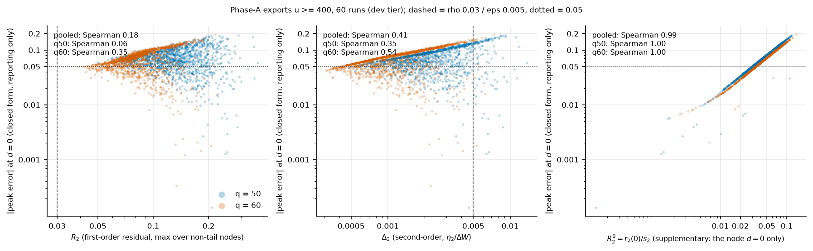
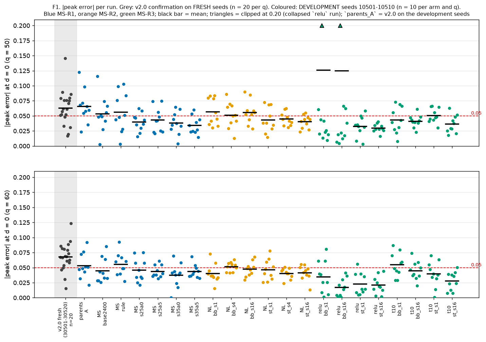
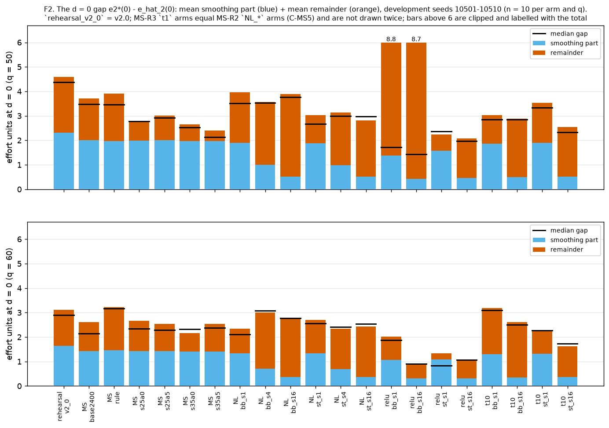
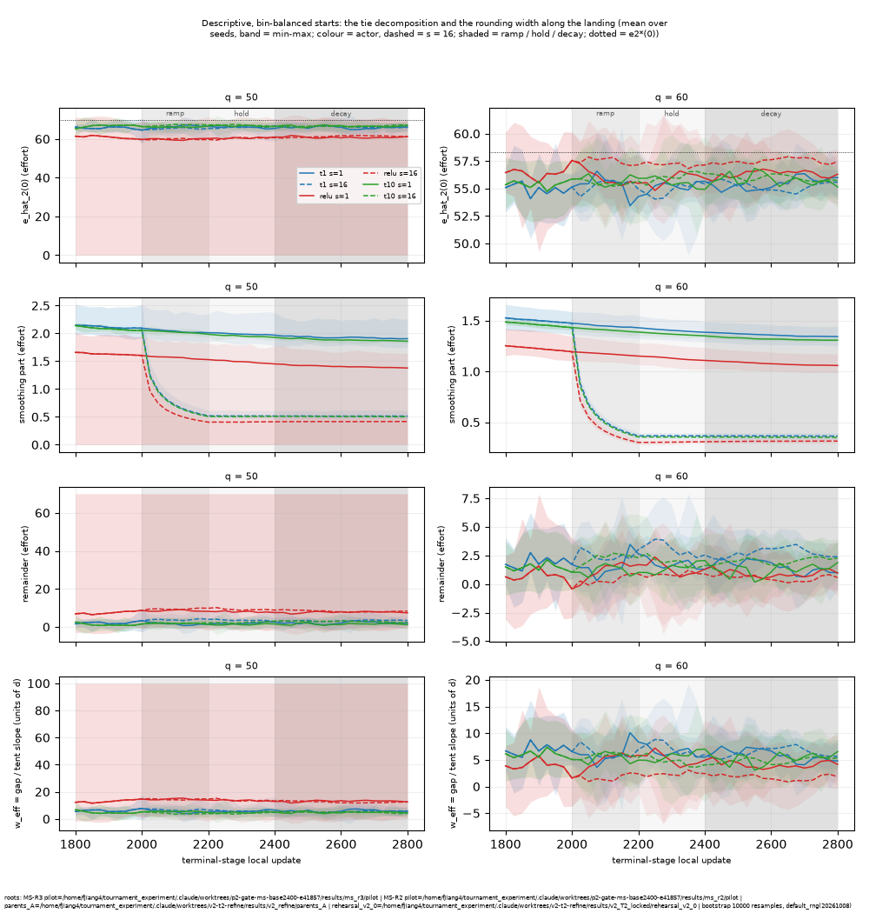
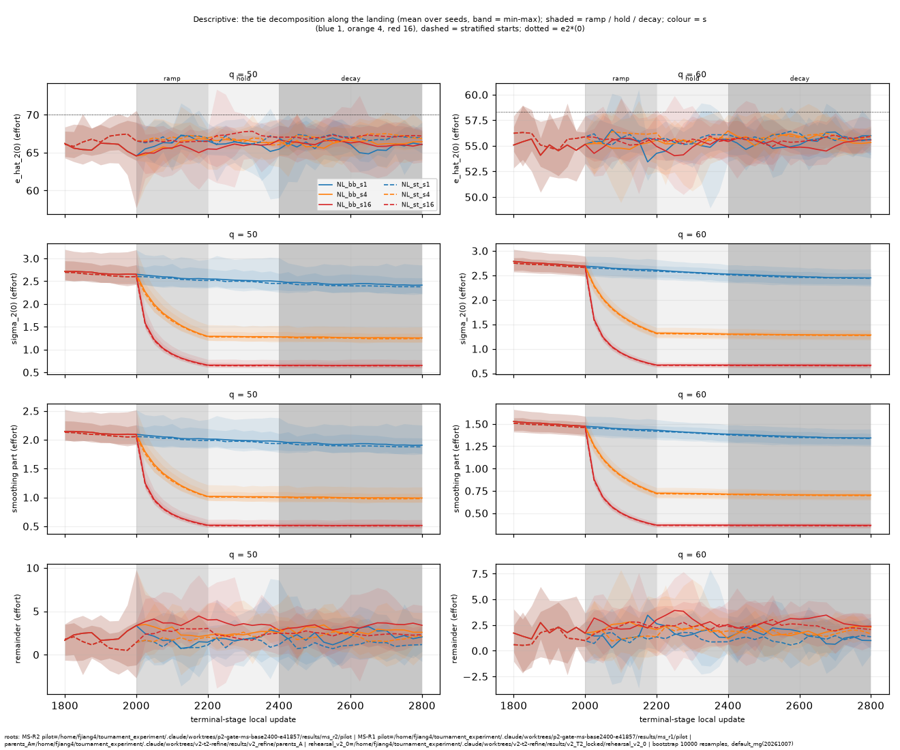
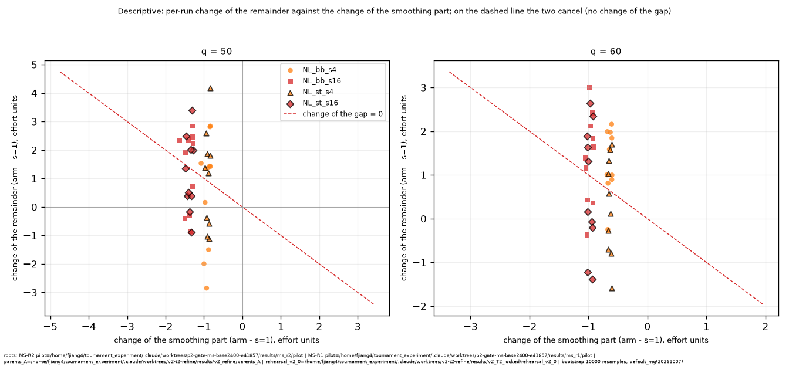
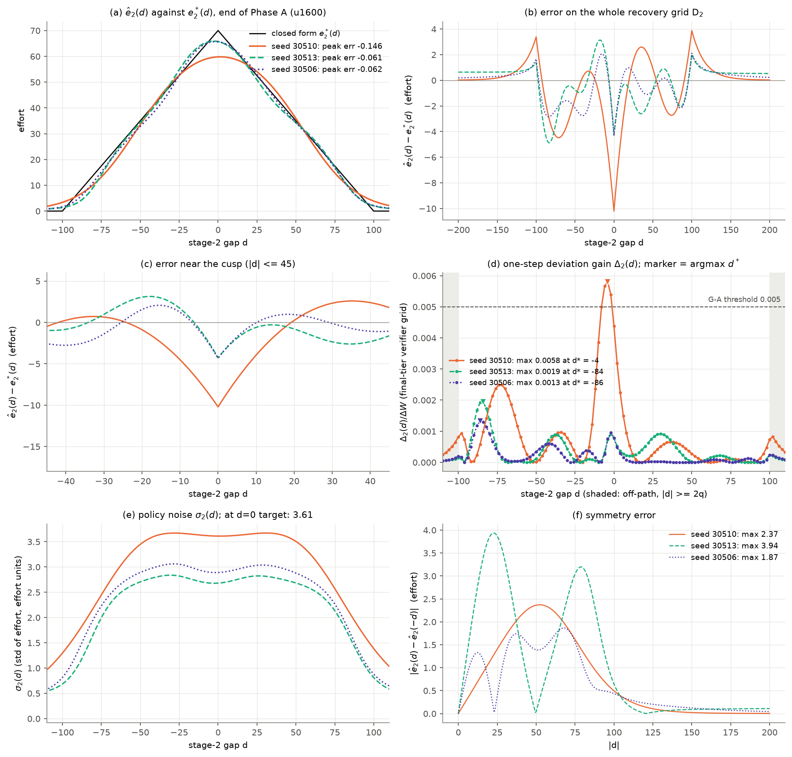
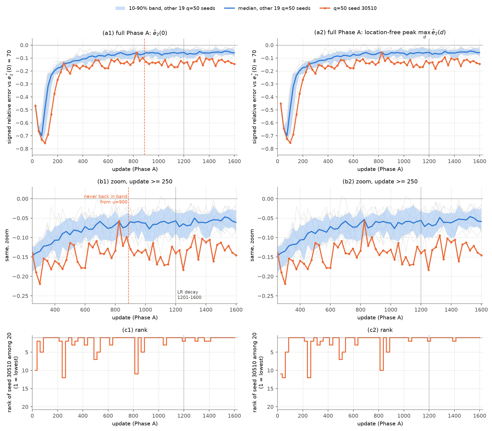

# T=2 status report: close now, or continue improving accuracy?

Folder `reports/t2_status_100826/`, branch `t2-status-pack` (from `origin/ms-r3` `be4fd202`), written 2026-10-08 for a coworker who did not take part in the work and who decides. **Status: decision pending; no experiment of any kind starts before the coworker's reply.** English body with a Chinese one-page summary (section 0). A tag such as `[M3-08]` is an item of `evidence/manifest.csv` (`M1-`..`M3-` the MS rounds, `PI-` the PI's prompts, reply and plan note, `BG-` background files, `T2R:` an item of the 100526 pack that is cited in place, `FIG-` a figure, `TBL-` a table produced by `report_scripts/tables.py`). Every number cites one of them.

## 0. 中文摘要

**问题（原文）：** 基于现有结果，我们应该在此阶段收口，还是继续提高精度？如果继续，优先改进什么、目标是什么？

**T=2 是什么，“解决”指什么。** T=2 是锦标赛博弈中最小的两阶段基准，有闭式均衡可作真值：两个 PPO 学习者自博弈（对手是滞后副本），学习 stage-2 与 stage-1 的 Beta 策略，q 取 50 和 60；闭式均衡只用于评估，不进入训练 [T2R:PL-01][PI-05]。训练回报用博弈模型给出的条件期望回报和期望续值表，不是原始采样回报；这与 `.claude/CLAUDE.md` 为原有 runner 写的“只用采样奖励”不变量不同，是 v2 管线有意为之，论文里能声称的内容要相应收窄 [BG-01][BG-02]。“解决”指协议 v2.0：门槛 G-A、G-F、G-N、G-S 加 fresh-seed 确认；确认通过，q=50 为 19/20，q=60 为 20/20 [T2R:CF-02]。

**当前精度（v2.0，fresh seeds 30501-30520，每个 q 20 个 run）[T2R:R2B-18]。** stage-2 平局点 d=0 的 |peak 误差| 均值为 0.0630（q=50）和 0.0678（q=60）；误差不超过 0.05 的 run 为 5/20 和 4/20；40 个 run 的符号全为负，即学到的努力低于闭式解；缺口中位数 4.31 和 3.95 个努力单位 [T2R:R2B-18][TBL-accuracy-a][TBL-accuracy-b]。这个缺口对支付影响很小：MS-R3 的 160 个 `t1`/`t10` run 中 eta_2/DW 在 0.00013 到 0.00226 之间，门槛为 0.005，全部通过 [TBL-eta]（“为什么影响小”是 PI 的解释，属 [Hypothesis]）。开发种子（10501-10510，每个 arm 和 q 10 个 run）上最好的 arm `relu_st_s16` 均值 0.0297 和 0.0209，两个 q 上 10/10 个 run 不超过 0.05，但 q=50 有一个 G-A 失败；所有 MS 数字都是开发种子，没有任何 MS 配置经过 fresh-seed 确认 [TBL-accuracy-a][M3-01]。

**已确定（[Verified]）。** (1) v2.0 通过门槛和 fresh-seed 确认 [T2R:CF-02]。(2) 缺口的平滑部分与公式 e2*(0)·σ_2(0)/(√π q) 一致，比值 0.99917 到 0.99971（偏差至多 0.083%，不含 2 个塌缩的 relu run）[TBL-formula]；v2.0 开发种子上平滑部分占缺口 50% 和 53% [TBL-share]。(3) 六轮针对 tip 的干预（R1、R2b、R2c、MS-R1、MS-R2、MS-R3）没有一个满足预先登记的判据 (a) 和 (b)，所以没有可采纳的 tip 修复，也没有 v2.1 [TBL-interventions]。(4) 噪声着陆把平滑部分降到预期值，但余项上升、缺口没有可检出的下降 [M2-01]。

**未决。** 余项的机制（[Hypothesis]）；`relu` 的失败率（80 个 run 中 5 个失败，来自两个 (q, seed) 案例，[Insufficient evidence]）[TBL-relufail]；任何 MS 配置在 fresh seeds 上的表现（没有数据）；第三个未经检验的机制读法不足以支撑大规模新项目。

**路径 A（现在收口）。** 不再新跑；v2.0 仍是 T=2 求解器；MS-R1 到 MS-R3 不产生协议改动；把 tip 缺口作为已刻画的局限写出（大小、符号、精确的平滑部分、未解释的余项、对 eta_2 的小影响、`relu` 作为消融）。**路径 B（继续提精度）。** 主指标是 stage-2 d=0 的 |peak 误差| 及误差不超过 0.05 的 run 占比；护栏是 RMSE_pos、tail mean、eta_2、门槛通过率、stage-1 误差；候选措施和各自的证据、可记录的工作量、风险见第 10 节；任何采纳都需要锁定协议、重新排练和 fresh-seed 确认，改 actor 还会带入未评估的 T=3 [T2R:RR-03]。

**PI 侧建议（输入；决定权在同事）。** 倾向路径 A：保留 v2.0，把 tip 缺口作为受限结论报告；理由是已试的 tanh 侧手段均未达判据，剩余效应约一个努力单位或更小，与种子间的离散度同量级（arm 内 e_hat_2(0) 的种子 SD 为 0.45 到 1.56 个努力单位 [M2-02]），而且 PI 的两个机制读法在 RL 中都没有成立。若选路径 B，PI 会只从 `relu` 的稳健性开始（leaky ReLU、不带硬 clamp 的均值映射、分层起点加噪声着陆、每个 q 20 个种子估失败率、预先登记 |peak 误差| 目标并要求门槛零失败）[PI-06]。

**请同事回复：** (i) 收口，还是继续；(ii) 若继续，先做哪项措施，目标是什么（指标、数值、种子集）。

## 1. Purpose and reading guide

**Who decides what.** The coworker decides. This report assembles the state of the T=2 work so that they can answer one question, verbatim:

> 基于现有结果，我们应该在此阶段收口，还是继续提高精度？如果继续，优先改进什么、目标是什么？
>
> (Based on the current results, should we close T=2 at this stage, or continue improving its accuracy? If we continue, what should be improved first, and what is the target?)

Nothing here selects a path. Section 10 contains the PI's recommendation, labelled as an input, and one observation of the assistant that wrote this folder, labelled as such; neither decides. No experiment, lock, confirmation or message to anyone follows from this report.

**Reading time.** Sections 0, 7.2, 9 and 10 are enough to decide (about fifteen minutes); everything else supports them, and the details stay in the linked round reports (`../ms/r1/summary.md`, `../ms/r2/summary.md`, `../ms/r3/summary.md`, `../t2_refine_100526/README.md`).

**Labels (sections 7-10).** Every claim carries one of three labels.
- **[Verified]**: established by a pre-registered criterion, a gate, a deterministic check (bit-identity or reproduction) or an exact formula check; the evidence item is named. A plain measurement that claims no more than what was measured is **[Verified, descriptive]**.
- **[Hypothesis]**: an interpretation or a mechanism, including every PI reading; each comes with the experiment that would test it and whether it was run.
- **[Insufficient evidence]**: a question the records cannot answer, for example an interval that contains 0 with ten seeds (which is not "no effect"), a failure rate estimated from two (q, seed) cases, or any fresh-seed claim about an MS configuration.

Post hoc tables are marked post hoc. Development-seed and fresh-seed numbers are never mixed in one statistic: every accuracy number names its seed set and n. An asterisk `*` in a table marks a 95% percentile-bootstrap interval that excludes 0 (definition in section 4) [M3-04].

**Inputs that are not evidence.** Appendix A (the PI's plan note) and Appendix B (the PI-side reading after MS-R3) of the prompt of this round are inputs [PI-05][PI-06]. Every number taken from them was checked against its record; where a record differs, the record is used and the difference is listed in `pi_record/01_factcheck.md` and section 11.

## 2. The T=2 problem

**The game and its parameters.** Two players choose an effort in [0, 100] at each of two stages; the lead d entering stage 2 (a state) and the final shock decide the win probability through F_ξ, the distribution of the difference of two shocks, which has the triangular density (2q - |z|)/(4q²) on [-2q, 2q] [T2R:100526report section 3.1]. The terminal reward of the learner is w_L + DW F_ξ(d + e - e_opp) - k e² [PI-01]. The parameters are q in {50, 60}, k = 1/3500, w_H = 6, w_L = 2, DW = w_H - w_L = 4 and B = 100 + 2q (the scale of the state input d/B of the actor) [TBL-params][PI-04].

<!-- TBL:params -->
| q | B = 100 + 2q | k | w_H | w_L | DW = w_H - w_L | effort range | e2*(0) = DW/(4qk) | reward_mode | updates (terminal stage + stage 1) |
|---|---|---|---|---|---|---|---|---|---|
| 50 | 200 | 0.000285714 (= 1/3500) | 6 | 2 | 4 | 0-100 | 70.00 | expected | 1600 + 600 |
| 60 | 220 | 0.000285714 (= 1/3500) | 6 | 2 | 4 | 0-100 | 58.33 | expected | 1600 + 600 |
<!-- /TBL:params -->

The closed-form equilibrium of the last stage, e2*(d), is a tent: it peaks at d = 0, where e2*(0) = DW/(4qk) (70 at q = 50 and 58.33 at q = 60 [TBL-params]), because the triangular density has its kink at the tie, and it is 0 in the tail |d| >= 2q [PI-01]. "Effort units" below are units of the effort variable (range 0 to 100), so a gap of 4.3 effort units at q = 50 is 6.1% of e2*(0) [T2R:R2B-18].

**What is learned.** For each stage a Beta policy: a 2-64-64 tanh network whose inputs are a stage feature and d/B outputs the Beta mean (sigmoid, clamped to [1e-6, 1 - 1e-6], times the effort range) and a concentration; the learner trains by self-play against a lagged copy of itself that is refreshed every 20 updates, with a critic of the same size [BG-03][PI-01][PI-04][PI-06]. The learned effort at a state is the Beta mean (effort = 100 times the mean) and evaluation uses the mean, not the mode [PI-04][BG-02].

**Where the closed form enters: evaluation only.** The closed-form equilibrium is used to report errors (peak error, RMSE_pos, tail mean, stage-1 error) and in the offline supervised screen of MS-R3; it never enters the rollout, the sampler, the schedule or the stop rule [PI-01][PI-04]. It does define the gates G-A and G-S and the criterion's primary metric, as evaluation [T2R:PL-02][M3-04]. A test asserts that the stop rule and the sampler make identical decisions when the closed-form functions are replaced by stubs [M1-04].

**Where the game model enters training.** The v2 pipeline does not train on sampled one-step outcomes alone.
- The terminal-stage return uses the conditional expectation over the shock given the sampled actions, `reward_mode = expected` [T2R:PL-01][BG-01]; the choice is recorded in the protocol, and the pilot that compared the sampled and the expected estimator (descriptively, without choosing) is `reports/v2/pilot1_reward_estimator.md` [BG-01]. The conditional expectation is that of the expected terminal reward of the rollout [PI-01].
- The stage-1 return replaces the sampled continuation by a table value Ṽ2(y) = E_z[g_2(y + z)] built once from the frozen stage-2 Beta mean (expected continuation, in v2.0 since the R1 round) [T2R:RR-03].

**The sampled-reward invariant, plainly.** `.claude/CLAUDE.md` lists "sampled training rewards only; closed-form win probability and expected payoff are evaluation-only" as a critical invariant of the original runners [BG-02]. The v2 pipeline deliberately differs from it: the shock distribution, i.e. the game model, enters the training return at least twice (the conditional-expectation reward and the continuation table) [T2R:PL-01][BG-01]. Further departures from the text of the invariant: the starts are designed exploring starts, the verifier-guided sampler uses the DP-BR residual map (game model, no e*), and the opponent is a lagged copy [PI-01][BG-02]. What does not enter is the closed-form equilibrium effort e*. A claim that "PPO agents learn the equilibrium from sampled tournament outcomes" therefore cannot rest on the v2.0/MS results; what they support is "PPO with an expected-reward, expected-continuation estimator, which uses the game's shock distribution but not the equilibrium, recovers the equilibrium to the accuracy of section 7". This is a statement about the scope of the claims, not a defect that this report found.

## 3. Goals

**The role of T=2.** T=2 is the base case of the project with a closed-form ground truth, so that the learned policies can be scored against the equilibrium [PI-05][BG-02]. Later horizons (T=3) are out of scope here and enter only where a choice has a consequence for them, as "not evaluated".

**The session goals (Appendix A, the PI's plan note) and their status after MS-R1..R3.** Baseline: conditional expected reward + expected continuation + backward freeze, settled (protocol v2.0) [PI-05][T2R:PL-01].

<!-- TBL:goals -->
| goal (Appendix A) | implemented | tested | outcome |
|---|---|---|---|
| Restore the stop rule: development DP-BR (threshold or budget) + stopping + targeted polishing | yes, in the MS runner (MS-R1), behind keys [M1-01] | MS-R1 pilot, 100 rule-arm runs at rho_2 = 0.05 [TBL-stoprule] | the stop fired in 0 of 100 runs; polishing was reached at q = 60 and rarely at q = 50; the effect of polishing is not separated from the sampler's [M1-01][M1-02] |
| Verifier-guided prioritised state sampling with global/tail coverage kept (peak + tail constrained stratified sampling, lambda_P, lambda_M, lambda_T) | yes, scheme `stratified_priority`; lambda_T fixed at the bin-balanced tail share [PI-01] | MS-R1 (four sampler arms), MS-R2 and MS-R3 (stratified arms) | sampler arms meet the criterion's part (a) at q = 50 only; the budget control alone reproduces 40-55% of their q = 50 improvement and 52-112% of their q = 60 improvement; the tail mean stayed below its 0.02 limit in every run [M1-01][TBL-gates] |
| Per-stage stop rule (Delta <= eps for M checks: freeze; broad residual: continue global training; localised: targeted polishing) | yes, T-generic code (T = 2 and 3 in tests) [PI-01] | T=2 only in the pilot; the T=3 smoke tests show that the pipeline runs, not how it trains [M3-02] | as the first row; nothing at T=3 was evaluated |
| Address the systematic bias in the report (the stage-2 tip deficit) | the noise landing (MS-R2) and the actor variants (MS-R3) are the two mechanism tests the PI's readings led to [PI-03][PI-04] | MS-R2 (120 runs), MS-R3 (240 runs) | not solved: no row of either primary criterion is met [M2-01][M3-01] |
<!-- /TBL:goals -->

## 4. Definitions

- **d, q, k, DW, B, e2*(d), effort units.** d is the state entering a stage (the lead); q is the half-width of the uniform shock; k = 1/3500 the quadratic effort cost coefficient; DW = w_H - w_L = 4; B = 100 + 2q; e2*(d) the closed-form stage-2 equilibrium effort (a tent with e2*(0) = DW/(4qk)); effort units are the units of the effort variable, 0 to 100 [TBL-params][T2R:PL-02].
- **Peak error.** The signed peak error is (ê2(0) - e2*(0))/e2*(0), with ê2(0) the Beta mean of the stage-2 policy at d = 0, on the final verifier tier, at the terminal freeze of the stage; |peak error| is its absolute value; negative means the learned effort is below the closed form [T2R:100526report section 6]. The location-free peak error compares the maximum over the recovery grid of ê2(d), wherever it lies, with e2*(0) [M3-04].
- **The gap** is e2*(0) - ê2(0) in effort units. Where the signed peak error is negative, |peak error| = gap/e2*(0) [M3-03].
- **sigma_2(0), the smoothing part, the remainder, w_eff.** sigma_2(0) is the standard deviation of the learned effort at d = 0 (the policy's own noise). The smoothing part is e2*(0) - e_σ(0), where e_σ(0) is the tie effort of the game both players actually play when their actions carry that noise; it equals e2*(0) σ_2(0)/(√π q) [M2-05][TBL-formula]. The remainder is e_σ(0) - ê2(0), so gap = smoothing part + remainder. w_eff = gap/(e2*(0)/2q) is the gap in units of d (the rounding width of the tent's tip) [M3-04]. The additive model predicts gap(s=16) = gap(s=1) - (smoothing(s=1) - smoothing(s=16)); the quadrature model predicts sqrt(F² + smoothing(s=16)²) with F² = gap(s=1)² - smoothing(s=1)² [M3-04][TBL-quad].
- **R0, R, Delta_2.** From the development DP-BR verifier, with no closed form: r_2(d) = |ê2(d) - ẽ2(d)| is the distance of the policy mean from the one-step best response ẽ2(d); R0 = r_2(0)/s_2 with s_2 = ẽ2(0) (the tie residual); R is the maximum of r_2(d)/s_2 over the non-tail region; Delta_2 is the maximum one-step deviation gain, so Delta_2/DW is eta_2/DW at the terminal stage [PI-01].
- **RMSE_pos, tail mean, eta_2/DW.** RMSE_pos/e2*(0): the root-mean-square error of ê2 against e2* over recovery-grid nodes with |d| < 2q, divided by e2*(0); tail mean/e2*(0): the mean of ê2 over nodes with |d| >= 2q, divided by e2*(0); eta_2/DW: the largest one-step deviation gain over the final-tier stage-2 grid, divided by DW [T2R:PL-02][PI-01].
- **Gates and their limits** [T2R:PL-02]. G-A (end of the terminal stage, final tier): eta_2/DW <= 0.005, RMSE_pos/e2*(0) <= 0.05 and tail mean/e2*(0) <= 0.02 [T2R:PL-02]. G-F (end of stage 1): the maximum one-step gain of the full policy, over DW, <= 0.01 [T2R:PL-02]. G-N: the development-tier and final-tier values of eta_2/DW and of the stage-1 gain differ by at most 0.001 [T2R:PL-02]. G-S (new in v2.0): |ê1(0) - e1*(0)|/e1*(0) <= 0.05 [T2R:PL-02]. A run passes if all four hold. In the MS tables "stage-2 gate failures" means G-A or the eta part of G-N, and "stage-1 gate failures" means G-F, the Gmax part of G-N or G-S.
- **Criterion parts (a) and (b), and the bootstrap.** For an arm against its comparator, paired by (q, seed): [M3-04] (a) the 95% percentile bootstrap interval of the mean paired difference of |peak error| (arm minus comparator; negative is better) lies below 0 at both q; (b) no run that passes G-A with its G-N(eta) part under the comparator fails it under the arm. The bootstrap uses 10,000 resamples of the ten paired seeds with a fresh generator per (q, statistic); the generator seeds are 20261003 (R1), 20261004 (R2b), 20261005 (R2c), 20261006 (MS-R1), 20261007 (MS-R2) and 20261008 (MS-R3) [T2R:RR-01][T2R:RR-04][T2R:RR-06][M1-04][M2-04][M3-04]. The criterion is descriptive: it is not a gate and it selects nothing [M1-02].
- **Seed blocks.** Development 10501-10510 (all arms of all rounds, ten seeds, both q); the v2.0 confirmation block 30501-30520 (twenty fresh seeds, both q); 40501-40520 is reserved and was never used [T2R:PL-01][M3-01].
- **Starts.** Bin-balanced: the locked sampler that draws the stage-2 starting state uniformly over bins of width 10 [PI-01]. Stratified (`stratified_priority`): the starts are split into near-tie bins (|d| < 20), middle bins and tail bins with shares lambda_P, lambda_M and lambda_T; lambda_T is fixed at the bin-balanced tail share (0.5000 at q = 50, 0.4545 at q = 60) so that tail coverage cannot fall; alpha mixes a verifier-guided focus distribution (proportional to the residual map) into the non-tail part; in the MS-R2/R3 arms lambda_P = 0.35 and alpha = 0.5 [PI-01][PI-03].
- **The noise landing and s.** The terminal stage trains 2800 updates; at local updates 2001-2200 the Beta concentration scale is ramped from 1 to s, held to 2400, and the learning rate decays from 3e-4 to 3e-5 over 2401-2800; s = 1 means no landing [PI-03]. A larger s lowers sigma_2(0) by about 1/sqrt(s) [M2-01].
- **Arms.** `MS_*` (MS-R1): `MS_base` (= `parents_A`, 1600 updates), `MS_base2400` (budget control, bin-balanced, 2400 updates), `MS_rule` (rule with polishing, global sampler bin-balanced in distribution), `MS_s25a0`, `MS_s25a5`, `MS_s35a0`, `MS_s35a5` (rule with stratified sampler, lambda_P 0.25 or 0.35, alpha 0 or 0.5) [M1-01]. `NL_{bb,st}_s{1,4,16}` (MS-R2): bin-balanced or stratified starts, scale s [M2-01]. `{t1,relu,t10}_{bb,st}_s{1,16}` (MS-R3): actor variant `t1` (the current tanh actor), `relu` (ReLU hidden units) or `t10` (tanh with the d input multiplied by 10), bin-balanced (`bb`) or stratified (`st`) starts, scale s in {1, 16}; the critic is unchanged [M3-01].
- **`parents_A` and `rehearsal_v2_0`.** `parents_A` is the v2.0 terminal-stage state of the twenty development runs (seeds 10501-10510, both q) and `rehearsal_v2_0` the full v2.0 re-rehearsal of the same seeds; they share the same terminal stage (MS-R1 check C-MS1: the new runner with legacy settings reproduces it bit for bit, 20 of 20) [M1-06][M1-22][M1-23].

## 5. The current approach

**(a) The locked solver v2.0** [T2R:PL-02][T2R:RR-03].
- Pipeline: terminal stage first (Phase A, 1600 updates: learning rate 3e-4 constant to local update 1200, then linear to 3e-5 over 1201-1600), then stage 1 (Phase B, 600 updates, learning rate linear 3e-4 to 3e-5), with the expected continuation table in Phase B; 512 episodes per update; weight exports every 25 updates [T2R:PL-01].
- Gates G-A, G-F, G-N and G-S as in section 4; a run passes if all hold [T2R:PL-02].
- Confirmation design: fresh seeds 30501-30520 for both q (40 runs), pass rule at least 18 of 20 per q, exact Clopper-Pearson 95% intervals; a re-rehearsal on the development seeds had to pass first [T2R:PL-01][T2R:CF-01].

**(b) The MS stage-wise runner** (`run/run_ms_stagewise.py`; entry points of the line in `reports/ms/README.md`). It generalises the pipeline to T stages, one stage per phase from the last to the first, with exact nested continuation tables, and adds the following, all behind keys whose absence leaves every existing path bit-identical [PI-01][M1-01].
- The stop rule with a first-order residual: a check is eligible when Delta_t <= 0.005, R_t <= rho_t, the tail residual <= 0.02 and the concentration <= 0.04; M = 3 consecutive eligible checks stop the block; otherwise the residual is classified as broad (continue global training) or localised (a targeted polishing block) [PI-01]. rho_2 = 0.05 and rho_1 = 0.03 were pre-registered [PI-02].
- Coverage-constrained stratified starts, with lambda_P, lambda_T and alpha as in section 4 [PI-01].
- The stage-wise freeze: each stage ends in a landing window (LR 3e-4 to 3e-5), is evaluated on both verifier tiers, and is frozen as a snapshot before the next phase starts [PI-01].
- The noise landing (MS-R2) and the actor variants `relu` and `t10` (MS-R3, `BetaActor.variant`) [PI-03][PI-04].

**The checks that keep v2.0 intact** (each is a stop-and-report if it fails): C-R4, the unchanged v2.0 entry point reproduces `rehearsal_v2_0` on the MS-R1 code, 20 of 20 [M1-20]; C-R6, the same on the MS-R3 code, 20 of 20 [M3-22]; C-MS1, the new runner with legacy settings equals `parents_A`, 20 of 20 [M1-22]; C-MS2, `MS_base2400` equals `parents_A` through update 1201, 20 of 20 [M1-01]; C-MS3 and C-MS4, the MS-R2 arms equal their MS-R1 references through update 2001, 20 of 20 each, and C-NL, the s > 1 arms equal the s = 1 arm through update 2001, 80 of 80 [M2-01]; in MS-R3, C-INIT (identical initial weights across actors) 20 of 20, C-NL 120 of 120 and C-MS5 80 of 80 [M3-01]. C-MS5 says the four MS-R3 `t1` arms are bit-identical re-runs of MS-R2's `NL_*` arms: they are not replications [M3-03].

## 6. Completed work

<!-- TBL:rounds -->
| round | dates | branch (head) | prompt | question | design (arms, seeds, q, budget) | pre-registered criterion: outcome | main finding | report |
|---|---|---|---|---|---|---|---|---|
| R1 | 2026-10-03 | `v2-t2-refine` (R1 final record `155cdece`) | prompt 12 (not available) [T2R:RR-01] | six single-factor changes and two diagnostics on the locked v1.1 pipeline | development seeds 10501-10510 x q in {50, 60}; methods 1-6, one at a time, paired by (q, seed) | stage-2 criterion: 0 of 11 rows meet (a) at both q; 0 meet (a) and (b) [T2R:R1-06]. Method 6 met its (stage-1) criterion and entered v2.0 [T2R:RR-01] | only expected continuation (method 6, stage 1) meets its criterion; no stage-2 mechanism is admissible [T2R:RR-01] | `reports/v2/refine/summary.md` [T2R:RR-01] |
| v2.0 | 2026-10-03/04 | `v2-t2-refine` (head `b55d3890`; lock `1d6d4d00`) | prompt 13 (not available) [T2R:RR-03] | lock protocol v2.0 (method 6 + gate G-S) and confirm it on fresh seeds | re-rehearsal on 10501-10510; confirmation on fresh seeds 30501-30520, 40 runs, pass rule >= 18 of 20 per q | pre-registered rule (>= 18 of 20 per q) passed: q=50: 19/20 (exact 95% CI [0.7513, 0.9987]); q=60: 20/20 (exact 95% CI [0.8316, 1.0000]) [T2R:CF-02] | v2.0 passes its confirmation; one run (q=50, seed 30510) fails G-A through eta_2 [T2R:CF-02, T2R:CF-13] | `reports/v2/protocol_v2_0_confirmation.md` [T2R:RR-03] |
| R2b | 2026-10-04 | `v2-t2-r2b` (head `62ecc436`) | prompt 14 (not available) [T2R:RR-04] | three mechanisms for the stage-2 peak and a diagnostic of the failed run | peak-focused starts (shares 0.25/0.50), censored likelihood, pathwise epochs; development seeds | 1 of 6 rows meet (a) at both q; 0 meet (a) and (b) [T2R:R2B-02] | peak-focused starts at share 0.50 meet (a) at both q but violate (b) at q=60; pathwise and censored arms not separated from controls [T2R:RR-04] | `reports/v2/refine_r2b/summary.md` [T2R:RR-04] |
| R2c | 2026-10-05 | `v2-t2-r2c` (head `6a8f4492`) | prompt 15 (transcription) [T2R:RR-06] | four start-distribution arms with a pre-registered selection rule | shares 0.35/0.40/0.50 (two timings); development seeds, 80 runs | 0 of 4 arms meet (a) at both q; 0 meet (a) and (b); selection record: no arm selected [T2R:R2C-02, T2R:R2C-03] | no arm selected: all four hold (b); none meets (a) at q=60 [T2R:R2C-03] | `reports/v2/refine_r2c/summary.md` [T2R:RR-06] |
| MS-R1 | 2026-10-07 | `ms-r1` (head `71c58904`) | prompt 17 [PI-01]; G1 reply [PI-02] | restore the development stop rule, add coverage-constrained verifier-guided starts and targeted polishing | 5 rule/sampler arms + budget control `MS_base2400`; development seeds; 120 pilot runs + 20 base runs; terminal stage 2000-2400 updates | 0 of 6 rows meet (a) at both q; 0 meet (a) and (b) [M1-09] | samplers meet (a) at q=50 only; the budget control reproduces part of the improvement; the stop rule never fires at rho_2 = 0.05 [M1-01] | `reports/ms/r1/summary.md` [M1-01] |
| MS-R2 | 2026-10-07 | `ms-r2` (head `e8eb9a08`) | prompt 19 [PI-03] | is the tip deficit the policy-noise floor? noise landing (scale s in {1, 4, 16}) x sampler | 6 arms; development seeds; 120 pilot runs; terminal stage 2800 updates | 0 of 4 rows meet (a) at both q; 0 meet (a) and (b) [M2-09] | the noise landing lowers the smoothing part as predicted; the remainder rises and no fall of the gap is detectable [M2-01] | `reports/ms/r2/summary.md` [M2-01] |
| MS-R3 | 2026-10-08 | `ms-r3` (head `be4fd202`) | prompt 20 [PI-04] | is the tip deficit set by the actor's resolution at the kink? actor (t1/relu/t10) x sampler x s in {1, 16} | 12 arms; development seeds; 240 pilot runs; terminal stage 2800 updates | 1 of 8 rows meet (a) at both q; 0 meet (a) and (b) [M3-09] | `relu` lowers the typical tie deficit but 5 runs fail G-A; `t10` shows no detectable change of the mean deficit [M3-01] | `reports/ms/r3/summary.md` [M3-01] |
<!-- /TBL:rounds -->

Prompts 12-14 were delivered to the earlier sessions but are not available in the repository; prompt 15 is a transcription [T2R:100526report]. Dates, heads and prompt files of the MS rounds are those of their summaries and of `git ls-remote` at the start of this round (`pi_record/00_build_log.md`).

**The PI's decisions at each gate of this session**, as the prompts and the G1 reply record them:

<!-- TBL:gates_pi -->
| gate | record | PI decision (as the record states it) |
|---|---|---|
| after the 100526 publication | publication prompt, D1 [T2R:100526report section 1] | R1, v2.0, R2b and R2c closed as reported; the locked T=2 solver is v2.0; no v2.1; method 5 (pathwise) closed as negative at matched budgets; censored likelihood not adopted; peak-focused starts not adopted at T=2 and carried as a design input for the T=3 terminal stage |
| start of the session | prompt 17, MS-R1 [PI-01] | baseline settled (conditional expected reward + expected continuation + backward freeze, i.e. v2.0, not touched); restore the development stop rule (threshold or budget) with stopping and targeted polishing, add coverage-constrained verifier-guided starts, T-generic code; T=2 experiments on the development seeds only; stop at gate G1 after P1 |
| gate G1 (MS-R1 P1 to P2) | G1 reply [PI-02] | 'proceed P2'; P1 accepted with its three recorded deviations; rho_2 = 0.05 stands (rho_1 = 0.03 and every other parameter stand); A1: one added arm, the budget-matched control `MS_base2400`; A2: expectations recorded before the launch; A3: analysis additions; launch the 120 runs |
| after the MS-R1 pilot | prompt 19, MS-R2 [PI-03] | PI reading of the MS-R1 data: the d = 0 gap = smoothing part + remainder, and the noise floor is what binds; test it with a noise landing (scale s in {1, 4, 16}) crossed with the sampler; stop rule, classification and polishing off; offline calibration of three closed-form-free stop criteria; development seeds only |
| after the MS-R2 pilot | prompt 20, MS-R3 [PI-04] | the noise-floor reading is withdrawn (the tie effort is invariant to the policy noise); new post hoc reading: the actor's resolution at the kink; only the actor changes (`relu`, `t10` against `t1`), the critic does not; continue to the RL pilot only if the supervised premise check passes |
| after the MS-R3 pilot | prompt 21, this pack [PI-05] | no new experiment of any kind; assemble a status pack for a coworker who decides: close T=2 now, or continue improving accuracy; no experiment before the coworker's reply |
<!-- /TBL:gates_pi -->

## 7. Key results

### 7.1 v2.0 as the certified T=2 solver

- **[Verified]** (pre-registered rule, fresh seeds 30501-30520) The confirmation passed: 19 of 20 runs at q = 50 (exact 95% interval [0.7513, 0.9987]) and 20 of 20 at q = 60 ([0.8316, 1.0000]) against the rule of at least 18 of 20 [T2R:CF-02].
- **[Verified]** (gate) The one failed run is q = 50 seed 30510: it fails G-A through its eta_2 part, eta_2/DW = 0.005803 against the limit 0.005; its RMSE_pos/e2*(0) (0.0451 against 0.05) and tail mean (0.008822 against 0.02) pass, and G-F, G-N and G-S pass [T2R:CF-13][T2R:100526report section 3.5]. G-S passes in 20 of 20 runs at both q [T2R:CF-02]. A read-only diagnostic of the failed run is descriptive and did not decide a cause [T2R:RR-11].
- **[Verified, descriptive]** Stage-1 error (fresh seeds): median |ê1(0) - e1*(0)|/e1* 0.0131 (q = 50) and 0.0117 (q = 60), maximum 0.0464 and 0.0324, no run above the 0.05 limit [TBL-stage1]; the development re-rehearsal gives 0.0120 and 0.0101 [TBL-stage1].

<!-- TBL:stage1_ref -->
| row | q | n | median S1 \|error\| | max | runs above the G-S limit 0.05 |
|---|---|---|---|---|---|
| v2.0 confirmation, fresh 30501-30520 [T2R:CF-03] | 50 | 20 | 0.0131 | 0.0464 | 0 |
| `rehearsal_v2_0`, development [M3-08] | 50 | 10 | 0.0120 | 0.0407 | 0 |
| v2.0 confirmation, fresh 30501-30520 [T2R:CF-03] | 60 | 20 | 0.0117 | 0.0324 | 0 |
| `rehearsal_v2_0`, development [M3-08] | 60 | 10 | 0.0101 | 0.0314 | 0 |
<!-- /TBL:stage1_ref -->

### 7.2 Current accuracy

Table 1 gives the peak error; table 2 the decomposition and the guard rails. **Confirmed rows** are those with fresh seeds (v2.0 only); every other row is **development-only** (seeds 10501-10510, n = 10 per q), not confirmed. `parents_A` and `rehearsal_v2_0` are the same terminal stage (C-MS1), so their peak columns agree; `parents_A` has no stage-1 phase. The MS-R3 `t1` arms are bit-identical re-runs of MS-R2's `NL_*` arms (C-MS5), not replications [M3-01]. `relu_bb_s16` at q = 50 contains the collapsed run (seed 10504), which dominates its mean and its eta_2 maximum [M3-03].

**Table 1. Peak accuracy at d = 0, terminal freeze, final tier** [TBL-accuracy-a].

<!-- TBL:accuracy_a -->
| row | q | seed set, n | mean \|peak\| | median \|peak\| | median signed peak | runs with \|peak\| <= 0.05 | status |
|---|---|---|---|---|---|---|---|
| v2.0, fresh seeds (confirmation) | 50 | fresh 30501-30520, n = 20 | 0.0630 | 0.0615 | -0.0615 | 5 of 20 | confirmed (solver v2.0; 19/20, 20/20) |
| v2.0, fresh seeds (confirmation) | 60 | fresh 30501-30520, n = 20 | 0.0678 | 0.0678 | -0.0678 | 4 of 20 | confirmed (solver v2.0; 19/20, 20/20) |
| v2.0, development seeds (`parents_A`) | 50 | dev 10501-10510, n = 10 | 0.0656 | 0.0625 | -0.0625 | 2 of 10 | development only (solver v2.0; not a confirmation) |
| v2.0, development seeds (`parents_A`) | 60 | dev 10501-10510, n = 10 | 0.0533 | 0.0497 | -0.0497 | 5 of 10 | development only (solver v2.0; not a confirmation) |
| v2.0 re-rehearsal (`rehearsal_v2_0`, full pipeline) | 50 | dev 10501-10510, n = 10 | 0.0656 | 0.0625 | -0.0625 | 2 of 10 | development only (solver v2.0; not a confirmation) |
| v2.0 re-rehearsal (`rehearsal_v2_0`, full pipeline) | 60 | dev 10501-10510, n = 10 | 0.0533 | 0.0497 | -0.0497 | 5 of 10 | development only (solver v2.0; not a confirmation) |
| `MS_base2400` (MS-R1 budget control, 2400 updates) | 50 | dev 10501-10510, n = 10 | 0.0530 | 0.0497 | -0.0497 | 5 of 10 | development only; not confirmed |
| `MS_base2400` (MS-R1 budget control, 2400 updates) | 60 | dev 10501-10510, n = 10 | 0.0449 | 0.0368 | -0.0368 | 7 of 10 | development only; not confirmed |
| `MS_s35a5` (MS-R1 best sampler arm) | 50 | dev 10501-10510, n = 10 | 0.0343 | 0.0305 | -0.0305 | 8 of 10 | development only; not confirmed |
| `MS_s35a5` (MS-R1 best sampler arm) | 60 | dev 10501-10510, n = 10 | 0.0435 | 0.0408 | -0.0408 | 8 of 10 | development only; not confirmed |
| `t1_bb_s1` (MS-R3; = MS-R2 `NL_bb_s1`) | 50 | dev 10501-10510, n = 10 | 0.0565 | 0.0502 | -0.0502 | 5 of 10 | development only; not confirmed |
| `t1_bb_s1` (MS-R3; = MS-R2 `NL_bb_s1`) | 60 | dev 10501-10510, n = 10 | 0.0401 | 0.0362 | -0.0362 | 8 of 10 | development only; not confirmed |
| `t1_st_s16` (MS-R3; = MS-R2 `NL_st_s16`) | 50 | dev 10501-10510, n = 10 | 0.0401 | 0.0425 | -0.0425 | 8 of 10 | development only; not confirmed |
| `t1_st_s16` (MS-R3; = MS-R2 `NL_st_s16`) | 60 | dev 10501-10510, n = 10 | 0.0415 | 0.0435 | -0.0435 | 7 of 10 | development only; not confirmed |
| `t10_st_s16` | 50 | dev 10501-10510, n = 10 | 0.0363 | 0.0334 | -0.0334 | 8 of 10 | development only; not confirmed |
| `t10_st_s16` | 60 | dev 10501-10510, n = 10 | 0.0279 | 0.0297 | -0.0297 | 9 of 10 | development only; not confirmed |
| `relu_st_s16` | 50 | dev 10501-10510, n = 10 | 0.0297 | 0.0283 | -0.0283 | 10 of 10 | development only; not confirmed |
| `relu_st_s16` | 60 | dev 10501-10510, n = 10 | 0.0209 | 0.0183 | -0.0183 | 10 of 10 | development only; not confirmed |
| `relu_bb_s16` | 50 | dev 10501-10510, n = 10 | 0.1247 | 0.0203 | -0.0203 | 7 of 10 | development only; not confirmed |
| `relu_bb_s16` | 60 | dev 10501-10510, n = 10 | 0.0170 | 0.0156 | -0.0156 | 10 of 10 | development only; not confirmed |
<!-- /TBL:accuracy_a -->

**Table 2. Decomposition and guard rails** (gap in effort units; the smoothing part and the remainder of the fresh-seed rows are those of the pack's smoothed-game decomposition [T2R:R2B-18]; `parents_A` carries no decomposition columns, see `rehearsal_v2_0`) [TBL-accuracy-b].

<!-- TBL:accuracy_b -->
| row | q | median gap | mean smoothing part | mean remainder | mean RMSE_pos/e2*(0) | mean tail mean/e2*(0) | max eta_2/DW | stage-2 gate failures (G-A, G-N(eta)) | stage-1 gate failures (G-F, G-N(Gmax), G-S) | stage-1 \|error\| (S1) |
|---|---|---|---|---|---|---|---|---|---|---|
| v2.0, fresh seeds (confirmation) | 50 | 4.31 | 2.29 | 2.12 | 0.0264 | 0.0083 | 0.00580 | 1 | 0 | 0.0131 (med), 0.0464 (max) |
| v2.0, fresh seeds (confirmation) | 60 | 3.95 | 1.62 | 2.33 | 0.0235 | 0.0105 | 0.00319 | 0 | 0 | 0.0117 (med), 0.0324 (max) |
| v2.0, development seeds (`parents_A`) | 50 | 4.38 | n/a | n/a | 0.0225 | 0.0081 | 0.00401 | 0 | n/a | n/a (Phase A only) |
| v2.0, development seeds (`parents_A`) | 60 | 2.90 | n/a | n/a | 0.0201 | 0.0097 | 0.00160 | 0 | n/a | n/a (Phase A only) |
| v2.0 re-rehearsal (`rehearsal_v2_0`, full pipeline) | 50 | 4.38 | 2.30 | 2.29 | 0.0225 | 0.0081 | 0.00401 | 0 | 0 | 0.0120 (med), 0.0407 (max) |
| v2.0 re-rehearsal (`rehearsal_v2_0`, full pipeline) | 60 | 2.90 | 1.64 | 1.47 | 0.0201 | 0.0097 | 0.00160 | 0 | 0 | 0.0101 (med), 0.0314 (max) |
| `MS_base2400` (MS-R1 budget control, 2400 updates) | 50 | 3.48 | 2.00 | 1.71 | 0.0215 | 0.0069 | 0.00352 | 0 | 0 | 0.0069 (med), 0.0197 (max) |
| `MS_base2400` (MS-R1 budget control, 2400 updates) | 60 | 2.15 | 1.42 | 1.20 | 0.0218 | 0.0085 | 0.00155 | 0 | 0 | 0.0142 (med), 0.0288 (max) |
| `MS_s35a5` (MS-R1 best sampler arm) | 50 | 2.14 | 1.97 | 0.43 | 0.0205 | 0.0078 | 0.00164 | 0 | 0 | 0.0109 (med), 0.0374 (max) |
| `MS_s35a5` (MS-R1 best sampler arm) | 60 | 2.38 | 1.41 | 1.13 | 0.0222 | 0.0089 | 0.00165 | 0 | 0 | 0.0096 (med), 0.0424 (max) |
| `t1_bb_s1` (MS-R3; = MS-R2 `NL_bb_s1`) | 50 | 3.51 | 1.91 | 2.05 | 0.0199 | 0.0064 | 0.00196 | 0 | 0 | 0.0097 (med), 0.0334 (max) |
| `t1_bb_s1` (MS-R3; = MS-R2 `NL_bb_s1`) | 60 | 2.11 | 1.34 | 0.99 | 0.0176 | 0.0078 | 0.00103 | 0 | 0 | 0.0093 (med), 0.0147 (max) |
| `t1_st_s16` (MS-R3; = MS-R2 `NL_st_s16`) | 50 | 2.98 | 0.51 | 2.30 | 0.0146 | 0.0075 | 0.00094 | 0 | 0 | 0.0095 (med), 0.0277 (max) |
| `t1_st_s16` (MS-R3; = MS-R2 `NL_st_s16`) | 60 | 2.54 | 0.36 | 2.06 | 0.0142 | 0.0088 | 0.00058 | 0 | 0 | 0.0052 (med), 0.0254 (max) |
| `t10_st_s16` | 50 | 2.34 | 0.51 | 2.04 | 0.0132 | 0.0046 | 0.00127 | 0 | 0 | 0.0171 (med), 0.0290 (max) |
| `t10_st_s16` | 60 | 1.73 | 0.36 | 1.27 | 0.0137 | 0.0058 | 0.00056 | 0 | 0 | 0.0136 (med), 0.0259 (max) |
| `relu_st_s16` | 50 | 1.98 | 0.46 | 1.62 | 0.0183 | 0.0019 | 0.01805 | 1 | 1 | 0.0157 (med), 0.0226 (max) |
| `relu_st_s16` | 60 | 1.07 | 0.32 | 0.76 | 0.0124 | 0.0023 | 0.00074 | 0 | 0 | 0.0087 (med), 0.0183 (max) |
| `relu_bb_s16` | 50 | 1.42 | 0.42 | 8.31 | 0.0717 | 0.0014 | 0.25926 | 1 | 1 | 0.0056 (med), 1.0000 (max) |
| `relu_bb_s16` | 60 | 0.91 | 0.31 | 0.57 | 0.0116 | 0.0018 | 0.00058 | 0 | 0 | 0.0059 (med), 0.0139 (max) |
<!-- /TBL:accuracy_b -->

- **[Verified, descriptive]** On the fresh seeds v2.0 has mean |peak error| 0.0630 and 0.0678 with 5 and 4 of 20 runs within 0.05, and 39 of 40 runs pass G-A [T2R:R2B-18][TBL-accuracy-a][TBL-accuracy-b].
- **[Verified, descriptive]** On the development seeds the three arms named by the decision lie lower: `relu_st_s16` 0.0297 and 0.0209 (10 and 10 of 10 runs within 0.05, one G-A failure at q = 50), `t10_st_s16` 0.0363 and 0.0279, `t1_st_s16` 0.0401 and 0.0415, against 0.0656 and 0.0533 for `parents_A` [TBL-accuracy-a]. Against `parents_A` with MS-R1's criterion, `t1_st_s16` and `t10_st_s16` are "met"; that comparison confounds budget, sampler and landing [M3-10][M2-02]. The matched-budget comparison is `MS_base2400`: 0.0530 and 0.0449 [TBL-accuracy-a].
- **[Insufficient evidence]** Whether any of these development-seed gains survive on fresh seeds: no MS configuration was confirmed [M3-01].

### 7.3 The stage-2 tip deficit

**Size and sign.**
- **[Verified, descriptive]** On the fresh seeds the median gap is 4.31 effort units at q = 50 and 3.95 at q = 60, while the mean |peak error| is 0.0630 and 0.0678 of e2*(0); the signed error is negative in 40 of 40 runs, the most negative -0.1458 (seed 30510) [T2R:R2B-18][TBL-accuracy-b][TBL-signs].
- **[Verified, descriptive]** The deficit is below the closed form in every v2.0 run (40 of 40 fresh, 20 of 20 development) and in all 160 MS-R3 `t1` and `t10` runs, but not in every run of every round: eight runs have a non-negative signed error, one each in R2b, R2c and MS-R1 (at most +0.0009) and five in MS-R3, all `relu` (up to +0.0123) [TBL-signs][TBL-nonneg]. This corrects the statement of the PI-side reading (Appendix B1) that the learned effort is below the closed form "in every run of every round" [PI-06].

<!-- TBL:signs -->
| runs | n runs | runs with signed peak error >= 0 | most negative signed peak error |
|---|---|---|---|
| v2.0 confirmation, fresh 30501-30520 [T2R:R2B-18] | 40 | 0 | -0.1458 |
| R1 stage-2 runs, development [T2R:R1-37] | 240 | 0 | -0.1269 |
| R2b runs, development [T2R:R2B-03] | 200 | 1 | -0.1222 |
| R2c runs, development [T2R:R2C-01] | 160 | 1 | -0.1222 |
| MS-R1 arms, development [M1-08] | 140 | 1 | -0.1222 |
| MS-R2 arms, development [M2-08] | 120 | 0 | -0.0896 |
| MS-R3 arms, development [M3-08] | 240 | 5 | -1.0000 |
| MS-R3 `t1` and `t10` arms only [M3-08] | 160 | 0 | -0.0896 |
| MS-R3 `relu` arms only [M3-08] | 80 | 5 | -1.0000 |
<!-- /TBL:signs -->

<!-- TBL:nonneg -->
| round | arm | q | seed | signed peak error | source |
|---|---|---|---|---|---|
| R2b | A_ctrl200_lr3e-4 | 50 | 10510 | +0.000916 | T2R:R2B-03 |
| R2c | A_peak50_late800 | 60 | 10506 | +0.000938 | T2R:R2C-01 |
| MS-R1 | MS_s35a0 | 60 | 10501 | +0.000143 | M1-08 |
| MS-R3 | relu_bb_s16 | 60 | 10501 | +0.004374 | M3-08 |
| MS-R3 | relu_bb_s16 | 60 | 10502 | +0.000855 | M3-08 |
| MS-R3 | relu_bb_s16 | 60 | 10504 | +0.003885 | M3-08 |
| MS-R3 | relu_st_s1 | 50 | 10508 | +0.003207 | M3-08 |
| MS-R3 | relu_st_s16 | 60 | 10509 | +0.012349 | M3-08 |
<!-- /TBL:nonneg -->

**Decomposition and the formula check.**
- **[Verified]** (exact formula check) The smoothing part equals e2*(0) σ_2(0)/(√π q): the ratio of the recorded smoothing part to the formula lies between 0.99917 and 0.99971 in every MS-arm run (largest deviation 0.083%) except the two runs of the collapsed `relu` policy, whose tie effort is 1e-4 (ratios 0.0000 and 0.0472) [TBL-formula].

<!-- TBL:formula -->
| round | rows | runs | min ratio | max ratio | largest deviation from 1 | ratio in the collapsed `relu` run(s) (excluded from the previous columns) |
|---|---|---|---|---|---|---|
| MS-R1 | MS arms | 140 | 0.99927 | 0.99971 | 0.073 % | - |
| MS-R1 | comparator rows (`parents_A`, `rehearsal_v2_0`, reference arms) | 40 | 0.99936 | 0.99971 | 0.064 % | - |
| MS-R2 | MS arms | 120 | 0.99917 | 0.99952 | 0.083 % | - |
| MS-R2 | comparator rows (`parents_A`, `rehearsal_v2_0`, reference arms) | 80 | 0.99927 | 0.99971 | 0.073 % | - |
| MS-R3 | MS arms | 240 | 0.99917 | 0.99952 | 0.083 % | 0.0000, 0.0472 (2 runs) |
| MS-R3 | comparator rows (`parents_A`, `rehearsal_v2_0`, reference arms) | 120 | 0.99917 | 0.99971 | 0.083 % | - |
<!-- /TBL:formula -->

- **[Verified, descriptive]** At s = 1 the smoothing part is 48-62% of the gap in the four `t1` cells of MS-R3 and 50% and 53% in `rehearsal_v2_0`; the rest is the remainder [TBL-share]. At s = 16 the smoothing part is 13-18% of the gap in the four `t1` cells [TBL-share].

<!-- TBL:share -->
| arm | q | n | mean gap | mean smoothing part | mean remainder | smoothing part / gap (ratio of means) |
|---|---|---|---|---|---|---|
| rehearsal_v2_0 | 50 | 10 | 4.592 | 2.304 | 2.288 | 50 % |
| rehearsal_v2_0 | 60 | 10 | 3.112 | 1.640 | 1.472 | 53 % |
| t1_bb_s1 | 50 | 10 | 3.958 | 1.905 | 2.053 | 48 % |
| t1_bb_s1 | 60 | 10 | 2.338 | 1.343 | 0.995 | 57 % |
| t1_st_s1 | 50 | 10 | 3.035 | 1.877 | 1.158 | 62 % |
| t1_st_s1 | 60 | 10 | 2.691 | 1.337 | 1.355 | 50 % |
| t1_bb_s16 | 50 | 10 | 3.897 | 0.514 | 3.383 | 13 % |
| t1_bb_s16 | 60 | 10 | 2.755 | 0.365 | 2.390 | 13 % |
| t1_st_s16 | 50 | 10 | 2.809 | 0.506 | 2.303 | 18 % |
| t1_st_s16 | 60 | 10 | 2.422 | 0.359 | 2.064 | 15 % |
<!-- /TBL:share -->

- **[Insufficient evidence]** What the remainder is. It is the part of the gap that the policy's own noise does not explain; the records do not give its mechanism (sections 7.4, 7.5 and 9).

**Additive against quadrature.**
- **[Verified, descriptive]** The quadrature model is closer to the observed gap at s = 16 than the additive model in 10 of 12 MS-R3 cells (the exceptions are `relu_bb` at q = 60 and `t10_st` at q = 50) [TBL-quad]. For MS-R2's four `t1` cells see the preamble of prompt 20 [PI-04].
- **[Hypothesis]** The reading behind the quadrature model is that the fit rounding and the noise smoothing combine like two kernel widths. It was written down before MS-R3 and tested only through this fit; a test that would separate it from other readings (for example a run with F varied at fixed s) was not run [M3-04][M3-03].

<!-- TBL:quad -->
| actor | starts | q | gap(s=1) | smoothing(s=16) | additive prediction of gap(s=16) | quadrature prediction | observed gap(s=16) | closer |
|---|---|---|---|---|---|---|---|---|
| t1 | bb | 50 | 3.958 | 0.514 | 2.566 | 3.507 | 3.897 | quadrature |
| t1 | bb | 60 | 2.338 | 0.365 | 1.359 | 1.948 | 2.755 | quadrature |
| t1 | st | 50 | 3.035 | 0.506 | 1.663 | 2.437 | 2.809 | quadrature |
| t1 | st | 60 | 2.691 | 0.359 | 1.713 | 2.363 | 2.422 | quadrature |
| relu | bb | 50 | 8.793 | 0.417 | 7.832 | 8.694 | 8.731 | quadrature |
| relu | bb | 60 | 2.026 | 0.315 | 1.282 | 1.755 | 0.885 | additive |
| relu | st | 50 | 2.236 | 0.459 | 1.125 | 1.657 | 2.081 | quadrature |
| relu | st | 60 | 1.327 | 0.318 | 0.568 | 0.838 | 1.077 | quadrature |
| t10 | bb | 50 | 3.027 | 0.503 | 1.671 | 2.441 | 2.882 | quadrature |
| t10 | bb | 60 | 3.187 | 0.352 | 2.232 | 2.928 | 2.618 | quadrature |
| t10 | st | 50 | 3.540 | 0.505 | 2.149 | 3.031 | 2.542 | additive |
| t10 | st | 60 | 2.294 | 0.357 | 1.328 | 1.908 | 1.630 | quadrature |

Quadrature closer in 10 of 12 cells (computed from `quadrature_check.csv`).
<!-- /TBL:quad -->

**The effect on payoff.**
- **[Verified, descriptive]** In the 160 MS-R3 `t1` and `t10` runs eta_2/DW lies between 0.00013 and 0.00226 against the limit 0.005 and every run passes every gate [TBL-eta][M3-03]; on the fresh seeds eta_2/DW is at most 0.0058 and 39 of 40 runs pass G-A [TBL-accuracy-b].
- **[Hypothesis]** The PI's reading is that the deficit costs little payoff because the learner's payoff is flat on the under-effort side of the tie [PI-06]. A test would compare the learner's payoff along effort offsets at the tie; it was not run.

<!-- TBL:eta -->
| runs | min eta_2/DW | max eta_2/DW | gate limit | runs passing every gate |
|---|---|---|---|---|
| MS-R3 `t1` and `t10`, 160 runs [M3-08] | 0.00013 | 0.00226 | 0.005 | 160 of 160 |
<!-- /TBL:eta -->

### 7.4 What moved the tip and what did not

One row per arm and comparison, all rounds. Paired change of |peak error| (arm minus comparator; negative is better) with its 95% interval at each q (development seeds, ten pairs per q) [TBL-interventions]. The arm's guard rails are the maximum tail mean over both q against the 0.02 limit and the arm runs failing G-A or G-N(eta), of 20 [T2R:PL-02]; then part (b), and the verdict as each round pre-registered it. `A_ctrl200`, `A_ctrl200_lr3e-4` and `MS_base2400` are controls, not candidates; the MS-R1 secondary rows compare the arms with the matched-budget control `MS_base2400` [TBL-interventions].

<!-- TBL:interventions -->
| round | arm | comparator | paired change of \|peak\|, q=50 [95% CI] | q=60 [95% CI] | max tail mean/e2*(0) of the arm (limit 0.02) | arm runs failing G-A or G-N(eta) | (b) status | verdict (as the round pre-registered it) | source |
|---|---|---|---|---|---|---|---|---|---|
| R1 | `A_polish1` | `A_base` | -0.0017 [-0.0131, +0.0088] | +0.0085 [-0.0013, +0.0184] | 0.0133 | 0 of 20 | holds | not met: (a) met at neither q; (b) holds | T2R:R1-06 |
| R1 | `A_polish2` | `A_base` | -0.0004 [-0.0180, +0.0201] | +0.0062 [-0.0057, +0.0203] | 0.0123 | 0 of 20 | holds | not met: (a) met at neither q; (b) holds | T2R:R1-06 |
| R1 | `A_batch` | `A_base` | -0.0073 [-0.0207, +0.0049] | +0.0078 [-0.0043, +0.0198] | 0.0116 | 0 of 20 | holds | not met: (a) met at neither q; (b) holds | T2R:R1-06 |
| R1 | `A_batch_mb256` | `A_base` | -0.0128 [-0.0241, -0.0020] * | +0.0067 [-0.0051, +0.0185] | 0.0103 | 0 of 20 | holds | not met: (a) met at q=50 only; (b) holds | T2R:R1-06 |
| R1 | `A_kl005` | `A_base` | -0.0022 [-0.0179, +0.0104] | +0.0129 [-0.0005, +0.0256] | 0.0126 | 0 of 20 | holds | not met: (a) met at neither q; (b) holds | T2R:R1-06 |
| R1 | `A_kl010` | `A_base` | -0.0043 [-0.0196, +0.0093] | +0.0027 [-0.0093, +0.0149] | 0.0136 | 0 of 20 | holds | not met: (a) met at neither q; (b) holds | T2R:R1-06 |
| R1 | `A_anneal2` | `A_base` | -0.0105 [-0.0226, +0.0009] | -0.0024 [-0.0126, +0.0088] | 0.0125 | 0 of 20 | holds | not met: (a) met at neither q; (b) holds | T2R:R1-06 |
| R1 | `A_anneal4` | `A_base` | -0.0011 [-0.0146, +0.0120] | +0.0118 [+0.0051, +0.0195] * | 0.0128 | 0 of 20 | holds | not met: (a) met at neither q; (b) holds | T2R:R1-06 |
| R1 | `A_ctrl200` | `A_base` | -0.0003 [-0.0103, +0.0095] | +0.0050 [-0.0055, +0.0144] | 0.0117 | 0 of 20 | holds | not met: (a) met at neither q; (b) holds | T2R:R1-06 |
| R1 | `A_detmean` | `A_base` | -0.0066 [-0.0149, +0.0015] | +0.0032 [-0.0038, +0.0106] | 0.0126 | 0 of 20 | holds | not met: (a) met at neither q; (b) holds | T2R:R1-06 |
| R1 | `A_detmean` | `A_ctrl200` | -0.0063 [-0.0150, +0.0030] | -0.0018 [-0.0122, +0.0098] | 0.0126 | 0 of 20 | holds | not met: (a) met at neither q; (b) holds | T2R:R1-06 |
| R2b | `A_peak25` | `A_base` | -0.0119 [-0.0367, +0.0083] | -0.0012 [-0.0170, +0.0133] | 0.0170 | 0 of 20 | holds | not met: (a) met at neither q; (b) holds | T2R:R2B-02 |
| R2b | `A_peak50` | `A_base` | -0.0235 [-0.0414, -0.0038] * | -0.0118 [-0.0227, -0.0010] * | 0.0221 | 3 of 20 | violated | not met: (a) met at both q; (b) violated | T2R:R2B-02 |
| R2b | `A_censored` | `A_base` | -0.0002 [-0.0172, +0.0157] | -0.0056 [-0.0131, +0.0019] | 0.0125 | 0 of 20 | holds | not met: (a) met at neither q; (b) holds | T2R:R2B-02 |
| R2b | `P20_lr3e-5` | `A_ctrl200` | -0.0026 [-0.0115, +0.0058] | +0.0006 [-0.0080, +0.0108] | 0.0124 | 0 of 20 | holds | not met: (a) met at neither q; (b) holds | T2R:R2B-02 |
| R2b | `P20_lr3e-4` | `A_ctrl200_lr3e-4` | +0.0127 [+0.0001, +0.0268] * | +0.0029 [-0.0108, +0.0151] | 0.0119 | 0 of 20 | holds | not met: (a) met at neither q; (b) holds | T2R:R2B-02 |
| R2b | `A_ctrl200_lr3e-4` | `parent_u1600` | -0.0190 [-0.0333, -0.0043] * | -0.0004 [-0.0100, +0.0091] | 0.0117 | 1 of 20 | violated | not met: (a) met at q=50 only; (b) violated | T2R:R2B-02 |
| R2c | `A_peak35` | `A_base` | -0.0308 [-0.0486, -0.0135] * | -0.0054 [-0.0164, +0.0071] | 0.0194 | 0 of 20 | holds | not met: (a) met at q=50 only; (b) holds | T2R:R2C-02 |
| R2c | `A_peak40` | `A_base` | -0.0235 [-0.0397, -0.0077] * | -0.0065 [-0.0187, +0.0065] | 0.0178 | 0 of 20 | holds | not met: (a) met at q=50 only; (b) holds | T2R:R2C-02 |
| R2c | `A_peak50_late400` | `A_base` | -0.0143 [-0.0302, +0.0005] | -0.0059 [-0.0179, +0.0058] | 0.0144 | 0 of 20 | holds | not met: (a) met at neither q; (b) holds | T2R:R2C-02 |
| R2c | `A_peak50_late800` | `A_base` | -0.0178 [-0.0335, -0.0013] * | +0.0002 [-0.0156, +0.0151] | 0.0191 | 0 of 20 | holds | not met: (a) met at q=50 only; (b) holds | T2R:R2C-02 |
| MS-R1 | `MS_base2400` | `parents_A` | -0.0126 [-0.0285, +0.0014] | -0.0085 [-0.0193, +0.0041] | 0.0104 | 0 of 20 | holds | not met: (a) met at neither q; (b) holds | M1-09 |
| MS-R1 | `MS_rule` | `parents_A` | -0.0098 [-0.0392, +0.0192] | +0.0019 [-0.0156, +0.0193] | 0.0119 | 0 of 20 | holds | not met: (a) met at neither q; (b) holds | M1-09 |
| MS-R1 | `MS_s25a0` | `parents_A` | -0.0260 [-0.0456, -0.0076] * | -0.0076 [-0.0270, +0.0119] | 0.0093 | 0 of 20 | holds | not met: (a) met at q=50 only; (b) holds | M1-09 |
| MS-R1 | `MS_s25a5` | `parents_A` | -0.0227 [-0.0369, -0.0053] * | -0.0099 [-0.0238, +0.0022] | 0.0114 | 0 of 20 | holds | not met: (a) met at q=50 only; (b) holds | M1-09 |
| MS-R1 | `MS_s35a0` | `parents_A` | -0.0277 [-0.0503, -0.0050] * | -0.0162 [-0.0323, +0.0010] | 0.0113 | 1 of 20 | violated | not met: (a) met at q=50 only; (b) violated | M1-09 |
| MS-R1 | `MS_s35a5` | `parents_A` | -0.0313 [-0.0516, -0.0108] * | -0.0099 [-0.0235, +0.0011] | 0.0122 | 0 of 20 | holds | not met: (a) met at q=50 only; (b) holds | M1-09 |
| MS-R1 (vs `MS_base2400`) | `MS_rule` | `MS_base2400` | +0.0028 [-0.0258, +0.0327] | +0.0103 [-0.0121, +0.0306] | 0.0119 | 0 of 20 | holds | not met: (a) met at neither q; (b) holds | M1-10 |
| MS-R1 (vs `MS_base2400`) | `MS_s25a0` | `MS_base2400` | -0.0135 [-0.0312, +0.0040] | +0.0009 [-0.0132, +0.0161] | 0.0093 | 0 of 20 | holds | not met: (a) met at neither q; (b) holds | M1-10 |
| MS-R1 (vs `MS_base2400`) | `MS_s25a5` | `MS_base2400` | -0.0101 [-0.0244, +0.0053] | -0.0014 [-0.0135, +0.0099] | 0.0114 | 0 of 20 | holds | not met: (a) met at neither q; (b) holds | M1-10 |
| MS-R1 (vs `MS_base2400`) | `MS_s35a0` | `MS_base2400` | -0.0152 [-0.0393, +0.0071] | -0.0077 [-0.0228, +0.0076] | 0.0113 | 1 of 20 | violated | not met: (a) met at neither q; (b) violated | M1-10 |
| MS-R1 (vs `MS_base2400`) | `MS_s35a5` | `MS_base2400` | -0.0188 [-0.0386, +0.0018] | -0.0014 [-0.0156, +0.0108] | 0.0122 | 0 of 20 | holds | not met: (a) met at neither q; (b) holds | M1-10 |
| MS-R2 | `NL_bb_s4` | `NL_bb_s1` | -0.0056 [-0.0233, +0.0100] | +0.0114 [+0.0034, +0.0185] * | 0.0096 | 0 of 20 | holds | not met: (a) met at neither q; (b) holds | M2-09 |
| MS-R2 | `NL_bb_s16` | `NL_bb_s1` | -0.0009 [-0.0132, +0.0102] | +0.0072 [-0.0038, +0.0174] | 0.0106 | 0 of 20 | holds | not met: (a) met at neither q; (b) holds | M2-09 |
| MS-R2 | `NL_st_s4` | `NL_st_s1` | +0.0013 [-0.0130, +0.0159] | -0.0059 [-0.0176, +0.0053] | 0.0125 | 0 of 20 | holds | not met: (a) met at neither q; (b) holds | M2-09 |
| MS-R2 | `NL_st_s16` | `NL_st_s1` | -0.0032 [-0.0142, +0.0079] | -0.0046 [-0.0192, +0.0099] | 0.0134 | 0 of 20 | holds | not met: (a) met at neither q; (b) holds | M2-09 |
| MS-R3 | `relu_bb_s1` | `t1_bb_s1` | +0.0691 [-0.0363, +0.2696] | -0.0054 [-0.0207, +0.0112] | 0.0041 | 2 of 20 | violated | not met: (a) met at neither q; (b) violated | M3-09 |
| MS-R3 | `relu_bb_s16` | `t1_bb_s16` | +0.0691 [-0.0456, +0.2745] | -0.0302 [-0.0372, -0.0231] * | 0.0032 | 1 of 20 | violated | not met: (a) met at q=60 only; (b) violated | M3-09 |
| MS-R3 | `relu_st_s1` | `t1_st_s1` | -0.0108 [-0.0304, +0.0059] | -0.0234 [-0.0387, -0.0082] * | 0.0048 | 1 of 20 | violated | not met: (a) met at q=60 only; (b) violated | M3-09 |
| MS-R3 | `relu_st_s16` | `t1_st_s16` | -0.0104 [-0.0162, -0.0047] * | -0.0206 [-0.0309, -0.0068] * | 0.0042 | 1 of 20 | violated | not met: (a) met at both q; (b) violated | M3-09 |
| MS-R3 | `t10_bb_s1` | `t1_bb_s1` | -0.0133 [-0.0359, +0.0086] | +0.0146 [+0.0019, +0.0265] * | 0.0054 | 0 of 20 | holds | not met: (a) met at neither q; (b) holds | M3-09 |
| MS-R3 | `t10_bb_s16` | `t1_bb_s16` | -0.0145 [-0.0285, -0.0025] * | -0.0023 [-0.0128, +0.0100] | 0.0053 | 0 of 20 | holds | not met: (a) met at q=50 only; (b) holds | M3-09 |
| MS-R3 | `t10_st_s1` | `t1_st_s1` | +0.0072 [-0.0071, +0.0220] | -0.0068 [-0.0275, +0.0111] | 0.0056 | 0 of 20 | holds | not met: (a) met at neither q; (b) holds | M3-09 |
| MS-R3 | `t10_st_s16` | `t1_st_s16` | -0.0038 [-0.0130, +0.0067] | -0.0136 [-0.0255, +0.0006] | 0.0063 | 0 of 20 | holds | not met: (a) met at neither q; (b) holds | M3-09 |
<!-- /TBL:interventions -->

- **[Verified]** (pre-registered criteria) No intervention of any of the six tip rounds met its criterion with part (b) holding. Part (a) holds at both q for `A_peak50` (R2b) and for `relu_st_s16` (MS-R3), and for each of them part (b) is violated; the pre-registered rule of R2c selected no arm [TBL-interventions][T2R:R2C-03].
- **[Verified]** (criterion) The failures and unmet results the table contains: R1: polishing, larger batch (`A_batch_mb256` meets (a) at q = 50 only), target-KL, annealing (`A_anneal4` is worse at q = 60: +0.0118 [+0.0051, +0.0195]) and the one-step pathwise arm; R2b: pathwise P20 (`P20_lr3e-4` worse than its control at q = 50: +0.0127 [+0.0001, +0.0268]), the censored likelihood, and peak share 0.5, which meets (a) at both q but has three q = 60 runs above the tail limit; R2c: three of four arms meet (a) at q = 50, none at q = 60; MS-R1: sampler arms meet (a) at q = 50 only (-0.0227 to -0.0313) and `MS_s35a0` has one run with eta_2/DW 0.005054; MS-R2: no row, one cell above 0 (`NL_bb_s4`, q = 60: +0.0114 [+0.0034, +0.0185]); MS-R3: no row, five `relu` failures [TBL-interventions][T2R:R2B-02][M1-09][M2-09][M3-09].
- **[Verified]** (exception that does not count) R1's expected continuation (method 6) met its pre-registered criterion, but for the stage-1 error; it became part of v2.0 and is not a tip result [T2R:RR-01].
- **[Verified, descriptive]** The budget control: 1600 to 2400 updates changes |peak error| by -0.0126 [-0.0285, +0.0014] at q = 50 and -0.0085 [-0.0193, +0.0041] at q = 60, and reproduces 40-55% (q = 50) and 52-112% (q = 60) of the sampler arms' mean improvement; no matched-budget interval of the secondary table excludes 0 on |peak error| [TBL-budget][M1-01][M1-02].

<!-- TBL:budget -->
| row | q=50 [95% CI] | q=60 [95% CI] |
|---|---|---|
| `MS_base2400` minus `parents_A` (1600 to 2400 updates) | -0.0126 [-0.0285, +0.0014] | -0.0085 [-0.0193, +0.0041] |
<!-- /TBL:budget -->

- **[Verified, descriptive]** (MS-R2, reading withdrawn) The noise landing lowered the smoothing part by 0.64-1.39 effort units in all eight cells, as predicted, while the remainder rose by 0.30-1.40; the seed means of ê2(0) are nearly the same at s = 1, 4 and 16, so the tie effort did not follow the lower noise; the PI's noise-floor reading was withdrawn in prompt 20 [M2-01][M2-02][PI-04].
- **[Insufficient evidence]** Effects smaller than the intervals (half-widths 0.006-0.16 in MS-R3's primary rows, 0.008-0.017 in MS-R2's) cannot be seen with ten seeds; an interval that contains 0 is not "no effect" [M3-02][M2-01].

### 7.5 MS-R3 in detail

All numbers of this section are from the development seeds 10501-10510, n = 10 per arm and q [M3-08], except the pilot-4 fit value 0.00133 (q = 50, five initialisations) [T2R:R2B-17].

**The premise check.**
- **[Verified]** (pre-registered check, PASS) In the offline supervised fit at the RL budget (56,000 steps, bin-balanced) the median tip deficit is 1.64 (q = 50) and 6.32 (q = 60) effort units for `t1`, 0.48 and 0.03 for `relu`, 0.53 and 0.48 for `t10`; at q = 60 six of ten `t1` seeds plateau at 6.18-6.74 [TBL-premise][M3-23].
- **[Verified, descriptive]** With four times the budget the `t1` deficit falls to 0.65 and 0.87; the least-squares fit of the same actor class of pilot 4 (300,000 steps) reached a median of 0.00133 effort units at d = 0 (q = 50 only, five initialisations, an upper bound) [TBL-premise][M3-36][T2R:R2B-17].

<!-- TBL:premise -->
| actor | supervised steps | median tip deficit q=50 (effort units) | q=60 | q=60 plateau |
|---|---|---|---|---|
| t1 | 56,000 (the RL budget) | 1.64 | 6.32 | 6 of 10 seeds >= 6.0 (range 6.18-6.74) |
| relu | 56,000 (the RL budget) | 0.48 | 0.03 | 0 of 10 seeds >= 6.0 |
| t10 | 56,000 (the RL budget) | 0.53 | 0.48 | 0 of 10 seeds >= 6.0 |
| t1 (extended cell) | 224,000 (4 x the RL budget) | 0.65 | 0.87 | - |
<!-- /TBL:premise -->

**RL against the screen.**
- **[Verified, descriptive]** The RL median gap at s = 1 exceeds the screen's median deficit in 11 of 12 cells, by factors of 2.1 to 59 (the exception is `t1`, bin-balanced, q = 60, where the screen's actors often plateau) [TBL-rlscreen][M3-02].

<!-- TBL:rl_vs_screen -->
| actor | starts | q | supervised screen: median tip deficit (56,000 steps) | RL median gap, s=1 | RL median gap, s=16 | RL s=1 median gap / screen |
|---|---|---|---|---|---|---|
| t1 | bb | 50 | 1.643 | 3.512 | 3.769 | 2.14 |
| t1 | bb | 60 | 6.320 | 2.114 | 2.776 | 0.33 |
| t1 | st | 50 | 0.712 | 2.667 | 2.978 | 3.74 |
| t1 | st | 60 | 1.169 | 2.557 | 2.538 | 2.19 |
| relu | bb | 50 | 0.483 | 1.710 | 1.421 | 3.54 |
| relu | bb | 60 | 0.032 | 1.874 | 0.909 | 59.00 |
| relu | st | 50 | 0.081 | 2.359 | 1.978 | 29.22 |
| relu | st | 60 | 0.025 | 0.838 | 1.069 | 34.09 |
| t10 | bb | 50 | 0.528 | 2.858 | 2.855 | 5.41 |
| t10 | bb | 60 | 0.478 | 3.104 | 2.505 | 6.50 |
| t10 | st | 50 | 0.437 | 3.334 | 2.336 | 7.63 |
| t10 | st | 60 | 0.335 | 2.272 | 1.733 | 6.79 |

The RL median gap at s=1 exceeds the screen's median deficit in 11 of 12 cells (ratios 2.1 to 59.0).
<!-- /TBL:rl_vs_screen -->

**`relu`: the typical run improves (post hoc robust table).**
- **[Verified, descriptive]** The median gap of `relu` is 0.84-2.36 effort units against 2.11-3.77 for `t1` (lower in all eight cells); in each q = 60 arm 3-6 of 10 `relu` runs have a gap of at most 1 effort unit (`t1`: 0-1); the smoothing part and the tail mean are lower in all eight cells [TBL-relutyp], and so is sigma_2(0) [M3-08][M3-02].

<!-- TBL:relu_typical -->
| relu arm | q | median gap (relu) | median gap (t1 same starts, s) | runs with gap <= 1: relu / t1 | mean smoothing part: relu / t1 | mean tail mean/e2*(0): relu / t1 | relu runs failing G-A/G-N(eta) |
|---|---|---|---|---|---|---|---|
| relu_bb_s1 | 50 | 1.71 | 3.51 | 2 / 0 | 1.378 / 1.905 | 0.0023 / 0.0064 | 2 |
| relu_bb_s1 | 60 | 1.87 | 2.11 | 3 / 1 | 1.058 / 1.343 | 0.0027 / 0.0078 | 0 |
| relu_bb_s16 | 50 | 1.42 | 3.77 | 3 / 0 | 0.417 / 0.514 | 0.0014 / 0.0069 | 1 |
| relu_bb_s16 | 60 | 0.91 | 2.78 | 5 / 0 | 0.315 / 0.365 | 0.0018 / 0.0084 | 0 |
| relu_st_s1 | 50 | 2.36 | 2.67 | 2 / 0 | 1.570 / 1.877 | 0.0023 / 0.0074 | 1 |
| relu_st_s1 | 60 | 0.84 | 2.56 | 6 / 0 | 1.077 / 1.337 | 0.0030 / 0.0081 | 0 |
| relu_st_s16 | 50 | 1.98 | 2.98 | 0 / 0 | 0.459 / 0.506 | 0.0019 / 0.0075 | 1 |
| relu_st_s16 | 60 | 1.07 | 2.54 | 4 / 1 | 0.318 / 0.359 | 0.0023 / 0.0088 | 0 |
<!-- /TBL:relu_typical -->

**`relu`: the five failed runs.**
- **[Verified, descriptive]** Five of the 40 `relu` runs at q = 50 fail G-A (none of 40 at q = 60, none of the 160 `t1` and `t10` runs); they come from two (q, seed) cases, and all five also fail a stage-1 gate [TBL-relufail]. Part (b) is violated in all four `relu` rows and holds in all four `t10` rows; part (a) holds at both q only for `relu_st_s16` [M3-01].
- **[Verified, descriptive]** Seed 10504 (collapse), known: the tie effort was learned normally to local update 825, then R0 went from 0.070 to 0.978 at 850; the tie effort ended at the mean clamp, ê2(0) = 1e-4, eta_2/DW 0.259, stage-1 error -1.0000; RMSE_pos/e2*(0) was already 0.35-0.41 at local updates 750-825; the same seed under the stratified arms passes; two arms share the run up to update 2001 [M3-03][TBL-relufail].
- **[Verified, descriptive]** Seed 10506 (dead region), known: a dead middle-stratum region with a good tie; three of the four arms fail G-A; the symmetry error is up to 0.547 of e2*(0) (38.3 effort units at |d| = 35 in `relu_st_s1`) [M3-03].
- **[Insufficient evidence]** The failure rate (2 (q, seed) cases among 40 runs at q = 50, 0 of 40 at q = 60) and the mechanism of the failures: 14-28 of the 64 first-layer `relu` units are never active on D_2 in good and failed runs alike (post hoc), so dead units are a candidate cause, not an established one [TBL-reluunits][M3-02].
- **[Hypothesis]** (H3, [PI-06]; not tested) The collapsed run's tie mean sits at the hard clamp `mu = clamp(sigmoid(z0), 1e-6, 1 - 1e-6)` (line 99 of `agents/ppo_curriculum.py`), and `torch.clamp` passes no gradient outside its bounds, which could keep a collapsed state from recovering [BG-03]; the trigger is unknown. Candidate fixes: a leaky ReLU, a mean map without a hard clamp; neither was run.

<!-- TBL:relu_fail -->
| arm | q | seed | e_hat_2(0) | eta_2/DW (limit 0.005) | RMSE_pos/e2*(0) (limit 0.05) | tail mean/e2*(0) (limit 0.02) | also fails a stage-1 gate | stage-1 \|error\| (S1) |
|---|---|---|---|---|---|---|---|---|
| relu_bb_s1 | 50 | 10504 | 0.0001 | 0.25926 | 0.5779 | 0.0008 | yes | 1.0000 |
| relu_bb_s16 | 50 | 10504 | 0.0001 | 0.25926 | 0.5780 | 0.0007 | yes | 1.0000 |
| relu_bb_s1 | 50 | 10506 | 67.1064 | 0.02149 | 0.0738 | 0.0003 | yes | 0.0239 |
| relu_st_s1 | 50 | 10506 | 66.5232 | 0.09928 | 0.2433 | 0.0000 | yes | 0.0406 |
| relu_st_s16 | 50 | 10506 | 68.0368 | 0.01805 | 0.0695 | 0.0004 | yes | 0.0074 |

5 of 80 `relu` runs fail G-A or G-N(eta) (5 at q=50, 0 at q=60), from 2 (q, seed) cases; `t1` and `t10`: 0 failures in 160 runs.
<!-- /TBL:relu_fail -->

<!-- TBL:relu_units -->
| runs | n | first-layer units alive somewhere on D_2 (of 64) | first-layer units never active (of 64) | second-layer units alive (of 64) |
|---|---|---|---|---|
| all relu runs | 80 | 36-50 | 14-28 | 39-51 |
| runs passing G-A | 75 | 36-50 | 14-28 | 39-51 |
| runs failing G-A | 5 | 42-44 | 20-22 | 46-47 |
<!-- /TBL:relu_units -->

**`t10`: no detectable change in RL (no transfer from the screen).**
- **[Verified, descriptive]** The first-layer units of the RL `t10` actors are about six times sharper than `t1`'s (the sharpest bends over 24-30 units of d against 159-173), yet mean |peak error| is within 0.015 of `t1`'s in every arm; the tail mean is lower in all eight cells, RMSE_pos in six of eight (two intervals below 0), and no run fails a gate [TBL-t10][M3-02].
- **[Verified, descriptive]** The supervised screen's advantage of `t10` (0.33-0.53 against 0.71-6.32 effort units for `t1`) does not appear in the RL runs [M3-01].
- **[Hypothesis]** (H1, [PI-06]; test not run) In RL the cusp is estimation-limited, not capacity-limited, for tanh actors; consistent observations are `t10`'s non-transfer, similar F_d for `t1` and `t10` at s = 1 and 16 (post hoc, below), a small stratified-sampler gain in some cells with the budget effect unresolved [M1-10][M3-02], and the small net movement over local updates 1800-2800 [TBL-trajectory]. The test: vary the number of near-tie samples per update with all else fixed, for `t1` and `t10`, and see whether F_d falls.

<!-- TBL:t10 -->
| arm | q | mean \|peak\| t10 | t1 | difference | t10 bend width of sharpest unit (units of d, median) | t1 | w_eff t10 (units of d, mean) | t1 |
|---|---|---|---|---|---|---|---|---|
| t10_bb_s1 | 50 | 0.0432 | 0.0565 | -0.0133 | 23.5 | 158.8 | 4.32 | 5.65 |
| t10_bb_s1 | 60 | 0.0546 | 0.0401 | +0.0146 | 29.4 | 171.5 | 6.56 | 4.81 |
| t10_bb_s16 | 50 | 0.0412 | 0.0557 | -0.0145 | 23.6 | 159.4 | 4.12 | 5.57 |
| t10_bb_s16 | 60 | 0.0449 | 0.0472 | -0.0023 | 29.7 | 173.3 | 5.39 | 5.67 |
| t10_st_s1 | 50 | 0.0506 | 0.0434 | +0.0072 | 25.4 | 162.4 | 5.06 | 4.34 |
| t10_st_s1 | 60 | 0.0393 | 0.0461 | -0.0068 | 27.2 | 168.9 | 4.72 | 5.54 |
| t10_st_s16 | 50 | 0.0363 | 0.0401 | -0.0038 | 25.5 | 164.0 | 3.63 | 4.01 |
| t10_st_s16 | 60 | 0.0279 | 0.0415 | -0.0136 | 27.4 | 170.4 | 3.35 | 4.98 |
<!-- /TBL:t10 -->


*FIG-06. The largest first-layer d-weight (units of d/B) of the RL actors at the freeze, 12 MS-R3 arms, both q, development seeds, 2800 updates [M3-03].*

**The non-smoothing rounding width F_d (post hoc, derived).** F_d = sqrt(w_eff² - (2σ_2(0)/√π)²) in units of d, from arm means of `w_eff` and sigma_2(0), with the per-run median next to it [M3-08].
- **[Verified, descriptive]** From arm means F_d is 3.4-5.6 for `t1`, 3.3-6.0 for `t10` and 1.6-3.6 for `relu` (excluding the two `relu_bb` cells at q = 50 that contain the collapsed run) [TBL-fd]. The per-run median of the `relu` cell `relu_st_s1` at q = 60 is 0.00 because in 6 of its 10 runs w_eff is below 2σ_2(0)/√π (F_d is then set to 0); the arm-mean value is therefore not representative of that cell [TBL-fd].
- **[Hypothesis]** The tanh actors keep a rounding of about 3.5-6 units of d whatever their input scale and noise level (H1 above) [TBL-fd].

<!-- TBL:fd -->
| arm | q | mean w_eff (units of d) | 2 sigma_2(0)/sqrt(pi) from mean sigma_2(0) | F_d from arm means | median over runs of the per-run F_d | note |
|---|---|---|---|---|---|---|
| t1_bb_s1 | 50 | 5.65 | 2.72 | 4.96 | 4.12 |  |
| t1_bb_s1 | 60 | 4.81 | 2.76 | 3.94 | 3.34 |  |
| t1_bb_s16 | 50 | 5.57 | 0.73 | 5.52 | 5.34 |  |
| t1_bb_s16 | 60 | 5.67 | 0.75 | 5.62 | 5.66 |  |
| t1_st_s1 | 50 | 4.34 | 2.68 | 3.40 | 2.54 |  |
| t1_st_s1 | 60 | 5.54 | 2.75 | 4.80 | 4.41 |  |
| t1_st_s16 | 50 | 4.01 | 0.72 | 3.95 | 4.20 |  |
| t1_st_s16 | 60 | 4.98 | 0.74 | 4.93 | 5.17 |  |
| relu_bb_s1 | 50 | 12.56 | 1.97 | 12.41 | 1.12 | contains the collapsed run (seed 10504) |
| relu_bb_s1 | 60 | 4.17 | 2.18 | 3.55 | 3.18 |  |
| relu_bb_s16 | 50 | 12.47 | 0.60 | 12.46 | 1.93 | contains the collapsed run (seed 10504) |
| relu_bb_s16 | 60 | 1.82 | 0.65 | 1.70 | 1.75 |  |
| relu_st_s1 | 50 | 3.19 | 2.24 | 2.27 | 2.45 |  |
| relu_st_s1 | 60 | 2.73 | 2.22 | 1.59 | 0.00 |  |
| relu_st_s16 | 50 | 2.97 | 0.66 | 2.90 | 2.74 |  |
| relu_st_s16 | 60 | 2.22 | 0.65 | 2.12 | 2.10 |  |
| t10_bb_s1 | 50 | 4.32 | 2.66 | 3.41 | 3.10 |  |
| t10_bb_s1 | 60 | 6.56 | 2.69 | 5.98 | 5.80 |  |
| t10_bb_s16 | 50 | 4.12 | 0.72 | 4.05 | 4.02 |  |
| t10_bb_s16 | 60 | 5.39 | 0.72 | 5.34 | 5.10 |  |
| t10_st_s1 | 50 | 5.06 | 2.71 | 4.27 | 3.90 |  |
| t10_st_s1 | 60 | 4.72 | 2.72 | 3.86 | 3.81 |  |
| t10_st_s16 | 50 | 3.63 | 0.72 | 3.56 | 3.25 |  |
| t10_st_s16 | 60 | 3.35 | 0.73 | 3.27 | 3.49 |  |
<!-- /TBL:fd -->

**The noise landing under each actor.** Transmission ratio = (mean change of the gap)/(mean change of the smoothing part) between s = 16 and s = 1 of the same actor and starts; 1 means the whole smoothing reduction reaches the gap (MS-R2's prompt had written it with a minus sign that contradicted its own endpoints; the records and this report use the form without it) [M2-01].
- **[Verified, descriptive]** `t1`: -0.43 to +0.28 (as in MS-R2, ranging -1.04 to +0.54 over its eight cells); `t10`: 0.11, 0.60, 0.72, 0.69, with two intervals excluding 0; `relu`: 0.06, 1.53, 0.14, 0.33, none excluding 0 [TBL-transmission]. No arm reaches the smoothing floor at s = 16 (|peak error|/floor 3.1-7.4 for `relu` and `t10` outside the collapsed cell, 5.6-7.6 for `t1`) [M3-02].
- **[Insufficient evidence]** Whether the landing helps under a kink-capable actor: partial transmission under `t10` only, and the two transmission intervals that exclude 0 are two of the twelve MS-R3 rows, both under `t10` [TBL-transmission].

<!-- TBL:transmission -->
| round | arm (s=16 vs s=1 of the same starts) | q | mean change of gap | mean change of smoothing part | transmission ratio [95% CI] |
|---|---|---|---|---|---|
| MS-R2 | `NL_bb_s4` | 50 | -0.394 | -0.915 | +0.431 [-0.793, +1.753] |
| MS-R2 | `NL_bb_s4` | 60 | +0.663 | -0.639 | -1.037 [-1.704, -0.300] * |
| MS-R2 | `NL_bb_s16` | 50 | -0.061 | -1.392 | +0.044 [-0.519, +0.662] |
| MS-R2 | `NL_bb_s16` | 60 | +0.417 | -0.978 | -0.426 [-1.052, +0.222] |
| MS-R2 | `NL_st_s4` | 50 | +0.094 | -0.899 | -0.104 [-1.250, +1.006] |
| MS-R2 | `NL_st_s4` | 60 | -0.344 | -0.640 | +0.537 [-0.486, +1.606] |
| MS-R2 | `NL_st_s16` | 50 | -0.226 | -1.371 | +0.165 [-0.405, +0.730] |
| MS-R2 | `NL_st_s16` | 60 | -0.269 | -0.978 | +0.275 [-0.591, +1.151] |
| MS-R3 | `t1_bb_s16` | 50 | -0.061 | -1.392 | +0.044 [-0.525, +0.653] |
| MS-R3 | `t1_bb_s16` | 60 | +0.417 | -0.978 | -0.426 [-1.045, +0.206] |
| MS-R3 | `t1_st_s16` | 50 | -0.226 | -1.371 | +0.165 [-0.425, +0.735] |
| MS-R3 | `t1_st_s16` | 60 | -0.269 | -0.978 | +0.275 [-0.561, +1.155] |
| MS-R3 | `relu_bb_s16` | 50 | -0.061 | -0.961 | +0.064 [-1.397, +1.507] |
| MS-R3 | `relu_bb_s16` | 60 | -1.141 | -0.744 | +1.534 [-0.083, +3.152] |
| MS-R3 | `relu_st_s16` | 50 | -0.154 | -1.110 | +0.139 [-0.765, +0.947] |
| MS-R3 | `relu_st_s16` | 60 | -0.250 | -0.759 | +0.329 [-1.085, +1.776] |
| MS-R3 | `t10_bb_s16` | 50 | -0.146 | -1.357 | +0.107 [-0.575, +0.816] |
| MS-R3 | `t10_bb_s16` | 60 | -0.569 | -0.955 | +0.596 [+0.090, +1.053] * |
| MS-R3 | `t10_st_s16` | 50 | -0.998 | -1.391 | +0.718 [+0.424, +1.051] * |
| MS-R3 | `t10_st_s16` | 60 | -0.664 | -0.966 | +0.687 [-0.099, +1.500] |
<!-- /TBL:transmission -->

**The tie effort along the run.**
- **[Verified, descriptive]** Over local updates 1800-2800 the seed-mean ê2(0) does not trend strongly: its largest move between two consecutive checks (25 updates) is 0.77-2.08 effort units depending on the arm, and its net change from 1800 to 2800 is between -0.59 and +1.83 (the Appendix B6 reading "up to about 1.7" understates the maximum +1.83, `t10_bb_s16` at q = 50; the next is +1.69) [TBL-trajectory][PI-06].
- **[Insufficient evidence]** Whether a longer budget would keep helping: no RL run of MS-R3 used more than 2800 updates [M3-02].

<!-- TBL:trajectory -->
| arm | q | mean e_hat_2(0) at local 1800 | at 2400 | at 2800 | change 1800 to 2800 | largest move between consecutive checks (25 updates) | range over 1800-2800 |
|---|---|---|---|---|---|---|---|
| t1_bb_s1 | 50 | 66.20 | 65.46 | 66.04 | -0.16 | 1.12 | 2.69 |
| t1_bb_s1 | 60 | 55.09 | 55.66 | 56.00 | +0.91 | 2.08 | 3.16 |
| t1_bb_s16 | 50 | 66.20 | 66.69 | 66.10 | -0.09 | 0.93 | 2.13 |
| t1_bb_s16 | 60 | 55.09 | 55.42 | 55.58 | +0.49 | 1.59 | 1.81 |
| t1_st_s1 | 50 | 66.10 | 66.90 | 66.97 | +0.87 | 1.24 | 1.64 |
| t1_st_s1 | 60 | 56.23 | 56.09 | 55.64 | -0.59 | 1.15 | 1.84 |
| t1_st_s16 | 50 | 66.10 | 67.03 | 67.19 | +1.10 | 0.92 | 2.00 |
| t1_st_s16 | 60 | 56.23 | 55.58 | 55.91 | -0.32 | 1.15 | 1.72 |
| relu_bb_s1 | 50 | 61.42 | 61.00 | 61.21 | -0.22 | 0.87 | 2.63 |
| relu_bb_s1 | 60 | 56.45 | 55.93 | 56.31 | -0.14 | 1.02 | 2.74 |
| relu_bb_s16 | 50 | 61.42 | 60.73 | 61.27 | -0.16 | 0.83 | 2.50 |
| relu_bb_s16 | 60 | 56.45 | 57.15 | 57.45 | +1.00 | 1.02 | 2.37 |
| relu_st_s1 | 50 | 67.23 | 68.11 | 67.76 | +0.53 | 1.38 | 2.97 |
| relu_st_s1 | 60 | 56.61 | 56.61 | 57.01 | +0.39 | 1.08 | 1.70 |
| relu_st_s16 | 50 | 67.23 | 68.33 | 67.92 | +0.68 | 1.38 | 3.55 |
| relu_st_s16 | 60 | 56.61 | 57.47 | 57.26 | +0.64 | 0.77 | 1.22 |
| t10_bb_s1 | 50 | 65.29 | 66.49 | 66.97 | +1.69 | 1.29 | 1.98 |
| t10_bb_s1 | 60 | 55.35 | 54.92 | 55.15 | -0.20 | 1.29 | 2.09 |
| t10_bb_s16 | 50 | 65.29 | 66.44 | 67.12 | +1.83 | 0.80 | 2.29 |
| t10_bb_s16 | 60 | 55.35 | 56.36 | 55.72 | +0.37 | 0.91 | 1.82 |
| t10_st_s1 | 50 | 66.85 | 66.49 | 66.46 | -0.39 | 1.32 | 2.10 |
| t10_st_s1 | 60 | 56.20 | 56.09 | 56.04 | -0.16 | 1.27 | 1.49 |
| t10_st_s16 | 50 | 66.85 | 67.45 | 67.46 | +0.61 | 0.88 | 1.70 |
| t10_st_s16 | 60 | 56.20 | 57.04 | 56.70 | +0.50 | 1.01 | 1.88 |
<!-- /TBL:trajectory -->

### 7.6 The plan's stop rule and polishing at T=2, and R0 as a closed-form-free tie monitor

- **[Verified, descriptive]** (MS-R1 pilot) At the pre-registered rho_2 = 0.05 the terminal-stage stop fired in 0 of 100 rule-arm runs (all ran 2000 training updates plus the 400-update landing); R_2 <= 0.05 held at 1 of 4000 checks at q = 50 and 91 of 4000 at q = 60, with at most 2 consecutive eligible checks; the calibration had expected about 1 in 60 [TBL-stoprule][M1-02].
- **[Verified, descriptive]** The localised branch (polishing) was reached at q = 60 (26-34 of 50 classifications per arm; polishing in 9-10 of 10 runs) and rarely at q = 50 (1-6 of 50) [M1-01][TBL-stoprule].
- **[Insufficient evidence]** Whether another stop metric or threshold would make the plan's stop rule work at T=2 (only rho_2 = 0.05 was run in training; other thresholds and three closed-form-free candidate criteria were only replayed offline, descriptively [M1-05][M2-06]); the effect of polishing alone (no arm has the stratified sampler without the polishing branch); both are listed in section 9 [M1-02].
- **[Verified, descriptive]** R0 = r_2(0)/s_2, which needs no closed form, ranks |peak error| at the freeze with Spearman correlation 1.000 for `t1` and `t10` and 0.993 and 0.970 for `relu` (q = 50, 60) [TBL-r0]; in MS-R1 |peak|/R0 has median 1.66-1.68 (q = 50) and 1.46-1.47 (q = 60), close to the linearised factor 1.700 and 1.486 [M1-01][FIG-09].
- **[Verified, descriptive]** R0 does not see failures in the middle stratum: the three dead-region runs that fail G-A have R0 of 0.017-0.030 and gaps of 2.0-3.5 effort units [M3-02]. In MS-R3 R0 was reported as a monitor, not a rule [M3-04].

<!-- TBL:stoprule -->
| rule arm | terminal-stage runs that stopped before the cap | runs | runs ended by the cap (budget_forced) | runs with a polishing block, q=50 | q=60 | runs where the rule would have fired (record) |
|---|---|---|---|---|---|---|
| MS_rule | 0 | 20 | 20 | 1 / 10 | 9 / 10 | 0 |
| MS_s25a0 | 0 | 20 | 20 | 3 / 10 | 10 / 10 | 0 |
| MS_s25a5 | 0 | 20 | 20 | 1 / 10 | 10 / 10 | 0 |
| MS_s35a0 | 0 | 20 | 20 | 1 / 10 | 10 / 10 | 0 |
| MS_s35a5 | 0 | 20 | 20 | 4 / 10 | 10 / 10 | 0 |
<!-- /TBL:stoprule -->

<!-- TBL:r0 -->
| actors | q | n runs (terminal freeze) | Spearman(R0, \|peak error\|) |
|---|---|---|---|
| all | 50 | 120 | 1.000 |
| t1 | 50 | 40 | 1.000 |
| relu | 50 | 40 | 0.993 |
| t10 | 50 | 40 | 1.000 |
| all | 60 | 120 | 0.995 |
| t1 | 60 | 40 | 1.000 |
| relu | 60 | 40 | 0.970 |
| t10 | 60 | 40 | 1.000 |
<!-- /TBL:r0 -->



*FIG-09. MS-R1 calibration (`01_calibration.md`): 60 v2.0 runs, namely the 20 development re-rehearsal runs and the 40 fresh-seed confirmation runs, exports at update 400 or later, development verifier, both q [M1-05]; this figure mixes development and fresh seeds because it calibrates the rule, not an accuracy. R (maximum over the non-tail region) ranks the peak error poorly, the residual at d = 0 tracks it [M1-02].*

### 7.7 Global accuracy and stage 1 across arms

- **[Verified]** (gate) The tail mean is below the 0.02 limit in every MS run (largest 0.0125 in MS-R1, 0.0134 in MS-R2 and MS-R3); all MS-R1 and MS-R2 runs pass the stage-1 gates; in MS-R3 every `t1` and `t10` run passes every gate and the only gate failures of the pilot are the five `relu` runs of section 7.5; MS-R1 has one stage-2 failure (`MS_s35a0`, q = 50, eta_2/DW 0.005054) [TBL-gates][M3-03][M1-09].
- **[Verified, descriptive]** The stratified starts leave the tail mean slightly higher than the comparators in MS-R1 (+0.0005 to +0.0010 at q = 50), and the noise landing raised it by at most +0.0007 [M1-02][M2-01]. RMSE_pos/e2*(0) is lower under `t10` in six of eight cells and under `relu` in four; `relu` and `t10` have lower tail mean than `t1` in all eight cells each [M3-02].

<!-- TBL:gates -->
| round | terminal-stage runs | stage-2 failures (G-A or G-N(eta)) | stage-1 failures (G-F, G-N(Gmax), G-S) | max eta_2/DW | max tail mean/e2*(0) |
|---|---|---|---|---|---|
| MS-R1 | 140 | 1 | 0 | 0.00505 | 0.0125 |
| MS-R2 | 120 | 0 | 0 | 0.00226 | 0.0134 |
| MS-R3 | 240 | 5 | 5 | 0.25926 | 0.0134 |
<!-- /TBL:gates -->

<!-- TBL:arms_all -->
| round | arm | q | n | mean \|peak\| | runs <= 0.05 | mean RMSE_pos/e2*(0) | mean tail mean/e2*(0) | max eta_2/DW | stage-2 gate failures | stage-1 gate failures | median stage-1 \|error\| | max stage-1 \|error\| |
|---|---|---|---|---|---|---|---|---|---|---|---|---|
| MS-R1 | MS_base | 50 | 10 | 0.0656 | 2 | 0.0225 | 0.0081 | 0.00401 | 0 | 0 | 0.0093 | 0.0163 |
| MS-R1 | MS_base | 60 | 10 | 0.0533 | 5 | 0.0201 | 0.0097 | 0.00160 | 0 | 0 | 0.0154 | 0.0261 |
| MS-R1 | MS_base2400 | 50 | 10 | 0.0530 | 5 | 0.0215 | 0.0069 | 0.00352 | 0 | 0 | 0.0069 | 0.0197 |
| MS-R1 | MS_base2400 | 60 | 10 | 0.0449 | 7 | 0.0218 | 0.0085 | 0.00155 | 0 | 0 | 0.0142 | 0.0288 |
| MS-R1 | MS_rule | 50 | 10 | 0.0558 | 5 | 0.0259 | 0.0072 | 0.00479 | 0 | 0 | 0.0132 | 0.0317 |
| MS-R1 | MS_rule | 60 | 10 | 0.0552 | 5 | 0.0225 | 0.0089 | 0.00169 | 0 | 0 | 0.0078 | 0.0161 |
| MS-R1 | MS_s25a0 | 50 | 10 | 0.0396 | 8 | 0.0204 | 0.0073 | 0.00188 | 0 | 0 | 0.0087 | 0.0358 |
| MS-R1 | MS_s25a0 | 60 | 10 | 0.0458 | 6 | 0.0206 | 0.0082 | 0.00109 | 0 | 0 | 0.0057 | 0.0212 |
| MS-R1 | MS_s25a5 | 50 | 10 | 0.0429 | 7 | 0.0205 | 0.0079 | 0.00207 | 0 | 0 | 0.0073 | 0.0184 |
| MS-R1 | MS_s25a5 | 60 | 10 | 0.0435 | 7 | 0.0181 | 0.0091 | 0.00077 | 0 | 0 | 0.0118 | 0.0410 |
| MS-R1 | MS_s35a0 | 50 | 10 | 0.0379 | 7 | 0.0254 | 0.0079 | 0.00505 | 1 | 0 | 0.0102 | 0.0262 |
| MS-R1 | MS_s35a0 | 60 | 10 | 0.0371 | 8 | 0.0214 | 0.0091 | 0.00165 | 0 | 0 | 0.0051 | 0.0192 |
| MS-R1 | MS_s35a5 | 50 | 10 | 0.0343 | 8 | 0.0205 | 0.0078 | 0.00164 | 0 | 0 | 0.0109 | 0.0374 |
| MS-R1 | MS_s35a5 | 60 | 10 | 0.0435 | 8 | 0.0222 | 0.0089 | 0.00165 | 0 | 0 | 0.0096 | 0.0424 |
| MS-R2 | NL_bb_s4 | 50 | 10 | 0.0509 | 5 | 0.0173 | 0.0066 | 0.00221 | 0 | 0 | 0.0096 | 0.0234 |
| MS-R2 | NL_bb_s4 | 60 | 10 | 0.0514 | 4 | 0.0168 | 0.0080 | 0.00074 | 0 | 0 | 0.0157 | 0.0340 |
| MS-R2 | NL_st_s4 | 50 | 10 | 0.0447 | 7 | 0.0191 | 0.0072 | 0.00214 | 0 | 0 | 0.0141 | 0.0388 |
| MS-R2 | NL_st_s4 | 60 | 10 | 0.0402 | 9 | 0.0157 | 0.0087 | 0.00051 | 0 | 0 | 0.0097 | 0.0381 |
| MS-R3 | t1_bb_s1 | 50 | 10 | 0.0565 | 5 | 0.0199 | 0.0064 | 0.00196 | 0 | 0 | 0.0097 | 0.0334 |
| MS-R3 | t1_bb_s1 | 60 | 10 | 0.0401 | 8 | 0.0176 | 0.0078 | 0.00103 | 0 | 0 | 0.0093 | 0.0147 |
| MS-R3 | t1_bb_s16 | 50 | 10 | 0.0557 | 3 | 0.0186 | 0.0069 | 0.00215 | 0 | 0 | 0.0116 | 0.0245 |
| MS-R3 | t1_bb_s16 | 60 | 10 | 0.0472 | 6 | 0.0166 | 0.0084 | 0.00088 | 0 | 0 | 0.0140 | 0.0342 |
| MS-R3 | t1_st_s1 | 50 | 10 | 0.0434 | 7 | 0.0190 | 0.0074 | 0.00226 | 0 | 0 | 0.0178 | 0.0356 |
| MS-R3 | t1_st_s1 | 60 | 10 | 0.0461 | 6 | 0.0197 | 0.0081 | 0.00131 | 0 | 0 | 0.0164 | 0.0262 |
| MS-R3 | t1_st_s16 | 50 | 10 | 0.0401 | 8 | 0.0146 | 0.0075 | 0.00094 | 0 | 0 | 0.0095 | 0.0277 |
| MS-R3 | t1_st_s16 | 60 | 10 | 0.0415 | 7 | 0.0142 | 0.0088 | 0.00058 | 0 | 0 | 0.0052 | 0.0254 |
| MS-R3 | relu_bb_s1 | 50 | 10 | 0.1256 | 8 | 0.0818 | 0.0023 | 0.25926 | 2 | 2 | 0.0077 | 1.0000 |
| MS-R3 | relu_bb_s1 | 60 | 10 | 0.0347 | 7 | 0.0170 | 0.0027 | 0.00135 | 0 | 0 | 0.0066 | 0.0165 |
| MS-R3 | relu_bb_s16 | 50 | 10 | 0.1247 | 7 | 0.0717 | 0.0014 | 0.25926 | 1 | 1 | 0.0056 | 1.0000 |
| MS-R3 | relu_bb_s16 | 60 | 10 | 0.0170 | 10 | 0.0116 | 0.0018 | 0.00058 | 0 | 0 | 0.0059 | 0.0139 |
| MS-R3 | relu_st_s1 | 50 | 10 | 0.0326 | 9 | 0.0438 | 0.0023 | 0.09928 | 1 | 1 | 0.0109 | 0.0406 |
| MS-R3 | relu_st_s1 | 60 | 10 | 0.0227 | 9 | 0.0156 | 0.0030 | 0.00072 | 0 | 0 | 0.0093 | 0.0236 |
| MS-R3 | relu_st_s16 | 50 | 10 | 0.0297 | 10 | 0.0183 | 0.0019 | 0.01805 | 1 | 1 | 0.0157 | 0.0226 |
| MS-R3 | relu_st_s16 | 60 | 10 | 0.0209 | 10 | 0.0124 | 0.0023 | 0.00074 | 0 | 0 | 0.0087 | 0.0183 |
| MS-R3 | t10_bb_s1 | 50 | 10 | 0.0432 | 6 | 0.0222 | 0.0036 | 0.00209 | 0 | 0 | 0.0099 | 0.0423 |
| MS-R3 | t10_bb_s1 | 60 | 10 | 0.0546 | 5 | 0.0191 | 0.0043 | 0.00160 | 0 | 0 | 0.0116 | 0.0329 |
| MS-R3 | t10_bb_s16 | 50 | 10 | 0.0412 | 9 | 0.0133 | 0.0043 | 0.00102 | 0 | 0 | 0.0063 | 0.0197 |
| MS-R3 | t10_bb_s16 | 60 | 10 | 0.0449 | 7 | 0.0126 | 0.0047 | 0.00112 | 0 | 0 | 0.0096 | 0.0216 |
| MS-R3 | t10_st_s1 | 50 | 10 | 0.0506 | 6 | 0.0179 | 0.0043 | 0.00136 | 0 | 0 | 0.0146 | 0.0361 |
| MS-R3 | t10_st_s1 | 60 | 10 | 0.0393 | 7 | 0.0191 | 0.0048 | 0.00111 | 0 | 0 | 0.0092 | 0.0283 |
| MS-R3 | t10_st_s16 | 50 | 10 | 0.0363 | 8 | 0.0132 | 0.0046 | 0.00127 | 0 | 0 | 0.0171 | 0.0290 |
| MS-R3 | t10_st_s16 | 60 | 10 | 0.0279 | 9 | 0.0137 | 0.0058 | 0.00056 | 0 | 0 | 0.0136 | 0.0259 |
<!-- /TBL:arms_all -->



*FIG-12 (F1, drawn by `report_scripts/figures.py`). |peak error| at d = 0 per run (dots), with the arm mean (black bar) and the 0.05 line [M3-08]. Grey band: v2.0 confirmation on FRESH seeds 30501-30520 (n = 20 per q) [T2R:R2B-18]. Coloured: DEVELOPMENT seeds 10501-10510 (n = 10 per arm and q): blue MS-R1 (`parents_A` = v2.0 on the development seeds, budget control, rule and sampler arms; budgets 1600 or 2400 updates), orange MS-R2 (`NL_*`, 2800 updates), green MS-R3 (`relu_*`, `t10_*`; the `t1` arms equal the `NL_*` arms and are not drawn twice) [M1-08][M2-08][M3-08]. Triangles: runs clipped at 0.20 (the collapsed `relu` run at q = 50) [M3-03]. Top panel q = 50, bottom panel q = 60; terminal-stage budgets 1600 or 2400 (MS-R1), 2800 (MS-R2, MS-R3) updates [M1-08][M2-08][M3-08].*



*FIG-13 (F2, drawn by `report_scripts/figures.py`). Top panel q = 50, bottom panel q = 60. Mean smoothing part (blue) plus mean remainder (orange) per arm, effort units at d = 0, development seeds 10501-10510, n = 10 per arm and q; the black bar is the median gap. `rehearsal_v2_0` is v2.0; MS-R1 arms 1600/2400 updates, MS-R2/MS-R3 arms 2800 updates; bars above 6 effort units are clipped and labelled with their total [M1-08][M2-08][M3-08].*


*FIG-01. The learned policy near the tie, every run and the seed median, 12 MS-R3 arms, both q, development seeds, terminal freeze after 2800 updates [M3-03].*



*FIG-02. MS-R3 decomposition along local updates 1800-2800, bin-balanced starts, both q, all actors and s, development seeds [M3-03].*


*FIG-03. The same, stratified starts [M3-03].*


*FIG-04. MS-R3 paired |peak error| differences of `relu` and `t10` against `t1` (primary criterion, part (a)), eight rows, both q, development seeds, ten pairs per q, 2800 updates [M3-09].*


*FIG-05. MS-R3 noise-landing paired differences (s = 16 against s = 1) under each actor and starts, both q, development seeds, 2800 updates [M3-03].*



*FIG-07. MS-R2 decomposition along the run, six arms (`NL_*`), both q, development seeds, 2800 updates [M2-03].*



*FIG-08. MS-R2: per-run change of the remainder against the change of the smoothing part under the noise landing (s = 4 and 16 against s = 1), both q, development seeds, 2800 updates [M2-03].*



*FIG-10. 100526 pack figure FG-13: the end-of-Phase-A profile of the failed v2.0 confirmation run (q = 50, seed 30510) against seeds 30513 and 30506 of the same block (fresh seeds, 1600-update terminal stage) [T2R:RR-11].*



*FIG-11. 100526 pack figure FG-12: the stage-2 peak trajectory of seed 30510 against the other 19 q = 50 confirmation seeds [T2R:RR-11].*

## 8. What the evidence does not show

All items are **[Insufficient evidence]** unless another label is given.

1. **`relu`'s failure rate.** Two (q, seed) cases among 40 runs at q = 50 and none among 40 at q = 60; nor whether the proposed fixes remove the failures [TBL-relufail][M3-02].
2. **Fresh-seed performance of any MS configuration.** None was confirmed; every MS number is from the development seeds 10501-10510 [M3-01].
3. **The mechanism of the remainder, and of `t10`'s non-transfer.** Several readings were tested; one was withdrawn and one is not sufficient in RL (item U13 of section 9 and section 7.4); none is established [M3-02][PI-04].
4. **Whether the noise landing helps under a kink-capable actor.** Partial transmission under `t10` only [TBL-transmission].
5. **Small effects.** Effects smaller than the intervals (half-widths 0.006-0.16 in MS-R3's primary rows) cannot be seen; an interval that contains 0 with ten seeds is not "no effect" [M3-02].
6. **Other stop thresholds.** Whether another stop metric or threshold would make the plan's stop rule work at T=2: only rho_2 = 0.05 was run, and R0 was studied as a monitor only [M1-02][M2-01].
7. **Polishing alone.** The effect of polishing separately from the sampler (MS-R1) [M1-02].
8. **Longer budgets.** RL budgets beyond 2800 terminal updates [M3-02].
9. **T=3.** Anything about it: not evaluated; the T=3 code was exercised in tests only (MS-R1) and in reduced-budget smoke tests (MS-R3), which show only that the pipeline runs [M1-02][M1-06][M3-02].
10. **The payoff cost of the deficit as a mechanism.** The small eta_2 is measured; why it is small is a [Hypothesis] (section 7.3) [TBL-eta].
11. **The reason for the sandbox discrepancy.** The PI's three-seed sandbox gave a `t1` median tip deficit of 1.49 effort units at q = 60 (bin-balanced) [PI-04][M3-33]. The repository screen with ten seeds gave 6.32, six of ten seeds at 6.18-6.74 [TBL-premise]. The premise check is unaffected; the cause of the difference was not investigated.

## 9. Unresolved issues

<!-- TBL:issues -->
| # | issue | label | what is known | what would resolve it |
|---|---|---|---|---|
| U1 | The mechanism of the remainder (the part of the tip gap that the policy noise does not explain) | [Insufficient evidence] for the mechanism; the candidate reading is [Hypothesis] H1 (estimation-limited for tanh actors) | the remainder rose when the noise fell (MS-R2) [M2-01]; the rounding width F_d is similar for `t1` and `t10` and at s = 1 and 16 (post hoc) [TBL-fd]; the screen and RL disagree for `t10` [TBL-rlscreen] | vary the near-tie samples per update (batch or share) with all else fixed, for `t1` and `t10`, and see whether F_d falls (not run) [PI-06] |
| U2 | Why `t10` does not transfer from the supervised screen to RL | [Hypothesis] | sharper first-layer units are present in the RL actors [TBL-t10]; nothing in MS-R3 separates optimisation, noise and other explanations [M3-02] | the U1 test, and a `t10` arm at a different near-tie share (not run) |
| U3 | Whether `relu` forms the cusp from its two well-sampled side slopes | [Hypothesis] (H2) | `relu`'s typical run is better [TBL-relutyp] | `relu`'s response to the near-tie share should be weaker than the tanh actors' (not run) [PI-06] |
| U4 | The mechanism of the two `relu` failure modes | [Hypothesis] (H3: hard mean clamp for the collapse, dead units for the dead region) | five failing runs from two cases; 14-28 of 64 first-layer units are never active in good and failed runs alike [TBL-reluunits] | a `relu` run with leaky ReLU and a mean map without a hard clamp, on more seeds (not run) |
| U5 | `relu`'s failure rate | [Insufficient evidence] | 2 (q, seed) cases among 40 runs at q = 50, 0 of 40 at q = 60 [TBL-relufail] | more seeds per q (the PI-side proposal: 20 per q) [PI-06] |
| U6 | Fresh-seed performance of any MS configuration | [Insufficient evidence] | none was confirmed [M3-01] | a lock, a re-rehearsal and a fresh-seed confirmation, as in the v2.0 round [T2R:RR-03] |
| U7 | Whether the critic's rounding of the value kink at d = 0 matters | [Hypothesis] (untested lever) | the critic is unchanged (tanh on d/B); under a tent-shaped policy the value function has a kink at d = 0 from the effort cost [PI-06] | a single-factor critic arm with a matched control (not run) |
| U8 | Whether the opponent refresh interval (20 updates) matters | [Hypothesis] (untested lever) | no run varied it [PI-06] | a single-factor arm with a matched control (not run) |
| U9 | Another stop metric or threshold; polishing alone; budgets beyond 2800 updates | [Insufficient evidence] | section 8 items 6-8 | arms with another rho, a sampler without polishing, a longer budget (not run) |
| U10 | The reason for the sandbox/repository difference at q = 60 | [Insufficient evidence] | section 8 item 11 | a repeat of the screen's `t1` bin-balanced cell with the sandbox's seeds, if the difference matters (not run) |
| U11 | Whether the tip deficit matters for a claim that needs the peak | [Insufficient evidence] | the gates are met with the deficit present; the peak is reported, not gated [T2R:PL-02] | the coworker's requirement on the peak (section 10) |
| U12 | Anything at T=3 (the actor, the sampler, the landing carry over) | [Insufficient evidence] | not evaluated [M3-02] | a T=3 experiment, outside this report |
| U13 | The history of the PI's readings of the tip deficit | [Verified, descriptive] for what each test found; the readings themselves are [Hypothesis] | after MS-R1 the PI read the deficit as a policy-noise floor; MS-R2 found that the tie effort did not follow the lower noise and the reading was withdrawn [M2-01][PI-04]. Before MS-R3 the PI read it as the actor's resolution at the kink; it holds for the supervised fit (premise check passed) [TBL-premise], but is not sufficient in RL: `t10` does not transfer [TBL-t10], the RL median gap is 2.1-59 times the screen's deficit in 11 of 12 cells [TBL-rlscreen], and `relu`'s typical run improves with failures [TBL-relufail] | the tests of H1 to H3 above (not run) |
<!-- /TBL:issues -->

## 10. Decision: close now or continue

<!-- TBL:compare -->
|  | Path A: close now | Path B: continue improving accuracy |
|---|---|---|
| What the path consists of | no new runs; v2.0 stays the T=2 solver; MS-R1..R3 produce no protocol change [T2R:PL-01]; write up the solver, the confirmation and the characterised tip deficit | new development-seed round(s); adoption of anything needs a lock, a re-rehearsal and a fresh-seed confirmation (precedent: the v2.0 round [T2R:RR-03]) |
| Accuracy it rests on (fresh seeds, v2.0, n = 20 per q) | mean \|peak\| 0.0630 / 0.0678 (q=50 / q=60); runs <= 0.05: 5 / 4 of 20; confirmation 19/20 and 20/20 [T2R:R2B-18], [T2R:CF-02] | the same numbers are the starting point; no MS configuration has a fresh-seed number [M3-01] |
| What the current results support (labels in section 7) | the solver passes its gates and its fresh-seed confirmation; the tip deficit is characterised (size, sign, exact smoothing part); no tested intervention is admissible | the same; plus a candidate (`relu`) whose typical run is better and which fails in 2 of 10 (q, seed) cases at q=50 [TBL-relufail] |
| What the current results do not support | any claim that the tip deficit is removable, or that it is harmless for a claim that needs the peak | any estimate of the gain, the failure rate or the cost of a fix |
| Main risk | a reader who needs a tighter peak than 0.05 on most runs is not served (5 and 4 of 20 fresh runs within 0.05) | guard-rail regressions (`relu` fails G-A and a stage-1 gate in 5 runs); an adopted actor carries into T=3 untested |
| Cost in recorded units | no runs; person-time cannot be estimated | runs and wall times of comparable waves in [TBL-workload]; person-time cannot be estimated |
| What the coworker is asked for | (i) close | (i) continue; (ii) the measure to start with, and the target (metric, value, seed set) |
<!-- /TBL:compare -->

### Path A: close now

**Conclusions the current results support** (labels as in section 7).
- **[Verified]** v2.0 passes its gates and its fresh-seed confirmation (19/20 and 20/20) [T2R:CF-02]; the one failed run is a recorded G-A failure through eta_2 [T2R:CF-13].
- **[Verified, descriptive]** The tip deficit is characterised: its size (mean |peak error| 0.0630 and 0.0678 on the fresh seeds), its sign (negative in 40 of 40 fresh runs; non-negative only in eight runs of the MS and earlier rounds, at most +0.0009 outside `relu`), the exact smoothing part (ratio 0.99917-0.99971 to the formula) and the measured eta_2, which is small (at most 0.0058 on the fresh seeds, at most 0.00226 in MS-R3 `t1` and `t10`; why it is small is a [Hypothesis]) [T2R:R2B-18][TBL-signs][TBL-formula][TBL-eta].
- **[Verified]** (pre-registered criteria) No tested intervention is admissible: none of the six tip rounds met its criterion with part (b) holding, so there is no v2.1 and MS-R1..R3 produce no protocol change [TBL-interventions].
- **[Insufficient evidence]** The unexplained remainder of the gap stays unexplained (section 7.3) [TBL-formula].
- **[Verified, descriptive]** `relu` is an ablation result: the typical run has the smaller tie deficit and the tail mean is lower, at the price of five failed runs [TBL-relutyp][TBL-relufail].

**What the results do not support.** Any statement about fresh-seed performance of an MS configuration; any estimate of the failure rate of `relu`; any claim that the tip deficit is removable by the levers tried; any statement about T=3 [M3-01][TBL-relufail].

**What closing consists of.** No new runs. v2.0 (`protocols/v2_T2_locked_v2_0.json`, tags `t2-v2-lock-v2.0`, `t2-v2-confirmation-v2.0`) remains the T=2 solver [T2R:PL-01]. The MS runner and MS-R1..R3 results are kept as recorded and produce no protocol change. What would be written up: the solver and its confirmation [T2R:CF-02]; the characterised tip deficit (section 7.3); the stop-rule and polishing study (section 7.6); the `relu` and `t10` results as ablations (section 7.5); the list of untested levers (section 9).

**Limitations a reader of any write-up would have to be told.** (1) The training return uses the game's shock distribution (conditional-expectation reward and an expected-continuation table), unlike the sampled-reward invariant of the original runners, so the claims are about this estimator (section 2) [BG-01][BG-02]. (2) The peak error is reported, not gated: 5 of 20 and 4 of 20 fresh runs are within 0.05 [T2R:R2B-18]. (3) Every MS number is from ten development seeds [M3-01]. (4) Nothing is evaluated at T=3 [M3-02].

### Path B: continue improving accuracy

**The metric to improve.** Primary: the stage-2 |peak error| at d = 0 (final tier, terminal freeze), and the share of runs within 0.05 [T2R:PL-02]. Guard rails: RMSE_pos/e2*(0) (limit 0.05), tail mean/e2*(0) (limit 0.02), eta_2/DW (limit 0.005), the gate pass rate (all gates, both stages), and the stage-1 error (limit 0.05) [T2R:PL-02].

**Reference points for choosing a target** (not a recommendation of a value; each row names its seed set and n; the rows are [Verified, descriptive] measurements, the supervised-fit rows are offline fits on the development seeds, n = 10 per q [M3-23][M3-36]):

<!-- TBL:refpoints -->
| reference point | quantity | value | note |
|---|---|---|---|
| v2.0, fresh seeds 30501-30520, n = 20 per q [T2R:R2B-18] | mean \|peak\| (q=50 / q=60) | 0.0630 / 0.0678 | runs <= 0.05: 5 / 4 of 20 |
| v2.0, development seeds (`parents_A`), n = 10 per q [M3-08] | mean \|peak\| (q=50 / q=60) | 0.0656 / 0.0533 | runs <= 0.05: 2 / 5 of 10; G-A or G-N(eta) failures 0 / 0 |
| best development arm `relu_st_s16` [M3-08] | mean \|peak\| (q=50 / q=60) | 0.0297 / 0.0209 | runs <= 0.05: 10 / 10 of 10; G-A or G-N(eta) failures 1 / 0 |
| `t10_st_s16` [M3-08] | mean \|peak\| (q=50 / q=60) | 0.0363 / 0.0279 | runs <= 0.05: 8 / 9 of 10; G-A or G-N(eta) failures 0 / 0 |
| `t1_st_s16` [M3-08] | mean \|peak\| (q=50 / q=60) | 0.0401 / 0.0415 | runs <= 0.05: 8 / 7 of 10; G-A or G-N(eta) failures 0 / 0 |
| smoothing floor sigma_2(0)/(sqrt(pi) q) at s = 1, tanh arms [M3-08] | % of e2*(0) (q=50 / q=60) | 2.66-2.72 % / 2.24-2.30 % | not a strict bound: single runs can overshoot it (non-negative signed errors exist, see TBL-nonneg) |
| smoothing floor sigma_2(0)/(sqrt(pi) q) at s = 16, tanh arms [M3-08] | % of e2*(0) (q=50 / q=60) | 0.72-0.73 % / 0.60-0.63 % | not a strict bound: single runs can overshoot it (non-negative signed errors exist, see TBL-nonneg) |
| supervised fit, `t1`, 56,000 steps, bin-balanced [M3-23] | median tip deficit, effort units (q=50 / q=60); % of e2*(0) | 1.64 / 6.32 | 2.35 % / 10.84 % |
| supervised fit, `relu`, 56,000 steps, bin-balanced [M3-23] | median tip deficit, effort units (q=50 / q=60); % of e2*(0) | 0.48 / 0.03 | 0.69 % / 0.05 % |
| supervised fit, `t10`, 56,000 steps, bin-balanced [M3-23] | median tip deficit, effort units (q=50 / q=60); % of e2*(0) | 0.53 / 0.48 | 0.75 % / 0.82 % |
| supervised fit, `t1`, 224,000 steps [M3-36] | median tip deficit, effort units (q=50 / q=60); % of e2*(0) | 0.65 / 0.87 | 0.93 % / 1.49 % |
<!-- /TBL:refpoints -->

- v2.0 on the fresh seeds, and the best development-seed arms, are the first two reference points; the third is the smoothing floor σ_2(0)/(√π q), the error that a policy with that noise would have if it played the noisy game's equilibrium exactly. It is not a strict bound: single runs can overshoot it (a negative remainder; non-negative signed errors exist in eight runs) [TBL-nonneg]. No arm reaches the floor at s = 16: |peak error|/floor is 3.1-7.4 for `relu` and `t10` outside the collapsed cell and 5.6-7.6 for `t1` [M3-02]. The fourth reference point is the supervised-fit deficits, an offline reference for what an actor class can represent with exact targets and no RL noise [TBL-premise].

**Candidate measures** (every gain cell is [Insufficient evidence] unless it quotes a record; workload is read from the launch records and budget tables of comparable waves; person-time cannot be estimated; nothing in this table invents a gain, a cost or a probability):

<!-- TBL:measures -->
| measure | evidence | expected gain (from records only) | workload in recorded units | uncertainty | risk to the guard rails | consequences |
|---|---|---|---|---|---|---|
| 1. `relu` with robustness fixes (leaky ReLU; a mean map without the hard clamp) | [M3-09], [TBL-relutyp], [TBL-relufail], [TBL-reluunits]; the failure readings are [Hypothesis] H3 of [PI-06] | [Insufficient evidence] cannot be estimated from the current evidence: the fixes were never run and the failure rate is not estimable from 2 (q, seed) cases in 40 runs at q=50. Recorded for the unfixed `relu_st_s16` (development seeds, n = 10 per q): mean \|peak\| 0.0297 / 0.0209 (q=50 / q=60) against 0.0401 / 0.0415 for `t1_st_s16` [TBL-accuracy-a]. To estimate it one needs fix arms run on more than the ten development seeds, with failure counts (the PI-side proposal: 20 seeds per q) | MS-R3: 240 runs, per-run wall 542-721 s, 40 workers, 41.2 h of summed per-run wall [TBL-workload]; then a lock, a re-rehearsal and a fresh-seed confirmation (v2.0 round: 40 runs, 4.0 h summed) [TBL-workload]. Person-time cannot be estimated | ten seeds per cell; one failed run moves a ten-seed mean (+0.0691 in two rows) [M3-09] | part (b) violated in all four `relu` rows; the 5 failing runs also fail a stage-1 gate [TBL-relufail] | an actor change needs a lock and a fresh-seed confirmation and carries into T=3 (not evaluated) |
| 2. Non-actor combination: stratified starts + noise landing (s = 16) + 2800 updates | [M2-09], [M2-10], [M3-10], [TBL-interventions] | [Insufficient evidence] cannot be separated from the budget with the current evidence: `t1_st_s16` (= `NL_st_s16`) has mean \|peak\| 0.0401 / 0.0415 against 0.0656 / 0.0533 for `parents_A` (1600 updates), but that comparison confounds budget, sampler and landing [M2-02]; at matched budget no interval of the MS-R1 secondary table excludes 0 [M1-10]. To estimate it one needs a control with the same 2800 updates and starts but no landing | MS-R2: 120 runs, per-run wall 555-711 s, 40 workers, 20.7 h summed [TBL-workload]; a v2.0 confirmation run took 346-373 s [TBL-workload]; lock, re-rehearsal and confirmation as above | intervals of the primary rows contain 0 in 7 of 8 cells; one cell lies above 0 [M2-09] | tail mean rose slightly under the landing (at most +0.0007 of e2*(0)) [M2-01] | a protocol change (the MS runner is not the locked entry point); the landing is T-generic code, not evaluated at T=3 |
| 3. More near-tie samples (share or batch size) within the tail constraint | [T2R:R2B-02], [T2R:R2C-02], [M1-09], [M1-10]; the estimation-limited reading is [Hypothesis] H1 of [PI-06], test not run | [Insufficient evidence] cannot be estimated for a configuration that respects the tail limit: the arm that meets part (a) at both q (`A_peak50`) breaks part (b) at q=60 (3 runs above the 0.02 tail limit) [T2R:R2B-02]; R2c arms with shares 0.35 and 0.40 meet (a) at q=50 only [T2R:R2C-02]. MS-R1 estimated that resolving the observed sampler effects at q=50 needs about 27-54 seeds per q (normal approximation, optimistic) and 89 to more than 1000 at q=60 [M1-02] | R2c: 80 runs (its wall times are not in this pack); MS-R1: 120 pilot runs (per-run wall 503-654 s) + 20 base runs (386-478 s) [TBL-workload] | ten seeds per cell; no matched-budget interval of the MS-R1 secondary table excludes 0 on \|peak error\| [M1-02] | tail mean limit (0.02) binds at q=60 [T2R:R2B-04] | a protocol change (start distribution); the peak-focused start distribution was carried to T=3 as a design input [T2R:100526report] |
| 4. Untested levers: the critic (tanh on d/B), the opponent refresh interval (20 updates) | [PI-06] (B9, labelled [Hypothesis], none tested) | [Insufficient evidence] cannot be estimated from the current evidence: no run varied either lever. To estimate it one needs a single-factor wave per lever with matched controls, paired by (q, seed) | for scale only: MS-R2 was 120 runs and 20.7 h of summed per-run wall; the size of a wave per lever is not determined [TBL-workload] | unknown | unknown | a critic change would also act in every stage of the pipeline, including T=3 (not evaluated) |
| 5. A mechanism round (e.g. vary the number of near-tie samples per update with all else fixed, for `t1` and `t10`, and see whether the rounding width F_d falls) | [TBL-fd], [PI-06] (H1, H2; tests not run) | no accuracy gain is expected by itself (it has scientific value: it would test H1) [Hypothesis]; the gain cannot be estimated | for scale only: an MS-R2/R3-sized wave was 120-240 runs, 20.7-41.2 h of summed per-run wall; the size of this round is not determined [TBL-workload] | the F_d values are post hoc quantities whose arm-mean and per-run-median versions differ (for example 1.59 and 0.00 in one `relu` cell) [TBL-fd] | none to the locked solver (no adoption) | none for the locked T=2 solver; the readout would inform the write-up and T=3 design (not evaluated) |
<!-- /TBL:measures -->

<!-- TBL:workload -->
| wave | record | runs | workers | launched | per-run wall min (s) | median | max | sum of per-run wall (hours) | sum / workers (hours; derived lower bound of the elapsed time) | state |
|---|---|---|---|---|---|---|---|---|---|---|
| MS-R1 pilot | `M1-18` | 120 | 40 | 20261007_055045 | 503 | 550 | 654 | 18.5 | 0.46 | done |
| MS-R1 base wave | `M1-21` | 20 | 20 | 20261007_030049 | 386 | 446 | 478 | 2.5 | 0.12 | done |
| MS-R2 pilot | `M2-17` | 120 | 40 | 20261007_094801 | 555 | 620 | 711 | 20.7 | 0.52 | done |
| MS-R3 pilot | `M3-20` | 240 | 40 | 20261008_002423 | 542 | 617 | 721 | 41.2 | 1.03 | done |
| v2.0 confirmation (40 runs) [T2R:CF-03] | `T2R:CF-03` | 40 | not in table | - | 346 | 356 | 373 | 4.0 | n/a | - |

Not in this table: the 140 supervised fits and 20 C-R6 runs of MS-R3 (the screen's 140 cells took 831.8 s of wall time with 40 workers [M3-05]), the C-checks runs of the other rounds, and the R2c wave (80 runs; no wall times in this pack).
<!-- /TBL:workload -->

The workload table gives, per wave, the number of runs, the workers, the per-run wall time (minimum, median, maximum) and its sum; the elapsed time of a wave is not recorded in the launch records, so the sum divided by the workers is shown as a derived lower bound [TBL-workload]. A protocol change needs a lock, a re-rehearsal and a fresh-seed confirmation; the precedent is the v2.0 round (20 re-rehearsal runs on the development seeds and 40 confirmation runs) [T2R:RR-03].

### Recommendations

**PI-side recommendation (input; the decision is the coworker's).** [PI-06]
- Path A: keep v2.0 as the T=2 solver; MS-R1..R3 produce no protocol change; report the tip deficit as a characterised limitation (its size and sign on the fresh seeds, the exact smoothing part, the unexplained remainder, its small effect on eta_2, the `relu` result as an ablation).
- Reasons given: the tanh-side levers tried so far met no criterion; the remaining effects are about one effort unit or less, the size of the seed spread (seed SD of ê2(0) within an arm 0.45-1.56 effort units in MS-R2 [M2-02]; MS-R3 records `relu` median-gap reductions of 0.24-2.35 effort units against `t1` [M3-02]); the PI's two mechanism readings did not hold in RL, so a third, untested reading is a weak basis for a larger programme [PI-06].
- If the coworker chooses Path B, the PI would start with `relu` robustness only: a leaky ReLU and a mean map without a hard clamp; stratified starts and the noise landing; 20 seeds per q (ten more development seeds) to estimate the failure rate [PI-06]; a pre-registered target on |peak error| and a zero-failure requirement on the gates. Adoption would still need a lock and a fresh-seed confirmation, and the actor change would carry into T=3 [PI-06].
- Not recommended by the PI now: more tanh-side knobs; a mechanism round [PI-06].

**Observation of the assistant that wrote this folder (mine; it decides nothing).** The decision depends on a requirement that the records do not contain: whether a claim that needs the peak (rather than the gates) must hold on most runs. The gates that v2.0 meets (39 of 40 fresh runs pass G-A; eta_2/DW at most 0.0058) do not include the peak, which is reported but not gated, and only 5 and 4 of 20 fresh runs are within 0.05 [T2R:R2B-18][TBL-accuracy-b]. The development-seed arm that already puts 10 of 10 runs within 0.05 at both q (`relu_st_s16`) is also the one with failures in part (b), and the arms without failures (`t10_st_s16`, `t1_st_s16`) reach 8 and 9, or 8 and 7, of 10 [TBL-accuracy-a]. So a target stated as a share of runs within 0.05 [TBL-accuracy-a] has to say whether it accepts a failure risk that the current runs cannot measure.

**What the coworker is asked to return.**
- (i) Close or continue.
- (ii) If continue: the measure to start with, and the target (metric, value, seed set).

The question, verbatim:

> 基于现有结果，我们应该在此阶段收口，还是继续提高精度？如果继续，优先改进什么、目标是什么？
>
> (Based on the current results, should we close T=2 at this stage, or continue improving its accuracy? If we continue, what should be improved first, and what is the target?)

No experiment of any kind starts before the reply.

## 11. Evidence index and reproduction

**Manifest and integrity.** `evidence/manifest.csv` lists every item (id, title, round, source branch and commit, source path, SHA-256, size, status, copy path, conditions, sections that cite it); the copies sit under `evidence/<original path>`; `evidence/SHA256SUMS` and `figures/SHA256SUMS` are in `sha256sum -c` format. Items of the 100526 pack are cited in place (status `cited in t2_refine_100526`). Two extensions to the prefixes of the prompt: `TBL-` rows for the tables produced by `tables.py` (status `generated (table text)`) and `BG-` for three background files (the instruction file is stored as `evidence/dot-claude/CLAUDE.md.txt` so that no tool reads it as an instruction file).

**Figures.** FIG-01 to FIG-11 are copies (the MS-R3 tie profiles, decompositions along the run, paired differences against `t1`, the noise-landing figure; MS-R2's decomposition and scatter; the MS-R1 calibration figure; the 100526 end-of-Phase-A profile and peak trajectory); FIG-12 (F1) and FIG-13 (F2) are drawn by `report_scripts/figures.py` only from evidence copies of this pack and of the 100526 pack.

**Scripts** (`report_scripts/README.md`). `build_pack.py` builds `evidence/` and `figures/` from git objects at recorded commits and writes the manifest and the sums; `tables.py` produces every table of this report from the evidence copies; `figures.py` draws F1 and F2; `check_numbers.py` and `check_links.py` check the report. Nothing is run on weights, no verifier is evaluated, no launcher and no round analysis tool is re-run.

**Commands.**
```
python reports/t2_status_100826/report_scripts/build_pack.py            # (re)build evidence/ and figures/
python reports/t2_status_100826/report_scripts/build_pack.py --check    # rebuild in a temp dir, compare byte for byte
python reports/t2_status_100826/report_scripts/tables.py --verify reports/t2_status_100826/report.md
python reports/t2_status_100826/report_scripts/check_numbers.py
python reports/t2_status_100826/report_scripts/check_links.py [--ref origin/t2-status-pack]
(cd reports/t2_status_100826/evidence && sha256sum -c SHA256SUMS)
```

**Differences between the inputs of the prompt and the records** (the full ledger is `pi_record/01_factcheck.md`): the statement that the learned effort is below the closed form in every run of every round does not hold for eight runs (section 7.3); the smoothing-floor range "2.3-2.7% at s = 1" of Appendix B4 is the `t1` range, while with the `t10` arms the range is 2.2-2.7% (the reference-point table of section 10); the Appendix B6 trajectory drift "up to about 1.7" is +1.83 in the record (section 7.5); the relation of each other number to its record is in the ledger [PI-06][TBL-refpoints].
