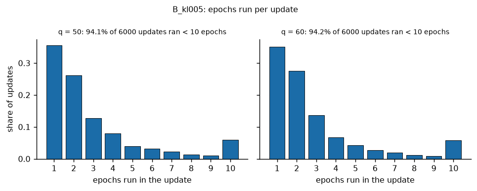
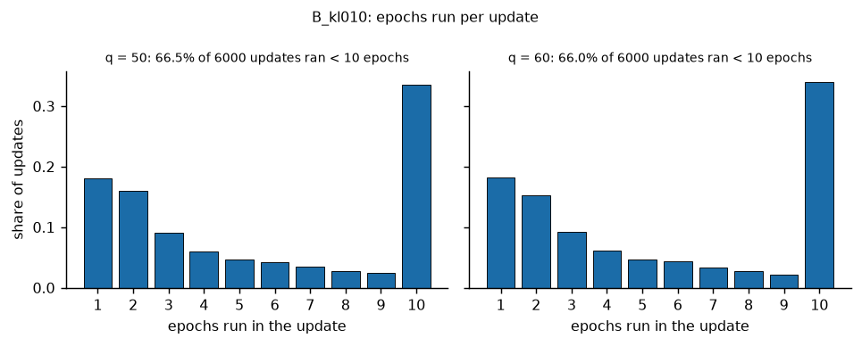

# R1 pilot wave 1: stage-1 (Phase B) arms

Candidate: the end-of-B last iterate. Baseline arm: `B_base` (the locked Phase B from the rehearsal end-of-A state). Method numbering and arm definitions are those of `tools/v2/launch_refine.py` (`METHOD_ARMS`, `STAGE1_ARMS`). Method 6 (`B_expcont`) has a pre-launch check, check (ii) of its continuation table: its outcome is stated in section 1 (subsection "Check (ii)"), in section 4 and in the `B_expcont` section.

Generated by `tools/v2/refine_analysis.py stage1`; deterministic given the same inputs. Every number below is read from a CSV that is cited under its table; nothing is typed by hand. Section 1 holds the checks, section 2 the completeness of the wave, section 3 the definitions, section 4 the stage-wide overview, section 5 one section per arm, section 6 the cost per run, section 7 the anomalies index, section 8 the command.


## 1. Checks (they come first)

The paired design needs the branch points to reproduce the locked pipeline. The check files are written by `tools/v2/cr1_compare.py` (read only here). A missing file means the check has not been produced yet.

| check | file | present | mode | n | n_identical | ALL | failing_fields | first_difference | n_snapshot_refresh_counter_differs |
|---|---|---|---|---|---|---|---|---|---|
| parents_A | results/v2_refine/parents_A_checks.json | True | parentsA | 20 | 20 | True |  |  | 0 |
| stage1_base | results/v2_refine/stage1_base_checks.json | True | stage1_base | 20 | 20 | True |  |  | 0 |
| C-R1 | results/v2_refine/v11_reproduction_checks.json | True | cr1 | 20 | 20 | True |  |  | 0 |

Source: `results/v2_refine/analysis/checks_summary.csv`.

Per-run results: all 60 compared (check, q, seed) results are identical (`results/v2_refine/analysis/checks_per_run.csv` lists every run).

Shared stage 2: the induced target e~1 and its residual band are the same for all arms of a (q, seed) because stage 2 is frozen from the same parent. Verification per run: the frozen snapshot in each arm's `state_end_B.pt` is compared tensor by tensor (`torch.equal`) with the parent's `state_end_A.pt` actor; the bands come from the rehearsal `induced_band.json` of that (q, seed). Counts of complete runs with a bit-identical snapshot and a passing `drift_test.json`:

| arm | q | n_complete | n_frozen_bit_identical | n_drift_test_pass |
|---|---|---|---|---|
| B_base | 50 | 10 | 10 | 10 |
| B_base | 60 | 10 | 10 | 10 |
| B_polish1 | 50 | 10 | 10 | 10 |
| B_polish1 | 60 | 10 | 10 | 10 |
| B_polish2 | 50 | 10 | 10 | 10 |
| B_polish2 | 60 | 10 | 10 | 10 |
| B_batch | 50 | 10 | 10 | 10 |
| B_batch | 60 | 10 | 10 | 10 |
| B_batch_mb256 | 50 | 10 | 10 | 10 |
| B_batch_mb256 | 60 | 10 | 10 | 10 |
| B_kl005 | 50 | 10 | 10 | 10 |
| B_kl005 | 60 | 10 | 10 | 10 |
| B_kl010 | 50 | 10 | 10 | 10 |
| B_kl010 | 60 | 10 | 10 | 10 |
| B_expcont | 50 | 10 | 10 | 10 |
| B_expcont | 60 | 10 | 10 | 10 |

Source: `results/v2_refine/analysis/stage1_decomposition.csv` (per-run record: columns `frozen_bit_identical_to_parent`, `drift_test_pass` of `results/v2_refine/analysis/stage1_per_run.csv`).


### Check (ii) of the continuation table (method 6, `B_expcont`)

Outcome of check (ii) of PI prompt section 2.3 (the table V~2(y) against the verifier's stage-1 Q + k e^2; produced by `tests/test_v2_refine_continuation.py --write`; the full record is `results/v2_refine/continuation_check.json`): the literal final-tier criterion (maximum absolute difference between the table value and the verifier's stage-1 Q + k e^2 on every effort-grid node <= 1e-6 DW) is NOT met: 3.229e-05 / 1.960e-05 DW at q = 50 / q = 60 (development tier 1.329e-04 / 8.511e-05 DW); the refined verifier configuration (state step 0.25, 64 Gauss-Legendre nodes) gives 4.982e-07 / 4.100e-07 DW. The PI decided to keep method 6 in the round and to record both results (`reports/v2/refine/01_preregistration.md` section 4 item 6).

| tier | q | max_abs_diff_over_dw | spec_tolerance_over_dw | meets_spec_tolerance | refined_verifier (state step 0.25, 64 GL nodes) max abs diff / DW |
|---|---|---|---|---|---|
| final | 50 | 3.229e-05 | 1e-06 | False | 4.982e-07 |
| final | 60 | 1.96e-05 | 1e-06 | False | 4.1e-07 |
| development | 50 | 0.0001329 | 1e-06 | n/a | n/a |
| development | 60 | 8.511e-05 | 1e-06 | n/a | n/a |

Source: `results/v2_refine/analysis/stage1_continuation_check_ii.csv` (rows: `results/v2_refine/continuation_check.json`, key `table_vs_verifier`).

`B_expcont` is the only arm that meets the pre-registered criterion (part (a) at both q and part (b)); at the same time, check (ii) of its continuation table is open as stated: the literal final-tier criterion of the check is not met (see the outcome above).


## 2. Completeness: runs done / failed / incomplete / missing

| arm | q | planned | done | failed | incomplete | missing | not_done_seeds | set_aside_originals |
|---|---|---|---|---|---|---|---|---|
| B_base | 50 | 10 | 10 | 0 | 0 | 0 |  | 2 |
| B_base | 60 | 10 | 10 | 0 | 0 | 0 |  | 0 |
| B_polish1 | 50 | 10 | 10 | 0 | 0 | 0 |  | 3 |
| B_polish1 | 60 | 10 | 10 | 0 | 0 | 0 |  | 0 |
| B_polish2 | 50 | 10 | 10 | 0 | 0 | 0 |  | 2 |
| B_polish2 | 60 | 10 | 10 | 0 | 0 | 0 |  | 0 |
| B_batch | 50 | 10 | 10 | 0 | 0 | 0 |  | 2 |
| B_batch | 60 | 10 | 10 | 0 | 0 | 0 |  | 0 |
| B_batch_mb256 | 50 | 10 | 10 | 0 | 0 | 0 |  | 2 |
| B_batch_mb256 | 60 | 10 | 10 | 0 | 0 | 0 |  | 0 |
| B_kl005 | 50 | 10 | 10 | 0 | 0 | 0 |  | 2 |
| B_kl005 | 60 | 10 | 10 | 0 | 0 | 0 |  | 0 |
| B_kl010 | 50 | 10 | 10 | 0 | 0 | 0 |  | 2 |
| B_kl010 | 60 | 10 | 10 | 0 | 0 | 0 |  | 0 |
| B_expcont | 50 | 10 | 10 | 0 | 0 | 0 |  | 2 |
| B_expcont | 60 | 10 | 10 | 0 | 0 | 0 |  | 0 |

Source: `results/v2_refine/analysis/stage1_completeness.csv`.

17 originals (all q = 50) were set aside because their manifests recorded dirty = true (an analysis-tool edit was uncommitted when they started); they were re-run once from a clean tree into the original paths, are superseded, not analysed, and compare bit-identical to the re-runs (`results/v2_refine/stage1_dirty_rerun_comparison.json`; `results/v2_refine/stage1/dirty_rerun/moved.json` lists the moved directories; prereg Addendum 1 item 3).

Launch records of the wave (read only; re-runs have their own record):

| wave | record | state | n_planned | n_finished | n_returncode_0 | n_returncode_nonzero | workers | head | code_commit | nproc | loadavg_at_start |
|---|---|---|---|---|---|---|---|---|---|---|---|
| stage1 | results/v2_refine/stage1/launch_20261003_192408.json | done | 160 | 160 | 160 | 0 | 20 | 655b14c | 6c902db | 64 | 4.6 10.6 6.9 |
| stage1 | results/v2_refine/stage1/launch_20261003_195014.json | done | 8 | 8 | 8 | 0 | 8 | 6e99e01 | 6c902db | 64 | 1.9 12.4 20.2 |
| stage1 | results/v2_refine/stage1/launch_20261003_195054.json | done | 6 | 6 | 6 | 0 | 6 | 6e99e01 | 6c902db | 64 | 9.5 12.8 20.0 |
| stage1 | results/v2_refine/stage1/launch_20261003_195057.json | done | 3 | 3 | 3 | 0 | 3 | 6e99e01 | 6c902db | 64 | 9.7 12.8 20.0 |

Source: `results/v2_refine/analysis/stage1_launch_record.csv`.

The `manifest.json` of the 160 analysed runs record the commit(s) `655b14c` (26 runs), `6e99e01` (134 runs), `dirty` = false in all of them; the launch records name the head(s) `655b14c`, `6e99e01` and the code commit(s) `6c902db`. The commits differ because HEAD advanced during the wave (documentation and analysis-tool commits only); the run code is identical (prereg Addendum 1 item 1).

| manifest_commit | manifest_dirty | n_runs |
|---|---|---|
| 655b14c | False | 26 |
| 6e99e01 | False | 134 |

Source: `results/v2_refine/analysis/stage1_manifest_commits.csv` (commit and dirty flag recorded in `manifest.json` of the analysed runs).


## 3. Definitions

The analysis is the one of `reports/v2/refine/01_preregistration.md` section 5: final tier for every gate metric (development tier only for the G-N part), recovery metrics are tier independent; every difference is arm - baseline paired by (q, seed); `n_better` counts the seeds whose primary metric is smaller than the baseline's; the confidence intervals are 95% percentile bootstrap intervals of the mean and of the median of the paired differences (10000 resamples of the paired seeds, `numpy.random.default_rng(20261003)`, one fresh generator per (q, statistic)). A run is complete iff `status.json` says done with exit code 0 and `final_v2.json` holds a final-tier evaluation; every other planned run is listed.

Primary metric: `stage1_rel_err_abs` = |e1_hat(0) - e1*| / e1* (the S1 value); improvement = a decrease.

Thresholds of the verdicts (read from `protocols/v2_T2_locked_v1_1.json`):

| gate | metric | threshold |
|---|---|---|
| G-A | eta_T_over_dw | 0.005 |
| G-A | stage2_rmse_pos_over_g2_0 | 0.05 |
| G-A | stage2_tail_mean_over_g2_0 | 0.02 |
| G-F | Gmax_full_over_dw | 0.01 |
| G-N | eta_T_over_dw_dev_minus_final_abs | 0.001 |
| G-N | Gmax_full_over_dw_dev_minus_final_abs | 0.001 |
| S1 | stage1_rel_err_abs | 0.1 |
| 0929 target (reported only) | \|stage1_rel_err_signed\| | 0.05 |

Source: `results/v2_refine/analysis/stage1_thresholds.csv`.

Stage-1 verdict definitions: G-F = `Gmax_full_over_dw` <= its threshold (final tier); G-N (Gmax part) = |dev - final| of `Gmax_full_over_dw` <= its threshold; the G-A and the eta part of G-N of a stage-1 run are those of the shared parent (`rehearsal_v1_1/.../gates.json`); run pass = parent G-A and parent G-N (eta part) and arm G-F and arm G-N (Gmax part) (the global-RNG assertion of the locked entry point does not exist in the stage runner); S1 = `stage1_rel_err_abs` <= its threshold; 0929 target = |signed stage-1 error| <= 0.05. Verdict strings (`outcome`) are those of `run.run_v2_T2_locked.verdicts`. The learning / inherited decomposition uses the residual band of the shared parent; because e~1 is shared, the paired difference of `learning_rel` equals that of `stage1_rel_err_signed`.

Within-run stability: `within_run_sd_e1_last5` and `within_run_range_e1_last5` are computed per run from the five weight exports at global updates 2100, 2125, 2150, 2175, 2200 (`weights/u*.npz`): e1_hat(0) of each export (`agents.ppo_curriculum.mean_effort_numpy` at the observation [0, 0], effort units, e_max - e_min = 100), then the sample SD (ddof = 1) and the range (max - min) of those five values. The across-seed SD of the dispersion table is the sample SD (ddof = 1) over the seeds of one arm and q.


## 4. Stage-wide overview of the primary metric

| arm | q | n pairs | mean [95% CI] | median [95% CI] | n_better | n(diff>0)/n(diff<0)/n(diff=0) |
|---|---|---|---|---|---|---|
| B_polish1 | 50 | 10 | 0.01147 [-0.01545, 0.03569] | 0.02203 [-0.01678, 0.04705] | 3/10 | 7/3/0 |
| B_polish1 | 60 | 10 | -0.001059 [-0.0353, 0.03273] | 0.01215 [-0.03931, 0.03084] | 4/10 | 6/4/0 |
| B_polish2 | 50 | 10 | -0.001804 [-0.02846, 0.02069] | 0.01491 [-0.02518, 0.02695] | 4/10 | 6/4/0 |
| B_polish2 | 60 | 10 | 0.002304 [-0.02823, 0.03541] | 0.01672 [-0.04006, 0.02727] | 4/10 | 6/4/0 |
| B_batch | 50 | 10 | -0.01462 [-0.03616, 0.003349] | -0.003514 [-0.03162, 0.008726] | 6/10 | 4/6/0 |
| B_batch | 60 | 10 | -0.007639 [-0.03715, 0.02309] | -0.004251 [-0.05991, 0.03102] | 5/10 | 5/5/0 |
| B_batch_mb256 | 50 | 10 | -0.00632 [-0.03707, 0.02262] | -0.00513 [-0.04045, 0.02594] | 5/10 | 5/5/0 |
| B_batch_mb256 | 60 | 10 | -0.01981 [-0.04952, 0.008318] | -0.01477 [-0.05837, 0.008915] | 8/10 | 2/8/0 |
| B_kl005 | 50 | 10 | 0.000858 [-0.029, 0.02821] | 0.006695 [-0.02702, 0.03463] | 4/10 | 6/4/0 |
| B_kl005 | 60 | 10 | -0.002498 [-0.0404, 0.03956] | -0.01699 [-0.05006, 0.05524] | 6/10 | 4/6/0 |
| B_kl010 | 50 | 10 | 0.0003594 [-0.02209, 0.02466] | -0.009174 [-0.02541, 0.04341] | 6/10 | 4/6/0 |
| B_kl010 | 60 | 10 | -0.006928 [-0.04031, 0.02306] | 0.01568 [-0.04863, 0.03584] | 4/10 | 6/4/0 |
| B_expcont | 50 | 10 | -0.02386 [-0.04061, -0.009831] | -0.01538 [-0.04162, -0.003253] | 9/10 | 1/9/0 |
| B_expcont | 60 | 10 | -0.03783 [-0.06321, -0.01472] | -0.03535 [-0.07153, -0.006276] | 9/10 | 1/9/0 |

Source: `results/v2_refine/analysis/stage1_overview.csv` (rows: metric == stage1_rel_err_abs, arm - B_base).


Overview: paired difference of `stage1_rel_err_abs` (arm - B_base) per arm and q (`reports/v2/refine/figures/stage1_overview.png`, `reports/v2/refine/figures/stage1_overview.pdf`).

Per-arm criterion (descriptive, not a gate; part (a) = CI of the mean paired difference of the primary metric below 0 at both q, part (b) = no baseline-passing run fails under the arm):

| arm | baseline | comparison | q=50: mean diff [95% CI] | q=50: CI < 0 | q=60: mean diff [95% CI] | q=60: CI < 0 | (a) met at both q | (a) all pairs present | (b) gate part | (b) baseline-passing runs | (b) violations | (b) pending | overall |
|---|---|---|---|---|---|---|---|---|---|---|---|---|---|
| B_polish1 | B_base | vs baseline | 0.01147 [-0.01545, 0.03569] (n=10) | False | -0.001059 [-0.0353, 0.03273] (n=10) | False | False | True | holds | 20 | none | none | not met |
| B_polish2 | B_base | vs baseline | -0.001804 [-0.02846, 0.02069] (n=10) | False | 0.002304 [-0.02823, 0.03541] (n=10) | False | False | True | holds | 20 | none | none | not met |
| B_batch | B_base | vs baseline | -0.01462 [-0.03616, 0.003349] (n=10) | False | -0.007639 [-0.03715, 0.02309] (n=10) | False | False | True | holds | 20 | none | none | not met |
| B_batch_mb256 | B_base | vs baseline | -0.00632 [-0.03707, 0.02262] (n=10) | False | -0.01981 [-0.04952, 0.008318] (n=10) | False | False | True | holds | 20 | none | none | not met |
| B_kl005 | B_base | vs baseline | 0.000858 [-0.029, 0.02821] (n=10) | False | -0.002498 [-0.0404, 0.03956] (n=10) | False | False | True | holds | 20 | none | none | not met |
| B_kl010 | B_base | vs baseline | 0.0003594 [-0.02209, 0.02466] (n=10) | False | -0.006928 [-0.04031, 0.02306] (n=10) | False | False | True | holds | 20 | none | none | not met |
| B_expcont | B_base | vs baseline | -0.02386 [-0.04061, -0.009831] (n=10) | True | -0.03783 [-0.06321, -0.01472] (n=10) | True | True | True | holds | 20 | none | none | met |

Source: `results/v2_refine/analysis/stage1_criterion.csv`.

`B_expcont` is the only arm that meets the pre-registered criterion (part (a) at both q and part (b)); at the same time, check (ii) of its continuation table is open as stated: the literal final-tier criterion of the check is not met (see the outcome above).


## 5. Arms (in the order of the arm table)


### `B_base`  (baseline arm)

Single change: locked Phase B (3e-4 -> 3e-5 over local 1-600), no change. Runs complete: 20 of 20 (failed 0, incomplete 0, missing 0).

Baseline values (complete runs; medians, means and across-seed SDs; the CSV has more columns):

| arm | q | n complete | median \|err\| | mean \|err\| | median signed err | SD signed err | median Gmax/DW | median EXP_root/DW | median within-run SD e1 | n S1 pass | n G-F pass | n run pass | n \|err\|<=0.05 |
|---|---|---|---|---|---|---|---|---|---|---|---|---|---|
| B_base | 50 | 10 | 0.03536 | 0.04138 | 0.00239 | 0.05153 | 0.001274 | 0.0006756 | 1.185 | 9 | 10 | 10 | 8 |
| B_base | 60 | 10 | 0.04515 | 0.0523 | -0.003121 | 0.06976 | 0.0008469 | 0.0003993 | 0.9197 | 8 | 10 | 10 | 6 |

Source: `results/v2_refine/analysis/stage1_arm_summary.csv`.

**Gate metrics** (verdict counts over the complete runs, final tier; `n_Gmax_at_t*` and the d* columns locate the maximum deviation gain):

| wave | arm | q | n_complete | n_S1_pass | n_G_F | n_G_N_gmax | n_G_A_parent | n_G_N_eta_parent | n_run_pass | n_target0929_pass | n_valid_final | n_valid_dev | n_Gmax_at_t1 | n_Gmax_at_t2 | median_Gmax_d | min_Gmax_d | max_Gmax_d | max_Gmax_full_over_dw |
|---|---|---|---|---|---|---|---|---|---|---|---|---|---|---|---|---|---|---|
| stage1 | B_base | 50 | 10 | 9 | 10 | 10 | 10 | 10 | 10 | 8 | 10 | 10 | 2 | 8 | -2 | -18 | 0 | 0.004014 |
| stage1 | B_base | 60 | 10 | 8 | 10 | 10 | 10 | 10 | 10 | 6 | 10 | 10 | 5 | 5 | -1 | -24 | 0 | 0.002256 |

Source: `results/v2_refine/analysis/stage1_gate_counts.csv` (rows: arm in (B_base, B_base)).

**Optimisation diagnostics** (medians over the complete runs of per-run values: mean over the updates of the phase; grad norms are the actor's global pre-clip norms).

| arm | q | n complete | KL (mean over updates) | clip frac | actor grad norm (mean) | actor grad norm (max) | actor steps | optimizer steps | epochs run (mean) | advantage SD (stage-1 rows) | phase wall s |
|---|---|---|---|---|---|---|---|---|---|---|---|
| B_base | 50 | 10 | 0.005185 | 0.05936 | 5.749 | 29.05 | 2.4e+04 | 2.4e+04 | 10 | 1.211 | 122.2 |
| B_base | 60 | 10 | 0.005576 | 0.06373 | 6.211 | 32.24 | 2.4e+04 | 2.4e+04 | 10 | 1.188 | 120.4 |

Source: `results/v2_refine/analysis/stage1_optimisation.csv` (rows: arm in (B_base, B_base)).

**Anomalies.** None among the planned runs of this arm.

**Reproduce:** `python tools/v2/refine_analysis.py stage1 --root results/v2_refine --out results/v2_refine/analysis --reports reports/v2/refine --figures reports/v2/refine/figures`


### `B_polish1`  (method 1 polish)

Single change: LR windows P1: local 1-400 3e-4 -> 3e-5, 401-600 3e-5 -> 3e-6. Runs complete: 20 of 20 (failed 0, incomplete 0, missing 0).

**Paired differences B_polish1 - B_base** (vs baseline); outcome metrics. `n_better` = seeds with a smaller value than the B_base run.

| metric | q | n pairs | mean [95% CI] | median [95% CI] | n_better | n(diff>0)/n(diff<0)/n(diff=0) |
|---|---|---|---|---|---|---|
| stage1_rel_err_abs | 50 | 10 | 0.01147 [-0.01545, 0.03569] | 0.02203 [-0.01678, 0.04705] | 3/10 | 7/3/0 |
| stage1_rel_err_abs | 60 | 10 | -0.001059 [-0.0353, 0.03273] | 0.01215 [-0.03931, 0.03084] | 4/10 | 6/4/0 |
| stage1_rel_err_signed | 50 | 10 | 0.001722 [-0.03173, 0.03627] | 0.003912 [-0.05876, 0.05517] | n/a (no direction) | 5/5/0 |
| stage1_rel_err_signed | 60 | 10 | 0.02652 [-0.02338, 0.07473] | 0.03907 [-0.04543, 0.1017] | n/a (no direction) | 6/4/0 |
| e1_at_0 | 50 | 10 | 0.08035 [-1.481, 1.693] | 0.1826 [-2.742, 2.575] | n/a (no direction) | 5/5/0 |
| e1_at_0 | 60 | 10 | 1.031 [-0.9092, 2.906] | 1.519 [-1.767, 3.953] | n/a (no direction) | 6/4/0 |
| learning_rel | 50 | 10 | 0.001722 [-0.03173, 0.03627] | 0.003912 [-0.05876, 0.05517] | n/a (no direction) | 5/5/0 |
| learning_rel | 60 | 10 | 0.02652 [-0.02338, 0.07473] | 0.03907 [-0.04543, 0.1017] | n/a (no direction) | 6/4/0 |
| learning_rel_abs | 50 | 10 | 0.0047 [-0.02179, 0.02961] | 0.0111 [-0.02797, 0.04112] | 5/10 | 5/5/0 |
| learning_rel_abs | 60 | 10 | -0.002654 [-0.03676, 0.03136] | 0.00778 [-0.04641, 0.02971] | 4/10 | 6/4/0 |
| Gmax_full_over_dw | 50 | 10 | 4.638e-05 [-0.0003114, 0.0003954] | 0 [-0.0002006, 0.000388] | 2/10 | 2/2/6 |
| Gmax_full_over_dw | 60 | 10 | 1.796e-05 [-0.0003663, 0.0004375] | 0 [-0.0003667, 0.0003201] | 4/10 | 2/4/4 |
| EXP_root_over_dw | 50 | 10 | 0.0001652 [-0.0004955, 0.0007789] | 0.0003244 [-0.0006558, 0.0009153] | 4/10 | 6/4/0 |
| EXP_root_over_dw | 60 | 10 | -0.0001644 [-0.000798, 0.0004657] | 4.594e-05 [-0.0008366, 0.0004034] | 4/10 | 6/4/0 |
| dReach_over_dw | 50 | 10 | 0.0001646 [-0.0004961, 0.0007782] | 0.0003307 [-0.0006585, 0.0008878] | 4/10 | 6/4/0 |
| dReach_over_dw | 60 | 10 | -0.0001641 [-0.000797, 0.000466] | 4.589e-05 [-0.0008325, 0.000403] | 4/10 | 6/4/0 |
| Deltamax_all_over_dw | 50 | 10 | 6.866e-05 [-0.0001861, 0.0003533] | 0 [-7.589e-05, 0.0003192] | 2/10 | 2/2/6 |
| Deltamax_all_over_dw | 60 | 10 | 6.938e-05 [-0.0002711, 0.0004547] | 0 [-0.000176, 0.0003195] | 3/10 | 2/3/5 |
| dFull_over_dw | 50 | 10 | 0.0001646 [-0.0004961, 0.0007782] | 0.0003307 [-0.0006585, 0.0008878] | 4/10 | 6/4/0 |
| dFull_over_dw | 60 | 10 | -0.0001641 [-0.000797, 0.000466] | 4.589e-05 [-0.0008325, 0.000403] | 4/10 | 6/4/0 |
| gmax_dev_minus_final_abs | 50 | 10 | -1.688e-05 [-6.451e-05, 1.164e-05] | 0 [-6.002e-06, 9.847e-06] | 2/10 | 2/2/6 |
| gmax_dev_minus_final_abs | 60 | 10 | 2.734e-05 [-1.247e-05, 8.065e-05] | 0 [-9.587e-06, 8.461e-05] | 4/10 | 2/4/4 |
| within_run_sd_e1_last5 | 50 | 10 | 0.06162 [-0.4405, 0.5823] | 0.02364 [-0.7996, 1.038] | 5/10 | 5/5/0 |
| within_run_sd_e1_last5 | 60 | 10 | -0.1972 [-0.584, 0.1552] | -0.06163 [-0.8096, 0.3149] | 6/10 | 4/6/0 |
| within_run_range_e1_last5 | 50 | 10 | 0.1369 [-1.098, 1.423] | 0.145 [-2.102, 2.214] | 5/10 | 5/5/0 |
| within_run_range_e1_last5 | 60 | 10 | -0.4856 [-1.434, 0.3575] | -0.1241 [-2.117, 0.7178] | 6/10 | 4/6/0 |

Source: `results/v2_refine/analysis/stage1_paired.csv` (rows: arm == B_polish1, baseline == B_base; seed-level values in `results/v2_refine/analysis/stage1_paired_seed_level.csv`).

**Pre-registered criterion** (descriptive; both parts separately):

| arm | baseline | comparison | q=50: mean diff [95% CI] | q=50: CI < 0 | q=60: mean diff [95% CI] | q=60: CI < 0 | (a) met at both q | (a) all pairs present | (b) gate part | (b) baseline-passing runs | (b) violations | (b) pending | overall |
|---|---|---|---|---|---|---|---|---|---|---|---|---|---|
| B_polish1 | B_base | vs baseline | 0.01147 [-0.01545, 0.03569] (n=10) | False | -0.001059 [-0.0353, 0.03273] (n=10) | False | False | True | holds | 20 | none | none | not met |

Source: `results/v2_refine/analysis/stage1_criterion.csv` (row: arm == B_polish1, baseline == B_base).

**Dispersion** across seeds (SD with ddof = 1) of the signed error and of the effort at d = 0; ratio arm/baseline with a paired-resampling bootstrap CI (same resampled seeds for both). The two metrics give the same ratio because the signed error is an affine function of the effort with the same target.

| arm | baseline | metric | q | n | SD arm | SD baseline | ratio arm/baseline [95% CI] |
|---|---|---|---|---|---|---|---|
| B_polish1 | B_base | stage1_rel_err_signed | 50 | 10 | 0.06021 | 0.05153 | 1.169 [0.5892, 2.367] |
| B_polish1 | B_base | e1_at_0 | 50 | 10 | 2.81 | 2.405 | 1.169 [0.5892, 2.367] |
| B_polish1 | B_base | stage1_rel_err_signed | 60 | 10 | 0.05505 | 0.06976 | 0.7891 [0.4071, 1.649] |
| B_polish1 | B_base | e1_at_0 | 60 | 10 | 2.141 | 2.713 | 0.7891 [0.4071, 1.649] |

Source: `results/v2_refine/analysis/stage1_dispersion.csv` (rows: arm == B_polish1).

**Learning / inherited decomposition** (e~1 and its band from the shared parent; learning = (e1_hat - e~1)/e1*, inherited = (e~1 - e1*)/e1*):

| arm | q | n_complete | median_learning_rel | median_learning_rel_abs | n_learning_band_contains_0 | median_inherited_rel | n_inherited_band_contains_0 | n_e1_inside_sweep | median_e_tilde | median_band_width | n_frozen_bit_identical | n_drift_test_pass |
|---|---|---|---|---|---|---|---|---|---|---|---|---|
| B_polish1 | 50 | 10 | -0.01109 | 0.04802 | 0 | -0.008893 | 1 | 10 | 46.25 | 0.175 | 10 | 10 |
| B_polish1 | 60 | 10 | 0.03166 | 0.03936 | 0 | -0.001286 | 4 | 10 | 38.84 | 0.09 | 10 | 10 |

Source: `results/v2_refine/analysis/stage1_decomposition.csv` (rows: arm == B_polish1).

**Gate metrics** (verdict counts over the complete runs, final tier; `n_Gmax_at_t*` and the d* columns locate the maximum deviation gain):

| wave | arm | q | n_complete | n_S1_pass | n_G_F | n_G_N_gmax | n_G_A_parent | n_G_N_eta_parent | n_run_pass | n_target0929_pass | n_valid_final | n_valid_dev | n_Gmax_at_t1 | n_Gmax_at_t2 | median_Gmax_d | min_Gmax_d | max_Gmax_d | max_Gmax_full_over_dw |
|---|---|---|---|---|---|---|---|---|---|---|---|---|---|---|---|---|---|---|
| stage1 | B_base | 50 | 10 | 9 | 10 | 10 | 10 | 10 | 10 | 8 | 10 | 10 | 2 | 8 | -2 | -18 | 0 | 0.004014 |
| stage1 | B_base | 60 | 10 | 8 | 10 | 10 | 10 | 10 | 10 | 6 | 10 | 10 | 5 | 5 | -1 | -24 | 0 | 0.002256 |
| stage1 | B_polish1 | 50 | 10 | 10 | 10 | 10 | 10 | 10 | 10 | 4 | 10 | 10 | 2 | 8 | -3 | -18 | 0 | 0.004014 |
| stage1 | B_polish1 | 60 | 10 | 9 | 10 | 10 | 10 | 10 | 10 | 7 | 10 | 10 | 2 | 8 | -2 | -24 | 0 | 0.001926 |

Source: `results/v2_refine/analysis/stage1_gate_counts.csv` (rows: arm in (B_polish1, B_base)).

**Optimisation diagnostics** (medians over the complete runs of per-run values: mean over the updates of the phase; grad norms are the actor's global pre-clip norms).

| arm | q | n complete | KL (mean over updates) | clip frac | actor grad norm (mean) | actor grad norm (max) | actor steps | optimizer steps | epochs run (mean) | advantage SD (stage-1 rows) | phase wall s |
|---|---|---|---|---|---|---|---|---|---|---|---|
| B_base | 50 | 10 | 0.005185 | 0.05936 | 5.749 | 29.05 | 2.4e+04 | 2.4e+04 | 10 | 1.211 | 122.2 |
| B_base | 60 | 10 | 0.005576 | 0.06373 | 6.211 | 32.24 | 2.4e+04 | 2.4e+04 | 10 | 1.188 | 120.4 |
| B_polish1 | 50 | 10 | 0.00445 | 0.04499 | 5.324 | 29.15 | 2.4e+04 | 2.4e+04 | 10 | 1.212 | 127.2 |
| B_polish1 | 60 | 10 | 0.004648 | 0.04762 | 5.737 | 31.91 | 2.4e+04 | 2.4e+04 | 10 | 1.187 | 118.1 |

Source: `results/v2_refine/analysis/stage1_optimisation.csv` (rows: arm in (B_polish1, B_base)).

**RNG divergence.** First update of the phase at which each RNG stream's position differs from that of B_base (`never` = identical to the end). 

| q | stream | n_runs | n_at_first_update | n_never | first_update_of_phase | median_first_divergence | min_first_divergence | max_first_divergence | n_not_comparable |
|---|---|---|---|---|---|---|---|---|---|
| 50 | env | 10 | 0 | 10 | 1601 | n/a | n/a | n/a | 0 |
| 50 | learn | 10 | 0 | 0 | 1601 | 1644 | 1613 | 1817 | 0 |
| 50 | opp | 10 | 0 | 0 | 1601 | 1670 | 1623 | 1802 | 0 |
| 50 | start | 10 | 0 | 10 | 1601 | n/a | n/a | n/a | 0 |
| 50 | minibatch | 10 | 0 | 10 | 1601 | n/a | n/a | n/a | 0 |
| 60 | env | 10 | 0 | 10 | 1601 | n/a | n/a | n/a | 0 |
| 60 | learn | 10 | 0 | 0 | 1601 | 1650 | 1607 | 1834 | 0 |
| 60 | opp | 10 | 0 | 0 | 1601 | 1636 | 1617 | 1700 | 0 |
| 60 | start | 10 | 0 | 10 | 1601 | n/a | n/a | n/a | 0 |
| 60 | minibatch | 10 | 0 | 10 | 1601 | n/a | n/a | n/a | 0 |

Source: `results/v2_refine/analysis/stage1_rng_divergence.csv` (rows: arm == B_polish1).

**Figures.**


Paired difference of the primary metric `stage1_rel_err_abs`, B_polish1 - B_base, one point per seed, per q (`reports/v2/refine/figures/stage1_B_polish1_paired_primary.png`, `reports/v2/refine/figures/stage1_B_polish1_paired_primary.pdf`).

**Anomalies.** None among the planned runs of this arm.

**Reproduce:** `python tools/v2/refine_analysis.py stage1 --root results/v2_refine --out results/v2_refine/analysis --reports reports/v2/refine --figures reports/v2/refine/figures`


### `B_polish2`  (method 1 polish)

Single change: LR window P2: local 1-600 3e-4 -> 3e-6. Runs complete: 20 of 20 (failed 0, incomplete 0, missing 0).

**Paired differences B_polish2 - B_base** (vs baseline); outcome metrics. `n_better` = seeds with a smaller value than the B_base run.

| metric | q | n pairs | mean [95% CI] | median [95% CI] | n_better | n(diff>0)/n(diff<0)/n(diff=0) |
|---|---|---|---|---|---|---|
| stage1_rel_err_abs | 50 | 10 | -0.001804 [-0.02846, 0.02069] | 0.01491 [-0.02518, 0.02695] | 4/10 | 6/4/0 |
| stage1_rel_err_abs | 60 | 10 | 0.002304 [-0.02823, 0.03541] | 0.01672 [-0.04006, 0.02727] | 4/10 | 6/4/0 |
| stage1_rel_err_signed | 50 | 10 | -0.008493 [-0.03638, 0.02366] | -0.01584 [-0.04749, 0.02382] | n/a (no direction) | 3/7/0 |
| stage1_rel_err_signed | 60 | 10 | 0.008349 [-0.02494, 0.04866] | -0.02434 [-0.03902, 0.05385] | n/a (no direction) | 4/6/0 |
| e1_at_0 | 50 | 10 | -0.3964 [-1.698, 1.104] | -0.7393 [-2.216, 1.112] | n/a (no direction) | 3/7/0 |
| e1_at_0 | 60 | 10 | 0.3247 [-0.9699, 1.893] | -0.9464 [-1.517, 2.094] | n/a (no direction) | 4/6/0 |
| learning_rel | 50 | 10 | -0.008493 [-0.03638, 0.02366] | -0.01584 [-0.04749, 0.02382] | n/a (no direction) | 3/7/0 |
| learning_rel | 60 | 10 | 0.008349 [-0.02494, 0.04866] | -0.02434 [-0.03902, 0.05385] | n/a (no direction) | 4/6/0 |
| learning_rel_abs | 50 | 10 | -0.003172 [-0.0239, 0.016] | 0.00484 [-0.02923, 0.01964] | 5/10 | 5/5/0 |
| learning_rel_abs | 60 | 10 | 0.002098 [-0.02868, 0.03625] | 0.01338 [-0.04006, 0.0265] | 4/10 | 6/4/0 |
| Gmax_full_over_dw | 50 | 10 | 0.0001516 [-0.0003203, 0.0007752] | 0 [0, 0] | 1/10 | 1/1/8 |
| Gmax_full_over_dw | 60 | 10 | 4.457e-05 [-0.0002711, 0.0003691] | 0 [-0.0001182, 0.0004388] | 4/10 | 2/4/4 |
| EXP_root_over_dw | 50 | 10 | 9.808e-05 [-0.0005025, 0.0007735] | 9.066e-05 [-0.000351, 0.0003157] | 4/10 | 6/4/0 |
| EXP_root_over_dw | 60 | 10 | 4.468e-05 [-0.000564, 0.0007161] | 0.000102 [-0.0005326, 0.0005733] | 4/10 | 6/4/0 |
| dReach_over_dw | 50 | 10 | 9.907e-05 [-0.0005001, 0.0007744] | 9.484e-05 [-0.0003367, 0.000311] | 4/10 | 6/4/0 |
| dReach_over_dw | 60 | 10 | 4.503e-05 [-0.0005637, 0.0007171] | 0.000103 [-0.0005325, 0.0005728] | 4/10 | 6/4/0 |
| Deltamax_all_over_dw | 50 | 10 | 0.0001816 [-0.0002336, 0.0007783] | 0 [0, 0] | 1/10 | 1/1/8 |
| Deltamax_all_over_dw | 60 | 10 | 5.783e-05 [-0.0002276, 0.0003542] | 0 [-2.946e-05, 0.0003253] | 3/10 | 2/3/5 |
| dFull_over_dw | 50 | 10 | 9.907e-05 [-0.0005001, 0.0007744] | 9.484e-05 [-0.0003367, 0.000311] | 4/10 | 6/4/0 |
| dFull_over_dw | 60 | 10 | 4.503e-05 [-0.0005637, 0.0007171] | 0.000103 [-0.0005325, 0.0005728] | 4/10 | 6/4/0 |
| gmax_dev_minus_final_abs | 50 | 10 | -7.299e-07 [-8.098e-06, 5.908e-06] | 0 [0, 0] | 1/10 | 1/1/8 |
| gmax_dev_minus_final_abs | 60 | 10 | 1.811e-05 [-2.709e-05, 7.331e-05] | -4.241e-07 [-3.352e-05, 8.461e-05] | 5/10 | 2/5/3 |
| within_run_sd_e1_last5 | 50 | 10 | 0.08477 [-0.2783, 0.4599] | 0.02345 [-0.4481, 0.7508] | 5/10 | 5/5/0 |
| within_run_sd_e1_last5 | 60 | 10 | 0.1585 [-0.2577, 0.5288] | 0.2989 [-0.496, 0.6836] | 3/10 | 7/3/0 |
| within_run_range_e1_last5 | 50 | 10 | 0.1905 [-0.7444, 1.173] | -0.06225 [-1.167, 1.682] | 5/10 | 5/5/0 |
| within_run_range_e1_last5 | 60 | 10 | 0.4935 [-0.6206, 1.487] | 0.7667 [-1.119, 1.719] | 3/10 | 7/3/0 |

Source: `results/v2_refine/analysis/stage1_paired.csv` (rows: arm == B_polish2, baseline == B_base; seed-level values in `results/v2_refine/analysis/stage1_paired_seed_level.csv`).

**Pre-registered criterion** (descriptive; both parts separately):

| arm | baseline | comparison | q=50: mean diff [95% CI] | q=50: CI < 0 | q=60: mean diff [95% CI] | q=60: CI < 0 | (a) met at both q | (a) all pairs present | (b) gate part | (b) baseline-passing runs | (b) violations | (b) pending | overall |
|---|---|---|---|---|---|---|---|---|---|---|---|---|---|
| B_polish2 | B_base | vs baseline | -0.001804 [-0.02846, 0.02069] (n=10) | False | 0.002304 [-0.02823, 0.03541] (n=10) | False | False | True | holds | 20 | none | none | not met |

Source: `results/v2_refine/analysis/stage1_criterion.csv` (row: arm == B_polish2, baseline == B_base).

**Dispersion** across seeds (SD with ddof = 1) of the signed error and of the effort at d = 0; ratio arm/baseline with a paired-resampling bootstrap CI (same resampled seeds for both). The two metrics give the same ratio because the signed error is an affine function of the effort with the same target.

| arm | baseline | metric | q | n | SD arm | SD baseline | ratio arm/baseline [95% CI] |
|---|---|---|---|---|---|---|---|
| B_polish2 | B_base | stage1_rel_err_signed | 50 | 10 | 0.05206 | 0.05153 | 1.01 [0.4562, 1.603] |
| B_polish2 | B_base | e1_at_0 | 50 | 10 | 2.429 | 2.405 | 1.01 [0.4562, 1.603] |
| B_polish2 | B_base | stage1_rel_err_signed | 60 | 10 | 0.07186 | 0.06976 | 1.03 [0.3817, 1.834] |
| B_polish2 | B_base | e1_at_0 | 60 | 10 | 2.795 | 2.713 | 1.03 [0.3817, 1.834] |

Source: `results/v2_refine/analysis/stage1_dispersion.csv` (rows: arm == B_polish2).

**Learning / inherited decomposition** (e~1 and its band from the shared parent; learning = (e1_hat - e~1)/e1*, inherited = (e~1 - e1*)/e1*):

| arm | q | n_complete | median_learning_rel | median_learning_rel_abs | n_learning_band_contains_0 | median_inherited_rel | n_inherited_band_contains_0 | n_e1_inside_sweep | median_e_tilde | median_band_width | n_frozen_bit_identical | n_drift_test_pass |
|---|---|---|---|---|---|---|---|---|---|---|---|---|
| B_polish2 | 50 | 10 | -0.005127 | 0.02959 | 1 | -0.008893 | 1 | 10 | 46.25 | 0.175 | 10 | 10 |
| B_polish2 | 60 | 10 | -0.02728 | 0.04299 | 0 | -0.001286 | 4 | 10 | 38.84 | 0.09 | 10 | 10 |

Source: `results/v2_refine/analysis/stage1_decomposition.csv` (rows: arm == B_polish2).

**Gate metrics** (verdict counts over the complete runs, final tier; `n_Gmax_at_t*` and the d* columns locate the maximum deviation gain):

| wave | arm | q | n_complete | n_S1_pass | n_G_F | n_G_N_gmax | n_G_A_parent | n_G_N_eta_parent | n_run_pass | n_target0929_pass | n_valid_final | n_valid_dev | n_Gmax_at_t1 | n_Gmax_at_t2 | median_Gmax_d | min_Gmax_d | max_Gmax_d | max_Gmax_full_over_dw |
|---|---|---|---|---|---|---|---|---|---|---|---|---|---|---|---|---|---|---|
| stage1 | B_base | 50 | 10 | 9 | 10 | 10 | 10 | 10 | 10 | 8 | 10 | 10 | 2 | 8 | -2 | -18 | 0 | 0.004014 |
| stage1 | B_base | 60 | 10 | 8 | 10 | 10 | 10 | 10 | 10 | 6 | 10 | 10 | 5 | 5 | -1 | -24 | 0 | 0.002256 |
| stage1 | B_polish2 | 50 | 10 | 9 | 10 | 10 | 10 | 10 | 10 | 7 | 10 | 10 | 1 | 9 | -3 | -18 | 0 | 0.004706 |
| stage1 | B_polish2 | 60 | 10 | 8 | 10 | 10 | 10 | 10 | 10 | 7 | 10 | 10 | 2 | 8 | -2 | -24 | 0 | 0.003083 |

Source: `results/v2_refine/analysis/stage1_gate_counts.csv` (rows: arm in (B_polish2, B_base)).

**Optimisation diagnostics** (medians over the complete runs of per-run values: mean over the updates of the phase; grad norms are the actor's global pre-clip norms).

| arm | q | n complete | KL (mean over updates) | clip frac | actor grad norm (mean) | actor grad norm (max) | actor steps | optimizer steps | epochs run (mean) | advantage SD (stage-1 rows) | phase wall s |
|---|---|---|---|---|---|---|---|---|---|---|---|
| B_base | 50 | 10 | 0.005185 | 0.05936 | 5.749 | 29.05 | 2.4e+04 | 2.4e+04 | 10 | 1.211 | 122.2 |
| B_base | 60 | 10 | 0.005576 | 0.06373 | 6.211 | 32.24 | 2.4e+04 | 2.4e+04 | 10 | 1.188 | 120.4 |
| B_polish2 | 50 | 10 | 0.005041 | 0.05538 | 5.579 | 29.18 | 2.4e+04 | 2.4e+04 | 10 | 1.212 | 124.5 |
| B_polish2 | 60 | 10 | 0.005431 | 0.05844 | 6.059 | 32.52 | 2.4e+04 | 2.4e+04 | 10 | 1.187 | 115.3 |

Source: `results/v2_refine/analysis/stage1_optimisation.csv` (rows: arm in (B_polish2, B_base)).

**RNG divergence.** First update of the phase at which each RNG stream's position differs from that of B_base (`never` = identical to the end). 

| q | stream | n_runs | n_at_first_update | n_never | first_update_of_phase | median_first_divergence | min_first_divergence | max_first_divergence | n_not_comparable |
|---|---|---|---|---|---|---|---|---|---|
| 50 | env | 10 | 0 | 10 | 1601 | n/a | n/a | n/a | 0 |
| 50 | learn | 10 | 0 | 0 | 1601 | 1681 | 1613 | 1785 | 0 |
| 50 | opp | 10 | 0 | 0 | 1601 | 1686 | 1634 | 2036 | 0 |
| 50 | start | 10 | 0 | 10 | 1601 | n/a | n/a | n/a | 0 |
| 50 | minibatch | 10 | 0 | 10 | 1601 | n/a | n/a | n/a | 0 |
| 60 | env | 10 | 0 | 10 | 1601 | n/a | n/a | n/a | 0 |
| 60 | learn | 10 | 0 | 0 | 1601 | 1677 | 1618 | 1769 | 0 |
| 60 | opp | 10 | 0 | 0 | 1601 | 1670 | 1625 | 1744 | 0 |
| 60 | start | 10 | 0 | 10 | 1601 | n/a | n/a | n/a | 0 |
| 60 | minibatch | 10 | 0 | 10 | 1601 | n/a | n/a | n/a | 0 |

Source: `results/v2_refine/analysis/stage1_rng_divergence.csv` (rows: arm == B_polish2).

**Figures.**


Paired difference of the primary metric `stage1_rel_err_abs`, B_polish2 - B_base, one point per seed, per q (`reports/v2/refine/figures/stage1_B_polish2_paired_primary.png`, `reports/v2/refine/figures/stage1_B_polish2_paired_primary.pdf`).

**Anomalies.** None among the planned runs of this arm.

**Reproduce:** `python tools/v2/refine_analysis.py stage1 --root results/v2_refine --out results/v2_refine/analysis --reports reports/v2/refine --figures reports/v2/refine/figures`


### `B_batch`  (method 2 batch)

Single change: episodes_per_update 2048, minibatch 1024 (40 optimizer steps per update). Runs complete: 20 of 20 (failed 0, incomplete 0, missing 0).

**Paired differences B_batch - B_base** (vs baseline); outcome metrics. `n_better` = seeds with a smaller value than the B_base run.

| metric | q | n pairs | mean [95% CI] | median [95% CI] | n_better | n(diff>0)/n(diff<0)/n(diff=0) |
|---|---|---|---|---|---|---|
| stage1_rel_err_abs | 50 | 10 | -0.01462 [-0.03616, 0.003349] | -0.003514 [-0.03162, 0.008726] | 6/10 | 4/6/0 |
| stage1_rel_err_abs | 60 | 10 | -0.007639 [-0.03715, 0.02309] | -0.004251 [-0.05991, 0.03102] | 5/10 | 5/5/0 |
| stage1_rel_err_signed | 50 | 10 | 0.01988 [-0.007896, 0.04758] | 0.01222 [-0.01937, 0.06288] | n/a (no direction) | 7/3/0 |
| stage1_rel_err_signed | 60 | 10 | -0.003302 [-0.04968, 0.0487] | -0.01758 [-0.07024, 0.0581] | n/a (no direction) | 4/6/0 |
| e1_at_0 | 50 | 10 | 0.9277 [-0.3685, 2.22] | 0.5704 [-0.9041, 2.934] | n/a (no direction) | 7/3/0 |
| e1_at_0 | 60 | 10 | -0.1284 [-1.932, 1.894] | -0.6836 [-2.732, 2.26] | n/a (no direction) | 4/6/0 |
| learning_rel | 50 | 10 | 0.01988 [-0.007896, 0.04758] | 0.01222 [-0.01937, 0.06288] | n/a (no direction) | 7/3/0 |
| learning_rel | 60 | 10 | -0.003302 [-0.04968, 0.0487] | -0.01758 [-0.07024, 0.0581] | n/a (no direction) | 4/6/0 |
| learning_rel_abs | 50 | 10 | -0.01014 [-0.03065, 0.008559] | -0.008399 [-0.03453, 0.01772] | 6/10 | 4/6/0 |
| learning_rel_abs | 60 | 10 | -0.008359 [-0.03708, 0.02169] | -0.005023 [-0.05991, 0.03048] | 5/10 | 5/5/0 |
| Gmax_full_over_dw | 50 | 10 | -0.0001469 [-0.000374, 0] | 0 [-0.0002006, 0] | 2/10 | 0/2/8 |
| Gmax_full_over_dw | 60 | 10 | -0.000116 [-0.0004207, 0.0001868] | -3.562e-05 [-0.0003751, 0] | 5/10 | 1/5/4 |
| EXP_root_over_dw | 50 | 10 | -0.0002859 [-0.0008151, 0.000147] | -8.747e-05 [-0.0009364, 0.0003182] | 6/10 | 4/6/0 |
| EXP_root_over_dw | 60 | 10 | -0.0002714 [-0.0008308, 0.0002911] | -8.647e-05 [-0.0009437, 0.0002753] | 5/10 | 5/5/0 |
| dReach_over_dw | 50 | 10 | -0.0002896 [-0.000823, 0.0001447] | -9.061e-05 [-0.0009396, 0.0003125] | 6/10 | 4/6/0 |
| dReach_over_dw | 60 | 10 | -0.0002704 [-0.0008306, 0.0002923] | -8.557e-05 [-0.0009393, 0.0002752] | 5/10 | 5/5/0 |
| Deltamax_all_over_dw | 50 | 10 | -9.304e-05 [-0.0002488, 0] | 0 [-7.589e-05, 0] | 2/10 | 0/2/8 |
| Deltamax_all_over_dw | 60 | 10 | -6.217e-05 [-0.0003279, 0.000192] | 0 [-0.0001782, 0] | 4/10 | 1/4/5 |
| dFull_over_dw | 50 | 10 | -0.0002896 [-0.000823, 0.0001447] | -9.061e-05 [-0.0009396, 0.0003125] | 6/10 | 4/6/0 |
| dFull_over_dw | 60 | 10 | -0.0002704 [-0.0008306, 0.0002923] | -8.557e-05 [-0.0009393, 0.0002752] | 5/10 | 5/5/0 |
| gmax_dev_minus_final_abs | 50 | 10 | -1.4e-06 [-1.97e-05, 1.353e-05] | 0 [0, 9.847e-06] | 1/10 | 2/1/7 |
| gmax_dev_minus_final_abs | 60 | 10 | 3.173e-05 [-7.293e-06, 8.317e-05] | 0 [-2.988e-06, 8.461e-05] | 3/10 | 3/3/4 |
| within_run_sd_e1_last5 | 50 | 10 | -0.3472 [-0.7832, 0.1644] | -0.5271 [-0.8194, 0.2375] | 8/10 | 2/8/0 |
| within_run_sd_e1_last5 | 60 | 10 | -0.02883 [-0.3555, 0.275] | 0.02468 [-0.3711, 0.2953] | 4/10 | 6/4/0 |
| within_run_range_e1_last5 | 50 | 10 | -0.8554 [-1.921, 0.3255] | -1.15 [-2.158, 0.6969] | 8/10 | 2/8/0 |
| within_run_range_e1_last5 | 60 | 10 | 0.04209 [-0.8236, 0.8846] | 0.05834 [-1.059, 1.004] | 4/10 | 6/4/0 |

Source: `results/v2_refine/analysis/stage1_paired.csv` (rows: arm == B_batch, baseline == B_base; seed-level values in `results/v2_refine/analysis/stage1_paired_seed_level.csv`).

**Pre-registered criterion** (descriptive; both parts separately):

| arm | baseline | comparison | q=50: mean diff [95% CI] | q=50: CI < 0 | q=60: mean diff [95% CI] | q=60: CI < 0 | (a) met at both q | (a) all pairs present | (b) gate part | (b) baseline-passing runs | (b) violations | (b) pending | overall |
|---|---|---|---|---|---|---|---|---|---|---|---|---|---|
| B_batch | B_base | vs baseline | -0.01462 [-0.03616, 0.003349] (n=10) | False | -0.007639 [-0.03715, 0.02309] (n=10) | False | False | True | holds | 20 | none | none | not met |

Source: `results/v2_refine/analysis/stage1_criterion.csv` (row: arm == B_batch, baseline == B_base).

**Dispersion** across seeds (SD with ddof = 1) of the signed error and of the effort at d = 0; ratio arm/baseline with a paired-resampling bootstrap CI (same resampled seeds for both). The two metrics give the same ratio because the signed error is an affine function of the effort with the same target.

| arm | baseline | metric | q | n | SD arm | SD baseline | ratio arm/baseline [95% CI] |
|---|---|---|---|---|---|---|---|
| B_batch | B_base | stage1_rel_err_signed | 50 | 10 | 0.03237 | 0.05153 | 0.6283 [0.4115, 1.141] |
| B_batch | B_base | e1_at_0 | 50 | 10 | 1.511 | 2.405 | 0.6283 [0.4115, 1.141] |
| B_batch | B_base | stage1_rel_err_signed | 60 | 10 | 0.05472 | 0.06976 | 0.7844 [0.388, 1.553] |
| B_batch | B_base | e1_at_0 | 60 | 10 | 2.128 | 2.713 | 0.7844 [0.388, 1.553] |

Source: `results/v2_refine/analysis/stage1_dispersion.csv` (rows: arm == B_batch).

**Learning / inherited decomposition** (e~1 and its band from the shared parent; learning = (e1_hat - e~1)/e1*, inherited = (e~1 - e1*)/e1*):

| arm | q | n_complete | median_learning_rel | median_learning_rel_abs | n_learning_band_contains_0 | median_inherited_rel | n_inherited_band_contains_0 | n_e1_inside_sweep | median_e_tilde | median_band_width | n_frozen_bit_identical | n_drift_test_pass |
|---|---|---|---|---|---|---|---|---|---|---|---|---|
| B_batch | 50 | 10 | 0.0155 | 0.03002 | 0 | -0.008893 | 1 | 10 | 46.25 | 0.175 | 10 | 10 |
| B_batch | 60 | 10 | 0.008522 | 0.04216 | 0 | -0.001286 | 4 | 10 | 38.84 | 0.09 | 10 | 10 |

Source: `results/v2_refine/analysis/stage1_decomposition.csv` (rows: arm == B_batch).

**Gate metrics** (verdict counts over the complete runs, final tier; `n_Gmax_at_t*` and the d* columns locate the maximum deviation gain):

| wave | arm | q | n_complete | n_S1_pass | n_G_F | n_G_N_gmax | n_G_A_parent | n_G_N_eta_parent | n_run_pass | n_target0929_pass | n_valid_final | n_valid_dev | n_Gmax_at_t1 | n_Gmax_at_t2 | median_Gmax_d | min_Gmax_d | max_Gmax_d | max_Gmax_full_over_dw |
|---|---|---|---|---|---|---|---|---|---|---|---|---|---|---|---|---|---|---|
| stage1 | B_base | 50 | 10 | 9 | 10 | 10 | 10 | 10 | 10 | 8 | 10 | 10 | 2 | 8 | -2 | -18 | 0 | 0.004014 |
| stage1 | B_base | 60 | 10 | 8 | 10 | 10 | 10 | 10 | 10 | 6 | 10 | 10 | 5 | 5 | -1 | -24 | 0 | 0.002256 |
| stage1 | B_batch | 50 | 10 | 10 | 10 | 10 | 10 | 10 | 10 | 9 | 10 | 10 | 0 | 10 | -4 | -18 | -2 | 0.004014 |
| stage1 | B_batch | 60 | 10 | 9 | 10 | 10 | 10 | 10 | 10 | 8 | 10 | 10 | 1 | 9 | -2 | -22 | 0 | 0.001666 |

Source: `results/v2_refine/analysis/stage1_gate_counts.csv` (rows: arm in (B_batch, B_base)).

**Optimisation diagnostics** (medians over the complete runs of per-run values: mean over the updates of the phase; grad norms are the actor's global pre-clip norms).

| arm | q | n complete | KL (mean over updates) | clip frac | actor grad norm (mean) | actor grad norm (max) | actor steps | optimizer steps | epochs run (mean) | advantage SD (stage-1 rows) | phase wall s |
|---|---|---|---|---|---|---|---|---|---|---|---|
| B_base | 50 | 10 | 0.005185 | 0.05936 | 5.749 | 29.05 | 2.4e+04 | 2.4e+04 | 10 | 1.211 | 122.2 |
| B_base | 60 | 10 | 0.005576 | 0.06373 | 6.211 | 32.24 | 2.4e+04 | 2.4e+04 | 10 | 1.188 | 120.4 |
| B_batch | 50 | 10 | 0.003993 | 0.04275 | 3.554 | 21.78 | 2.4e+04 | 2.4e+04 | 10 | 1.213 | 175.3 |
| B_batch | 60 | 10 | 0.004023 | 0.04312 | 3.906 | 23.97 | 2.4e+04 | 2.4e+04 | 10 | 1.189 | 151.2 |

Source: `results/v2_refine/analysis/stage1_optimisation.csv` (rows: arm in (B_batch, B_base)).

**RNG divergence.** First update of the phase at which each RNG stream's position differs from that of B_base (`never` = identical to the end). The batch arms diverge at the first update BY CONSTRUCTION: a different number of episodes per update draws a different number of values from every stream; this is not an anomaly.

| q | stream | n_runs | n_at_first_update | n_never | first_update_of_phase | median_first_divergence | min_first_divergence | max_first_divergence | n_not_comparable |
|---|---|---|---|---|---|---|---|---|---|
| 50 | env | 10 | 10 | 0 | 1601 | 1601 | 1601 | 1601 | 0 |
| 50 | learn | 10 | 10 | 0 | 1601 | 1601 | 1601 | 1601 | 0 |
| 50 | opp | 10 | 10 | 0 | 1601 | 1601 | 1601 | 1601 | 0 |
| 50 | start | 10 | 10 | 0 | 1601 | 1601 | 1601 | 1601 | 0 |
| 50 | minibatch | 10 | 10 | 0 | 1601 | 1601 | 1601 | 1601 | 0 |
| 60 | env | 10 | 10 | 0 | 1601 | 1601 | 1601 | 1601 | 0 |
| 60 | learn | 10 | 10 | 0 | 1601 | 1601 | 1601 | 1601 | 0 |
| 60 | opp | 10 | 10 | 0 | 1601 | 1601 | 1601 | 1601 | 0 |
| 60 | start | 10 | 10 | 0 | 1601 | 1601 | 1601 | 1601 | 0 |
| 60 | minibatch | 10 | 10 | 0 | 1601 | 1601 | 1601 | 1601 | 0 |

Source: `results/v2_refine/analysis/stage1_rng_divergence.csv` (rows: arm == B_batch).

**Figures.**


Paired difference of the primary metric `stage1_rel_err_abs`, B_batch - B_base, one point per seed, per q (`reports/v2/refine/figures/stage1_B_batch_paired_primary.png`, `reports/v2/refine/figures/stage1_B_batch_paired_primary.pdf`).

**Anomalies.** None among the planned runs of this arm.

**Reproduce:** `python tools/v2/refine_analysis.py stage1 --root results/v2_refine --out results/v2_refine/analysis --reports reports/v2/refine --figures reports/v2/refine/figures`


### `B_batch_mb256`  (method 2 batch)

Single change: episodes_per_update 2048, minibatch 256 (secondary). Runs complete: 20 of 20 (failed 0, incomplete 0, missing 0).

**Paired differences B_batch_mb256 - B_base** (vs baseline); outcome metrics. `n_better` = seeds with a smaller value than the B_base run.

| metric | q | n pairs | mean [95% CI] | median [95% CI] | n_better | n(diff>0)/n(diff<0)/n(diff=0) |
|---|---|---|---|---|---|---|
| stage1_rel_err_abs | 50 | 10 | -0.00632 [-0.03707, 0.02262] | -0.00513 [-0.04045, 0.02594] | 5/10 | 5/5/0 |
| stage1_rel_err_abs | 60 | 10 | -0.01981 [-0.04952, 0.008318] | -0.01477 [-0.05837, 0.008915] | 8/10 | 2/8/0 |
| stage1_rel_err_signed | 50 | 10 | 0.04526 [0.01054, 0.07724] | 0.05522 [-0.004907, 0.09832] | n/a (no direction) | 8/2/0 |
| stage1_rel_err_signed | 60 | 10 | 0.008638 [-0.04354, 0.06331] | -0.002233 [-0.0869, 0.09259] | n/a (no direction) | 5/5/0 |
| e1_at_0 | 50 | 10 | 2.112 [0.4918, 3.604] | 2.577 [-0.229, 4.588] | n/a (no direction) | 8/2/0 |
| e1_at_0 | 60 | 10 | 0.3359 [-1.693, 2.462] | -0.08685 [-3.38, 3.601] | n/a (no direction) | 5/5/0 |
| learning_rel | 50 | 10 | 0.04526 [0.01054, 0.07724] | 0.05522 [-0.004907, 0.09832] | n/a (no direction) | 8/2/0 |
| learning_rel | 60 | 10 | 0.008638 [-0.04354, 0.06331] | -0.002233 [-0.0869, 0.09259] | n/a (no direction) | 5/5/0 |
| learning_rel_abs | 50 | 10 | 0.001263 [-0.02282, 0.02551] | 0.006013 [-0.0319, 0.02929] | 4/10 | 6/4/0 |
| learning_rel_abs | 60 | 10 | -0.02069 [-0.04984, 0.007348] | -0.01275 [-0.05893, 0.01143] | 8/10 | 2/8/0 |
| Gmax_full_over_dw | 50 | 10 | 5.493e-05 [-0.0003339, 0.0005653] | 0 [-0.0002006, 0] | 2/10 | 1/2/7 |
| Gmax_full_over_dw | 60 | 10 | -0.0001655 [-0.0004297, 5.056e-05] | -3.562e-05 [-0.0003751, 0] | 5/10 | 1/5/4 |
| EXP_root_over_dw | 50 | 10 | 4.879e-05 [-0.0006757, 0.0008444] | 9.737e-06 [-0.0009235, 0.0004622] | 5/10 | 5/5/0 |
| EXP_root_over_dw | 60 | 10 | -0.0004284 [-0.0009633, 4.282e-05] | -0.0001326 [-0.001108, 7.539e-05] | 7/10 | 3/7/0 |
| dReach_over_dw | 50 | 10 | 4.228e-05 [-0.0006821, 0.0008384] | 5.365e-06 [-0.0009313, 0.0004305] | 5/10 | 5/5/0 |
| dReach_over_dw | 60 | 10 | -0.000428 [-0.0009616, 4.298e-05] | -0.0001328 [-0.001103, 7.548e-05] | 7/10 | 3/7/0 |
| Deltamax_all_over_dw | 50 | 10 | 8.689e-05 [-0.0002336, 0.0005246] | 0 [-7.589e-05, 0] | 2/10 | 1/2/7 |
| Deltamax_all_over_dw | 60 | 10 | -0.0001056 [-0.0003338, 6.389e-05] | 0 [-0.0001782, 0] | 4/10 | 1/4/5 |
| dFull_over_dw | 50 | 10 | 4.228e-05 [-0.0006821, 0.0008384] | 5.365e-06 [-0.0009313, 0.0004305] | 5/10 | 5/5/0 |
| dFull_over_dw | 60 | 10 | -0.000428 [-0.0009616, 4.298e-05] | -0.0001328 [-0.001103, 7.548e-05] | 7/10 | 3/7/0 |
| gmax_dev_minus_final_abs | 50 | 10 | -8.107e-06 [-3.982e-05, 1.353e-05] | 0 [0, 9.847e-06] | 1/10 | 2/1/7 |
| gmax_dev_minus_final_abs | 60 | 10 | 2.544e-05 [-1.535e-05, 7.852e-05] | 0 [-2.136e-05, 8.461e-05] | 4/10 | 2/4/4 |
| within_run_sd_e1_last5 | 50 | 10 | -0.312 [-0.5317, -0.07913] | -0.2882 [-0.6351, -0.0618] | 9/10 | 1/9/0 |
| within_run_sd_e1_last5 | 60 | 10 | -0.2029 [-0.6148, 0.2207] | -0.3093 [-0.7427, 0.301] | 6/10 | 4/6/0 |
| within_run_range_e1_last5 | 50 | 10 | -0.8316 [-1.413, -0.295] | -0.5397 [-1.57, -0.1089] | 8/10 | 2/8/0 |
| within_run_range_e1_last5 | 60 | 10 | -0.417 [-1.563, 0.6999] | -0.4855 [-2.174, 1.046] | 6/10 | 4/6/0 |

Source: `results/v2_refine/analysis/stage1_paired.csv` (rows: arm == B_batch_mb256, baseline == B_base; seed-level values in `results/v2_refine/analysis/stage1_paired_seed_level.csv`).

**Pre-registered criterion** (descriptive; both parts separately):

| arm | baseline | comparison | q=50: mean diff [95% CI] | q=50: CI < 0 | q=60: mean diff [95% CI] | q=60: CI < 0 | (a) met at both q | (a) all pairs present | (b) gate part | (b) baseline-passing runs | (b) violations | (b) pending | overall |
|---|---|---|---|---|---|---|---|---|---|---|---|---|---|
| B_batch_mb256 | B_base | vs baseline | -0.00632 [-0.03707, 0.02262] (n=10) | False | -0.01981 [-0.04952, 0.008318] (n=10) | False | False | True | holds | 20 | none | none | not met |

Source: `results/v2_refine/analysis/stage1_criterion.csv` (row: arm == B_batch_mb256, baseline == B_base).

**Dispersion** across seeds (SD with ddof = 1) of the signed error and of the effort at d = 0; ratio arm/baseline with a paired-resampling bootstrap CI (same resampled seeds for both). The two metrics give the same ratio because the signed error is an affine function of the effort with the same target.

| arm | baseline | metric | q | n | SD arm | SD baseline | ratio arm/baseline [95% CI] |
|---|---|---|---|---|---|---|---|
| B_batch_mb256 | B_base | stage1_rel_err_signed | 50 | 10 | 0.03138 | 0.05153 | 0.609 [0.2914, 1.262] |
| B_batch_mb256 | B_base | e1_at_0 | 50 | 10 | 1.464 | 2.405 | 0.609 [0.2914, 1.262] |
| B_batch_mb256 | B_base | stage1_rel_err_signed | 60 | 10 | 0.0408 | 0.06976 | 0.5848 [0.2412, 1.197] |
| B_batch_mb256 | B_base | e1_at_0 | 60 | 10 | 1.586 | 2.713 | 0.5848 [0.2412, 1.197] |

Source: `results/v2_refine/analysis/stage1_dispersion.csv` (rows: arm == B_batch_mb256).

**Learning / inherited decomposition** (e~1 and its band from the shared parent; learning = (e1_hat - e~1)/e1*, inherited = (e~1 - e1*)/e1*):

| arm | q | n_complete | median_learning_rel | median_learning_rel_abs | n_learning_band_contains_0 | median_inherited_rel | n_inherited_band_contains_0 | n_e1_inside_sweep | median_e_tilde | median_band_width | n_frozen_bit_identical | n_drift_test_pass |
|---|---|---|---|---|---|---|---|---|---|---|---|---|
| B_batch_mb256 | 50 | 10 | 0.03195 | 0.03195 | 0 | -0.008893 | 1 | 10 | 46.25 | 0.175 | 10 | 10 |
| B_batch_mb256 | 60 | 10 | 0.01799 | 0.0361 | 0 | -0.001286 | 4 | 10 | 38.84 | 0.09 | 10 | 10 |

Source: `results/v2_refine/analysis/stage1_decomposition.csv` (rows: arm == B_batch_mb256).

**Gate metrics** (verdict counts over the complete runs, final tier; `n_Gmax_at_t*` and the d* columns locate the maximum deviation gain):

| wave | arm | q | n_complete | n_S1_pass | n_G_F | n_G_N_gmax | n_G_A_parent | n_G_N_eta_parent | n_run_pass | n_target0929_pass | n_valid_final | n_valid_dev | n_Gmax_at_t1 | n_Gmax_at_t2 | median_Gmax_d | min_Gmax_d | max_Gmax_d | max_Gmax_full_over_dw |
|---|---|---|---|---|---|---|---|---|---|---|---|---|---|---|---|---|---|---|
| stage1 | B_base | 50 | 10 | 9 | 10 | 10 | 10 | 10 | 10 | 8 | 10 | 10 | 2 | 8 | -2 | -18 | 0 | 0.004014 |
| stage1 | B_base | 60 | 10 | 8 | 10 | 10 | 10 | 10 | 10 | 6 | 10 | 10 | 5 | 5 | -1 | -24 | 0 | 0.002256 |
| stage1 | B_batch_mb256 | 50 | 10 | 10 | 10 | 10 | 10 | 10 | 10 | 7 | 10 | 10 | 1 | 9 | -4 | -18 | 0 | 0.004014 |
| stage1 | B_batch_mb256 | 60 | 10 | 10 | 10 | 10 | 10 | 10 | 10 | 8 | 10 | 10 | 1 | 9 | -9 | -24 | 0 | 0.001597 |

Source: `results/v2_refine/analysis/stage1_gate_counts.csv` (rows: arm in (B_batch_mb256, B_base)).

**Optimisation diagnostics** (medians over the complete runs of per-run values: mean over the updates of the phase; grad norms are the actor's global pre-clip norms).

| arm | q | n complete | KL (mean over updates) | clip frac | actor grad norm (mean) | actor grad norm (max) | actor steps | optimizer steps | epochs run (mean) | advantage SD (stage-1 rows) | phase wall s |
|---|---|---|---|---|---|---|---|---|---|---|---|
| B_base | 50 | 10 | 0.005185 | 0.05936 | 5.749 | 29.05 | 2.4e+04 | 2.4e+04 | 10 | 1.211 | 122.2 |
| B_base | 60 | 10 | 0.005576 | 0.06373 | 6.211 | 32.24 | 2.4e+04 | 2.4e+04 | 10 | 1.188 | 120.4 |
| B_batch_mb256 | 50 | 10 | 0.005578 | 0.06687 | 6.525 | 35.88 | 9.6e+04 | 9.6e+04 | 10 | 1.213 | 520.3 |
| B_batch_mb256 | 60 | 10 | 0.0061 | 0.06972 | 6.747 | 39.18 | 9.6e+04 | 9.6e+04 | 10 | 1.189 | 402.7 |

Source: `results/v2_refine/analysis/stage1_optimisation.csv` (rows: arm in (B_batch_mb256, B_base)).

**RNG divergence.** First update of the phase at which each RNG stream's position differs from that of B_base (`never` = identical to the end). The batch arms diverge at the first update BY CONSTRUCTION: a different number of episodes per update draws a different number of values from every stream; this is not an anomaly.

| q | stream | n_runs | n_at_first_update | n_never | first_update_of_phase | median_first_divergence | min_first_divergence | max_first_divergence | n_not_comparable |
|---|---|---|---|---|---|---|---|---|---|
| 50 | env | 10 | 10 | 0 | 1601 | 1601 | 1601 | 1601 | 0 |
| 50 | learn | 10 | 10 | 0 | 1601 | 1601 | 1601 | 1601 | 0 |
| 50 | opp | 10 | 10 | 0 | 1601 | 1601 | 1601 | 1601 | 0 |
| 50 | start | 10 | 10 | 0 | 1601 | 1601 | 1601 | 1601 | 0 |
| 50 | minibatch | 10 | 10 | 0 | 1601 | 1601 | 1601 | 1601 | 0 |
| 60 | env | 10 | 10 | 0 | 1601 | 1601 | 1601 | 1601 | 0 |
| 60 | learn | 10 | 10 | 0 | 1601 | 1601 | 1601 | 1601 | 0 |
| 60 | opp | 10 | 10 | 0 | 1601 | 1601 | 1601 | 1601 | 0 |
| 60 | start | 10 | 10 | 0 | 1601 | 1601 | 1601 | 1601 | 0 |
| 60 | minibatch | 10 | 10 | 0 | 1601 | 1601 | 1601 | 1601 | 0 |

Source: `results/v2_refine/analysis/stage1_rng_divergence.csv` (rows: arm == B_batch_mb256).

**Figures.**


Paired difference of the primary metric `stage1_rel_err_abs`, B_batch_mb256 - B_base, one point per seed, per q (`reports/v2/refine/figures/stage1_B_batch_mb256_paired_primary.png`, `reports/v2/refine/figures/stage1_B_batch_mb256_paired_primary.pdf`).

**Anomalies.** None among the planned runs of this arm.

**Reproduce:** `python tools/v2/refine_analysis.py stage1 --root results/v2_refine --out results/v2_refine/analysis --reports reports/v2/refine --figures reports/v2/refine/figures`


### `B_kl005`  (method 3 target_kl)

Single change: target_kl 0.005 (stop the epochs of an update). Runs complete: 20 of 20 (failed 0, incomplete 0, missing 0).

**Paired differences B_kl005 - B_base** (vs baseline); outcome metrics. `n_better` = seeds with a smaller value than the B_base run.

| metric | q | n pairs | mean [95% CI] | median [95% CI] | n_better | n(diff>0)/n(diff<0)/n(diff=0) |
|---|---|---|---|---|---|---|
| stage1_rel_err_abs | 50 | 10 | 0.000858 [-0.029, 0.02821] | 0.006695 [-0.02702, 0.03463] | 4/10 | 6/4/0 |
| stage1_rel_err_abs | 60 | 10 | -0.002498 [-0.0404, 0.03956] | -0.01699 [-0.05006, 0.05524] | 6/10 | 4/6/0 |
| stage1_rel_err_signed | 50 | 10 | -0.01222 [-0.0449, 0.02344] | -0.02226 [-0.06107, 0.02702] | n/a (no direction) | 3/7/0 |
| stage1_rel_err_signed | 60 | 10 | -0.02346 [-0.07599, 0.03989] | -0.03009 [-0.1049, 0.02894] | n/a (no direction) | 3/7/0 |
| e1_at_0 | 50 | 10 | -0.5704 [-2.096, 1.094] | -1.039 [-2.85, 1.261] | n/a (no direction) | 3/7/0 |
| e1_at_0 | 60 | 10 | -0.9125 [-2.955, 1.551] | -1.17 [-4.081, 1.126] | n/a (no direction) | 3/7/0 |
| learning_rel | 50 | 10 | -0.01222 [-0.0449, 0.02344] | -0.02226 [-0.06107, 0.02702] | n/a (no direction) | 3/7/0 |
| learning_rel | 60 | 10 | -0.02346 [-0.07599, 0.03989] | -0.03009 [-0.1049, 0.02894] | n/a (no direction) | 3/7/0 |
| learning_rel_abs | 50 | 10 | 0.002084 [-0.02167, 0.02662] | -0.001984 [-0.02702, 0.03463] | 5/10 | 5/5/0 |
| learning_rel_abs | 60 | 10 | -0.001984 [-0.04013, 0.03961] | -0.01699 [-0.04749, 0.05832] | 6/10 | 4/6/0 |
| Gmax_full_over_dw | 50 | 10 | 0.0001466 [-0.0002259, 0.0005505] | 0 [0, 0.0003377] | 1/10 | 3/1/6 |
| Gmax_full_over_dw | 60 | 10 | 9.192e-05 [-0.0003551, 0.0005923] | -3.562e-05 [-0.0003751, 0.0007159] | 5/10 | 2/5/3 |
| EXP_root_over_dw | 50 | 10 | 0.0002142 [-0.0004182, 0.0008697] | 7.892e-05 [-0.0003029, 0.0009458] | 5/10 | 5/5/0 |
| EXP_root_over_dw | 60 | 10 | -2.913e-05 [-0.0007307, 0.0007362] | -0.0001901 [-0.0009572, 0.0009865] | 6/10 | 4/6/0 |
| dReach_over_dw | 50 | 10 | 0.0002209 [-0.0004134, 0.000877] | 9.12e-05 [-0.0003076, 0.0009476] | 5/10 | 5/5/0 |
| dReach_over_dw | 60 | 10 | -2.719e-05 [-0.0007276, 0.0007386] | -0.0001894 [-0.0009596, 0.0009868] | 6/10 | 4/6/0 |
| Deltamax_all_over_dw | 50 | 10 | 0.0001362 [-0.0001611, 0.0004788] | 0 [0, 0.0002698] | 1/10 | 3/1/6 |
| Deltamax_all_over_dw | 60 | 10 | 0.0001276 [-0.0002652, 0.0005551] | 0 [-0.0001782, 0.0006111] | 4/10 | 2/4/4 |
| dFull_over_dw | 50 | 10 | 0.0002209 [-0.0004134, 0.000877] | 9.12e-05 [-0.0003076, 0.0009476] | 5/10 | 5/5/0 |
| dFull_over_dw | 60 | 10 | -2.719e-05 [-0.0007276, 0.0007386] | -0.0001894 [-0.0009596, 0.0009868] | 6/10 | 4/6/0 |
| gmax_dev_minus_final_abs | 50 | 10 | -1.074e-05 [-4.189e-05, 7.788e-06] | 0 [0, 9.322e-06] | 1/10 | 3/1/6 |
| gmax_dev_minus_final_abs | 60 | 10 | 2.428e-05 [-1.8e-05, 7.739e-05] | 0 [-2.136e-05, 8.461e-05] | 4/10 | 3/4/3 |
| within_run_sd_e1_last5 | 50 | 10 | 0.3052 [-0.1512, 0.6683] | 0.5392 [-0.05317, 0.7581] | 2/10 | 8/2/0 |
| within_run_sd_e1_last5 | 60 | 10 | 0.6495 [0.1958, 1.137] | 0.7101 [-0.0316, 1.017] | 3/10 | 7/3/0 |
| within_run_range_e1_last5 | 50 | 10 | 0.7785 [-0.3761, 1.684] | 1.221 [-0.01208, 2.208] | 2/10 | 8/2/0 |
| within_run_range_e1_last5 | 60 | 10 | 1.537 [0.4878, 2.502] | 1.877 [0.3571, 2.703] | 1/10 | 9/1/0 |

Source: `results/v2_refine/analysis/stage1_paired.csv` (rows: arm == B_kl005, baseline == B_base; seed-level values in `results/v2_refine/analysis/stage1_paired_seed_level.csv`).

**Pre-registered criterion** (descriptive; both parts separately):

| arm | baseline | comparison | q=50: mean diff [95% CI] | q=50: CI < 0 | q=60: mean diff [95% CI] | q=60: CI < 0 | (a) met at both q | (a) all pairs present | (b) gate part | (b) baseline-passing runs | (b) violations | (b) pending | overall |
|---|---|---|---|---|---|---|---|---|---|---|---|---|---|
| B_kl005 | B_base | vs baseline | 0.000858 [-0.029, 0.02821] (n=10) | False | -0.002498 [-0.0404, 0.03956] (n=10) | False | False | True | holds | 20 | none | none | not met |

Source: `results/v2_refine/analysis/stage1_criterion.csv` (row: arm == B_kl005, baseline == B_base).

**Dispersion** across seeds (SD with ddof = 1) of the signed error and of the effort at d = 0; ratio arm/baseline with a paired-resampling bootstrap CI (same resampled seeds for both). The two metrics give the same ratio because the signed error is an affine function of the effort with the same target.

| arm | baseline | metric | q | n | SD arm | SD baseline | ratio arm/baseline [95% CI] |
|---|---|---|---|---|---|---|---|
| B_kl005 | B_base | stage1_rel_err_signed | 50 | 10 | 0.05083 | 0.05153 | 0.9865 [0.486, 2.002] |
| B_kl005 | B_base | e1_at_0 | 50 | 10 | 2.372 | 2.405 | 0.9865 [0.486, 2.002] |
| B_kl005 | B_base | stage1_rel_err_signed | 60 | 10 | 0.06277 | 0.06976 | 0.8999 [0.4527, 1.661] |
| B_kl005 | B_base | e1_at_0 | 60 | 10 | 2.441 | 2.713 | 0.8999 [0.4527, 1.661] |

Source: `results/v2_refine/analysis/stage1_dispersion.csv` (rows: arm == B_kl005).

**Learning / inherited decomposition** (e~1 and its band from the shared parent; learning = (e1_hat - e~1)/e1*, inherited = (e~1 - e1*)/e1*):

| arm | q | n_complete | median_learning_rel | median_learning_rel_abs | n_learning_band_contains_0 | median_inherited_rel | n_inherited_band_contains_0 | n_e1_inside_sweep | median_e_tilde | median_band_width | n_frozen_bit_identical | n_drift_test_pass |
|---|---|---|---|---|---|---|---|---|---|---|---|---|
| B_kl005 | 50 | 10 | -0.01463 | 0.03377 | 0 | -0.008893 | 1 | 10 | 46.25 | 0.175 | 10 | 10 |
| B_kl005 | 60 | 10 | -0.01319 | 0.04144 | 0 | -0.001286 | 4 | 10 | 38.84 | 0.09 | 10 | 10 |

Source: `results/v2_refine/analysis/stage1_decomposition.csv` (rows: arm == B_kl005).

**Gate metrics** (verdict counts over the complete runs, final tier; `n_Gmax_at_t*` and the d* columns locate the maximum deviation gain):

| wave | arm | q | n_complete | n_S1_pass | n_G_F | n_G_N_gmax | n_G_A_parent | n_G_N_eta_parent | n_run_pass | n_target0929_pass | n_valid_final | n_valid_dev | n_Gmax_at_t1 | n_Gmax_at_t2 | median_Gmax_d | min_Gmax_d | max_Gmax_d | max_Gmax_full_over_dw |
|---|---|---|---|---|---|---|---|---|---|---|---|---|---|---|---|---|---|---|
| stage1 | B_base | 50 | 10 | 9 | 10 | 10 | 10 | 10 | 10 | 8 | 10 | 10 | 2 | 8 | -2 | -18 | 0 | 0.004014 |
| stage1 | B_base | 60 | 10 | 8 | 10 | 10 | 10 | 10 | 10 | 6 | 10 | 10 | 5 | 5 | -1 | -24 | 0 | 0.002256 |
| stage1 | B_kl005 | 50 | 10 | 9 | 10 | 10 | 10 | 10 | 10 | 7 | 10 | 10 | 3 | 7 | -2 | -18 | 0 | 0.004014 |
| stage1 | B_kl005 | 60 | 10 | 8 | 10 | 10 | 10 | 10 | 10 | 6 | 10 | 10 | 2 | 8 | -2 | -24 | 0 | 0.002361 |

Source: `results/v2_refine/analysis/stage1_gate_counts.csv` (rows: arm in (B_kl005, B_base)).

**Optimisation diagnostics** (medians over the complete runs of per-run values: mean over the updates of the phase; grad norms are the actor's global pre-clip norms).

| arm | q | n complete | KL (mean over updates) | clip frac | actor grad norm (mean) | actor grad norm (max) | actor steps | optimizer steps | epochs run (mean) | advantage SD (stage-1 rows) | phase wall s |
|---|---|---|---|---|---|---|---|---|---|---|---|
| B_base | 50 | 10 | 0.005185 | 0.05936 | 5.749 | 29.05 | 2.4e+04 | 2.4e+04 | 10 | 1.211 | 122.2 |
| B_base | 60 | 10 | 0.005576 | 0.06373 | 6.211 | 32.24 | 2.4e+04 | 2.4e+04 | 10 | 1.188 | 120.4 |
| B_kl005 | 50 | 10 | 0.01083 | 0.03081 | 5.177 | 25.39 | 6786 | 6786 | 2.828 | 1.211 | 40.91 |
| B_kl005 | 60 | 10 | 0.01091 | 0.03201 | 5.688 | 25.58 | 6716 | 6716 | 2.798 | 1.187 | 36.76 |

Source: `results/v2_refine/analysis/stage1_optimisation.csv` (rows: arm in (B_kl005, B_base)).

**RNG divergence.** First update of the phase at which each RNG stream's position differs from that of B_base (`never` = identical to the end). Rule A6 (the permutations of skipped epochs are still drawn) predicts that the minibatch stream never diverges; the other streams diverge once the policies differ.

| q | stream | n_runs | n_at_first_update | n_never | first_update_of_phase | median_first_divergence | min_first_divergence | max_first_divergence | n_not_comparable |
|---|---|---|---|---|---|---|---|---|---|
| 50 | env | 10 | 0 | 10 | 1601 | n/a | n/a | n/a | 0 |
| 50 | learn | 10 | 0 | 0 | 1601 | 1630 | 1613 | 1741 | 0 |
| 50 | opp | 10 | 0 | 0 | 1601 | 1624 | 1614 | 1682 | 0 |
| 50 | start | 10 | 0 | 10 | 1601 | n/a | n/a | n/a | 0 |
| 50 | minibatch | 10 | 0 | 10 | 1601 | n/a | n/a | n/a | 0 |
| 60 | env | 10 | 0 | 10 | 1601 | n/a | n/a | n/a | 0 |
| 60 | learn | 10 | 0 | 0 | 1601 | 1620 | 1603 | 1652 | 0 |
| 60 | opp | 10 | 0 | 0 | 1601 | 1628 | 1605 | 1675 | 0 |
| 60 | start | 10 | 0 | 10 | 1601 | n/a | n/a | n/a | 0 |
| 60 | minibatch | 10 | 0 | 10 | 1601 | n/a | n/a | n/a | 0 |

Source: `results/v2_refine/analysis/stage1_rng_divergence.csv` (rows: arm == B_kl005).

**Stopping epoch** (epochs run per update, share of all updates pooled over the complete runs):

| q | ep 1 | ep 2 | ep 3 | ep 4 | ep 5 | ep 6 | ep 7 | ep 8 | ep 9 | ep 10 | share fewer than 10 epochs |
|---|---|---|---|---|---|---|---|---|---|---|---|
| 50 | 0.3558 | 0.262 | 0.1267 | 0.07967 | 0.0395 | 0.03167 | 0.02233 | 0.01317 | 0.01 | 0.05917 | 0.9408 |
| 60 | 0.3507 | 0.276 | 0.1373 | 0.0675 | 0.04333 | 0.02733 | 0.01883 | 0.01233 | 0.008667 | 0.058 | 0.942 |

Source: `results/v2_refine/analysis/stage1_stop_epoch.csv` (rows: arm == B_kl005).

**Figures.**


Paired difference of the primary metric `stage1_rel_err_abs`, B_kl005 - B_base, one point per seed, per q (`reports/v2/refine/figures/stage1_B_kl005_paired_primary.png`, `reports/v2/refine/figures/stage1_B_kl005_paired_primary.pdf`).



Stopping epoch of B_kl005: share of updates by epochs run (pooled over runs) (`reports/v2/refine/figures/stage1_B_kl005_stop_epoch.png`, `reports/v2/refine/figures/stage1_B_kl005_stop_epoch.pdf`).

**Anomalies.** None among the planned runs of this arm.

**Reproduce:** `python tools/v2/refine_analysis.py stage1 --root results/v2_refine --out results/v2_refine/analysis --reports reports/v2/refine --figures reports/v2/refine/figures`


### `B_kl010`  (method 3 target_kl)

Single change: target_kl 0.01 (stop the epochs of an update). Runs complete: 20 of 20 (failed 0, incomplete 0, missing 0).

**Paired differences B_kl010 - B_base** (vs baseline); outcome metrics. `n_better` = seeds with a smaller value than the B_base run.

| metric | q | n pairs | mean [95% CI] | median [95% CI] | n_better | n(diff>0)/n(diff<0)/n(diff=0) |
|---|---|---|---|---|---|---|
| stage1_rel_err_abs | 50 | 10 | 0.0003594 [-0.02209, 0.02466] | -0.009174 [-0.02541, 0.04341] | 6/10 | 4/6/0 |
| stage1_rel_err_abs | 60 | 10 | -0.006928 [-0.04031, 0.02306] | 0.01568 [-0.04863, 0.03584] | 4/10 | 6/4/0 |
| stage1_rel_err_signed | 50 | 10 | -0.007528 [-0.03655, 0.02121] | -0.002454 [-0.05056, 0.03333] | n/a (no direction) | 4/6/0 |
| stage1_rel_err_signed | 60 | 10 | -0.001208 [-0.07608, 0.06457] | 0.03108 [-0.06785, 0.08581] | n/a (no direction) | 6/4/0 |
| e1_at_0 | 50 | 10 | -0.3513 [-1.705, 0.9897] | -0.1145 [-2.359, 1.555] | n/a (no direction) | 4/6/0 |
| e1_at_0 | 60 | 10 | -0.04697 [-2.958, 2.511] | 1.209 [-2.639, 3.337] | n/a (no direction) | 6/4/0 |
| learning_rel | 50 | 10 | -0.007528 [-0.03655, 0.02121] | -0.002454 [-0.05056, 0.03333] | n/a (no direction) | 4/6/0 |
| learning_rel | 60 | 10 | -0.001208 [-0.07608, 0.06457] | 0.03108 [-0.06785, 0.08581] | n/a (no direction) | 6/4/0 |
| learning_rel_abs | 50 | 10 | -0.002769 [-0.0235, 0.01959] | -0.0126 [-0.02541, 0.03797] | 6/10 | 4/6/0 |
| learning_rel_abs | 60 | 10 | -0.007339 [-0.04229, 0.02521] | 0.01317 [-0.05609, 0.03327] | 4/10 | 6/4/0 |
| Gmax_full_over_dw | 50 | 10 | -6.891e-05 [-0.000356, 0.0001805] | 0 [-0.0002006, 2.217e-05] | 2/10 | 2/2/6 |
| Gmax_full_over_dw | 60 | 10 | 5.651e-05 [-0.0002728, 0.0004233] | 0 [-0.0001182, 0.0003742] | 4/10 | 2/4/4 |
| EXP_root_over_dw | 50 | 10 | -6.106e-05 [-0.0006064, 0.0004756] | -0.0001808 [-0.0006517, 0.000715] | 6/10 | 4/6/0 |
| EXP_root_over_dw | 60 | 10 | -8.308e-05 [-0.000685, 0.000479] | 6.612e-05 [-0.000639, 0.0006574] | 4/10 | 6/4/0 |
| dReach_over_dw | 50 | 10 | -5.886e-05 [-0.0006051, 0.0004785] | -0.0001711 [-0.0006578, 0.0007126] | 6/10 | 4/6/0 |
| dReach_over_dw | 60 | 10 | -8.144e-05 [-0.0006857, 0.0004816] | 6.598e-05 [-0.0006395, 0.000654] | 4/10 | 6/4/0 |
| Deltamax_all_over_dw | 50 | 10 | -3.743e-05 [-0.0002488, 0.0001517] | 0 [-7.589e-05, 0] | 2/10 | 1/2/7 |
| Deltamax_all_over_dw | 60 | 10 | 8.027e-05 [-0.0002325, 0.0004253] | 0 [-2.946e-05, 0.000301] | 3/10 | 2/3/5 |
| dFull_over_dw | 50 | 10 | -5.886e-05 [-0.0006051, 0.0004785] | -0.0001711 [-0.0006578, 0.0007126] | 6/10 | 4/6/0 |
| dFull_over_dw | 60 | 10 | -8.144e-05 [-0.0006857, 0.0004816] | 6.598e-05 [-0.0006395, 0.000654] | 4/10 | 6/4/0 |
| gmax_dev_minus_final_abs | 50 | 10 | -1.251e-05 [-4.692e-05, 1.156e-05] | 0 [-1.525e-05, 9.847e-06] | 2/10 | 2/2/6 |
| gmax_dev_minus_final_abs | 60 | 10 | 3.241e-05 [-5.287e-06, 8.417e-05] | 0 [-2.988e-06, 8.461e-05] | 3/10 | 3/3/4 |
| within_run_sd_e1_last5 | 50 | 10 | 0.02277 [-0.4229, 0.506] | 0.06274 [-0.6789, 0.6134] | 4/10 | 6/4/0 |
| within_run_sd_e1_last5 | 60 | 10 | 0.5559 [0.1282, 0.9239] | 0.8666 [0.05234, 1.055] | 2/10 | 8/2/0 |
| within_run_range_e1_last5 | 50 | 10 | 0.02348 [-1.1, 1.246] | 0.1233 [-1.681, 1.433] | 5/10 | 5/5/0 |
| within_run_range_e1_last5 | 60 | 10 | 1.222 [0.1856, 2.111] | 1.716 [0.02613, 2.428] | 2/10 | 8/2/0 |

Source: `results/v2_refine/analysis/stage1_paired.csv` (rows: arm == B_kl010, baseline == B_base; seed-level values in `results/v2_refine/analysis/stage1_paired_seed_level.csv`).

**Pre-registered criterion** (descriptive; both parts separately):

| arm | baseline | comparison | q=50: mean diff [95% CI] | q=50: CI < 0 | q=60: mean diff [95% CI] | q=60: CI < 0 | (a) met at both q | (a) all pairs present | (b) gate part | (b) baseline-passing runs | (b) violations | (b) pending | overall |
|---|---|---|---|---|---|---|---|---|---|---|---|---|---|
| B_kl010 | B_base | vs baseline | 0.0003594 [-0.02209, 0.02466] (n=10) | False | -0.006928 [-0.04031, 0.02306] (n=10) | False | False | True | holds | 20 | none | none | not met |

Source: `results/v2_refine/analysis/stage1_criterion.csv` (row: arm == B_kl010, baseline == B_base).

**Dispersion** across seeds (SD with ddof = 1) of the signed error and of the effort at d = 0; ratio arm/baseline with a paired-resampling bootstrap CI (same resampled seeds for both). The two metrics give the same ratio because the signed error is an affine function of the effort with the same target.

| arm | baseline | metric | q | n | SD arm | SD baseline | ratio arm/baseline [95% CI] |
|---|---|---|---|---|---|---|---|
| B_kl010 | B_base | stage1_rel_err_signed | 50 | 10 | 0.04701 | 0.05153 | 0.9124 [0.4838, 1.91] |
| B_kl010 | B_base | e1_at_0 | 50 | 10 | 2.194 | 2.405 | 0.9124 [0.4838, 1.91] |
| B_kl010 | B_base | stage1_rel_err_signed | 60 | 10 | 0.06475 | 0.06976 | 0.9282 [0.3928, 1.527] |
| B_kl010 | B_base | e1_at_0 | 60 | 10 | 2.518 | 2.713 | 0.9282 [0.3928, 1.527] |

Source: `results/v2_refine/analysis/stage1_dispersion.csv` (rows: arm == B_kl010).

**Learning / inherited decomposition** (e~1 and its band from the shared parent; learning = (e1_hat - e~1)/e1*, inherited = (e~1 - e1*)/e1*):

| arm | q | n_complete | median_learning_rel | median_learning_rel_abs | n_learning_band_contains_0 | median_inherited_rel | n_inherited_band_contains_0 | n_e1_inside_sweep | median_e_tilde | median_band_width | n_frozen_bit_identical | n_drift_test_pass |
|---|---|---|---|---|---|---|---|---|---|---|---|---|
| B_kl010 | 50 | 10 | -0.01879 | 0.02976 | 0 | -0.008893 | 1 | 10 | 46.25 | 0.175 | 10 | 10 |
| B_kl010 | 60 | 10 | 0.01248 | 0.03292 | 0 | -0.001286 | 4 | 10 | 38.84 | 0.09 | 10 | 10 |

Source: `results/v2_refine/analysis/stage1_decomposition.csv` (rows: arm == B_kl010).

**Gate metrics** (verdict counts over the complete runs, final tier; `n_Gmax_at_t*` and the d* columns locate the maximum deviation gain):

| wave | arm | q | n_complete | n_S1_pass | n_G_F | n_G_N_gmax | n_G_A_parent | n_G_N_eta_parent | n_run_pass | n_target0929_pass | n_valid_final | n_valid_dev | n_Gmax_at_t1 | n_Gmax_at_t2 | median_Gmax_d | min_Gmax_d | max_Gmax_d | max_Gmax_full_over_dw |
|---|---|---|---|---|---|---|---|---|---|---|---|---|---|---|---|---|---|---|
| stage1 | B_base | 50 | 10 | 9 | 10 | 10 | 10 | 10 | 10 | 8 | 10 | 10 | 2 | 8 | -2 | -18 | 0 | 0.004014 |
| stage1 | B_base | 60 | 10 | 8 | 10 | 10 | 10 | 10 | 10 | 6 | 10 | 10 | 5 | 5 | -1 | -24 | 0 | 0.002256 |
| stage1 | B_kl010 | 50 | 10 | 10 | 10 | 10 | 10 | 10 | 10 | 6 | 10 | 10 | 2 | 8 | -3 | -18 | 0 | 0.004014 |
| stage1 | B_kl010 | 60 | 10 | 9 | 10 | 10 | 10 | 10 | 10 | 7 | 10 | 10 | 2 | 8 | -2 | -22 | 0 | 0.003332 |

Source: `results/v2_refine/analysis/stage1_gate_counts.csv` (rows: arm in (B_kl010, B_base)).

**Optimisation diagnostics** (medians over the complete runs of per-run values: mean over the updates of the phase; grad norms are the actor's global pre-clip norms).

| arm | q | n complete | KL (mean over updates) | clip frac | actor grad norm (mean) | actor grad norm (max) | actor steps | optimizer steps | epochs run (mean) | advantage SD (stage-1 rows) | phase wall s |
|---|---|---|---|---|---|---|---|---|---|---|---|
| B_base | 50 | 10 | 0.005185 | 0.05936 | 5.749 | 29.05 | 2.4e+04 | 2.4e+04 | 10 | 1.211 | 122.2 |
| B_base | 60 | 10 | 0.005576 | 0.06373 | 6.211 | 32.24 | 2.4e+04 | 2.4e+04 | 10 | 1.188 | 120.4 |
| B_kl010 | 50 | 10 | 0.01216 | 0.04487 | 5.438 | 26.91 | 1.341e+04 | 1.341e+04 | 5.586 | 1.211 | 76.63 |
| B_kl010 | 60 | 10 | 0.01262 | 0.04674 | 5.935 | 30.17 | 1.301e+04 | 1.301e+04 | 5.422 | 1.187 | 65.16 |

Source: `results/v2_refine/analysis/stage1_optimisation.csv` (rows: arm in (B_kl010, B_base)).

**RNG divergence.** First update of the phase at which each RNG stream's position differs from that of B_base (`never` = identical to the end). Rule A6 (the permutations of skipped epochs are still drawn) predicts that the minibatch stream never diverges; the other streams diverge once the policies differ.

| q | stream | n_runs | n_at_first_update | n_never | first_update_of_phase | median_first_divergence | min_first_divergence | max_first_divergence | n_not_comparable |
|---|---|---|---|---|---|---|---|---|---|
| 50 | env | 10 | 0 | 10 | 1601 | n/a | n/a | n/a | 0 |
| 50 | learn | 10 | 0 | 0 | 1601 | 1650 | 1611 | 1741 | 0 |
| 50 | opp | 10 | 0 | 0 | 1601 | 1630 | 1616 | 1698 | 0 |
| 50 | start | 10 | 0 | 10 | 1601 | n/a | n/a | n/a | 0 |
| 50 | minibatch | 10 | 0 | 10 | 1601 | n/a | n/a | n/a | 0 |
| 60 | env | 10 | 0 | 10 | 1601 | n/a | n/a | n/a | 0 |
| 60 | learn | 10 | 0 | 0 | 1601 | 1626 | 1603 | 1713 | 0 |
| 60 | opp | 10 | 0 | 0 | 1601 | 1626 | 1605 | 1675 | 0 |
| 60 | start | 10 | 0 | 10 | 1601 | n/a | n/a | n/a | 0 |
| 60 | minibatch | 10 | 0 | 10 | 1601 | n/a | n/a | n/a | 0 |

Source: `results/v2_refine/analysis/stage1_rng_divergence.csv` (rows: arm == B_kl010).

**Stopping epoch** (epochs run per update, share of all updates pooled over the complete runs):

| q | ep 1 | ep 2 | ep 3 | ep 4 | ep 5 | ep 6 | ep 7 | ep 8 | ep 9 | ep 10 | share fewer than 10 epochs |
|---|---|---|---|---|---|---|---|---|---|---|---|
| 50 | 0.18 | 0.1607 | 0.09033 | 0.05917 | 0.047 | 0.04167 | 0.03433 | 0.02767 | 0.024 | 0.3352 | 0.6648 |
| 60 | 0.1827 | 0.152 | 0.092 | 0.062 | 0.04617 | 0.04317 | 0.03317 | 0.02717 | 0.02183 | 0.3398 | 0.6602 |

Source: `results/v2_refine/analysis/stage1_stop_epoch.csv` (rows: arm == B_kl010).

**Figures.**


Paired difference of the primary metric `stage1_rel_err_abs`, B_kl010 - B_base, one point per seed, per q (`reports/v2/refine/figures/stage1_B_kl010_paired_primary.png`, `reports/v2/refine/figures/stage1_B_kl010_paired_primary.pdf`).



Stopping epoch of B_kl010: share of updates by epochs run (pooled over runs) (`reports/v2/refine/figures/stage1_B_kl010_stop_epoch.png`, `reports/v2/refine/figures/stage1_B_kl010_stop_epoch.pdf`).

**Anomalies.** None among the planned runs of this arm.

**Reproduce:** `python tools/v2/refine_analysis.py stage1 --root results/v2_refine --out results/v2_refine/analysis --reports reports/v2/refine --figures reports/v2/refine/figures`


### `B_expcont`  (method 6 expected continuation)

Single change: stage-1 continuation replaced by the shock-integrated table (D4). The outcome of check (ii) of this table is stated below. Runs complete: 20 of 20 (failed 0, incomplete 0, missing 0).

**Paired differences B_expcont - B_base** (vs baseline); outcome metrics. `n_better` = seeds with a smaller value than the B_base run.

| metric | q | n pairs | mean [95% CI] | median [95% CI] | n_better | n(diff>0)/n(diff<0)/n(diff=0) |
|---|---|---|---|---|---|---|
| stage1_rel_err_abs | 50 | 10 | -0.02386 [-0.04061, -0.009831] | -0.01538 [-0.04162, -0.003253] | 9/10 | 1/9/0 |
| stage1_rel_err_abs | 60 | 10 | -0.03783 [-0.06321, -0.01472] | -0.03535 [-0.07153, -0.006276] | 9/10 | 1/9/0 |
| stage1_rel_err_signed | 50 | 10 | 0.001725 [-0.0217, 0.02755] | -0.001846 [-0.03691, 0.03468] | n/a (no direction) | 5/5/0 |
| stage1_rel_err_signed | 60 | 10 | 0.003013 [-0.03678, 0.04258] | 0.0009333 [-0.04144, 0.05883] | n/a (no direction) | 5/5/0 |
| e1_at_0 | 50 | 10 | 0.08048 [-1.012, 1.286] | -0.08617 [-1.722, 1.619] | n/a (no direction) | 5/5/0 |
| e1_at_0 | 60 | 10 | 0.1172 [-1.43, 1.656] | 0.03629 [-1.611, 2.288] | n/a (no direction) | 5/5/0 |
| learning_rel | 50 | 10 | 0.001725 [-0.0217, 0.02755] | -0.001846 [-0.03691, 0.03468] | n/a (no direction) | 5/5/0 |
| learning_rel | 60 | 10 | 0.003013 [-0.03678, 0.04258] | 0.0009333 [-0.04144, 0.05883] | n/a (no direction) | 5/5/0 |
| learning_rel_abs | 50 | 10 | -0.02658 [-0.04334, -0.0111] | -0.02463 [-0.046, -0.005065] | 9/10 | 1/9/0 |
| learning_rel_abs | 60 | 10 | -0.03946 [-0.06484, -0.01623] | -0.02686 [-0.07153, -0.01078] | 9/10 | 1/9/0 |
| Gmax_full_over_dw | 50 | 10 | -0.0001469 [-0.000374, 0] | 0 [-0.0002006, 0] | 2/10 | 0/2/8 |
| Gmax_full_over_dw | 60 | 10 | -0.0002062 [-0.0004455, -2.471e-05] | -3.562e-05 [-0.0003751, 0] | 5/10 | 0/5/5 |
| EXP_root_over_dw | 50 | 10 | -0.0004845 [-0.0009468, -0.0001256] | -0.000232 [-0.001021, -4.259e-05] | 9/10 | 1/9/0 |
| EXP_root_over_dw | 60 | 10 | -0.0005804 [-0.001074, -0.0001621] | -0.000246 [-0.001178, -3.525e-05] | 9/10 | 1/9/0 |
| dReach_over_dw | 50 | 10 | -0.0004854 [-0.0009505, -0.0001263] | -0.0002314 [-0.00102, -4.882e-05] | 9/10 | 1/9/0 |
| dReach_over_dw | 60 | 10 | -0.0005799 [-0.001071, -0.0001622] | -0.0002466 [-0.001172, -3.606e-05] | 9/10 | 1/9/0 |
| Deltamax_all_over_dw | 50 | 10 | -9.304e-05 [-0.0002488, 0] | 0 [-7.589e-05, 0] | 2/10 | 0/2/8 |
| Deltamax_all_over_dw | 60 | 10 | -0.0001389 [-0.0003392, -1.296e-06] | 0 [-0.0001782, 0] | 4/10 | 0/4/6 |
| dFull_over_dw | 50 | 10 | -0.0004854 [-0.0009505, -0.0001263] | -0.0002314 [-0.00102, -4.882e-05] | 9/10 | 1/9/0 |
| dFull_over_dw | 60 | 10 | -0.0005799 [-0.001071, -0.0001622] | -0.0002466 [-0.001172, -3.606e-05] | 9/10 | 1/9/0 |
| gmax_dev_minus_final_abs | 50 | 10 | 5.822e-06 [0, 1.541e-05] | 0 [0, 9.847e-06] | 0/10 | 2/0/8 |
| gmax_dev_minus_final_abs | 60 | 10 | 2.996e-05 [-9.057e-06, 8.24e-05] | 0 [-2.988e-06, 8.461e-05] | 3/10 | 2/3/5 |
| within_run_sd_e1_last5 | 50 | 10 | -0.7027 [-1.036, -0.3923] | -0.5368 [-1.161, -0.1722] | 10/10 | 0/10/0 |
| within_run_sd_e1_last5 | 60 | 10 | -0.4303 [-0.7239, -0.1842] | -0.3842 [-0.6776, 0.006341] | 7/10 | 3/7/0 |
| within_run_range_e1_last5 | 50 | 10 | -1.833 [-2.65, -1.116] | -1.351 [-2.741, -0.8229] | 10/10 | 0/10/0 |
| within_run_range_e1_last5 | 60 | 10 | -1.006 [-1.753, -0.4001] | -1.054 [-1.476, -0.09738] | 8/10 | 2/8/0 |

Source: `results/v2_refine/analysis/stage1_paired.csv` (rows: arm == B_expcont, baseline == B_base; seed-level values in `results/v2_refine/analysis/stage1_paired_seed_level.csv`).

**Pre-registered criterion** (descriptive; both parts separately):

| arm | baseline | comparison | q=50: mean diff [95% CI] | q=50: CI < 0 | q=60: mean diff [95% CI] | q=60: CI < 0 | (a) met at both q | (a) all pairs present | (b) gate part | (b) baseline-passing runs | (b) violations | (b) pending | overall |
|---|---|---|---|---|---|---|---|---|---|---|---|---|---|
| B_expcont | B_base | vs baseline | -0.02386 [-0.04061, -0.009831] (n=10) | True | -0.03783 [-0.06321, -0.01472] (n=10) | True | True | True | holds | 20 | none | none | met |

Source: `results/v2_refine/analysis/stage1_criterion.csv` (row: arm == B_expcont, baseline == B_base).

**Dispersion** across seeds (SD with ddof = 1) of the signed error and of the effort at d = 0; ratio arm/baseline with a paired-resampling bootstrap CI (same resampled seeds for both). The two metrics give the same ratio because the signed error is an affine function of the effort with the same target.

| arm | baseline | metric | q | n | SD arm | SD baseline | ratio arm/baseline [95% CI] |
|---|---|---|---|---|---|---|---|
| B_expcont | B_base | stage1_rel_err_signed | 50 | 10 | 0.01785 | 0.05153 | 0.3464 [0.2006, 0.6171] |
| B_expcont | B_base | e1_at_0 | 50 | 10 | 0.833 | 2.405 | 0.3464 [0.2006, 0.6171] |
| B_expcont | B_base | stage1_rel_err_signed | 60 | 10 | 0.01874 | 0.06976 | 0.2687 [0.1532, 0.5032] |
| B_expcont | B_base | e1_at_0 | 60 | 10 | 0.7289 | 2.713 | 0.2687 [0.1532, 0.5032] |

Source: `results/v2_refine/analysis/stage1_dispersion.csv` (rows: arm == B_expcont).

**Learning / inherited decomposition** (e~1 and its band from the shared parent; learning = (e1_hat - e~1)/e1*, inherited = (e~1 - e1*)/e1*):

| arm | q | n_complete | median_learning_rel | median_learning_rel_abs | n_learning_band_contains_0 | median_inherited_rel | n_inherited_band_contains_0 | n_e1_inside_sweep | median_e_tilde | median_band_width | n_frozen_bit_identical | n_drift_test_pass |
|---|---|---|---|---|---|---|---|---|---|---|---|---|
| B_expcont | 50 | 10 | -0.004605 | 0.006868 | 1 | -0.008893 | 1 | 10 | 46.25 | 0.175 | 10 | 10 |
| B_expcont | 60 | 10 | 0.001759 | 0.01479 | 1 | -0.001286 | 4 | 10 | 38.84 | 0.09 | 10 | 10 |

Source: `results/v2_refine/analysis/stage1_decomposition.csv` (rows: arm == B_expcont).

**Check (ii) of the continuation table: open as stated.** Source `results/v2_refine/continuation_check.json` (key `table_vs_verifier`; the same numbers are in `results/v2_refine/analysis/stage1_continuation_check_ii.csv` and in section 1): the literal final-tier criterion (maximum absolute difference between the table value and the verifier's stage-1 Q + k e^2 on every effort-grid node <= 1e-6 DW) is NOT met: 3.229e-05 / 1.960e-05 DW at q = 50 / q = 60 (development tier 1.329e-04 / 8.511e-05 DW); the refined verifier configuration (state step 0.25, 64 Gauss-Legendre nodes) gives 4.982e-07 / 4.100e-07 DW. The PI decided to keep method 6 in the round and to record both results (`reports/v2/refine/01_preregistration.md` section 4 item 6).

`B_expcont` is the only arm that meets the pre-registered criterion (part (a) at both q and part (b)); at the same time, check (ii) of its continuation table is open as stated: the literal final-tier criterion of the check is not met (see the outcome above).

**Gate metrics** (verdict counts over the complete runs, final tier; `n_Gmax_at_t*` and the d* columns locate the maximum deviation gain):

| wave | arm | q | n_complete | n_S1_pass | n_G_F | n_G_N_gmax | n_G_A_parent | n_G_N_eta_parent | n_run_pass | n_target0929_pass | n_valid_final | n_valid_dev | n_Gmax_at_t1 | n_Gmax_at_t2 | median_Gmax_d | min_Gmax_d | max_Gmax_d | max_Gmax_full_over_dw |
|---|---|---|---|---|---|---|---|---|---|---|---|---|---|---|---|---|---|---|
| stage1 | B_base | 50 | 10 | 9 | 10 | 10 | 10 | 10 | 10 | 8 | 10 | 10 | 2 | 8 | -2 | -18 | 0 | 0.004014 |
| stage1 | B_base | 60 | 10 | 8 | 10 | 10 | 10 | 10 | 10 | 6 | 10 | 10 | 5 | 5 | -1 | -24 | 0 | 0.002256 |
| stage1 | B_expcont | 50 | 10 | 10 | 10 | 10 | 10 | 10 | 10 | 10 | 10 | 10 | 0 | 10 | -4 | -18 | -2 | 0.004014 |
| stage1 | B_expcont | 60 | 10 | 10 | 10 | 10 | 10 | 10 | 10 | 10 | 10 | 10 | 0 | 10 | -9 | -24 | -2 | 0.001597 |

Source: `results/v2_refine/analysis/stage1_gate_counts.csv` (rows: arm in (B_expcont, B_base)).

**Optimisation diagnostics** (medians over the complete runs of per-run values: mean over the updates of the phase; grad norms are the actor's global pre-clip norms).

| arm | q | n complete | KL (mean over updates) | clip frac | actor grad norm (mean) | actor grad norm (max) | actor steps | optimizer steps | epochs run (mean) | advantage SD (stage-1 rows) | phase wall s |
|---|---|---|---|---|---|---|---|---|---|---|---|
| B_base | 50 | 10 | 0.005185 | 0.05936 | 5.749 | 29.05 | 2.4e+04 | 2.4e+04 | 10 | 1.211 | 122.2 |
| B_base | 60 | 10 | 0.005576 | 0.06373 | 6.211 | 32.24 | 2.4e+04 | 2.4e+04 | 10 | 1.188 | 120.4 |
| B_expcont | 50 | 10 | 0.006938 | 0.07929 | 5.98 | 43.36 | 2.4e+04 | 2.4e+04 | 10 | 0.07666 | 136.5 |
| B_expcont | 60 | 10 | 0.006622 | 0.07518 | 6.628 | 41.18 | 2.4e+04 | 2.4e+04 | 10 | 0.06266 | 122.8 |

Source: `results/v2_refine/analysis/stage1_optimisation.csv` (rows: arm in (B_expcont, B_base)).

**Variance-reduction measurement** (`B_expcont`): the SD of the raw stage-1 advantages (mean over the 600 updates of a run) relative to the baseline's, per (q, seed) pair:

| arm | baseline | q | n_pairs | mean_ratio | median_ratio | min_ratio | max_ratio | mean_adv_s1_std_arm | mean_adv_s1_std_base |
|---|---|---|---|---|---|---|---|---|---|
| B_expcont | B_base | 50 | 10 | 0.06564 | 0.06344 | 0.06018 | 0.07731 | 0.07951 | 1.211 |
| B_expcont | B_base | 60 | 10 | 0.05308 | 0.0529 | 0.04802 | 0.05813 | 0.06298 | 1.186 |

Source: `results/v2_refine/analysis/stage1_adv_ratio.csv` (rows: arm == B_expcont).

**RNG divergence.** First update of the phase at which each RNG stream's position differs from that of B_base (`never` = identical to the end). 

| q | stream | n_runs | n_at_first_update | n_never | first_update_of_phase | median_first_divergence | min_first_divergence | max_first_divergence | n_not_comparable |
|---|---|---|---|---|---|---|---|---|---|
| 50 | env | 10 | 0 | 10 | 1601 | n/a | n/a | n/a | 0 |
| 50 | learn | 10 | 0 | 0 | 1601 | 1624 | 1607 | 1664 | 0 |
| 50 | opp | 10 | 0 | 0 | 1601 | 1616 | 1611 | 1681 | 0 |
| 50 | start | 10 | 0 | 10 | 1601 | n/a | n/a | n/a | 0 |
| 50 | minibatch | 10 | 0 | 10 | 1601 | n/a | n/a | n/a | 0 |
| 60 | env | 10 | 0 | 10 | 1601 | n/a | n/a | n/a | 0 |
| 60 | learn | 10 | 0 | 0 | 1601 | 1612 | 1602 | 1645 | 0 |
| 60 | opp | 10 | 0 | 0 | 1601 | 1624 | 1605 | 1675 | 0 |
| 60 | start | 10 | 0 | 10 | 1601 | n/a | n/a | n/a | 0 |
| 60 | minibatch | 10 | 0 | 10 | 1601 | n/a | n/a | n/a | 0 |

Source: `results/v2_refine/analysis/stage1_rng_divergence.csv` (rows: arm == B_expcont).

**Figures.**


Paired difference of the primary metric `stage1_rel_err_abs`, B_expcont - B_base, one point per seed, per q (`reports/v2/refine/figures/stage1_B_expcont_paired_primary.png`, `reports/v2/refine/figures/stage1_B_expcont_paired_primary.pdf`).

**Anomalies.** None among the planned runs of this arm.

**Reproduce:** `python tools/v2/refine_analysis.py stage1 --root results/v2_refine --out results/v2_refine/analysis --reports reports/v2/refine --figures reports/v2/refine/figures`


## 6. Cost per run

Mean over the complete runs of both q; `phase_wall_sec` is the wall time of the phase from `v2_run_summary.json`, `total_wall_sec` the run's wall time from `status.json` (includes the final evaluation), episodes / optimizer steps are the phase totals from `train_history.json`. The runs shared the machine with other jobs, so wall times are indicative only. `phase_wall_ratio_vs_base` is the ratio of phase wall times; `wall_per_update_ratio_vs_base` divides each wall time by the number of updates of the phase first, which is the comparable ratio when the number of updates differs.

| arm | n_runs | mean_phase_local_updates | mean_phase_wall_sec | mean_wall_sec_per_update | phase_wall_ratio_vs_base | wall_per_update_ratio_vs_base | mean_phase_episodes | mean_n_minibatch_steps_total | mean_total_wall_sec |
|---|---|---|---|---|---|---|---|---|---|
| B_base | 20 | 600 | 121.1 | 0.2019 | 1 | 1 | 3.072e+05 | 2.4e+04 | 122.1 |
| B_polish1 | 20 | 600 | 123.6 | 0.2061 | 1.021 | 1.021 | 3.072e+05 | 2.4e+04 | 124.6 |
| B_polish2 | 20 | 600 | 121.8 | 0.2031 | 1.006 | 1.006 | 3.072e+05 | 2.4e+04 | 122.8 |
| B_batch | 20 | 600 | 165 | 0.2751 | 1.362 | 1.362 | 1.229e+06 | 2.4e+04 | 166 |
| B_batch_mb256 | 20 | 600 | 446.2 | 0.7436 | 3.683 | 3.683 | 1.229e+06 | 9.6e+04 | 447.1 |
| B_kl005 | 20 | 600 | 40.42 | 0.06737 | 0.3337 | 0.3337 | 3.072e+05 | 6916 | 41.4 |
| B_kl010 | 20 | 600 | 71.76 | 0.1196 | 0.5924 | 0.5924 | 3.072e+05 | 1.328e+04 | 72.8 |
| B_expcont | 20 | 600 | 131.3 | 0.2188 | 1.084 | 1.084 | 3.072e+05 | 2.4e+04 | 132.2 |

Source: `results/v2_refine/analysis/stage1_cost.csv` (the CSV has more columns (optimizer and actor steps, update and rollout seconds)).


## 7. Anomalies index (all arms)

| result |
|---|
| no failed, incomplete or anomalous planned run |

Source: `results/v2_refine/analysis/stage1_per_run.csv` (columns `status`, `anomalies`; one row per planned run).


## 8. Reproduce

```
python tools/v2/refine_analysis.py stage1 --root results/v2_refine --out results/v2_refine/analysis --reports reports/v2/refine --figures reports/v2/refine/figures
```
