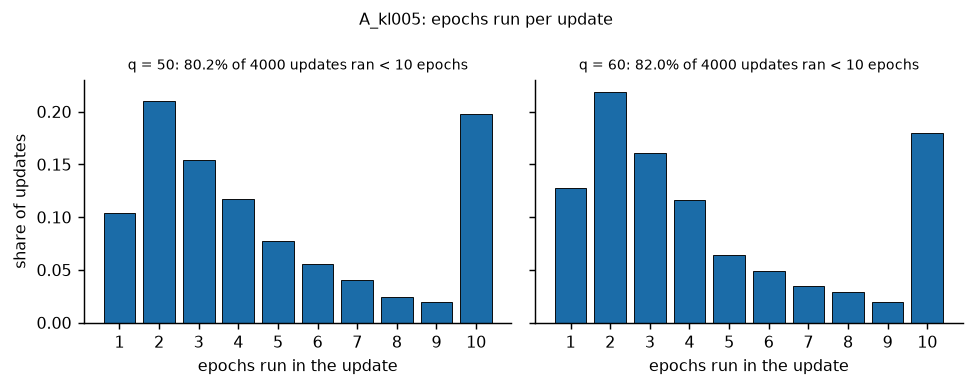
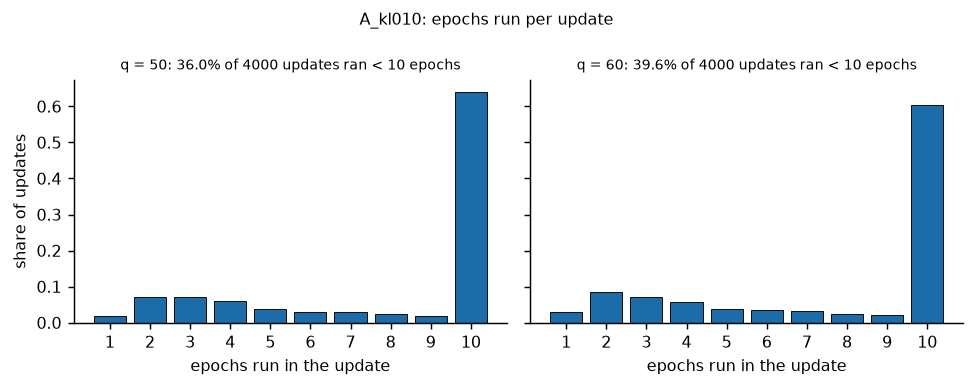
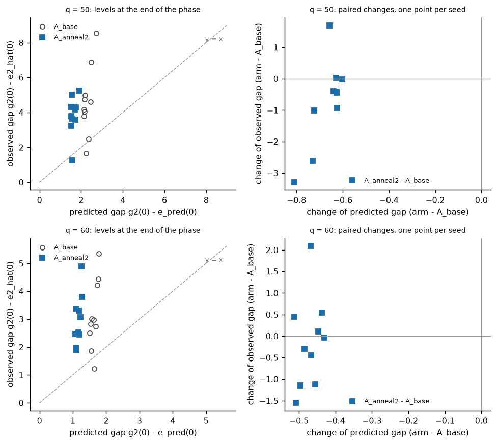
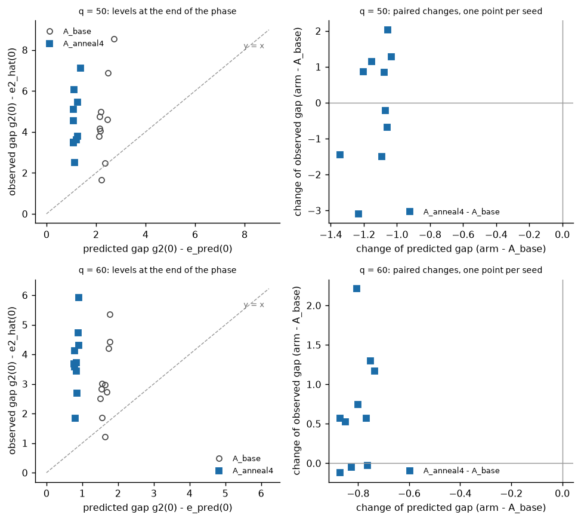
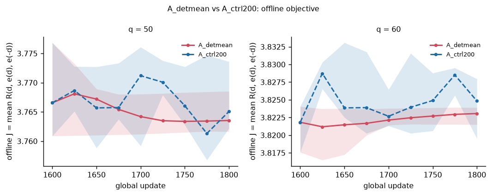
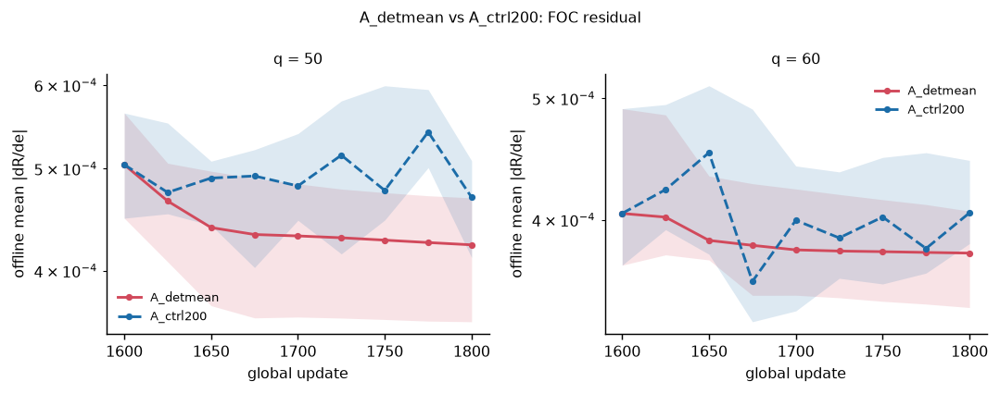
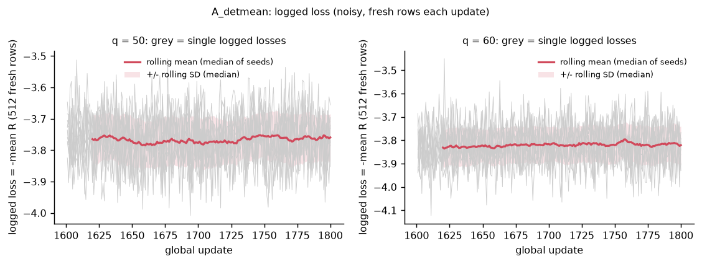
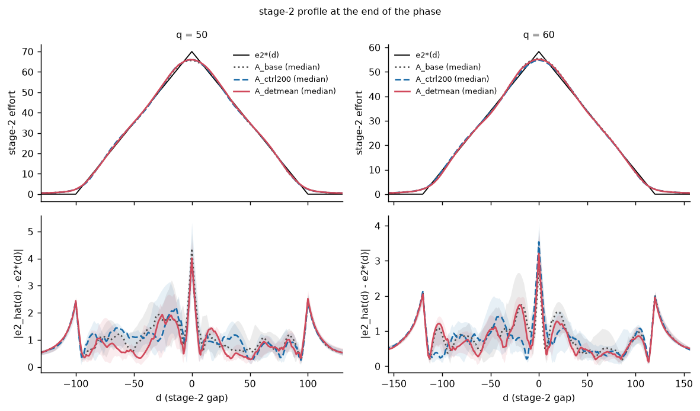
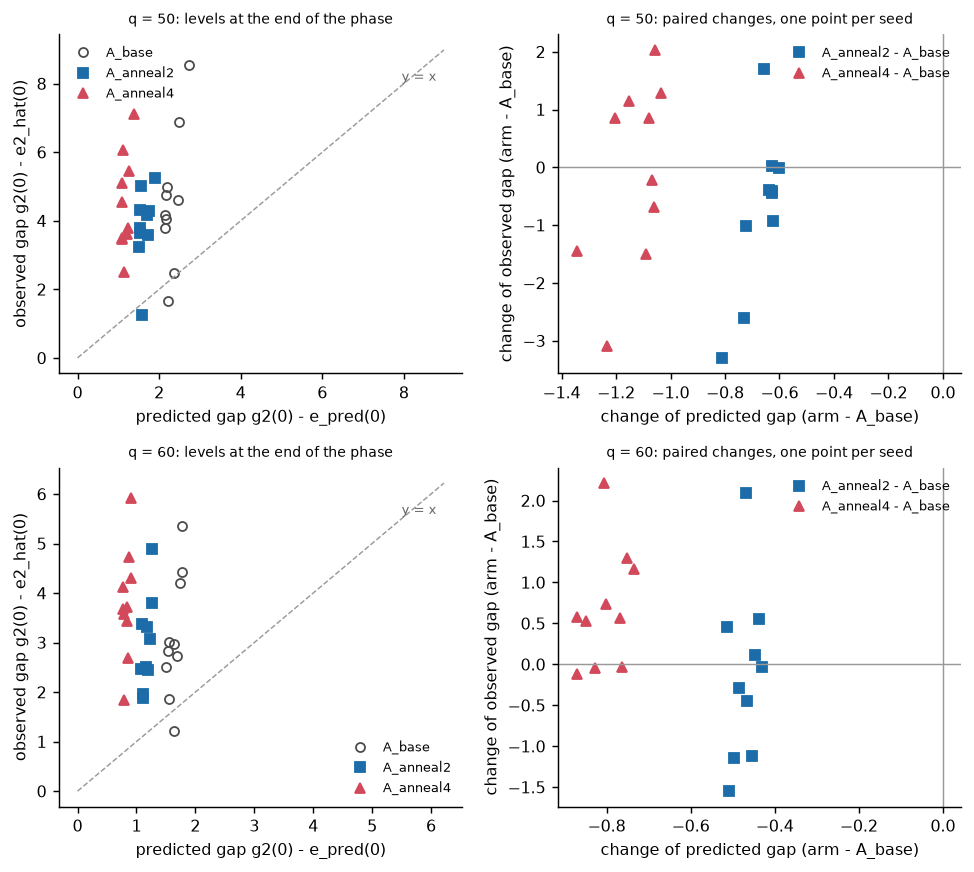

# R1 pilot wave 2: stage-2 (Phase A continuation) arms and the method-5 pair

Candidate: the stage-2 last iterate at the end of the continued phase. Baseline arm: `A_base` (the locked global updates 1201-1600 from `parents_A` u1200). The method-5 pair `A_ctrl200` / `A_detmean` starts from the baseline u1600 state (`rehearsal_v1_1` `state_end_A.pt`) and is also compared with that parent candidate (pseudo-arm `parent_u1600`, read from the rehearsal `gates.json`) and with each other (`A_detmean` is an ablation against its matched control).

Generated by `tools/v2/refine_analysis.py stage2`; deterministic given the same inputs. Every number below is read from a CSV that is cited under its table; nothing is typed by hand. Section 1 holds the checks, section 2 the completeness of the wave, section 3 the definitions, section 4 the stage-wide overview, section 5 one section per arm, section 6 the cost per run, section 7 the anomalies index, section 8 the command.


## 1. Checks (they come first)

The paired design needs the branch points to reproduce the locked pipeline. The check files are written by `tools/v2/cr1_compare.py` (read only here). A missing file means the check has not been produced yet.

| check | file | present | mode | n | n_identical | ALL | failing_fields | first_difference | n_snapshot_refresh_counter_differs |
|---|---|---|---|---|---|---|---|---|---|
| parents_A | results/v2_refine/parents_A_checks.json | True | parentsA | 20 | 20 | True |  |  | 0 |
| stage2_base | results/v2_refine/stage2_base_checks.json | True | stage2_base | 20 | 20 | True |  |  | 20 |
| C-R1 | results/v2_refine/v11_reproduction_checks.json | True | cr1 | 20 | 20 | True |  |  | 0 |

Source: `results/v2_refine/analysis/checks_summary.csv`.

Per-run results: all 60 compared (check, q, seed) results are identical (`results/v2_refine/analysis/checks_per_run.csv` lists every run).

The snapshot-refresh counter of `A_base` may differ from the rehearsal's by the extra phase-entry refresh of a continued phase (the check reports it separately; it is not training-relevant): it differs in 20 of 20 runs (`results/v2_refine/stage2_base_checks.json`, `info` of each run).


## 2. Completeness: runs done / failed / incomplete / missing

| arm | q | planned | done | failed | incomplete | missing | not_done_seeds | set_aside_originals |
|---|---|---|---|---|---|---|---|---|
| A_base | 50 | 10 | 10 | 0 | 0 | 0 |  | 0 |
| A_base | 60 | 10 | 10 | 0 | 0 | 0 |  | 0 |
| A_polish1 | 50 | 10 | 10 | 0 | 0 | 0 |  | 0 |
| A_polish1 | 60 | 10 | 10 | 0 | 0 | 0 |  | 0 |
| A_polish2 | 50 | 10 | 10 | 0 | 0 | 0 |  | 0 |
| A_polish2 | 60 | 10 | 10 | 0 | 0 | 0 |  | 0 |
| A_batch | 50 | 10 | 10 | 0 | 0 | 0 |  | 0 |
| A_batch | 60 | 10 | 10 | 0 | 0 | 0 |  | 0 |
| A_batch_mb256 | 50 | 10 | 10 | 0 | 0 | 0 |  | 0 |
| A_batch_mb256 | 60 | 10 | 10 | 0 | 0 | 0 |  | 0 |
| A_kl005 | 50 | 10 | 10 | 0 | 0 | 0 |  | 0 |
| A_kl005 | 60 | 10 | 10 | 0 | 0 | 0 |  | 0 |
| A_kl010 | 50 | 10 | 10 | 0 | 0 | 0 |  | 0 |
| A_kl010 | 60 | 10 | 10 | 0 | 0 | 0 |  | 0 |
| A_anneal2 | 50 | 10 | 10 | 0 | 0 | 0 |  | 0 |
| A_anneal2 | 60 | 10 | 10 | 0 | 0 | 0 |  | 0 |
| A_anneal4 | 50 | 10 | 10 | 0 | 0 | 0 |  | 0 |
| A_anneal4 | 60 | 10 | 10 | 0 | 0 | 0 |  | 0 |
| A_ctrl200 | 50 | 10 | 10 | 0 | 0 | 0 |  | 0 |
| A_ctrl200 | 60 | 10 | 10 | 0 | 0 | 0 |  | 0 |
| A_detmean | 50 | 10 | 10 | 0 | 0 | 0 |  | 0 |
| A_detmean | 60 | 10 | 10 | 0 | 0 | 0 |  | 0 |

Source: `results/v2_refine/analysis/stage2_completeness.csv`.

No original run was set aside: every analysed run is the first run of its path.

Launch records of the wave (read only; re-runs have their own record):

| wave | record | state | n_planned | n_finished | n_returncode_0 | n_returncode_nonzero | workers | head | code_commit | nproc | loadavg_at_start |
|---|---|---|---|---|---|---|---|---|---|---|---|
| stage2 | results/v2_refine/stage2/launch_20261003_192840.json | done | 220 | 220 | 220 | 0 | 20 | 6e99e01 | 6c902db | 64 | 29.5 25.6 14.4 |

Source: `results/v2_refine/analysis/stage2_launch_record.csv`.

The `manifest.json` of the 220 analysed runs record the commit(s) `6e99e01` (220 runs), `dirty` = false in all of them; the launch records name the head(s) `6e99e01` and the code commit(s) `6c902db`. The commits differ because HEAD advanced during the wave (documentation and analysis-tool commits only); the run code is identical (prereg Addendum 1 item 1).

| manifest_commit | manifest_dirty | n_runs |
|---|---|---|
| 6e99e01 | False | 220 |

Source: `results/v2_refine/analysis/stage2_manifest_commits.csv` (commit and dirty flag recorded in `manifest.json` of the analysed runs).


## 3. Definitions

The analysis is the one of `reports/v2/refine/01_preregistration.md` section 5: final tier for every gate metric (development tier only for the G-N part), recovery metrics are tier independent; every difference is arm - baseline paired by (q, seed); `n_better` counts the seeds whose primary metric is smaller than the baseline's; the confidence intervals are 95% percentile bootstrap intervals of the mean and of the median of the paired differences (10000 resamples of the paired seeds, `numpy.random.default_rng(20261003)`, one fresh generator per (q, statistic)). A run is complete iff `status.json` says done with exit code 0 and `final_v2.json` holds a final-tier evaluation; every other planned run is listed.

Primary metric: `stage2_peak_rel_err_abs` = |signed peak error| = |e2_hat(0) - e2*(0)| / e2*(0); improvement = a decrease of the absolute value (the baseline peak errors are negative, so this equals an increase of the signed error); the signed difference is reported as well.

Thresholds of the verdicts (read from `protocols/v2_T2_locked_v1_1.json`):

| gate | metric | threshold |
|---|---|---|
| G-A | eta_T_over_dw | 0.005 |
| G-A | stage2_rmse_pos_over_g2_0 | 0.05 |
| G-A | stage2_tail_mean_over_g2_0 | 0.02 |
| G-F | Gmax_full_over_dw | 0.01 |
| G-N | eta_T_over_dw_dev_minus_final_abs | 0.001 |
| G-N | Gmax_full_over_dw_dev_minus_final_abs | 0.001 |
| S1 | stage1_rel_err_abs | 0.1 |
| 0929 target (reported only) | \|stage1_rel_err_signed\| | 0.05 |

Source: `results/v2_refine/analysis/stage2_thresholds.csv`.

Stage-2 verdict definitions: G-A = `eta_T_over_dw`, `stage2_rmse_pos_over_g2_0` and `stage2_tail_mean_over_g2_0` each <= their threshold (final tier); G-N (eta part) = |dev - final| of `eta_T_over_dw` <= its threshold; the gate of the criterion is G-A with its G-N (eta) part (`gate_pass`). The stage-1 parts of the protocol are not evaluated for stage-2 runs (stage 1 is untrained). sigma_2(0) of the annealing arms is the annealed value (the run's own `beta_fn`); every reload in this analysis applies the exported `conc_scale` (`load_actor`), cross-checked against the run's own value in the per-run table (`sigma2_0_reload_rel_diff`). The location-free peak error is the `stage2_extra` logic of `run/run_v2_T2_locked.py` on the recovery arrays of `final_final.npz`.

The method-5 ablation `A_detmean` has two criterion rows and two dispersion ratios: against `A_base` like every arm, and against its matched control `A_ctrl200` (`comparison` = `ablation vs matched control`; the pre-registered comparison of the ablation: same parent state, same 200 updates). For the control row, part (b) concerns the runs that passed their gate under `A_ctrl200`. The `A_base` end state is compared with the rehearsal end-of-A values in the sanity table of the `A_base` section.


## 4. Stage-wide overview of the primary metric

| arm | q | n pairs | mean [95% CI] | median [95% CI] | n_better | n(diff>0)/n(diff<0)/n(diff=0) |
|---|---|---|---|---|---|---|
| A_polish1 | 50 | 10 | -0.001748 [-0.01306, 0.008793] | 7.24e-05 [-0.01792, 0.01676] | 5/10 | 5/5/0 |
| A_polish1 | 60 | 10 | 0.008492 [-0.001343, 0.01837] | 0.01101 [-0.007742, 0.02281] | 4/10 | 6/4/0 |
| A_polish2 | 50 | 10 | -0.0004483 [-0.01805, 0.02013] | -0.01119 [-0.02536, 0.02763] | 6/10 | 4/6/0 |
| A_polish2 | 60 | 10 | 0.006236 [-0.005748, 0.0203] | -0.001439 [-0.01085, 0.02312] | 6/10 | 4/6/0 |
| A_batch | 50 | 10 | -0.007331 [-0.0207, 0.004856] | -0.002401 [-0.02159, 0.00567] | 6/10 | 4/6/0 |
| A_batch | 60 | 10 | 0.007753 [-0.004303, 0.0198] | 0.01055 [-0.0107, 0.02685] | 4/10 | 6/4/0 |
| A_batch_mb256 | 50 | 10 | -0.01277 [-0.02413, -0.002037] | -0.009388 [-0.03133, 0.003274] | 6/10 | 4/6/0 |
| A_batch_mb256 | 60 | 10 | 0.006659 [-0.0051, 0.01853] | 0.006152 [-0.007028, 0.02155] | 3/10 | 7/3/0 |
| A_kl005 | 50 | 10 | -0.002194 [-0.01793, 0.01044] | 0.008411 [-0.01191, 0.0133] | 3/10 | 7/3/0 |
| A_kl005 | 60 | 10 | 0.01285 [-0.000454, 0.02562] | 0.01674 [-0.006605, 0.03362] | 4/10 | 6/4/0 |
| A_kl010 | 50 | 10 | -0.004327 [-0.01962, 0.009335] | 0.004792 [-0.02791, 0.01079] | 4/10 | 6/4/0 |
| A_kl010 | 60 | 10 | 0.002749 [-0.009348, 0.01486] | 5.532e-05 [-0.01537, 0.01891] | 5/10 | 5/5/0 |
| A_anneal2 | 50 | 10 | -0.01054 [-0.02265, 0.0009109] | -0.006002 [-0.02527, -0.0002513] | 8/10 | 2/8/0 |
| A_anneal2 | 60 | 10 | -0.002379 [-0.01263, 0.008759] | -0.002784 [-0.01919, 0.007799] | 6/10 | 4/6/0 |
| A_anneal4 | 50 | 10 | -0.001094 [-0.01465, 0.01196] | 0.004521 [-0.02067, 0.01631] | 5/10 | 5/5/0 |
| A_anneal4 | 60 | 10 | 0.01181 [0.005123, 0.01949] | 0.009796 [-0.0004661, 0.02003] | 3/10 | 7/3/0 |
| A_ctrl200 | 50 | 10 | -0.0003145 [-0.01029, 0.00951] | -0.0009795 [-0.0178, 0.01568] | 6/10 | 4/6/0 |
| A_ctrl200 | 60 | 10 | 0.005032 [-0.005487, 0.0144] | 0.009194 [-0.005841, 0.0183] | 4/10 | 6/4/0 |
| A_detmean | 50 | 10 | -0.006633 [-0.01494, 0.001455] | -0.004417 [-0.0214, 0.005519] | 5/10 | 5/5/0 |
| A_detmean | 60 | 10 | 0.003242 [-0.003836, 0.01056] | 0.002364 [-0.001895, 0.008126] | 4/10 | 6/4/0 |

Source: `results/v2_refine/analysis/stage2_overview.csv` (rows: metric == stage2_peak_rel_err_abs, arm - A_base).


Overview: paired difference of `stage2_peak_rel_err_abs` (arm - A_base) per arm and q (`reports/v2/refine/figures/stage2_overview.png`, `reports/v2/refine/figures/stage2_overview.pdf`).

Per-arm criterion (descriptive, not a gate; part (a) = CI of the mean paired difference of the primary metric below 0 at both q, part (b) = no baseline-passing run fails under the arm):

| arm | baseline | comparison | q=50: mean diff [95% CI] | q=50: CI < 0 | q=60: mean diff [95% CI] | q=60: CI < 0 | (a) met at both q | (a) all pairs present | (b) gate part | (b) baseline-passing runs | (b) violations | (b) pending | overall |
|---|---|---|---|---|---|---|---|---|---|---|---|---|---|
| A_polish1 | A_base | vs baseline | -0.001748 [-0.01306, 0.008793] (n=10) | False | 0.008492 [-0.001343, 0.01837] (n=10) | False | False | True | holds | 20 | none | none | not met |
| A_polish2 | A_base | vs baseline | -0.0004483 [-0.01805, 0.02013] (n=10) | False | 0.006236 [-0.005748, 0.0203] (n=10) | False | False | True | holds | 20 | none | none | not met |
| A_batch | A_base | vs baseline | -0.007331 [-0.0207, 0.004856] (n=10) | False | 0.007753 [-0.004303, 0.0198] (n=10) | False | False | True | holds | 20 | none | none | not met |
| A_batch_mb256 | A_base | vs baseline | -0.01277 [-0.02413, -0.002037] (n=10) | True | 0.006659 [-0.0051, 0.01853] (n=10) | False | False | True | holds | 20 | none | none | not met |
| A_kl005 | A_base | vs baseline | -0.002194 [-0.01793, 0.01044] (n=10) | False | 0.01285 [-0.000454, 0.02562] (n=10) | False | False | True | holds | 20 | none | none | not met |
| A_kl010 | A_base | vs baseline | -0.004327 [-0.01962, 0.009335] (n=10) | False | 0.002749 [-0.009348, 0.01486] (n=10) | False | False | True | holds | 20 | none | none | not met |
| A_anneal2 | A_base | vs baseline | -0.01054 [-0.02265, 0.0009109] (n=10) | False | -0.002379 [-0.01263, 0.008759] (n=10) | False | False | True | holds | 20 | none | none | not met |
| A_anneal4 | A_base | vs baseline | -0.001094 [-0.01465, 0.01196] (n=10) | False | 0.01181 [0.005123, 0.01949] (n=10) | False | False | True | holds | 20 | none | none | not met |
| A_ctrl200 | A_base | vs baseline | -0.0003145 [-0.01029, 0.00951] (n=10) | False | 0.005032 [-0.005487, 0.0144] (n=10) | False | False | True | holds | 20 | none | none | not met |
| A_detmean | A_base | vs baseline | -0.006633 [-0.01494, 0.001455] (n=10) | False | 0.003242 [-0.003836, 0.01056] (n=10) | False | False | True | holds | 20 | none | none | not met |
| A_detmean | A_ctrl200 | ablation vs matched control | -0.006319 [-0.01501, 0.00305] (n=10) | False | -0.00179 [-0.0122, 0.009798] (n=10) | False | False | True | holds | 20 | none | none | not met |

Source: `results/v2_refine/analysis/stage2_criterion.csv`.


## 5. Arms (in the order of the arm table)


### `A_base`  (baseline arm)

Single change: locked Phase A global 1201-1600 (local 1-400, 3e-4 -> 3e-5), no change. Runs complete: 20 of 20 (failed 0, incomplete 0, missing 0).

Baseline values (complete runs; medians, means and across-seed SDs; the CSV has more columns):

| arm | q | n complete | median \|peak err\| | median signed peak err | SD signed peak err | median RMSE_pos/e2*(0) | median tail mean/e2*(0) | median eta_2/DW | median sigma_2(0) | n G-A pass | n G-N(eta) pass | n gate pass |
|---|---|---|---|---|---|---|---|---|---|---|---|---|
| A_base | 50 | 10 | 0.0625 | -0.0625 | 0.02834 | 0.02007 | 0.008032 | 0.001196 | 2.795 | 10 | 10 | 10 |
| A_base | 60 | 10 | 0.04971 | -0.04971 | 0.02115 | 0.01982 | 0.009393 | 0.0008469 | 2.989 | 10 | 10 | 10 |
| parent_u1600 | 50 | 10 | 0.0625 | -0.0625 | 0.02834 | 0.02007 | 0.008032 | 0.001196 | 2.795 | 10 | 10 | 10 |
| parent_u1600 | 60 | 10 | 0.04971 | -0.04971 | 0.02115 | 0.01982 | 0.009393 | 0.0008469 | 2.989 | 10 | 10 | 10 |

Source: `results/v2_refine/analysis/stage2_arm_summary.csv`.

Sanity: the end state of `A_base` against the rehearsal end-of-A values (`A_base - parent_u1600`). When the reproduction check holds the differences of the verifier and recovery metrics are exactly 0; the row `smoothed_share_peak_gap_d0` is about 1e-6 instead of 0 because the parent share (from `gates.json`) was computed from a single-row evaluation of the effort at d = 0, while this tool takes it from the batched final evaluation (`final_v2.json`, float32 batch paths differ in the last bits); `smoothed_pred_gap_d0` uses the single-row (alpha, beta) in both and is exactly 0.

| metric | q | n pairs | mean [95% CI] | median [95% CI] | n_better | n(diff>0)/n(diff<0)/n(diff=0) |
|---|---|---|---|---|---|---|
| stage2_peak_rel_err_abs | 50 | 10 | 0 [0, 0] | 0 [0, 0] | 0/10 | 0/0/10 |
| stage2_peak_rel_err_abs | 60 | 10 | 0 [0, 0] | 0 [0, 0] | 0/10 | 0/0/10 |
| stage2_peak_rel_err_signed | 50 | 10 | 0 [0, 0] | 0 [0, 0] | n/a (no direction) | 0/0/10 |
| stage2_peak_rel_err_signed | 60 | 10 | 0 [0, 0] | 0 [0, 0] | n/a (no direction) | 0/0/10 |
| stage2_peak_locfree_rel_err_abs | 50 | 10 | 0 [0, 0] | 0 [0, 0] | 0/10 | 0/0/10 |
| stage2_peak_locfree_rel_err_abs | 60 | 10 | 0 [0, 0] | 0 [0, 0] | 0/10 | 0/0/10 |
| stage2_peak_locfree_rel_err | 50 | 10 | 0 [0, 0] | 0 [0, 0] | n/a (no direction) | 0/0/10 |
| stage2_peak_locfree_rel_err | 60 | 10 | 0 [0, 0] | 0 [0, 0] | n/a (no direction) | 0/0/10 |
| stage2_rmse_pos_over_g2_0 | 50 | 10 | 0 [0, 0] | 0 [0, 0] | 0/10 | 0/0/10 |
| stage2_rmse_pos_over_g2_0 | 60 | 10 | 0 [0, 0] | 0 [0, 0] | 0/10 | 0/0/10 |
| stage2_tail_mean_over_g2_0 | 50 | 10 | 0 [0, 0] | 0 [0, 0] | 0/10 | 0/0/10 |
| stage2_tail_mean_over_g2_0 | 60 | 10 | 0 [0, 0] | 0 [0, 0] | 0/10 | 0/0/10 |
| stage2_tail_max_over_g2_0 | 50 | 10 | 0 [0, 0] | 0 [0, 0] | 0/10 | 0/0/10 |
| stage2_tail_max_over_g2_0 | 60 | 10 | 0 [0, 0] | 0 [0, 0] | 0/10 | 0/0/10 |
| eta_T_over_dw | 50 | 10 | 0 [0, 0] | 0 [0, 0] | 0/10 | 0/0/10 |
| eta_T_over_dw | 60 | 10 | 0 [0, 0] | 0 [0, 0] | 0/10 | 0/0/10 |
| eta_dev_minus_final_abs | 50 | 10 | 0 [0, 0] | 0 [0, 0] | 0/10 | 0/0/10 |
| eta_dev_minus_final_abs | 60 | 10 | 0 [0, 0] | 0 [0, 0] | 0/10 | 0/0/10 |
| stage2_sym_err_max | 50 | 10 | 0 [0, 0] | 0 [0, 0] | 0/10 | 0/0/10 |
| stage2_sym_err_max | 60 | 10 | 0 [0, 0] | 0 [0, 0] | 0/10 | 0/0/10 |
| sigma_effort_at_0_t2 | 50 | 10 | 0 [0, 0] | 0 [0, 0] | n/a (no direction) | 0/0/10 |
| sigma_effort_at_0_t2 | 60 | 10 | 0 [0, 0] | 0 [0, 0] | n/a (no direction) | 0/0/10 |
| e2_at_0 | 50 | 10 | 0 [0, 0] | 0 [0, 0] | n/a (no direction) | 0/0/10 |
| e2_at_0 | 60 | 10 | 0 [0, 0] | 0 [0, 0] | n/a (no direction) | 0/0/10 |
| smoothed_pred_gap_d0 | 50 | 10 | 0 [0, 0] | 0 [0, 0] | n/a (no direction) | 0/0/10 |
| smoothed_pred_gap_d0 | 60 | 10 | 0 [0, 0] | 0 [0, 0] | n/a (no direction) | 0/0/10 |
| smoothed_share_peak_gap_d0 | 50 | 10 | -6.349e-07 [-1.232e-06, -1.866e-07] | -3.178e-07 [-9.592e-07, 0] | n/a (no direction) | 1/7/2 |
| smoothed_share_peak_gap_d0 | 60 | 10 | -2.613e-07 [-1.932e-06, 1.244e-06] | -1.197e-08 [-9.095e-07, 4.796e-07] | n/a (no direction) | 3/5/2 |

Source: `results/v2_refine/analysis/stage2_paired.csv` (rows: comparison == sanity).

**Gate metrics** (verdict counts over the complete runs, final tier; the location-free peak error's argmax d is its location):

| wave | arm | q | n_complete | n_G_A | n_G_A_eta_pass | n_G_A_rmse_pass | n_G_A_tail_pass | n_G_N_eta | n_gate_pass | n_valid_final | n_valid_dev | median_abs_locfree_argmax_d | n_locfree_argmax_at_0 | max_eta_T_over_dw |
|---|---|---|---|---|---|---|---|---|---|---|---|---|---|---|
| stage2 | A_base | 50 | 10 | 10 | 10 | 10 | 10 | 10 | 10 | 10 | 10 | 0.5 | 1 | 0.004014 |
| stage2 | A_base | 60 | 10 | 10 | 10 | 10 | 10 | 10 | 10 | 10 | 10 | 1.25 | 0 | 0.001597 |

Source: `results/v2_refine/analysis/stage2_gate_counts.csv` (rows: arm in (A_base, A_base)).

**Optimisation diagnostics** (medians over the complete runs of per-run values: mean over the updates of the phase; grad norms are the actor's global pre-clip norms).

| arm | q | n complete | KL (mean over updates) | clip frac | actor grad norm (mean) | actor grad norm (max) | actor steps | optimizer steps | epochs run (mean) | advantage SD (all rows) | phase wall s |
|---|---|---|---|---|---|---|---|---|---|---|---|
| A_base | 50 | 10 | 0.005377 | 0.04897 | 3.822 | 17.97 | n/a | 8000 | 10 | 0.04878 | 52.06 |
| A_base | 60 | 10 | 0.00549 | 0.05254 | 4.64 | 20.37 | n/a | 8000 | 10 | 0.04316 | 54.91 |

Source: `results/v2_refine/analysis/stage2_optimisation.csv` (rows: arm in (A_base, A_base)).

**Anomalies.** None among the planned runs of this arm.

**Reproduce:** `python tools/v2/refine_analysis.py stage2 --root results/v2_refine --out results/v2_refine/analysis --reports reports/v2/refine --figures reports/v2/refine/figures`


### `A_polish1`  (method 1 polish)

Single change: LR windows P1: local 1-250 3e-4 -> 3e-5, 251-400 3e-5 -> 3e-6. Runs complete: 20 of 20 (failed 0, incomplete 0, missing 0).

**Paired differences A_polish1 - A_base** (vs baseline); outcome metrics. `n_better` = seeds with a smaller value than the A_base run.

| metric | q | n pairs | mean [95% CI] | median [95% CI] | n_better | n(diff>0)/n(diff<0)/n(diff=0) |
|---|---|---|---|---|---|---|
| stage2_peak_rel_err_abs | 50 | 10 | -0.001748 [-0.01306, 0.008793] | 7.24e-05 [-0.01792, 0.01676] | 5/10 | 5/5/0 |
| stage2_peak_rel_err_abs | 60 | 10 | 0.008492 [-0.001343, 0.01837] | 0.01101 [-0.007742, 0.02281] | 4/10 | 6/4/0 |
| stage2_peak_rel_err_signed | 50 | 10 | 0.001748 [-0.008793, 0.01306] | -7.24e-05 [-0.01676, 0.01792] | n/a (no direction) | 5/5/0 |
| stage2_peak_rel_err_signed | 60 | 10 | -0.008492 [-0.01837, 0.001343] | -0.01101 [-0.02281, 0.007742] | n/a (no direction) | 4/6/0 |
| stage2_peak_locfree_rel_err_abs | 50 | 10 | -0.001745 [-0.01312, 0.008844] | -0.000408 [-0.0178, 0.01569] | 5/10 | 5/5/0 |
| stage2_peak_locfree_rel_err_abs | 60 | 10 | 0.00829 [-0.001487, 0.01819] | 0.01044 [-0.006908, 0.02244] | 4/10 | 6/4/0 |
| stage2_peak_locfree_rel_err | 50 | 10 | 0.001745 [-0.008844, 0.01312] | 0.000408 [-0.01569, 0.0178] | n/a (no direction) | 5/5/0 |
| stage2_peak_locfree_rel_err | 60 | 10 | -0.00829 [-0.01819, 0.001487] | -0.01044 [-0.02244, 0.006908] | n/a (no direction) | 4/6/0 |
| stage2_rmse_pos_over_g2_0 | 50 | 10 | -0.0022 [-0.005209, 0.0007657] | -0.001911 [-0.00649, 0.001728] | 6/10 | 4/6/0 |
| stage2_rmse_pos_over_g2_0 | 60 | 10 | -0.00193 [-0.004611, 0.0005583] | -0.00249 [-0.003589, 0.001345] | 7/10 | 3/7/0 |
| stage2_tail_mean_over_g2_0 | 50 | 10 | 0.0001719 [-0.0002045, 0.0005853] | -5.404e-05 [-0.0002766, 0.0006666] | 6/10 | 4/6/0 |
| stage2_tail_mean_over_g2_0 | 60 | 10 | 0.0002497 [-5.13e-05, 0.0005551] | 0.0002419 [-0.0001592, 0.0006717] | 4/10 | 6/4/0 |
| stage2_tail_max_over_g2_0 | 50 | 10 | -0.002593 [-0.004794, 9.305e-06] | -0.004003 [-0.005625, 0.0004797] | 7/10 | 3/7/0 |
| stage2_tail_max_over_g2_0 | 60 | 10 | -0.0003355 [-0.002419, 0.001791] | 0.000301 [-0.003656, 0.00274] | 4/10 | 6/4/0 |
| eta_T_over_dw | 50 | 10 | -6.363e-05 [-0.0005126, 0.0003524] | 4.275e-05 [-0.0006333, 0.0005216] | 5/10 | 5/5/0 |
| eta_T_over_dw | 60 | 10 | -6.723e-05 [-0.0003106, 0.0001341] | 3.337e-05 [-0.000279, 0.000173] | 5/10 | 5/5/0 |
| eta_dev_minus_final_abs | 50 | 10 | -2.198e-05 [-8.744e-05, 5.501e-05] | -4.374e-05 [-9.537e-05, 7.012e-05] | 7/10 | 3/7/0 |
| eta_dev_minus_final_abs | 60 | 10 | 3.941e-05 [-9.895e-06, 9.023e-05] | 5.191e-05 [-4.292e-05, 0.00011] | 4/10 | 6/4/0 |
| stage2_sym_err_max | 50 | 10 | -0.6938 [-1.467, -0.1244] | -0.4665 [-1.002, -0.1164] | 8/10 | 2/8/0 |
| stage2_sym_err_max | 60 | 10 | -0.2137 [-0.8318, 0.3341] | 0.008172 [-0.991, 0.5187] | 5/10 | 5/5/0 |
| sigma_effort_at_0_t2 | 50 | 10 | 0.04834 [0.03024, 0.06494] | 0.05028 [0.03382, 0.06877] | n/a (no direction) | 9/1/0 |
| sigma_effort_at_0_t2 | 60 | 10 | 0.05071 [0.0434, 0.05739] | 0.05351 [0.04238, 0.05962] | n/a (no direction) | 10/0/0 |
| e2_at_0 | 50 | 10 | 0.1224 [-0.6155, 0.9144] | -0.005068 [-1.174, 1.254] | n/a (no direction) | 5/5/0 |
| e2_at_0 | 60 | 10 | -0.4953 [-1.072, 0.07834] | -0.6424 [-1.331, 0.4516] | n/a (no direction) | 4/6/0 |
| smoothed_pred_gap_d0 | 50 | 10 | 0.03817 [0.02382, 0.05132] | 0.03973 [0.02667, 0.05437] | n/a (no direction) | 9/1/0 |
| smoothed_pred_gap_d0 | 60 | 10 | 0.02784 [0.02382, 0.03151] | 0.02936 [0.02326, 0.03273] | n/a (no direction) | 10/0/0 |
| smoothed_share_peak_gap_d0 | 50 | 10 | 0.01839 [-0.1459, 0.1643] | 0.03998 [-0.08676, 0.1556] | n/a (no direction) | 5/5/0 |
| smoothed_share_peak_gap_d0 | 60 | 10 | -0.131 [-0.3171, 0.009705] | -0.07505 [-0.2488, 0.07145] | n/a (no direction) | 4/6/0 |

Source: `results/v2_refine/analysis/stage2_paired.csv` (rows: arm == A_polish1, baseline == A_base; seed-level values in `results/v2_refine/analysis/stage2_paired_seed_level.csv`).

**Pre-registered criterion** (descriptive; both parts separately):

| arm | baseline | comparison | q=50: mean diff [95% CI] | q=50: CI < 0 | q=60: mean diff [95% CI] | q=60: CI < 0 | (a) met at both q | (a) all pairs present | (b) gate part | (b) baseline-passing runs | (b) violations | (b) pending | overall |
|---|---|---|---|---|---|---|---|---|---|---|---|---|---|
| A_polish1 | A_base | vs baseline | -0.001748 [-0.01306, 0.008793] (n=10) | False | 0.008492 [-0.001343, 0.01837] (n=10) | False | False | True | holds | 20 | none | none | not met |

Source: `results/v2_refine/analysis/stage2_criterion.csv` (row: arm == A_polish1, baseline == A_base).

**Dispersion** across seeds (SD with ddof = 1) of the signed error and of the effort at d = 0; ratio arm/baseline with a paired-resampling bootstrap CI (same resampled seeds for both). The two metrics give the same ratio because the signed error is an affine function of the effort with the same target (descriptive extra: the pre-registration lists dispersion for stage 1 only).

| arm | baseline | metric | q | n | SD arm | SD baseline | ratio arm/baseline [95% CI] |
|---|---|---|---|---|---|---|---|
| A_polish1 | A_base | stage2_peak_rel_err_signed | 50 | 10 | 0.02924 | 0.02834 | 1.032 [0.622, 1.645] |
| A_polish1 | A_base | e2_at_0 | 50 | 10 | 2.047 | 1.984 | 1.032 [0.622, 1.645] |
| A_polish1 | A_base | stage2_peak_rel_err_signed | 60 | 10 | 0.01471 | 0.02115 | 0.6955 [0.4362, 1.213] |
| A_polish1 | A_base | e2_at_0 | 60 | 10 | 0.8582 | 1.234 | 0.6955 [0.4362, 1.213] |

Source: `results/v2_refine/analysis/stage2_dispersion.csv` (rows: arm == A_polish1).

**Gate metrics** (verdict counts over the complete runs, final tier; the location-free peak error's argmax d is its location):

| wave | arm | q | n_complete | n_G_A | n_G_A_eta_pass | n_G_A_rmse_pass | n_G_A_tail_pass | n_G_N_eta | n_gate_pass | n_valid_final | n_valid_dev | median_abs_locfree_argmax_d | n_locfree_argmax_at_0 | max_eta_T_over_dw |
|---|---|---|---|---|---|---|---|---|---|---|---|---|---|---|
| stage2 | A_base | 50 | 10 | 10 | 10 | 10 | 10 | 10 | 10 | 10 | 10 | 0.5 | 1 | 0.004014 |
| stage2 | A_base | 60 | 10 | 10 | 10 | 10 | 10 | 10 | 10 | 10 | 10 | 1.25 | 0 | 0.001597 |
| stage2 | A_polish1 | 50 | 10 | 10 | 10 | 10 | 10 | 10 | 10 | 10 | 10 | 1 | 1 | 0.004469 |
| stage2 | A_polish1 | 60 | 10 | 10 | 10 | 10 | 10 | 10 | 10 | 10 | 10 | 1.25 | 1 | 0.001369 |

Source: `results/v2_refine/analysis/stage2_gate_counts.csv` (rows: arm in (A_polish1, A_base)).

**Optimisation diagnostics** (medians over the complete runs of per-run values: mean over the updates of the phase; grad norms are the actor's global pre-clip norms).

| arm | q | n complete | KL (mean over updates) | clip frac | actor grad norm (mean) | actor grad norm (max) | actor steps | optimizer steps | epochs run (mean) | advantage SD (all rows) | phase wall s |
|---|---|---|---|---|---|---|---|---|---|---|---|
| A_base | 50 | 10 | 0.005377 | 0.04897 | 3.822 | 17.97 | n/a | 8000 | 10 | 0.04878 | 52.06 |
| A_base | 60 | 10 | 0.00549 | 0.05254 | 4.64 | 20.37 | n/a | 8000 | 10 | 0.04316 | 54.91 |
| A_polish1 | 50 | 10 | 0.004168 | 0.03591 | 3.672 | 17.16 | n/a | 8000 | 10 | 0.0488 | 47.56 |
| A_polish1 | 60 | 10 | 0.004267 | 0.03889 | 4.347 | 20.86 | n/a | 8000 | 10 | 0.04319 | 53.25 |

Source: `results/v2_refine/analysis/stage2_optimisation.csv` (rows: arm in (A_polish1, A_base)).

**RNG divergence.** First update of the phase at which each RNG stream's position differs from that of A_base (`never` = identical to the end). 

| q | stream | n_runs | n_at_first_update | n_never | first_update_of_phase | median_first_divergence | min_first_divergence | max_first_divergence | n_not_comparable |
|---|---|---|---|---|---|---|---|---|---|
| 50 | env | 10 | 0 | 10 | 1201 | n/a | n/a | n/a | 0 |
| 50 | learn | 10 | 0 | 0 | 1201 | 1213 | 1205 | 1240 | 0 |
| 50 | opp | 10 | 0 | 0 | 1201 | 1222 | 1221 | 1251 | 0 |
| 50 | start | 10 | 0 | 10 | 1201 | n/a | n/a | n/a | 0 |
| 50 | minibatch | 10 | 0 | 10 | 1201 | n/a | n/a | n/a | 0 |
| 60 | env | 10 | 0 | 10 | 1201 | n/a | n/a | n/a | 0 |
| 60 | learn | 10 | 0 | 0 | 1201 | 1211 | 1207 | 1227 | 0 |
| 60 | opp | 10 | 0 | 0 | 1201 | 1222 | 1221 | 1309 | 0 |
| 60 | start | 10 | 0 | 10 | 1201 | n/a | n/a | n/a | 0 |
| 60 | minibatch | 10 | 0 | 10 | 1201 | n/a | n/a | n/a | 0 |

Source: `results/v2_refine/analysis/stage2_rng_divergence.csv` (rows: arm == A_polish1).

**Figures.**


Paired difference of the primary metric `stage2_peak_rel_err_abs`, A_polish1 - A_base, one point per seed, per q (`reports/v2/refine/figures/stage2_A_polish1_paired_primary.png`, `reports/v2/refine/figures/stage2_A_polish1_paired_primary.pdf`).

**Anomalies.** None among the planned runs of this arm.

**Reproduce:** `python tools/v2/refine_analysis.py stage2 --root results/v2_refine --out results/v2_refine/analysis --reports reports/v2/refine --figures reports/v2/refine/figures`


### `A_polish2`  (method 1 polish)

Single change: LR window P2: local 1-400 3e-4 -> 3e-6. Runs complete: 20 of 20 (failed 0, incomplete 0, missing 0).

**Paired differences A_polish2 - A_base** (vs baseline); outcome metrics. `n_better` = seeds with a smaller value than the A_base run.

| metric | q | n pairs | mean [95% CI] | median [95% CI] | n_better | n(diff>0)/n(diff<0)/n(diff=0) |
|---|---|---|---|---|---|---|
| stage2_peak_rel_err_abs | 50 | 10 | -0.0004483 [-0.01805, 0.02013] | -0.01119 [-0.02536, 0.02763] | 6/10 | 4/6/0 |
| stage2_peak_rel_err_abs | 60 | 10 | 0.006236 [-0.005748, 0.0203] | -0.001439 [-0.01085, 0.02312] | 6/10 | 4/6/0 |
| stage2_peak_rel_err_signed | 50 | 10 | 0.0004483 [-0.02013, 0.01805] | 0.01119 [-0.02763, 0.02536] | n/a (no direction) | 6/4/0 |
| stage2_peak_rel_err_signed | 60 | 10 | -0.006236 [-0.0203, 0.005748] | 0.001439 [-0.02312, 0.01085] | n/a (no direction) | 6/4/0 |
| stage2_peak_locfree_rel_err_abs | 50 | 10 | -0.0003035 [-0.01808, 0.02043] | -0.01093 [-0.0262, 0.02773] | 6/10 | 4/6/0 |
| stage2_peak_locfree_rel_err_abs | 60 | 10 | 0.006128 [-0.005835, 0.02021] | -0.001399 [-0.01092, 0.02233] | 6/10 | 4/6/0 |
| stage2_peak_locfree_rel_err | 50 | 10 | 0.0003035 [-0.02043, 0.01808] | 0.01093 [-0.02773, 0.0262] | n/a (no direction) | 6/4/0 |
| stage2_peak_locfree_rel_err | 60 | 10 | -0.006128 [-0.02021, 0.005835] | 0.001399 [-0.02233, 0.01092] | n/a (no direction) | 6/4/0 |
| stage2_rmse_pos_over_g2_0 | 50 | 10 | 0.001199 [-0.003907, 0.007688] | -0.002256 [-0.005711, 0.006916] | 6/10 | 4/6/0 |
| stage2_rmse_pos_over_g2_0 | 60 | 10 | -0.0006368 [-0.00297, 0.001454] | -0.0001156 [-0.002614, 0.002195] | 5/10 | 5/5/0 |
| stage2_tail_mean_over_g2_0 | 50 | 10 | 6.08e-05 [-0.0002984, 0.0004315] | 0.0002226 [-0.00049, 0.0003923] | 4/10 | 6/4/0 |
| stage2_tail_mean_over_g2_0 | 60 | 10 | -5.603e-05 [-0.0003533, 0.0002231] | 5.179e-05 [-0.0004745, 0.0002802] | 4/10 | 6/4/0 |
| stage2_tail_max_over_g2_0 | 50 | 10 | -0.001025 [-0.004631, 0.003098] | -0.0005794 [-0.005035, 0.001559] | 6/10 | 4/6/0 |
| stage2_tail_max_over_g2_0 | 60 | 10 | -0.0004986 [-0.001954, 0.001066] | -0.0007222 [-0.002916, 0.001272] | 5/10 | 5/5/0 |
| eta_T_over_dw | 50 | 10 | 7.87e-05 [-0.0004019, 0.0005364] | 0.0001744 [-0.0005075, 0.0006801] | 4/10 | 6/4/0 |
| eta_T_over_dw | 60 | 10 | -7.103e-05 [-0.0002874, 0.0001423] | -4.61e-05 [-0.0004757, 0.0002953] | 6/10 | 4/6/0 |
| eta_dev_minus_final_abs | 50 | 10 | -6.288e-06 [-8.558e-05, 8.103e-05] | -3.335e-05 [-0.0001111, 0.0001141] | 6/10 | 3/6/1 |
| eta_dev_minus_final_abs | 60 | 10 | 2.665e-05 [-3.175e-05, 9.314e-05] | -3.255e-07 [-5.752e-05, 0.0001113] | 5/10 | 5/5/0 |
| stage2_sym_err_max | 50 | 10 | -0.2381 [-0.9872, 0.4498] | -0.3738 [-0.6349, 0.6177] | 7/10 | 3/7/0 |
| stage2_sym_err_max | 60 | 10 | 0.05173 [-0.5936, 0.6332] | 0.2841 [-0.6636, 0.7867] | 3/10 | 7/3/0 |
| sigma_effort_at_0_t2 | 50 | 10 | 0.01481 [-0.01651, 0.04898] | 0.005413 [-0.02569, 0.05353] | n/a (no direction) | 5/5/0 |
| sigma_effort_at_0_t2 | 60 | 10 | 0.0115 [0.001742, 0.02134] | 0.01228 [-0.001835, 0.02383] | n/a (no direction) | 7/3/0 |
| e2_at_0 | 50 | 10 | 0.03138 [-1.409, 1.263] | 0.7831 [-1.934, 1.776] | n/a (no direction) | 6/4/0 |
| e2_at_0 | 60 | 10 | -0.3638 [-1.184, 0.3353] | 0.08392 [-1.349, 0.6331] | n/a (no direction) | 6/4/0 |
| smoothed_pred_gap_d0 | 50 | 10 | 0.0117 [-0.01313, 0.03877] | 0.004196 [-0.02037, 0.04242] | n/a (no direction) | 5/5/0 |
| smoothed_pred_gap_d0 | 60 | 10 | 0.006312 [0.0009582, 0.01173] | 0.006746 [-0.001018, 0.01309] | n/a (no direction) | 7/3/0 |
| smoothed_share_peak_gap_d0 | 50 | 10 | -0.03211 [-0.2947, 0.19] | 0.06211 [-0.295, 0.2616] | n/a (no direction) | 6/4/0 |
| smoothed_share_peak_gap_d0 | 60 | 10 | -0.1085 [-0.3357, 0.06435] | 0.009525 [-0.2649, 0.09397] | n/a (no direction) | 6/4/0 |

Source: `results/v2_refine/analysis/stage2_paired.csv` (rows: arm == A_polish2, baseline == A_base; seed-level values in `results/v2_refine/analysis/stage2_paired_seed_level.csv`).

**Pre-registered criterion** (descriptive; both parts separately):

| arm | baseline | comparison | q=50: mean diff [95% CI] | q=50: CI < 0 | q=60: mean diff [95% CI] | q=60: CI < 0 | (a) met at both q | (a) all pairs present | (b) gate part | (b) baseline-passing runs | (b) violations | (b) pending | overall |
|---|---|---|---|---|---|---|---|---|---|---|---|---|---|
| A_polish2 | A_base | vs baseline | -0.0004483 [-0.01805, 0.02013] (n=10) | False | 0.006236 [-0.005748, 0.0203] (n=10) | False | False | True | holds | 20 | none | none | not met |

Source: `results/v2_refine/analysis/stage2_criterion.csv` (row: arm == A_polish2, baseline == A_base).

**Dispersion** across seeds (SD with ddof = 1) of the signed error and of the effort at d = 0; ratio arm/baseline with a paired-resampling bootstrap CI (same resampled seeds for both). The two metrics give the same ratio because the signed error is an affine function of the effort with the same target (descriptive extra: the pre-registration lists dispersion for stage 1 only).

| arm | baseline | metric | q | n | SD arm | SD baseline | ratio arm/baseline [95% CI] |
|---|---|---|---|---|---|---|---|
| A_polish2 | A_base | stage2_peak_rel_err_signed | 50 | 10 | 0.02369 | 0.02834 | 0.836 [0.5201, 1.668] |
| A_polish2 | A_base | e2_at_0 | 50 | 10 | 1.659 | 1.984 | 0.836 [0.5201, 1.668] |
| A_polish2 | A_base | stage2_peak_rel_err_signed | 60 | 10 | 0.0168 | 0.02115 | 0.7941 [0.4577, 1.34] |
| A_polish2 | A_base | e2_at_0 | 60 | 10 | 0.9799 | 1.234 | 0.7941 [0.4577, 1.34] |

Source: `results/v2_refine/analysis/stage2_dispersion.csv` (rows: arm == A_polish2).

**Gate metrics** (verdict counts over the complete runs, final tier; the location-free peak error's argmax d is its location):

| wave | arm | q | n_complete | n_G_A | n_G_A_eta_pass | n_G_A_rmse_pass | n_G_A_tail_pass | n_G_N_eta | n_gate_pass | n_valid_final | n_valid_dev | median_abs_locfree_argmax_d | n_locfree_argmax_at_0 | max_eta_T_over_dw |
|---|---|---|---|---|---|---|---|---|---|---|---|---|---|---|
| stage2 | A_base | 50 | 10 | 10 | 10 | 10 | 10 | 10 | 10 | 10 | 10 | 0.5 | 1 | 0.004014 |
| stage2 | A_base | 60 | 10 | 10 | 10 | 10 | 10 | 10 | 10 | 10 | 10 | 1.25 | 0 | 0.001597 |
| stage2 | A_polish2 | 50 | 10 | 10 | 10 | 10 | 10 | 10 | 10 | 10 | 10 | 0.5 | 2 | 0.003095 |
| stage2 | A_polish2 | 60 | 10 | 10 | 10 | 10 | 10 | 10 | 10 | 10 | 10 | 1.25 | 0 | 0.001536 |

Source: `results/v2_refine/analysis/stage2_gate_counts.csv` (rows: arm in (A_polish2, A_base)).

**Optimisation diagnostics** (medians over the complete runs of per-run values: mean over the updates of the phase; grad norms are the actor's global pre-clip norms).

| arm | q | n complete | KL (mean over updates) | clip frac | actor grad norm (mean) | actor grad norm (max) | actor steps | optimizer steps | epochs run (mean) | advantage SD (all rows) | phase wall s |
|---|---|---|---|---|---|---|---|---|---|---|---|
| A_base | 50 | 10 | 0.005377 | 0.04897 | 3.822 | 17.97 | n/a | 8000 | 10 | 0.04878 | 52.06 |
| A_base | 60 | 10 | 0.00549 | 0.05254 | 4.64 | 20.37 | n/a | 8000 | 10 | 0.04316 | 54.91 |
| A_polish2 | 50 | 10 | 0.005061 | 0.04576 | 3.702 | 16.41 | n/a | 8000 | 10 | 0.04924 | 48.48 |
| A_polish2 | 60 | 10 | 0.005265 | 0.04804 | 4.576 | 21.87 | n/a | 8000 | 10 | 0.04275 | 47.77 |

Source: `results/v2_refine/analysis/stage2_optimisation.csv` (rows: arm in (A_polish2, A_base)).

**RNG divergence.** First update of the phase at which each RNG stream's position differs from that of A_base (`never` = identical to the end). 

| q | stream | n_runs | n_at_first_update | n_never | first_update_of_phase | median_first_divergence | min_first_divergence | max_first_divergence | n_not_comparable |
|---|---|---|---|---|---|---|---|---|---|
| 50 | env | 10 | 0 | 10 | 1201 | n/a | n/a | n/a | 0 |
| 50 | learn | 10 | 0 | 0 | 1201 | 1215 | 1207 | 1235 | 0 |
| 50 | opp | 10 | 0 | 0 | 1201 | 1222 | 1221 | 1244 | 0 |
| 50 | start | 10 | 0 | 10 | 1201 | n/a | n/a | n/a | 0 |
| 50 | minibatch | 10 | 0 | 10 | 1201 | n/a | n/a | n/a | 0 |
| 60 | env | 10 | 0 | 10 | 1201 | n/a | n/a | n/a | 0 |
| 60 | learn | 10 | 0 | 0 | 1201 | 1212 | 1208 | 1227 | 0 |
| 60 | opp | 10 | 0 | 0 | 1201 | 1222 | 1221 | 1231 | 0 |
| 60 | start | 10 | 0 | 10 | 1201 | n/a | n/a | n/a | 0 |
| 60 | minibatch | 10 | 0 | 10 | 1201 | n/a | n/a | n/a | 0 |

Source: `results/v2_refine/analysis/stage2_rng_divergence.csv` (rows: arm == A_polish2).

**Figures.**


Paired difference of the primary metric `stage2_peak_rel_err_abs`, A_polish2 - A_base, one point per seed, per q (`reports/v2/refine/figures/stage2_A_polish2_paired_primary.png`, `reports/v2/refine/figures/stage2_A_polish2_paired_primary.pdf`).

**Anomalies.** None among the planned runs of this arm.

**Reproduce:** `python tools/v2/refine_analysis.py stage2 --root results/v2_refine --out results/v2_refine/analysis --reports reports/v2/refine --figures reports/v2/refine/figures`


### `A_batch`  (method 2 batch)

Single change: episodes_per_update 2048, minibatch 1024 (20 optimizer steps per update). Runs complete: 20 of 20 (failed 0, incomplete 0, missing 0).

**Paired differences A_batch - A_base** (vs baseline); outcome metrics. `n_better` = seeds with a smaller value than the A_base run.

| metric | q | n pairs | mean [95% CI] | median [95% CI] | n_better | n(diff>0)/n(diff<0)/n(diff=0) |
|---|---|---|---|---|---|---|
| stage2_peak_rel_err_abs | 50 | 10 | -0.007331 [-0.0207, 0.004856] | -0.002401 [-0.02159, 0.00567] | 6/10 | 4/6/0 |
| stage2_peak_rel_err_abs | 60 | 10 | 0.007753 [-0.004303, 0.0198] | 0.01055 [-0.0107, 0.02685] | 4/10 | 6/4/0 |
| stage2_peak_rel_err_signed | 50 | 10 | 0.007331 [-0.004856, 0.0207] | 0.002401 [-0.00567, 0.02159] | n/a (no direction) | 6/4/0 |
| stage2_peak_rel_err_signed | 60 | 10 | -0.007753 [-0.0198, 0.004303] | -0.01055 [-0.02685, 0.0107] | n/a (no direction) | 4/6/0 |
| stage2_peak_locfree_rel_err_abs | 50 | 10 | -0.007107 [-0.02065, 0.005199] | -0.002413 [-0.0218, 0.006067] | 6/10 | 4/6/0 |
| stage2_peak_locfree_rel_err_abs | 60 | 10 | 0.0079 [-0.004243, 0.02005] | 0.01092 [-0.01085, 0.0271] | 4/10 | 6/4/0 |
| stage2_peak_locfree_rel_err | 50 | 10 | 0.007107 [-0.005199, 0.02065] | 0.002413 [-0.006067, 0.0218] | n/a (no direction) | 6/4/0 |
| stage2_peak_locfree_rel_err | 60 | 10 | -0.0079 [-0.02005, 0.004243] | -0.01092 [-0.0271, 0.01085] | n/a (no direction) | 4/6/0 |
| stage2_rmse_pos_over_g2_0 | 50 | 10 | -0.001548 [-0.005372, 0.003369] | -0.002885 [-0.006422, 0.0004738] | 7/10 | 3/7/0 |
| stage2_rmse_pos_over_g2_0 | 60 | 10 | -0.002951 [-0.005418, -0.0004528] | -0.003065 [-0.006123, -0.0003241] | 8/10 | 2/8/0 |
| stage2_tail_mean_over_g2_0 | 50 | 10 | -0.0001011 [-0.0004959, 0.000357] | -0.0001141 [-0.0006331, 0.0001442] | 5/10 | 5/5/0 |
| stage2_tail_mean_over_g2_0 | 60 | 10 | -0.0005028 [-0.0008096, -0.0001893] | -0.0006072 [-0.0009739, -7.265e-05] | 9/10 | 1/9/0 |
| stage2_tail_max_over_g2_0 | 50 | 10 | 0.0009278 [-0.002697, 0.004583] | 0.0004279 [-0.003965, 0.005588] | 5/10 | 5/5/0 |
| stage2_tail_max_over_g2_0 | 60 | 10 | -0.001663 [-0.003431, 4.982e-05] | -0.001375 [-0.005078, 0.001042] | 6/10 | 4/6/0 |
| eta_T_over_dw | 50 | 10 | -0.0003336 [-0.0006023, -8.559e-05] | -0.0001926 [-0.00067, 3.471e-05] | 7/10 | 3/7/0 |
| eta_T_over_dw | 60 | 10 | -0.0001225 [-0.0004511, 0.0002019] | -3.795e-05 [-0.0005593, 0.0002639] | 5/10 | 5/5/0 |
| eta_dev_minus_final_abs | 50 | 10 | -1.482e-05 [-7.133e-05, 4.113e-05] | -1.596e-05 [-7.69e-05, 3.81e-05] | 5/10 | 3/5/2 |
| eta_dev_minus_final_abs | 60 | 10 | 2.67e-05 [-4.07e-05, 8.919e-05] | 2.757e-05 [-3.222e-05, 0.0001014] | 3/10 | 7/3/0 |
| stage2_sym_err_max | 50 | 10 | -0.03711 [-0.9913, 0.9473] | -0.07614 [-1.234, 0.9913] | 5/10 | 5/5/0 |
| stage2_sym_err_max | 60 | 10 | -0.3446 [-0.7156, 0.03403] | -0.3455 [-0.8321, 0.1079] | 8/10 | 2/8/0 |
| sigma_effort_at_0_t2 | 50 | 10 | -0.0911 [-0.1126, -0.06854] | -0.087 [-0.118, -0.0687] | n/a (no direction) | 0/10/0 |
| sigma_effort_at_0_t2 | 60 | 10 | -0.08719 [-0.1017, -0.07301] | -0.08846 [-0.1105, -0.06257] | n/a (no direction) | 0/10/0 |
| e2_at_0 | 50 | 10 | 0.5132 [-0.3399, 1.449] | 0.168 [-0.3969, 1.511] | n/a (no direction) | 6/4/0 |
| e2_at_0 | 60 | 10 | -0.4522 [-1.155, 0.251] | -0.6154 [-1.566, 0.6242] | n/a (no direction) | 4/6/0 |
| smoothed_pred_gap_d0 | 50 | 10 | -0.07199 [-0.08904, -0.05412] | -0.06873 [-0.09328, -0.05424] | n/a (no direction) | 0/10/0 |
| smoothed_pred_gap_d0 | 60 | 10 | -0.04784 [-0.05579, -0.04005] | -0.04854 [-0.06066, -0.03433] | n/a (no direction) | 0/10/0 |
| smoothed_share_peak_gap_d0 | 50 | 10 | -0.02569 [-0.2116, 0.1287] | 0.005853 [-0.1172, 0.1566] | n/a (no direction) | 5/5/0 |
| smoothed_share_peak_gap_d0 | 60 | 10 | -0.1494 [-0.3311, 0.00101] | -0.118 [-0.2944, 0.06319] | n/a (no direction) | 4/6/0 |

Source: `results/v2_refine/analysis/stage2_paired.csv` (rows: arm == A_batch, baseline == A_base; seed-level values in `results/v2_refine/analysis/stage2_paired_seed_level.csv`).

**Pre-registered criterion** (descriptive; both parts separately):

| arm | baseline | comparison | q=50: mean diff [95% CI] | q=50: CI < 0 | q=60: mean diff [95% CI] | q=60: CI < 0 | (a) met at both q | (a) all pairs present | (b) gate part | (b) baseline-passing runs | (b) violations | (b) pending | overall |
|---|---|---|---|---|---|---|---|---|---|---|---|---|---|
| A_batch | A_base | vs baseline | -0.007331 [-0.0207, 0.004856] (n=10) | False | 0.007753 [-0.004303, 0.0198] (n=10) | False | False | True | holds | 20 | none | none | not met |

Source: `results/v2_refine/analysis/stage2_criterion.csv` (row: arm == A_batch, baseline == A_base).

**Dispersion** across seeds (SD with ddof = 1) of the signed error and of the effort at d = 0; ratio arm/baseline with a paired-resampling bootstrap CI (same resampled seeds for both). The two metrics give the same ratio because the signed error is an affine function of the effort with the same target (descriptive extra: the pre-registration lists dispersion for stage 1 only).

| arm | baseline | metric | q | n | SD arm | SD baseline | ratio arm/baseline [95% CI] |
|---|---|---|---|---|---|---|---|
| A_batch | A_base | stage2_peak_rel_err_signed | 50 | 10 | 0.01706 | 0.02834 | 0.602 [0.2759, 0.8594] |
| A_batch | A_base | e2_at_0 | 50 | 10 | 1.194 | 1.984 | 0.602 [0.2759, 0.8594] |
| A_batch | A_base | stage2_peak_rel_err_signed | 60 | 10 | 0.01418 | 0.02115 | 0.6701 [0.3932, 1.125] |
| A_batch | A_base | e2_at_0 | 60 | 10 | 0.8269 | 1.234 | 0.6701 [0.3932, 1.125] |

Source: `results/v2_refine/analysis/stage2_dispersion.csv` (rows: arm == A_batch).

**Gate metrics** (verdict counts over the complete runs, final tier; the location-free peak error's argmax d is its location):

| wave | arm | q | n_complete | n_G_A | n_G_A_eta_pass | n_G_A_rmse_pass | n_G_A_tail_pass | n_G_N_eta | n_gate_pass | n_valid_final | n_valid_dev | median_abs_locfree_argmax_d | n_locfree_argmax_at_0 | max_eta_T_over_dw |
|---|---|---|---|---|---|---|---|---|---|---|---|---|---|---|
| stage2 | A_base | 50 | 10 | 10 | 10 | 10 | 10 | 10 | 10 | 10 | 10 | 0.5 | 1 | 0.004014 |
| stage2 | A_base | 60 | 10 | 10 | 10 | 10 | 10 | 10 | 10 | 10 | 10 | 1.25 | 0 | 0.001597 |
| stage2 | A_batch | 50 | 10 | 10 | 10 | 10 | 10 | 10 | 10 | 10 | 10 | 0.5 | 4 | 0.002803 |
| stage2 | A_batch | 60 | 10 | 10 | 10 | 10 | 10 | 10 | 10 | 10 | 10 | 0.5 | 3 | 0.001406 |

Source: `results/v2_refine/analysis/stage2_gate_counts.csv` (rows: arm in (A_batch, A_base)).

**Optimisation diagnostics** (medians over the complete runs of per-run values: mean over the updates of the phase; grad norms are the actor's global pre-clip norms).

| arm | q | n complete | KL (mean over updates) | clip frac | actor grad norm (mean) | actor grad norm (max) | actor steps | optimizer steps | epochs run (mean) | advantage SD (all rows) | phase wall s |
|---|---|---|---|---|---|---|---|---|---|---|---|
| A_base | 50 | 10 | 0.005377 | 0.04897 | 3.822 | 17.97 | n/a | 8000 | 10 | 0.04878 | 52.06 |
| A_base | 60 | 10 | 0.00549 | 0.05254 | 4.64 | 20.37 | n/a | 8000 | 10 | 0.04316 | 54.91 |
| A_batch | 50 | 10 | 0.00311 | 0.0318 | 2.457 | 12.79 | n/a | 8000 | 10 | 0.04768 | 72.95 |
| A_batch | 60 | 10 | 0.003157 | 0.03426 | 3.168 | 15.37 | n/a | 8000 | 10 | 0.04193 | 71.48 |

Source: `results/v2_refine/analysis/stage2_optimisation.csv` (rows: arm in (A_batch, A_base)).

**RNG divergence.** First update of the phase at which each RNG stream's position differs from that of A_base (`never` = identical to the end). The batch arms diverge at the first update BY CONSTRUCTION: a different number of episodes per update draws a different number of values from every stream; this is not an anomaly.

| q | stream | n_runs | n_at_first_update | n_never | first_update_of_phase | median_first_divergence | min_first_divergence | max_first_divergence | n_not_comparable |
|---|---|---|---|---|---|---|---|---|---|
| 50 | env | 10 | 10 | 0 | 1201 | 1201 | 1201 | 1201 | 0 |
| 50 | learn | 10 | 10 | 0 | 1201 | 1201 | 1201 | 1201 | 0 |
| 50 | opp | 10 | 10 | 0 | 1201 | 1201 | 1201 | 1201 | 0 |
| 50 | start | 10 | 10 | 0 | 1201 | 1201 | 1201 | 1201 | 0 |
| 50 | minibatch | 10 | 10 | 0 | 1201 | 1201 | 1201 | 1201 | 0 |
| 60 | env | 10 | 10 | 0 | 1201 | 1201 | 1201 | 1201 | 0 |
| 60 | learn | 10 | 10 | 0 | 1201 | 1201 | 1201 | 1201 | 0 |
| 60 | opp | 10 | 10 | 0 | 1201 | 1201 | 1201 | 1201 | 0 |
| 60 | start | 10 | 10 | 0 | 1201 | 1201 | 1201 | 1201 | 0 |
| 60 | minibatch | 10 | 10 | 0 | 1201 | 1201 | 1201 | 1201 | 0 |

Source: `results/v2_refine/analysis/stage2_rng_divergence.csv` (rows: arm == A_batch).

**Figures.**


Paired difference of the primary metric `stage2_peak_rel_err_abs`, A_batch - A_base, one point per seed, per q (`reports/v2/refine/figures/stage2_A_batch_paired_primary.png`, `reports/v2/refine/figures/stage2_A_batch_paired_primary.pdf`).

**Anomalies.** None among the planned runs of this arm.

**Reproduce:** `python tools/v2/refine_analysis.py stage2 --root results/v2_refine --out results/v2_refine/analysis --reports reports/v2/refine --figures reports/v2/refine/figures`


### `A_batch_mb256`  (method 2 batch)

Single change: episodes_per_update 2048, minibatch 256 (secondary). Runs complete: 20 of 20 (failed 0, incomplete 0, missing 0).

**Paired differences A_batch_mb256 - A_base** (vs baseline); outcome metrics. `n_better` = seeds with a smaller value than the A_base run.

| metric | q | n pairs | mean [95% CI] | median [95% CI] | n_better | n(diff>0)/n(diff<0)/n(diff=0) |
|---|---|---|---|---|---|---|
| stage2_peak_rel_err_abs | 50 | 10 | -0.01277 [-0.02413, -0.002037] | -0.009388 [-0.03133, 0.003274] | 6/10 | 4/6/0 |
| stage2_peak_rel_err_abs | 60 | 10 | 0.006659 [-0.0051, 0.01853] | 0.006152 [-0.007028, 0.02155] | 3/10 | 7/3/0 |
| stage2_peak_rel_err_signed | 50 | 10 | 0.01277 [0.002037, 0.02413] | 0.009388 [-0.003274, 0.03133] | n/a (no direction) | 6/4/0 |
| stage2_peak_rel_err_signed | 60 | 10 | -0.006659 [-0.01853, 0.0051] | -0.006152 [-0.02155, 0.007028] | n/a (no direction) | 3/7/0 |
| stage2_peak_locfree_rel_err_abs | 50 | 10 | -0.01296 [-0.02437, -0.002121] | -0.009791 [-0.03133, 0.002941] | 7/10 | 3/7/0 |
| stage2_peak_locfree_rel_err_abs | 60 | 10 | 0.006348 [-0.005504, 0.01846] | 0.005587 [-0.008463, 0.02121] | 3/10 | 7/3/0 |
| stage2_peak_locfree_rel_err | 50 | 10 | 0.01296 [0.002121, 0.02437] | 0.009791 [-0.002941, 0.03133] | n/a (no direction) | 7/3/0 |
| stage2_peak_locfree_rel_err | 60 | 10 | -0.006348 [-0.01846, 0.005504] | -0.005587 [-0.02121, 0.008463] | n/a (no direction) | 3/7/0 |
| stage2_rmse_pos_over_g2_0 | 50 | 10 | -0.002577 [-0.005825, 0.0009593] | -0.002124 [-0.00775, 0.001024] | 5/10 | 5/5/0 |
| stage2_rmse_pos_over_g2_0 | 60 | 10 | -0.004165 [-0.006896, -0.001708] | -0.004012 [-0.007209, -0.0003694] | 9/10 | 1/9/0 |
| stage2_tail_mean_over_g2_0 | 50 | 10 | -0.001042 [-0.001493, -0.0005033] | -0.001226 [-0.001686, -0.0005529] | 9/10 | 1/9/0 |
| stage2_tail_mean_over_g2_0 | 60 | 10 | -0.001245 [-0.001541, -0.0009908] | -0.00114 [-0.001494, -0.0009461] | 10/10 | 0/10/0 |
| stage2_tail_max_over_g2_0 | 50 | 10 | -0.004093 [-0.007133, -0.0005937] | -0.004891 [-0.008446, -6.234e-05] | 8/10 | 2/8/0 |
| stage2_tail_max_over_g2_0 | 60 | 10 | -0.00323 [-0.005431, -0.00105] | -0.002292 [-0.006806, -0.0004563] | 8/10 | 2/8/0 |
| eta_T_over_dw | 50 | 10 | -0.0002809 [-0.0007564, 0.0001929] | -0.0002948 [-0.0009496, 0.0002898] | 6/10 | 4/6/0 |
| eta_T_over_dw | 60 | 10 | -0.0001584 [-0.0004485, 0.0001599] | -0.0002274 [-0.0005183, 0.0001346] | 7/10 | 3/7/0 |
| eta_dev_minus_final_abs | 50 | 10 | -2.61e-06 [-9.229e-05, 9.24e-05] | -2.441e-05 [-0.0001389, 0.0001113] | 6/10 | 3/6/1 |
| eta_dev_minus_final_abs | 60 | 10 | 3.404e-05 [-2.224e-05, 8.359e-05] | 6.072e-05 [-3.548e-05, 0.000102] | 3/10 | 7/3/0 |
| stage2_sym_err_max | 50 | 10 | -0.4428 [-1.511, 0.6045] | -0.3621 [-1.069, 0.03372] | 8/10 | 2/8/0 |
| stage2_sym_err_max | 60 | 10 | -0.4002 [-0.9086, 0.09472] | -0.4019 [-1.001, 0.2446] | 7/10 | 3/7/0 |
| sigma_effort_at_0_t2 | 50 | 10 | -0.3198 [-0.3467, -0.2936] | -0.3158 [-0.3569, -0.2829] | n/a (no direction) | 0/10/0 |
| sigma_effort_at_0_t2 | 60 | 10 | -0.3348 [-0.3551, -0.3158] | -0.333 [-0.3664, -0.304] | n/a (no direction) | 0/10/0 |
| e2_at_0 | 50 | 10 | 0.8942 [0.1426, 1.689] | 0.6572 [-0.2292, 2.193] | n/a (no direction) | 6/4/0 |
| e2_at_0 | 60 | 10 | -0.3884 [-1.081, 0.2975] | -0.3589 [-1.257, 0.4099] | n/a (no direction) | 3/7/0 |
| smoothed_pred_gap_d0 | 50 | 10 | -0.2526 [-0.2739, -0.2319] | -0.2494 [-0.2821, -0.2234] | n/a (no direction) | 0/10/0 |
| smoothed_pred_gap_d0 | 60 | 10 | -0.1837 [-0.1949, -0.1733] | -0.1827 [-0.2011, -0.1668] | n/a (no direction) | 0/10/0 |
| smoothed_share_peak_gap_d0 | 50 | 10 | 0.06976 [-0.06886, 0.2372] | -0.01294 [-0.1231, 0.2694] | n/a (no direction) | 5/5/0 |
| smoothed_share_peak_gap_d0 | 60 | 10 | -0.1833 [-0.3716, -0.0424] | -0.1164 [-0.2212, -0.009575] | n/a (no direction) | 2/8/0 |

Source: `results/v2_refine/analysis/stage2_paired.csv` (rows: arm == A_batch_mb256, baseline == A_base; seed-level values in `results/v2_refine/analysis/stage2_paired_seed_level.csv`).

**Pre-registered criterion** (descriptive; both parts separately):

| arm | baseline | comparison | q=50: mean diff [95% CI] | q=50: CI < 0 | q=60: mean diff [95% CI] | q=60: CI < 0 | (a) met at both q | (a) all pairs present | (b) gate part | (b) baseline-passing runs | (b) violations | (b) pending | overall |
|---|---|---|---|---|---|---|---|---|---|---|---|---|---|
| A_batch_mb256 | A_base | vs baseline | -0.01277 [-0.02413, -0.002037] (n=10) | True | 0.006659 [-0.0051, 0.01853] (n=10) | False | False | True | holds | 20 | none | none | not met |

Source: `results/v2_refine/analysis/stage2_criterion.csv` (row: arm == A_batch_mb256, baseline == A_base).

**Dispersion** across seeds (SD with ddof = 1) of the signed error and of the effort at d = 0; ratio arm/baseline with a paired-resampling bootstrap CI (same resampled seeds for both). The two metrics give the same ratio because the signed error is an affine function of the effort with the same target (descriptive extra: the pre-registration lists dispersion for stage 1 only).

| arm | baseline | metric | q | n | SD arm | SD baseline | ratio arm/baseline [95% CI] |
|---|---|---|---|---|---|---|---|
| A_batch_mb256 | A_base | stage2_peak_rel_err_signed | 50 | 10 | 0.02437 | 0.02834 | 0.8598 [0.6022, 1.449] |
| A_batch_mb256 | A_base | e2_at_0 | 50 | 10 | 1.706 | 1.984 | 0.8598 [0.6022, 1.449] |
| A_batch_mb256 | A_base | stage2_peak_rel_err_signed | 60 | 10 | 0.01227 | 0.02115 | 0.5801 [0.3158, 1.093] |
| A_batch_mb256 | A_base | e2_at_0 | 60 | 10 | 0.7158 | 1.234 | 0.5801 [0.3158, 1.093] |

Source: `results/v2_refine/analysis/stage2_dispersion.csv` (rows: arm == A_batch_mb256).

**Gate metrics** (verdict counts over the complete runs, final tier; the location-free peak error's argmax d is its location):

| wave | arm | q | n_complete | n_G_A | n_G_A_eta_pass | n_G_A_rmse_pass | n_G_A_tail_pass | n_G_N_eta | n_gate_pass | n_valid_final | n_valid_dev | median_abs_locfree_argmax_d | n_locfree_argmax_at_0 | max_eta_T_over_dw |
|---|---|---|---|---|---|---|---|---|---|---|---|---|---|---|
| stage2 | A_base | 50 | 10 | 10 | 10 | 10 | 10 | 10 | 10 | 10 | 10 | 0.5 | 1 | 0.004014 |
| stage2 | A_base | 60 | 10 | 10 | 10 | 10 | 10 | 10 | 10 | 10 | 10 | 1.25 | 0 | 0.001597 |
| stage2 | A_batch_mb256 | 50 | 10 | 10 | 10 | 10 | 10 | 10 | 10 | 10 | 10 | 1 | 0 | 0.002678 |
| stage2 | A_batch_mb256 | 60 | 10 | 10 | 10 | 10 | 10 | 10 | 10 | 10 | 10 | 1.25 | 1 | 0.001292 |

Source: `results/v2_refine/analysis/stage2_gate_counts.csv` (rows: arm in (A_batch_mb256, A_base)).

**Optimisation diagnostics** (medians over the complete runs of per-run values: mean over the updates of the phase; grad norms are the actor's global pre-clip norms).

| arm | q | n complete | KL (mean over updates) | clip frac | actor grad norm (mean) | actor grad norm (max) | actor steps | optimizer steps | epochs run (mean) | advantage SD (all rows) | phase wall s |
|---|---|---|---|---|---|---|---|---|---|---|---|
| A_base | 50 | 10 | 0.005377 | 0.04897 | 3.822 | 17.97 | n/a | 8000 | 10 | 0.04878 | 52.06 |
| A_base | 60 | 10 | 0.00549 | 0.05254 | 4.64 | 20.37 | n/a | 8000 | 10 | 0.04316 | 54.91 |
| A_batch_mb256 | 50 | 10 | 0.00425 | 0.04665 | 4.778 | 29.03 | n/a | 3.2e+04 | 10 | 0.04533 | 191.1 |
| A_batch_mb256 | 60 | 10 | 0.005108 | 0.0564 | 5.952 | 33.31 | n/a | 3.2e+04 | 10 | 0.03977 | 179.2 |

Source: `results/v2_refine/analysis/stage2_optimisation.csv` (rows: arm in (A_batch_mb256, A_base)).

**RNG divergence.** First update of the phase at which each RNG stream's position differs from that of A_base (`never` = identical to the end). The batch arms diverge at the first update BY CONSTRUCTION: a different number of episodes per update draws a different number of values from every stream; this is not an anomaly.

| q | stream | n_runs | n_at_first_update | n_never | first_update_of_phase | median_first_divergence | min_first_divergence | max_first_divergence | n_not_comparable |
|---|---|---|---|---|---|---|---|---|---|
| 50 | env | 10 | 10 | 0 | 1201 | 1201 | 1201 | 1201 | 0 |
| 50 | learn | 10 | 10 | 0 | 1201 | 1201 | 1201 | 1201 | 0 |
| 50 | opp | 10 | 10 | 0 | 1201 | 1201 | 1201 | 1201 | 0 |
| 50 | start | 10 | 10 | 0 | 1201 | 1201 | 1201 | 1201 | 0 |
| 50 | minibatch | 10 | 10 | 0 | 1201 | 1201 | 1201 | 1201 | 0 |
| 60 | env | 10 | 10 | 0 | 1201 | 1201 | 1201 | 1201 | 0 |
| 60 | learn | 10 | 10 | 0 | 1201 | 1201 | 1201 | 1201 | 0 |
| 60 | opp | 10 | 10 | 0 | 1201 | 1201 | 1201 | 1201 | 0 |
| 60 | start | 10 | 10 | 0 | 1201 | 1201 | 1201 | 1201 | 0 |
| 60 | minibatch | 10 | 10 | 0 | 1201 | 1201 | 1201 | 1201 | 0 |

Source: `results/v2_refine/analysis/stage2_rng_divergence.csv` (rows: arm == A_batch_mb256).

**Figures.**


Paired difference of the primary metric `stage2_peak_rel_err_abs`, A_batch_mb256 - A_base, one point per seed, per q (`reports/v2/refine/figures/stage2_A_batch_mb256_paired_primary.png`, `reports/v2/refine/figures/stage2_A_batch_mb256_paired_primary.pdf`).

**Anomalies.** None among the planned runs of this arm.

**Reproduce:** `python tools/v2/refine_analysis.py stage2 --root results/v2_refine --out results/v2_refine/analysis --reports reports/v2/refine --figures reports/v2/refine/figures`


### `A_kl005`  (method 3 target_kl)

Single change: target_kl 0.005 (stop the epochs of an update). Runs complete: 20 of 20 (failed 0, incomplete 0, missing 0).

**Paired differences A_kl005 - A_base** (vs baseline); outcome metrics. `n_better` = seeds with a smaller value than the A_base run.

| metric | q | n pairs | mean [95% CI] | median [95% CI] | n_better | n(diff>0)/n(diff<0)/n(diff=0) |
|---|---|---|---|---|---|---|
| stage2_peak_rel_err_abs | 50 | 10 | -0.002194 [-0.01793, 0.01044] | 0.008411 [-0.01191, 0.0133] | 3/10 | 7/3/0 |
| stage2_peak_rel_err_abs | 60 | 10 | 0.01285 [-0.000454, 0.02562] | 0.01674 [-0.006605, 0.03362] | 4/10 | 6/4/0 |
| stage2_peak_rel_err_signed | 50 | 10 | 0.002194 [-0.01044, 0.01793] | -0.008411 [-0.0133, 0.01191] | n/a (no direction) | 3/7/0 |
| stage2_peak_rel_err_signed | 60 | 10 | -0.01285 [-0.02562, 0.000454] | -0.01674 [-0.03362, 0.006605] | n/a (no direction) | 4/6/0 |
| stage2_peak_locfree_rel_err_abs | 50 | 10 | -0.00235 [-0.01844, 0.01037] | 0.008754 [-0.01209, 0.01412] | 3/10 | 7/3/0 |
| stage2_peak_locfree_rel_err_abs | 60 | 10 | 0.01256 [-0.000766, 0.02546] | 0.01551 [-0.006291, 0.03362] | 4/10 | 6/4/0 |
| stage2_peak_locfree_rel_err | 50 | 10 | 0.00235 [-0.01037, 0.01844] | -0.008754 [-0.01412, 0.01209] | n/a (no direction) | 3/7/0 |
| stage2_peak_locfree_rel_err | 60 | 10 | -0.01256 [-0.02546, 0.000766] | -0.01551 [-0.03362, 0.006291] | n/a (no direction) | 4/6/0 |
| stage2_rmse_pos_over_g2_0 | 50 | 10 | -9.185e-06 [-0.002666, 0.002521] | 0.0005493 [-0.003431, 0.003411] | 5/10 | 5/5/0 |
| stage2_rmse_pos_over_g2_0 | 60 | 10 | 0.00304 [-0.001458, 0.00686] | 0.004156 [-0.002326, 0.009037] | 2/10 | 8/2/0 |
| stage2_tail_mean_over_g2_0 | 50 | 10 | 0.0004722 [0.0001055, 0.0008661] | 0.0003333 [-0.000125, 0.001057] | 4/10 | 6/4/0 |
| stage2_tail_mean_over_g2_0 | 60 | 10 | 0.0004194 [0.0002307, 0.0006158] | 0.000427 [7.16e-05, 0.0007065] | 1/10 | 9/1/0 |
| stage2_tail_max_over_g2_0 | 50 | 10 | 0.0002952 [-0.003293, 0.005072] | -0.002617 [-0.004016, 0.002741] | 6/10 | 4/6/0 |
| stage2_tail_max_over_g2_0 | 60 | 10 | 0.001265 [-0.0001506, 0.002839] | 0.0008604 [-0.0003136, 0.002835] | 3/10 | 7/3/0 |
| eta_T_over_dw | 50 | 10 | -0.0001839 [-0.0005791, 0.0001775] | -6.103e-05 [-0.0006446, 0.0003396] | 5/10 | 5/5/0 |
| eta_T_over_dw | 60 | 10 | 0.000148 [-0.000261, 0.0005429] | -2.648e-06 [-0.0004117, 0.0008544] | 5/10 | 5/5/0 |
| eta_dev_minus_final_abs | 50 | 10 | 3.555e-05 [-2.06e-05, 9.798e-05] | 1.727e-05 [-6.308e-05, 0.0001197] | 4/10 | 5/4/1 |
| eta_dev_minus_final_abs | 60 | 10 | 1.34e-05 [-5.219e-05, 7.326e-05] | 2.724e-05 [-6.236e-05, 8.396e-05] | 2/10 | 8/2/0 |
| stage2_sym_err_max | 50 | 10 | -0.01606 [-1.249, 1.118] | 0.1006 [-1.098, 1.302] | 5/10 | 5/5/0 |
| stage2_sym_err_max | 60 | 10 | 0.277 [-0.4653, 1.075] | 0.05879 [-0.4962, 0.977] | 4/10 | 6/4/0 |
| sigma_effort_at_0_t2 | 50 | 10 | 0.0779 [0.06274, 0.09184] | 0.08258 [0.06022, 0.0972] | n/a (no direction) | 10/0/0 |
| sigma_effort_at_0_t2 | 60 | 10 | 0.09453 [0.08328, 0.1058] | 0.09399 [0.08246, 0.1087] | n/a (no direction) | 10/0/0 |
| e2_at_0 | 50 | 10 | 0.1536 [-0.7305, 1.255] | -0.5888 [-0.9311, 0.8334] | n/a (no direction) | 3/7/0 |
| e2_at_0 | 60 | 10 | -0.7496 [-1.494, 0.02648] | -0.9763 [-1.961, 0.3853] | n/a (no direction) | 4/6/0 |
| smoothed_pred_gap_d0 | 50 | 10 | 0.06151 [0.04947, 0.07257] | 0.06527 [0.0476, 0.07682] | n/a (no direction) | 10/0/0 |
| smoothed_pred_gap_d0 | 60 | 10 | 0.05189 [0.04572, 0.05806] | 0.05158 [0.04525, 0.05966] | n/a (no direction) | 10/0/0 |
| smoothed_share_peak_gap_d0 | 50 | 10 | -0.03331 [-0.1359, 0.07517] | -0.058 [-0.1703, 0.0711] | n/a (no direction) | 3/7/0 |
| smoothed_share_peak_gap_d0 | 60 | 10 | -0.1123 [-0.3086, 0.04955] | -0.07591 [-0.2455, 0.1155] | n/a (no direction) | 4/6/0 |

Source: `results/v2_refine/analysis/stage2_paired.csv` (rows: arm == A_kl005, baseline == A_base; seed-level values in `results/v2_refine/analysis/stage2_paired_seed_level.csv`).

**Pre-registered criterion** (descriptive; both parts separately):

| arm | baseline | comparison | q=50: mean diff [95% CI] | q=50: CI < 0 | q=60: mean diff [95% CI] | q=60: CI < 0 | (a) met at both q | (a) all pairs present | (b) gate part | (b) baseline-passing runs | (b) violations | (b) pending | overall |
|---|---|---|---|---|---|---|---|---|---|---|---|---|---|
| A_kl005 | A_base | vs baseline | -0.002194 [-0.01793, 0.01044] (n=10) | False | 0.01285 [-0.000454, 0.02562] (n=10) | False | False | True | holds | 20 | none | none | not met |

Source: `results/v2_refine/analysis/stage2_criterion.csv` (row: arm == A_kl005, baseline == A_base).

**Dispersion** across seeds (SD with ddof = 1) of the signed error and of the effort at d = 0; ratio arm/baseline with a paired-resampling bootstrap CI (same resampled seeds for both). The two metrics give the same ratio because the signed error is an affine function of the effort with the same target (descriptive extra: the pre-registration lists dispersion for stage 1 only).

| arm | baseline | metric | q | n | SD arm | SD baseline | ratio arm/baseline [95% CI] |
|---|---|---|---|---|---|---|---|
| A_kl005 | A_base | stage2_peak_rel_err_signed | 50 | 10 | 0.01348 | 0.02834 | 0.4756 [0.1654, 0.9746] |
| A_kl005 | A_base | e2_at_0 | 50 | 10 | 0.9435 | 1.984 | 0.4756 [0.1654, 0.9746] |
| A_kl005 | A_base | stage2_peak_rel_err_signed | 60 | 10 | 0.02246 | 0.02115 | 1.062 [0.5795, 1.997] |
| A_kl005 | A_base | e2_at_0 | 60 | 10 | 1.31 | 1.234 | 1.062 [0.5795, 1.997] |

Source: `results/v2_refine/analysis/stage2_dispersion.csv` (rows: arm == A_kl005).

**Gate metrics** (verdict counts over the complete runs, final tier; the location-free peak error's argmax d is its location):

| wave | arm | q | n_complete | n_G_A | n_G_A_eta_pass | n_G_A_rmse_pass | n_G_A_tail_pass | n_G_N_eta | n_gate_pass | n_valid_final | n_valid_dev | median_abs_locfree_argmax_d | n_locfree_argmax_at_0 | max_eta_T_over_dw |
|---|---|---|---|---|---|---|---|---|---|---|---|---|---|---|
| stage2 | A_base | 50 | 10 | 10 | 10 | 10 | 10 | 10 | 10 | 10 | 10 | 0.5 | 1 | 0.004014 |
| stage2 | A_base | 60 | 10 | 10 | 10 | 10 | 10 | 10 | 10 | 10 | 10 | 1.25 | 0 | 0.001597 |
| stage2 | A_kl005 | 50 | 10 | 10 | 10 | 10 | 10 | 10 | 10 | 10 | 10 | 1 | 1 | 0.003046 |
| stage2 | A_kl005 | 60 | 10 | 10 | 10 | 10 | 10 | 10 | 10 | 10 | 10 | 1.25 | 1 | 0.001871 |

Source: `results/v2_refine/analysis/stage2_gate_counts.csv` (rows: arm in (A_kl005, A_base)).

**Optimisation diagnostics** (medians over the complete runs of per-run values: mean over the updates of the phase; grad norms are the actor's global pre-clip norms).

| arm | q | n complete | KL (mean over updates) | clip frac | actor grad norm (mean) | actor grad norm (max) | actor steps | optimizer steps | epochs run (mean) | advantage SD (all rows) | phase wall s |
|---|---|---|---|---|---|---|---|---|---|---|---|
| A_base | 50 | 10 | 0.005377 | 0.04897 | 3.822 | 17.97 | n/a | 8000 | 10 | 0.04878 | 52.06 |
| A_base | 60 | 10 | 0.00549 | 0.05254 | 4.64 | 20.37 | n/a | 8000 | 10 | 0.04316 | 54.91 |
| A_kl005 | 50 | 10 | 0.006473 | 0.02088 | 3.79 | 17.58 | n/a | 3925 | 4.906 | 0.05004 | 26.34 |
| A_kl005 | 60 | 10 | 0.007144 | 0.01991 | 4.39 | 18.08 | n/a | 3506 | 4.383 | 0.0439 | 26.49 |

Source: `results/v2_refine/analysis/stage2_optimisation.csv` (rows: arm in (A_kl005, A_base)).

**RNG divergence.** First update of the phase at which each RNG stream's position differs from that of A_base (`never` = identical to the end). Rule A6 (the permutations of skipped epochs are still drawn) predicts that the minibatch stream never diverges; the other streams diverge once the policies differ.

| q | stream | n_runs | n_at_first_update | n_never | first_update_of_phase | median_first_divergence | min_first_divergence | max_first_divergence | n_not_comparable |
|---|---|---|---|---|---|---|---|---|---|
| 50 | env | 10 | 0 | 10 | 1201 | n/a | n/a | n/a | 0 |
| 50 | learn | 10 | 0 | 0 | 1201 | 1206 | 1202 | 1216 | 0 |
| 50 | opp | 10 | 0 | 0 | 1201 | 1221 | 1221 | 1223 | 0 |
| 50 | start | 10 | 0 | 10 | 1201 | n/a | n/a | n/a | 0 |
| 50 | minibatch | 10 | 0 | 10 | 1201 | n/a | n/a | n/a | 0 |
| 60 | env | 10 | 0 | 10 | 1201 | n/a | n/a | n/a | 0 |
| 60 | learn | 10 | 0 | 0 | 1201 | 1204 | 1202 | 1208 | 0 |
| 60 | opp | 10 | 0 | 0 | 1201 | 1221 | 1221 | 1228 | 0 |
| 60 | start | 10 | 0 | 10 | 1201 | n/a | n/a | n/a | 0 |
| 60 | minibatch | 10 | 0 | 10 | 1201 | n/a | n/a | n/a | 0 |

Source: `results/v2_refine/analysis/stage2_rng_divergence.csv` (rows: arm == A_kl005).

**Stopping epoch** (epochs run per update, share of all updates pooled over the complete runs):

| q | ep 1 | ep 2 | ep 3 | ep 4 | ep 5 | ep 6 | ep 7 | ep 8 | ep 9 | ep 10 | share fewer than 10 epochs |
|---|---|---|---|---|---|---|---|---|---|---|---|
| 50 | 0.104 | 0.21 | 0.1545 | 0.1172 | 0.07725 | 0.05525 | 0.04025 | 0.024 | 0.0195 | 0.198 | 0.802 |
| 60 | 0.128 | 0.2188 | 0.1605 | 0.116 | 0.064 | 0.049 | 0.035 | 0.02925 | 0.0195 | 0.18 | 0.82 |

Source: `results/v2_refine/analysis/stage2_stop_epoch.csv` (rows: arm == A_kl005).

**Figures.**


Paired difference of the primary metric `stage2_peak_rel_err_abs`, A_kl005 - A_base, one point per seed, per q (`reports/v2/refine/figures/stage2_A_kl005_paired_primary.png`, `reports/v2/refine/figures/stage2_A_kl005_paired_primary.pdf`).



Stopping epoch of A_kl005: share of updates by epochs run (pooled over runs) (`reports/v2/refine/figures/stage2_A_kl005_stop_epoch.png`, `reports/v2/refine/figures/stage2_A_kl005_stop_epoch.pdf`).

**Anomalies.** None among the planned runs of this arm.

**Reproduce:** `python tools/v2/refine_analysis.py stage2 --root results/v2_refine --out results/v2_refine/analysis --reports reports/v2/refine --figures reports/v2/refine/figures`


### `A_kl010`  (method 3 target_kl)

Single change: target_kl 0.01 (stop the epochs of an update). Runs complete: 20 of 20 (failed 0, incomplete 0, missing 0).

**Paired differences A_kl010 - A_base** (vs baseline); outcome metrics. `n_better` = seeds with a smaller value than the A_base run.

| metric | q | n pairs | mean [95% CI] | median [95% CI] | n_better | n(diff>0)/n(diff<0)/n(diff=0) |
|---|---|---|---|---|---|---|
| stage2_peak_rel_err_abs | 50 | 10 | -0.004327 [-0.01962, 0.009335] | 0.004792 [-0.02791, 0.01079] | 4/10 | 6/4/0 |
| stage2_peak_rel_err_abs | 60 | 10 | 0.002749 [-0.009348, 0.01486] | 5.532e-05 [-0.01537, 0.01891] | 5/10 | 5/5/0 |
| stage2_peak_rel_err_signed | 50 | 10 | 0.004327 [-0.009335, 0.01962] | -0.004792 [-0.01079, 0.02791] | n/a (no direction) | 4/6/0 |
| stage2_peak_rel_err_signed | 60 | 10 | -0.002749 [-0.01486, 0.009348] | -5.532e-05 [-0.01891, 0.01537] | n/a (no direction) | 5/5/0 |
| stage2_peak_locfree_rel_err_abs | 50 | 10 | -0.004929 [-0.02084, 0.009294] | 0.004982 [-0.02719, 0.01068] | 4/10 | 6/4/0 |
| stage2_peak_locfree_rel_err_abs | 60 | 10 | 0.001974 [-0.01075, 0.01447] | 0.0002548 [-0.01544, 0.01925] | 5/10 | 5/5/0 |
| stage2_peak_locfree_rel_err | 50 | 10 | 0.004929 [-0.009294, 0.02084] | -0.004982 [-0.01068, 0.02719] | n/a (no direction) | 4/6/0 |
| stage2_peak_locfree_rel_err | 60 | 10 | -0.001974 [-0.01447, 0.01075] | -0.0002548 [-0.01925, 0.01544] | n/a (no direction) | 5/5/0 |
| stage2_rmse_pos_over_g2_0 | 50 | 10 | 0.0009368 [-0.0007912, 0.002793] | 0.0005285 [-0.00143, 0.003148] | 4/10 | 6/4/0 |
| stage2_rmse_pos_over_g2_0 | 60 | 10 | 0.0009988 [-0.003824, 0.006776] | -0.001118 [-0.005897, 0.006397] | 6/10 | 4/6/0 |
| stage2_tail_mean_over_g2_0 | 50 | 10 | 0.0004939 [-3.987e-05, 0.001] | 0.0006484 [-0.000297, 0.001234] | 3/10 | 7/3/0 |
| stage2_tail_mean_over_g2_0 | 60 | 10 | 0.0003299 [3.494e-05, 0.0006451] | 0.0002391 [2.41e-05, 0.0007268] | 2/10 | 8/2/0 |
| stage2_tail_max_over_g2_0 | 50 | 10 | 0.003487 [6.91e-05, 0.006764] | 0.003525 [-0.001485, 0.008585] | 3/10 | 7/3/0 |
| stage2_tail_max_over_g2_0 | 60 | 10 | 0.001459 [-0.0004564, 0.003365] | 0.00119 [-0.0006294, 0.004099] | 4/10 | 6/4/0 |
| eta_T_over_dw | 50 | 10 | 7.915e-05 [-0.0003396, 0.0004626] | 8.48e-05 [-0.0002715, 0.0005771] | 5/10 | 5/5/0 |
| eta_T_over_dw | 60 | 10 | -6.966e-05 [-0.0004144, 0.0002989] | -5.336e-05 [-0.0005923, 0.0003539] | 6/10 | 4/6/0 |
| eta_dev_minus_final_abs | 50 | 10 | -5.137e-05 [-9.545e-05, -9.9e-06] | -3.847e-05 [-0.0001103, -1.11e-16] | 8/10 | 2/8/0 |
| eta_dev_minus_final_abs | 60 | 10 | -5.205e-06 [-3.585e-05, 3.123e-05] | -2.509e-05 [-4.825e-05, 3.488e-05] | 7/10 | 3/7/0 |
| stage2_sym_err_max | 50 | 10 | 0.1382 [-0.4463, 0.7805] | 0.1244 [-0.6922, 0.8367] | 5/10 | 5/5/0 |
| stage2_sym_err_max | 60 | 10 | 0.3466 [-0.3483, 1.043] | 0.1501 [-0.5869, 1.377] | 4/10 | 6/4/0 |
| sigma_effort_at_0_t2 | 50 | 10 | 0.02958 [0.007996, 0.05257] | 0.02774 [-0.002468, 0.0605] | n/a (no direction) | 7/3/0 |
| sigma_effort_at_0_t2 | 60 | 10 | 0.03531 [0.02317, 0.04583] | 0.03623 [0.02615, 0.05075] | n/a (no direction) | 9/1/0 |
| e2_at_0 | 50 | 10 | 0.3029 [-0.6535, 1.374] | -0.3354 [-0.755, 1.953] | n/a (no direction) | 4/6/0 |
| e2_at_0 | 60 | 10 | -0.1603 [-0.8671, 0.5453] | -0.003227 [-1.103, 0.8965] | n/a (no direction) | 5/5/0 |
| smoothed_pred_gap_d0 | 50 | 10 | 0.02333 [0.006227, 0.04155] | 0.02192 [-0.002194, 0.04783] | n/a (no direction) | 7/3/0 |
| smoothed_pred_gap_d0 | 60 | 10 | 0.01938 [0.01271, 0.02516] | 0.01989 [0.01435, 0.02786] | n/a (no direction) | 9/1/0 |
| smoothed_share_peak_gap_d0 | 50 | 10 | 0.04497 [-0.08544, 0.1881] | -0.03847 [-0.121, 0.2116] | n/a (no direction) | 4/6/0 |
| smoothed_share_peak_gap_d0 | 60 | 10 | -0.05494 [-0.2766, 0.1397] | 0.02434 [-0.2292, 0.1089] | n/a (no direction) | 5/5/0 |

Source: `results/v2_refine/analysis/stage2_paired.csv` (rows: arm == A_kl010, baseline == A_base; seed-level values in `results/v2_refine/analysis/stage2_paired_seed_level.csv`).

**Pre-registered criterion** (descriptive; both parts separately):

| arm | baseline | comparison | q=50: mean diff [95% CI] | q=50: CI < 0 | q=60: mean diff [95% CI] | q=60: CI < 0 | (a) met at both q | (a) all pairs present | (b) gate part | (b) baseline-passing runs | (b) violations | (b) pending | overall |
|---|---|---|---|---|---|---|---|---|---|---|---|---|---|
| A_kl010 | A_base | vs baseline | -0.004327 [-0.01962, 0.009335] (n=10) | False | 0.002749 [-0.009348, 0.01486] (n=10) | False | False | True | holds | 20 | none | none | not met |

Source: `results/v2_refine/analysis/stage2_criterion.csv` (row: arm == A_kl010, baseline == A_base).

**Dispersion** across seeds (SD with ddof = 1) of the signed error and of the effort at d = 0; ratio arm/baseline with a paired-resampling bootstrap CI (same resampled seeds for both). The two metrics give the same ratio because the signed error is an affine function of the effort with the same target (descriptive extra: the pre-registration lists dispersion for stage 1 only).

| arm | baseline | metric | q | n | SD arm | SD baseline | ratio arm/baseline [95% CI] |
|---|---|---|---|---|---|---|---|
| A_kl010 | A_base | stage2_peak_rel_err_signed | 50 | 10 | 0.02746 | 0.02834 | 0.9689 [0.5395, 1.922] |
| A_kl010 | A_base | e2_at_0 | 50 | 10 | 1.922 | 1.984 | 0.9689 [0.5395, 1.922] |
| A_kl010 | A_base | stage2_peak_rel_err_signed | 60 | 10 | 0.01813 | 0.02115 | 0.857 [0.4665, 1.646] |
| A_kl010 | A_base | e2_at_0 | 60 | 10 | 1.057 | 1.234 | 0.857 [0.4665, 1.646] |

Source: `results/v2_refine/analysis/stage2_dispersion.csv` (rows: arm == A_kl010).

**Gate metrics** (verdict counts over the complete runs, final tier; the location-free peak error's argmax d is its location):

| wave | arm | q | n_complete | n_G_A | n_G_A_eta_pass | n_G_A_rmse_pass | n_G_A_tail_pass | n_G_N_eta | n_gate_pass | n_valid_final | n_valid_dev | median_abs_locfree_argmax_d | n_locfree_argmax_at_0 | max_eta_T_over_dw |
|---|---|---|---|---|---|---|---|---|---|---|---|---|---|---|
| stage2 | A_base | 50 | 10 | 10 | 10 | 10 | 10 | 10 | 10 | 10 | 10 | 0.5 | 1 | 0.004014 |
| stage2 | A_base | 60 | 10 | 10 | 10 | 10 | 10 | 10 | 10 | 10 | 10 | 1.25 | 0 | 0.001597 |
| stage2 | A_kl010 | 50 | 10 | 10 | 10 | 10 | 10 | 10 | 10 | 10 | 10 | 1.5 | 0 | 0.00355 |
| stage2 | A_kl010 | 60 | 10 | 10 | 10 | 10 | 10 | 10 | 10 | 10 | 10 | 0.75 | 4 | 0.00163 |

Source: `results/v2_refine/analysis/stage2_gate_counts.csv` (rows: arm in (A_kl010, A_base)).

**Optimisation diagnostics** (medians over the complete runs of per-run values: mean over the updates of the phase; grad norms are the actor's global pre-clip norms).

| arm | q | n complete | KL (mean over updates) | clip frac | actor grad norm (mean) | actor grad norm (max) | actor steps | optimizer steps | epochs run (mean) | advantage SD (all rows) | phase wall s |
|---|---|---|---|---|---|---|---|---|---|---|---|
| A_base | 50 | 10 | 0.005377 | 0.04897 | 3.822 | 17.97 | n/a | 8000 | 10 | 0.04878 | 52.06 |
| A_base | 60 | 10 | 0.00549 | 0.05254 | 4.64 | 20.37 | n/a | 8000 | 10 | 0.04316 | 54.91 |
| A_kl010 | 50 | 10 | 0.007097 | 0.03943 | 3.782 | 17.44 | n/a | 6421 | 8.026 | 0.04947 | 39.94 |
| A_kl010 | 60 | 10 | 0.008179 | 0.0387 | 4.487 | 19.47 | n/a | 6036 | 7.545 | 0.04343 | 41.67 |

Source: `results/v2_refine/analysis/stage2_optimisation.csv` (rows: arm in (A_kl010, A_base)).

**RNG divergence.** First update of the phase at which each RNG stream's position differs from that of A_base (`never` = identical to the end). Rule A6 (the permutations of skipped epochs are still drawn) predicts that the minibatch stream never diverges; the other streams diverge once the policies differ.

| q | stream | n_runs | n_at_first_update | n_never | first_update_of_phase | median_first_divergence | min_first_divergence | max_first_divergence | n_not_comparable |
|---|---|---|---|---|---|---|---|---|---|
| 50 | env | 10 | 0 | 10 | 1201 | n/a | n/a | n/a | 0 |
| 50 | learn | 10 | 0 | 0 | 1201 | 1206 | 1202 | 1222 | 0 |
| 50 | opp | 10 | 0 | 0 | 1201 | 1222 | 1221 | 1246 | 0 |
| 50 | start | 10 | 0 | 10 | 1201 | n/a | n/a | n/a | 0 |
| 50 | minibatch | 10 | 0 | 10 | 1201 | n/a | n/a | n/a | 0 |
| 60 | env | 10 | 0 | 10 | 1201 | n/a | n/a | n/a | 0 |
| 60 | learn | 10 | 0 | 0 | 1201 | 1204 | 1202 | 1214 | 0 |
| 60 | opp | 10 | 0 | 0 | 1201 | 1222 | 1221 | 1224 | 0 |
| 60 | start | 10 | 0 | 10 | 1201 | n/a | n/a | n/a | 0 |
| 60 | minibatch | 10 | 0 | 10 | 1201 | n/a | n/a | n/a | 0 |

Source: `results/v2_refine/analysis/stage2_rng_divergence.csv` (rows: arm == A_kl010).

**Stopping epoch** (epochs run per update, share of all updates pooled over the complete runs):

| q | ep 1 | ep 2 | ep 3 | ep 4 | ep 5 | ep 6 | ep 7 | ep 8 | ep 9 | ep 10 | share fewer than 10 epochs |
|---|---|---|---|---|---|---|---|---|---|---|---|
| 50 | 0.01925 | 0.07 | 0.07225 | 0.05875 | 0.03825 | 0.0295 | 0.0285 | 0.02525 | 0.018 | 0.6402 | 0.3598 |
| 60 | 0.0285 | 0.08625 | 0.07225 | 0.056 | 0.03875 | 0.03525 | 0.0325 | 0.02425 | 0.02175 | 0.6045 | 0.3955 |

Source: `results/v2_refine/analysis/stage2_stop_epoch.csv` (rows: arm == A_kl010).

**Figures.**


Paired difference of the primary metric `stage2_peak_rel_err_abs`, A_kl010 - A_base, one point per seed, per q (`reports/v2/refine/figures/stage2_A_kl010_paired_primary.png`, `reports/v2/refine/figures/stage2_A_kl010_paired_primary.pdf`).



Stopping epoch of A_kl010: share of updates by epochs run (pooled over runs) (`reports/v2/refine/figures/stage2_A_kl010_stop_epoch.png`, `reports/v2/refine/figures/stage2_A_kl010_stop_epoch.pdf`).

**Anomalies.** None among the planned runs of this arm.

**Reproduce:** `python tools/v2/refine_analysis.py stage2 --root results/v2_refine --out results/v2_refine/analysis --reports reports/v2/refine --figures reports/v2/refine/figures`


### `A_anneal2`  (method 4 annealing)

Single change: concentration scale 1.0 -> 2.0 linear over local 1-400. Runs complete: 20 of 20 (failed 0, incomplete 0, missing 0).

**Paired differences A_anneal2 - A_base** (vs baseline); outcome metrics. `n_better` = seeds with a smaller value than the A_base run.

| metric | q | n pairs | mean [95% CI] | median [95% CI] | n_better | n(diff>0)/n(diff<0)/n(diff=0) |
|---|---|---|---|---|---|---|
| stage2_peak_rel_err_abs | 50 | 10 | -0.01054 [-0.02265, 0.0009109] | -0.006002 [-0.02527, -0.0002513] | 8/10 | 2/8/0 |
| stage2_peak_rel_err_abs | 60 | 10 | -0.002379 [-0.01263, 0.008759] | -0.002784 [-0.01919, 0.007799] | 6/10 | 4/6/0 |
| stage2_peak_rel_err_signed | 50 | 10 | 0.01054 [-0.0009109, 0.02265] | 0.006002 [0.0002513, 0.02527] | n/a (no direction) | 8/2/0 |
| stage2_peak_rel_err_signed | 60 | 10 | 0.002379 [-0.008759, 0.01263] | 0.002784 [-0.007799, 0.01919] | n/a (no direction) | 6/4/0 |
| stage2_peak_locfree_rel_err_abs | 50 | 10 | -0.01052 [-0.02262, 0.0009607] | -0.005276 [-0.0256, -0.001689] | 8/10 | 2/8/0 |
| stage2_peak_locfree_rel_err_abs | 60 | 10 | -0.003005 [-0.01327, 0.008131] | -0.00295 [-0.0206, 0.006073] | 6/10 | 4/6/0 |
| stage2_peak_locfree_rel_err | 50 | 10 | 0.01052 [-0.0009607, 0.02262] | 0.005276 [0.001689, 0.0256] | n/a (no direction) | 8/2/0 |
| stage2_peak_locfree_rel_err | 60 | 10 | 0.003005 [-0.008131, 0.01327] | 0.00295 [-0.006073, 0.0206] | n/a (no direction) | 6/4/0 |
| stage2_rmse_pos_over_g2_0 | 50 | 10 | -0.0004369 [-0.003821, 0.002559] | 0.001962 [-0.005336, 0.00411] | 4/10 | 6/4/0 |
| stage2_rmse_pos_over_g2_0 | 60 | 10 | -0.0006326 [-0.004025, 0.002435] | -0.0002407 [-0.003968, 0.002729] | 5/10 | 5/5/0 |
| stage2_tail_mean_over_g2_0 | 50 | 10 | 0.0002077 [-0.0001751, 0.0006356] | 0.000178 [-0.0004881, 0.0006546] | 4/10 | 6/4/0 |
| stage2_tail_mean_over_g2_0 | 60 | 10 | 2.963e-05 [-0.0001254, 0.0002012] | 2.401e-05 [-0.0002162, 0.000232] | 5/10 | 5/5/0 |
| stage2_tail_max_over_g2_0 | 50 | 10 | 0.001022 [-0.001762, 0.00387] | 0.001393 [-0.003522, 0.005245] | 5/10 | 5/5/0 |
| stage2_tail_max_over_g2_0 | 60 | 10 | 0.0003751 [-0.0007774, 0.001641] | -0.0001732 [-0.00146, 0.002389] | 5/10 | 5/5/0 |
| eta_T_over_dw | 50 | 10 | 3.943e-05 [-0.0007298, 0.0008511] | -2.841e-05 [-0.0009715, 0.001014] | 5/10 | 5/5/0 |
| eta_T_over_dw | 60 | 10 | -0.000169 [-0.0004513, 0.0001197] | -0.0001749 [-0.0005518, 0.0001863] | 6/10 | 4/6/0 |
| eta_dev_minus_final_abs | 50 | 10 | -1.312e-05 [-7.705e-05, 4.87e-05] | -1.05e-05 [-6.962e-05, 4.365e-05] | 5/10 | 4/5/1 |
| eta_dev_minus_final_abs | 60 | 10 | -1.999e-05 [-5.352e-05, 1.247e-05] | -9.264e-06 [-5.798e-05, 9.669e-06] | 7/10 | 3/7/0 |
| stage2_sym_err_max | 50 | 10 | 0.06585 [-0.8724, 0.9223] | 0.06764 [-1.009, 1.594] | 5/10 | 5/5/0 |
| stage2_sym_err_max | 60 | 10 | 0.0654 [-0.3119, 0.436] | 0.0457 [-0.3132, 0.6789] | 4/10 | 6/4/0 |
| sigma_effort_at_0_t2 | 50 | 10 | -0.8442 [-0.8984, -0.8] | -0.8021 [-0.9166, -0.7923] | n/a (no direction) | 0/10/0 |
| sigma_effort_at_0_t2 | 60 | 10 | -0.8576 [-0.8896, -0.8274] | -0.8514 [-0.9054, -0.8138] | n/a (no direction) | 0/10/0 |
| e2_at_0 | 50 | 10 | 0.738 [-0.06376, 1.585] | 0.4201 [0.01759, 1.769] | n/a (no direction) | 8/2/0 |
| e2_at_0 | 60 | 10 | 0.1387 [-0.5109, 0.737] | 0.1624 [-0.4549, 1.12] | n/a (no direction) | 6/4/0 |
| smoothed_pred_gap_d0 | 50 | 10 | -0.6667 [-0.7096, -0.6317] | -0.6334 [-0.7239, -0.6256] | n/a (no direction) | 0/10/0 |
| smoothed_pred_gap_d0 | 60 | 10 | -0.4705 [-0.4881, -0.4539] | -0.4671 [-0.4968, -0.4464] | n/a (no direction) | 0/10/0 |
| smoothed_share_peak_gap_d0 | 50 | 10 | -0.1126 [-0.2261, -0.03138] | -0.09086 [-0.1345, -0.002895] | n/a (no direction) | 2/8/0 |
| smoothed_share_peak_gap_d0 | 60 | 10 | -0.1938 [-0.3936, -0.05486] | -0.1337 [-0.2194, -0.008147] | n/a (no direction) | 2/8/0 |

Source: `results/v2_refine/analysis/stage2_paired.csv` (rows: arm == A_anneal2, baseline == A_base; seed-level values in `results/v2_refine/analysis/stage2_paired_seed_level.csv`).

**Pre-registered criterion** (descriptive; both parts separately):

| arm | baseline | comparison | q=50: mean diff [95% CI] | q=50: CI < 0 | q=60: mean diff [95% CI] | q=60: CI < 0 | (a) met at both q | (a) all pairs present | (b) gate part | (b) baseline-passing runs | (b) violations | (b) pending | overall |
|---|---|---|---|---|---|---|---|---|---|---|---|---|---|
| A_anneal2 | A_base | vs baseline | -0.01054 [-0.02265, 0.0009109] (n=10) | False | -0.002379 [-0.01263, 0.008759] (n=10) | False | False | True | holds | 20 | none | none | not met |

Source: `results/v2_refine/analysis/stage2_criterion.csv` (row: arm == A_anneal2, baseline == A_base).

**Dispersion** across seeds (SD with ddof = 1) of the signed error and of the effort at d = 0; ratio arm/baseline with a paired-resampling bootstrap CI (same resampled seeds for both). The two metrics give the same ratio because the signed error is an affine function of the effort with the same target (descriptive extra: the pre-registration lists dispersion for stage 1 only).

| arm | baseline | metric | q | n | SD arm | SD baseline | ratio arm/baseline [95% CI] |
|---|---|---|---|---|---|---|---|
| A_anneal2 | A_base | stage2_peak_rel_err_signed | 50 | 10 | 0.01586 | 0.02834 | 0.5597 [0.2688, 1.036] |
| A_anneal2 | A_base | e2_at_0 | 50 | 10 | 1.11 | 1.984 | 0.5597 [0.2688, 1.036] |
| A_anneal2 | A_base | stage2_peak_rel_err_signed | 60 | 10 | 0.01571 | 0.02115 | 0.7425 [0.4113, 1.32] |
| A_anneal2 | A_base | e2_at_0 | 60 | 10 | 0.9162 | 1.234 | 0.7425 [0.4113, 1.32] |

Source: `results/v2_refine/analysis/stage2_dispersion.csv` (rows: arm == A_anneal2).

**Smoothing explanation test.** Predicted peak gap g2(0) - e_pred(0) from the smoothed-game prediction (Pilot-1 method, 400 equal-probability nodes per Beta, reconstructed from the saved actor including its `conc_scale`) BEFORE annealing (the `A_base` end state, same seed) and AFTER (this arm's end state), next to the observed change of e2_hat(0). Change = arm - A_base.

| q | quantity | n_pairs | median_before | median_after | mean_change | median_change | 95% CI of mean change |
|---|---|---|---|---|---|---|---|
| 50 | smoothed_pred_gap_d0 | 10 | 2.206 | 1.573 | -0.6667 | -0.6334 | [-0.7096, -0.6317] |
| 50 | observed_gap_d0 | 10 | 4.375 | 3.981 | -0.738 | -0.4201 | [-1.585, 0.06376] |
| 50 | e2_at_0 | 10 | 65.62 | 66.02 | 0.738 | 0.4201 | [-0.06376, 1.585] |
| 50 | smoothed_e_pred_0 | 10 | 67.79 | 68.43 | 0.6667 | 0.6334 | [0.6317, 0.7096] |
| 50 | sigma_effort_at_0_t2 | 10 | 2.795 | 1.993 | -0.8442 | -0.8021 | [-0.8984, -0.8] |
| 50 | smoothed_share_peak_gap_d0 | 10 | 0.5248 | 0.4091 | -0.1126 | -0.09086 | [-0.2261, -0.03138] |
| 60 | smoothed_pred_gap_d0 | 10 | 1.639 | 1.172 | -0.4705 | -0.4671 | [-0.4881, -0.4539] |
| 60 | observed_gap_d0 | 10 | 2.9 | 2.791 | -0.1387 | -0.1624 | [-0.737, 0.5109] |
| 60 | e2_at_0 | 10 | 55.43 | 55.54 | 0.1387 | 0.1624 | [-0.5109, 0.737] |
| 60 | smoothed_e_pred_0 | 10 | 56.69 | 57.16 | 0.4705 | 0.4671 | [0.4539, 0.4881] |
| 60 | sigma_effort_at_0_t2 | 10 | 2.989 | 2.137 | -0.8576 | -0.8514 | [-0.8896, -0.8274] |
| 60 | smoothed_share_peak_gap_d0 | 10 | 0.5454 | 0.4186 | -0.1938 | -0.1337 | [-0.3936, -0.05486] |

Source: `results/v2_refine/analysis/stage2_annealing.csv` (rows: arm == A_anneal2).

Pearson correlation over seeds between the change of the predicted gap and the change of the observed gap (one value per q; changes = arm - A_base):

| q | n_pairs | corr_dchange_pred_gap_vs_dchange_obs_gap |
|---|---|---|
| 50 | 10 | 0.7562 |
| 60 | 10 | 0.2846 |

Source: `results/v2_refine/analysis/stage2_annealing_corr.csv` (rows: arm == A_anneal2).

**Gate metrics** (verdict counts over the complete runs, final tier; the location-free peak error's argmax d is its location):

| wave | arm | q | n_complete | n_G_A | n_G_A_eta_pass | n_G_A_rmse_pass | n_G_A_tail_pass | n_G_N_eta | n_gate_pass | n_valid_final | n_valid_dev | median_abs_locfree_argmax_d | n_locfree_argmax_at_0 | max_eta_T_over_dw |
|---|---|---|---|---|---|---|---|---|---|---|---|---|---|---|
| stage2 | A_base | 50 | 10 | 10 | 10 | 10 | 10 | 10 | 10 | 10 | 10 | 0.5 | 1 | 0.004014 |
| stage2 | A_base | 60 | 10 | 10 | 10 | 10 | 10 | 10 | 10 | 10 | 10 | 1.25 | 0 | 0.001597 |
| stage2 | A_anneal2 | 50 | 10 | 10 | 10 | 10 | 10 | 10 | 10 | 10 | 10 | 0.75 | 3 | 0.003539 |
| stage2 | A_anneal2 | 60 | 10 | 10 | 10 | 10 | 10 | 10 | 10 | 10 | 10 | 2.25 | 1 | 0.001483 |

Source: `results/v2_refine/analysis/stage2_gate_counts.csv` (rows: arm in (A_anneal2, A_base)).

**Optimisation diagnostics** (medians over the complete runs of per-run values: mean over the updates of the phase; grad norms are the actor's global pre-clip norms).

| arm | q | n complete | KL (mean over updates) | clip frac | actor grad norm (mean) | actor grad norm (max) | actor steps | optimizer steps | epochs run (mean) | advantage SD (all rows) | phase wall s |
|---|---|---|---|---|---|---|---|---|---|---|---|
| A_base | 50 | 10 | 0.005377 | 0.04897 | 3.822 | 17.97 | n/a | 8000 | 10 | 0.04878 | 52.06 |
| A_base | 60 | 10 | 0.00549 | 0.05254 | 4.64 | 20.37 | n/a | 8000 | 10 | 0.04316 | 54.91 |
| A_anneal2 | 50 | 10 | 0.005666 | 0.05344 | 4.667 | 21.74 | n/a | 8000 | 10 | 0.0408 | 46.39 |
| A_anneal2 | 60 | 10 | 0.005989 | 0.05989 | 5.733 | 25.19 | n/a | 8000 | 10 | 0.03597 | 52.86 |

Source: `results/v2_refine/analysis/stage2_optimisation.csv` (rows: arm in (A_anneal2, A_base)).

**RNG divergence.** First update of the phase at which each RNG stream's position differs from that of A_base (`never` = identical to the end). 

| q | stream | n_runs | n_at_first_update | n_never | first_update_of_phase | median_first_divergence | min_first_divergence | max_first_divergence | n_not_comparable |
|---|---|---|---|---|---|---|---|---|---|
| 50 | env | 10 | 0 | 10 | 1201 | n/a | n/a | n/a | 0 |
| 50 | learn | 10 | 0 | 0 | 1201 | 1206 | 1202 | 1222 | 0 |
| 50 | opp | 10 | 0 | 0 | 1201 | 1210 | 1202 | 1222 | 0 |
| 50 | start | 10 | 0 | 10 | 1201 | n/a | n/a | n/a | 0 |
| 50 | minibatch | 10 | 0 | 10 | 1201 | n/a | n/a | n/a | 0 |
| 60 | env | 10 | 0 | 10 | 1201 | n/a | n/a | n/a | 0 |
| 60 | learn | 10 | 0 | 0 | 1201 | 1206 | 1203 | 1210 | 0 |
| 60 | opp | 10 | 0 | 0 | 1201 | 1206 | 1205 | 1220 | 0 |
| 60 | start | 10 | 0 | 10 | 1201 | n/a | n/a | n/a | 0 |
| 60 | minibatch | 10 | 0 | 10 | 1201 | n/a | n/a | n/a | 0 |

Source: `results/v2_refine/analysis/stage2_rng_divergence.csv` (rows: arm == A_anneal2).

**Figures.**


Paired difference of the primary metric `stage2_peak_rel_err_abs`, A_anneal2 - A_base, one point per seed, per q (`reports/v2/refine/figures/stage2_A_anneal2_paired_primary.png`, `reports/v2/refine/figures/stage2_A_anneal2_paired_primary.pdf`).



Smoothing-predicted vs observed d = 0 peak gap, A_base and A_anneal2 (`reports/v2/refine/figures/stage2_A_anneal2_pred_vs_obs.png`, `reports/v2/refine/figures/stage2_A_anneal2_pred_vs_obs.pdf`).

**Anomalies.** None among the planned runs of this arm.

**Reproduce:** `python tools/v2/refine_analysis.py stage2 --root results/v2_refine --out results/v2_refine/analysis --reports reports/v2/refine --figures reports/v2/refine/figures`


### `A_anneal4`  (method 4 annealing)

Single change: concentration scale 1.0 -> 4.0 linear over local 1-400. Runs complete: 20 of 20 (failed 0, incomplete 0, missing 0).

**Paired differences A_anneal4 - A_base** (vs baseline); outcome metrics. `n_better` = seeds with a smaller value than the A_base run.

| metric | q | n pairs | mean [95% CI] | median [95% CI] | n_better | n(diff>0)/n(diff<0)/n(diff=0) |
|---|---|---|---|---|---|---|
| stage2_peak_rel_err_abs | 50 | 10 | -0.001094 [-0.01465, 0.01196] | 0.004521 [-0.02067, 0.01631] | 5/10 | 5/5/0 |
| stage2_peak_rel_err_abs | 60 | 10 | 0.01181 [0.005123, 0.01949] | 0.009796 [-0.0004661, 0.02003] | 3/10 | 7/3/0 |
| stage2_peak_rel_err_signed | 50 | 10 | 0.001094 [-0.01196, 0.01465] | -0.004521 [-0.01631, 0.02067] | n/a (no direction) | 5/5/0 |
| stage2_peak_rel_err_signed | 60 | 10 | -0.01181 [-0.01949, -0.005123] | -0.009796 [-0.02003, 0.0004661] | n/a (no direction) | 3/7/0 |
| stage2_peak_locfree_rel_err_abs | 50 | 10 | -0.001202 [-0.01477, 0.01192] | 0.004306 [-0.02086, 0.01549] | 5/10 | 5/5/0 |
| stage2_peak_locfree_rel_err_abs | 60 | 10 | 0.0118 [0.005147, 0.01937] | 0.01023 [-0.0004649, 0.02062] | 3/10 | 7/3/0 |
| stage2_peak_locfree_rel_err | 50 | 10 | 0.001202 [-0.01192, 0.01477] | -0.004306 [-0.01549, 0.02086] | n/a (no direction) | 5/5/0 |
| stage2_peak_locfree_rel_err | 60 | 10 | -0.0118 [-0.01937, -0.005147] | -0.01023 [-0.02062, 0.0004649] | n/a (no direction) | 3/7/0 |
| stage2_rmse_pos_over_g2_0 | 50 | 10 | -0.003201 [-0.005295, -0.001222] | -0.002465 [-0.005467, -0.001585] | 9/10 | 1/9/0 |
| stage2_rmse_pos_over_g2_0 | 60 | 10 | -0.0003805 [-0.003506, 0.002584] | 0.0004766 [-0.002918, 0.002099] | 4/10 | 6/4/0 |
| stage2_tail_mean_over_g2_0 | 50 | 10 | 0.0001613 [-0.0002988, 0.0006073] | 0.0001586 [-0.000687, 0.0009386] | 4/10 | 6/4/0 |
| stage2_tail_mean_over_g2_0 | 60 | 10 | 0.000146 [-0.0001252, 0.0004093] | 4.579e-05 [-7.931e-05, 0.0004827] | 3/10 | 7/3/0 |
| stage2_tail_max_over_g2_0 | 50 | 10 | -0.0008382 [-0.004109, 0.002073] | 0.0007039 [-0.005731, 0.003333] | 5/10 | 5/5/0 |
| stage2_tail_max_over_g2_0 | 60 | 10 | -0.00103 [-0.00335, 0.001414] | -0.0009548 [-0.003834, 0.001708] | 6/10 | 4/6/0 |
| eta_T_over_dw | 50 | 10 | -0.0002294 [-0.0006762, 0.0002208] | -0.000266 [-0.0008186, 0.000464] | 6/10 | 4/6/0 |
| eta_T_over_dw | 60 | 10 | 4.364e-05 [-0.0001916, 0.0002372] | 9.631e-05 [-0.0001128, 0.0002979] | 4/10 | 6/4/0 |
| eta_dev_minus_final_abs | 50 | 10 | -2.365e-05 [-9.908e-05, 4.952e-05] | -1.887e-05 [-0.0001305, 8.299e-05] | 5/10 | 5/5/0 |
| eta_dev_minus_final_abs | 60 | 10 | 4.755e-05 [-1.019e-05, 0.0001077] | 1.755e-05 [-2.555e-05, 0.0001373] | 4/10 | 6/4/0 |
| stage2_sym_err_max | 50 | 10 | -0.5193 [-1.501, 0.2967] | -0.3507 [-1.189, 0.5845] | 6/10 | 4/6/0 |
| stage2_sym_err_max | 60 | 10 | 0.154 [-0.3928, 0.6317] | 0.3213 [-0.3936, 0.7324] | 3/10 | 7/3/0 |
| sigma_effort_at_0_t2 | 50 | 10 | -1.434 [-1.515, -1.366] | -1.373 [-1.523, -1.343] | n/a (no direction) | 0/10/0 |
| sigma_effort_at_0_t2 | 60 | 10 | -1.467 [-1.521, -1.415] | -1.465 [-1.55, -1.391] | n/a (no direction) | 0/10/0 |
| e2_at_0 | 50 | 10 | 0.07658 [-0.837, 1.025] | -0.3164 [-1.141, 1.447] | n/a (no direction) | 5/5/0 |
| e2_at_0 | 60 | 10 | -0.6889 [-1.137, -0.2988] | -0.5714 [-1.169, 0.02719] | n/a (no direction) | 3/7/0 |
| smoothed_pred_gap_d0 | 50 | 10 | -1.132 [-1.197, -1.079] | -1.084 [-1.203, -1.06] | n/a (no direction) | 0/10/0 |
| smoothed_pred_gap_d0 | 60 | 10 | -0.8045 [-0.8345, -0.7759] | -0.8033 [-0.85, -0.7628] | n/a (no direction) | 0/10/0 |
| smoothed_share_peak_gap_d0 | 50 | 10 | -0.321 [-0.4835, -0.1863] | -0.2593 [-0.4825, -0.1247] | n/a (no direction) | 0/10/0 |
| smoothed_share_peak_gap_d0 | 60 | 10 | -0.3762 [-0.5547, -0.2595] | -0.3117 [-0.3915, -0.2252] | n/a (no direction) | 0/10/0 |

Source: `results/v2_refine/analysis/stage2_paired.csv` (rows: arm == A_anneal4, baseline == A_base; seed-level values in `results/v2_refine/analysis/stage2_paired_seed_level.csv`).

**Pre-registered criterion** (descriptive; both parts separately):

| arm | baseline | comparison | q=50: mean diff [95% CI] | q=50: CI < 0 | q=60: mean diff [95% CI] | q=60: CI < 0 | (a) met at both q | (a) all pairs present | (b) gate part | (b) baseline-passing runs | (b) violations | (b) pending | overall |
|---|---|---|---|---|---|---|---|---|---|---|---|---|---|
| A_anneal4 | A_base | vs baseline | -0.001094 [-0.01465, 0.01196] (n=10) | False | 0.01181 [0.005123, 0.01949] (n=10) | False | False | True | holds | 20 | none | none | not met |

Source: `results/v2_refine/analysis/stage2_criterion.csv` (row: arm == A_anneal4, baseline == A_base).

**Dispersion** across seeds (SD with ddof = 1) of the signed error and of the effort at d = 0; ratio arm/baseline with a paired-resampling bootstrap CI (same resampled seeds for both). The two metrics give the same ratio because the signed error is an affine function of the effort with the same target (descriptive extra: the pre-registration lists dispersion for stage 1 only).

| arm | baseline | metric | q | n | SD arm | SD baseline | ratio arm/baseline [95% CI] |
|---|---|---|---|---|---|---|---|
| A_anneal4 | A_base | stage2_peak_rel_err_signed | 50 | 10 | 0.02015 | 0.02834 | 0.7109 [0.4891, 1.262] |
| A_anneal4 | A_base | e2_at_0 | 50 | 10 | 1.41 | 1.984 | 0.7109 [0.4891, 1.262] |
| A_anneal4 | A_base | stage2_peak_rel_err_signed | 60 | 10 | 0.019 | 0.02115 | 0.8983 [0.4785, 1.276] |
| A_anneal4 | A_base | e2_at_0 | 60 | 10 | 1.108 | 1.234 | 0.8983 [0.4785, 1.276] |

Source: `results/v2_refine/analysis/stage2_dispersion.csv` (rows: arm == A_anneal4).

**Smoothing explanation test.** Predicted peak gap g2(0) - e_pred(0) from the smoothed-game prediction (Pilot-1 method, 400 equal-probability nodes per Beta, reconstructed from the saved actor including its `conc_scale`) BEFORE annealing (the `A_base` end state, same seed) and AFTER (this arm's end state), next to the observed change of e2_hat(0). Change = arm - A_base.

| q | quantity | n_pairs | median_before | median_after | mean_change | median_change | 95% CI of mean change |
|---|---|---|---|---|---|---|---|
| 50 | smoothed_pred_gap_d0 | 10 | 2.206 | 1.13 | -1.132 | -1.084 | [-1.197, -1.079] |
| 50 | observed_gap_d0 | 10 | 4.375 | 4.172 | -0.07658 | 0.3164 | [-1.025, 0.837] |
| 50 | e2_at_0 | 10 | 65.62 | 65.83 | 0.07658 | -0.3164 | [-0.837, 1.025] |
| 50 | smoothed_e_pred_0 | 10 | 67.79 | 68.87 | 1.132 | 1.084 | [1.079, 1.197] |
| 50 | sigma_effort_at_0_t2 | 10 | 2.795 | 1.432 | -1.434 | -1.373 | [-1.515, -1.366] |
| 50 | smoothed_share_peak_gap_d0 | 10 | 0.5248 | 0.2752 | -0.321 | -0.2593 | [-0.4835, -0.1863] |
| 60 | smoothed_pred_gap_d0 | 10 | 1.639 | 0.8353 | -0.8045 | -0.8033 | [-0.8345, -0.7759] |
| 60 | observed_gap_d0 | 10 | 2.9 | 3.69 | 0.6889 | 0.5714 | [0.2988, 1.137] |
| 60 | e2_at_0 | 10 | 55.43 | 54.64 | -0.6889 | -0.5714 | [-1.137, -0.2988] |
| 60 | smoothed_e_pred_0 | 10 | 56.69 | 57.5 | 0.8045 | 0.8033 | [0.7759, 0.8345] |
| 60 | sigma_effort_at_0_t2 | 10 | 2.989 | 1.524 | -1.467 | -1.465 | [-1.521, -1.415] |
| 60 | smoothed_share_peak_gap_d0 | 10 | 0.5454 | 0.2154 | -0.3762 | -0.3117 | [-0.5547, -0.2595] |

Source: `results/v2_refine/analysis/stage2_annealing.csv` (rows: arm == A_anneal4).

Pearson correlation over seeds between the change of the predicted gap and the change of the observed gap (one value per q; changes = arm - A_base):

| q | n_pairs | corr_dchange_pred_gap_vs_dchange_obs_gap |
|---|---|---|
| 50 | 10 | 0.5155 |
| 60 | 10 | 0.3569 |

Source: `results/v2_refine/analysis/stage2_annealing_corr.csv` (rows: arm == A_anneal4).

**Gate metrics** (verdict counts over the complete runs, final tier; the location-free peak error's argmax d is its location):

| wave | arm | q | n_complete | n_G_A | n_G_A_eta_pass | n_G_A_rmse_pass | n_G_A_tail_pass | n_G_N_eta | n_gate_pass | n_valid_final | n_valid_dev | median_abs_locfree_argmax_d | n_locfree_argmax_at_0 | max_eta_T_over_dw |
|---|---|---|---|---|---|---|---|---|---|---|---|---|---|---|
| stage2 | A_base | 50 | 10 | 10 | 10 | 10 | 10 | 10 | 10 | 10 | 10 | 0.5 | 1 | 0.004014 |
| stage2 | A_base | 60 | 10 | 10 | 10 | 10 | 10 | 10 | 10 | 10 | 10 | 1.25 | 0 | 0.001597 |
| stage2 | A_anneal4 | 50 | 10 | 10 | 10 | 10 | 10 | 10 | 10 | 10 | 10 | 1 | 0 | 0.002824 |
| stage2 | A_anneal4 | 60 | 10 | 10 | 10 | 10 | 10 | 10 | 10 | 10 | 10 | 1 | 1 | 0.002084 |

Source: `results/v2_refine/analysis/stage2_gate_counts.csv` (rows: arm in (A_anneal4, A_base)).

**Optimisation diagnostics** (medians over the complete runs of per-run values: mean over the updates of the phase; grad norms are the actor's global pre-clip norms).

| arm | q | n complete | KL (mean over updates) | clip frac | actor grad norm (mean) | actor grad norm (max) | actor steps | optimizer steps | epochs run (mean) | advantage SD (all rows) | phase wall s |
|---|---|---|---|---|---|---|---|---|---|---|---|
| A_base | 50 | 10 | 0.005377 | 0.04897 | 3.822 | 17.97 | n/a | 8000 | 10 | 0.04878 | 52.06 |
| A_base | 60 | 10 | 0.00549 | 0.05254 | 4.64 | 20.37 | n/a | 8000 | 10 | 0.04316 | 54.91 |
| A_anneal4 | 50 | 10 | 0.006319 | 0.05828 | 6.104 | 33.11 | n/a | 8000 | 10 | 0.03295 | 45.92 |
| A_anneal4 | 60 | 10 | 0.006622 | 0.06621 | 7.603 | 36 | n/a | 8000 | 10 | 0.02905 | 48.76 |

Source: `results/v2_refine/analysis/stage2_optimisation.csv` (rows: arm in (A_anneal4, A_base)).

**RNG divergence.** First update of the phase at which each RNG stream's position differs from that of A_base (`never` = identical to the end). 

| q | stream | n_runs | n_at_first_update | n_never | first_update_of_phase | median_first_divergence | min_first_divergence | max_first_divergence | n_not_comparable |
|---|---|---|---|---|---|---|---|---|---|
| 50 | env | 10 | 0 | 10 | 1201 | n/a | n/a | n/a | 0 |
| 50 | learn | 10 | 0 | 0 | 1201 | 1205 | 1202 | 1211 | 0 |
| 50 | opp | 10 | 0 | 0 | 1201 | 1208 | 1202 | 1210 | 0 |
| 50 | start | 10 | 0 | 10 | 1201 | n/a | n/a | n/a | 0 |
| 50 | minibatch | 10 | 0 | 10 | 1201 | n/a | n/a | n/a | 0 |
| 60 | env | 10 | 0 | 10 | 1201 | n/a | n/a | n/a | 0 |
| 60 | learn | 10 | 0 | 0 | 1201 | 1205 | 1203 | 1209 | 0 |
| 60 | opp | 10 | 0 | 0 | 1201 | 1205 | 1203 | 1214 | 0 |
| 60 | start | 10 | 0 | 10 | 1201 | n/a | n/a | n/a | 0 |
| 60 | minibatch | 10 | 0 | 10 | 1201 | n/a | n/a | n/a | 0 |

Source: `results/v2_refine/analysis/stage2_rng_divergence.csv` (rows: arm == A_anneal4).

**Figures.**


Paired difference of the primary metric `stage2_peak_rel_err_abs`, A_anneal4 - A_base, one point per seed, per q (`reports/v2/refine/figures/stage2_A_anneal4_paired_primary.png`, `reports/v2/refine/figures/stage2_A_anneal4_paired_primary.pdf`).



Smoothing-predicted vs observed d = 0 peak gap, A_base and A_anneal4 (`reports/v2/refine/figures/stage2_A_anneal4_pred_vs_obs.png`, `reports/v2/refine/figures/stage2_A_anneal4_pred_vs_obs.pdf`).

**Anomalies.** None among the planned runs of this arm.

**Reproduce:** `python tools/v2/refine_analysis.py stage2 --root results/v2_refine --out results/v2_refine/analysis --reports reports/v2/refine --figures reports/v2/refine/figures`


### `A_ctrl200`  (method 5 deterministic mean)

Single change: method-5 control: 200 PPO updates at constant LR 3e-5 from the baseline u1600 state (rehearsal_v1_1 state_end_A.pt). Runs complete: 20 of 20 (failed 0, incomplete 0, missing 0).

**Paired differences A_ctrl200 - A_base** (vs baseline); outcome metrics. `n_better` = seeds with a smaller value than the A_base run.

| metric | q | n pairs | mean [95% CI] | median [95% CI] | n_better | n(diff>0)/n(diff<0)/n(diff=0) |
|---|---|---|---|---|---|---|
| stage2_peak_rel_err_abs | 50 | 10 | -0.0003145 [-0.01029, 0.00951] | -0.0009795 [-0.0178, 0.01568] | 6/10 | 4/6/0 |
| stage2_peak_rel_err_abs | 60 | 10 | 0.005032 [-0.005487, 0.0144] | 0.009194 [-0.005841, 0.0183] | 4/10 | 6/4/0 |
| stage2_peak_rel_err_signed | 50 | 10 | 0.0003145 [-0.00951, 0.01029] | 0.0009795 [-0.01568, 0.0178] | n/a (no direction) | 6/4/0 |
| stage2_peak_rel_err_signed | 60 | 10 | -0.005032 [-0.0144, 0.005487] | -0.009194 [-0.0183, 0.005841] | n/a (no direction) | 4/6/0 |
| stage2_peak_locfree_rel_err_abs | 50 | 10 | -0.0003785 [-0.01052, 0.009494] | -0.0005477 [-0.01821, 0.0151] | 5/10 | 5/5/0 |
| stage2_peak_locfree_rel_err_abs | 60 | 10 | 0.004946 [-0.005487, 0.01437] | 0.008258 [-0.005684, 0.01848] | 4/10 | 6/4/0 |
| stage2_peak_locfree_rel_err | 50 | 10 | 0.0003785 [-0.009494, 0.01052] | 0.0005477 [-0.0151, 0.01821] | n/a (no direction) | 5/5/0 |
| stage2_peak_locfree_rel_err | 60 | 10 | -0.004946 [-0.01437, 0.005487] | -0.008258 [-0.01848, 0.005684] | n/a (no direction) | 4/6/0 |
| stage2_rmse_pos_over_g2_0 | 50 | 10 | -0.001313 [-0.004334, 0.001544] | -0.001191 [-0.004647, 0.002323] | 6/10 | 4/6/0 |
| stage2_rmse_pos_over_g2_0 | 60 | 10 | -0.0003431 [-0.002367, 0.001715] | -0.0004978 [-0.003086, 0.002312] | 5/10 | 5/5/0 |
| stage2_tail_mean_over_g2_0 | 50 | 10 | -9.857e-05 [-0.0003147, 0.0001353] | -0.0001819 [-0.0002773, 0.000129] | 8/10 | 2/8/0 |
| stage2_tail_mean_over_g2_0 | 60 | 10 | -0.0001631 [-0.000421, 9.725e-05] | -0.0001041 [-0.0005578, 0.0002432] | 5/10 | 5/5/0 |
| stage2_tail_max_over_g2_0 | 50 | 10 | -0.000415 [-0.002555, 0.001639] | 7.267e-05 [-0.00389, 0.002901] | 5/10 | 5/5/0 |
| stage2_tail_max_over_g2_0 | 60 | 10 | -0.0002131 [-0.00223, 0.001994] | -0.001117 [-0.003323, 0.003734] | 6/10 | 4/6/0 |
| eta_T_over_dw | 50 | 10 | -0.0002101 [-0.0005281, 8.637e-05] | -7.869e-05 [-0.0005606, 6.261e-05] | 7/10 | 3/7/0 |
| eta_T_over_dw | 60 | 10 | 4.813e-05 [-0.0001619, 0.0002414] | 0.0001228 [-0.0001829, 0.0002928] | 4/10 | 6/4/0 |
| eta_dev_minus_final_abs | 50 | 10 | -2.989e-05 [-9.637e-05, 3.659e-05] | -9.422e-06 [-0.0001118, 2.703e-05] | 5/10 | 3/5/2 |
| eta_dev_minus_final_abs | 60 | 10 | 3.886e-05 [-2.569e-05, 9.705e-05] | 3.193e-05 [-4.265e-06, 0.0001248] | 3/10 | 7/3/0 |
| stage2_sym_err_max | 50 | 10 | 0.005001 [-0.5368, 0.5184] | 0.09264 [-0.9443, 0.7457] | 4/10 | 6/4/0 |
| stage2_sym_err_max | 60 | 10 | 0.2819 [-0.1398, 0.7086] | 0.1807 [-0.278, 0.8979] | 4/10 | 6/4/0 |
| sigma_effort_at_0_t2 | 50 | 10 | -0.01422 [-0.02852, -3.491e-05] | -0.01489 [-0.03668, 0.009016] | n/a (no direction) | 3/7/0 |
| sigma_effort_at_0_t2 | 60 | 10 | -0.01311 [-0.01758, -0.009393] | -0.01146 [-0.01693, -0.008118] | n/a (no direction) | 0/10/0 |
| e2_at_0 | 50 | 10 | 0.02201 [-0.6657, 0.7206] | 0.06857 [-1.097, 1.246] | n/a (no direction) | 6/4/0 |
| e2_at_0 | 60 | 10 | -0.2936 [-0.8399, 0.3201] | -0.5363 [-1.068, 0.3407] | n/a (no direction) | 4/6/0 |
| smoothed_pred_gap_d0 | 50 | 10 | -0.01124 [-0.02258, 8.565e-06] | -0.01176 [-0.02903, 0.007186] | n/a (no direction) | 3/7/0 |
| smoothed_pred_gap_d0 | 60 | 10 | -0.007193 [-0.009652, -0.005147] | -0.006284 [-0.009298, -0.004449] | n/a (no direction) | 0/10/0 |
| smoothed_share_peak_gap_d0 | 50 | 10 | -0.04356 [-0.2077, 0.09289] | 0.004634 [-0.171, 0.197] | n/a (no direction) | 5/5/0 |
| smoothed_share_peak_gap_d0 | 60 | 10 | -0.04436 [-0.1372, 0.05866] | -0.09173 [-0.1842, 0.1037] | n/a (no direction) | 4/6/0 |

Source: `results/v2_refine/analysis/stage2_paired.csv` (rows: arm == A_ctrl200, baseline == A_base; seed-level values in `results/v2_refine/analysis/stage2_paired_seed_level.csv`).

**Pre-registered criterion** (descriptive; both parts separately):

| arm | baseline | comparison | q=50: mean diff [95% CI] | q=50: CI < 0 | q=60: mean diff [95% CI] | q=60: CI < 0 | (a) met at both q | (a) all pairs present | (b) gate part | (b) baseline-passing runs | (b) violations | (b) pending | overall |
|---|---|---|---|---|---|---|---|---|---|---|---|---|---|
| A_ctrl200 | A_base | vs baseline | -0.0003145 [-0.01029, 0.00951] (n=10) | False | 0.005032 [-0.005487, 0.0144] (n=10) | False | False | True | holds | 20 | none | none | not met |

Source: `results/v2_refine/analysis/stage2_criterion.csv` (row: arm == A_ctrl200, baseline == A_base).

**Paired differences A_ctrl200 - parent_u1600** (vs parent u1600 candidate); outcome metrics. `n_better` = seeds with a smaller value than the parent_u1600 run.

| metric | q | n pairs | mean [95% CI] | median [95% CI] | n_better | n(diff>0)/n(diff<0)/n(diff=0) |
|---|---|---|---|---|---|---|
| stage2_peak_rel_err_abs | 50 | 10 | -0.0003145 [-0.01029, 0.00951] | -0.0009795 [-0.0178, 0.01568] | 6/10 | 4/6/0 |
| stage2_peak_rel_err_abs | 60 | 10 | 0.005032 [-0.005487, 0.0144] | 0.009194 [-0.005841, 0.0183] | 4/10 | 6/4/0 |
| stage2_peak_rel_err_signed | 50 | 10 | 0.0003145 [-0.00951, 0.01029] | 0.0009795 [-0.01568, 0.0178] | n/a (no direction) | 6/4/0 |
| stage2_peak_rel_err_signed | 60 | 10 | -0.005032 [-0.0144, 0.005487] | -0.009194 [-0.0183, 0.005841] | n/a (no direction) | 4/6/0 |
| stage2_peak_locfree_rel_err_abs | 50 | 10 | -0.0003785 [-0.01052, 0.009494] | -0.0005477 [-0.01821, 0.0151] | 5/10 | 5/5/0 |
| stage2_peak_locfree_rel_err_abs | 60 | 10 | 0.004946 [-0.005487, 0.01437] | 0.008258 [-0.005684, 0.01848] | 4/10 | 6/4/0 |
| stage2_peak_locfree_rel_err | 50 | 10 | 0.0003785 [-0.009494, 0.01052] | 0.0005477 [-0.0151, 0.01821] | n/a (no direction) | 5/5/0 |
| stage2_peak_locfree_rel_err | 60 | 10 | -0.004946 [-0.01437, 0.005487] | -0.008258 [-0.01848, 0.005684] | n/a (no direction) | 4/6/0 |
| stage2_rmse_pos_over_g2_0 | 50 | 10 | -0.001313 [-0.004334, 0.001544] | -0.001191 [-0.004647, 0.002323] | 6/10 | 4/6/0 |
| stage2_rmse_pos_over_g2_0 | 60 | 10 | -0.0003431 [-0.002367, 0.001715] | -0.0004978 [-0.003086, 0.002312] | 5/10 | 5/5/0 |
| stage2_tail_mean_over_g2_0 | 50 | 10 | -9.857e-05 [-0.0003147, 0.0001353] | -0.0001819 [-0.0002773, 0.000129] | 8/10 | 2/8/0 |
| stage2_tail_mean_over_g2_0 | 60 | 10 | -0.0001631 [-0.000421, 9.725e-05] | -0.0001041 [-0.0005578, 0.0002432] | 5/10 | 5/5/0 |
| stage2_tail_max_over_g2_0 | 50 | 10 | -0.000415 [-0.002555, 0.001639] | 7.267e-05 [-0.00389, 0.002901] | 5/10 | 5/5/0 |
| stage2_tail_max_over_g2_0 | 60 | 10 | -0.0002131 [-0.00223, 0.001994] | -0.001117 [-0.003323, 0.003734] | 6/10 | 4/6/0 |
| eta_T_over_dw | 50 | 10 | -0.0002101 [-0.0005281, 8.637e-05] | -7.869e-05 [-0.0005606, 6.261e-05] | 7/10 | 3/7/0 |
| eta_T_over_dw | 60 | 10 | 4.813e-05 [-0.0001619, 0.0002414] | 0.0001228 [-0.0001829, 0.0002928] | 4/10 | 6/4/0 |
| eta_dev_minus_final_abs | 50 | 10 | -2.989e-05 [-9.637e-05, 3.659e-05] | -9.422e-06 [-0.0001118, 2.703e-05] | 5/10 | 3/5/2 |
| eta_dev_minus_final_abs | 60 | 10 | 3.886e-05 [-2.569e-05, 9.705e-05] | 3.193e-05 [-4.265e-06, 0.0001248] | 3/10 | 7/3/0 |
| stage2_sym_err_max | 50 | 10 | 0.005001 [-0.5368, 0.5184] | 0.09264 [-0.9443, 0.7457] | 4/10 | 6/4/0 |
| stage2_sym_err_max | 60 | 10 | 0.2819 [-0.1398, 0.7086] | 0.1807 [-0.278, 0.8979] | 4/10 | 6/4/0 |
| sigma_effort_at_0_t2 | 50 | 10 | -0.01422 [-0.02852, -3.491e-05] | -0.01489 [-0.03668, 0.009016] | n/a (no direction) | 3/7/0 |
| sigma_effort_at_0_t2 | 60 | 10 | -0.01311 [-0.01758, -0.009393] | -0.01146 [-0.01693, -0.008118] | n/a (no direction) | 0/10/0 |
| e2_at_0 | 50 | 10 | 0.02201 [-0.6657, 0.7206] | 0.06857 [-1.097, 1.246] | n/a (no direction) | 6/4/0 |
| e2_at_0 | 60 | 10 | -0.2936 [-0.8399, 0.3201] | -0.5363 [-1.068, 0.3407] | n/a (no direction) | 4/6/0 |
| smoothed_pred_gap_d0 | 50 | 10 | -0.01124 [-0.02258, 8.565e-06] | -0.01176 [-0.02903, 0.007186] | n/a (no direction) | 3/7/0 |
| smoothed_pred_gap_d0 | 60 | 10 | -0.007193 [-0.009652, -0.005147] | -0.006284 [-0.009298, -0.004449] | n/a (no direction) | 0/10/0 |
| smoothed_share_peak_gap_d0 | 50 | 10 | -0.04356 [-0.2077, 0.09289] | 0.004634 [-0.171, 0.197] | n/a (no direction) | 5/5/0 |
| smoothed_share_peak_gap_d0 | 60 | 10 | -0.04436 [-0.1372, 0.05866] | -0.09173 [-0.1842, 0.1037] | n/a (no direction) | 4/6/0 |

Source: `results/v2_refine/analysis/stage2_paired.csv` (rows: arm == A_ctrl200, baseline == parent_u1600; seed-level values in `results/v2_refine/analysis/stage2_paired_seed_level.csv`).

**Dispersion** across seeds (SD with ddof = 1) of the signed error and of the effort at d = 0; ratio arm/baseline with a paired-resampling bootstrap CI (same resampled seeds for both). The two metrics give the same ratio because the signed error is an affine function of the effort with the same target (descriptive extra: the pre-registration lists dispersion for stage 1 only).

| arm | baseline | metric | q | n | SD arm | SD baseline | ratio arm/baseline [95% CI] |
|---|---|---|---|---|---|---|---|
| A_ctrl200 | A_base | stage2_peak_rel_err_signed | 50 | 10 | 0.02576 | 0.02834 | 0.9088 [0.6734, 1.346] |
| A_ctrl200 | A_base | e2_at_0 | 50 | 10 | 1.803 | 1.984 | 0.9088 [0.6734, 1.346] |
| A_ctrl200 | A_base | stage2_peak_rel_err_signed | 60 | 10 | 0.01852 | 0.02115 | 0.8753 [0.5334, 1.455] |
| A_ctrl200 | A_base | e2_at_0 | 60 | 10 | 1.08 | 1.234 | 0.8753 [0.5334, 1.455] |

Source: `results/v2_refine/analysis/stage2_dispersion.csv` (rows: arm == A_ctrl200).

**Gate metrics** (verdict counts over the complete runs, final tier; the location-free peak error's argmax d is its location):

| wave | arm | q | n_complete | n_G_A | n_G_A_eta_pass | n_G_A_rmse_pass | n_G_A_tail_pass | n_G_N_eta | n_gate_pass | n_valid_final | n_valid_dev | median_abs_locfree_argmax_d | n_locfree_argmax_at_0 | max_eta_T_over_dw |
|---|---|---|---|---|---|---|---|---|---|---|---|---|---|---|
| stage2 | A_base | 50 | 10 | 10 | 10 | 10 | 10 | 10 | 10 | 10 | 10 | 0.5 | 1 | 0.004014 |
| stage2 | A_base | 60 | 10 | 10 | 10 | 10 | 10 | 10 | 10 | 10 | 10 | 1.25 | 0 | 0.001597 |
| stage2 | A_ctrl200 | 50 | 10 | 10 | 10 | 10 | 10 | 10 | 10 | 10 | 10 | 1.25 | 2 | 0.003727 |
| stage2 | A_ctrl200 | 60 | 10 | 10 | 10 | 10 | 10 | 10 | 10 | 10 | 10 | 0.75 | 1 | 0.001589 |

Source: `results/v2_refine/analysis/stage2_gate_counts.csv` (rows: arm in (A_ctrl200, A_base)).

**Optimisation diagnostics** (medians over the complete runs of per-run values: mean over the updates of the phase; grad norms are the actor's global pre-clip norms).

| arm | q | n complete | KL (mean over updates) | clip frac | actor grad norm (mean) | actor grad norm (max) | actor steps | optimizer steps | epochs run (mean) | advantage SD (all rows) | phase wall s |
|---|---|---|---|---|---|---|---|---|---|---|---|
| A_base | 50 | 10 | 0.005377 | 0.04897 | 3.822 | 17.97 | n/a | 8000 | 10 | 0.04878 | 52.06 |
| A_base | 60 | 10 | 0.00549 | 0.05254 | 4.64 | 20.37 | n/a | 8000 | 10 | 0.04316 | 54.91 |
| A_ctrl200 | 50 | 10 | 0.003192 | 0.02082 | 3.593 | 15.98 | n/a | 4000 | 10 | 0.0479 | 26.78 |
| A_ctrl200 | 60 | 10 | 0.002503 | 0.02414 | 3.979 | 18.79 | n/a | 4000 | 10 | 0.04168 | 23.7 |

Source: `results/v2_refine/analysis/stage2_optimisation.csv` (rows: arm in (A_ctrl200, A_base)).

**Figures.**


Paired difference of the primary metric `stage2_peak_rel_err_abs`, A_ctrl200 - A_base, one point per seed, per q (`reports/v2/refine/figures/stage2_A_ctrl200_paired_primary.png`, `reports/v2/refine/figures/stage2_A_ctrl200_paired_primary.pdf`).

**Anomalies.** None among the planned runs of this arm.

**Reproduce:** `python tools/v2/refine_analysis.py stage2 --root results/v2_refine --out results/v2_refine/analysis --reports reports/v2/refine --figures reports/v2/refine/figures`


### `A_detmean`  (method 5 deterministic mean)

Single change: method 5: 200 pathwise deterministic-mean updates (phase_P), LR constant 3e-5, from the baseline u1600 state. Runs complete: 20 of 20 (failed 0, incomplete 0, missing 0).

**Paired differences A_detmean - A_base** (vs baseline); outcome metrics. `n_better` = seeds with a smaller value than the A_base run.

| metric | q | n pairs | mean [95% CI] | median [95% CI] | n_better | n(diff>0)/n(diff<0)/n(diff=0) |
|---|---|---|---|---|---|---|
| stage2_peak_rel_err_abs | 50 | 10 | -0.006633 [-0.01494, 0.001455] | -0.004417 [-0.0214, 0.005519] | 5/10 | 5/5/0 |
| stage2_peak_rel_err_abs | 60 | 10 | 0.003242 [-0.003836, 0.01056] | 0.002364 [-0.001895, 0.008126] | 4/10 | 6/4/0 |
| stage2_peak_rel_err_signed | 50 | 10 | 0.006633 [-0.001455, 0.01494] | 0.004417 [-0.005519, 0.0214] | n/a (no direction) | 5/5/0 |
| stage2_peak_rel_err_signed | 60 | 10 | -0.003242 [-0.01056, 0.003836] | -0.002364 [-0.008126, 0.001895] | n/a (no direction) | 4/6/0 |
| stage2_peak_locfree_rel_err_abs | 50 | 10 | -0.006565 [-0.01492, 0.001516] | -0.004121 [-0.02138, 0.00551] | 5/10 | 5/5/0 |
| stage2_peak_locfree_rel_err_abs | 60 | 10 | 0.003271 [-0.003798, 0.01059] | 0.002386 [-0.001905, 0.008167] | 4/10 | 6/4/0 |
| stage2_peak_locfree_rel_err | 50 | 10 | 0.006565 [-0.001516, 0.01492] | 0.004121 [-0.00551, 0.02138] | n/a (no direction) | 5/5/0 |
| stage2_peak_locfree_rel_err | 60 | 10 | -0.003271 [-0.01059, 0.003798] | -0.002386 [-0.008167, 0.001905] | n/a (no direction) | 4/6/0 |
| stage2_rmse_pos_over_g2_0 | 50 | 10 | -0.003272 [-0.006557, -0.0004652] | -0.001025 [-0.007894, 0.0008883] | 7/10 | 3/7/0 |
| stage2_rmse_pos_over_g2_0 | 60 | 10 | -0.002684 [-0.004861, -0.001004] | -0.001108 [-0.004121, -0.0004607] | 10/10 | 0/10/0 |
| stage2_tail_mean_over_g2_0 | 50 | 10 | 0.0001094 [-3.209e-05, 0.0002525] | 0.0001065 [-0.0001104, 0.000362] | 5/10 | 5/5/0 |
| stage2_tail_mean_over_g2_0 | 60 | 10 | -5.685e-05 [-0.0001915, 8.492e-05] | -4.962e-05 [-0.0001591, 1.701e-05] | 7/10 | 3/7/0 |
| stage2_tail_max_over_g2_0 | 50 | 10 | 0.0002974 [-0.0006454, 0.001195] | 0.0002008 [-0.0009297, 0.001754] | 5/10 | 5/5/0 |
| stage2_tail_max_over_g2_0 | 60 | 10 | -0.0004355 [-0.001063, 0.0002169] | -0.0005094 [-0.0009889, 0.0002514] | 8/10 | 2/8/0 |
| eta_T_over_dw | 50 | 10 | -0.0004175 [-0.0008394, 2.946e-05] | -0.00043 [-0.00089, 2.507e-06] | 7/10 | 3/7/0 |
| eta_T_over_dw | 60 | 10 | -0.0002158 [-0.0004394, -4.301e-05] | -0.0001212 [-0.0003959, 8.174e-06] | 7/10 | 3/7/0 |
| eta_dev_minus_final_abs | 50 | 10 | 1.192e-06 [-4.276e-05, 5.347e-05] | -2.183e-06 [-3.936e-05, 1.856e-05] | 5/10 | 5/5/0 |
| eta_dev_minus_final_abs | 60 | 10 | 1.777e-05 [-3.095e-08, 3.816e-05] | 3.94e-06 [-4.244e-07, 3.791e-05] | 2/10 | 6/2/2 |
| stage2_sym_err_max | 50 | 10 | -0.3774 [-0.5597, -0.2121] | -0.2972 [-0.6535, -0.1553] | 9/10 | 1/9/0 |
| stage2_sym_err_max | 60 | 10 | -0.2155 [-0.3068, -0.1338] | -0.2044 [-0.3276, -0.1032] | 10/10 | 0/10/0 |
| sigma_effort_at_0_t2 | 50 | 10 | -0.008309 [-0.01983, 0.002901] | -0.005972 [-0.02972, 0.008362] | n/a (no direction) | 4/6/0 |
| sigma_effort_at_0_t2 | 60 | 10 | 0.001573 [-0.0004807, 0.004205] | 0.0007781 [-0.0004916, 0.002538] | n/a (no direction) | 6/4/0 |
| e2_at_0 | 50 | 10 | 0.4643 [-0.1018, 1.046] | 0.3092 [-0.3863, 1.498] | n/a (no direction) | 5/5/0 |
| e2_at_0 | 60 | 10 | -0.1891 [-0.6161, 0.2238] | -0.1379 [-0.474, 0.1106] | n/a (no direction) | 4/6/0 |
| smoothed_pred_gap_d0 | 50 | 10 | -0.006592 [-0.01574, 0.002299] | -0.004732 [-0.02358, 0.006631] | n/a (no direction) | 4/6/0 |
| smoothed_pred_gap_d0 | 60 | 10 | 0.0008653 [-0.0002658, 0.002314] | 0.0004283 [-0.0002707, 0.001397] | n/a (no direction) | 6/4/0 |
| smoothed_share_peak_gap_d0 | 50 | 10 | -0.006434 [-0.1267, 0.09734] | 0.03797 [-0.1267, 0.09689] | n/a (no direction) | 5/5/0 |
| smoothed_share_peak_gap_d0 | 60 | 10 | -0.09903 [-0.2624, 0.004866] | -0.02524 [-0.1073, 0.01124] | n/a (no direction) | 4/6/0 |

Source: `results/v2_refine/analysis/stage2_paired.csv` (rows: arm == A_detmean, baseline == A_base; seed-level values in `results/v2_refine/analysis/stage2_paired_seed_level.csv`).

**Pre-registered criterion** (descriptive; both parts separately):

| arm | baseline | comparison | q=50: mean diff [95% CI] | q=50: CI < 0 | q=60: mean diff [95% CI] | q=60: CI < 0 | (a) met at both q | (a) all pairs present | (b) gate part | (b) baseline-passing runs | (b) violations | (b) pending | overall |
|---|---|---|---|---|---|---|---|---|---|---|---|---|---|
| A_detmean | A_base | vs baseline | -0.006633 [-0.01494, 0.001455] (n=10) | False | 0.003242 [-0.003836, 0.01056] (n=10) | False | False | True | holds | 20 | none | none | not met |

Source: `results/v2_refine/analysis/stage2_criterion.csv` (row: arm == A_detmean, baseline == A_base).

**Paired differences A_detmean - parent_u1600** (vs parent u1600 candidate); outcome metrics. `n_better` = seeds with a smaller value than the parent_u1600 run.

| metric | q | n pairs | mean [95% CI] | median [95% CI] | n_better | n(diff>0)/n(diff<0)/n(diff=0) |
|---|---|---|---|---|---|---|
| stage2_peak_rel_err_abs | 50 | 10 | -0.006633 [-0.01494, 0.001455] | -0.004417 [-0.0214, 0.005519] | 5/10 | 5/5/0 |
| stage2_peak_rel_err_abs | 60 | 10 | 0.003242 [-0.003836, 0.01056] | 0.002364 [-0.001895, 0.008126] | 4/10 | 6/4/0 |
| stage2_peak_rel_err_signed | 50 | 10 | 0.006633 [-0.001455, 0.01494] | 0.004417 [-0.005519, 0.0214] | n/a (no direction) | 5/5/0 |
| stage2_peak_rel_err_signed | 60 | 10 | -0.003242 [-0.01056, 0.003836] | -0.002364 [-0.008126, 0.001895] | n/a (no direction) | 4/6/0 |
| stage2_peak_locfree_rel_err_abs | 50 | 10 | -0.006565 [-0.01492, 0.001516] | -0.004121 [-0.02138, 0.00551] | 5/10 | 5/5/0 |
| stage2_peak_locfree_rel_err_abs | 60 | 10 | 0.003271 [-0.003798, 0.01059] | 0.002386 [-0.001905, 0.008167] | 4/10 | 6/4/0 |
| stage2_peak_locfree_rel_err | 50 | 10 | 0.006565 [-0.001516, 0.01492] | 0.004121 [-0.00551, 0.02138] | n/a (no direction) | 5/5/0 |
| stage2_peak_locfree_rel_err | 60 | 10 | -0.003271 [-0.01059, 0.003798] | -0.002386 [-0.008167, 0.001905] | n/a (no direction) | 4/6/0 |
| stage2_rmse_pos_over_g2_0 | 50 | 10 | -0.003272 [-0.006557, -0.0004652] | -0.001025 [-0.007894, 0.0008883] | 7/10 | 3/7/0 |
| stage2_rmse_pos_over_g2_0 | 60 | 10 | -0.002684 [-0.004861, -0.001004] | -0.001108 [-0.004121, -0.0004607] | 10/10 | 0/10/0 |
| stage2_tail_mean_over_g2_0 | 50 | 10 | 0.0001094 [-3.209e-05, 0.0002525] | 0.0001065 [-0.0001104, 0.000362] | 5/10 | 5/5/0 |
| stage2_tail_mean_over_g2_0 | 60 | 10 | -5.685e-05 [-0.0001915, 8.492e-05] | -4.962e-05 [-0.0001591, 1.701e-05] | 7/10 | 3/7/0 |
| stage2_tail_max_over_g2_0 | 50 | 10 | 0.0002974 [-0.0006454, 0.001195] | 0.0002008 [-0.0009297, 0.001754] | 5/10 | 5/5/0 |
| stage2_tail_max_over_g2_0 | 60 | 10 | -0.0004355 [-0.001063, 0.0002169] | -0.0005094 [-0.0009889, 0.0002514] | 8/10 | 2/8/0 |
| eta_T_over_dw | 50 | 10 | -0.0004175 [-0.0008394, 2.946e-05] | -0.00043 [-0.00089, 2.507e-06] | 7/10 | 3/7/0 |
| eta_T_over_dw | 60 | 10 | -0.0002158 [-0.0004394, -4.301e-05] | -0.0001212 [-0.0003959, 8.174e-06] | 7/10 | 3/7/0 |
| eta_dev_minus_final_abs | 50 | 10 | 1.192e-06 [-4.276e-05, 5.347e-05] | -2.183e-06 [-3.936e-05, 1.856e-05] | 5/10 | 5/5/0 |
| eta_dev_minus_final_abs | 60 | 10 | 1.777e-05 [-3.095e-08, 3.816e-05] | 3.94e-06 [-4.244e-07, 3.791e-05] | 2/10 | 6/2/2 |
| stage2_sym_err_max | 50 | 10 | -0.3774 [-0.5597, -0.2121] | -0.2972 [-0.6535, -0.1553] | 9/10 | 1/9/0 |
| stage2_sym_err_max | 60 | 10 | -0.2155 [-0.3068, -0.1338] | -0.2044 [-0.3276, -0.1032] | 10/10 | 0/10/0 |
| sigma_effort_at_0_t2 | 50 | 10 | -0.008309 [-0.01983, 0.002901] | -0.005972 [-0.02972, 0.008362] | n/a (no direction) | 4/6/0 |
| sigma_effort_at_0_t2 | 60 | 10 | 0.001573 [-0.0004807, 0.004205] | 0.0007781 [-0.0004916, 0.002538] | n/a (no direction) | 6/4/0 |
| e2_at_0 | 50 | 10 | 0.4643 [-0.1018, 1.046] | 0.3092 [-0.3863, 1.498] | n/a (no direction) | 5/5/0 |
| e2_at_0 | 60 | 10 | -0.1891 [-0.6161, 0.2238] | -0.1379 [-0.474, 0.1106] | n/a (no direction) | 4/6/0 |
| smoothed_pred_gap_d0 | 50 | 10 | -0.006592 [-0.01574, 0.002299] | -0.004732 [-0.02358, 0.006631] | n/a (no direction) | 4/6/0 |
| smoothed_pred_gap_d0 | 60 | 10 | 0.0008653 [-0.0002658, 0.002314] | 0.0004283 [-0.0002707, 0.001397] | n/a (no direction) | 6/4/0 |
| smoothed_share_peak_gap_d0 | 50 | 10 | -0.006435 [-0.1267, 0.09734] | 0.03797 [-0.1267, 0.09689] | n/a (no direction) | 5/5/0 |
| smoothed_share_peak_gap_d0 | 60 | 10 | -0.09903 [-0.2624, 0.004866] | -0.02524 [-0.1073, 0.01124] | n/a (no direction) | 4/6/0 |

Source: `results/v2_refine/analysis/stage2_paired.csv` (rows: arm == A_detmean, baseline == parent_u1600; seed-level values in `results/v2_refine/analysis/stage2_paired_seed_level.csv`).

**Paired differences A_detmean - A_ctrl200** (ablation vs matched control); outcome metrics. `n_better` = seeds with a smaller value than the A_ctrl200 run.

| metric | q | n pairs | mean [95% CI] | median [95% CI] | n_better | n(diff>0)/n(diff<0)/n(diff=0) |
|---|---|---|---|---|---|---|
| stage2_peak_rel_err_abs | 50 | 10 | -0.006319 [-0.01501, 0.00305] | -0.006845 [-0.02164, 0.008399] | 6/10 | 4/6/0 |
| stage2_peak_rel_err_abs | 60 | 10 | -0.00179 [-0.0122, 0.009798] | -0.003932 [-0.01513, 0.01347] | 8/10 | 2/8/0 |
| stage2_peak_rel_err_signed | 50 | 10 | 0.006319 [-0.00305, 0.01501] | 0.006845 [-0.008399, 0.02164] | n/a (no direction) | 6/4/0 |
| stage2_peak_rel_err_signed | 60 | 10 | 0.00179 [-0.009798, 0.0122] | 0.003932 [-0.01347, 0.01513] | n/a (no direction) | 8/2/0 |
| stage2_peak_locfree_rel_err_abs | 50 | 10 | -0.006187 [-0.01502, 0.003411] | -0.006654 [-0.0218, 0.008533] | 6/10 | 4/6/0 |
| stage2_peak_locfree_rel_err_abs | 60 | 10 | -0.001675 [-0.0122, 0.009979] | -0.00355 [-0.01536, 0.0135] | 8/10 | 2/8/0 |
| stage2_peak_locfree_rel_err | 50 | 10 | 0.006187 [-0.003411, 0.01502] | 0.006654 [-0.008533, 0.0218] | n/a (no direction) | 6/4/0 |
| stage2_peak_locfree_rel_err | 60 | 10 | 0.001675 [-0.009979, 0.0122] | 0.00355 [-0.0135, 0.01536] | n/a (no direction) | 8/2/0 |
| stage2_rmse_pos_over_g2_0 | 50 | 10 | -0.001959 [-0.004386, 0.0007275] | -0.001728 [-0.00593, 0.0009118] | 8/10 | 2/8/0 |
| stage2_rmse_pos_over_g2_0 | 60 | 10 | -0.002341 [-0.005057, -9.212e-06] | -0.001866 [-0.004149, 0.0009896] | 7/10 | 3/7/0 |
| stage2_tail_mean_over_g2_0 | 50 | 10 | 0.000208 [-7.493e-06, 0.0004624] | 0.0001585 [-5.159e-05, 0.0003546] | 3/10 | 7/3/0 |
| stage2_tail_mean_over_g2_0 | 60 | 10 | 0.0001063 [-0.0001984, 0.0004335] | -5.666e-05 [-0.0002863, 0.0005662] | 6/10 | 4/6/0 |
| stage2_tail_max_over_g2_0 | 50 | 10 | 0.0007125 [-0.001086, 0.002611] | 0.0001719 [-0.001804, 0.003742] | 5/10 | 5/5/0 |
| stage2_tail_max_over_g2_0 | 60 | 10 | -0.0002224 [-0.002614, 0.001987] | 0.0002874 [-0.004518, 0.002981] | 5/10 | 5/5/0 |
| eta_T_over_dw | 50 | 10 | -0.0002074 [-0.0006192, 0.0001722] | -7.729e-05 [-0.0006707, 0.0002004] | 6/10 | 4/6/0 |
| eta_T_over_dw | 60 | 10 | -0.000264 [-0.0005351, -6.271e-06] | -0.0002602 [-0.0004909, -4.704e-05] | 9/10 | 1/9/0 |
| eta_dev_minus_final_abs | 50 | 10 | 3.109e-05 [-5.052e-05, 0.0001099] | 8.457e-06 [-5.665e-05, 0.000199] | 4/10 | 6/4/0 |
| eta_dev_minus_final_abs | 60 | 10 | -2.109e-05 [-8.062e-05, 4.087e-05] | -2.091e-05 [-8.357e-05, 3.043e-05] | 7/10 | 3/7/0 |
| stage2_sym_err_max | 50 | 10 | -0.3824 [-0.8849, 0.08917] | -0.3354 [-0.8988, 0.4912] | 7/10 | 3/7/0 |
| stage2_sym_err_max | 60 | 10 | -0.4974 [-0.8963, -0.1189] | -0.4004 [-1.102, 0.1041] | 6/10 | 4/6/0 |
| sigma_effort_at_0_t2 | 50 | 10 | 0.005912 [-0.00518, 0.01806] | 0.002856 [-0.0128, 0.02285] | n/a (no direction) | 5/5/0 |
| sigma_effort_at_0_t2 | 60 | 10 | 0.01468 [0.01052, 0.01945] | 0.01264 [0.01025, 0.02035] | n/a (no direction) | 10/0/0 |
| e2_at_0 | 50 | 10 | 0.4423 [-0.2135, 1.05] | 0.4792 [-0.5879, 1.515] | n/a (no direction) | 6/4/0 |
| e2_at_0 | 60 | 10 | 0.1044 [-0.5715, 0.7119] | 0.2294 [-0.7858, 0.8826] | n/a (no direction) | 8/2/0 |
| smoothed_pred_gap_d0 | 50 | 10 | 0.004643 [-0.004141, 0.01427] | 0.002223 [-0.01021, 0.01807] | n/a (no direction) | 5/5/0 |
| smoothed_pred_gap_d0 | 60 | 10 | 0.008058 [0.005768, 0.01068] | 0.006937 [0.005618, 0.01118] | n/a (no direction) | 10/0/0 |
| smoothed_share_peak_gap_d0 | 50 | 10 | 0.03713 [-0.05105, 0.1174] | 0.06122 [-0.08531, 0.163] | n/a (no direction) | 6/4/0 |
| smoothed_share_peak_gap_d0 | 60 | 10 | -0.05466 [-0.2847, 0.102] | 0.03398 [-0.1156, 0.1182] | n/a (no direction) | 8/2/0 |

Source: `results/v2_refine/analysis/stage2_paired.csv` (rows: arm == A_detmean, baseline == A_ctrl200; seed-level values in `results/v2_refine/analysis/stage2_paired_seed_level.csv`).

**Pre-registered criterion** (descriptive; both parts separately; here against the matched control `A_ctrl200`, part (b) = no run that passed its gate under `A_ctrl200` fails under `A_detmean`):

| arm | baseline | comparison | q=50: mean diff [95% CI] | q=50: CI < 0 | q=60: mean diff [95% CI] | q=60: CI < 0 | (a) met at both q | (a) all pairs present | (b) gate part | (b) baseline-passing runs | (b) violations | (b) pending | overall |
|---|---|---|---|---|---|---|---|---|---|---|---|---|---|
| A_detmean | A_ctrl200 | ablation vs matched control | -0.006319 [-0.01501, 0.00305] (n=10) | False | -0.00179 [-0.0122, 0.009798] (n=10) | False | False | True | holds | 20 | none | none | not met |

Source: `results/v2_refine/analysis/stage2_criterion.csv` (row: arm == A_detmean, baseline == A_ctrl200).

**Dispersion** across seeds (SD with ddof = 1) of the signed error and of the effort at d = 0; ratio arm/baseline with a paired-resampling bootstrap CI (same resampled seeds for both). The two metrics give the same ratio because the signed error is an affine function of the effort with the same target (descriptive extra: the pre-registration lists dispersion for stage 1 only); `A_detmean` is shown against `A_base` and against its matched control `A_ctrl200`.

| arm | baseline | metric | q | n | SD arm | SD baseline | ratio arm/baseline [95% CI] |
|---|---|---|---|---|---|---|---|
| A_detmean | A_base | stage2_peak_rel_err_signed | 50 | 10 | 0.01749 | 0.02834 | 0.6171 [0.4905, 0.7879] |
| A_detmean | A_base | e2_at_0 | 50 | 10 | 1.224 | 1.984 | 0.6171 [0.4905, 0.7879] |
| A_detmean | A_base | stage2_peak_rel_err_signed | 60 | 10 | 0.0127 | 0.02115 | 0.6002 [0.4151, 0.9182] |
| A_detmean | A_base | e2_at_0 | 60 | 10 | 0.7407 | 1.234 | 0.6002 [0.4151, 0.9182] |
| A_detmean | A_ctrl200 | stage2_peak_rel_err_signed | 50 | 10 | 0.01749 | 0.02576 | 0.6791 [0.4591, 0.9369] |
| A_detmean | A_ctrl200 | e2_at_0 | 50 | 10 | 1.224 | 1.803 | 0.6791 [0.4591, 0.9369] |
| A_detmean | A_ctrl200 | stage2_peak_rel_err_signed | 60 | 10 | 0.0127 | 0.01852 | 0.6857 [0.3755, 1.33] |
| A_detmean | A_ctrl200 | e2_at_0 | 60 | 10 | 0.7407 | 1.08 | 0.6857 [0.3755, 1.33] |

Source: `results/v2_refine/analysis/stage2_dispersion.csv` (rows: arm == A_detmean).

**Objective and first-order condition.** Definition of the offline objective: on the bin centres d of D_2 (`es_bin_width` 10) the learner's effort is the actor's Beta-mean e(d) and the opponent is the SAME actor at -d, `J = mean_d R(d, e(d), e(-d))` with `R = w_l + DW F_xi(d + e - e_opp) - k e^2` (`agents.ppo_pathwise.expected_payoff` on `effort_mean`), computed from the weight exports every 25 updates and from the parent state (local 0). The training loss is `-J` on random exploring starts with the LAGGED opponent held fixed, so `J` of the actor against itself is a fixed-grid reading, not the quantity the update ascends; the first-order-condition residual |dR/de| is. The logged per-update `loss` and `foc_abs_*` are evaluated on that update's 512 fresh rows and are noisy; they are reported as rolling statistics (window 20) and as the last-20-update mean (max for the maximum) next to the offline fixed-grid value of the final weights (mean and max over the bin centres).

Medians over seeds of the per-run values (the last verifier call of `A_detmean` is labelled `timeout` because the cap 200 is a multiple of the timeout 50; the end-of-phase row is the one with `local = cap`, and the end metrics here come from `final_v2.json`).

| q | arm | n | J start (u1600) | J end (u1800) | offline FOC mean at end | offline FOC max at end | logged loss, first 20 updates | logged loss, last 20 updates | logged loss SD, last 20 | logged FOC mean, last 20 | logged FOC max (max of last 20) | signed peak error | location-free argmax d |
|---|---|---|---|---|---|---|---|---|---|---|---|---|---|
| 50 | A_detmean | 10 | 3.767 | 3.764 | 0.0004234 | 0.001281 | -3.765 | -3.76 | 0.07526 | 0.0004354 | 0.002284 | -0.05739 | -0.75 |
| 50 | A_ctrl200 | 10 | 3.767 | 3.765 | 0.0004697 | 0.001562 | n/a | n/a | n/a | n/a | n/a | -0.05668 | -1.25 |
| 60 | A_detmean | 10 | 3.822 | 3.823 | 0.0003764 | 0.001174 | -3.831 | -3.821 | 0.0811 | 0.0003887 | 0.001826 | -0.05507 | -1 |
| 60 | A_ctrl200 | 10 | 3.822 | 3.825 | 0.0004053 | 0.001244 | n/a | n/a | n/a | n/a | n/a | -0.06068 | -0.5 |

Source: `results/v2_refine/analysis/stage2_detmean_summary.csv`.

Paired difference A_detmean - A_ctrl200 of the offline end values (mean, median, CI of the mean):

| q | metric | n_complete | mean | median | ci_mean_lo | ci_mean_hi | n_pos | n_neg |
|---|---|---|---|---|---|---|---|---|
| 50 | J_offline_end | 10 | -0.003316 | -0.001062 | -0.008894 | 0.002357 | 4 | 6 |
| 50 | foc_offline_end_mean | 10 | -5.043e-05 | -2.734e-05 | -9.558e-05 | -1.626e-05 | 1 | 9 |
| 50 | foc_offline_end_max | 10 | -0.0002986 | -0.0002626 | -0.0005418 | -3.692e-05 | 2 | 8 |
| 60 | J_offline_end | 10 | -0.0003017 | 2.675e-05 | -0.004475 | 0.004035 | 5 | 5 |
| 60 | foc_offline_end_mean | 10 | -4.673e-05 | -3.011e-05 | -8.372e-05 | -1.36e-05 | 2 | 8 |
| 60 | foc_offline_end_max | 10 | -0.0002759 | -0.0002008 | -0.0005623 | -4.14e-05 | 3 | 7 |

Source: `results/v2_refine/analysis/stage2_detmean_summary.csv` (rows: arm == A_detmean - A_ctrl200).

Trajectory of the offline objective and FOC over the exports (median and IQR over seeds): see the two trajectory figures below; table:

| q | arm | update | local | n | J_median | J_p25 | J_p75 | foc_mean_median | foc_max_median |
|---|---|---|---|---|---|---|---|---|---|
| 50 | A_ctrl200 | 1600 | 0 | 10 | 3.767 | 3.761 | 3.777 | 0.0005045 | 0.001757 |
| 50 | A_ctrl200 | 1625 | 25 | 10 | 3.769 | 3.765 | 3.773 | 0.0004748 | 0.001596 |
| 50 | A_ctrl200 | 1650 | 50 | 10 | 3.766 | 3.759 | 3.773 | 0.0004899 | 0.001609 |
| 50 | A_ctrl200 | 1675 | 75 | 10 | 3.766 | 3.764 | 3.773 | 0.0004922 | 0.00177 |
| 50 | A_ctrl200 | 1700 | 100 | 10 | 3.771 | 3.759 | 3.776 | 0.0004816 | 0.001738 |
| 50 | A_ctrl200 | 1725 | 125 | 10 | 3.77 | 3.768 | 3.774 | 0.000515 | 0.001661 |
| 50 | A_ctrl200 | 1750 | 150 | 10 | 3.766 | 3.763 | 3.773 | 0.0004769 | 0.001692 |
| 50 | A_ctrl200 | 1775 | 175 | 10 | 3.761 | 3.757 | 3.775 | 0.0005419 | 0.002133 |
| 50 | A_ctrl200 | 1800 | 200 | 10 | 3.765 | 3.762 | 3.774 | 0.0004697 | 0.001562 |
| 50 | A_detmean | 1600 | 0 | 10 | 3.767 | 3.761 | 3.777 | 0.0005045 | 0.001757 |
| 50 | A_detmean | 1625 | 25 | 10 | 3.768 | 3.761 | 3.773 | 0.0004659 | 0.001626 |
| 50 | A_detmean | 1650 | 50 | 10 | 3.767 | 3.761 | 3.769 | 0.0004397 | 0.001492 |
| 50 | A_detmean | 1675 | 75 | 10 | 3.765 | 3.761 | 3.768 | 0.0004331 | 0.001438 |
| 50 | A_detmean | 1700 | 100 | 10 | 3.764 | 3.761 | 3.768 | 0.0004318 | 0.001376 |
| 50 | A_detmean | 1725 | 125 | 10 | 3.763 | 3.761 | 3.768 | 0.00043 | 0.001321 |
| 50 | A_detmean | 1750 | 150 | 10 | 3.763 | 3.761 | 3.768 | 0.0004278 | 0.001292 |
| 50 | A_detmean | 1775 | 175 | 10 | 3.763 | 3.762 | 3.768 | 0.0004256 | 0.001289 |
| 50 | A_detmean | 1800 | 200 | 10 | 3.764 | 3.762 | 3.769 | 0.0004234 | 0.001281 |
| 60 | A_ctrl200 | 1600 | 0 | 10 | 3.822 | 3.818 | 3.824 | 0.0004048 | 0.001358 |
| 60 | A_ctrl200 | 1625 | 25 | 10 | 3.829 | 3.827 | 3.83 | 0.0004229 | 0.001422 |
| 60 | A_ctrl200 | 1650 | 50 | 10 | 3.824 | 3.823 | 3.833 | 0.0004526 | 0.001247 |
| 60 | A_ctrl200 | 1675 | 75 | 10 | 3.824 | 3.82 | 3.832 | 0.0003573 | 0.001209 |
| 60 | A_ctrl200 | 1700 | 100 | 10 | 3.823 | 3.821 | 3.826 | 0.0003997 | 0.001213 |
| 60 | A_ctrl200 | 1725 | 125 | 10 | 3.824 | 3.82 | 3.832 | 0.000387 | 0.001346 |
| 60 | A_ctrl200 | 1750 | 150 | 10 | 3.825 | 3.821 | 3.829 | 0.0004022 | 0.001267 |
| 60 | A_ctrl200 | 1775 | 175 | 10 | 3.829 | 3.826 | 3.83 | 0.0003796 | 0.001477 |
| 60 | A_ctrl200 | 1800 | 200 | 10 | 3.825 | 3.82 | 3.828 | 0.0004053 | 0.001244 |
| 60 | A_detmean | 1600 | 0 | 10 | 3.822 | 3.818 | 3.824 | 0.0004048 | 0.001358 |
| 60 | A_detmean | 1625 | 25 | 10 | 3.821 | 3.816 | 3.824 | 0.0004021 | 0.001409 |
| 60 | A_detmean | 1650 | 50 | 10 | 3.821 | 3.817 | 3.824 | 0.0003853 | 0.001324 |
| 60 | A_detmean | 1675 | 75 | 10 | 3.822 | 3.82 | 3.824 | 0.0003818 | 0.001285 |
| 60 | A_detmean | 1700 | 100 | 10 | 3.822 | 3.821 | 3.824 | 0.0003786 | 0.001231 |
| 60 | A_detmean | 1725 | 125 | 10 | 3.822 | 3.822 | 3.824 | 0.0003778 | 0.001204 |
| 60 | A_detmean | 1750 | 150 | 10 | 3.823 | 3.822 | 3.824 | 0.0003774 | 0.001193 |
| 60 | A_detmean | 1775 | 175 | 10 | 3.823 | 3.822 | 3.824 | 0.0003768 | 0.001183 |
| 60 | A_detmean | 1800 | 200 | 10 | 3.823 | 3.822 | 3.824 | 0.0003764 | 0.001174 |

Source: `results/v2_refine/analysis/stage2_detmean_trajectory.csv`.

Per-run values (columns `J_offline_*`, `foc_offline_end_*`, `loss_*`, `foc_logged_*`) are in `results/v2_refine/analysis/stage2_per_run.csv`; the profile |e2_hat(d) - e2*(d)| on the recovery grid (diagnostic only) is in `results/v2_refine/analysis/stage2_detmean_profile.csv` and shown below.

**Gate metrics** (verdict counts over the complete runs, final tier; the location-free peak error's argmax d is its location):

| wave | arm | q | n_complete | n_G_A | n_G_A_eta_pass | n_G_A_rmse_pass | n_G_A_tail_pass | n_G_N_eta | n_gate_pass | n_valid_final | n_valid_dev | median_abs_locfree_argmax_d | n_locfree_argmax_at_0 | max_eta_T_over_dw |
|---|---|---|---|---|---|---|---|---|---|---|---|---|---|---|
| stage2 | A_base | 50 | 10 | 10 | 10 | 10 | 10 | 10 | 10 | 10 | 10 | 0.5 | 1 | 0.004014 |
| stage2 | A_base | 60 | 10 | 10 | 10 | 10 | 10 | 10 | 10 | 10 | 10 | 1.25 | 0 | 0.001597 |
| stage2 | A_detmean | 50 | 10 | 10 | 10 | 10 | 10 | 10 | 10 | 10 | 10 | 1 | 1 | 0.002366 |
| stage2 | A_detmean | 60 | 10 | 10 | 10 | 10 | 10 | 10 | 10 | 10 | 10 | 1 | 0 | 0.001167 |

Source: `results/v2_refine/analysis/stage2_gate_counts.csv` (rows: arm in (A_detmean, A_base)).

**Optimisation diagnostics** (medians over the complete runs of per-run values: mean over the updates of the phase; grad norms are the actor's global pre-clip norms); `A_detmean` has no KL, clip, epoch or advantage columns by construction.

| arm | q | n complete | KL (mean over updates) | clip frac | actor grad norm (mean) | actor grad norm (max) | actor steps | optimizer steps | epochs run (mean) | advantage SD (all rows) | phase wall s |
|---|---|---|---|---|---|---|---|---|---|---|---|
| A_base | 50 | 10 | 0.005377 | 0.04897 | 3.822 | 17.97 | n/a | 8000 | 10 | 0.04878 | 52.06 |
| A_base | 60 | 10 | 0.00549 | 0.05254 | 4.64 | 20.37 | n/a | 8000 | 10 | 0.04316 | 54.91 |
| A_detmean | 50 | 10 | n/a | n/a | n/a | n/a | n/a | 200 | n/a | n/a | 1.288 |
| A_detmean | 60 | 10 | n/a | n/a | n/a | n/a | n/a | 200 | n/a | n/a | 1.111 |

Source: `results/v2_refine/analysis/stage2_optimisation.csv` (rows: arm in (A_detmean, A_base)).

**RNG divergence.** First update of the phase at which each RNG stream's position differs from that of A_ctrl200 (its matched control) (`never` = identical to the end). `A_detmean` draws no action and no shock, so every stream except `start` stays where it was at the parent state, while the control advances them.

| q | stream | n_runs | n_at_first_update | n_never | first_update_of_phase | median_first_divergence | min_first_divergence | max_first_divergence | n_not_comparable |
|---|---|---|---|---|---|---|---|---|---|
| 50 | env | 10 | 10 | 0 | 1601 | 1601 | 1601 | 1601 | 0 |
| 50 | learn | 10 | 10 | 0 | 1601 | 1601 | 1601 | 1601 | 0 |
| 50 | opp | 10 | 10 | 0 | 1601 | 1601 | 1601 | 1601 | 0 |
| 50 | start | 10 | 0 | 10 | 1601 | n/a | n/a | n/a | 0 |
| 50 | minibatch | 10 | 10 | 0 | 1601 | 1601 | 1601 | 1601 | 0 |
| 60 | env | 10 | 10 | 0 | 1601 | 1601 | 1601 | 1601 | 0 |
| 60 | learn | 10 | 10 | 0 | 1601 | 1601 | 1601 | 1601 | 0 |
| 60 | opp | 10 | 10 | 0 | 1601 | 1601 | 1601 | 1601 | 0 |
| 60 | start | 10 | 0 | 10 | 1601 | n/a | n/a | n/a | 0 |
| 60 | minibatch | 10 | 10 | 0 | 1601 | 1601 | 1601 | 1601 | 0 |

Source: `results/v2_refine/analysis/stage2_rng_divergence.csv` (rows: arm == A_detmean).

**Figures.**


Paired difference of the primary metric `stage2_peak_rel_err_abs`, A_detmean - A_base, one point per seed, per q (`reports/v2/refine/figures/stage2_A_detmean_paired_primary.png`, `reports/v2/refine/figures/stage2_A_detmean_paired_primary.pdf`).


Paired difference of the primary metric `stage2_peak_rel_err_abs`, A_detmean - A_ctrl200, one point per seed, per q (`reports/v2/refine/figures/stage2_A_detmean_vs_A_ctrl200_paired_primary.png`, `reports/v2/refine/figures/stage2_A_detmean_vs_A_ctrl200_paired_primary.pdf`).



Offline fixed-grid objective J (actor vs itself on the D_2 bin centres) at the weight exports, median and IQR over seeds (`reports/v2/refine/figures/stage2_A_detmean_objective.png`, `reports/v2/refine/figures/stage2_A_detmean_objective.pdf`).



Offline first-order-condition residual |dR/de| (mean over the bin centres) at the weight exports, median and IQR over seeds (`reports/v2/refine/figures/stage2_A_detmean_foc.png`, `reports/v2/refine/figures/stage2_A_detmean_foc.pdf`).



Logged per-update loss of A_detmean with its rolling mean and SD (window 20) (`reports/v2/refine/figures/stage2_A_detmean_logged_loss.png`, `reports/v2/refine/figures/stage2_A_detmean_logged_loss.pdf`).



Stage-2 profile e2_hat(d) vs e2*(d) and |e2_hat - e2*| on the recovery grid (median over seeds; diagnostic only) (`reports/v2/refine/figures/stage2_A_detmean_profile.png`, `reports/v2/refine/figures/stage2_A_detmean_profile.pdf`).

**Anomalies.** None among the planned runs of this arm.

**Reproduce:** `python tools/v2/refine_analysis.py stage2 --root results/v2_refine --out results/v2_refine/analysis --reports reports/v2/refine --figures reports/v2/refine/figures`


### Both annealing arms together



Smoothing-predicted vs observed d = 0 peak gap, both annealing arms (`reports/v2/refine/figures/stage2_annealing_pred_vs_obs.png`, `reports/v2/refine/figures/stage2_annealing_pred_vs_obs.pdf`).


## 6. Cost per run

Mean over the complete runs of both q; `phase_wall_sec` is the wall time of the phase from `v2_run_summary.json`, `total_wall_sec` the run's wall time from `status.json` (includes the final evaluation), episodes / optimizer steps are the phase totals from `train_history.json`. The runs shared the machine with other jobs, so wall times are indicative only. `phase_wall_ratio_vs_base` is the ratio of phase wall times; `wall_per_update_ratio_vs_base` divides each wall time by the number of updates of the phase first, which is the comparable ratio when the number of updates differs. In this wave `A_ctrl200` and `A_detmean` run 200 updates against 400 for the other arms; `wall_ratio_vs_matched_control` is their phase wall time relative to `A_ctrl200` (same 200 updates). The `episodes` of `A_detmean` are exploring-start rows of the pathwise updates (phase P draws no action and no shock, there are no rollouts and no simulated episodes).

| arm | n_runs | mean_phase_local_updates | mean_phase_wall_sec | mean_wall_sec_per_update | phase_wall_ratio_vs_base | wall_per_update_ratio_vs_base | wall_ratio_vs_matched_control | mean_phase_episodes | mean_n_minibatch_steps_total | mean_total_wall_sec |
|---|---|---|---|---|---|---|---|---|---|---|
| A_base | 20 | 400 | 52.78 | 0.1319 | 1 | 1 | n/a | 2.048e+05 | 8000 | 53.88 |
| A_polish1 | 20 | 400 | 50.32 | 0.1258 | 0.9534 | 0.9534 | n/a | 2.048e+05 | 8000 | 51.34 |
| A_polish2 | 20 | 400 | 49.35 | 0.1234 | 0.9351 | 0.9351 | n/a | 2.048e+05 | 8000 | 50.46 |
| A_batch | 20 | 400 | 73.32 | 0.1833 | 1.389 | 1.389 | n/a | 8.192e+05 | 8000 | 74.37 |
| A_batch_mb256 | 20 | 400 | 182.6 | 0.4566 | 3.461 | 3.461 | n/a | 8.192e+05 | 3.2e+04 | 183.7 |
| A_kl005 | 20 | 400 | 26.1 | 0.06525 | 0.4946 | 0.4946 | n/a | 2.048e+05 | 3753 | 27.19 |
| A_kl010 | 20 | 400 | 42.4 | 0.106 | 0.8035 | 0.8035 | n/a | 2.048e+05 | 6262 | 43.58 |
| A_anneal2 | 20 | 400 | 50.94 | 0.1274 | 0.9652 | 0.9652 | n/a | 2.048e+05 | 8000 | 52.05 |
| A_anneal4 | 20 | 400 | 49.2 | 0.123 | 0.9321 | 0.9321 | n/a | 2.048e+05 | 8000 | 50.26 |
| A_ctrl200 | 20 | 200 | 26.62 | 0.1331 | 0.5044 | 1.009 | 1 | 1.024e+05 | 4000 | 27.65 |
| A_detmean | 20 | 200 | 1.164 | 0.005821 | 0.02206 | 0.04411 | 0.04373 | 1.024e+05 | 200 | 2.387 |

Source: `results/v2_refine/analysis/stage2_cost.csv` (the CSV has more columns (optimizer and actor steps, update and rollout seconds)).


## 7. Anomalies index (all arms)

| result |
|---|
| no failed, incomplete or anomalous planned run |

Source: `results/v2_refine/analysis/stage2_per_run.csv` (columns `status`, `anomalies`; one row per planned run).


## 8. Reproduce

```
python tools/v2/refine_analysis.py stage2 --root results/v2_refine --out results/v2_refine/analysis --reports reports/v2/refine --figures reports/v2/refine/figures
```
