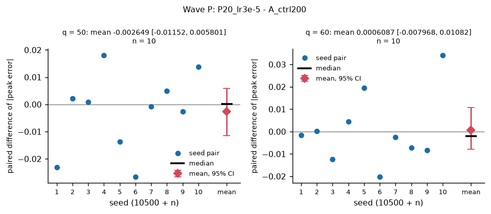
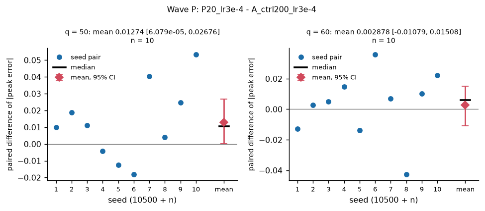
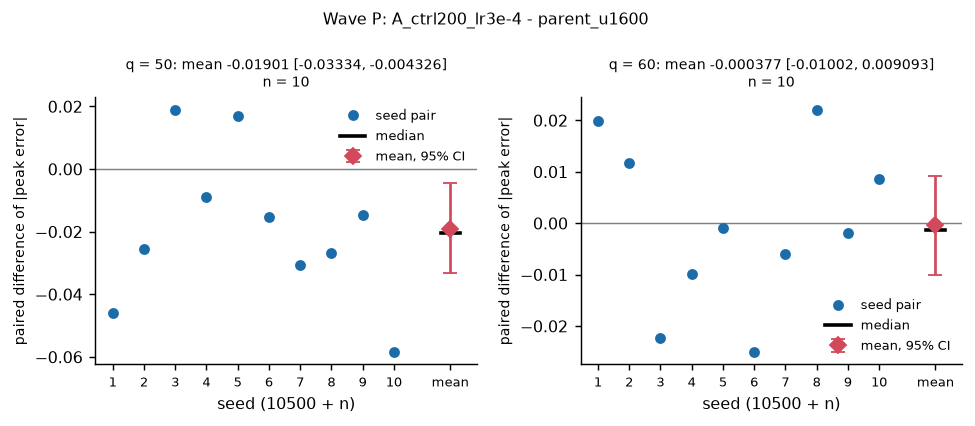
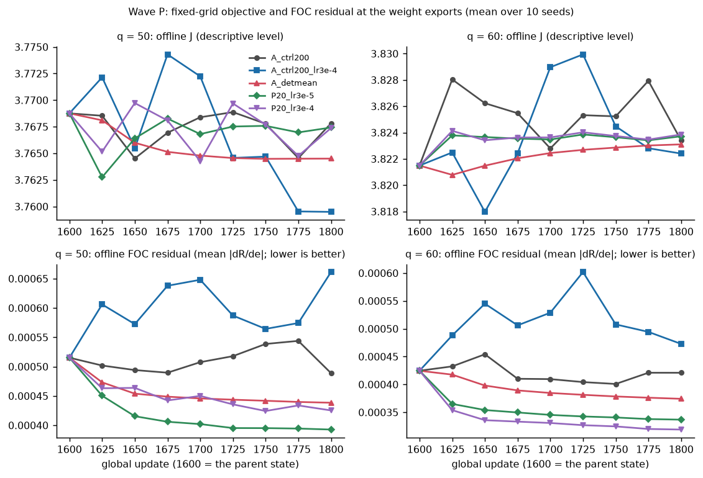
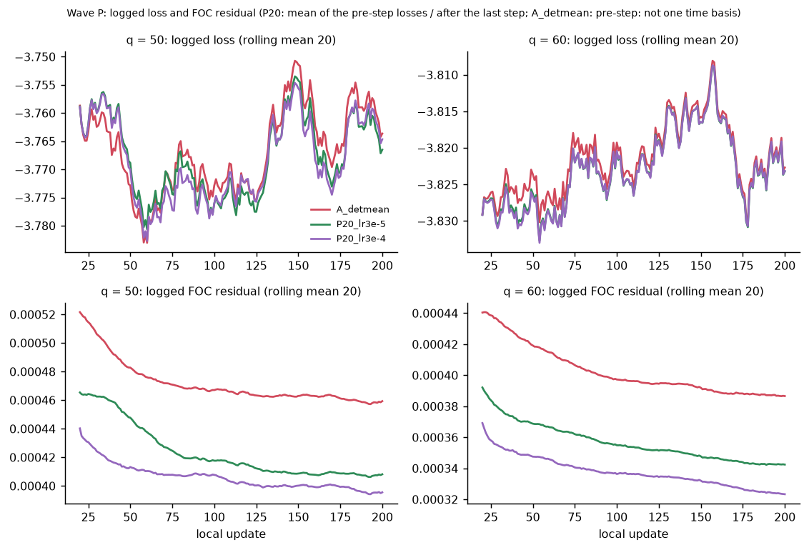

# R2b pilot wave P: pathwise terminal fine-tuning with a matched optimiser budget

Candidate: the stage-2 last iterate after the 200 updates from the `rehearsal_v1_1` end-of-A state (parent SHA-256 in `parents.csv`). Arms: `P20_lr3e-5`, `P20_lr3e-4` (phase P, E = 10 epochs x M = 256 minibatches over 512 rows = 20 exact-gradient steps per update) and the new PPO control `A_ctrl200_lr3e-4`; comparators reused from R1: `A_ctrl200` (PPO, LR 3e-5), `A_detmean` (one exact step per update, LR 3e-5) and the parent candidate. Each pathwise arm is matched to the PPO control with the same LR (`P20_lr3e-5` with `A_ctrl200`, `P20_lr3e-4` with `A_ctrl200_lr3e-4`). Mechanism 3 is model-based (ablation and diagnostic only).

Generated by `tools/v2/refine_r2b_analysis.py all`; deterministic given the same inputs. Every number is read from a CSV that is cited under its table. Roots (explicit arguments, recorded here): R2b runs `results/v2_refine_r2b`; R1 comparator runs `/home/fjiang4/tournament_experiment/.claude/worktrees/v2-t2-refine/results/v2_refine` (`parents_A` = the wave-A baseline `A_base`, `stage2/<arm>` = `A_ctrl200`, `A_detmean`); rehearsal parent candidates `/home/fjiang4/tournament_experiment/.claude/worktrees/pilot-4-stabilization-fb99a2/results/v2_T2_locked/rehearsal_v1_1` (`parent_u1600`).

## 1. Checks: provenance, completeness, method

### Provenance and completeness

| arm | source | q | planned | done | failed | incomplete | missing | not_done_seeds |
|---|---|---|---|---|---|---|---|---|
| A_ctrl200 | R1 | 50 | 10 | 10 | 0 | 0 | 0 |  |
| A_ctrl200 | R1 | 60 | 10 | 10 | 0 | 0 | 0 |  |
| A_detmean | R1 | 50 | 10 | 10 | 0 | 0 | 0 |  |
| A_detmean | R1 | 60 | 10 | 10 | 0 | 0 | 0 |  |
| P20_lr3e-5 | waveP | 50 | 10 | 10 | 0 | 0 | 0 |  |
| P20_lr3e-5 | waveP | 60 | 10 | 10 | 0 | 0 | 0 |  |
| P20_lr3e-4 | waveP | 50 | 10 | 10 | 0 | 0 | 0 |  |
| P20_lr3e-4 | waveP | 60 | 10 | 10 | 0 | 0 | 0 |  |
| A_ctrl200_lr3e-4 | waveP | 50 | 10 | 10 | 0 | 0 | 0 |  |
| A_ctrl200_lr3e-4 | waveP | 60 | 10 | 10 | 0 | 0 | 0 |  |

Source: `results/v2_refine_r2b/analysis/waveP_completeness.csv`.

Commit and dirty flag recorded in `manifest.json` of the analysed runs (all arms, both waves and the R1 comparators):

| manifest_commit | manifest_dirty | n_runs |
|---|---|---|
| 655b14c | False | 20 |
| 6e99e01 | False | 40 |
| d581b3c | False | 120 |

Source: `results/v2_refine_r2b/analysis/waveP_manifest_commits.csv`.

Launch checks (`tools/v2/r2b_launch_checks.py`, `results/v2_refine_r2b/launch_checks.json`): 120 of 120 runs pass every check (manifest dirty flag false and commit within results/ and reports/ of the code commit; config differs from the on-disk R1 comparator config in exactly the pre-registered keys; the manifest's four R2b keys equal the arm table; wave P: parent SHA-256 equals `parents.csv`); ALL = True.

Statistics (`01_preregistration.md` section 6): differences are arm - comparator, paired by (q, seed); `n_better` counts strictly improving seeds and `n_zero` exact ties; the 95% CIs are percentile bootstrap intervals of the mean and of the median of the 10 paired differences (10,000 resamples with replacement, `numpy.random.default_rng(20261004)`, one fresh generator per (q, statistic) in table order, so all intervals of the same sample size use the same resample indices); the primary metric is the absolute signed peak error at d = 0 (final tier); a run is complete iff `status.json` says done with exit code 0 and `final_v2.json` holds a final-tier evaluation.

## 2. Arms at a glance

One row per arm against its criterion comparator (pathwise arms: the PPO control with the same LR; the new control: the parent u1600 candidate); the sections of section 3 give every table of one arm.

| arm | comparator | q50 mean diff [95% CI] | q50 better/ties of 10 | q60 mean diff [95% CI] | q60 better/ties of 10 | (a) both q | (b) | q50 max\|peak\|, n<=0.05, n eta>0.004 | q60 max\|peak\|, n<=0.05, n eta>0.004 |
|---|---|---|---|---|---|---|---|---|---|
| P20_lr3e-5 | A_ctrl200 | -0.002649 [-0.01152, 0.005801] | 5/0 | 0.0006087 [-0.007968, 0.01082] | 6/0 | False | holds | 0.09316, 2, 0 | 0.07405, 2, 0 |
| P20_lr3e-4 | A_ctrl200_lr3e-4 | 0.01274 [6.079e-05, 0.02676] | 3/0 | 0.002878 [-0.01079, 0.01508] | 3/0 | False | holds | 0.08612, 2, 0 | 0.07115, 1, 0 |
| A_ctrl200_lr3e-4 | parent_u1600 | -0.01901 [-0.03334, -0.004326] | 8/0 | -0.000377 [-0.01002, 0.009093] | 6/0 | False | violated (q50/10510 [eta_2/DW 0.005501 > 0.005]) | 0.08326, 6, 2 | 0.1138, 7, 0 |

Source: `results/v2_refine_r2b/analysis/waveP_arm_index.csv`.

## 3. One section per arm

### `P20_lr3e-5`

mechanism 3: phase P, 200 updates, E=10 x minibatch 256 (20 exact-gradient steps per update), LR constant 3e-5. Non-default R2b keys: `pathwise_epochs` = `10`, `pathwise_minibatch` = `256`. LR window(s) (start, end, local first, local last): `[(3e-05, 3e-05, 1, 200)]`. Comparator of the pre-registered criterion: `A_ctrl200` (label `ablation vs matched control`).

Primary metric, paired differences arm - comparator (negative = better):

| comparison | arm | comparator | q | n | mean diff | 95% CI mean | median diff | 95% CI median | n_better | n_zero |
|---|---|---|---|---|---|---|---|---|---|---|
| ablation vs matched control | P20_lr3e-5 | A_ctrl200 | 50 | 10 | -0.002649 | [-0.01152, 0.005801] | 8.084e-05 | [-0.01365, 0.008045] | 5 | 0 |
| ablation vs matched control | P20_lr3e-5 | A_ctrl200 | 60 | 10 | 0.0006087 | [-0.007968, 0.01082] | -0.002059 | [-0.009818, 0.009837] | 6 | 0 |
| vs parent u1600 candidate | P20_lr3e-5 | parent_u1600 | 50 | 10 | -0.002963 | [-0.01304, 0.00653] | -0.001832 | [-0.01708, 0.01016] | 5 | 0 |
| vs parent u1600 candidate | P20_lr3e-5 | parent_u1600 | 60 | 10 | 0.005641 | [-0.003449, 0.01483] | 0.00732 | [-0.009972, 0.01711] | 3 | 0 |
| vs R1 A_detmean (one step per update) | P20_lr3e-5 | A_detmean | 50 | 10 | 0.00367 | [-0.001048, 0.008601] | 0.001801 | [-0.003516, 0.009903] | 4 | 0 |
| vs R1 A_detmean (one step per update) | P20_lr3e-5 | A_detmean | 60 | 10 | 0.002399 | [-0.00218, 0.006736] | 0.003998 | [-0.00421, 0.007271] | 2 | 0 |
| vs PPO control at the other LR | P20_lr3e-5 | A_ctrl200_lr3e-4 | 50 | 10 | 0.01605 | [0.004352, 0.02898] | 0.01527 | [-0.001482, 0.0314] | 2 | 0 |
| vs PPO control at the other LR | P20_lr3e-5 | A_ctrl200_lr3e-4 | 60 | 10 | 0.006018 | [-0.0076, 0.0177] | 0.009479 | [-0.009114, 0.02369] | 3 | 0 |

Source: `results/v2_refine_r2b/analysis/waveP_P20_lr3e-5_primary.csv`.

Criterion, parts (a) and (b) separately:

| arm | comparator | comparison | mean_q50 | ci_mean_lo_q50 | ci_mean_hi_q50 | a_q50 | mean_q60 | ci_mean_lo_q60 | ci_mean_hi_q60 | a_q60 | a_met | n_base_pass | b_status | b_violations | b_pending | overall |
|---|---|---|---|---|---|---|---|---|---|---|---|---|---|---|---|---|
| P20_lr3e-5 | A_ctrl200 | ablation vs matched control | -0.002649 | -0.01152 | 0.005801 | False | 0.0006087 | -0.007968 | 0.01082 | False | False | 20 | holds |  |  | not met |

Source: `results/v2_refine_r2b/analysis/waveP_P20_lr3e-5_criterion.csv`.

Tail statistics of the arm and of its criterion comparator:

| arm | q | n_complete | max_abs_peak_error | n_abs_peak_le_0.05 | n_eta_over_0.004 | n_gate_pass | mean_abs_peak_error | max_tail_mean_over_g2_0 | n_tail_mean_over_0.02 |
|---|---|---|---|---|---|---|---|---|---|
| A_ctrl200 | 50 | 10 | 0.1162 | 5 | 0 | 10 | 0.06528 | 0.01162 | 0 |
| A_ctrl200 | 60 | 10 | 0.08125 | 3 | 0 | 10 | 0.05838 | 0.01171 | 0 |
| P20_lr3e-5 | 50 | 10 | 0.09316 | 2 | 0 | 10 | 0.06263 | 0.01135 | 0 |
| P20_lr3e-5 | 60 | 10 | 0.07405 | 2 | 0 | 10 | 0.05899 | 0.01243 | 0 |

Source: `results/v2_refine_r2b/analysis/waveP_P20_lr3e-5_tail.csv`.

Other metrics against the criterion comparator:

| metric | q50 mean diff [95% CI] | q60 mean diff [95% CI] |
|---|---|---|
| signed peak error | 0.002649 [-0.005801, 0.01152] | -0.0006087 [-0.01082, 0.007968] |
| \|location-free peak error\| | -0.002281 [-0.0113, 0.006339], 5/10 better | 0.0008148 [-0.007912, 0.01108], 6/10 better |
| RMSE_pos / e2*(0) | -0.005713 [-0.00735, -0.004157], 10/10 better | -0.005004 [-0.007314, -0.003283], 10/10 better |
| tail mean / e2*(0) | 8.056e-05 [-7.518e-05, 0.0002423], 4/10 better | 0.0001745 [-8.683e-05, 0.0004687], 5/10 better |
| tail max / e2*(0) | -0.0003295 [-0.001457, 0.0009886], 8/10 better | 9.686e-05 [-0.001993, 0.001936], 4/10 better |
| eta_2 / DW (final) | -0.0003296 [-0.0006943, -3.321e-05], 6/10 better | -0.0002496 [-0.0004948, -3.598e-05], 8/10 better |
| \|dev - final\| of eta_2 (G-N part) | 0.0001011 [5.152e-05, 0.0001558], 0/10 better | -2.702e-06 [-4.501e-05, 4.51e-05], 7/10 better |
| symmetry error | -1.373 [-1.755, -1.067], 10/10 better | -1.167 [-1.561, -0.8634], 10/10 better |
| sigma_2(0) | 0.01057 [-0.0002405, 0.02122] | 0.0156 [0.01205, 0.01989] |
| smoothed-game share of the d = 0 gap | -0.01031 [-0.07652, 0.04887] | -0.08417 [-0.3101, 0.05827] |

Source: `results/v2_refine_r2b/analysis/waveP_P20_lr3e-5_metrics.csv`.

Optimisation diagnostics (median over the runs):

| wave | arm | q | n_complete | median_kl_mean | median_clip_frac_mean | median_gn_actor_mean | median_gn_actor_max | median_n_minibatch_steps_total | median_n_epochs_run_mean | median_adv_all_std_mean | median_phase_wall_sec |
|---|---|---|---|---|---|---|---|---|---|---|---|
| stage2 | P20_lr3e-5 | 50 | 10 | n/a | n/a | n/a | n/a | 4000 | n/a | n/a | 17.52 |
| stage2 | P20_lr3e-5 | 60 | 10 | n/a | n/a | n/a | n/a | 4000 | n/a | n/a | 17.57 |

Source: `results/v2_refine_r2b/analysis/waveP_P20_lr3e-5_optimisation.csv`.

Pathwise loss, FOC residual, steps and the offline objective (mean over the 10 seeds):

| arm | q | n_steps_total |
|---|---|---|
| P20_lr3e-5 | 50 | 4000 |
| P20_lr3e-5 | 60 | 4000 |

Source: `results/v2_refine_r2b/analysis/waveP_P20_lr3e-5_pathwise.csv`.

P20_lr3e-5 minus A_ctrl200: seed-level paired differences of |peak error| (negative = better) (`reports/v2/refine_r2b/figures/waveP_P20_lr3e-5_vs_A_ctrl200.png`, `reports/v2/refine_r2b/figures/waveP_P20_lr3e-5_vs_A_ctrl200.pdf`).

Notable events of this arm (computed): none.

### `P20_lr3e-4`

mechanism 3: as P20_lr3e-5 with LR constant 3e-4. Non-default R2b keys: `pathwise_epochs` = `10`, `pathwise_minibatch` = `256`. LR window(s) (start, end, local first, local last): `[(0.0003, 0.0003, 1, 200)]`. Comparator of the pre-registered criterion: `A_ctrl200_lr3e-4` (label `ablation vs matched control`).

Primary metric, paired differences arm - comparator (negative = better):

| comparison | arm | comparator | q | n | mean diff | 95% CI mean | median diff | 95% CI median | n_better | n_zero |
|---|---|---|---|---|---|---|---|---|---|---|
| ablation vs matched control | P20_lr3e-4 | A_ctrl200_lr3e-4 | 50 | 10 | 0.01274 | [6.079e-05, 0.02676] | 0.01051 | [-0.00429, 0.02957] | 3 | 0 |
| ablation vs matched control | P20_lr3e-4 | A_ctrl200_lr3e-4 | 60 | 10 | 0.002878 | [-0.01079, 0.01508] | 0.005995 | [-0.01272, 0.01628] | 3 | 0 |
| vs parent u1600 candidate | P20_lr3e-4 | parent_u1600 | 50 | 10 | -0.006268 | [-0.0185, 0.005995] | -0.005874 | [-0.02322, 0.00975] | 6 | 0 |
| vs parent u1600 candidate | P20_lr3e-4 | parent_u1600 | 60 | 10 | 0.002501 | [-0.006789, 0.01215] | 0.005985 | [-0.01454, 0.01133] | 3 | 0 |
| vs R1 A_detmean (one step per update) | P20_lr3e-4 | A_detmean | 50 | 10 | 0.0003647 | [-0.005365, 0.006962] | -0.002561 | [-0.007353, 0.008143] | 7 | 0 |
| vs R1 A_detmean (one step per update) | P20_lr3e-4 | A_detmean | 60 | 10 | -0.0007407 | [-0.006114, 0.004332] | 0.0006266 | [-0.008501, 0.006332] | 5 | 0 |
| vs PPO control at the other LR | P20_lr3e-4 | A_ctrl200 | 50 | 10 | -0.005954 | [-0.01622, 0.003551] | -0.002894 | [-0.0198, 0.008756] | 6 | 0 |
| vs PPO control at the other LR | P20_lr3e-4 | A_ctrl200 | 60 | 10 | -0.002531 | [-0.01065, 0.007935] | -0.007367 | [-0.0138, 0.005118] | 7 | 0 |

Source: `results/v2_refine_r2b/analysis/waveP_P20_lr3e-4_primary.csv`.

Criterion, parts (a) and (b) separately:

| arm | comparator | comparison | mean_q50 | ci_mean_lo_q50 | ci_mean_hi_q50 | a_q50 | mean_q60 | ci_mean_lo_q60 | ci_mean_hi_q60 | a_q60 | a_met | n_base_pass | b_status | b_violations | b_pending | overall |
|---|---|---|---|---|---|---|---|---|---|---|---|---|---|---|---|---|
| P20_lr3e-4 | A_ctrl200_lr3e-4 | ablation vs matched control | 0.01274 | 6.079e-05 | 0.02676 | False | 0.002878 | -0.01079 | 0.01508 | False | False | 19 | holds |  |  | not met |

Source: `results/v2_refine_r2b/analysis/waveP_P20_lr3e-4_criterion.csv`.

Tail statistics of the arm and of its criterion comparator:

| arm | q | n_complete | max_abs_peak_error | n_abs_peak_le_0.05 | n_eta_over_0.004 | n_gate_pass | mean_abs_peak_error | max_tail_mean_over_g2_0 | n_tail_mean_over_0.02 |
|---|---|---|---|---|---|---|---|---|---|
| P20_lr3e-4 | 50 | 10 | 0.08612 | 2 | 0 | 10 | 0.05933 | 0.0114 | 0 |
| P20_lr3e-4 | 60 | 10 | 0.07115 | 1 | 0 | 10 | 0.05585 | 0.01193 | 0 |
| A_ctrl200_lr3e-4 | 50 | 10 | 0.08326 | 6 | 2 | 9 | 0.04658 | 0.01169 | 0 |
| A_ctrl200_lr3e-4 | 60 | 10 | 0.1138 | 7 | 0 | 10 | 0.05297 | 0.01105 | 0 |

Source: `results/v2_refine_r2b/analysis/waveP_P20_lr3e-4_tail.csv`.

Other metrics against the criterion comparator:

| metric | q50 mean diff [95% CI] | q60 mean diff [95% CI] |
|---|---|---|
| signed peak error | -0.01293 [-0.02722, -6.079e-05] | -0.002878 [-0.01508, 0.01079] |
| \|location-free peak error\| | 0.01346 [0.0006353, 0.02729], 3/10 better | 0.004116 [-0.009251, 0.01617], 3/10 better |
| RMSE_pos / e2*(0) | -0.009891 [-0.01281, -0.007646], 10/10 better | -0.01171 [-0.01445, -0.009115], 10/10 better |
| tail mean / e2*(0) | -0.0002752 [-0.0006797, 5.471e-05], 6/10 better | 0.0002636 [-0.0001391, 0.0006157], 2/10 better |
| tail max / e2*(0) | -0.003524 [-0.006704, -0.0004166], 7/10 better | 0.0002243 [-0.002625, 0.002962], 4/10 better |
| eta_2 / DW (final) | -0.001605 [-0.002631, -0.0007455], 9/10 better | -0.0003991 [-0.0006808, -0.0001675], 8/10 better |
| \|dev - final\| of eta_2 (G-N part) | 0.0001122 [4.69e-05, 0.0001691], 1/10 better | 4.634e-05 [1.083e-05, 7.703e-05], 2/10 better |
| symmetry error | -1.652 [-2.359, -0.9188], 9/10 better | -1.69 [-2.258, -1.129], 10/10 better |
| sigma_2(0) | 0.1237 [0.1065, 0.1417] | 0.1192 [0.1129, 0.127] |
| smoothed-game share of the d = 0 gap | 3.019 [-0.3172, 9.474] | -0.1215 [-0.3342, 0.03392] |

Source: `results/v2_refine_r2b/analysis/waveP_P20_lr3e-4_metrics.csv`.

Optimisation diagnostics (median over the runs):

| wave | arm | q | n_complete | median_kl_mean | median_clip_frac_mean | median_gn_actor_mean | median_gn_actor_max | median_n_minibatch_steps_total | median_n_epochs_run_mean | median_adv_all_std_mean | median_phase_wall_sec |
|---|---|---|---|---|---|---|---|---|---|---|---|
| stage2 | P20_lr3e-4 | 50 | 10 | n/a | n/a | n/a | n/a | 4000 | n/a | n/a | 16.91 |
| stage2 | P20_lr3e-4 | 60 | 10 | n/a | n/a | n/a | n/a | 4000 | n/a | n/a | 15.71 |

Source: `results/v2_refine_r2b/analysis/waveP_P20_lr3e-4_optimisation.csv`.

Pathwise loss, FOC residual, steps and the offline objective (mean over the 10 seeds):

| arm | q | n_steps_total |
|---|---|---|
| P20_lr3e-4 | 50 | 4000 |
| P20_lr3e-4 | 60 | 4000 |

Source: `results/v2_refine_r2b/analysis/waveP_P20_lr3e-4_pathwise.csv`.

P20_lr3e-4 minus A_ctrl200_lr3e-4: seed-level paired differences of |peak error| (negative = better) (`reports/v2/refine_r2b/figures/waveP_P20_lr3e-4_vs_A_ctrl200_lr3e-4.png`, `reports/v2/refine_r2b/figures/waveP_P20_lr3e-4_vs_A_ctrl200_lr3e-4.pdf`).

Notable events of this arm (computed): none.

### `A_ctrl200_lr3e-4`

new control: 200 PPO updates at constant LR 3e-4 from the baseline u1600 state (locked Phase-A flags). LR window(s) (start, end, local first, local last): `[(0.0003, 0.0003, 1, 200)]`. Comparator of the pre-registered criterion: `parent_u1600` (label `vs baseline`).

Primary metric, paired differences arm - comparator (negative = better):

| comparison | arm | comparator | q | n | mean diff | 95% CI mean | median diff | 95% CI median | n_better | n_zero |
|---|---|---|---|---|---|---|---|---|---|---|
| vs baseline | A_ctrl200_lr3e-4 | parent_u1600 | 50 | 10 | -0.01901 | [-0.03334, -0.004326] | -0.02033 | [-0.03647, 0.00119] | 8 | 0 |
| vs baseline | A_ctrl200_lr3e-4 | parent_u1600 | 60 | 10 | -0.000377 | [-0.01002, 0.009093] | -0.001369 | [-0.01419, 0.01423] | 6 | 0 |
| vs R1 A_ctrl200 (LR 3e-5) | A_ctrl200_lr3e-4 | A_ctrl200 | 50 | 10 | -0.0187 | [-0.02975, -0.007172] | -0.01935 | [-0.04001, -0.005473] | 9 | 0 |
| vs R1 A_ctrl200 (LR 3e-5) | A_ctrl200_lr3e-4 | A_ctrl200 | 60 | 10 | -0.005409 | [-0.02102, 0.01005] | -0.006338 | [-0.02425, 0.01832] | 6 | 0 |

Source: `results/v2_refine_r2b/analysis/waveP_A_ctrl200_lr3e-4_primary.csv`.

Criterion, parts (a) and (b) separately:

| arm | comparator | comparison | mean_q50 | ci_mean_lo_q50 | ci_mean_hi_q50 | a_q50 | mean_q60 | ci_mean_lo_q60 | ci_mean_hi_q60 | a_q60 | a_met | n_base_pass | b_status | b_violations | b_pending | overall |
|---|---|---|---|---|---|---|---|---|---|---|---|---|---|---|---|---|
| A_ctrl200_lr3e-4 | parent_u1600 | vs baseline | -0.01901 | -0.03334 | -0.004326 | True | -0.000377 | -0.01002 | 0.009093 | False | False | 20 | violated | q50/10510 |  | not met |

Source: `results/v2_refine_r2b/analysis/waveP_A_ctrl200_lr3e-4_criterion.csv`.

Tail statistics of the arm and of its criterion comparator:

| arm | q | n_complete | max_abs_peak_error | n_abs_peak_le_0.05 | n_eta_over_0.004 | n_gate_pass | mean_abs_peak_error | max_tail_mean_over_g2_0 | n_tail_mean_over_0.02 |
|---|---|---|---|---|---|---|---|---|---|
| A_ctrl200_lr3e-4 | 50 | 10 | 0.08326 | 6 | 2 | 9 | 0.04658 | 0.01169 | 0 |
| A_ctrl200_lr3e-4 | 60 | 10 | 0.1138 | 7 | 0 | 10 | 0.05297 | 0.01105 | 0 |
| parent_u1600 | 50 | 10 | 0.1222 | 2 | 1 | 10 | 0.0656 | 0.01187 | 0 |
| parent_u1600 | 60 | 10 | 0.09174 | 5 | 0 | 10 | 0.05335 | 0.01254 | 0 |

Source: `results/v2_refine_r2b/analysis/waveP_A_ctrl200_lr3e-4_tail.csv`.

Other metrics against the criterion comparator:

| metric | q50 mean diff [95% CI] | q60 mean diff [95% CI] |
|---|---|---|
| signed peak error | 0.0192 [0.004369, 0.03375] | 0.000377 [-0.009093, 0.01002] |
| \|location-free peak error\| | -0.01962 [-0.03369, -0.005256], 8/10 better | -0.001471 [-0.01094, 0.00785], 6/10 better |
| RMSE_pos / e2*(0) | 0.003891 [0.0008056, 0.007643], 3/10 better | 0.005426 [0.003119, 0.008085], 0/10 better |
| tail mean / e2*(0) | 0.000139 [-0.0004597, 0.0009104], 7/10 better | -0.0005956 [-0.0008944, -0.0002985], 9/10 better |
| tail max / e2*(0) | 0.003025 [-0.001294, 0.008219], 4/10 better | -0.001499 [-0.004121, 0.001136], 7/10 better |
| eta_2 / DW (final) | 0.0009485 [-9.878e-05, 0.00219], 5/10 better | 0.0001169 [-0.000174, 0.0004324], 6/10 better |
| \|dev - final\| of eta_2 (G-N part) | -3.629e-05 [-9.288e-05, 2.306e-05], 6/10 better | -2.214e-05 [-6.514e-05, 1.741e-05], 5/10 better |
| symmetry error | 0.7694 [-0.1833, 1.723], 4/10 better | 0.7785 [0.1859, 1.459], 3/10 better |
| sigma_2(0) | -0.1308 [-0.1531, -0.1099] | -0.1156 [-0.1268, -0.1055] |
| smoothed-game share of the d = 0 gap | -3.049 [-9.489, 0.2883] | 0.01437 [-0.1586, 0.2239] |

Source: `results/v2_refine_r2b/analysis/waveP_A_ctrl200_lr3e-4_metrics.csv`.

Optimisation diagnostics (median over the runs):

| wave | arm | q | n_complete | median_kl_mean | median_clip_frac_mean | median_gn_actor_mean | median_gn_actor_max | median_n_minibatch_steps_total | median_n_epochs_run_mean | median_adv_all_std_mean | median_phase_wall_sec |
|---|---|---|---|---|---|---|---|---|---|---|---|
| stage2 | A_ctrl200_lr3e-4 | 50 | 10 | 0.007405 | 0.07095 | 4.521 | 20.15 | 4000 | 10 | 0.0475 | 25.13 |
| stage2 | A_ctrl200_lr3e-4 | 60 | 10 | 0.007779 | 0.0741 | 5.674 | 24.52 | 4000 | 10 | 0.04137 | 28.42 |

Source: `results/v2_refine_r2b/analysis/waveP_A_ctrl200_lr3e-4_optimisation.csv`.

A_ctrl200_lr3e-4 minus parent_u1600: seed-level paired differences of |peak error| (negative = better) (`reports/v2/refine_r2b/figures/waveP_A_ctrl200_lr3e-4_vs_parent_u1600.png`, `reports/v2/refine_r2b/figures/waveP_A_ctrl200_lr3e-4_vs_parent_u1600.pdf`).

Notable events of this arm (computed): q50/10510 fails G-A or its G-N part: eta_2/DW 0.005501 > 0.005; q50/10510 has a POSITIVE signed peak error (0.0009158): for this run the difference of |peak error| is not the negative of the difference of the signed error

## 4. Cross-arm tables

### Primary metric, every comparison

| comparison | arm | comparator | q | n | mean diff | 95% CI mean | median diff | 95% CI median | n_better | n_zero |
|---|---|---|---|---|---|---|---|---|---|---|
| ablation vs matched control | P20_lr3e-5 | A_ctrl200 | 50 | 10 | -0.002649 | [-0.01152, 0.005801] | 8.084e-05 | [-0.01365, 0.008045] | 5 | 0 |
| ablation vs matched control | P20_lr3e-5 | A_ctrl200 | 60 | 10 | 0.0006087 | [-0.007968, 0.01082] | -0.002059 | [-0.009818, 0.009837] | 6 | 0 |
| ablation vs matched control | P20_lr3e-4 | A_ctrl200_lr3e-4 | 50 | 10 | 0.01274 | [6.079e-05, 0.02676] | 0.01051 | [-0.00429, 0.02957] | 3 | 0 |
| ablation vs matched control | P20_lr3e-4 | A_ctrl200_lr3e-4 | 60 | 10 | 0.002878 | [-0.01079, 0.01508] | 0.005995 | [-0.01272, 0.01628] | 3 | 0 |
| vs baseline | A_ctrl200_lr3e-4 | parent_u1600 | 50 | 10 | -0.01901 | [-0.03334, -0.004326] | -0.02033 | [-0.03647, 0.00119] | 8 | 0 |
| vs baseline | A_ctrl200_lr3e-4 | parent_u1600 | 60 | 10 | -0.000377 | [-0.01002, 0.009093] | -0.001369 | [-0.01419, 0.01423] | 6 | 0 |
| vs parent u1600 candidate | P20_lr3e-5 | parent_u1600 | 50 | 10 | -0.002963 | [-0.01304, 0.00653] | -0.001832 | [-0.01708, 0.01016] | 5 | 0 |
| vs parent u1600 candidate | P20_lr3e-5 | parent_u1600 | 60 | 10 | 0.005641 | [-0.003449, 0.01483] | 0.00732 | [-0.009972, 0.01711] | 3 | 0 |
| vs parent u1600 candidate | P20_lr3e-4 | parent_u1600 | 50 | 10 | -0.006268 | [-0.0185, 0.005995] | -0.005874 | [-0.02322, 0.00975] | 6 | 0 |
| vs parent u1600 candidate | P20_lr3e-4 | parent_u1600 | 60 | 10 | 0.002501 | [-0.006789, 0.01215] | 0.005985 | [-0.01454, 0.01133] | 3 | 0 |
| vs parent u1600 candidate | A_ctrl200 | parent_u1600 | 50 | 10 | -0.0003145 | [-0.01025, 0.009606] | -0.0009795 | [-0.0178, 0.01568] | 6 | 0 |
| vs parent u1600 candidate | A_ctrl200 | parent_u1600 | 60 | 10 | 0.005032 | [-0.005584, 0.01434] | 0.009194 | [-0.005841, 0.0183] | 4 | 0 |
| vs parent u1600 candidate | A_detmean | parent_u1600 | 50 | 10 | -0.006633 | [-0.01486, 0.001511] | -0.004417 | [-0.0214, 0.005519] | 5 | 0 |
| vs parent u1600 candidate | A_detmean | parent_u1600 | 60 | 10 | 0.003242 | [-0.003554, 0.01061] | 0.002364 | [-0.001206, 0.008126] | 4 | 0 |
| vs R1 A_detmean (one step per update) | P20_lr3e-5 | A_detmean | 50 | 10 | 0.00367 | [-0.001048, 0.008601] | 0.001801 | [-0.003516, 0.009903] | 4 | 0 |
| vs R1 A_detmean (one step per update) | P20_lr3e-5 | A_detmean | 60 | 10 | 0.002399 | [-0.00218, 0.006736] | 0.003998 | [-0.00421, 0.007271] | 2 | 0 |
| vs R1 A_detmean (one step per update) | P20_lr3e-4 | A_detmean | 50 | 10 | 0.0003647 | [-0.005365, 0.006962] | -0.002561 | [-0.007353, 0.008143] | 7 | 0 |
| vs R1 A_detmean (one step per update) | P20_lr3e-4 | A_detmean | 60 | 10 | -0.0007407 | [-0.006114, 0.004332] | 0.0006266 | [-0.008501, 0.006332] | 5 | 0 |
| vs PPO control at the other LR | P20_lr3e-5 | A_ctrl200_lr3e-4 | 50 | 10 | 0.01605 | [0.004352, 0.02898] | 0.01527 | [-0.001482, 0.0314] | 2 | 0 |
| vs PPO control at the other LR | P20_lr3e-5 | A_ctrl200_lr3e-4 | 60 | 10 | 0.006018 | [-0.0076, 0.0177] | 0.009479 | [-0.009114, 0.02369] | 3 | 0 |
| vs PPO control at the other LR | P20_lr3e-4 | A_ctrl200 | 50 | 10 | -0.005954 | [-0.01622, 0.003551] | -0.002894 | [-0.0198, 0.008756] | 6 | 0 |
| vs PPO control at the other LR | P20_lr3e-4 | A_ctrl200 | 60 | 10 | -0.002531 | [-0.01065, 0.007935] | -0.007367 | [-0.0138, 0.005118] | 7 | 0 |
| vs R1 A_ctrl200 (LR 3e-5) | A_ctrl200_lr3e-4 | A_ctrl200 | 50 | 10 | -0.0187 | [-0.02975, -0.007172] | -0.01935 | [-0.04001, -0.005473] | 9 | 0 |
| vs R1 A_ctrl200 (LR 3e-5) | A_ctrl200_lr3e-4 | A_ctrl200 | 60 | 10 | -0.005409 | [-0.02102, 0.01005] | -0.006338 | [-0.02425, 0.01832] | 6 | 0 |

Source: `results/v2_refine_r2b/analysis/waveP_primary.csv` (`paired.csv`).

### Criterion, every arm

| arm | comparator | comparison | mean_q50 | ci_mean_lo_q50 | ci_mean_hi_q50 | a_q50 | mean_q60 | ci_mean_lo_q60 | ci_mean_hi_q60 | a_q60 | a_met | n_base_pass | b_status | b_violations | b_pending | overall |
|---|---|---|---|---|---|---|---|---|---|---|---|---|---|---|---|---|
| P20_lr3e-5 | A_ctrl200 | ablation vs matched control | -0.002649 | -0.01152 | 0.005801 | False | 0.0006087 | -0.007968 | 0.01082 | False | False | 20 | holds |  |  | not met |
| P20_lr3e-4 | A_ctrl200_lr3e-4 | ablation vs matched control | 0.01274 | 6.079e-05 | 0.02676 | False | 0.002878 | -0.01079 | 0.01508 | False | False | 19 | holds |  |  | not met |
| A_ctrl200_lr3e-4 | parent_u1600 | vs baseline | -0.01901 | -0.03334 | -0.004326 | True | -0.000377 | -0.01002 | 0.009093 | False | False | 20 | violated | q50/10510 |  | not met |

Source: `results/v2_refine_r2b/analysis/waveP_criterion.csv` (`criterion.csv`).

### Tail statistics (next to the criterion)

Per arm and q over the complete runs: the maximum of |signed peak error| over the 10 seeds, the number of runs with |peak error| <= 0.05, the number with eta_2/DW > 0.004 (the G-A margin; the G-A limit is 0.005) and the number that pass G-A with its G-N part.

| arm | q | n_complete | max_abs_peak_error | n_abs_peak_le_0.05 | n_eta_over_0.004 | n_gate_pass | mean_abs_peak_error | max_tail_mean_over_g2_0 | n_tail_mean_over_0.02 |
|---|---|---|---|---|---|---|---|---|---|
| A_ctrl200 | 50 | 10 | 0.1162 | 5 | 0 | 10 | 0.06528 | 0.01162 | 0 |
| A_ctrl200 | 60 | 10 | 0.08125 | 3 | 0 | 10 | 0.05838 | 0.01171 | 0 |
| A_detmean | 50 | 10 | 0.09601 | 4 | 0 | 10 | 0.05896 | 0.01177 | 0 |
| A_detmean | 60 | 10 | 0.07563 | 4 | 0 | 10 | 0.05659 | 0.01257 | 0 |
| P20_lr3e-5 | 50 | 10 | 0.09316 | 2 | 0 | 10 | 0.06263 | 0.01135 | 0 |
| P20_lr3e-5 | 60 | 10 | 0.07405 | 2 | 0 | 10 | 0.05899 | 0.01243 | 0 |
| P20_lr3e-4 | 50 | 10 | 0.08612 | 2 | 0 | 10 | 0.05933 | 0.0114 | 0 |
| P20_lr3e-4 | 60 | 10 | 0.07115 | 1 | 0 | 10 | 0.05585 | 0.01193 | 0 |
| A_ctrl200_lr3e-4 | 50 | 10 | 0.08326 | 6 | 2 | 9 | 0.04658 | 0.01169 | 0 |
| A_ctrl200_lr3e-4 | 60 | 10 | 0.1138 | 7 | 0 | 10 | 0.05297 | 0.01105 | 0 |
| parent_u1600 | 50 | 10 | 0.1222 | 2 | 1 | 10 | 0.0656 | 0.01187 | 0 |
| parent_u1600 | 60 | 10 | 0.09174 | 5 | 0 | 10 | 0.05335 | 0.01254 | 0 |

Source: `results/v2_refine_r2b/analysis/waveP_tail.csv`.

### Other metrics (paired)

**signed peak error** (`stage2_peak_rel_err_signed`)

| comparison | arm | comparator | q | n | mean diff | 95% CI mean | median diff | 95% CI median | n_better | n_zero |
|---|---|---|---|---|---|---|---|---|---|---|
| ablation vs matched control | P20_lr3e-5 | A_ctrl200 | 50 | 10 | 0.002649 | [-0.005801, 0.01152] | -8.084e-05 | [-0.008045, 0.01365] | n/a | 0 |
| ablation vs matched control | P20_lr3e-5 | A_ctrl200 | 60 | 10 | -0.0006087 | [-0.01082, 0.007968] | 0.002059 | [-0.009837, 0.009818] | n/a | 0 |
| ablation vs matched control | P20_lr3e-4 | A_ctrl200_lr3e-4 | 50 | 10 | -0.01293 | [-0.02722, -6.079e-05] | -0.01051 | [-0.02957, 0.00429] | n/a | 0 |
| ablation vs matched control | P20_lr3e-4 | A_ctrl200_lr3e-4 | 60 | 10 | -0.002878 | [-0.01508, 0.01079] | -0.005995 | [-0.01628, 0.01272] | n/a | 0 |
| vs baseline | A_ctrl200_lr3e-4 | parent_u1600 | 50 | 10 | 0.0192 | [0.004369, 0.03375] | 0.02033 | [-0.00119, 0.03647] | n/a | 0 |
| vs baseline | A_ctrl200_lr3e-4 | parent_u1600 | 60 | 10 | 0.000377 | [-0.009093, 0.01002] | 0.001369 | [-0.01423, 0.01419] | n/a | 0 |
| vs parent u1600 candidate | P20_lr3e-5 | parent_u1600 | 50 | 10 | 0.002963 | [-0.00653, 0.01304] | 0.001832 | [-0.01016, 0.01708] | n/a | 0 |
| vs parent u1600 candidate | P20_lr3e-5 | parent_u1600 | 60 | 10 | -0.005641 | [-0.01483, 0.003449] | -0.00732 | [-0.01711, 0.009972] | n/a | 0 |
| vs parent u1600 candidate | P20_lr3e-4 | parent_u1600 | 50 | 10 | 0.006268 | [-0.005995, 0.0185] | 0.005874 | [-0.00975, 0.02322] | n/a | 0 |
| vs parent u1600 candidate | P20_lr3e-4 | parent_u1600 | 60 | 10 | -0.002501 | [-0.01215, 0.006789] | -0.005985 | [-0.01133, 0.01454] | n/a | 0 |
| vs parent u1600 candidate | A_ctrl200 | parent_u1600 | 50 | 10 | 0.0003145 | [-0.009606, 0.01025] | 0.0009795 | [-0.01568, 0.0178] | n/a | 0 |
| vs parent u1600 candidate | A_ctrl200 | parent_u1600 | 60 | 10 | -0.005032 | [-0.01434, 0.005584] | -0.009194 | [-0.0183, 0.005841] | n/a | 0 |
| vs parent u1600 candidate | A_detmean | parent_u1600 | 50 | 10 | 0.006633 | [-0.001511, 0.01486] | 0.004417 | [-0.005519, 0.0214] | n/a | 0 |
| vs parent u1600 candidate | A_detmean | parent_u1600 | 60 | 10 | -0.003242 | [-0.01061, 0.003554] | -0.002364 | [-0.008126, 0.001206] | n/a | 0 |
| vs R1 A_detmean (one step per update) | P20_lr3e-5 | A_detmean | 50 | 10 | -0.00367 | [-0.008601, 0.001048] | -0.001801 | [-0.009903, 0.003516] | n/a | 0 |
| vs R1 A_detmean (one step per update) | P20_lr3e-5 | A_detmean | 60 | 10 | -0.002399 | [-0.006736, 0.00218] | -0.003998 | [-0.007271, 0.00421] | n/a | 0 |
| vs R1 A_detmean (one step per update) | P20_lr3e-4 | A_detmean | 50 | 10 | -0.0003647 | [-0.006962, 0.005365] | 0.002561 | [-0.008143, 0.007353] | n/a | 0 |
| vs R1 A_detmean (one step per update) | P20_lr3e-4 | A_detmean | 60 | 10 | 0.0007407 | [-0.004332, 0.006114] | -0.0006266 | [-0.006332, 0.008501] | n/a | 0 |
| vs PPO control at the other LR | P20_lr3e-5 | A_ctrl200_lr3e-4 | 50 | 10 | -0.01623 | [-0.02953, -0.004352] | -0.01527 | [-0.0314, 0.001482] | n/a | 0 |
| vs PPO control at the other LR | P20_lr3e-5 | A_ctrl200_lr3e-4 | 60 | 10 | -0.006018 | [-0.0177, 0.0076] | -0.009479 | [-0.02369, 0.009114] | n/a | 0 |
| vs PPO control at the other LR | P20_lr3e-4 | A_ctrl200 | 50 | 10 | 0.005954 | [-0.003551, 0.01622] | 0.002894 | [-0.008756, 0.0198] | n/a | 0 |
| vs PPO control at the other LR | P20_lr3e-4 | A_ctrl200 | 60 | 10 | 0.002531 | [-0.007935, 0.01065] | 0.007367 | [-0.005118, 0.0138] | n/a | 0 |
| vs R1 A_ctrl200 (LR 3e-5) | A_ctrl200_lr3e-4 | A_ctrl200 | 50 | 10 | 0.01888 | [0.007267, 0.0301] | 0.01935 | [0.005473, 0.04001] | n/a | 0 |
| vs R1 A_ctrl200 (LR 3e-5) | A_ctrl200_lr3e-4 | A_ctrl200 | 60 | 10 | 0.005409 | [-0.01005, 0.02102] | 0.006338 | [-0.01832, 0.02425] | n/a | 0 |

Source: `results/v2_refine_r2b/analysis/waveP_metric_stage2_peak_rel_err_signed.csv`.

**|location-free peak error|** (`stage2_peak_locfree_rel_err_abs`)

| comparison | arm | comparator | q | n | mean diff | 95% CI mean | median diff | 95% CI median | n_better | n_zero |
|---|---|---|---|---|---|---|---|---|---|---|
| ablation vs matched control | P20_lr3e-5 | A_ctrl200 | 50 | 10 | -0.002281 | [-0.0113, 0.006339] | 0.0009709 | [-0.01345, 0.008345] | 5 | 0 |
| ablation vs matched control | P20_lr3e-5 | A_ctrl200 | 60 | 10 | 0.0008148 | [-0.007912, 0.01108] | -0.001347 | [-0.01013, 0.01026] | 6 | 0 |
| ablation vs matched control | P20_lr3e-4 | A_ctrl200_lr3e-4 | 50 | 10 | 0.01346 | [0.0006353, 0.02729] | 0.0123 | [-0.004235, 0.03012] | 3 | 0 |
| ablation vs matched control | P20_lr3e-4 | A_ctrl200_lr3e-4 | 60 | 10 | 0.004116 | [-0.009251, 0.01617] | 0.007578 | [-0.01266, 0.0182] | 3 | 0 |
| vs baseline | A_ctrl200_lr3e-4 | parent_u1600 | 50 | 10 | -0.01962 | [-0.03369, -0.005256] | -0.02106 | [-0.03755, 0.0002179] | 8 | 0 |
| vs baseline | A_ctrl200_lr3e-4 | parent_u1600 | 60 | 10 | -0.001471 | [-0.01094, 0.00785] | -0.0018 | [-0.01605, 0.01231] | 6 | 0 |
| vs parent u1600 candidate | P20_lr3e-5 | parent_u1600 | 50 | 10 | -0.002659 | [-0.0129, 0.00709] | -0.001501 | [-0.01701, 0.01119] | 5 | 0 |
| vs parent u1600 candidate | P20_lr3e-5 | parent_u1600 | 60 | 10 | 0.005761 | [-0.003353, 0.01501] | 0.007641 | [-0.009854, 0.01751] | 3 | 0 |
| vs parent u1600 candidate | P20_lr3e-4 | parent_u1600 | 50 | 10 | -0.006159 | [-0.01863, 0.006346] | -0.005457 | [-0.02321, 0.009917] | 6 | 0 |
| vs parent u1600 candidate | P20_lr3e-4 | parent_u1600 | 60 | 10 | 0.002645 | [-0.006785, 0.01239] | 0.006023 | [-0.01443, 0.01174] | 3 | 0 |
| vs parent u1600 candidate | A_ctrl200 | parent_u1600 | 50 | 10 | -0.0003785 | [-0.01044, 0.009579] | -0.0005477 | [-0.01821, 0.0151] | 5 | 0 |
| vs parent u1600 candidate | A_ctrl200 | parent_u1600 | 60 | 10 | 0.004946 | [-0.005589, 0.01434] | 0.008258 | [-0.005684, 0.01848] | 4 | 0 |
| vs parent u1600 candidate | A_detmean | parent_u1600 | 50 | 10 | -0.006565 | [-0.01483, 0.001599] | -0.004121 | [-0.02138, 0.00551] | 5 | 0 |
| vs parent u1600 candidate | A_detmean | parent_u1600 | 60 | 10 | 0.003271 | [-0.003526, 0.01061] | 0.002386 | [-0.001291, 0.008167] | 4 | 0 |
| vs R1 A_detmean (one step per update) | P20_lr3e-5 | A_detmean | 50 | 10 | 0.003906 | [-0.0009649, 0.008988] | 0.002146 | [-0.003505, 0.01021] | 4 | 0 |
| vs R1 A_detmean (one step per update) | P20_lr3e-5 | A_detmean | 60 | 10 | 0.00249 | [-0.002181, 0.00689] | 0.004285 | [-0.004077, 0.007451] | 3 | 0 |
| vs R1 A_detmean (one step per update) | P20_lr3e-4 | A_detmean | 50 | 10 | 0.0004063 | [-0.005535, 0.007236] | -0.002689 | [-0.007364, 0.008177] | 7 | 0 |
| vs R1 A_detmean (one step per update) | P20_lr3e-4 | A_detmean | 60 | 10 | -0.0006259 | [-0.006181, 0.004579] | 0.0007462 | [-0.008646, 0.00672] | 5 | 0 |
| vs PPO control at the other LR | P20_lr3e-5 | A_ctrl200_lr3e-4 | 50 | 10 | 0.01696 | [0.00541, 0.02965] | 0.01635 | [0.001007, 0.03129] | 2 | 0 |
| vs PPO control at the other LR | P20_lr3e-5 | A_ctrl200_lr3e-4 | 60 | 10 | 0.007231 | [-0.005946, 0.0188] | 0.01104 | [-0.00913, 0.02509] | 3 | 0 |
| vs PPO control at the other LR | P20_lr3e-4 | A_ctrl200 | 50 | 10 | -0.005781 | [-0.01641, 0.004116] | -0.003025 | [-0.01971, 0.01038] | 6 | 0 |
| vs PPO control at the other LR | P20_lr3e-4 | A_ctrl200 | 60 | 10 | -0.002301 | [-0.01064, 0.008299] | -0.006856 | [-0.01378, 0.005192] | 7 | 0 |
| vs R1 A_ctrl200 (LR 3e-5) | A_ctrl200_lr3e-4 | A_ctrl200 | 50 | 10 | -0.01924 | [-0.02989, -0.007711] | -0.01984 | [-0.03997, -0.007234] | 9 | 0 |
| vs R1 A_ctrl200 (LR 3e-5) | A_ctrl200_lr3e-4 | A_ctrl200 | 60 | 10 | -0.006416 | [-0.02188, 0.008812] | -0.006107 | [-0.02592, 0.01833] | 5 | 0 |

Source: `results/v2_refine_r2b/analysis/waveP_metric_stage2_peak_locfree_rel_err_abs.csv`.

**RMSE_pos / e2*(0)** (`stage2_rmse_pos_over_g2_0`)

| comparison | arm | comparator | q | n | mean diff | 95% CI mean | median diff | 95% CI median | n_better | n_zero |
|---|---|---|---|---|---|---|---|---|---|---|
| ablation vs matched control | P20_lr3e-5 | A_ctrl200 | 50 | 10 | -0.005713 | [-0.00735, -0.004157] | -0.004867 | [-0.008239, -0.003594] | 10 | 0 |
| ablation vs matched control | P20_lr3e-5 | A_ctrl200 | 60 | 10 | -0.005004 | [-0.007314, -0.003283] | -0.003693 | [-0.006325, -0.002566] | 10 | 0 |
| ablation vs matched control | P20_lr3e-4 | A_ctrl200_lr3e-4 | 50 | 10 | -0.009891 | [-0.01281, -0.007646] | -0.008456 | [-0.01209, -0.007083] | 10 | 0 |
| ablation vs matched control | P20_lr3e-4 | A_ctrl200_lr3e-4 | 60 | 10 | -0.01171 | [-0.01445, -0.009115] | -0.01165 | [-0.01511, -0.00781] | 10 | 0 |
| vs baseline | A_ctrl200_lr3e-4 | parent_u1600 | 50 | 10 | 0.003891 | [0.0008056, 0.007643] | 0.004354 | [-0.0007226, 0.006111] | 3 | 0 |
| vs baseline | A_ctrl200_lr3e-4 | parent_u1600 | 60 | 10 | 0.005426 | [0.003119, 0.008085] | 0.004522 | [0.002638, 0.007765] | 0 | 0 |
| vs parent u1600 candidate | P20_lr3e-5 | parent_u1600 | 50 | 10 | -0.007027 | [-0.009312, -0.00483] | -0.006877 | [-0.01053, -0.003836] | 10 | 0 |
| vs parent u1600 candidate | P20_lr3e-5 | parent_u1600 | 60 | 10 | -0.005347 | [-0.00761, -0.003263] | -0.005125 | [-0.008079, -0.001646] | 10 | 0 |
| vs parent u1600 candidate | P20_lr3e-4 | parent_u1600 | 50 | 10 | -0.005999 | [-0.007698, -0.004363] | -0.005889 | [-0.008422, -0.003078] | 10 | 0 |
| vs parent u1600 candidate | P20_lr3e-4 | parent_u1600 | 60 | 10 | -0.006285 | [-0.008543, -0.004184] | -0.005906 | [-0.00911, -0.002768] | 10 | 0 |
| vs parent u1600 candidate | A_ctrl200 | parent_u1600 | 50 | 10 | -0.001313 | [-0.004194, 0.001632] | -0.001191 | [-0.004647, 0.002323] | 6 | 0 |
| vs parent u1600 candidate | A_ctrl200 | parent_u1600 | 60 | 10 | -0.0003431 | [-0.00232, 0.001698] | -0.0004978 | [-0.003086, 0.002312] | 5 | 0 |
| vs parent u1600 candidate | A_detmean | parent_u1600 | 50 | 10 | -0.003272 | [-0.006488, -0.0004422] | -0.001025 | [-0.007894, 0.0008883] | 7 | 0 |
| vs parent u1600 candidate | A_detmean | parent_u1600 | 60 | 10 | -0.002684 | [-0.004898, -0.001029] | -0.001108 | [-0.004121, -0.0004916] | 10 | 0 |
| vs R1 A_detmean (one step per update) | P20_lr3e-5 | A_detmean | 50 | 10 | -0.003755 | [-0.005573, -0.002241] | -0.003452 | [-0.00464, -0.00188] | 10 | 0 |
| vs R1 A_detmean (one step per update) | P20_lr3e-5 | A_detmean | 60 | 10 | -0.002663 | [-0.004017, -0.00141] | -0.001589 | [-0.005079, -0.00084] | 10 | 0 |
| vs R1 A_detmean (one step per update) | P20_lr3e-4 | A_detmean | 50 | 10 | -0.002727 | [-0.004879, -0.000397] | -0.004126 | [-0.005544, 0.001325] | 7 | 0 |
| vs R1 A_detmean (one step per update) | P20_lr3e-4 | A_detmean | 60 | 10 | -0.003601 | [-0.005057, -0.002237] | -0.002629 | [-0.006266, -0.001659] | 10 | 0 |
| vs PPO control at the other LR | P20_lr3e-5 | A_ctrl200_lr3e-4 | 50 | 10 | -0.01092 | [-0.01346, -0.008691] | -0.01009 | [-0.01344, -0.007848] | 10 | 0 |
| vs PPO control at the other LR | P20_lr3e-5 | A_ctrl200_lr3e-4 | 60 | 10 | -0.01077 | [-0.01363, -0.008099] | -0.01089 | [-0.01406, -0.006489] | 10 | 0 |
| vs PPO control at the other LR | P20_lr3e-4 | A_ctrl200 | 50 | 10 | -0.004686 | [-0.007199, -0.002123] | -0.00589 | [-0.009046, -0.001211] | 8 | 0 |
| vs PPO control at the other LR | P20_lr3e-4 | A_ctrl200 | 60 | 10 | -0.005942 | [-0.008215, -0.004205] | -0.004774 | [-0.007677, -0.003334] | 10 | 0 |
| vs R1 A_ctrl200 (LR 3e-5) | A_ctrl200_lr3e-4 | A_ctrl200 | 50 | 10 | 0.005205 | [0.002336, 0.007757] | 0.006579 | [0.0008996, 0.008734] | 2 | 0 |
| vs R1 A_ctrl200 (LR 3e-5) | A_ctrl200_lr3e-4 | A_ctrl200 | 60 | 10 | 0.005769 | [0.003592, 0.008577] | 0.005039 | [0.002839, 0.006959] | 0 | 0 |

Source: `results/v2_refine_r2b/analysis/waveP_metric_stage2_rmse_pos_over_g2_0.csv`.

**tail mean / e2*(0)** (`stage2_tail_mean_over_g2_0`)

| comparison | arm | comparator | q | n | mean diff | 95% CI mean | median diff | 95% CI median | n_better | n_zero |
|---|---|---|---|---|---|---|---|---|---|---|
| ablation vs matched control | P20_lr3e-5 | A_ctrl200 | 50 | 10 | 8.056e-05 | [-7.518e-05, 0.0002423] | 7.881e-05 | [-0.000173, 0.0003031] | 4 | 0 |
| ablation vs matched control | P20_lr3e-5 | A_ctrl200 | 60 | 10 | 0.0001745 | [-8.683e-05, 0.0004687] | 7.071e-05 | [-0.0001845, 0.0005338] | 5 | 0 |
| ablation vs matched control | P20_lr3e-4 | A_ctrl200_lr3e-4 | 50 | 10 | -0.0002752 | [-0.0006797, 5.471e-05] | -0.0002511 | [-0.0006364, 0.0002729] | 6 | 0 |
| ablation vs matched control | P20_lr3e-4 | A_ctrl200_lr3e-4 | 60 | 10 | 0.0002636 | [-0.0001391, 0.0006157] | 0.0003249 | [-0.0001366, 0.0007253] | 2 | 0 |
| vs baseline | A_ctrl200_lr3e-4 | parent_u1600 | 50 | 10 | 0.000139 | [-0.0004597, 0.0009104] | -0.0001252 | [-0.0005651, 0.0005308] | 7 | 0 |
| vs baseline | A_ctrl200_lr3e-4 | parent_u1600 | 60 | 10 | -0.0005956 | [-0.0008944, -0.0002985] | -0.0007079 | [-0.0008894, -0.0001895] | 9 | 0 |
| vs parent u1600 candidate | P20_lr3e-5 | parent_u1600 | 50 | 10 | -1.801e-05 | [-0.0002852, 0.0003242] | -0.0001659 | [-0.0003797, 0.0001935] | 7 | 0 |
| vs parent u1600 candidate | P20_lr3e-5 | parent_u1600 | 60 | 10 | 1.131e-05 | [-0.0001491, 0.0001776] | 2.844e-06 | [-0.000228, 0.0002085] | 5 | 0 |
| vs parent u1600 candidate | P20_lr3e-4 | parent_u1600 | 50 | 10 | -0.0001362 | [-0.0006557, 0.0005733] | -0.0005064 | [-0.0007951, 0.0002575] | 7 | 0 |
| vs parent u1600 candidate | P20_lr3e-4 | parent_u1600 | 60 | 10 | -0.000332 | [-0.0005472, -0.0001087] | -0.0003492 | [-0.0006575, -6.386e-05] | 9 | 0 |
| vs parent u1600 candidate | A_ctrl200 | parent_u1600 | 50 | 10 | -9.857e-05 | [-0.0003141, 0.0001353] | -0.0001819 | [-0.0002773, 0.000129] | 8 | 0 |
| vs parent u1600 candidate | A_ctrl200 | parent_u1600 | 60 | 10 | -0.0001631 | [-0.00042, 9.272e-05] | -0.0001041 | [-0.0005578, 0.0002432] | 5 | 0 |
| vs parent u1600 candidate | A_detmean | parent_u1600 | 50 | 10 | 0.0001094 | [-3.398e-05, 0.0002525] | 0.0001065 | [-0.0001064, 0.000362] | 5 | 0 |
| vs parent u1600 candidate | A_detmean | parent_u1600 | 60 | 10 | -5.685e-05 | [-0.0001917, 7.758e-05] | -4.962e-05 | [-0.0001591, 1.701e-05] | 7 | 0 |
| vs R1 A_detmean (one step per update) | P20_lr3e-5 | A_detmean | 50 | 10 | -0.0001274 | [-0.0004129, 0.0001743] | 4.003e-06 | [-0.0004971, 0.0001309] | 5 | 0 |
| vs R1 A_detmean (one step per update) | P20_lr3e-5 | A_detmean | 60 | 10 | 6.815e-05 | [-4.829e-05, 0.0001778] | 9.392e-05 | [-4.986e-05, 0.0001573] | 2 | 0 |
| vs R1 A_detmean (one step per update) | P20_lr3e-4 | A_detmean | 50 | 10 | -0.0002456 | [-0.0007534, 0.0004109] | -0.0004892 | [-0.0008828, 0.000168] | 7 | 0 |
| vs R1 A_detmean (one step per update) | P20_lr3e-4 | A_detmean | 60 | 10 | -0.0002752 | [-0.0004499, -0.0001042] | -0.000265 | [-0.0006327, -1.932e-05] | 8 | 0 |
| vs PPO control at the other LR | P20_lr3e-5 | A_ctrl200_lr3e-4 | 50 | 10 | -0.000157 | [-0.0006519, 0.0002566] | 0.0001317 | [-0.0007013, 0.0003571] | 4 | 0 |
| vs PPO control at the other LR | P20_lr3e-5 | A_ctrl200_lr3e-4 | 60 | 10 | 0.0006069 | [0.0002043, 0.0009666] | 0.0008476 | [5.175e-05, 0.001133] | 2 | 0 |
| vs PPO control at the other LR | P20_lr3e-4 | A_ctrl200 | 50 | 10 | -3.766e-05 | [-0.0004246, 0.0004753] | -0.0002115 | [-0.0006098, 0.000264] | 7 | 0 |
| vs PPO control at the other LR | P20_lr3e-4 | A_ctrl200 | 60 | 10 | -0.0001689 | [-0.0004977, 0.0001874] | -0.000206 | [-0.0006112, 0.0002269] | 7 | 0 |
| vs R1 A_ctrl200 (LR 3e-5) | A_ctrl200_lr3e-4 | A_ctrl200 | 50 | 10 | 0.0002376 | [-0.00024, 0.0008455] | 3.182e-05 | [-0.0004016, 0.0007991] | 5 | 0 |
| vs R1 A_ctrl200 (LR 3e-5) | A_ctrl200_lr3e-4 | A_ctrl200 | 60 | 10 | -0.0004324 | [-0.0007903, -6.115e-05] | -0.0004986 | [-0.0009978, 0.0001989] | 7 | 0 |

Source: `results/v2_refine_r2b/analysis/waveP_metric_stage2_tail_mean_over_g2_0.csv`.

**tail max / e2*(0)** (`stage2_tail_max_over_g2_0`)

| comparison | arm | comparator | q | n | mean diff | 95% CI mean | median diff | 95% CI median | n_better | n_zero |
|---|---|---|---|---|---|---|---|---|---|---|
| ablation vs matched control | P20_lr3e-5 | A_ctrl200 | 50 | 10 | -0.0003295 | [-0.001457, 0.0009886] | -0.000438 | [-0.001151, 0.0002913] | 8 | 0 |
| ablation vs matched control | P20_lr3e-5 | A_ctrl200 | 60 | 10 | 9.686e-05 | [-0.001993, 0.001936] | 0.001079 | [-0.002629, 0.002407] | 4 | 0 |
| ablation vs matched control | P20_lr3e-4 | A_ctrl200_lr3e-4 | 50 | 10 | -0.003524 | [-0.006704, -0.0004166] | -0.004119 | [-0.007889, 0.0006988] | 7 | 0 |
| ablation vs matched control | P20_lr3e-4 | A_ctrl200_lr3e-4 | 60 | 10 | 0.0002243 | [-0.002625, 0.002962] | 0.000316 | [-0.003357, 0.003549] | 4 | 0 |
| vs baseline | A_ctrl200_lr3e-4 | parent_u1600 | 50 | 10 | 0.003025 | [-0.001294, 0.008219] | 0.001518 | [-0.002635, 0.00668] | 4 | 0 |
| vs baseline | A_ctrl200_lr3e-4 | parent_u1600 | 60 | 10 | -0.001499 | [-0.004121, 0.001136] | -0.00191 | [-0.004437, 0.001533] | 7 | 0 |
| vs parent u1600 candidate | P20_lr3e-5 | parent_u1600 | 50 | 10 | -0.0007445 | [-0.002832, 0.001351] | -0.000396 | [-0.00449, 0.002377] | 7 | 0 |
| vs parent u1600 candidate | P20_lr3e-5 | parent_u1600 | 60 | 10 | -0.0001162 | [-0.001098, 0.0008326] | -0.0004209 | [-0.001257, 0.001536] | 6 | 0 |
| vs parent u1600 candidate | P20_lr3e-4 | parent_u1600 | 50 | 10 | -0.0004995 | [-0.003465, 0.002865] | -0.002876 | [-0.004188, 0.003721] | 6 | 0 |
| vs parent u1600 candidate | P20_lr3e-4 | parent_u1600 | 60 | 10 | -0.001275 | [-0.002347, -0.0002859] | -0.0007891 | [-0.002942, 0.000188] | 6 | 0 |
| vs parent u1600 candidate | A_ctrl200 | parent_u1600 | 50 | 10 | -0.000415 | [-0.002566, 0.001614] | 7.267e-05 | [-0.00389, 0.002901] | 5 | 0 |
| vs parent u1600 candidate | A_ctrl200 | parent_u1600 | 60 | 10 | -0.0002131 | [-0.002302, 0.001937] | -0.001117 | [-0.003323, 0.003734] | 6 | 0 |
| vs parent u1600 candidate | A_detmean | parent_u1600 | 50 | 10 | 0.0002974 | [-0.000636, 0.001198] | 0.0002008 | [-0.0008568, 0.001754] | 5 | 0 |
| vs parent u1600 candidate | A_detmean | parent_u1600 | 60 | 10 | -0.0004355 | [-0.001072, 0.0002037] | -0.0005094 | [-0.0009889, 0.0002514] | 8 | 0 |
| vs R1 A_detmean (one step per update) | P20_lr3e-5 | A_detmean | 50 | 10 | -0.001042 | [-0.002891, 0.0006837] | -0.001158 | [-0.003718, 0.001755] | 6 | 0 |
| vs R1 A_detmean (one step per update) | P20_lr3e-5 | A_detmean | 60 | 10 | 0.0003193 | [-0.0005189, 0.00115] | 0.0001163 | [-0.0008786, 0.001889] | 5 | 0 |
| vs R1 A_detmean (one step per update) | P20_lr3e-4 | A_detmean | 50 | 10 | -0.000797 | [-0.003302, 0.002071] | -0.001946 | [-0.004324, 0.002792] | 6 | 0 |
| vs R1 A_detmean (one step per update) | P20_lr3e-4 | A_detmean | 60 | 10 | -0.0008396 | [-0.001785, 3.891e-05] | -0.0003528 | [-0.002197, 0.0006466] | 6 | 0 |
| vs PPO control at the other LR | P20_lr3e-5 | A_ctrl200_lr3e-4 | 50 | 10 | -0.003769 | [-0.007926, -0.0005001] | -0.001867 | [-0.007068, 0.0008256] | 8 | 0 |
| vs PPO control at the other LR | P20_lr3e-5 | A_ctrl200_lr3e-4 | 60 | 10 | 0.001383 | [-0.001434, 0.004009] | 0.001761 | [-0.002141, 0.004682] | 4 | 0 |
| vs PPO control at the other LR | P20_lr3e-4 | A_ctrl200 | 50 | 10 | -8.45e-05 | [-0.002079, 0.002054] | -0.0002514 | [-0.002986, 0.002367] | 6 | 0 |
| vs PPO control at the other LR | P20_lr3e-4 | A_ctrl200 | 60 | 10 | -0.001062 | [-0.003262, 0.0009009] | 2.732e-05 | [-0.003762, 0.001683] | 5 | 0 |
| vs R1 A_ctrl200 (LR 3e-5) | A_ctrl200_lr3e-4 | A_ctrl200 | 50 | 10 | 0.00344 | [-0.0001896, 0.008135] | 0.0009685 | [-0.001138, 0.007635] | 2 | 0 |
| vs R1 A_ctrl200 (LR 3e-5) | A_ctrl200_lr3e-4 | A_ctrl200 | 60 | 10 | -0.001286 | [-0.005411, 0.002741] | 8.391e-05 | [-0.006296, 0.00355] | 5 | 0 |

Source: `results/v2_refine_r2b/analysis/waveP_metric_stage2_tail_max_over_g2_0.csv`.

**eta_2 / DW (final)** (`eta_T_over_dw`)

| comparison | arm | comparator | q | n | mean diff | 95% CI mean | median diff | 95% CI median | n_better | n_zero |
|---|---|---|---|---|---|---|---|---|---|---|
| ablation vs matched control | P20_lr3e-5 | A_ctrl200 | 50 | 10 | -0.0003296 | [-0.0006943, -3.321e-05] | -0.0001043 | [-0.0007115, 5.013e-05] | 6 | 0 |
| ablation vs matched control | P20_lr3e-5 | A_ctrl200 | 60 | 10 | -0.0002496 | [-0.0004948, -3.598e-05] | -0.0002234 | [-0.0004508, 1.611e-05] | 8 | 0 |
| ablation vs matched control | P20_lr3e-4 | A_ctrl200_lr3e-4 | 50 | 10 | -0.001605 | [-0.002631, -0.0007455] | -0.001475 | [-0.002711, -0.0001577] | 9 | 0 |
| ablation vs matched control | P20_lr3e-4 | A_ctrl200_lr3e-4 | 60 | 10 | -0.0003991 | [-0.0006808, -0.0001675] | -0.0003491 | [-0.0006448, -0.0001392] | 8 | 0 |
| vs baseline | A_ctrl200_lr3e-4 | parent_u1600 | 50 | 10 | 0.0009485 | [-9.878e-05, 0.00219] | 0.0004114 | [-0.0004913, 0.002614] | 5 | 0 |
| vs baseline | A_ctrl200_lr3e-4 | parent_u1600 | 60 | 10 | 0.0001169 | [-0.000174, 0.0004324] | -1.818e-05 | [-0.0002673, 0.0004667] | 6 | 0 |
| vs parent u1600 candidate | P20_lr3e-5 | parent_u1600 | 50 | 10 | -0.0005397 | [-0.000948, -0.0001676] | -0.0003389 | [-0.001198, 5.717e-05] | 7 | 0 |
| vs parent u1600 candidate | P20_lr3e-5 | parent_u1600 | 60 | 10 | -0.0002015 | [-0.0004208, -3.382e-06] | -0.0001553 | [-0.0004251, 7.933e-05] | 6 | 0 |
| vs parent u1600 candidate | P20_lr3e-4 | parent_u1600 | 50 | 10 | -0.0006569 | [-0.001121, -0.0002676] | -0.0005555 | [-0.001094, -9.054e-05] | 9 | 0 |
| vs parent u1600 candidate | P20_lr3e-4 | parent_u1600 | 60 | 10 | -0.0002822 | [-0.0004982, -7.947e-05] | -0.0002966 | [-0.0005295, 3.727e-05] | 7 | 0 |
| vs parent u1600 candidate | A_ctrl200 | parent_u1600 | 50 | 10 | -0.0002101 | [-0.0005209, 8.167e-05] | -7.869e-05 | [-0.0005606, 6.261e-05] | 7 | 0 |
| vs parent u1600 candidate | A_ctrl200 | parent_u1600 | 60 | 10 | 4.813e-05 | [-0.0001714, 0.0002397] | 0.0001228 | [-0.0001829, 0.0002928] | 4 | 0 |
| vs parent u1600 candidate | A_detmean | parent_u1600 | 50 | 10 | -0.0004175 | [-0.0008436, 1.962e-05] | -0.00043 | [-0.00089, 2.507e-06] | 7 | 0 |
| vs parent u1600 candidate | A_detmean | parent_u1600 | 60 | 10 | -0.0002158 | [-0.0004385, -4.43e-05] | -0.0001212 | [-0.0003959, 8.174e-06] | 7 | 0 |
| vs R1 A_detmean (one step per update) | P20_lr3e-5 | A_detmean | 50 | 10 | -0.0001222 | [-0.0003188, 4.257e-05] | -0.0001134 | [-0.0002908, 0.0001295] | 6 | 0 |
| vs R1 A_detmean (one step per update) | P20_lr3e-5 | A_detmean | 60 | 10 | 1.433e-05 | [-9.853e-05, 0.0001228] | 1.904e-05 | [-0.0001452, 0.0001648] | 5 | 0 |
| vs R1 A_detmean (one step per update) | P20_lr3e-4 | A_detmean | 50 | 10 | -0.0002394 | [-0.0003995, -0.0001055] | -0.0001654 | [-0.0003776, -4.652e-05] | 10 | 0 |
| vs R1 A_detmean (one step per update) | P20_lr3e-4 | A_detmean | 60 | 10 | -6.633e-05 | [-0.0001865, 3.941e-05] | -2.314e-05 | [-0.000222, 9.43e-05] | 6 | 0 |
| vs PPO control at the other LR | P20_lr3e-5 | A_ctrl200_lr3e-4 | 50 | 10 | -0.001488 | [-0.002556, -0.000616] | -0.001203 | [-0.002563, -0.000148] | 8 | 0 |
| vs PPO control at the other LR | P20_lr3e-5 | A_ctrl200_lr3e-4 | 60 | 10 | -0.0003184 | [-0.0006308, -4.877e-05] | -0.0002314 | [-0.0006568, 4.813e-05] | 8 | 0 |
| vs PPO control at the other LR | P20_lr3e-4 | A_ctrl200 | 50 | 10 | -0.0004468 | [-0.0008903, -7.564e-05] | -0.0001789 | [-0.000872, -2.582e-05] | 8 | 0 |
| vs PPO control at the other LR | P20_lr3e-4 | A_ctrl200 | 60 | 10 | -0.0003303 | [-0.0005393, -0.0001491] | -0.0003255 | [-0.0004403, -0.0001359] | 9 | 0 |
| vs R1 A_ctrl200 (LR 3e-5) | A_ctrl200_lr3e-4 | A_ctrl200 | 50 | 10 | 0.001159 | [0.0001878, 0.002316] | 0.0004253 | [-0.0001427, 0.002638] | 4 | 0 |
| vs R1 A_ctrl200 (LR 3e-5) | A_ctrl200_lr3e-4 | A_ctrl200 | 60 | 10 | 6.88e-05 | [-0.0002546, 0.0004021] | 0.0001084 | [-0.0004969, 0.0005473] | 4 | 0 |

Source: `results/v2_refine_r2b/analysis/waveP_metric_eta_T_over_dw.csv`.

**|dev - final| of eta_2 (G-N part)** (`eta_dev_minus_final_abs`)

| comparison | arm | comparator | q | n | mean diff | 95% CI mean | median diff | 95% CI median | n_better | n_zero |
|---|---|---|---|---|---|---|---|---|---|---|
| ablation vs matched control | P20_lr3e-5 | A_ctrl200 | 50 | 10 | 0.0001011 | [5.152e-05, 0.0001558] | 6.362e-05 | [2.258e-05, 0.0001898] | 0 | 0 |
| ablation vs matched control | P20_lr3e-5 | A_ctrl200 | 60 | 10 | -2.702e-06 | [-4.501e-05, 4.51e-05] | -7.354e-06 | [-5.384e-05, 3.271e-05] | 7 | 0 |
| ablation vs matched control | P20_lr3e-4 | A_ctrl200_lr3e-4 | 50 | 10 | 0.0001122 | [4.69e-05, 0.0001691] | 0.0001413 | [4.116e-05, 0.0001987] | 1 | 0 |
| ablation vs matched control | P20_lr3e-4 | A_ctrl200_lr3e-4 | 60 | 10 | 4.634e-05 | [1.083e-05, 7.703e-05] | 6.063e-05 | [2.389e-06, 8.129e-05] | 2 | 0 |
| vs baseline | A_ctrl200_lr3e-4 | parent_u1600 | 50 | 10 | -3.629e-05 | [-9.288e-05, 2.306e-05] | -5.027e-05 | [-0.0001103, 4.157e-05] | 6 | 0 |
| vs baseline | A_ctrl200_lr3e-4 | parent_u1600 | 60 | 10 | -2.214e-05 | [-6.514e-05, 1.741e-05] | -6.073e-06 | [-6.988e-05, 1.234e-05] | 5 | 1 |
| vs parent u1600 candidate | P20_lr3e-5 | parent_u1600 | 50 | 10 | 7.122e-05 | [1.109e-05, 0.0001367] | 1.893e-05 | [-5.875e-06, 0.0002166] | 2 | 0 |
| vs parent u1600 candidate | P20_lr3e-5 | parent_u1600 | 60 | 10 | 3.616e-05 | [-5.651e-06, 8.007e-05] | 3.5e-05 | [-1.341e-05, 8.85e-05] | 3 | 0 |
| vs parent u1600 candidate | P20_lr3e-4 | parent_u1600 | 50 | 10 | 7.586e-05 | [-2.53e-06, 0.0001572] | 5.409e-05 | [-4.031e-05, 0.0001894] | 3 | 0 |
| vs parent u1600 candidate | P20_lr3e-4 | parent_u1600 | 60 | 10 | 2.42e-05 | [-1.573e-05, 6.037e-05] | 3.879e-05 | [-1.282e-05, 6.411e-05] | 3 | 0 |
| vs parent u1600 candidate | A_ctrl200 | parent_u1600 | 50 | 10 | -2.989e-05 | [-9.621e-05, 3.466e-05] | -9.422e-06 | [-0.0001118, 2.703e-05] | 5 | 2 |
| vs parent u1600 candidate | A_ctrl200 | parent_u1600 | 60 | 10 | 3.886e-05 | [-2.625e-05, 9.66e-05] | 3.193e-05 | [-4.265e-06, 0.0001248] | 3 | 0 |
| vs parent u1600 candidate | A_detmean | parent_u1600 | 50 | 10 | 1.192e-06 | [-4.218e-05, 5.439e-05] | -2.183e-06 | [-3.542e-05, 1.856e-05] | 5 | 0 |
| vs parent u1600 candidate | A_detmean | parent_u1600 | 60 | 10 | 1.777e-05 | [1.061e-07, 3.881e-05] | 3.94e-06 | [-4.244e-07, 3.791e-05] | 2 | 2 |
| vs R1 A_detmean (one step per update) | P20_lr3e-5 | A_detmean | 50 | 10 | 7.003e-05 | [1.982e-05, 0.0001265] | 4.059e-05 | [1.665e-05, 0.0001306] | 1 | 0 |
| vs R1 A_detmean (one step per update) | P20_lr3e-5 | A_detmean | 60 | 10 | 1.839e-05 | [-1.251e-05, 5.721e-05] | 1.589e-05 | [-1.82e-05, 3.476e-05] | 4 | 0 |
| vs R1 A_detmean (one step per update) | P20_lr3e-4 | A_detmean | 50 | 10 | 7.467e-05 | [2.169e-05, 0.0001343] | 5.181e-05 | [4.315e-07, 0.0001375] | 2 | 0 |
| vs R1 A_detmean (one step per update) | P20_lr3e-4 | A_detmean | 60 | 10 | 6.435e-06 | [-2.688e-05, 4.2e-05] | 9.352e-06 | [-4.113e-05, 4.359e-05] | 5 | 0 |
| vs PPO control at the other LR | P20_lr3e-5 | A_ctrl200_lr3e-4 | 50 | 10 | 0.0001075 | [5.211e-05, 0.0001603] | 0.0001164 | [3.778e-05, 0.0001853] | 2 | 0 |
| vs PPO control at the other LR | P20_lr3e-5 | A_ctrl200_lr3e-4 | 60 | 10 | 5.83e-05 | [1.751e-05, 9.934e-05] | 6.816e-05 | [-3.771e-06, 0.000119] | 3 | 0 |
| vs PPO control at the other LR | P20_lr3e-4 | A_ctrl200 | 50 | 10 | 0.0001058 | [4.109e-05, 0.0001702] | 0.0001112 | [2.835e-05, 0.0001814] | 1 | 0 |
| vs PPO control at the other LR | P20_lr3e-4 | A_ctrl200 | 60 | 10 | -1.466e-05 | [-5.538e-05, 3.15e-05] | -3.595e-05 | [-7.068e-05, 3.727e-05] | 6 | 0 |
| vs R1 A_ctrl200 (LR 3e-5) | A_ctrl200_lr3e-4 | A_ctrl200 | 50 | 10 | -6.397e-06 | [-7.566e-05, 6.153e-05] | -3.039e-06 | [-0.0001117, 0.0001126] | 5 | 0 |
| vs R1 A_ctrl200 (LR 3e-5) | A_ctrl200_lr3e-4 | A_ctrl200 | 60 | 10 | -6.1e-05 | [-0.0001205, 8.486e-06] | -9.651e-05 | [-0.0001453, 1.194e-05] | 7 | 0 |

Source: `results/v2_refine_r2b/analysis/waveP_metric_eta_dev_minus_final_abs.csv`.

**symmetry error** (`stage2_sym_err_max`)

| comparison | arm | comparator | q | n | mean diff | 95% CI mean | median diff | 95% CI median | n_better | n_zero |
|---|---|---|---|---|---|---|---|---|---|---|
| ablation vs matched control | P20_lr3e-5 | A_ctrl200 | 50 | 10 | -1.373 | [-1.755, -1.067] | -1.235 | [-1.738, -0.9527] | 10 | 0 |
| ablation vs matched control | P20_lr3e-5 | A_ctrl200 | 60 | 10 | -1.167 | [-1.561, -0.8634] | -1.063 | [-1.285, -0.9225] | 10 | 0 |
| ablation vs matched control | P20_lr3e-4 | A_ctrl200_lr3e-4 | 50 | 10 | -1.652 | [-2.359, -0.9188] | -1.671 | [-2.681, -0.7806] | 9 | 0 |
| ablation vs matched control | P20_lr3e-4 | A_ctrl200_lr3e-4 | 60 | 10 | -1.69 | [-2.258, -1.129] | -1.533 | [-2.62, -0.9292] | 10 | 0 |
| vs baseline | A_ctrl200_lr3e-4 | parent_u1600 | 50 | 10 | 0.7694 | [-0.1833, 1.723] | 0.6514 | [-0.2494, 1.897] | 4 | 0 |
| vs baseline | A_ctrl200_lr3e-4 | parent_u1600 | 60 | 10 | 0.7785 | [0.1859, 1.459] | 0.4336 | [-0.07435, 1.728] | 3 | 0 |
| vs parent u1600 candidate | P20_lr3e-5 | parent_u1600 | 50 | 10 | -1.368 | [-1.969, -0.8217] | -1.252 | [-1.905, -0.6552] | 10 | 0 |
| vs parent u1600 candidate | P20_lr3e-5 | parent_u1600 | 60 | 10 | -0.8848 | [-1.239, -0.5353] | -0.7418 | [-1.458, -0.3438] | 10 | 0 |
| vs parent u1600 candidate | P20_lr3e-4 | parent_u1600 | 50 | 10 | -0.8828 | [-1.485, -0.1807] | -0.9727 | [-1.658, -0.1039] | 9 | 0 |
| vs parent u1600 candidate | P20_lr3e-4 | parent_u1600 | 60 | 10 | -0.9119 | [-1.303, -0.5446] | -0.8533 | [-1.394, -0.3516] | 10 | 0 |
| vs parent u1600 candidate | A_ctrl200 | parent_u1600 | 50 | 10 | 0.005001 | [-0.5345, 0.5216] | 0.09264 | [-0.9443, 0.7796] | 4 | 0 |
| vs parent u1600 candidate | A_ctrl200 | parent_u1600 | 60 | 10 | 0.2819 | [-0.1206, 0.7117] | 0.1807 | [-0.2487, 0.8979] | 4 | 0 |
| vs parent u1600 candidate | A_detmean | parent_u1600 | 50 | 10 | -0.3774 | [-0.5575, -0.2108] | -0.2972 | [-0.6535, -0.1553] | 9 | 0 |
| vs parent u1600 candidate | A_detmean | parent_u1600 | 60 | 10 | -0.2155 | [-0.3032, -0.133] | -0.2044 | [-0.3178, -0.1032] | 10 | 0 |
| vs R1 A_detmean (one step per update) | P20_lr3e-5 | A_detmean | 50 | 10 | -0.9908 | [-1.503, -0.4492] | -1.009 | [-1.446, -0.5392] | 9 | 0 |
| vs R1 A_detmean (one step per update) | P20_lr3e-5 | A_detmean | 60 | 10 | -0.6692 | [-0.9758, -0.3638] | -0.5221 | [-1.095, -0.2427] | 9 | 0 |
| vs R1 A_detmean (one step per update) | P20_lr3e-4 | A_detmean | 50 | 10 | -0.5053 | [-1.06, 0.2464] | -0.7022 | [-1.267, -0.1051] | 9 | 0 |
| vs R1 A_detmean (one step per update) | P20_lr3e-4 | A_detmean | 60 | 10 | -0.6964 | [-1.035, -0.3686] | -0.6335 | [-1.053, -0.2334] | 9 | 0 |
| vs PPO control at the other LR | P20_lr3e-5 | A_ctrl200_lr3e-4 | 50 | 10 | -2.138 | [-2.765, -1.541] | -1.734 | [-3.08, -1.297] | 10 | 0 |
| vs PPO control at the other LR | P20_lr3e-5 | A_ctrl200_lr3e-4 | 60 | 10 | -1.663 | [-2.297, -1.066] | -1.427 | [-2.598, -0.7754] | 10 | 0 |
| vs PPO control at the other LR | P20_lr3e-4 | A_ctrl200 | 50 | 10 | -0.8878 | [-1.304, -0.4737] | -0.886 | [-1.266, -0.5919] | 9 | 0 |
| vs PPO control at the other LR | P20_lr3e-4 | A_ctrl200 | 60 | 10 | -1.194 | [-1.574, -0.861] | -1.144 | [-1.387, -0.8643] | 10 | 0 |
| vs R1 A_ctrl200 (LR 3e-5) | A_ctrl200_lr3e-4 | A_ctrl200 | 50 | 10 | 0.7644 | [0.1256, 1.444] | 0.4439 | [-0.06216, 1.681] | 3 | 0 |
| vs R1 A_ctrl200 (LR 3e-5) | A_ctrl200_lr3e-4 | A_ctrl200 | 60 | 10 | 0.4967 | [0.0903, 0.9929] | 0.2775 | [-0.01842, 0.93] | 3 | 0 |

Source: `results/v2_refine_r2b/analysis/waveP_metric_stage2_sym_err_max.csv`.

**sigma_2(0)** (`sigma_effort_at_0_t2`)

| comparison | arm | comparator | q | n | mean diff | 95% CI mean | median diff | 95% CI median | n_better | n_zero |
|---|---|---|---|---|---|---|---|---|---|---|
| ablation vs matched control | P20_lr3e-5 | A_ctrl200 | 50 | 10 | 0.01057 | [-0.0002405, 0.02122] | 0.01322 | [-0.004756, 0.02242] | n/a | 0 |
| ablation vs matched control | P20_lr3e-5 | A_ctrl200 | 60 | 10 | 0.0156 | [0.01205, 0.01989] | 0.014 | [0.01268, 0.02011] | n/a | 0 |
| ablation vs matched control | P20_lr3e-4 | A_ctrl200_lr3e-4 | 50 | 10 | 0.1237 | [0.1065, 0.1417] | 0.1202 | [0.09933, 0.1505] | n/a | 0 |
| ablation vs matched control | P20_lr3e-4 | A_ctrl200_lr3e-4 | 60 | 10 | 0.1192 | [0.1129, 0.127] | 0.1161 | [0.1122, 0.1238] | n/a | 0 |
| vs baseline | A_ctrl200_lr3e-4 | parent_u1600 | 50 | 10 | -0.1308 | [-0.1531, -0.1099] | -0.1332 | [-0.1612, -0.09504] | n/a | 0 |
| vs baseline | A_ctrl200_lr3e-4 | parent_u1600 | 60 | 10 | -0.1156 | [-0.1268, -0.1055] | -0.1117 | [-0.1275, -0.1026] | n/a | 0 |
| vs parent u1600 candidate | P20_lr3e-5 | parent_u1600 | 50 | 10 | -0.003648 | [-0.01782, 0.009866] | -0.002344 | [-0.02144, 0.01337] | n/a | 0 |
| vs parent u1600 candidate | P20_lr3e-5 | parent_u1600 | 60 | 10 | 0.002492 | [-0.0006641, 0.005929] | 0.002841 | [-0.003175, 0.005853] | n/a | 0 |
| vs parent u1600 candidate | P20_lr3e-4 | parent_u1600 | 50 | 10 | -0.007107 | [-0.02736, 0.01244] | -0.006064 | [-0.03533, 0.01649] | n/a | 0 |
| vs parent u1600 candidate | P20_lr3e-4 | parent_u1600 | 60 | 10 | 0.003635 | [-0.001198, 0.0087] | 0.004202 | [-0.004303, 0.009226] | n/a | 0 |
| vs parent u1600 candidate | A_ctrl200 | parent_u1600 | 50 | 10 | -0.01422 | [-0.02848, 0.0003326] | -0.01489 | [-0.03668, 0.009016] | n/a | 0 |
| vs parent u1600 candidate | A_ctrl200 | parent_u1600 | 60 | 10 | -0.01311 | [-0.01768, -0.009354] | -0.01146 | [-0.01693, -0.008118] | n/a | 0 |
| vs parent u1600 candidate | A_detmean | parent_u1600 | 50 | 10 | -0.008309 | [-0.01969, 0.002993] | -0.005972 | [-0.02972, 0.008362] | n/a | 0 |
| vs parent u1600 candidate | A_detmean | parent_u1600 | 60 | 10 | 0.001573 | [-0.0004157, 0.0042] | 0.0007781 | [-0.0002243, 0.002538] | n/a | 0 |
| vs R1 A_detmean (one step per update) | P20_lr3e-5 | A_detmean | 50 | 10 | 0.004661 | [-0.002241, 0.01179] | 0.002642 | [-0.005794, 0.01314] | n/a | 0 |
| vs R1 A_detmean (one step per update) | P20_lr3e-5 | A_detmean | 60 | 10 | 0.0009193 | [-0.0007957, 0.002536] | 0.00186 | [-0.001416, 0.002776] | n/a | 0 |
| vs R1 A_detmean (one step per update) | P20_lr3e-4 | A_detmean | 50 | 10 | 0.001201 | [-0.01043, 0.01263] | -0.002334 | [-0.006117, 0.01435] | n/a | 0 |
| vs R1 A_detmean (one step per update) | P20_lr3e-4 | A_detmean | 60 | 10 | 0.002063 | [-0.001323, 0.005231] | 0.003691 | [-0.003406, 0.007207] | n/a | 0 |
| vs PPO control at the other LR | P20_lr3e-5 | A_ctrl200_lr3e-4 | 50 | 10 | 0.1272 | [0.1111, 0.1438] | 0.1298 | [0.1009, 0.1456] | n/a | 0 |
| vs PPO control at the other LR | P20_lr3e-5 | A_ctrl200_lr3e-4 | 60 | 10 | 0.1181 | [0.1106, 0.1267] | 0.1144 | [0.1078, 0.1264] | n/a | 0 |
| vs PPO control at the other LR | P20_lr3e-4 | A_ctrl200 | 50 | 10 | 0.007114 | [-0.007949, 0.02062] | 0.01061 | [-0.01021, 0.02864] | n/a | 0 |
| vs PPO control at the other LR | P20_lr3e-4 | A_ctrl200 | 60 | 10 | 0.01674 | [0.01276, 0.02168] | 0.01614 | [0.01079, 0.02022] | n/a | 0 |
| vs R1 A_ctrl200 (LR 3e-5) | A_ctrl200_lr3e-4 | A_ctrl200 | 50 | 10 | -0.1166 | [-0.1332, -0.09744] | -0.1178 | [-0.1371, -0.1033] | n/a | 0 |
| vs R1 A_ctrl200 (LR 3e-5) | A_ctrl200_lr3e-4 | A_ctrl200 | 60 | 10 | -0.1025 | [-0.1119, -0.09348] | -0.1028 | [-0.1088, -0.09391] | n/a | 0 |

Source: `results/v2_refine_r2b/analysis/waveP_metric_sigma_effort_at_0_t2.csv`.

**smoothed-game share of the d = 0 gap** (`smoothed_share_peak_gap_d0`)

| comparison | arm | comparator | q | n | mean diff | 95% CI mean | median diff | 95% CI median | n_better | n_zero |
|---|---|---|---|---|---|---|---|---|---|---|
| ablation vs matched control | P20_lr3e-5 | A_ctrl200 | 50 | 10 | -0.01031 | [-0.07652, 0.04887] | -0.00197 | [-0.09394, 0.08041] | n/a | 0 |
| ablation vs matched control | P20_lr3e-5 | A_ctrl200 | 60 | 10 | -0.08417 | [-0.3101, 0.05827] | 0.01959 | [-0.09357, 0.06413] | n/a | 0 |
| ablation vs matched control | P20_lr3e-4 | A_ctrl200_lr3e-4 | 50 | 10 | 3.019 | [-0.3172, 9.474] | -0.04337 | [-0.3737, 0.1048] | n/a | 0 |
| ablation vs matched control | P20_lr3e-4 | A_ctrl200_lr3e-4 | 60 | 10 | -0.1215 | [-0.3342, 0.03392] | -0.04006 | [-0.227, 0.106] | n/a | 0 |
| vs baseline | A_ctrl200_lr3e-4 | parent_u1600 | 50 | 10 | -3.049 | [-9.489, 0.2883] | 0.1058 | [-0.2899, 0.3961] | n/a | 0 |
| vs baseline | A_ctrl200_lr3e-4 | parent_u1600 | 60 | 10 | 0.01437 | [-0.1586, 0.2239] | -0.005874 | [-0.197, 0.1085] | n/a | 0 |
| vs parent u1600 candidate | P20_lr3e-5 | parent_u1600 | 50 | 10 | -0.05388 | [-0.2029, 0.05762] | 0.01695 | [-0.08998, 0.09411] | n/a | 0 |
| vs parent u1600 candidate | P20_lr3e-5 | parent_u1600 | 60 | 10 | -0.1285 | [-0.3034, -0.006039] | -0.0827 | [-0.1815, 0.06002] | n/a | 0 |
| vs parent u1600 candidate | P20_lr3e-4 | parent_u1600 | 50 | 10 | -0.02978 | [-0.2114, 0.1126] | 0.04739 | [-0.0807, 0.1373] | n/a | 0 |
| vs parent u1600 candidate | P20_lr3e-4 | parent_u1600 | 60 | 10 | -0.1072 | [-0.2896, 0.02166] | -0.06227 | [-0.1685, 0.09375] | n/a | 0 |
| vs parent u1600 candidate | A_ctrl200 | parent_u1600 | 50 | 10 | -0.04356 | [-0.2046, 0.09324] | 0.004634 | [-0.171, 0.197] | n/a | 0 |
| vs parent u1600 candidate | A_ctrl200 | parent_u1600 | 60 | 10 | -0.04436 | [-0.1377, 0.0606] | -0.09173 | [-0.1842, 0.1037] | n/a | 0 |
| vs parent u1600 candidate | A_detmean | parent_u1600 | 50 | 10 | -0.006435 | [-0.1263, 0.09584] | 0.03797 | [-0.1267, 0.09689] | n/a | 0 |
| vs parent u1600 candidate | A_detmean | parent_u1600 | 60 | 10 | -0.09903 | [-0.2625, 0.002685] | -0.02524 | [-0.1073, 0.003763] | n/a | 0 |
| vs R1 A_detmean (one step per update) | P20_lr3e-5 | A_detmean | 50 | 10 | -0.04744 | [-0.1083, 0.0103] | -0.01386 | [-0.1188, 0.02468] | n/a | 0 |
| vs R1 A_detmean (one step per update) | P20_lr3e-5 | A_detmean | 60 | 10 | -0.0295 | [-0.0644, 0.007608] | -0.03842 | [-0.08659, 0.02565] | n/a | 0 |
| vs R1 A_detmean (one step per update) | P20_lr3e-4 | A_detmean | 50 | 10 | -0.02335 | [-0.1043, 0.04038] | 0.03465 | [-0.07044, 0.04813] | n/a | 0 |
| vs R1 A_detmean (one step per update) | P20_lr3e-4 | A_detmean | 60 | 10 | -0.008124 | [-0.05656, 0.04025] | -0.01091 | [-0.07892, 0.06064] | n/a | 0 |
| vs PPO control at the other LR | P20_lr3e-5 | A_ctrl200_lr3e-4 | 50 | 10 | 2.995 | [-0.3315, 9.451] | -0.04604 | [-0.4114, 0.0567] | n/a | 0 |
| vs PPO control at the other LR | P20_lr3e-5 | A_ctrl200_lr3e-4 | 60 | 10 | -0.1429 | [-0.336, 0.006733] | -0.07243 | [-0.2603, 0.0723] | n/a | 0 |
| vs PPO control at the other LR | P20_lr3e-4 | A_ctrl200 | 50 | 10 | 0.01378 | [-0.05759, 0.08216] | 0.02392 | [-0.11, 0.1105] | n/a | 0 |
| vs PPO control at the other LR | P20_lr3e-4 | A_ctrl200 | 60 | 10 | -0.06279 | [-0.2906, 0.07602] | 0.05296 | [-0.05462, 0.09897] | n/a | 0 |
| vs R1 A_ctrl200 (LR 3e-5) | A_ctrl200_lr3e-4 | A_ctrl200 | 50 | 10 | -3.005 | [-9.495, 0.3476] | 0.08858 | [-0.08307, 0.3933] | n/a | 0 |
| vs R1 A_ctrl200 (LR 3e-5) | A_ctrl200_lr3e-4 | A_ctrl200 | 60 | 10 | 0.05873 | [-0.1805, 0.3229] | 0.04325 | [-0.166, 0.1912] | n/a | 0 |

Source: `results/v2_refine_r2b/analysis/waveP_metric_smoothed_share_peak_gap_d0.csv`.

### Seed-level values

| comparison | arm | comparator | q | seed | arm_abs_peak | comparator_abs_peak | diff | improved | tied | d1_flagged_L_s2 | d1_first_flagged_update | censored_rows_total | censored_first_update |
|---|---|---|---|---|---|---|---|---|---|---|---|---|---|
| ablation vs matched control | P20_lr3e-5 | A_ctrl200 | 50 | 10501 | 0.09316 | 0.1162 | -0.02308 | True | False | n/a | n/a | n/a | n/a |
| ablation vs matched control | P20_lr3e-5 | A_ctrl200 | 50 | 10502 | 0.06834 | 0.06608 | 0.002261 | False | False | n/a | n/a | n/a | n/a |
| ablation vs matched control | P20_lr3e-5 | A_ctrl200 | 50 | 10503 | 0.04585 | 0.04496 | 0.0008881 | False | False | n/a | n/a | n/a | n/a |
| ablation vs matched control | P20_lr3e-5 | A_ctrl200 | 50 | 10504 | 0.06373 | 0.04559 | 0.01814 | False | False | n/a | n/a | n/a | n/a |
| ablation vs matched control | P20_lr3e-5 | A_ctrl200 | 50 | 10505 | 0.06504 | 0.07869 | -0.01365 | True | False | n/a | n/a | n/a | n/a |
| ablation vs matched control | P20_lr3e-5 | A_ctrl200 | 50 | 10506 | 0.07178 | 0.09842 | -0.02664 | True | False | n/a | n/a | n/a | n/a |
| ablation vs matched control | P20_lr3e-5 | A_ctrl200 | 50 | 10507 | 0.06792 | 0.06865 | -0.0007264 | True | False | n/a | n/a | n/a | n/a |
| ablation vs matched control | P20_lr3e-5 | A_ctrl200 | 50 | 10508 | 0.05232 | 0.04729 | 0.005032 | False | False | n/a | n/a | n/a | n/a |
| ablation vs matched control | P20_lr3e-5 | A_ctrl200 | 50 | 10509 | 0.0428 | 0.04534 | -0.002537 | True | False | n/a | n/a | n/a | n/a |
| ablation vs matched control | P20_lr3e-5 | A_ctrl200 | 50 | 10510 | 0.05539 | 0.04157 | 0.01383 | False | False | n/a | n/a | n/a | n/a |
| ablation vs matched control | P20_lr3e-5 | A_ctrl200 | 60 | 10501 | 0.05711 | 0.05882 | -0.001707 | True | False | n/a | n/a | n/a | n/a |
| ablation vs matched control | P20_lr3e-5 | A_ctrl200 | 60 | 10502 | 0.04377 | 0.04368 | 8.976e-05 | False | False | n/a | n/a | n/a | n/a |
| ablation vs matched control | P20_lr3e-5 | A_ctrl200 | 60 | 10503 | 0.05853 | 0.07097 | -0.01244 | True | False | n/a | n/a | n/a | n/a |
| ablation vs matched control | P20_lr3e-5 | A_ctrl200 | 60 | 10504 | 0.06707 | 0.06254 | 0.004528 | False | False | n/a | n/a | n/a | n/a |
| ablation vs matched control | P20_lr3e-5 | A_ctrl200 | 60 | 10505 | 0.06594 | 0.04636 | 0.01958 | False | False | n/a | n/a | n/a | n/a |
| ablation vs matched control | P20_lr3e-5 | A_ctrl200 | 60 | 10506 | 0.04735 | 0.06761 | -0.02026 | True | False | n/a | n/a | n/a | n/a |
| ablation vs matched control | P20_lr3e-5 | A_ctrl200 | 60 | 10507 | 0.05573 | 0.05814 | -0.002411 | True | False | n/a | n/a | n/a | n/a |
| ablation vs matched control | P20_lr3e-5 | A_ctrl200 | 60 | 10508 | 0.07405 | 0.08125 | -0.007197 | True | False | n/a | n/a | n/a | n/a |
| ablation vs matched control | P20_lr3e-5 | A_ctrl200 | 60 | 10509 | 0.06799 | 0.07629 | -0.008301 | True | False | n/a | n/a | n/a | n/a |
| ablation vs matched control | P20_lr3e-5 | A_ctrl200 | 60 | 10510 | 0.05233 | 0.01813 | 0.0342 | False | False | n/a | n/a | n/a | n/a |
| ablation vs matched control | P20_lr3e-4 | A_ctrl200_lr3e-4 | 50 | 10501 | 0.08612 | 0.07622 | 0.009894 | False | False | n/a | n/a | n/a | n/a |
| ablation vs matched control | P20_lr3e-4 | A_ctrl200_lr3e-4 | 50 | 10502 | 0.06125 | 0.04253 | 0.01872 | False | False | n/a | n/a | n/a | n/a |
| ablation vs matched control | P20_lr3e-4 | A_ctrl200_lr3e-4 | 50 | 10503 | 0.05372 | 0.0426 | 0.01112 | False | False | n/a | n/a | n/a | n/a |
| ablation vs matched control | P20_lr3e-4 | A_ctrl200_lr3e-4 | 50 | 10504 | 0.05813 | 0.06242 | -0.00429 | True | False | n/a | n/a | n/a | n/a |
| ablation vs matched control | P20_lr3e-4 | A_ctrl200_lr3e-4 | 50 | 10505 | 0.05889 | 0.07125 | -0.01236 | True | False | n/a | n/a | n/a | n/a |
| ablation vs matched control | P20_lr3e-4 | A_ctrl200_lr3e-4 | 50 | 10506 | 0.06511 | 0.08326 | -0.01815 | True | False | n/a | n/a | n/a | n/a |
| ablation vs matched control | P20_lr3e-4 | A_ctrl200_lr3e-4 | 50 | 10507 | 0.06751 | 0.02709 | 0.04041 | False | False | n/a | n/a | n/a | n/a |
| ablation vs matched control | P20_lr3e-4 | A_ctrl200_lr3e-4 | 50 | 10508 | 0.04264 | 0.0387 | 0.003936 | False | False | n/a | n/a | n/a | n/a |
| ablation vs matched control | P20_lr3e-4 | A_ctrl200_lr3e-4 | 50 | 10509 | 0.04551 | 0.02083 | 0.02468 | False | False | n/a | n/a | n/a | n/a |
| ablation vs matched control | P20_lr3e-4 | A_ctrl200_lr3e-4 | 50 | 10510 | 0.05439 | 0.0009158 | 0.05348 | False | False | n/a | n/a | n/a | n/a |
| ablation vs matched control | P20_lr3e-4 | A_ctrl200_lr3e-4 | 60 | 10501 | 0.05404 | 0.06676 | -0.01272 | True | False | n/a | n/a | n/a | n/a |
| ablation vs matched control | P20_lr3e-4 | A_ctrl200_lr3e-4 | 60 | 10502 | 0.04625 | 0.04361 | 0.002644 | False | False | n/a | n/a | n/a | n/a |
| ablation vs matched control | P20_lr3e-4 | A_ctrl200_lr3e-4 | 60 | 10503 | 0.05475 | 0.04976 | 0.004986 | False | False | n/a | n/a | n/a | n/a |
| ablation vs matched control | P20_lr3e-4 | A_ctrl200_lr3e-4 | 60 | 10504 | 0.0534 | 0.03869 | 0.01472 | False | False | n/a | n/a | n/a | n/a |
| ablation vs matched control | P20_lr3e-4 | A_ctrl200_lr3e-4 | 60 | 10505 | 0.06137 | 0.07506 | -0.01369 | True | False | n/a | n/a | n/a | n/a |
| ablation vs matched control | P20_lr3e-4 | A_ctrl200_lr3e-4 | 60 | 10506 | 0.05381 | 0.01783 | 0.03598 | False | False | n/a | n/a | n/a | n/a |
| ablation vs matched control | P20_lr3e-4 | A_ctrl200_lr3e-4 | 60 | 10507 | 0.05255 | 0.04554 | 0.007003 | False | False | n/a | n/a | n/a | n/a |
| ablation vs matched control | P20_lr3e-4 | A_ctrl200_lr3e-4 | 60 | 10508 | 0.07115 | 0.1138 | -0.0427 | True | False | n/a | n/a | n/a | n/a |
| ablation vs matched control | P20_lr3e-4 | A_ctrl200_lr3e-4 | 60 | 10509 | 0.05921 | 0.049 | 0.01022 | False | False | n/a | n/a | n/a | n/a |
| ablation vs matched control | P20_lr3e-4 | A_ctrl200_lr3e-4 | 60 | 10510 | 0.05195 | 0.0296 | 0.02235 | False | False | n/a | n/a | n/a | n/a |
| vs baseline | A_ctrl200_lr3e-4 | parent_u1600 | 50 | 10501 | 0.07622 | 0.1222 | -0.046 | True | False | 1.539e+04 | 1601 | n/a | n/a |
| vs baseline | A_ctrl200_lr3e-4 | parent_u1600 | 50 | 10502 | 0.04253 | 0.06803 | -0.0255 | True | False | 0 | n/a | n/a | n/a |
| vs baseline | A_ctrl200_lr3e-4 | parent_u1600 | 50 | 10503 | 0.0426 | 0.02357 | 0.01903 | False | False | 251 | 1602 | n/a | n/a |
| vs baseline | A_ctrl200_lr3e-4 | parent_u1600 | 50 | 10504 | 0.06242 | 0.07125 | -0.008829 | True | False | 4 | 1662 | n/a | n/a |
| vs baseline | A_ctrl200_lr3e-4 | parent_u1600 | 50 | 10505 | 0.07125 | 0.05432 | 0.01693 | False | False | 6 | 1610 | n/a | n/a |
| vs baseline | A_ctrl200_lr3e-4 | parent_u1600 | 50 | 10506 | 0.08326 | 0.09843 | -0.01517 | True | False | 1573 | 1601 | n/a | n/a |
| vs baseline | A_ctrl200_lr3e-4 | parent_u1600 | 50 | 10507 | 0.02709 | 0.05776 | -0.03066 | True | False | 16 | 1603 | n/a | n/a |
| vs baseline | A_ctrl200_lr3e-4 | parent_u1600 | 50 | 10508 | 0.0387 | 0.06563 | -0.02693 | True | False | 8585 | 1601 | n/a | n/a |
| vs baseline | A_ctrl200_lr3e-4 | parent_u1600 | 50 | 10509 | 0.02083 | 0.03538 | -0.01455 | True | False | 2639 | 1601 | n/a | n/a |
| vs baseline | A_ctrl200_lr3e-4 | parent_u1600 | 50 | 10510 | 0.0009158 | 0.05937 | -0.05845 | True | False | 1 | 1693 | n/a | n/a |
| vs baseline | A_ctrl200_lr3e-4 | parent_u1600 | 60 | 10501 | 0.06676 | 0.04693 | 0.01984 | False | False | 2041 | 1601 | n/a | n/a |
| vs baseline | A_ctrl200_lr3e-4 | parent_u1600 | 60 | 10502 | 0.04361 | 0.03193 | 0.01168 | False | False | 2 | 1659 | n/a | n/a |
| vs baseline | A_ctrl200_lr3e-4 | parent_u1600 | 60 | 10503 | 0.04976 | 0.07216 | -0.0224 | True | False | 1301 | 1601 | n/a | n/a |
| vs baseline | A_ctrl200_lr3e-4 | parent_u1600 | 60 | 10504 | 0.03869 | 0.04855 | -0.009862 | True | False | 16 | 1605 | n/a | n/a |
| vs baseline | A_ctrl200_lr3e-4 | parent_u1600 | 60 | 10505 | 0.07506 | 0.07591 | -0.000858 | True | False | 2672 | 1601 | n/a | n/a |
| vs baseline | A_ctrl200_lr3e-4 | parent_u1600 | 60 | 10506 | 0.01783 | 0.04289 | -0.02506 | True | False | 1 | 1682 | n/a | n/a |
| vs baseline | A_ctrl200_lr3e-4 | parent_u1600 | 60 | 10507 | 0.04554 | 0.05151 | -0.005968 | True | False | 2 | 1695 | n/a | n/a |
| vs baseline | A_ctrl200_lr3e-4 | parent_u1600 | 60 | 10508 | 0.1138 | 0.09174 | 0.02211 | False | False | 607 | 1602 | n/a | n/a |
| vs baseline | A_ctrl200_lr3e-4 | parent_u1600 | 60 | 10509 | 0.049 | 0.05088 | -0.00188 | True | False | 181 | 1601 | n/a | n/a |
| vs baseline | A_ctrl200_lr3e-4 | parent_u1600 | 60 | 10510 | 0.0296 | 0.02097 | 0.008628 | False | False | 568 | 1601 | n/a | n/a |
| vs parent u1600 candidate | P20_lr3e-5 | parent_u1600 | 50 | 10501 | 0.09316 | 0.1222 | -0.02907 | True | False | n/a | n/a | n/a | n/a |
| vs parent u1600 candidate | P20_lr3e-5 | parent_u1600 | 50 | 10502 | 0.06834 | 0.06803 | 0.0003102 | False | False | n/a | n/a | n/a | n/a |
| vs parent u1600 candidate | P20_lr3e-5 | parent_u1600 | 50 | 10503 | 0.04585 | 0.02357 | 0.02228 | False | False | n/a | n/a | n/a | n/a |
| vs parent u1600 candidate | P20_lr3e-5 | parent_u1600 | 50 | 10504 | 0.06373 | 0.07125 | -0.007518 | True | False | n/a | n/a | n/a | n/a |
| vs parent u1600 candidate | P20_lr3e-5 | parent_u1600 | 50 | 10505 | 0.06504 | 0.05432 | 0.01072 | False | False | n/a | n/a | n/a | n/a |
| vs parent u1600 candidate | P20_lr3e-5 | parent_u1600 | 50 | 10506 | 0.07178 | 0.09843 | -0.02664 | True | False | n/a | n/a | n/a | n/a |
| vs parent u1600 candidate | P20_lr3e-5 | parent_u1600 | 50 | 10507 | 0.06792 | 0.05776 | 0.01016 | False | False | n/a | n/a | n/a | n/a |
| vs parent u1600 candidate | P20_lr3e-5 | parent_u1600 | 50 | 10508 | 0.05232 | 0.06563 | -0.01332 | True | False | n/a | n/a | n/a | n/a |
| vs parent u1600 candidate | P20_lr3e-5 | parent_u1600 | 50 | 10509 | 0.0428 | 0.03538 | 0.007422 | False | False | n/a | n/a | n/a | n/a |
| vs parent u1600 candidate | P20_lr3e-5 | parent_u1600 | 50 | 10510 | 0.05539 | 0.05937 | -0.003973 | True | False | n/a | n/a | n/a | n/a |
| vs parent u1600 candidate | P20_lr3e-5 | parent_u1600 | 60 | 10501 | 0.05711 | 0.04693 | 0.01018 | False | False | n/a | n/a | n/a | n/a |
| vs parent u1600 candidate | P20_lr3e-5 | parent_u1600 | 60 | 10502 | 0.04377 | 0.03193 | 0.01185 | False | False | n/a | n/a | n/a | n/a |
| vs parent u1600 candidate | P20_lr3e-5 | parent_u1600 | 60 | 10503 | 0.05853 | 0.07216 | -0.01363 | True | False | n/a | n/a | n/a | n/a |
| vs parent u1600 candidate | P20_lr3e-5 | parent_u1600 | 60 | 10504 | 0.06707 | 0.04855 | 0.01852 | False | False | n/a | n/a | n/a | n/a |
| vs parent u1600 candidate | P20_lr3e-5 | parent_u1600 | 60 | 10505 | 0.06594 | 0.07591 | -0.009972 | True | False | n/a | n/a | n/a | n/a |
| vs parent u1600 candidate | P20_lr3e-5 | parent_u1600 | 60 | 10506 | 0.04735 | 0.04289 | 0.004456 | False | False | n/a | n/a | n/a | n/a |
| vs parent u1600 candidate | P20_lr3e-5 | parent_u1600 | 60 | 10507 | 0.05573 | 0.05151 | 0.004219 | False | False | n/a | n/a | n/a | n/a |
| vs parent u1600 candidate | P20_lr3e-5 | parent_u1600 | 60 | 10508 | 0.07405 | 0.09174 | -0.01769 | True | False | n/a | n/a | n/a | n/a |
| vs parent u1600 candidate | P20_lr3e-5 | parent_u1600 | 60 | 10509 | 0.06799 | 0.05088 | 0.01711 | False | False | n/a | n/a | n/a | n/a |
| vs parent u1600 candidate | P20_lr3e-5 | parent_u1600 | 60 | 10510 | 0.05233 | 0.02097 | 0.03136 | False | False | n/a | n/a | n/a | n/a |
| vs parent u1600 candidate | P20_lr3e-4 | parent_u1600 | 50 | 10501 | 0.08612 | 0.1222 | -0.03611 | True | False | n/a | n/a | n/a | n/a |
| vs parent u1600 candidate | P20_lr3e-4 | parent_u1600 | 50 | 10502 | 0.06125 | 0.06803 | -0.006775 | True | False | n/a | n/a | n/a | n/a |
| vs parent u1600 candidate | P20_lr3e-4 | parent_u1600 | 50 | 10503 | 0.05372 | 0.02357 | 0.03015 | False | False | n/a | n/a | n/a | n/a |
| vs parent u1600 candidate | P20_lr3e-4 | parent_u1600 | 50 | 10504 | 0.05813 | 0.07125 | -0.01312 | True | False | n/a | n/a | n/a | n/a |
| vs parent u1600 candidate | P20_lr3e-4 | parent_u1600 | 50 | 10505 | 0.05889 | 0.05432 | 0.004572 | False | False | n/a | n/a | n/a | n/a |
| vs parent u1600 candidate | P20_lr3e-4 | parent_u1600 | 50 | 10506 | 0.06511 | 0.09843 | -0.03332 | True | False | n/a | n/a | n/a | n/a |
| vs parent u1600 candidate | P20_lr3e-4 | parent_u1600 | 50 | 10507 | 0.06751 | 0.05776 | 0.00975 | False | False | n/a | n/a | n/a | n/a |
| vs parent u1600 candidate | P20_lr3e-4 | parent_u1600 | 50 | 10508 | 0.04264 | 0.06563 | -0.023 | True | False | n/a | n/a | n/a | n/a |
| vs parent u1600 candidate | P20_lr3e-4 | parent_u1600 | 50 | 10509 | 0.04551 | 0.03538 | 0.01013 | False | False | n/a | n/a | n/a | n/a |
| vs parent u1600 candidate | P20_lr3e-4 | parent_u1600 | 50 | 10510 | 0.05439 | 0.05937 | -0.004973 | True | False | n/a | n/a | n/a | n/a |
| vs parent u1600 candidate | P20_lr3e-4 | parent_u1600 | 60 | 10501 | 0.05404 | 0.04693 | 0.007116 | False | False | n/a | n/a | n/a | n/a |
| vs parent u1600 candidate | P20_lr3e-4 | parent_u1600 | 60 | 10502 | 0.04625 | 0.03193 | 0.01433 | False | False | n/a | n/a | n/a | n/a |
| vs parent u1600 candidate | P20_lr3e-4 | parent_u1600 | 60 | 10503 | 0.05475 | 0.07216 | -0.01742 | True | False | n/a | n/a | n/a | n/a |
| vs parent u1600 candidate | P20_lr3e-4 | parent_u1600 | 60 | 10504 | 0.0534 | 0.04855 | 0.004853 | False | False | n/a | n/a | n/a | n/a |
| vs parent u1600 candidate | P20_lr3e-4 | parent_u1600 | 60 | 10505 | 0.06137 | 0.07591 | -0.01454 | True | False | n/a | n/a | n/a | n/a |
| vs parent u1600 candidate | P20_lr3e-4 | parent_u1600 | 60 | 10506 | 0.05381 | 0.04289 | 0.01092 | False | False | n/a | n/a | n/a | n/a |
| vs parent u1600 candidate | P20_lr3e-4 | parent_u1600 | 60 | 10507 | 0.05255 | 0.05151 | 0.001034 | False | False | n/a | n/a | n/a | n/a |
| vs parent u1600 candidate | P20_lr3e-4 | parent_u1600 | 60 | 10508 | 0.07115 | 0.09174 | -0.02059 | True | False | n/a | n/a | n/a | n/a |
| vs parent u1600 candidate | P20_lr3e-4 | parent_u1600 | 60 | 10509 | 0.05921 | 0.05088 | 0.008336 | False | False | n/a | n/a | n/a | n/a |
| vs parent u1600 candidate | P20_lr3e-4 | parent_u1600 | 60 | 10510 | 0.05195 | 0.02097 | 0.03098 | False | False | n/a | n/a | n/a | n/a |
| vs parent u1600 candidate | A_ctrl200 | parent_u1600 | 50 | 10501 | 0.1162 | 0.1222 | -0.005988 | True | False | 1.521e+04 | 1601 | n/a | n/a |
| vs parent u1600 candidate | A_ctrl200 | parent_u1600 | 50 | 10502 | 0.06608 | 0.06803 | -0.001951 | True | False | 0 | n/a | n/a | n/a |
| vs parent u1600 candidate | A_ctrl200 | parent_u1600 | 50 | 10503 | 0.04496 | 0.02357 | 0.02139 | False | False | 337 | 1602 | n/a | n/a |
| vs parent u1600 candidate | A_ctrl200 | parent_u1600 | 50 | 10504 | 0.04559 | 0.07125 | -0.02566 | True | False | 8 | 1615 | n/a | n/a |
| vs parent u1600 candidate | A_ctrl200 | parent_u1600 | 50 | 10505 | 0.07869 | 0.05432 | 0.02437 | False | False | 7 | 1638 | n/a | n/a |
| vs parent u1600 candidate | A_ctrl200 | parent_u1600 | 50 | 10506 | 0.09842 | 0.09843 | -7.966e-06 | True | False | 1633 | 1601 | n/a | n/a |
| vs parent u1600 candidate | A_ctrl200 | parent_u1600 | 50 | 10507 | 0.06865 | 0.05776 | 0.01089 | False | False | 5 | 1603 | n/a | n/a |
| vs parent u1600 candidate | A_ctrl200 | parent_u1600 | 50 | 10508 | 0.04729 | 0.06563 | -0.01835 | True | False | 8799 | 1601 | n/a | n/a |
| vs parent u1600 candidate | A_ctrl200 | parent_u1600 | 50 | 10509 | 0.04534 | 0.03538 | 0.009959 | False | False | 2789 | 1601 | n/a | n/a |
| vs parent u1600 candidate | A_ctrl200 | parent_u1600 | 50 | 10510 | 0.04157 | 0.05937 | -0.0178 | True | False | 1 | 1693 | n/a | n/a |
| vs parent u1600 candidate | A_ctrl200 | parent_u1600 | 60 | 10501 | 0.05882 | 0.04693 | 0.01189 | False | False | 1974 | 1601 | n/a | n/a |
| vs parent u1600 candidate | A_ctrl200 | parent_u1600 | 60 | 10502 | 0.04368 | 0.03193 | 0.01176 | False | False | 2 | 1770 | n/a | n/a |
| vs parent u1600 candidate | A_ctrl200 | parent_u1600 | 60 | 10503 | 0.07097 | 0.07216 | -0.001192 | True | False | 1403 | 1601 | n/a | n/a |
| vs parent u1600 candidate | A_ctrl200 | parent_u1600 | 60 | 10504 | 0.06254 | 0.04855 | 0.01399 | False | False | 14 | 1605 | n/a | n/a |
| vs parent u1600 candidate | A_ctrl200 | parent_u1600 | 60 | 10505 | 0.04636 | 0.07591 | -0.02956 | True | False | 2845 | 1601 | n/a | n/a |
| vs parent u1600 candidate | A_ctrl200 | parent_u1600 | 60 | 10506 | 0.06761 | 0.04289 | 0.02472 | False | False | 0 | n/a | n/a | n/a |
| vs parent u1600 candidate | A_ctrl200 | parent_u1600 | 60 | 10507 | 0.05814 | 0.05151 | 0.00663 | False | False | 5 | 1622 | n/a | n/a |
| vs parent u1600 candidate | A_ctrl200 | parent_u1600 | 60 | 10508 | 0.08125 | 0.09174 | -0.01049 | True | False | 573 | 1602 | n/a | n/a |
| vs parent u1600 candidate | A_ctrl200 | parent_u1600 | 60 | 10509 | 0.07629 | 0.05088 | 0.02541 | False | False | 180 | 1601 | n/a | n/a |
| vs parent u1600 candidate | A_ctrl200 | parent_u1600 | 60 | 10510 | 0.01813 | 0.02097 | -0.002842 | True | False | 516 | 1601 | n/a | n/a |
| vs parent u1600 candidate | A_detmean | parent_u1600 | 50 | 10501 | 0.09601 | 0.1222 | -0.02621 | True | False | n/a | n/a | n/a | n/a |
| vs parent u1600 candidate | A_detmean | parent_u1600 | 50 | 10502 | 0.06803 | 0.06803 | 5.622e-06 | False | False | n/a | n/a | n/a | n/a |
| vs parent u1600 candidate | A_detmean | parent_u1600 | 50 | 10503 | 0.03433 | 0.02357 | 0.01076 | False | False | n/a | n/a | n/a | n/a |
| vs parent u1600 candidate | A_detmean | parent_u1600 | 50 | 10504 | 0.06043 | 0.07125 | -0.01082 | True | False | n/a | n/a | n/a | n/a |
| vs parent u1600 candidate | A_detmean | parent_u1600 | 50 | 10505 | 0.05513 | 0.05432 | 0.0008129 | False | False | n/a | n/a | n/a | n/a |
| vs parent u1600 candidate | A_detmean | parent_u1600 | 50 | 10506 | 0.07456 | 0.09843 | -0.02387 | True | False | n/a | n/a | n/a | n/a |
| vs parent u1600 candidate | A_detmean | parent_u1600 | 50 | 10507 | 0.04892 | 0.05776 | -0.008839 | True | False | n/a | n/a | n/a | n/a |
| vs parent u1600 candidate | A_detmean | parent_u1600 | 50 | 10508 | 0.04423 | 0.06563 | -0.0214 | True | False | n/a | n/a | n/a | n/a |
| vs parent u1600 candidate | A_detmean | parent_u1600 | 50 | 10509 | 0.04833 | 0.03538 | 0.01295 | False | False | n/a | n/a | n/a | n/a |
| vs parent u1600 candidate | A_detmean | parent_u1600 | 50 | 10510 | 0.05965 | 0.05937 | 0.0002805 | False | False | n/a | n/a | n/a | n/a |
| vs parent u1600 candidate | A_detmean | parent_u1600 | 60 | 10501 | 0.04804 | 0.04693 | 0.00111 | False | False | n/a | n/a | n/a | n/a |
| vs parent u1600 candidate | A_detmean | parent_u1600 | 60 | 10502 | 0.03831 | 0.03193 | 0.006381 | False | False | n/a | n/a | n/a | n/a |
| vs parent u1600 candidate | A_detmean | parent_u1600 | 60 | 10503 | 0.06864 | 0.07216 | -0.003522 | True | False | n/a | n/a | n/a | n/a |
| vs parent u1600 candidate | A_detmean | parent_u1600 | 60 | 10504 | 0.06066 | 0.04855 | 0.01211 | False | False | n/a | n/a | n/a | n/a |
| vs parent u1600 candidate | A_detmean | parent_u1600 | 60 | 10505 | 0.07563 | 0.07591 | -0.0002851 | True | False | n/a | n/a | n/a | n/a |
| vs parent u1600 candidate | A_detmean | parent_u1600 | 60 | 10506 | 0.04262 | 0.04289 | -0.0002688 | True | False | n/a | n/a | n/a | n/a |
| vs parent u1600 candidate | A_detmean | parent_u1600 | 60 | 10507 | 0.05565 | 0.05151 | 0.004143 | False | False | n/a | n/a | n/a | n/a |
| vs parent u1600 candidate | A_detmean | parent_u1600 | 60 | 10508 | 0.07278 | 0.09174 | -0.01895 | True | False | n/a | n/a | n/a | n/a |
| vs parent u1600 candidate | A_detmean | parent_u1600 | 60 | 10509 | 0.05449 | 0.05088 | 0.003617 | False | False | n/a | n/a | n/a | n/a |
| vs parent u1600 candidate | A_detmean | parent_u1600 | 60 | 10510 | 0.04906 | 0.02097 | 0.02809 | False | False | n/a | n/a | n/a | n/a |
| vs R1 A_detmean (one step per update) | P20_lr3e-5 | A_detmean | 50 | 10501 | 0.09316 | 0.09601 | -0.002856 | True | False | n/a | n/a | n/a | n/a |
| vs R1 A_detmean (one step per update) | P20_lr3e-5 | A_detmean | 50 | 10502 | 0.06834 | 0.06803 | 0.0003046 | False | False | n/a | n/a | n/a | n/a |
| vs R1 A_detmean (one step per update) | P20_lr3e-5 | A_detmean | 50 | 10503 | 0.04585 | 0.03433 | 0.01152 | False | False | n/a | n/a | n/a | n/a |
| vs R1 A_detmean (one step per update) | P20_lr3e-5 | A_detmean | 50 | 10504 | 0.06373 | 0.06043 | 0.003297 | False | False | n/a | n/a | n/a | n/a |
| vs R1 A_detmean (one step per update) | P20_lr3e-5 | A_detmean | 50 | 10505 | 0.06504 | 0.05513 | 0.009903 | False | False | n/a | n/a | n/a | n/a |
| vs R1 A_detmean (one step per update) | P20_lr3e-5 | A_detmean | 50 | 10506 | 0.07178 | 0.07456 | -0.002779 | True | False | n/a | n/a | n/a | n/a |
| vs R1 A_detmean (one step per update) | P20_lr3e-5 | A_detmean | 50 | 10507 | 0.06792 | 0.04892 | 0.019 | False | False | n/a | n/a | n/a | n/a |
| vs R1 A_detmean (one step per update) | P20_lr3e-5 | A_detmean | 50 | 10508 | 0.05232 | 0.04423 | 0.008088 | False | False | n/a | n/a | n/a | n/a |
| vs R1 A_detmean (one step per update) | P20_lr3e-5 | A_detmean | 50 | 10509 | 0.0428 | 0.04833 | -0.005529 | True | False | n/a | n/a | n/a | n/a |
| vs R1 A_detmean (one step per update) | P20_lr3e-5 | A_detmean | 50 | 10510 | 0.05539 | 0.05965 | -0.004254 | True | False | n/a | n/a | n/a | n/a |
| vs R1 A_detmean (one step per update) | P20_lr3e-5 | A_detmean | 60 | 10501 | 0.05711 | 0.04804 | 0.009074 | False | False | n/a | n/a | n/a | n/a |
| vs R1 A_detmean (one step per update) | P20_lr3e-5 | A_detmean | 60 | 10502 | 0.04377 | 0.03831 | 0.005468 | False | False | n/a | n/a | n/a | n/a |
| vs R1 A_detmean (one step per update) | P20_lr3e-5 | A_detmean | 60 | 10503 | 0.05853 | 0.06864 | -0.01011 | True | False | n/a | n/a | n/a | n/a |
| vs R1 A_detmean (one step per update) | P20_lr3e-5 | A_detmean | 60 | 10504 | 0.06707 | 0.06066 | 0.006411 | False | False | n/a | n/a | n/a | n/a |
| vs R1 A_detmean (one step per update) | P20_lr3e-5 | A_detmean | 60 | 10505 | 0.06594 | 0.07563 | -0.009687 | True | False | n/a | n/a | n/a | n/a |
| vs R1 A_detmean (one step per update) | P20_lr3e-5 | A_detmean | 60 | 10506 | 0.04735 | 0.04262 | 0.004725 | False | False | n/a | n/a | n/a | n/a |
| vs R1 A_detmean (one step per update) | P20_lr3e-5 | A_detmean | 60 | 10507 | 0.05573 | 0.05565 | 7.616e-05 | False | False | n/a | n/a | n/a | n/a |
| vs R1 A_detmean (one step per update) | P20_lr3e-5 | A_detmean | 60 | 10508 | 0.07405 | 0.07278 | 0.001267 | False | False | n/a | n/a | n/a | n/a |
| vs R1 A_detmean (one step per update) | P20_lr3e-5 | A_detmean | 60 | 10509 | 0.06799 | 0.05449 | 0.01349 | False | False | n/a | n/a | n/a | n/a |
| vs R1 A_detmean (one step per update) | P20_lr3e-5 | A_detmean | 60 | 10510 | 0.05233 | 0.04906 | 0.003271 | False | False | n/a | n/a | n/a | n/a |
| vs R1 A_detmean (one step per update) | P20_lr3e-4 | A_detmean | 50 | 10501 | 0.08612 | 0.09601 | -0.009892 | True | False | n/a | n/a | n/a | n/a |
| vs R1 A_detmean (one step per update) | P20_lr3e-4 | A_detmean | 50 | 10502 | 0.06125 | 0.06803 | -0.00678 | True | False | n/a | n/a | n/a | n/a |
| vs R1 A_detmean (one step per update) | P20_lr3e-4 | A_detmean | 50 | 10503 | 0.05372 | 0.03433 | 0.01939 | False | False | n/a | n/a | n/a | n/a |
| vs R1 A_detmean (one step per update) | P20_lr3e-4 | A_detmean | 50 | 10504 | 0.05813 | 0.06043 | -0.002303 | True | False | n/a | n/a | n/a | n/a |
| vs R1 A_detmean (one step per update) | P20_lr3e-4 | A_detmean | 50 | 10505 | 0.05889 | 0.05513 | 0.003759 | False | False | n/a | n/a | n/a | n/a |
| vs R1 A_detmean (one step per update) | P20_lr3e-4 | A_detmean | 50 | 10506 | 0.06511 | 0.07456 | -0.009452 | True | False | n/a | n/a | n/a | n/a |
| vs R1 A_detmean (one step per update) | P20_lr3e-4 | A_detmean | 50 | 10507 | 0.06751 | 0.04892 | 0.01859 | False | False | n/a | n/a | n/a | n/a |
| vs R1 A_detmean (one step per update) | P20_lr3e-4 | A_detmean | 50 | 10508 | 0.04264 | 0.04423 | -0.001593 | True | False | n/a | n/a | n/a | n/a |
| vs R1 A_detmean (one step per update) | P20_lr3e-4 | A_detmean | 50 | 10509 | 0.04551 | 0.04833 | -0.002818 | True | False | n/a | n/a | n/a | n/a |
| vs R1 A_detmean (one step per update) | P20_lr3e-4 | A_detmean | 50 | 10510 | 0.05439 | 0.05965 | -0.005253 | True | False | n/a | n/a | n/a | n/a |
| vs R1 A_detmean (one step per update) | P20_lr3e-4 | A_detmean | 60 | 10501 | 0.05404 | 0.04804 | 0.006006 | False | False | n/a | n/a | n/a | n/a |
| vs R1 A_detmean (one step per update) | P20_lr3e-4 | A_detmean | 60 | 10502 | 0.04625 | 0.03831 | 0.007945 | False | False | n/a | n/a | n/a | n/a |
| vs R1 A_detmean (one step per update) | P20_lr3e-4 | A_detmean | 60 | 10503 | 0.05475 | 0.06864 | -0.01389 | True | False | n/a | n/a | n/a | n/a |
| vs R1 A_detmean (one step per update) | P20_lr3e-4 | A_detmean | 60 | 10504 | 0.0534 | 0.06066 | -0.007256 | True | False | n/a | n/a | n/a | n/a |
| vs R1 A_detmean (one step per update) | P20_lr3e-4 | A_detmean | 60 | 10505 | 0.06137 | 0.07563 | -0.01426 | True | False | n/a | n/a | n/a | n/a |
| vs R1 A_detmean (one step per update) | P20_lr3e-4 | A_detmean | 60 | 10506 | 0.05381 | 0.04262 | 0.01119 | False | False | n/a | n/a | n/a | n/a |
| vs R1 A_detmean (one step per update) | P20_lr3e-4 | A_detmean | 60 | 10507 | 0.05255 | 0.05565 | -0.003109 | True | False | n/a | n/a | n/a | n/a |
| vs R1 A_detmean (one step per update) | P20_lr3e-4 | A_detmean | 60 | 10508 | 0.07115 | 0.07278 | -0.001635 | True | False | n/a | n/a | n/a | n/a |
| vs R1 A_detmean (one step per update) | P20_lr3e-4 | A_detmean | 60 | 10509 | 0.05921 | 0.05449 | 0.004719 | False | False | n/a | n/a | n/a | n/a |
| vs R1 A_detmean (one step per update) | P20_lr3e-4 | A_detmean | 60 | 10510 | 0.05195 | 0.04906 | 0.002889 | False | False | n/a | n/a | n/a | n/a |
| vs PPO control at the other LR | P20_lr3e-5 | A_ctrl200_lr3e-4 | 50 | 10501 | 0.09316 | 0.07622 | 0.01693 | False | False | n/a | n/a | n/a | n/a |
| vs PPO control at the other LR | P20_lr3e-5 | A_ctrl200_lr3e-4 | 50 | 10502 | 0.06834 | 0.04253 | 0.02581 | False | False | n/a | n/a | n/a | n/a |
| vs PPO control at the other LR | P20_lr3e-5 | A_ctrl200_lr3e-4 | 50 | 10503 | 0.04585 | 0.0426 | 0.00325 | False | False | n/a | n/a | n/a | n/a |
| vs PPO control at the other LR | P20_lr3e-5 | A_ctrl200_lr3e-4 | 50 | 10504 | 0.06373 | 0.06242 | 0.00131 | False | False | n/a | n/a | n/a | n/a |
| vs PPO control at the other LR | P20_lr3e-5 | A_ctrl200_lr3e-4 | 50 | 10505 | 0.06504 | 0.07125 | -0.006215 | True | False | n/a | n/a | n/a | n/a |
| vs PPO control at the other LR | P20_lr3e-5 | A_ctrl200_lr3e-4 | 50 | 10506 | 0.07178 | 0.08326 | -0.01148 | True | False | n/a | n/a | n/a | n/a |
| vs PPO control at the other LR | P20_lr3e-5 | A_ctrl200_lr3e-4 | 50 | 10507 | 0.06792 | 0.02709 | 0.04083 | False | False | n/a | n/a | n/a | n/a |
| vs PPO control at the other LR | P20_lr3e-5 | A_ctrl200_lr3e-4 | 50 | 10508 | 0.05232 | 0.0387 | 0.01362 | False | False | n/a | n/a | n/a | n/a |
| vs PPO control at the other LR | P20_lr3e-5 | A_ctrl200_lr3e-4 | 50 | 10509 | 0.0428 | 0.02083 | 0.02197 | False | False | n/a | n/a | n/a | n/a |
| vs PPO control at the other LR | P20_lr3e-5 | A_ctrl200_lr3e-4 | 50 | 10510 | 0.05539 | 0.0009158 | 0.05448 | False | False | n/a | n/a | n/a | n/a |
| vs PPO control at the other LR | P20_lr3e-5 | A_ctrl200_lr3e-4 | 60 | 10501 | 0.05711 | 0.06676 | -0.009654 | True | False | n/a | n/a | n/a | n/a |
| vs PPO control at the other LR | P20_lr3e-5 | A_ctrl200_lr3e-4 | 60 | 10502 | 0.04377 | 0.04361 | 0.0001666 | False | False | n/a | n/a | n/a | n/a |
| vs PPO control at the other LR | P20_lr3e-5 | A_ctrl200_lr3e-4 | 60 | 10503 | 0.05853 | 0.04976 | 0.00877 | False | False | n/a | n/a | n/a | n/a |
| vs PPO control at the other LR | P20_lr3e-5 | A_ctrl200_lr3e-4 | 60 | 10504 | 0.06707 | 0.03869 | 0.02838 | False | False | n/a | n/a | n/a | n/a |
| vs PPO control at the other LR | P20_lr3e-5 | A_ctrl200_lr3e-4 | 60 | 10505 | 0.06594 | 0.07506 | -0.009114 | True | False | n/a | n/a | n/a | n/a |
| vs PPO control at the other LR | P20_lr3e-5 | A_ctrl200_lr3e-4 | 60 | 10506 | 0.04735 | 0.01783 | 0.02952 | False | False | n/a | n/a | n/a | n/a |
| vs PPO control at the other LR | P20_lr3e-5 | A_ctrl200_lr3e-4 | 60 | 10507 | 0.05573 | 0.04554 | 0.01019 | False | False | n/a | n/a | n/a | n/a |
| vs PPO control at the other LR | P20_lr3e-5 | A_ctrl200_lr3e-4 | 60 | 10508 | 0.07405 | 0.1138 | -0.0398 | True | False | n/a | n/a | n/a | n/a |
| vs PPO control at the other LR | P20_lr3e-5 | A_ctrl200_lr3e-4 | 60 | 10509 | 0.06799 | 0.049 | 0.01899 | False | False | n/a | n/a | n/a | n/a |
| vs PPO control at the other LR | P20_lr3e-5 | A_ctrl200_lr3e-4 | 60 | 10510 | 0.05233 | 0.0296 | 0.02273 | False | False | n/a | n/a | n/a | n/a |
| vs PPO control at the other LR | P20_lr3e-4 | A_ctrl200 | 50 | 10501 | 0.08612 | 0.1162 | -0.03012 | True | False | n/a | n/a | n/a | n/a |
| vs PPO control at the other LR | P20_lr3e-4 | A_ctrl200 | 50 | 10502 | 0.06125 | 0.06608 | -0.004824 | True | False | n/a | n/a | n/a | n/a |
| vs PPO control at the other LR | P20_lr3e-4 | A_ctrl200 | 50 | 10503 | 0.05372 | 0.04496 | 0.008756 | False | False | n/a | n/a | n/a | n/a |
| vs PPO control at the other LR | P20_lr3e-4 | A_ctrl200 | 50 | 10504 | 0.05813 | 0.04559 | 0.01254 | False | False | n/a | n/a | n/a | n/a |
| vs PPO control at the other LR | P20_lr3e-4 | A_ctrl200 | 50 | 10505 | 0.05889 | 0.07869 | -0.0198 | True | False | n/a | n/a | n/a | n/a |
| vs PPO control at the other LR | P20_lr3e-4 | A_ctrl200 | 50 | 10506 | 0.06511 | 0.09842 | -0.03331 | True | False | n/a | n/a | n/a | n/a |
| vs PPO control at the other LR | P20_lr3e-4 | A_ctrl200 | 50 | 10507 | 0.06751 | 0.06865 | -0.001139 | True | False | n/a | n/a | n/a | n/a |
| vs PPO control at the other LR | P20_lr3e-4 | A_ctrl200 | 50 | 10508 | 0.04264 | 0.04729 | -0.004648 | True | False | n/a | n/a | n/a | n/a |
| vs PPO control at the other LR | P20_lr3e-4 | A_ctrl200 | 50 | 10509 | 0.04551 | 0.04534 | 0.000174 | False | False | n/a | n/a | n/a | n/a |
| vs PPO control at the other LR | P20_lr3e-4 | A_ctrl200 | 50 | 10510 | 0.05439 | 0.04157 | 0.01283 | False | False | n/a | n/a | n/a | n/a |
| vs PPO control at the other LR | P20_lr3e-4 | A_ctrl200 | 60 | 10501 | 0.05404 | 0.05882 | -0.004775 | True | False | n/a | n/a | n/a | n/a |
| vs PPO control at the other LR | P20_lr3e-4 | A_ctrl200 | 60 | 10502 | 0.04625 | 0.04368 | 0.002567 | False | False | n/a | n/a | n/a | n/a |
| vs PPO control at the other LR | P20_lr3e-4 | A_ctrl200 | 60 | 10503 | 0.05475 | 0.07097 | -0.01622 | True | False | n/a | n/a | n/a | n/a |
| vs PPO control at the other LR | P20_lr3e-4 | A_ctrl200 | 60 | 10504 | 0.0534 | 0.06254 | -0.009139 | True | False | n/a | n/a | n/a | n/a |
| vs PPO control at the other LR | P20_lr3e-4 | A_ctrl200 | 60 | 10505 | 0.06137 | 0.04636 | 0.01501 | False | False | n/a | n/a | n/a | n/a |
| vs PPO control at the other LR | P20_lr3e-4 | A_ctrl200 | 60 | 10506 | 0.05381 | 0.06761 | -0.0138 | True | False | n/a | n/a | n/a | n/a |
| vs PPO control at the other LR | P20_lr3e-4 | A_ctrl200 | 60 | 10507 | 0.05255 | 0.05814 | -0.005596 | True | False | n/a | n/a | n/a | n/a |
| vs PPO control at the other LR | P20_lr3e-4 | A_ctrl200 | 60 | 10508 | 0.07115 | 0.08125 | -0.0101 | True | False | n/a | n/a | n/a | n/a |
| vs PPO control at the other LR | P20_lr3e-4 | A_ctrl200 | 60 | 10509 | 0.05921 | 0.07629 | -0.01708 | True | False | n/a | n/a | n/a | n/a |
| vs PPO control at the other LR | P20_lr3e-4 | A_ctrl200 | 60 | 10510 | 0.05195 | 0.01813 | 0.03382 | False | False | n/a | n/a | n/a | n/a |
| vs R1 A_ctrl200 (LR 3e-5) | A_ctrl200_lr3e-4 | A_ctrl200 | 50 | 10501 | 0.07622 | 0.1162 | -0.04001 | True | False | 1.539e+04 | 1601 | n/a | n/a |
| vs R1 A_ctrl200 (LR 3e-5) | A_ctrl200_lr3e-4 | A_ctrl200 | 50 | 10502 | 0.04253 | 0.06608 | -0.02354 | True | False | 0 | n/a | n/a | n/a |
| vs R1 A_ctrl200 (LR 3e-5) | A_ctrl200_lr3e-4 | A_ctrl200 | 50 | 10503 | 0.0426 | 0.04496 | -0.002362 | True | False | 251 | 1602 | n/a | n/a |
| vs R1 A_ctrl200 (LR 3e-5) | A_ctrl200_lr3e-4 | A_ctrl200 | 50 | 10504 | 0.06242 | 0.04559 | 0.01683 | False | False | 4 | 1662 | n/a | n/a |
| vs R1 A_ctrl200 (LR 3e-5) | A_ctrl200_lr3e-4 | A_ctrl200 | 50 | 10505 | 0.07125 | 0.07869 | -0.007436 | True | False | 6 | 1610 | n/a | n/a |
| vs R1 A_ctrl200 (LR 3e-5) | A_ctrl200_lr3e-4 | A_ctrl200 | 50 | 10506 | 0.08326 | 0.09842 | -0.01516 | True | False | 1573 | 1601 | n/a | n/a |
| vs R1 A_ctrl200 (LR 3e-5) | A_ctrl200_lr3e-4 | A_ctrl200 | 50 | 10507 | 0.02709 | 0.06865 | -0.04155 | True | False | 16 | 1603 | n/a | n/a |
| vs R1 A_ctrl200 (LR 3e-5) | A_ctrl200_lr3e-4 | A_ctrl200 | 50 | 10508 | 0.0387 | 0.04729 | -0.008584 | True | False | 8585 | 1601 | n/a | n/a |
| vs R1 A_ctrl200 (LR 3e-5) | A_ctrl200_lr3e-4 | A_ctrl200 | 50 | 10509 | 0.02083 | 0.04534 | -0.02451 | True | False | 2639 | 1601 | n/a | n/a |
| vs R1 A_ctrl200 (LR 3e-5) | A_ctrl200_lr3e-4 | A_ctrl200 | 50 | 10510 | 0.0009158 | 0.04157 | -0.04065 | True | False | 1 | 1693 | n/a | n/a |
| vs R1 A_ctrl200 (LR 3e-5) | A_ctrl200_lr3e-4 | A_ctrl200 | 60 | 10501 | 0.06676 | 0.05882 | 0.007947 | False | False | 2041 | 1601 | n/a | n/a |
| vs R1 A_ctrl200 (LR 3e-5) | A_ctrl200_lr3e-4 | A_ctrl200 | 60 | 10502 | 0.04361 | 0.04368 | -7.683e-05 | True | False | 2 | 1659 | n/a | n/a |
| vs R1 A_ctrl200 (LR 3e-5) | A_ctrl200_lr3e-4 | A_ctrl200 | 60 | 10503 | 0.04976 | 0.07097 | -0.02121 | True | False | 1301 | 1601 | n/a | n/a |
| vs R1 A_ctrl200 (LR 3e-5) | A_ctrl200_lr3e-4 | A_ctrl200 | 60 | 10504 | 0.03869 | 0.06254 | -0.02386 | True | False | 16 | 1605 | n/a | n/a |
| vs R1 A_ctrl200 (LR 3e-5) | A_ctrl200_lr3e-4 | A_ctrl200 | 60 | 10505 | 0.07506 | 0.04636 | 0.0287 | False | False | 2672 | 1601 | n/a | n/a |
| vs R1 A_ctrl200 (LR 3e-5) | A_ctrl200_lr3e-4 | A_ctrl200 | 60 | 10506 | 0.01783 | 0.06761 | -0.04978 | True | False | 1 | 1682 | n/a | n/a |
| vs R1 A_ctrl200 (LR 3e-5) | A_ctrl200_lr3e-4 | A_ctrl200 | 60 | 10507 | 0.04554 | 0.05814 | -0.0126 | True | False | 2 | 1695 | n/a | n/a |
| vs R1 A_ctrl200 (LR 3e-5) | A_ctrl200_lr3e-4 | A_ctrl200 | 60 | 10508 | 0.1138 | 0.08125 | 0.0326 | False | False | 607 | 1602 | n/a | n/a |
| vs R1 A_ctrl200 (LR 3e-5) | A_ctrl200_lr3e-4 | A_ctrl200 | 60 | 10509 | 0.049 | 0.07629 | -0.02729 | True | False | 181 | 1601 | n/a | n/a |
| vs R1 A_ctrl200 (LR 3e-5) | A_ctrl200_lr3e-4 | A_ctrl200 | 60 | 10510 | 0.0296 | 0.01813 | 0.01147 | False | False | 568 | 1601 | n/a | n/a |

Source: `results/v2_refine_r2b/analysis/waveP_seed_level.csv`.

### Location-free peak and its argmax d

Location-free peak error (the maximum of the stage-2 mean over the recovery grid relative to e2*(0)) and where that maximum lies: per arm and q the median |argmax d|, its range and the number of runs whose maximum is exactly at d = 0 (the per-run values are in `locfree_argmax_per_run.csv`):

| arm | q | n | median_abs_argmax_d | min_argmax_d | max_argmax_d | n_argmax_at_0 |
|---|---|---|---|---|---|---|
| A_ctrl200 | 50 | 10 | 1.25 | -2 | 0.5 | 2 |
| A_ctrl200 | 60 | 10 | 0.75 | -2.5 | 2 | 1 |
| A_detmean | 50 | 10 | 1 | -1.5 | 1 | 1 |
| A_detmean | 60 | 10 | 1 | -2.5 | 1 | 0 |
| P20_lr3e-5 | 50 | 10 | 0.5 | -1 | 0.5 | 2 |
| P20_lr3e-5 | 60 | 10 | 1 | -2 | 1 | 2 |
| P20_lr3e-4 | 50 | 10 | 0.5 | -2.5 | 1.5 | 3 |
| P20_lr3e-4 | 60 | 10 | 0.5 | -2.5 | 1 | 2 |
| A_ctrl200_lr3e-4 | 50 | 10 | 0.5 | -4 | 2.5 | 4 |
| A_ctrl200_lr3e-4 | 60 | 10 | 2.25 | -5.5 | 3 | 0 |
| parent_u1600 | 50 | 10 | 0.5 | -2 | 0.5 | 1 |
| parent_u1600 | 60 | 10 | 1.25 | -2.5 | 1.5 | 0 |

Source: `results/v2_refine_r2b/analysis/waveP_locfree_argmax.csv`.

### Pathwise loss, first-order-condition residual and steps

The logged `loss` / FOC residual / e(0) of `pathwise_update` (P20 arms) are the mean of the pre-step minibatch losses and the values AFTER the last step on all 512 rows; R1's `A_detmean` logs them at the pre-step parameters of its single full-batch step, so the logged curves are not on one time basis (a one-update offset for e(0) and the FOC residual). The end-of-phase comparison therefore uses the OFFLINE fixed-grid quantities evaluated from the saved weights with the same function for every arm (`refine_analysis.offline_objective`): `J_offline_*` is the mean expected payoff on the bin centres under symmetric self-play, reported as a descriptive level (the pathwise update ascends the expected payoff of one player against a lagged opponent, not this quantity); `foc_offline_*` is the first-order-condition residual, lower is better.

| arm | q | seed | n_steps_total | n_minibatch_steps_total | loss_first20_mean | loss_last20_mean | foc_logged_mean_last20 | foc_logged_max_last20 | gn_pre_clip_last20_mean | gn_pre_clip_max | J_offline_start | J_offline_end | foc_offline_end_mean | foc_offline_end_max | phaseP_checks_all_true |
|---|---|---|---|---|---|---|---|---|---|---|---|---|---|---|---|
| A_detmean | 50 | 10501 | 200 | 200 | -3.791 | -3.801 | 0.00074 | 0.003845 | 0.01704 | n/a | 3.789 | 3.772 | 0.0007218 | 0.00227 | True |
| P20_lr3e-5 | 50 | 10501 | 4000 | 4000 | -3.792 | -3.798 | 0.0007901 | 0.003954 | 0.01802 | 0.1691 | 3.789 | 3.768 | 0.0007804 | 0.002404 | True |
| P20_lr3e-4 | 50 | 10501 | 4000 | 4000 | -3.792 | -3.797 | 0.0007858 | 0.003714 | 0.01734 | 0.366 | 3.789 | 3.764 | 0.0007768 | 0.002779 | True |
| A_detmean | 50 | 10502 | 200 | 200 | -3.763 | -3.751 | 0.0004925 | 0.002721 | 0.008254 | n/a | 3.763 | 3.763 | 0.0004805 | 0.00138 | True |
| P20_lr3e-5 | 50 | 10502 | 4000 | 4000 | -3.763 | -3.755 | 0.0004541 | 0.00278 | 0.004996 | 0.02083 | 3.763 | 3.767 | 0.0004453 | 0.001137 | True |
| P20_lr3e-4 | 50 | 10502 | 4000 | 4000 | -3.764 | -3.755 | 0.0004596 | 0.002695 | 0.004531 | 0.05308 | 3.763 | 3.77 | 0.0004492 | 0.0009839 | True |
| A_detmean | 50 | 10503 | 200 | 200 | -3.736 | -3.772 | 0.0003398 | 0.001368 | 0.005785 | n/a | 3.754 | 3.762 | 0.0003122 | 0.001167 | True |
| P20_lr3e-5 | 50 | 10503 | 4000 | 4000 | -3.736 | -3.777 | 0.0003301 | 0.001771 | 0.002813 | 0.03638 | 3.754 | 3.768 | 0.000311 | 0.0008842 | True |
| P20_lr3e-4 | 50 | 10503 | 4000 | 4000 | -3.736 | -3.781 | 0.0003316 | 0.002145 | 0.003526 | 0.06696 | 3.754 | 3.775 | 0.0003538 | 0.0008567 | True |
| A_detmean | 50 | 10504 | 200 | 200 | -3.77 | -3.758 | 0.0004447 | 0.002418 | 0.01109 | n/a | 3.769 | 3.762 | 0.0004336 | 0.001058 | True |
| P20_lr3e-5 | 50 | 10504 | 4000 | 4000 | -3.771 | -3.764 | 0.0004129 | 0.002538 | 0.004092 | 0.05146 | 3.769 | 3.767 | 0.0003985 | 0.0008917 | True |
| P20_lr3e-4 | 50 | 10504 | 4000 | 4000 | -3.771 | -3.759 | 0.0004016 | 0.002308 | 0.00362 | 0.05304 | 3.769 | 3.765 | 0.0004128 | 0.00129 | True |
| A_detmean | 50 | 10505 | 200 | 200 | -3.749 | -3.738 | 0.0004242 | 0.002194 | 0.006803 | n/a | 3.76 | 3.761 | 0.0003976 | 0.001079 | True |
| P20_lr3e-5 | 50 | 10505 | 4000 | 4000 | -3.749 | -3.744 | 0.0003926 | 0.002624 | 0.004144 | 0.02206 | 3.76 | 3.768 | 0.0003732 | 0.0008873 | True |
| P20_lr3e-4 | 50 | 10505 | 4000 | 4000 | -3.749 | -3.743 | 0.0003743 | 0.00236 | 0.003603 | 0.03486 | 3.76 | 3.768 | 0.000361 | 0.00105 | True |
| A_detmean | 50 | 10506 | 200 | 200 | -3.743 | -3.758 | 0.0004261 | 0.002971 | 0.007861 | n/a | 3.779 | 3.764 | 0.0004132 | 0.001221 | True |
| P20_lr3e-5 | 50 | 10506 | 4000 | 4000 | -3.743 | -3.762 | 0.0003677 | 0.002848 | 0.004905 | 0.09786 | 3.779 | 3.767 | 0.0003484 | 0.001125 | True |
| P20_lr3e-4 | 50 | 10506 | 4000 | 4000 | -3.743 | -3.757 | 0.0003419 | 0.002481 | 0.004786 | 0.1013 | 3.779 | 3.764 | 0.0003699 | 0.001168 | True |
| A_detmean | 50 | 10507 | 200 | 200 | -3.727 | -3.761 | 0.0005321 | 0.001952 | 0.01541 | n/a | 3.759 | 3.752 | 0.0005147 | 0.001549 | True |
| P20_lr3e-5 | 50 | 10507 | 4000 | 4000 | -3.727 | -3.774 | 0.0004499 | 0.00271 | 0.004658 | 0.05622 | 3.759 | 3.767 | 0.0004389 | 0.0009914 | True |
| P20_lr3e-4 | 50 | 10507 | 4000 | 4000 | -3.727 | -3.767 | 0.0004288 | 0.002668 | 0.004469 | 0.06189 | 3.759 | 3.77 | 0.0005439 | 0.001696 | True |
| A_detmean | 50 | 10508 | 200 | 200 | -3.766 | -3.771 | 0.0003702 | 0.001764 | 0.00566 | n/a | 3.781 | 3.766 | 0.0003307 | 0.001341 | True |
| P20_lr3e-5 | 50 | 10508 | 4000 | 4000 | -3.767 | -3.771 | 0.0002601 | 0.002082 | 0.005023 | 0.1134 | 3.781 | 3.769 | 0.0002516 | 0.0009805 | True |
| P20_lr3e-4 | 50 | 10508 | 4000 | 4000 | -3.767 | -3.763 | 0.0002375 | 0.001778 | 0.005778 | 0.1194 | 3.781 | 3.76 | 0.000367 | 0.001126 | True |
| A_detmean | 50 | 10509 | 200 | 200 | -3.768 | -3.755 | 0.0003706 | 0.001932 | 0.008657 | n/a | 3.764 | 3.773 | 0.0003447 | 0.001354 | True |
| P20_lr3e-5 | 50 | 10509 | 4000 | 4000 | -3.768 | -3.749 | 0.0002797 | 0.001702 | 0.003348 | 0.05891 | 3.764 | 3.768 | 0.0002513 | 0.0008983 | True |
| P20_lr3e-4 | 50 | 10509 | 4000 | 4000 | -3.768 | -3.754 | 0.0002664 | 0.001839 | 0.003699 | 0.1293 | 3.764 | 3.77 | 0.0003124 | 0.0008757 | True |
| A_detmean | 50 | 10510 | 200 | 200 | -3.773 | -3.773 | 0.0004528 | 0.002374 | 0.005347 | n/a | 3.769 | 3.769 | 0.0004353 | 0.00106 | True |
| P20_lr3e-5 | 50 | 10510 | 4000 | 4000 | -3.773 | -3.77 | 0.0003439 | 0.002223 | 0.003106 | 0.03037 | 3.769 | 3.767 | 0.0003285 | 0.00089 | True |
| P20_lr3e-4 | 50 | 10510 | 4000 | 4000 | -3.773 | -3.771 | 0.0003274 | 0.002185 | 0.002551 | 0.03834 | 3.769 | 3.766 | 0.0003062 | 0.0008528 | True |
| A_detmean | 60 | 10501 | 200 | 200 | -3.832 | -3.815 | 0.0003458 | 0.00159 | 0.005512 | n/a | 3.822 | 3.822 | 0.0003354 | 0.0009378 | True |
| P20_lr3e-5 | 60 | 10501 | 4000 | 4000 | -3.832 | -3.816 | 0.000269 | 0.001819 | 0.0038 | 0.02016 | 3.822 | 3.825 | 0.0002678 | 0.0009346 | True |
| P20_lr3e-4 | 60 | 10501 | 4000 | 4000 | -3.832 | -3.816 | 0.0002467 | 0.001722 | 0.003483 | 0.09793 | 3.822 | 3.825 | 0.0002408 | 0.0008829 | True |
| A_detmean | 60 | 10502 | 200 | 200 | -3.831 | -3.811 | 0.0004195 | 0.001274 | 0.005704 | n/a | 3.82 | 3.823 | 0.0003947 | 0.001205 | True |
| P20_lr3e-5 | 60 | 10502 | 4000 | 4000 | -3.831 | -3.811 | 0.0003525 | 0.001484 | 0.002884 | 0.0258 | 3.82 | 3.823 | 0.0003452 | 0.000899 | True |
| P20_lr3e-4 | 60 | 10502 | 4000 | 4000 | -3.831 | -3.811 | 0.0003439 | 0.001546 | 0.002394 | 0.02855 | 3.82 | 3.824 | 0.0003357 | 0.0008523 | True |
| A_detmean | 60 | 10503 | 200 | 200 | -3.861 | -3.836 | 0.0004344 | 0.002287 | 0.01084 | n/a | 3.83 | 3.829 | 0.0004121 | 0.001252 | True |
| P20_lr3e-5 | 60 | 10503 | 4000 | 4000 | -3.861 | -3.831 | 0.0003594 | 0.00213 | 0.004617 | 0.03599 | 3.83 | 3.823 | 0.0003494 | 0.001023 | True |
| P20_lr3e-4 | 60 | 10503 | 4000 | 4000 | -3.861 | -3.832 | 0.0003349 | 0.001988 | 0.003975 | 0.08398 | 3.83 | 3.823 | 0.0003213 | 0.000942 | True |
| A_detmean | 60 | 10504 | 200 | 200 | -3.844 | -3.823 | 0.0004177 | 0.001993 | 0.01841 | n/a | 3.814 | 3.821 | 0.0004105 | 0.001014 | True |
| P20_lr3e-5 | 60 | 10504 | 4000 | 4000 | -3.845 | -3.827 | 0.0003517 | 0.002261 | 0.003181 | 0.06484 | 3.814 | 3.824 | 0.0003473 | 0.001156 | True |
| P20_lr3e-4 | 60 | 10504 | 4000 | 4000 | -3.845 | -3.827 | 0.0003196 | 0.001864 | 0.002471 | 0.07737 | 3.814 | 3.823 | 0.0003172 | 0.0008554 | True |
| A_detmean | 60 | 10505 | 200 | 200 | -3.816 | -3.833 | 0.0002982 | 0.002506 | 0.003617 | n/a | 3.824 | 3.824 | 0.0002939 | 0.001314 | True |
| P20_lr3e-5 | 60 | 10505 | 4000 | 4000 | -3.816 | -3.832 | 0.0003078 | 0.002261 | 0.004227 | 0.0378 | 3.824 | 3.823 | 0.0003084 | 0.0009975 | True |
| P20_lr3e-4 | 60 | 10505 | 4000 | 4000 | -3.816 | -3.832 | 0.0002861 | 0.002123 | 0.004063 | 0.07191 | 3.824 | 3.824 | 0.0002848 | 0.0009439 | True |
| A_detmean | 60 | 10506 | 200 | 200 | -3.83 | -3.815 | 0.0003958 | 0.001415 | 0.003688 | n/a | 3.821 | 3.821 | 0.0003796 | 0.0009262 | True |
| P20_lr3e-5 | 60 | 10506 | 4000 | 4000 | -3.83 | -3.817 | 0.0003838 | 0.001591 | 0.003126 | 0.01388 | 3.821 | 3.823 | 0.0003744 | 0.0008845 | True |
| P20_lr3e-4 | 60 | 10506 | 4000 | 4000 | -3.83 | -3.817 | 0.0003734 | 0.00183 | 0.003172 | 0.01531 | 3.821 | 3.824 | 0.0003671 | 0.0008865 | True |
| A_detmean | 60 | 10507 | 200 | 200 | -3.836 | -3.832 | 0.0003815 | 0.001844 | 0.005981 | n/a | 3.824 | 3.826 | 0.0003731 | 0.001144 | True |
| P20_lr3e-5 | 60 | 10507 | 4000 | 4000 | -3.836 | -3.83 | 0.0003001 | 0.001857 | 0.002665 | 0.02986 | 3.824 | 3.824 | 0.0002926 | 0.0007974 | True |
| P20_lr3e-4 | 60 | 10507 | 4000 | 4000 | -3.836 | -3.829 | 0.0002879 | 0.001736 | 0.002183 | 0.03071 | 3.824 | 3.825 | 0.0002874 | 0.0007327 | True |
| A_detmean | 60 | 10508 | 200 | 200 | -3.805 | -3.812 | 0.0004962 | 0.002424 | 0.006615 | n/a | 3.832 | 3.823 | 0.0004891 | 0.001472 | True |
| P20_lr3e-5 | 60 | 10508 | 4000 | 4000 | -3.805 | -3.815 | 0.0004807 | 0.002608 | 0.008887 | 0.05737 | 3.832 | 3.823 | 0.0004768 | 0.001484 | True |
| P20_lr3e-4 | 60 | 10508 | 4000 | 4000 | -3.805 | -3.815 | 0.0004643 | 0.002533 | 0.008167 | 0.06946 | 3.832 | 3.823 | 0.0004664 | 0.001427 | True |
| A_detmean | 60 | 10509 | 200 | 200 | -3.801 | -3.818 | 0.0003627 | 0.001808 | 0.007388 | n/a | 3.817 | 3.818 | 0.0003559 | 0.001204 | True |
| P20_lr3e-5 | 60 | 10509 | 4000 | 4000 | -3.801 | -3.823 | 0.0003127 | 0.002218 | 0.004153 | 0.02904 | 3.817 | 3.824 | 0.0003112 | 0.001048 | True |
| P20_lr3e-4 | 60 | 10509 | 4000 | 4000 | -3.801 | -3.823 | 0.0003 | 0.001976 | 0.00326 | 0.05661 | 3.817 | 3.824 | 0.0002934 | 0.0007794 | True |
| A_detmean | 60 | 10510 | 200 | 200 | -3.835 | -3.831 | 0.0003138 | 0.001627 | 0.003838 | n/a | 3.81 | 3.823 | 0.0002979 | 0.0007939 | True |
| P20_lr3e-5 | 60 | 10510 | 4000 | 4000 | -3.835 | -3.83 | 0.0003064 | 0.001724 | 0.004187 | 0.1109 | 3.81 | 3.824 | 0.0002947 | 0.0008321 | True |
| P20_lr3e-4 | 60 | 10510 | 4000 | 4000 | -3.835 | -3.83 | 0.0002763 | 0.001712 | 0.003329 | 0.1958 | 3.81 | 3.825 | 0.0002761 | 0.0007949 | True |

Source: `results/v2_refine_r2b/analysis/waveP_pathwise.csv`.

Mean over the 10 seeds:

| arm | q | n_steps_total | n_minibatch_steps_total | gn_pre_clip_max |
|---|---|---|---|---|
| A_detmean | 50 | 200 | 200 | n/a |
| A_detmean | 60 | 200 | 200 | n/a |
| P20_lr3e-4 | 50 | 4000 | 4000 | 0.1024 |
| P20_lr3e-4 | 60 | 4000 | 4000 | 0.07277 |
| P20_lr3e-5 | 50 | 4000 | 4000 | 0.06567 |
| P20_lr3e-5 | 60 | 4000 | 4000 | 0.04256 |

Source: `results/v2_refine_r2b/analysis/waveP_pathwise_mean.csv`.

Offline objective and FOC residual at every weight export (update 1600 = the parent state; mean over seeds; FOC max = maximum over seeds):

| arm | q | update | J | foc_mean | foc_max |
|---|---|---|---|---|---|
| A_ctrl200 | 50 | 1600 | 3.769 | 0.0005152 | 0.003235 |
| A_ctrl200 | 50 | 1625 | 3.769 | 0.0005019 | 0.003446 |
| A_ctrl200 | 50 | 1650 | 3.765 | 0.0004941 | 0.00366 |
| A_ctrl200 | 50 | 1675 | 3.767 | 0.0004896 | 0.002712 |
| A_ctrl200 | 50 | 1700 | 3.768 | 0.0005076 | 0.002652 |
| A_ctrl200 | 50 | 1725 | 3.769 | 0.0005178 | 0.002468 |
| A_ctrl200 | 50 | 1750 | 3.768 | 0.0005386 | 0.003815 |
| A_ctrl200 | 50 | 1775 | 3.765 | 0.0005439 | 0.002753 |
| A_ctrl200 | 50 | 1800 | 3.768 | 0.0004889 | 0.002873 |
| A_ctrl200 | 60 | 1600 | 3.821 | 0.0004246 | 0.002116 |
| A_ctrl200 | 60 | 1625 | 3.828 | 0.0004324 | 0.002354 |
| A_ctrl200 | 60 | 1650 | 3.826 | 0.0004542 | 0.002394 |
| A_ctrl200 | 60 | 1675 | 3.825 | 0.0004102 | 0.002161 |
| A_ctrl200 | 60 | 1700 | 3.823 | 0.0004096 | 0.002018 |
| A_ctrl200 | 60 | 1725 | 3.825 | 0.0004043 | 0.002372 |
| A_ctrl200 | 60 | 1750 | 3.825 | 0.0004009 | 0.002157 |
| A_ctrl200 | 60 | 1775 | 3.828 | 0.000421 | 0.002879 |
| A_ctrl200 | 60 | 1800 | 3.823 | 0.000421 | 0.002278 |
| A_ctrl200_lr3e-4 | 50 | 1600 | 3.769 | 0.0005152 | 0.003235 |
| A_ctrl200_lr3e-4 | 50 | 1625 | 3.772 | 0.000606 | 0.003397 |
| A_ctrl200_lr3e-4 | 50 | 1650 | 3.765 | 0.0005724 | 0.002735 |
| A_ctrl200_lr3e-4 | 50 | 1675 | 3.774 | 0.0006378 | 0.005242 |
| A_ctrl200_lr3e-4 | 50 | 1700 | 3.772 | 0.000648 | 0.004655 |
| A_ctrl200_lr3e-4 | 50 | 1725 | 3.765 | 0.000587 | 0.003528 |
| A_ctrl200_lr3e-4 | 50 | 1750 | 3.765 | 0.0005643 | 0.003313 |
| A_ctrl200_lr3e-4 | 50 | 1775 | 3.76 | 0.0005743 | 0.003588 |
| A_ctrl200_lr3e-4 | 50 | 1800 | 3.759 | 0.0006612 | 0.00445 |
| A_ctrl200_lr3e-4 | 60 | 1600 | 3.821 | 0.0004246 | 0.002116 |
| A_ctrl200_lr3e-4 | 60 | 1625 | 3.822 | 0.000488 | 0.00268 |
| A_ctrl200_lr3e-4 | 60 | 1650 | 3.818 | 0.000545 | 0.002462 |
| A_ctrl200_lr3e-4 | 60 | 1675 | 3.822 | 0.0005061 | 0.003712 |
| A_ctrl200_lr3e-4 | 60 | 1700 | 3.829 | 0.0005288 | 0.004207 |
| A_ctrl200_lr3e-4 | 60 | 1725 | 3.83 | 0.0006018 | 0.003544 |
| A_ctrl200_lr3e-4 | 60 | 1750 | 3.824 | 0.0005078 | 0.002949 |
| A_ctrl200_lr3e-4 | 60 | 1775 | 3.823 | 0.0004944 | 0.002601 |
| A_ctrl200_lr3e-4 | 60 | 1800 | 3.822 | 0.0004728 | 0.003151 |
| A_detmean | 50 | 1600 | 3.769 | 0.0005152 | 0.003235 |
| A_detmean | 50 | 1625 | 3.768 | 0.0004732 | 0.003124 |
| A_detmean | 50 | 1650 | 3.766 | 0.0004539 | 0.002536 |
| A_detmean | 50 | 1675 | 3.765 | 0.0004488 | 0.002402 |
| A_detmean | 50 | 1700 | 3.765 | 0.0004458 | 0.002372 |
| A_detmean | 50 | 1725 | 3.765 | 0.0004436 | 0.00233 |
| A_detmean | 50 | 1750 | 3.764 | 0.0004418 | 0.002297 |
| A_detmean | 50 | 1775 | 3.764 | 0.0004398 | 0.002289 |
| A_detmean | 50 | 1800 | 3.765 | 0.0004384 | 0.00227 |
| A_detmean | 60 | 1600 | 3.821 | 0.0004246 | 0.002116 |
| A_detmean | 60 | 1625 | 3.821 | 0.0004176 | 0.001738 |
| A_detmean | 60 | 1650 | 3.821 | 0.000398 | 0.001559 |
| A_detmean | 60 | 1675 | 3.822 | 0.0003893 | 0.0015 |
| A_detmean | 60 | 1700 | 3.822 | 0.0003847 | 0.001473 |
| A_detmean | 60 | 1725 | 3.823 | 0.0003814 | 0.001447 |
| A_detmean | 60 | 1750 | 3.823 | 0.0003784 | 0.001452 |
| A_detmean | 60 | 1775 | 3.823 | 0.0003762 | 0.001467 |
| A_detmean | 60 | 1800 | 3.823 | 0.0003742 | 0.001472 |
| P20_lr3e-4 | 50 | 1600 | 3.769 | 0.0005152 | 0.003235 |
| P20_lr3e-4 | 50 | 1625 | 3.765 | 0.0004631 | 0.002515 |
| P20_lr3e-4 | 50 | 1650 | 3.77 | 0.0004638 | 0.00378 |
| P20_lr3e-4 | 50 | 1675 | 3.768 | 0.0004423 | 0.002683 |
| P20_lr3e-4 | 50 | 1700 | 3.764 | 0.0004501 | 0.003323 |
| P20_lr3e-4 | 50 | 1725 | 3.77 | 0.0004356 | 0.003421 |
| P20_lr3e-4 | 50 | 1750 | 3.768 | 0.0004243 | 0.003045 |
| P20_lr3e-4 | 50 | 1775 | 3.765 | 0.0004338 | 0.003597 |
| P20_lr3e-4 | 50 | 1800 | 3.767 | 0.0004253 | 0.002779 |
| P20_lr3e-4 | 60 | 1600 | 3.821 | 0.0004246 | 0.002116 |
| P20_lr3e-4 | 60 | 1625 | 3.824 | 0.0003539 | 0.001604 |
| P20_lr3e-4 | 60 | 1650 | 3.823 | 0.0003359 | 0.001691 |
| P20_lr3e-4 | 60 | 1675 | 3.824 | 0.0003333 | 0.001709 |
| P20_lr3e-4 | 60 | 1700 | 3.824 | 0.0003308 | 0.001509 |
| P20_lr3e-4 | 60 | 1725 | 3.824 | 0.0003269 | 0.001679 |
| P20_lr3e-4 | 60 | 1750 | 3.824 | 0.0003247 | 0.001557 |
| P20_lr3e-4 | 60 | 1775 | 3.823 | 0.00032 | 0.001587 |
| P20_lr3e-4 | 60 | 1800 | 3.824 | 0.000319 | 0.001427 |
| P20_lr3e-5 | 50 | 1600 | 3.769 | 0.0005152 | 0.003235 |
| P20_lr3e-5 | 50 | 1625 | 3.763 | 0.0004503 | 0.002816 |
| P20_lr3e-5 | 50 | 1650 | 3.766 | 0.0004154 | 0.002618 |
| P20_lr3e-5 | 50 | 1675 | 3.768 | 0.000406 | 0.002281 |
| P20_lr3e-5 | 50 | 1700 | 3.767 | 0.000402 | 0.002352 |
| P20_lr3e-5 | 50 | 1725 | 3.768 | 0.0003953 | 0.002423 |
| P20_lr3e-5 | 50 | 1750 | 3.768 | 0.0003952 | 0.002626 |
| P20_lr3e-5 | 50 | 1775 | 3.767 | 0.0003944 | 0.0027 |
| P20_lr3e-5 | 50 | 1800 | 3.767 | 0.0003927 | 0.002404 |
| P20_lr3e-5 | 60 | 1600 | 3.821 | 0.0004246 | 0.002116 |
| P20_lr3e-5 | 60 | 1625 | 3.824 | 0.0003651 | 0.001471 |
| P20_lr3e-5 | 60 | 1650 | 3.824 | 0.0003541 | 0.00162 |
| P20_lr3e-5 | 60 | 1675 | 3.824 | 0.0003497 | 0.001607 |
| P20_lr3e-5 | 60 | 1700 | 3.823 | 0.0003453 | 0.001535 |
| P20_lr3e-5 | 60 | 1725 | 3.824 | 0.0003426 | 0.001723 |
| P20_lr3e-5 | 60 | 1750 | 3.824 | 0.0003407 | 0.001632 |
| P20_lr3e-5 | 60 | 1775 | 3.823 | 0.0003378 | 0.001561 |
| P20_lr3e-5 | 60 | 1800 | 3.824 | 0.0003368 | 0.001484 |

Source: `results/v2_refine_r2b/analysis/waveP_offline_trajectory.csv`.

Logged loss and FOC residual per update (rolling mean over 20 updates, mean over seeds; CSV `waveP_logged_trajectory.csv`):

Wave P: offline objective and FOC residual at the weight exports, all arms (`reports/v2/refine_r2b/figures/waveP_offline_trajectory.png`, `reports/v2/refine_r2b/figures/waveP_offline_trajectory.pdf`).

Wave P: logged loss and FOC residual of the pathwise arms (time bases differ, see text) (`reports/v2/refine_r2b/figures/waveP_logged_trajectory.png`, `reports/v2/refine_r2b/figures/waveP_logged_trajectory.pdf`).

### RNG divergence from the matched PPO control

| arm | q | seed | rng_div_env | rng_div_learn | rng_div_opp | rng_div_start | rng_div_minibatch |
|---|---|---|---|---|---|---|---|
| P20_lr3e-5 | 50 | 10501 | 1601 | 1601 | 1601 | never | never |
| P20_lr3e-4 | 50 | 10501 | 1601 | 1601 | 1601 | never | never |
| A_ctrl200_lr3e-4 | 50 | 10501 | never | 1604 | 1622 | never | never |
| P20_lr3e-5 | 50 | 10502 | 1601 | 1601 | 1601 | never | never |
| P20_lr3e-4 | 50 | 10502 | 1601 | 1601 | 1601 | never | never |
| A_ctrl200_lr3e-4 | 50 | 10502 | never | 1614 | 1621 | never | never |
| P20_lr3e-5 | 50 | 10503 | 1601 | 1601 | 1601 | never | never |
| P20_lr3e-4 | 50 | 10503 | 1601 | 1601 | 1601 | never | never |
| A_ctrl200_lr3e-4 | 50 | 10503 | never | 1605 | 1621 | never | never |
| P20_lr3e-5 | 50 | 10504 | 1601 | 1601 | 1601 | never | never |
| P20_lr3e-4 | 50 | 10504 | 1601 | 1601 | 1601 | never | never |
| A_ctrl200_lr3e-4 | 50 | 10504 | never | 1602 | 1621 | never | never |
| P20_lr3e-5 | 50 | 10505 | 1601 | 1601 | 1601 | never | never |
| P20_lr3e-4 | 50 | 10505 | 1601 | 1601 | 1601 | never | never |
| A_ctrl200_lr3e-4 | 50 | 10505 | never | 1602 | 1622 | never | never |
| P20_lr3e-5 | 50 | 10506 | 1601 | 1601 | 1601 | never | never |
| P20_lr3e-4 | 50 | 10506 | 1601 | 1601 | 1601 | never | never |
| A_ctrl200_lr3e-4 | 50 | 10506 | never | 1609 | 1621 | never | never |
| P20_lr3e-5 | 50 | 10507 | 1601 | 1601 | 1601 | never | never |
| P20_lr3e-4 | 50 | 10507 | 1601 | 1601 | 1601 | never | never |
| A_ctrl200_lr3e-4 | 50 | 10507 | never | 1609 | 1621 | never | never |
| P20_lr3e-5 | 50 | 10508 | 1601 | 1601 | 1601 | never | never |
| P20_lr3e-4 | 50 | 10508 | 1601 | 1601 | 1601 | never | never |
| A_ctrl200_lr3e-4 | 50 | 10508 | never | 1604 | 1622 | never | never |
| P20_lr3e-5 | 50 | 10509 | 1601 | 1601 | 1601 | never | never |
| P20_lr3e-4 | 50 | 10509 | 1601 | 1601 | 1601 | never | never |
| A_ctrl200_lr3e-4 | 50 | 10509 | never | 1608 | 1626 | never | never |
| P20_lr3e-5 | 50 | 10510 | 1601 | 1601 | 1601 | never | never |
| P20_lr3e-4 | 50 | 10510 | 1601 | 1601 | 1601 | never | never |
| A_ctrl200_lr3e-4 | 50 | 10510 | never | 1622 | 1632 | never | never |
| P20_lr3e-5 | 60 | 10501 | 1601 | 1601 | 1601 | never | never |
| P20_lr3e-4 | 60 | 10501 | 1601 | 1601 | 1601 | never | never |
| A_ctrl200_lr3e-4 | 60 | 10501 | never | 1603 | 1621 | never | never |
| P20_lr3e-5 | 60 | 10502 | 1601 | 1601 | 1601 | never | never |
| P20_lr3e-4 | 60 | 10502 | 1601 | 1601 | 1601 | never | never |
| A_ctrl200_lr3e-4 | 60 | 10502 | never | 1603 | 1621 | never | never |
| P20_lr3e-5 | 60 | 10503 | 1601 | 1601 | 1601 | never | never |
| P20_lr3e-4 | 60 | 10503 | 1601 | 1601 | 1601 | never | never |
| A_ctrl200_lr3e-4 | 60 | 10503 | never | 1608 | 1621 | never | never |
| P20_lr3e-5 | 60 | 10504 | 1601 | 1601 | 1601 | never | never |
| P20_lr3e-4 | 60 | 10504 | 1601 | 1601 | 1601 | never | never |
| A_ctrl200_lr3e-4 | 60 | 10504 | never | 1614 | 1621 | never | never |
| P20_lr3e-5 | 60 | 10505 | 1601 | 1601 | 1601 | never | never |
| P20_lr3e-4 | 60 | 10505 | 1601 | 1601 | 1601 | never | never |
| A_ctrl200_lr3e-4 | 60 | 10505 | never | 1602 | 1622 | never | never |
| P20_lr3e-5 | 60 | 10506 | 1601 | 1601 | 1601 | never | never |
| P20_lr3e-4 | 60 | 10506 | 1601 | 1601 | 1601 | never | never |
| A_ctrl200_lr3e-4 | 60 | 10506 | never | 1614 | 1636 | never | never |
| P20_lr3e-5 | 60 | 10507 | 1601 | 1601 | 1601 | never | never |
| P20_lr3e-4 | 60 | 10507 | 1601 | 1601 | 1601 | never | never |
| A_ctrl200_lr3e-4 | 60 | 10507 | never | 1602 | 1622 | never | never |
| P20_lr3e-5 | 60 | 10508 | 1601 | 1601 | 1601 | never | never |
| P20_lr3e-4 | 60 | 10508 | 1601 | 1601 | 1601 | never | never |
| A_ctrl200_lr3e-4 | 60 | 10508 | never | 1602 | 1621 | never | never |
| P20_lr3e-5 | 60 | 10509 | 1601 | 1601 | 1601 | never | never |
| P20_lr3e-4 | 60 | 10509 | 1601 | 1601 | 1601 | never | never |
| A_ctrl200_lr3e-4 | 60 | 10509 | never | 1603 | 1622 | never | never |
| P20_lr3e-5 | 60 | 10510 | 1601 | 1601 | 1601 | never | never |
| P20_lr3e-4 | 60 | 10510 | 1601 | 1601 | 1601 | never | never |
| A_ctrl200_lr3e-4 | 60 | 10510 | never | 1602 | 1621 | never | never |

Source: `results/v2_refine_r2b/analysis/waveP_rng.csv` (first update at which each stream differs from the matched PPO control run (`P20_lr3e-5`: `A_ctrl200`; `P20_lr3e-4`: `A_ctrl200_lr3e-4`; `A_ctrl200_lr3e-4`: `A_ctrl200`); the minibatch stream is expected to stay aligned for the pathwise arms by construction).

### Optimisation diagnostics and cost per run

Median over the complete runs of the per-run diagnostics (KL and clip fraction exist for PPO runs only; `n_minibatch_steps_total` is the number of optimiser steps of the phase. The column `n_actor_steps_total` of the R1 extraction is left out: it counts only updates that took the masked update path, which is not every update of an `A_censored` run).

| wave | arm | q | n_complete | median_kl_mean | median_clip_frac_mean | median_gn_actor_mean | median_gn_actor_max | median_n_minibatch_steps_total | median_n_epochs_run_mean | median_adv_all_std_mean | median_phase_wall_sec |
|---|---|---|---|---|---|---|---|---|---|---|---|
| stage2 | A_ctrl200 | 50 | 10 | 0.003192 | 0.02082 | 3.593 | 15.98 | 4000 | 10 | 0.0479 | 26.78 |
| stage2 | A_ctrl200 | 60 | 10 | 0.002503 | 0.02414 | 3.979 | 18.79 | 4000 | 10 | 0.04168 | 23.7 |
| stage2 | A_detmean | 50 | 10 | n/a | n/a | n/a | n/a | 200 | n/a | n/a | 1.288 |
| stage2 | A_detmean | 60 | 10 | n/a | n/a | n/a | n/a | 200 | n/a | n/a | 1.111 |
| stage2 | P20_lr3e-5 | 50 | 10 | n/a | n/a | n/a | n/a | 4000 | n/a | n/a | 17.52 |
| stage2 | P20_lr3e-5 | 60 | 10 | n/a | n/a | n/a | n/a | 4000 | n/a | n/a | 17.57 |
| stage2 | P20_lr3e-4 | 50 | 10 | n/a | n/a | n/a | n/a | 4000 | n/a | n/a | 16.91 |
| stage2 | P20_lr3e-4 | 60 | 10 | n/a | n/a | n/a | n/a | 4000 | n/a | n/a | 15.71 |
| stage2 | A_ctrl200_lr3e-4 | 50 | 10 | 0.007405 | 0.07095 | 4.521 | 20.15 | 4000 | 10 | 0.0475 | 25.13 |
| stage2 | A_ctrl200_lr3e-4 | 60 | 10 | 0.007779 | 0.0741 | 5.674 | 24.52 | 4000 | 10 | 0.04137 | 28.42 |

Source: `results/v2_refine_r2b/analysis/waveP_optimisation.csv`.

| wave | arm | n_runs | mean_phase_wall_sec | mean_total_wall_sec | mean_train_update_sec | mean_train_rollout_sec | mean_phase_episodes | mean_phase_local_updates | mean_n_minibatch_steps_total | mean_wall_sec_per_update | phase_wall_ratio_vs_base | wall_per_update_ratio_vs_base | wall_ratio_vs_matched_control | wall_ratio_vs_same_lr_ppo_control |
|---|---|---|---|---|---|---|---|---|---|---|---|---|---|---|
| stage2 | A_ctrl200 | 20 | 26.62 | 27.65 | 25.74 | 0.6275 | 1.024e+05 | 200 | 4000 | 0.1331 | 1 | 1 | 1 | n/a |
| stage2 | A_detmean | 20 | 1.164 | 2.387 | 0.9799 | 0 | 1.024e+05 | 200 | 200 | 0.005821 | 0.04373 | 0.04373 | 0.04373 | 0.04373 |
| stage2 | P20_lr3e-5 | 20 | 17.17 | 18.43 | 16.99 | 0 | 1.024e+05 | 200 | 4000 | 0.08586 | 0.645 | 0.645 | n/a | 0.645 |
| stage2 | P20_lr3e-4 | 20 | 16.63 | 17.87 | 16.47 | 0 | 1.024e+05 | 200 | 4000 | 0.08317 | 0.6249 | 0.6249 | n/a | 0.5861 |
| stage2 | A_ctrl200_lr3e-4 | 20 | 28.38 | 29.51 | 27.51 | 0.6655 | 1.024e+05 | 200 | 4000 | 0.1419 | 1.066 | 1.066 | n/a | n/a |

Source: `results/v2_refine_r2b/analysis/waveP_cost.csv` (mean over the complete runs of both q; wall time is machine-load dependent (wave A, wave P and the R1 runs were not run under the same load)).

## 5. Anomalies

The extraction recorded anomalies (`anomalies` / `anomalies_r2b` columns of `per_run.csv`) in 0 + 0 of 100 rows of the arms of this report (done or reference rows: 100; every run exited 0). Notable events computed from the tables, per arm:

- `A_ctrl200`: none.
- `A_detmean`: none.
- `P20_lr3e-5`: none.
- `P20_lr3e-4`: none.
- `A_ctrl200_lr3e-4`: q50/10510 fails G-A or its G-N part: eta_2/DW 0.005501 > 0.005; q50/10510 has a POSITIVE signed peak error (0.0009158): for this run the difference of |peak error| is not the negative of the difference of the signed error

## 6. Commands

Launch record of this wave (`tools/v2/launch_refine.py`; the record stores `nproc`, load average and free disk before the launch and `git diff --stat <code commit> HEAD`; the dry-run records `dryrun_*.json` in the same directory validated every config before the launch):

| record | argv | workers | nproc | loadavg at start | loadavg at end | free disk (TB) | head | code commit | state | runs finished / return code 0 |
|---|---|---|---|---|---|---|---|---|---|---|
| results/v2_refine_r2b/waveP/launch_20261004_081801.json | tools/v2/launch_refine.py --wave r2b_waveP --workers 10 --code-commit 0fa2196 | 10 | 64 | [6.4, 7.25, 9.33] | [43.23, 25.36, 16.07] | 2.24 | d581b3c | 0fa2196 | done | 60 / 60 |

Source: `results/v2_refine_r2b/analysis/waveP_launch_record.csv`.

Post-launch checks: `python tools/v2/r2b_launch_checks.py --code-commit 0fa2196 --r1-root /home/fjiang4/tournament_experiment/.claude/worktrees/v2-t2-refine/results/v2_refine --out results/v2_refine_r2b/launch_checks.json`.

Analysis: `python tools/v2/refine_r2b_analysis.py all --root results/v2_refine_r2b --r1-root /home/fjiang4/tournament_experiment/.claude/worktrees/v2-t2-refine/results/v2_refine --ref-root /home/fjiang4/tournament_experiment/.claude/worktrees/pilot-4-stabilization-fb99a2/results/v2_T2_locked/rehearsal_v1_1 --out results/v2_refine_r2b/analysis --reports reports/v2/refine_r2b --workers 8` (single-threaded workers; `OMP_NUM_THREADS=MKL_NUM_THREADS=OPENBLAS_NUM_THREADS=1`).
