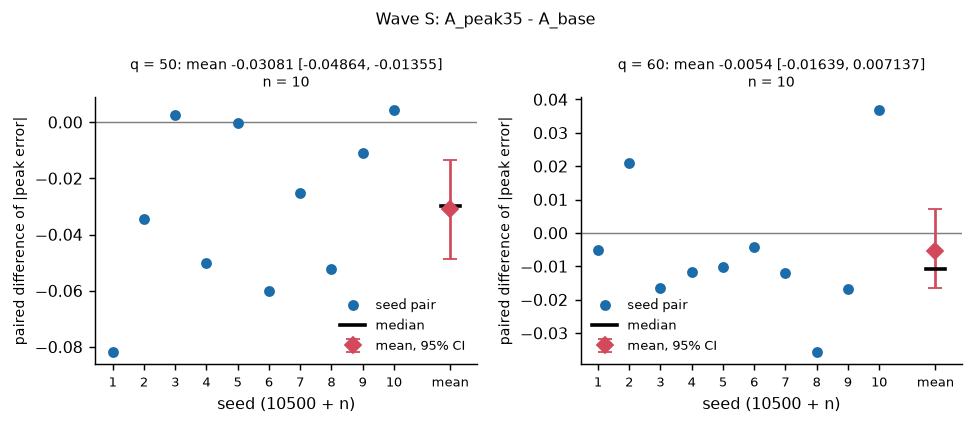
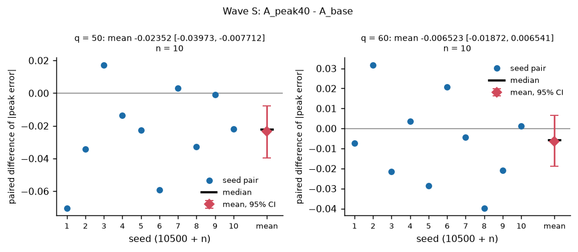
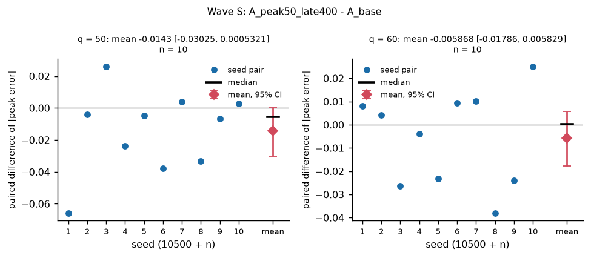
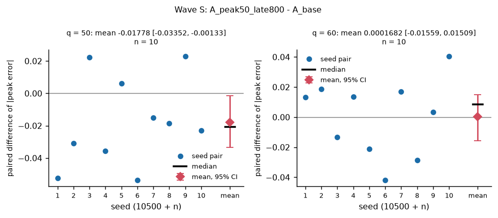
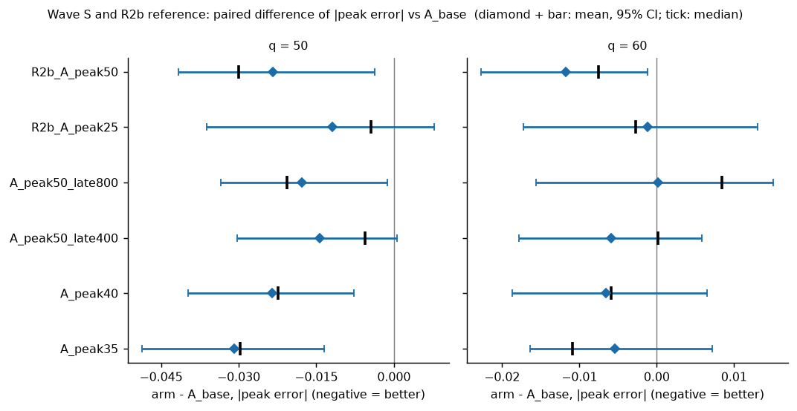

# R2c pilot wave S: start-distribution arms (full Phase A from scratch)

Candidate: the stage-2 last iterate at global update 1600 (final tier). Baseline: the R1 `parents_A` runs (`A_base`). Arms: `A_peak35`, `A_peak40`, `A_peak50_late400`, `A_peak50_late800`; each changes `start_weights` only, paired by (q, seed). Generated by `tools/v2/refine_r2c_analysis.py`; every number is read from a CSV that is cited under its table.


## 1. Checks

**Launch checks (`tools/v2/r2c_launch_checks.py`)**: `results/v2_refine_r2c/launch_checks.json`.

```json
{
 "tool": "tools/v2/r2c_launch_checks.py",
 "code_commit": "58c2671649407cf0611adf7564ff6d88e0ba3a73",
 "head": "3ad1b07d8268e1e5fc0259455f0fd4863367743d",
 "roots": {
  "root": "/home/fjiang4/tournament_experiment/.claude/worktrees/v2-t2-r2c/results/v2_refine_r2c",
  "r1_root": "/home/fjiang4/tournament_experiment/.claude/worktrees/v2-t2-refine/results/v2_refine",
  "wave_dirname": "waveS"
 },
 "allowed_after_code": [
  "results/",
  "reports/v2/refine_r2c/"
 ],
 "arms": [
  "A_peak35",
  "A_peak40",
  "A_peak50_late400",
  "A_peak50_late800"
 ],
 "prefix_bounds": {
  "A_peak50_late400": 1200,
  "A_peak50_late800": 800
 },
 "n_runs": 80,
 "n_runs_ok": 80,
 "checks": {
  "C1": {
   "n": 80,
   "n_pass": 80
  },
  "C2": {
   "n": 80,
   "n_pass": 80
  },
  "C3": {
   "n": 80,
   "n_pass": 80
  },
  "C4": {
   "n": 80,
   "n_pass": 80
  },
  "C5": {
   "n": 40,
   "n_pass": 40
  }
 },
 "all_pass": true
}
```

**C-R3: the unchanged v2.0 entry point against the reference**: `results/v2_refine_r2c/v20_reproduction_checks.json`.

No top-level `summary`; top-level keys: `tool`, `ref`, `new`, `n`, `n_identical`, `ALL`, `failing_fields`, `first_differences`, `runs`.

| key | value |
|---|---|
| tool | tools/v2/cr2_compare.py |
| ref | /home/fjiang4/tournament_experiment/.claude/worktrees/v2-t2-refine/results/v2_T2_locked/rehearsal_v2_0 |
| new | results/v2_refine_r2c/v20_reproduction |
| n | 20 |
| n_identical | 20 |
| ALL | True |


## 2. Provenance

- wave runs: `/home/fjiang4/tournament_experiment/.claude/worktrees/v2-t2-r2c/results/v2_refine_r2c/waveS` (`--wave-dir`)
- result root: `/home/fjiang4/tournament_experiment/.claude/worktrees/v2-t2-r2c/results/v2_refine_r2c`
- baseline `A_base` = R1 `parents_A`: `/home/fjiang4/tournament_experiment/.claude/worktrees/v2-t2-refine/results/v2_refine`
- rehearsal parent candidates: `/home/fjiang4/tournament_experiment/.claude/worktrees/pilot-4-stabilization-fb99a2/results/v2_T2_locked/rehearsal_v1_1`
- R2b reference rows (descriptive): `/home/fjiang4/tournament_experiment/.claude/worktrees/v2-t2-r2b/results/v2_refine_r2b`
- bootstrap: 10000 resamples, `numpy.random.default_rng(20261005)` per (q, statistic)

This report contains no generation time (the tool is deterministic given its inputs); the `started` column below is copied from the launch records.

Launch records of this wave (`tools/v2/launch_refine.py`):

| record | started | argv | workers | nproc | loadavg_at_start | free disk (TB) | head | code_commit | code_commit_resolved | state | n_planned | finished / return code 0 |
|---|---|---|---|---|---|---|---|---|---|---|---|---|
| results/v2_refine_r2c/waveS/launch_20261005_185758.json | 20261005_185758 | tools/v2/launch_refine.py --wave r2c_waveS --workers 40 --code-commit 58c2671649407cf0611adf7564ff6d88e0ba3a73 | 40 | 64 | [8.78, 15.02, 12.45] | 2.23 | 3ad1b07 | 58c2671649407cf0611adf7564ff6d88e0ba3a73 | 58c2671 | done | 80 | 80 / 80 |

Source: `results/v2_refine_r2c/analysis/waveS_launch_record.csv`.


## 3. Completeness, manifests, method

Commit and dirty flag recorded in `manifest.json` of the analysed runs (all arms, the baseline and the reference arms):

| manifest_commit | manifest_dirty | n_runs |
|---|---|---|
| 3ad1b07 | False | 80 |
| 655b14c | False | 20 |
| d581b3c | False | 40 |

Source: `results/v2_refine_r2c/analysis/manifest_commits.csv`.

Completeness (a run is complete iff `status.json` says done with exit code 0 and `final_v2.json` holds a final-tier evaluation; every planned run is listed):

| arm | source | q | planned | done | failed | incomplete | missing | not_done_seeds |
|---|---|---|---|---|---|---|---|---|
| A_base | R1 parents_A | 50 | 10 | 10 | 0 | 0 | 0 |  |
| A_base | R1 parents_A | 60 | 10 | 10 | 0 | 0 | 0 |  |
| A_peak35 | this round | 50 | 10 | 10 | 0 | 0 | 0 |  |
| A_peak35 | this round | 60 | 10 | 10 | 0 | 0 | 0 |  |
| A_peak40 | this round | 50 | 10 | 10 | 0 | 0 | 0 |  |
| A_peak40 | this round | 60 | 10 | 10 | 0 | 0 | 0 |  |
| A_peak50_late400 | this round | 50 | 10 | 10 | 0 | 0 | 0 |  |
| A_peak50_late400 | this round | 60 | 10 | 10 | 0 | 0 | 0 |  |
| A_peak50_late800 | this round | 50 | 10 | 10 | 0 | 0 | 0 |  |
| A_peak50_late800 | this round | 60 | 10 | 10 | 0 | 0 | 0 |  |
| R2b_A_peak25 | R2b waveA (reference) | 50 | 10 | 10 | 0 | 0 | 0 |  |
| R2b_A_peak25 | R2b waveA (reference) | 60 | 10 | 10 | 0 | 0 | 0 |  |
| R2b_A_peak50 | R2b waveA (reference) | 50 | 10 | 10 | 0 | 0 | 0 |  |
| R2b_A_peak50 | R2b waveA (reference) | 60 | 10 | 10 | 0 | 0 | 0 |  |

Source: `results/v2_refine_r2c/analysis/completeness.csv`.

Statistics (`refine_r2b_analysis.py`, pre-registration section 6 of R2b): differences are arm - A_base, paired by (q, seed); `n_better` counts strictly improving seeds and `n_zero` exact ties; the 95% CIs are percentile bootstrap intervals of the mean and of the median of the 10 paired differences (10000 resamples with replacement, `numpy.random.default_rng(20261005)`, one fresh generator per (q, statistic) in table order); the primary metric is the absolute signed peak error at d = 0 of the final-tier end-of-A last iterate (improvement = negative difference). Interpretation used by the selection (also in `03_selection.md`): |peak error| = that primary metric; runs with |peak error| <= 0.05 are counted inclusively over the 20 runs of an arm; the mean |peak error| is the mean over those 20 runs; an arm with any missing, failed or incomplete run cannot be selected.


## 4. One section per arm


### `A_peak35`

start-distribution arm: peak-focused exploring starts from update 1, share 0.35 (bin-balanced: 0.10 / 0.091). `start_weights` = `{"scheme": "peak_focused", "peak_half_width": 20, "peak_share": 0.35, "local_first": 1}`; local_first (default 1) = 1; share = 0.35. Comparator of the criterion: `A_base` (label `vs baseline`).

Primary metric, paired differences arm - A_base (negative = better):

| comparison | arm | comparator | q | n | mean diff | 95% CI mean | median diff | 95% CI median | n_better | n_zero | boot_seed |
|---|---|---|---|---|---|---|---|---|---|---|---|
| vs baseline | A_peak35 | A_base | 50 | 10 | -0.03081 | [-0.04864, -0.01355] | -0.02978 | [-0.05218, -0.000343] | 8 | 0 | 20261005 |
| vs baseline | A_peak35 | A_base | 60 | 10 | -0.0054 | [-0.01639, 0.007137] | -0.0109 | [-0.01658, 0.005415] | 8 | 0 | 20261005 |

Source: `results/v2_refine_r2c/analysis/waveS_A_peak35_primary.csv`.

Criterion, parts (a) and (b) separately:

| arm | comparator | comparison | mean_q50 | ci_mean_lo_q50 | ci_mean_hi_q50 | a_q50 | mean_q60 | ci_mean_lo_q60 | ci_mean_hi_q60 | a_q60 | a_met | n_base_pass | b_status | b_violations | b_pending | overall | boot_seed |
|---|---|---|---|---|---|---|---|---|---|---|---|---|---|---|---|---|---|
| A_peak35 | A_base | vs baseline | -0.03081 | -0.04864 | -0.01355 | True | -0.0054 | -0.01639 | 0.007137 | False | False | 20 | holds |  |  | not met | 20261005 |

Source: `results/v2_refine_r2c/analysis/waveS_A_peak35_criterion.csv`.

Selection inputs of this arm: complete = True; runs with |peak error| <= 0.05: 8 (q50) + 5 (q60) = 13; mean |peak error| over both q = 0.04137; eligible = False (not eligible because: (a) not met at q60).

Tail statistics of the arm and of the baseline (max |peak error|, runs with |peak error| <= 0.05, runs with eta_2/DW > 0.004, G-A passes):

| arm | q | n_complete | max_abs_peak_error | n_abs_peak_le_0.05 | n_eta_over_0.004 | n_gate_pass | mean_abs_peak_error | max_tail_mean_over_g2_0 | n_tail_mean_over_0.02 |
|---|---|---|---|---|---|---|---|---|---|
| A_base | 50 | 10 | 0.1222 | 2 | 1 | 10 | 0.0656 | 0.01187 | 0 |
| A_base | 60 | 10 | 0.09174 | 5 | 0 | 10 | 0.05335 | 0.01254 | 0 |
| A_peak35 | 50 | 10 | 0.06389 | 8 | 0 | 10 | 0.03479 | 0.01601 | 0 |
| A_peak35 | 60 | 10 | 0.06571 | 5 | 0 | 10 | 0.04795 | 0.01937 | 0 |

Source: `results/v2_refine_r2c/analysis/waveS_A_peak35_tail.csv`.

Other metrics against the baseline (mean difference arm - A_base with the 95% CI of the mean; `k/10 better` counts seeds with a smaller value; the signed peak error, sigma_2(0) and the smoothed-game share have no direction; because the signed peak errors are negative, a POSITIVE difference of the signed error is an improvement):

| metric | q50 mean diff [95% CI] | q60 mean diff [95% CI] |
|---|---|---|
| signed peak error | 0.03081 [0.01355, 0.04864] | 0.0054 [-0.007137, 0.01639] |
| \|location-free peak error\| | -0.03077 [-0.0486, -0.01363], 8/10 better | -0.005545 [-0.01637, 0.006987], 8/10 better |
| RMSE_pos / e2*(0) | 9.252e-05 [-0.006702, 0.005643], 3/10 better | 0.003174 [-0.0002243, 0.006893], 3/10 better |
| tail mean / e2*(0) | 0.004422 [0.003206, 0.005842], 0/10 better | 0.005743 [0.004633, 0.006735], 0/10 better |
| tail max / e2*(0) | 0.004037 [-0.00366, 0.01027], 1/10 better | 0.005475 [0.001717, 0.009034], 2/10 better |
| eta_2 / DW (final) | -0.0002254 [-0.001078, 0.0004973], 5/10 better | -0.0001673 [-0.0004163, 6.125e-05], 6/10 better |
| \|dev - final\| of eta_2 (G-N part) | -8.486e-05 [-0.0001299, -4.037e-05], 8/10 better | -3.948e-05 [-7.333e-05, -1.239e-05], 7/10 better |
| symmetry error | -0.1215 [-0.8683, 0.544], 4/10 better | 0.147 [-0.6539, 0.9128], 6/10 better |
| sigma_2(0) | -0.1928 [-0.3581, -0.0456] | -0.1806 [-0.282, -0.08734] |
| smoothed-game share of the d = 0 gap | 0.462 [0.1582, 0.8212] | -0.03981 [-0.2566, 0.1197] |

Source: `results/v2_refine_r2c/analysis/waveS_A_peak35_metrics.csv`.

Optimisation diagnostics (median over the runs; KL, clip fraction, gradient norms, steps, wall time):

| wave | arm | q | n_complete | median_kl_mean | median_clip_frac_mean | median_gn_actor_mean | median_gn_actor_max | median_n_minibatch_steps_total | median_n_epochs_run_mean | median_adv_all_std_mean | median_phase_wall_sec |
|---|---|---|---|---|---|---|---|---|---|---|---|
| stage2 | A_peak35 | 50 | 10 | 0.006424 | 0.06136 | 3.078 | 16.85 | 3.2e+04 | 10 | 0.09396 | 194.1 |
| stage2 | A_peak35 | 60 | 10 | 0.006445 | 0.05945 | 3.125 | 18.2 | 3.2e+04 | 10 | 0.08302 | 208.3 |

Source: `results/v2_refine_r2c/analysis/waveS_A_peak35_optimisation.csv`.

Peak-set visitation share of the learner's stage-2 starts (cumulative over the whole phase, from the last verifier call; the design share is the bin-balanced one) with the D1 clamp counts and the stage-2 profile on |d| >= 2q (mean over the seeds; the baseline for comparison). For a late arm the whole-phase share mixes the bin-balanced and the peak-focused updates:

| arm | q | peak_visit_share | peak_visit_design_share | d1_flagged_L_s2 | d1_flagged_L_s2_in | tail2q_mean_e2hat | tail2q_mean_abs_err_over_g2_0 | offpath_delta2_max_over_dw | onpath_delta2_max_over_dw |
|---|---|---|---|---|---|---|---|---|---|
| A_base | 50 | 0.09995 | 0.1 | 1.144e+04 | 0 | 0.569 | 0.008129 | 0.00049 | 0.001621 |
| A_base | 60 | 0.091 | 0.09091 | 3707 | 0 | 0.5675 | 0.009729 | 0.0003069 | 0.0008865 |
| A_peak35 | 50 | 0.3503 | 0.1 | 131.3 | 0 | 0.8786 | 0.01255 | 0.0005962 | 0.001378 |
| A_peak35 | 60 | 0.3502 | 0.09091 | 2.7 | 0 | 0.9025 | 0.01547 | 0.0004027 | 0.0007146 |

Source: `results/v2_refine_r2c/analysis/waveS_A_peak35_specifics.csv`.



A_peak35 minus A_base: seed-level paired differences of |peak error| (negative = better) (`reports/v2/refine_r2c/figures/waveS_A_peak35_vs_A_base.png`, `reports/v2/refine_r2c/figures/waveS_A_peak35_vs_A_base.pdf`).

Notable events of this arm (computed): none.


### `A_peak40`

start-distribution arm: peak-focused exploring starts from update 1, share 0.40. `start_weights` = `{"scheme": "peak_focused", "peak_half_width": 20, "peak_share": 0.4, "local_first": 1}`; local_first (default 1) = 1; share = 0.4. Comparator of the criterion: `A_base` (label `vs baseline`).

Primary metric, paired differences arm - A_base (negative = better):

| comparison | arm | comparator | q | n | mean diff | 95% CI mean | median diff | 95% CI median | n_better | n_zero | boot_seed |
|---|---|---|---|---|---|---|---|---|---|---|---|
| vs baseline | A_peak40 | A_base | 50 | 10 | -0.02352 | [-0.03973, -0.007712] | -0.02236 | [-0.04097, -0.0008056] | 8 | 0 | 20261005 |
| vs baseline | A_peak40 | A_base | 60 | 10 | -0.006523 | [-0.01872, 0.006541] | -0.005872 | [-0.02476, 0.01101] | 6 | 0 | 20261005 |

Source: `results/v2_refine_r2c/analysis/waveS_A_peak40_primary.csv`.

Criterion, parts (a) and (b) separately:

| arm | comparator | comparison | mean_q50 | ci_mean_lo_q50 | ci_mean_hi_q50 | a_q50 | mean_q60 | ci_mean_lo_q60 | ci_mean_hi_q60 | a_q60 | a_met | n_base_pass | b_status | b_violations | b_pending | overall | boot_seed |
|---|---|---|---|---|---|---|---|---|---|---|---|---|---|---|---|---|---|
| A_peak40 | A_base | vs baseline | -0.02352 | -0.03973 | -0.007712 | True | -0.006523 | -0.01872 | 0.006541 | False | False | 20 | holds |  |  | not met | 20261005 |

Source: `results/v2_refine_r2c/analysis/waveS_A_peak40_criterion.csv`.

Selection inputs of this arm: complete = True; runs with |peak error| <= 0.05: 7 (q50) + 5 (q60) = 12; mean |peak error| over both q = 0.04445; eligible = False (not eligible because: (a) not met at q60).

Tail statistics of the arm and of the baseline (max |peak error|, runs with |peak error| <= 0.05, runs with eta_2/DW > 0.004, G-A passes):

| arm | q | n_complete | max_abs_peak_error | n_abs_peak_le_0.05 | n_eta_over_0.004 | n_gate_pass | mean_abs_peak_error | max_tail_mean_over_g2_0 | n_tail_mean_over_0.02 |
|---|---|---|---|---|---|---|---|---|---|
| A_base | 50 | 10 | 0.1222 | 2 | 1 | 10 | 0.0656 | 0.01187 | 0 |
| A_base | 60 | 10 | 0.09174 | 5 | 0 | 10 | 0.05335 | 0.01254 | 0 |
| A_peak40 | 50 | 10 | 0.061 | 7 | 0 | 10 | 0.04207 | 0.0167 | 0 |
| A_peak40 | 60 | 10 | 0.06376 | 5 | 0 | 10 | 0.04682 | 0.01775 | 0 |

Source: `results/v2_refine_r2c/analysis/waveS_A_peak40_tail.csv`.

Other metrics against the baseline (mean difference arm - A_base with the 95% CI of the mean; `k/10 better` counts seeds with a smaller value; the signed peak error, sigma_2(0) and the smoothed-game share have no direction; because the signed peak errors are negative, a POSITIVE difference of the signed error is an improvement):

| metric | q50 mean diff [95% CI] | q60 mean diff [95% CI] |
|---|---|---|
| signed peak error | 0.02352 [0.007712, 0.03973] | 0.006523 [-0.006541, 0.01872] |
| \|location-free peak error\| | -0.02342 [-0.03979, -0.007475], 8/10 better | -0.006926 [-0.01909, 0.006073], 6/10 better |
| RMSE_pos / e2*(0) | -0.00535 [-0.01032, -0.001382], 7/10 better | 0.0001841 [-0.002188, 0.002495], 4/10 better |
| tail mean / e2*(0) | 0.005151 [0.003688, 0.006472], 0/10 better | 0.006569 [0.005327, 0.007737], 0/10 better |
| tail max / e2*(0) | 0.00236 [-0.002908, 0.006926], 2/10 better | 0.007912 [0.004528, 0.01158], 0/10 better |
| eta_2 / DW (final) | -0.0006687 [-0.001373, -0.0001443], 9/10 better | -0.0002573 [-0.0004956, -1.704e-05], 7/10 better |
| \|dev - final\| of eta_2 (G-N part) | -5.145e-05 [-0.0001256, 3.829e-05], 8/10 better | -1.471e-05 [-8.51e-05, 5.589e-05], 5/10 better |
| symmetry error | -0.7965 [-1.526, -0.1399], 8/10 better | 0.1331 [-0.356, 0.4851], 2/10 better |
| sigma_2(0) | -0.217 [-0.387, -0.06372] | -0.1808 [-0.2916, -0.06979] |
| smoothed-game share of the d = 0 gap | 0.1565 [-0.05508, 0.3187] | 0.006818 [-0.1219, 0.1273] |

Source: `results/v2_refine_r2c/analysis/waveS_A_peak40_metrics.csv`.

Optimisation diagnostics (median over the runs; KL, clip fraction, gradient norms, steps, wall time):

| wave | arm | q | n_complete | median_kl_mean | median_clip_frac_mean | median_gn_actor_mean | median_gn_actor_max | median_n_minibatch_steps_total | median_n_epochs_run_mean | median_adv_all_std_mean | median_phase_wall_sec |
|---|---|---|---|---|---|---|---|---|---|---|---|
| stage2 | A_peak40 | 50 | 10 | 0.006602 | 0.05916 | 3.037 | 17.44 | 3.2e+04 | 10 | 0.0966 | 200.5 |
| stage2 | A_peak40 | 60 | 10 | 0.006575 | 0.06299 | 3.319 | 19.74 | 3.2e+04 | 10 | 0.08552 | 192.1 |

Source: `results/v2_refine_r2c/analysis/waveS_A_peak40_optimisation.csv`.

Peak-set visitation share of the learner's stage-2 starts (cumulative over the whole phase, from the last verifier call; the design share is the bin-balanced one) with the D1 clamp counts and the stage-2 profile on |d| >= 2q (mean over the seeds; the baseline for comparison). For a late arm the whole-phase share mixes the bin-balanced and the peak-focused updates:

| arm | q | peak_visit_share | peak_visit_design_share | d1_flagged_L_s2 | d1_flagged_L_s2_in | tail2q_mean_e2hat | tail2q_mean_abs_err_over_g2_0 | offpath_delta2_max_over_dw | onpath_delta2_max_over_dw |
|---|---|---|---|---|---|---|---|---|---|
| A_base | 50 | 0.09995 | 0.1 | 1.144e+04 | 0 | 0.569 | 0.008129 | 0.00049 | 0.001621 |
| A_base | 60 | 0.091 | 0.09091 | 3707 | 0 | 0.5675 | 0.009729 | 0.0003069 | 0.0008865 |
| A_peak40 | 50 | 0.4002 | 0.1 | 0.7 | 0 | 0.9296 | 0.01328 | 0.0005531 | 0.0009471 |
| A_peak40 | 60 | 0.4002 | 0.09091 | 16.3 | 0 | 0.9507 | 0.0163 | 0.0004541 | 0.0006156 |

Source: `results/v2_refine_r2c/analysis/waveS_A_peak40_specifics.csv`.



A_peak40 minus A_base: seed-level paired differences of |peak error| (negative = better) (`reports/v2/refine_r2c/figures/waveS_A_peak40_vs_A_base.png`, `reports/v2/refine_r2c/figures/waveS_A_peak40_vs_A_base.pdf`).

Notable events of this arm (computed): none.


### `A_peak50_late400`

start-distribution arm: bin-balanced for updates 1-1200, peak-focused with share 0.50 from update 1201 (the last 400). `start_weights` = `{"scheme": "peak_focused", "peak_half_width": 20, "peak_share": 0.5, "local_first": 1201}`; local_first (default 1) = 1201; share = 0.5. Comparator of the criterion: `A_base` (label `vs baseline`).

Primary metric, paired differences arm - A_base (negative = better):

| comparison | arm | comparator | q | n | mean diff | 95% CI mean | median diff | 95% CI median | n_better | n_zero | boot_seed |
|---|---|---|---|---|---|---|---|---|---|---|---|
| vs baseline | A_peak50_late400 | A_base | 50 | 10 | -0.0143 | [-0.03025, 0.0005321] | -0.005646 | [-0.03324, 0.002824] | 7 | 0 | 20261005 |
| vs baseline | A_peak50_late400 | A_base | 60 | 10 | -0.005868 | [-0.01786, 0.005829] | 0.0001904 | [-0.02407, 0.009249] | 5 | 0 | 20261005 |

Source: `results/v2_refine_r2c/analysis/waveS_A_peak50_late400_primary.csv`.

Criterion, parts (a) and (b) separately:

| arm | comparator | comparison | mean_q50 | ci_mean_lo_q50 | ci_mean_hi_q50 | a_q50 | mean_q60 | ci_mean_lo_q60 | ci_mean_hi_q60 | a_q60 | a_met | n_base_pass | b_status | b_violations | b_pending | overall | boot_seed |
|---|---|---|---|---|---|---|---|---|---|---|---|---|---|---|---|---|---|
| A_peak50_late400 | A_base | vs baseline | -0.0143 | -0.03025 | 0.0005321 | False | -0.005868 | -0.01786 | 0.005829 | False | False | 20 | holds |  |  | not met | 20261005 |

Source: `results/v2_refine_r2c/analysis/waveS_A_peak50_late400_criterion.csv`.

Selection inputs of this arm: complete = True; runs with |peak error| <= 0.05: 5 (q50) + 5 (q60) = 10; mean |peak error| over both q = 0.04939; eligible = False (not eligible because: (a) not met at q50, q60).

Tail statistics of the arm and of the baseline (max |peak error|, runs with |peak error| <= 0.05, runs with eta_2/DW > 0.004, G-A passes):

| arm | q | n_complete | max_abs_peak_error | n_abs_peak_le_0.05 | n_eta_over_0.004 | n_gate_pass | mean_abs_peak_error | max_tail_mean_over_g2_0 | n_tail_mean_over_0.02 |
|---|---|---|---|---|---|---|---|---|---|
| A_base | 50 | 10 | 0.1222 | 2 | 1 | 10 | 0.0656 | 0.01187 | 0 |
| A_base | 60 | 10 | 0.09174 | 5 | 0 | 10 | 0.05335 | 0.01254 | 0 |
| A_peak50_late400 | 50 | 10 | 0.06414 | 5 | 0 | 10 | 0.05129 | 0.01279 | 0 |
| A_peak50_late400 | 60 | 10 | 0.06165 | 5 | 0 | 10 | 0.04748 | 0.01442 | 0 |

Source: `results/v2_refine_r2c/analysis/waveS_A_peak50_late400_tail.csv`.

Other metrics against the baseline (mean difference arm - A_base with the 95% CI of the mean; `k/10 better` counts seeds with a smaller value; the signed peak error, sigma_2(0) and the smoothed-game share have no direction; because the signed peak errors are negative, a POSITIVE difference of the signed error is an improvement):

| metric | q50 mean diff [95% CI] | q60 mean diff [95% CI] |
|---|---|---|
| signed peak error | 0.0143 [-0.0005321, 0.03025] | 0.005868 [-0.005829, 0.01786] |
| \|location-free peak error\| | -0.01447 [-0.03054, 0.0004722], 7/10 better | -0.006138 [-0.01808, 0.005515], 5/10 better |
| RMSE_pos / e2*(0) | 0.0002069 [-0.004502, 0.004759], 6/10 better | -0.001145 [-0.003989, 0.001676], 6/10 better |
| tail mean / e2*(0) | 0.001305 [0.001026, 0.001568], 0/10 better | 0.001166 [0.0008465, 0.001481], 0/10 better |
| tail max / e2*(0) | 0.002132 [-0.00159, 0.005883], 4/10 better | 0.001532 [-0.000236, 0.003266], 3/10 better |
| eta_2 / DW (final) | -0.0004753 [-0.00116, 0.0001438], 7/10 better | -0.0003709 [-0.0006428, -9.802e-05], 7/10 better |
| \|dev - final\| of eta_2 (G-N part) | -7.06e-05 [-0.0001242, -1.495e-05], 8/10 better | -3.734e-05 [-9.315e-05, 1.059e-05], 6/10 better |
| symmetry error | 0.2917 [-0.5628, 1.157], 5/10 better | 0.3632 [-0.1854, 0.9347], 4/10 better |
| sigma_2(0) | -0.02159 [-0.049, 0.004379] | -0.01146 [-0.01882, -0.003983] |
| smoothed-game share of the d = 0 gap | 0.08387 [-0.1246, 0.2557] | 0.005167 [-0.1943, 0.1805] |

Source: `results/v2_refine_r2c/analysis/waveS_A_peak50_late400_metrics.csv`.

Optimisation diagnostics (median over the runs; KL, clip fraction, gradient norms, steps, wall time):

| wave | arm | q | n_complete | median_kl_mean | median_clip_frac_mean | median_gn_actor_mean | median_gn_actor_max | median_n_minibatch_steps_total | median_n_epochs_run_mean | median_adv_all_std_mean | median_phase_wall_sec |
|---|---|---|---|---|---|---|---|---|---|---|---|
| stage2 | A_peak50_late400 | 50 | 10 | 0.006167 | 0.06187 | 3.323 | 20.05 | 3.2e+04 | 10 | 0.08152 | 221.2 |
| stage2 | A_peak50_late400 | 60 | 10 | 0.006438 | 0.0666 | 4.085 | 26.11 | 3.2e+04 | 10 | 0.07295 | 197.2 |

Source: `results/v2_refine_r2c/analysis/waveS_A_peak50_late400_optimisation.csv`.

Peak-set visitation share of the learner's stage-2 starts (cumulative over the whole phase, from the last verifier call; the design share is the bin-balanced one) with the D1 clamp counts and the stage-2 profile on |d| >= 2q (mean over the seeds; the baseline for comparison). For a late arm the whole-phase share mixes the bin-balanced and the peak-focused updates:

| arm | q | peak_visit_share | peak_visit_design_share | d1_flagged_L_s2 | d1_flagged_L_s2_in | tail2q_mean_e2hat | tail2q_mean_abs_err_over_g2_0 | offpath_delta2_max_over_dw | onpath_delta2_max_over_dw |
|---|---|---|---|---|---|---|---|---|---|
| A_base | 50 | 0.09995 | 0.1 | 1.144e+04 | 0 | 0.569 | 0.008129 | 0.00049 | 0.001621 |
| A_base | 60 | 0.091 | 0.09091 | 3707 | 0 | 0.5675 | 0.009729 | 0.0003069 | 0.0008865 |
| A_peak50_late400 | 50 | 0.2001 | 0.1 | 8630 | 0 | 0.6604 | 0.009434 | 0.0005584 | 0.001146 |
| A_peak50_late400 | 60 | 0.1933 | 0.09091 | 2814 | 0 | 0.6355 | 0.0109 | 0.0003335 | 0.0005121 |

Source: `results/v2_refine_r2c/analysis/waveS_A_peak50_late400_specifics.csv`.



A_peak50_late400 minus A_base: seed-level paired differences of |peak error| (negative = better) (`reports/v2/refine_r2c/figures/waveS_A_peak50_late400_vs_A_base.png`, `reports/v2/refine_r2c/figures/waveS_A_peak50_late400_vs_A_base.pdf`).

Notable events of this arm (computed): none.


### `A_peak50_late800`

start-distribution arm: bin-balanced for updates 1-800, peak-focused with share 0.50 from update 801 (the last 800). `start_weights` = `{"scheme": "peak_focused", "peak_half_width": 20, "peak_share": 0.5, "local_first": 801}`; local_first (default 1) = 801; share = 0.5. Comparator of the criterion: `A_base` (label `vs baseline`).

Primary metric, paired differences arm - A_base (negative = better):

| comparison | arm | comparator | q | n | mean diff | 95% CI mean | median diff | 95% CI median | n_better | n_zero | boot_seed |
|---|---|---|---|---|---|---|---|---|---|---|---|
| vs baseline | A_peak50_late800 | A_base | 50 | 10 | -0.01778 | [-0.03352, -0.00133] | -0.02068 | [-0.04166, 0.006022] | 7 | 0 | 20261005 |
| vs baseline | A_peak50_late800 | A_base | 60 | 10 | 0.0001682 | [-0.01559, 0.01509] | 0.008406 | [-0.02118, 0.01709] | 4 | 0 | 20261005 |

Source: `results/v2_refine_r2c/analysis/waveS_A_peak50_late800_primary.csv`.

Criterion, parts (a) and (b) separately:

| arm | comparator | comparison | mean_q50 | ci_mean_lo_q50 | ci_mean_hi_q50 | a_q50 | mean_q60 | ci_mean_lo_q60 | ci_mean_hi_q60 | a_q60 | a_met | n_base_pass | b_status | b_violations | b_pending | overall | boot_seed |
|---|---|---|---|---|---|---|---|---|---|---|---|---|---|---|---|---|---|
| A_peak50_late800 | A_base | vs baseline | -0.01778 | -0.03352 | -0.00133 | True | 0.0001682 | -0.01559 | 0.01509 | False | False | 20 | holds |  |  | not met | 20261005 |

Source: `results/v2_refine_r2c/analysis/waveS_A_peak50_late800_criterion.csv`.

Selection inputs of this arm: complete = True; runs with |peak error| <= 0.05: 7 (q50) + 1 (q60) = 8; mean |peak error| over both q = 0.05067; eligible = False (not eligible because: (a) not met at q60).

Tail statistics of the arm and of the baseline (max |peak error|, runs with |peak error| <= 0.05, runs with eta_2/DW > 0.004, G-A passes):

| arm | q | n_complete | max_abs_peak_error | n_abs_peak_le_0.05 | n_eta_over_0.004 | n_gate_pass | mean_abs_peak_error | max_tail_mean_over_g2_0 | n_tail_mean_over_0.02 |
|---|---|---|---|---|---|---|---|---|---|
| A_base | 50 | 10 | 0.1222 | 2 | 1 | 10 | 0.0656 | 0.01187 | 0 |
| A_base | 60 | 10 | 0.09174 | 5 | 0 | 10 | 0.05335 | 0.01254 | 0 |
| A_peak50_late800 | 50 | 10 | 0.06979 | 7 | 1 | 10 | 0.04782 | 0.01914 | 0 |
| A_peak50_late800 | 60 | 10 | 0.0686 | 1 | 0 | 10 | 0.05351 | 0.01836 | 0 |

Source: `results/v2_refine_r2c/analysis/waveS_A_peak50_late800_tail.csv`.

Other metrics against the baseline (mean difference arm - A_base with the 95% CI of the mean; `k/10 better` counts seeds with a smaller value; the signed peak error, sigma_2(0) and the smoothed-game share have no direction; because the signed peak errors are negative, a POSITIVE difference of the signed error is an improvement):

| metric | q50 mean diff [95% CI] | q60 mean diff [95% CI] |
|---|---|---|
| signed peak error | 0.01778 [0.00133, 0.03352] | 1.942e-05 [-0.01506, 0.01607] |
| \|location-free peak error\| | -0.01789 [-0.03358, -0.001605], 7/10 better | 0.0003067 [-0.01528, 0.01509], 4/10 better |
| RMSE_pos / e2*(0) | 0.0008695 [-0.003266, 0.005077], 5/10 better | 0.002775 [-0.0003102, 0.006268], 5/10 better |
| tail mean / e2*(0) | 0.00347 [0.002598, 0.004492], 0/10 better | 0.003274 [0.002691, 0.003992], 0/10 better |
| tail max / e2*(0) | 0.005108 [0.001437, 0.009039], 2/10 better | 0.003971 [0.002026, 0.006563], 1/10 better |
| eta_2 / DW (final) | -5.619e-05 [-0.0005581, 0.0003778], 4/10 better | -2.697e-05 [-0.0002926, 0.0002574], 6/10 better |
| \|dev - final\| of eta_2 (G-N part) | -5.974e-05 [-0.0001122, -1.125e-06], 8/10 better | -1.412e-07 [-4.606e-05, 4.571e-05], 6/10 better |
| symmetry error | 0.04477 [-0.9671, 0.9021], 4/10 better | 0.5656 [0.08714, 1.109], 4/10 better |
| sigma_2(0) | -0.04862 [-0.08633, -0.01297] | -0.014 [-0.02963, -0.0007918] |
| smoothed-game share of the d = 0 gap | 0.1007 [-0.1255, 0.2871] | -2.897 [-8.484, -0.01078] |

Source: `results/v2_refine_r2c/analysis/waveS_A_peak50_late800_metrics.csv`.

Optimisation diagnostics (median over the runs; KL, clip fraction, gradient norms, steps, wall time):

| wave | arm | q | n_complete | median_kl_mean | median_clip_frac_mean | median_gn_actor_mean | median_gn_actor_max | median_n_minibatch_steps_total | median_n_epochs_run_mean | median_adv_all_std_mean | median_phase_wall_sec |
|---|---|---|---|---|---|---|---|---|---|---|---|
| stage2 | A_peak50_late800 | 50 | 10 | 0.006423 | 0.06469 | 3.396 | 20.43 | 3.2e+04 | 10 | 0.08978 | 206 |
| stage2 | A_peak50_late800 | 60 | 10 | 0.006945 | 0.07159 | 4.212 | 25.83 | 3.2e+04 | 10 | 0.08008 | 197.4 |

Source: `results/v2_refine_r2c/analysis/waveS_A_peak50_late800_optimisation.csv`.

Peak-set visitation share of the learner's stage-2 starts (cumulative over the whole phase, from the last verifier call; the design share is the bin-balanced one) with the D1 clamp counts and the stage-2 profile on |d| >= 2q (mean over the seeds; the baseline for comparison). For a late arm the whole-phase share mixes the bin-balanced and the peak-focused updates:

| arm | q | peak_visit_share | peak_visit_design_share | d1_flagged_L_s2 | d1_flagged_L_s2_in | tail2q_mean_e2hat | tail2q_mean_abs_err_over_g2_0 | offpath_delta2_max_over_dw | onpath_delta2_max_over_dw |
|---|---|---|---|---|---|---|---|---|---|
| A_base | 50 | 0.09995 | 0.1 | 1.144e+04 | 0 | 0.569 | 0.008129 | 0.00049 | 0.001621 |
| A_base | 60 | 0.091 | 0.09091 | 3707 | 0 | 0.5675 | 0.009729 | 0.0003069 | 0.0008865 |
| A_peak50_late800 | 50 | 0.3001 | 0.1 | 4345 | 0 | 0.8119 | 0.0116 | 0.0006027 | 0.001565 |
| A_peak50_late800 | 60 | 0.2955 | 0.09091 | 1591 | 0 | 0.7585 | 0.013 | 0.0003935 | 0.0008595 |

Source: `results/v2_refine_r2c/analysis/waveS_A_peak50_late800_specifics.csv`.



A_peak50_late800 minus A_base: seed-level paired differences of |peak error| (negative = better) (`reports/v2/refine_r2c/figures/waveS_A_peak50_late800_vs_A_base.png`, `reports/v2/refine_r2c/figures/waveS_A_peak50_late800_vs_A_base.pdf`).

Notable events of this arm (computed): q60/10506 has a POSITIVE signed peak error (0.000938): for this run the difference of |peak error| is not the negative of the difference of the signed error; q60/10506: the smoothed-game share (-27.14) is not meaningful, the observed d = 0 gap is -0.05471 effort units (a near-zero or negative denominator drives the mean and CI of that metric)


## 5. Cross-arm tables


### Arms at a glance

| arm | local_first | share | q50 mean diff [95% CI] | q50 better/ties of 10 | q60 mean diff [95% CI] | q60 better/ties of 10 | (a) both q | (b) | q50 max\|peak\|, n<=0.05, n eta>0.004 | q60 max\|peak\|, n<=0.05, n eta>0.004 | n<=0.05 total | eligible |
|---|---|---|---|---|---|---|---|---|---|---|---|---|
| A_peak35 | 1 | 0.35 | -0.03081 [-0.04864, -0.01355] | 8/0 | -0.0054 [-0.01639, 0.007137] | 8/0 | False | holds | 0.06389, 8, 0 | 0.06571, 5, 0 | 13 | False |
| A_peak40 | 1 | 0.4 | -0.02352 [-0.03973, -0.007712] | 8/0 | -0.006523 [-0.01872, 0.006541] | 6/0 | False | holds | 0.061, 7, 0 | 0.06376, 5, 0 | 12 | False |
| A_peak50_late400 | 1201 | 0.5 | -0.0143 [-0.03025, 0.0005321] | 7/0 | -0.005868 [-0.01786, 0.005829] | 5/0 | False | holds | 0.06414, 5, 0 | 0.06165, 5, 0 | 10 | False |
| A_peak50_late800 | 801 | 0.5 | -0.01778 [-0.03352, -0.00133] | 7/0 | 0.0001682 [-0.01559, 0.01509] | 4/0 | False | holds | 0.06979, 7, 1 | 0.0686, 1, 0 | 8 | False |

Source: `results/v2_refine_r2c/analysis/waveS_arm_index.csv`.


### Share and local_first response (including the R2b reference rows)

Baseline, the four arms of this round and, as descriptive reference rows, R2b's `A_peak25` (share 0.25) and `A_peak50` (share 0.50, local_first 1: the same sampler as a local_first = 1 arm of this round), ordered by (local_first, share). The reference rows are never inputs of the selection.

| arm | source | local_first | share | q50 n<=0.05 | q60 n<=0.05 | n<=0.05 total | mean \|peak\|, both q | max \|peak\| | q50 mean diff [95% CI] | q60 mean diff [95% CI] |
|---|---|---|---|---|---|---|---|---|---|---|
| A_base | baseline (R1 parents_A) | - | bin-balanced | 2 | 5 | 7 | 0.05947 | 0.1222 | n/a | n/a |
| R2b_A_peak25 | R2b reference | 1 | 0.25 | 4 | 5 | 9 | 0.05294 | 0.08149 | -0.0119 [-0.03612, 0.007803] | -0.001167 [-0.01724, 0.01307] |
| A_peak35 | this round | 1 | 0.35 | 8 | 5 | 13 | 0.04137 | 0.06571 | -0.03081 [-0.04864, -0.01355] | -0.0054 [-0.01639, 0.007137] |
| A_peak40 | this round | 1 | 0.4 | 7 | 5 | 12 | 0.04445 | 0.06376 | -0.02352 [-0.03973, -0.007712] | -0.006523 [-0.01872, 0.006541] |
| R2b_A_peak50 | R2b reference | 1 | 0.5 | 8 | 8 | 16 | 0.04186 | 0.06792 | -0.02346 [-0.04166, -0.003694] | -0.01176 [-0.02269, -0.001192] |
| A_peak50_late800 | this round | 801 | 0.5 | 7 | 1 | 8 | 0.05067 | 0.06979 | -0.01778 [-0.03352, -0.00133] | 0.0001682 [-0.01559, 0.01509] |
| A_peak50_late400 | this round | 1201 | 0.5 | 5 | 5 | 10 | 0.04939 | 0.06414 | -0.0143 [-0.03025, 0.0005321] | -0.005868 [-0.01786, 0.005829] |

Source: `results/v2_refine_r2c/analysis/waveS_response.csv`.


### Primary metric, every comparison

| comparison | arm | comparator | q | n | mean diff | 95% CI mean | median diff | 95% CI median | n_better | n_zero | boot_seed |
|---|---|---|---|---|---|---|---|---|---|---|---|
| vs baseline | A_peak35 | A_base | 50 | 10 | -0.03081 | [-0.04864, -0.01355] | -0.02978 | [-0.05218, -0.000343] | 8 | 0 | 20261005 |
| vs baseline | A_peak35 | A_base | 60 | 10 | -0.0054 | [-0.01639, 0.007137] | -0.0109 | [-0.01658, 0.005415] | 8 | 0 | 20261005 |
| vs baseline | A_peak40 | A_base | 50 | 10 | -0.02352 | [-0.03973, -0.007712] | -0.02236 | [-0.04097, -0.0008056] | 8 | 0 | 20261005 |
| vs baseline | A_peak40 | A_base | 60 | 10 | -0.006523 | [-0.01872, 0.006541] | -0.005872 | [-0.02476, 0.01101] | 6 | 0 | 20261005 |
| vs baseline | A_peak50_late400 | A_base | 50 | 10 | -0.0143 | [-0.03025, 0.0005321] | -0.005646 | [-0.03324, 0.002824] | 7 | 0 | 20261005 |
| vs baseline | A_peak50_late400 | A_base | 60 | 10 | -0.005868 | [-0.01786, 0.005829] | 0.0001904 | [-0.02407, 0.009249] | 5 | 0 | 20261005 |
| vs baseline | A_peak50_late800 | A_base | 50 | 10 | -0.01778 | [-0.03352, -0.00133] | -0.02068 | [-0.04166, 0.006022] | 7 | 0 | 20261005 |
| vs baseline | A_peak50_late800 | A_base | 60 | 10 | 0.0001682 | [-0.01559, 0.01509] | 0.008406 | [-0.02118, 0.01709] | 4 | 0 | 20261005 |
| R2b reference (descriptive, not eligible) | R2b_A_peak25 | A_base | 50 | 10 | -0.0119 | [-0.03612, 0.007803] | -0.004446 | [-0.03482, 0.01451] | 6 | 0 | 20261005 |
| R2b reference (descriptive, not eligible) | R2b_A_peak25 | A_base | 60 | 10 | -0.001167 | [-0.01724, 0.01307] | -0.002686 | [-0.01591, 0.02119] | 6 | 0 | 20261005 |
| R2b reference (descriptive, not eligible) | R2b_A_peak50 | A_base | 50 | 10 | -0.02346 | [-0.04166, -0.003694] | -0.03007 | [-0.05385, 0.006425] | 8 | 0 | 20261005 |
| R2b reference (descriptive, not eligible) | R2b_A_peak50 | A_base | 60 | 10 | -0.01176 | [-0.02269, -0.001192] | -0.007555 | [-0.02842, 0.007791] | 7 | 0 | 20261005 |

Source: `results/v2_refine_r2c/analysis/waveS_primary.csv` (`paired.csv`).


### Criterion, every arm

| arm | comparator | comparison | mean_q50 | ci_mean_lo_q50 | ci_mean_hi_q50 | a_q50 | mean_q60 | ci_mean_lo_q60 | ci_mean_hi_q60 | a_q60 | a_met | n_base_pass | b_status | b_violations | b_pending | overall | boot_seed |
|---|---|---|---|---|---|---|---|---|---|---|---|---|---|---|---|---|---|
| A_peak35 | A_base | vs baseline | -0.03081 | -0.04864 | -0.01355 | True | -0.0054 | -0.01639 | 0.007137 | False | False | 20 | holds |  |  | not met | 20261005 |
| A_peak40 | A_base | vs baseline | -0.02352 | -0.03973 | -0.007712 | True | -0.006523 | -0.01872 | 0.006541 | False | False | 20 | holds |  |  | not met | 20261005 |
| A_peak50_late400 | A_base | vs baseline | -0.0143 | -0.03025 | 0.0005321 | False | -0.005868 | -0.01786 | 0.005829 | False | False | 20 | holds |  |  | not met | 20261005 |
| A_peak50_late800 | A_base | vs baseline | -0.01778 | -0.03352 | -0.00133 | True | 0.0001682 | -0.01559 | 0.01509 | False | False | 20 | holds |  |  | not met | 20261005 |

Source: `results/v2_refine_r2c/analysis/waveS_criterion.csv` (`criterion.csv`).


### Tail statistics (next to the criterion)

Per arm and q over the complete runs: the maximum |peak error|, the number of runs with |peak error| <= 0.05 (inclusive), the number with eta_2/DW > 0.004 (the G-A limit is 0.005), the number that pass G-A with its G-N part, the mean |peak error|, the largest tail mean / e2*(0) and the number of runs above the G-A limit 0.02 of that tail mean. `parent_u1600` is the rehearsal end-of-A parent candidate.

| arm | q | n_complete | max_abs_peak_error | n_abs_peak_le_0.05 | n_eta_over_0.004 | n_gate_pass | mean_abs_peak_error | max_tail_mean_over_g2_0 | n_tail_mean_over_0.02 |
|---|---|---|---|---|---|---|---|---|---|
| A_base | 50 | 10 | 0.1222 | 2 | 1 | 10 | 0.0656 | 0.01187 | 0 |
| A_base | 60 | 10 | 0.09174 | 5 | 0 | 10 | 0.05335 | 0.01254 | 0 |
| A_peak35 | 50 | 10 | 0.06389 | 8 | 0 | 10 | 0.03479 | 0.01601 | 0 |
| A_peak35 | 60 | 10 | 0.06571 | 5 | 0 | 10 | 0.04795 | 0.01937 | 0 |
| A_peak40 | 50 | 10 | 0.061 | 7 | 0 | 10 | 0.04207 | 0.0167 | 0 |
| A_peak40 | 60 | 10 | 0.06376 | 5 | 0 | 10 | 0.04682 | 0.01775 | 0 |
| A_peak50_late400 | 50 | 10 | 0.06414 | 5 | 0 | 10 | 0.05129 | 0.01279 | 0 |
| A_peak50_late400 | 60 | 10 | 0.06165 | 5 | 0 | 10 | 0.04748 | 0.01442 | 0 |
| A_peak50_late800 | 50 | 10 | 0.06979 | 7 | 1 | 10 | 0.04782 | 0.01914 | 0 |
| A_peak50_late800 | 60 | 10 | 0.0686 | 1 | 0 | 10 | 0.05351 | 0.01836 | 0 |
| R2b_A_peak25 | 50 | 10 | 0.08149 | 4 | 0 | 10 | 0.05369 | 0.01173 | 0 |
| R2b_A_peak25 | 60 | 10 | 0.07557 | 5 | 0 | 10 | 0.05218 | 0.01695 | 0 |
| R2b_A_peak50 | 50 | 10 | 0.06792 | 8 | 0 | 10 | 0.04214 | 0.01645 | 0 |
| R2b_A_peak50 | 60 | 10 | 0.05793 | 8 | 0 | 7 | 0.04159 | 0.02214 | 3 |
| parent_u1600 | 50 | 10 | 0.1222 | 2 | 1 | 10 | 0.0656 | 0.01187 | 0 |
| parent_u1600 | 60 | 10 | 0.09174 | 5 | 0 | 10 | 0.05335 | 0.01254 | 0 |

Source: `results/v2_refine_r2c/analysis/tail.csv`.


### Other metrics (paired, arm - A_base)

**signed peak error** (`stage2_peak_rel_err_signed`)

| comparison | arm | comparator | q | n | mean diff | 95% CI mean | median diff | 95% CI median | n_better | n_zero |
|---|---|---|---|---|---|---|---|---|---|---|
| vs baseline | A_peak35 | A_base | 50 | 10 | 0.03081 | [0.01355, 0.04864] | 0.02978 | [0.000343, 0.05218] | n/a | 0 |
| vs baseline | A_peak35 | A_base | 60 | 10 | 0.0054 | [-0.007137, 0.01639] | 0.0109 | [-0.005415, 0.01658] | n/a | 0 |
| vs baseline | A_peak40 | A_base | 50 | 10 | 0.02352 | [0.007712, 0.03973] | 0.02236 | [0.0008056, 0.04097] | n/a | 0 |
| vs baseline | A_peak40 | A_base | 60 | 10 | 0.006523 | [-0.006541, 0.01872] | 0.005872 | [-0.01101, 0.02476] | n/a | 0 |
| vs baseline | A_peak50_late400 | A_base | 50 | 10 | 0.0143 | [-0.0005321, 0.03025] | 0.005646 | [-0.002824, 0.03324] | n/a | 0 |
| vs baseline | A_peak50_late400 | A_base | 60 | 10 | 0.005868 | [-0.005829, 0.01786] | -0.0001904 | [-0.009249, 0.02407] | n/a | 0 |
| vs baseline | A_peak50_late800 | A_base | 50 | 10 | 0.01778 | [0.00133, 0.03352] | 0.02068 | [-0.006022, 0.04166] | n/a | 0 |
| vs baseline | A_peak50_late800 | A_base | 60 | 10 | 1.942e-05 | [-0.01506, 0.01607] | -0.008406 | [-0.01709, 0.02118] | n/a | 0 |
| R2b reference (descriptive, not eligible) | R2b_A_peak25 | A_base | 50 | 10 | 0.0119 | [-0.007803, 0.03612] | 0.004446 | [-0.01451, 0.03482] | n/a | 0 |
| R2b reference (descriptive, not eligible) | R2b_A_peak25 | A_base | 60 | 10 | 0.001167 | [-0.01307, 0.01724] | 0.002686 | [-0.02119, 0.01591] | n/a | 0 |
| R2b reference (descriptive, not eligible) | R2b_A_peak50 | A_base | 50 | 10 | 0.02346 | [0.003694, 0.04166] | 0.03007 | [-0.006425, 0.05385] | n/a | 0 |
| R2b reference (descriptive, not eligible) | R2b_A_peak50 | A_base | 60 | 10 | 0.01176 | [0.001192, 0.02269] | 0.007555 | [-0.007791, 0.02842] | n/a | 0 |

Source: `results/v2_refine_r2c/analysis/waveS_metric_stage2_peak_rel_err_signed.csv`.

**|location-free peak error|** (`stage2_peak_locfree_rel_err_abs`)

| comparison | arm | comparator | q | n | mean diff | 95% CI mean | median diff | 95% CI median | n_better | n_zero |
|---|---|---|---|---|---|---|---|---|---|---|
| vs baseline | A_peak35 | A_base | 50 | 10 | -0.03077 | [-0.0486, -0.01363] | -0.02909 | [-0.05222, -0.0007195] | 8 | 0 |
| vs baseline | A_peak35 | A_base | 60 | 10 | -0.005545 | [-0.01637, 0.006987] | -0.01137 | [-0.01635, 0.005112] | 8 | 0 |
| vs baseline | A_peak40 | A_base | 50 | 10 | -0.02342 | [-0.03979, -0.007475] | -0.02215 | [-0.04103, -0.0007757] | 8 | 0 |
| vs baseline | A_peak40 | A_base | 60 | 10 | -0.006926 | [-0.01909, 0.006073] | -0.007128 | [-0.02451, 0.01083] | 6 | 0 |
| vs baseline | A_peak50_late400 | A_base | 50 | 10 | -0.01447 | [-0.03054, 0.0004722] | -0.006459 | [-0.03433, 0.002411] | 7 | 0 |
| vs baseline | A_peak50_late400 | A_base | 60 | 10 | -0.006138 | [-0.01808, 0.005515] | -0.00133 | [-0.02409, 0.009164] | 5 | 0 |
| vs baseline | A_peak50_late800 | A_base | 50 | 10 | -0.01789 | [-0.03358, -0.001605] | -0.02061 | [-0.04139, 0.005243] | 7 | 0 |
| vs baseline | A_peak50_late800 | A_base | 60 | 10 | 0.0003067 | [-0.01528, 0.01509] | 0.008551 | [-0.02127, 0.01686] | 4 | 0 |
| R2b reference (descriptive, not eligible) | R2b_A_peak25 | A_base | 50 | 10 | -0.01244 | [-0.03721, 0.007551] | -0.005508 | [-0.03488, 0.01438] | 6 | 0 |
| R2b reference (descriptive, not eligible) | R2b_A_peak25 | A_base | 60 | 10 | -0.001207 | [-0.017, 0.01303] | -0.002404 | [-0.01633, 0.02134] | 6 | 0 |
| R2b reference (descriptive, not eligible) | R2b_A_peak50 | A_base | 50 | 10 | -0.02341 | [-0.04166, -0.003619] | -0.02946 | [-0.05438, 0.006631] | 8 | 0 |
| R2b reference (descriptive, not eligible) | R2b_A_peak50 | A_base | 60 | 10 | -0.01259 | [-0.02372, -0.0018] | -0.008992 | [-0.02985, 0.007791] | 7 | 0 |

Source: `results/v2_refine_r2c/analysis/waveS_metric_stage2_peak_locfree_rel_err_abs.csv`.

**RMSE_pos / e2*(0)** (`stage2_rmse_pos_over_g2_0`)

| comparison | arm | comparator | q | n | mean diff | 95% CI mean | median diff | 95% CI median | n_better | n_zero |
|---|---|---|---|---|---|---|---|---|---|---|
| vs baseline | A_peak35 | A_base | 50 | 10 | 9.252e-05 | [-0.006702, 0.005643] | 0.002555 | [-0.002842, 0.004284] | 3 | 0 |
| vs baseline | A_peak35 | A_base | 60 | 10 | 0.003174 | [-0.0002243, 0.006893] | 0.001248 | [-0.00162, 0.00909] | 3 | 0 |
| vs baseline | A_peak40 | A_base | 50 | 10 | -0.00535 | [-0.01032, -0.001382] | -0.004347 | [-0.008757, 0.0004906] | 7 | 0 |
| vs baseline | A_peak40 | A_base | 60 | 10 | 0.0001841 | [-0.002188, 0.002495] | 0.001071 | [-0.004535, 0.003136] | 4 | 0 |
| vs baseline | A_peak50_late400 | A_base | 50 | 10 | 0.0002069 | [-0.004502, 0.004759] | -0.001308 | [-0.003627, 0.007566] | 6 | 0 |
| vs baseline | A_peak50_late400 | A_base | 60 | 10 | -0.001145 | [-0.003989, 0.001676] | -0.001516 | [-0.004714, 0.004144] | 6 | 0 |
| vs baseline | A_peak50_late800 | A_base | 50 | 10 | 0.0008695 | [-0.003266, 0.005077] | 0.0009406 | [-0.00649, 0.007796] | 5 | 0 |
| vs baseline | A_peak50_late800 | A_base | 60 | 10 | 0.002775 | [-0.0003102, 0.006268] | 0.001372 | [-0.001358, 0.006766] | 5 | 0 |
| R2b reference (descriptive, not eligible) | R2b_A_peak25 | A_base | 50 | 10 | 0.004223 | [-0.0001582, 0.00903] | 0.001191 | [-0.001891, 0.01231] | 4 | 0 |
| R2b reference (descriptive, not eligible) | R2b_A_peak25 | A_base | 60 | 10 | 0.00127 | [-0.00185, 0.004155] | 0.003333 | [-0.003545, 0.005284] | 4 | 0 |
| R2b reference (descriptive, not eligible) | R2b_A_peak50 | A_base | 50 | 10 | -0.001456 | [-0.005604, 0.002811] | -0.002267 | [-0.007854, 0.006581] | 7 | 0 |
| R2b reference (descriptive, not eligible) | R2b_A_peak50 | A_base | 60 | 10 | 0.003135 | [0.0003634, 0.006047] | 0.002083 | [0.0006191, 0.006604] | 2 | 0 |

Source: `results/v2_refine_r2c/analysis/waveS_metric_stage2_rmse_pos_over_g2_0.csv`.

**tail mean / e2*(0)** (`stage2_tail_mean_over_g2_0`)

| comparison | arm | comparator | q | n | mean diff | 95% CI mean | median diff | 95% CI median | n_better | n_zero |
|---|---|---|---|---|---|---|---|---|---|---|
| vs baseline | A_peak35 | A_base | 50 | 10 | 0.004422 | [0.003206, 0.005842] | 0.004026 | [0.003515, 0.005388] | 0 | 0 |
| vs baseline | A_peak35 | A_base | 60 | 10 | 0.005743 | [0.004633, 0.006735] | 0.00592 | [0.004344, 0.007251] | 0 | 0 |
| vs baseline | A_peak40 | A_base | 50 | 10 | 0.005151 | [0.003688, 0.006472] | 0.005339 | [0.003572, 0.007081] | 0 | 0 |
| vs baseline | A_peak40 | A_base | 60 | 10 | 0.006569 | [0.005327, 0.007737] | 0.006836 | [0.00454, 0.008407] | 0 | 0 |
| vs baseline | A_peak50_late400 | A_base | 50 | 10 | 0.001305 | [0.001026, 0.001568] | 0.001343 | [0.0009219, 0.001717] | 0 | 0 |
| vs baseline | A_peak50_late400 | A_base | 60 | 10 | 0.001166 | [0.0008465, 0.001481] | 0.001292 | [0.0005474, 0.00162] | 0 | 0 |
| vs baseline | A_peak50_late800 | A_base | 50 | 10 | 0.00347 | [0.002598, 0.004492] | 0.003384 | [0.002483, 0.003817] | 0 | 0 |
| vs baseline | A_peak50_late800 | A_base | 60 | 10 | 0.003274 | [0.002691, 0.003992] | 0.003215 | [0.002317, 0.003818] | 0 | 0 |
| R2b reference (descriptive, not eligible) | R2b_A_peak25 | A_base | 50 | 10 | 0.001887 | [0.0002923, 0.003324] | 0.002096 | [0.0003694, 0.003987] | 2 | 0 |
| R2b reference (descriptive, not eligible) | R2b_A_peak25 | A_base | 60 | 10 | 0.00309 | [0.001699, 0.004551] | 0.002901 | [0.0009302, 0.005012] | 1 | 0 |
| R2b reference (descriptive, not eligible) | R2b_A_peak50 | A_base | 50 | 10 | 0.006233 | [0.005147, 0.007317] | 0.006237 | [0.004737, 0.007774] | 0 | 0 |
| R2b reference (descriptive, not eligible) | R2b_A_peak50 | A_base | 60 | 10 | 0.009638 | [0.00854, 0.01085] | 0.009095 | [0.008122, 0.01104] | 0 | 0 |

Source: `results/v2_refine_r2c/analysis/waveS_metric_stage2_tail_mean_over_g2_0.csv`.

**tail max / e2*(0)** (`stage2_tail_max_over_g2_0`)

| comparison | arm | comparator | q | n | mean diff | 95% CI mean | median diff | 95% CI median | n_better | n_zero |
|---|---|---|---|---|---|---|---|---|---|---|
| vs baseline | A_peak35 | A_base | 50 | 10 | 0.004037 | [-0.00366, 0.01027] | 0.005763 | [0.00118, 0.01169] | 1 | 0 |
| vs baseline | A_peak35 | A_base | 60 | 10 | 0.005475 | [0.001717, 0.009034] | 0.006062 | [5.205e-05, 0.01074] | 2 | 0 |
| vs baseline | A_peak40 | A_base | 50 | 10 | 0.00236 | [-0.002908, 0.006926] | 0.003451 | [-0.0008755, 0.006336] | 2 | 0 |
| vs baseline | A_peak40 | A_base | 60 | 10 | 0.007912 | [0.004528, 0.01158] | 0.005685 | [0.002914, 0.01359] | 0 | 0 |
| vs baseline | A_peak50_late400 | A_base | 50 | 10 | 0.002132 | [-0.00159, 0.005883] | 0.002822 | [-0.002882, 0.007399] | 4 | 0 |
| vs baseline | A_peak50_late400 | A_base | 60 | 10 | 0.001532 | [-0.000236, 0.003266] | 0.002067 | [-0.00169, 0.004006] | 3 | 0 |
| vs baseline | A_peak50_late800 | A_base | 50 | 10 | 0.005108 | [0.001437, 0.009039] | 0.003094 | [5.701e-05, 0.01072] | 2 | 0 |
| vs baseline | A_peak50_late800 | A_base | 60 | 10 | 0.003971 | [0.002026, 0.006563] | 0.003378 | [0.001921, 0.004712] | 1 | 0 |
| R2b reference (descriptive, not eligible) | R2b_A_peak25 | A_base | 50 | 10 | -0.000394 | [-0.008379, 0.005114] | 0.003092 | [-0.001405, 0.006538] | 4 | 0 |
| R2b reference (descriptive, not eligible) | R2b_A_peak25 | A_base | 60 | 10 | 0.006153 | [0.004013, 0.008865] | 0.004596 | [0.003466, 0.008105] | 0 | 0 |
| R2b reference (descriptive, not eligible) | R2b_A_peak50 | A_base | 50 | 10 | 0.00624 | [-0.002157, 0.01231] | 0.01132 | [0.001917, 0.01329] | 2 | 0 |
| R2b reference (descriptive, not eligible) | R2b_A_peak50 | A_base | 60 | 10 | 0.009956 | [0.008187, 0.01196] | 0.008477 | [0.007475, 0.01279] | 0 | 0 |

Source: `results/v2_refine_r2c/analysis/waveS_metric_stage2_tail_max_over_g2_0.csv`.

**eta_2 / DW (final)** (`eta_T_over_dw`)

| comparison | arm | comparator | q | n | mean diff | 95% CI mean | median diff | 95% CI median | n_better | n_zero |
|---|---|---|---|---|---|---|---|---|---|---|
| vs baseline | A_peak35 | A_base | 50 | 10 | -0.0002254 | [-0.001078, 0.0004973] | 0.0001295 | [-0.001032, 0.0007154] | 5 | 0 |
| vs baseline | A_peak35 | A_base | 60 | 10 | -0.0001673 | [-0.0004163, 6.125e-05] | -0.0001787 | [-0.0003959, 0.0001204] | 6 | 0 |
| vs baseline | A_peak40 | A_base | 50 | 10 | -0.0006687 | [-0.001373, -0.0001443] | -0.0002043 | [-0.001155, -6.394e-05] | 9 | 0 |
| vs baseline | A_peak40 | A_base | 60 | 10 | -0.0002573 | [-0.0004956, -1.704e-05] | -0.0002753 | [-0.0006835, 9.715e-05] | 7 | 0 |
| vs baseline | A_peak50_late400 | A_base | 50 | 10 | -0.0004753 | [-0.00116, 0.0001438] | -0.0003519 | [-0.00121, 0.0005863] | 7 | 0 |
| vs baseline | A_peak50_late400 | A_base | 60 | 10 | -0.0003709 | [-0.0006428, -9.802e-05] | -0.0003854 | [-0.0007771, 0.0001795] | 7 | 0 |
| vs baseline | A_peak50_late800 | A_base | 50 | 10 | -5.619e-05 | [-0.0005581, 0.0003778] | 0.0001272 | [-0.0004196, 0.0003665] | 4 | 0 |
| vs baseline | A_peak50_late800 | A_base | 60 | 10 | -2.697e-05 | [-0.0002926, 0.0002574] | -0.0001315 | [-0.0004285, 0.000377] | 6 | 0 |
| R2b reference (descriptive, not eligible) | R2b_A_peak25 | A_base | 50 | 10 | 3.215e-05 | [-0.0004782, 0.0004862] | 0.0002306 | [-0.0006383, 0.0006819] | 4 | 0 |
| R2b reference (descriptive, not eligible) | R2b_A_peak25 | A_base | 60 | 10 | -0.000169 | [-0.0005277, 0.0001903] | -0.0001743 | [-0.0006916, 0.0003865] | 6 | 0 |
| R2b reference (descriptive, not eligible) | R2b_A_peak50 | A_base | 50 | 10 | -0.0004126 | [-0.0009685, 7.827e-05] | 1.471e-05 | [-0.0009786, 0.0001717] | 5 | 0 |
| R2b reference (descriptive, not eligible) | R2b_A_peak50 | A_base | 60 | 10 | -0.0002284 | [-0.000493, 1.262e-05] | -0.0001565 | [-0.0005704, 0.000161] | 6 | 0 |

Source: `results/v2_refine_r2c/analysis/waveS_metric_eta_T_over_dw.csv`.

**|dev - final| of eta_2 (G-N part)** (`eta_dev_minus_final_abs`)

| comparison | arm | comparator | q | n | mean diff | 95% CI mean | median diff | 95% CI median | n_better | n_zero |
|---|---|---|---|---|---|---|---|---|---|---|
| vs baseline | A_peak35 | A_base | 50 | 10 | -8.486e-05 | [-0.0001299, -4.037e-05] | -8.259e-05 | [-0.0001589, -8.81e-06] | 8 | 1 |
| vs baseline | A_peak35 | A_base | 60 | 10 | -3.948e-05 | [-7.333e-05, -1.239e-05] | -1.601e-05 | [-7.181e-05, 0] | 7 | 1 |
| vs baseline | A_peak40 | A_base | 50 | 10 | -5.145e-05 | [-0.0001256, 3.829e-05] | -6.656e-05 | [-0.000168, 2.14e-05] | 8 | 0 |
| vs baseline | A_peak40 | A_base | 60 | 10 | -1.471e-05 | [-8.51e-05, 5.589e-05] | 4.255e-06 | [-0.0001109, 8.266e-05] | 5 | 0 |
| vs baseline | A_peak50_late400 | A_base | 50 | 10 | -7.06e-05 | [-0.0001242, -1.495e-05] | -5.543e-05 | [-0.0001523, -1.807e-05] | 8 | 0 |
| vs baseline | A_peak50_late400 | A_base | 60 | 10 | -3.734e-05 | [-9.315e-05, 1.059e-05] | -3.063e-06 | [-0.0001, 3.33e-05] | 6 | 1 |
| vs baseline | A_peak50_late800 | A_base | 50 | 10 | -5.974e-05 | [-0.0001122, -1.125e-06] | -6.123e-05 | [-0.0001532, 5.295e-07] | 8 | 0 |
| vs baseline | A_peak50_late800 | A_base | 60 | 10 | -1.412e-07 | [-4.606e-05, 4.571e-05] | -1.544e-05 | [-8.031e-05, 8.432e-05] | 6 | 0 |
| R2b reference (descriptive, not eligible) | R2b_A_peak25 | A_base | 50 | 10 | -4.23e-05 | [-8.819e-05, 1.338e-05] | -5.897e-05 | [-0.000106, 0] | 7 | 1 |
| R2b reference (descriptive, not eligible) | R2b_A_peak25 | A_base | 60 | 10 | -3.156e-06 | [-6.413e-05, 6.41e-05] | -2.908e-06 | [-0.0001, 5.965e-05] | 6 | 0 |
| R2b reference (descriptive, not eligible) | R2b_A_peak50 | A_base | 50 | 10 | -6.585e-05 | [-0.0001162, -2.05e-05] | -4.778e-05 | [-0.0001316, -1.11e-16] | 8 | 0 |
| R2b reference (descriptive, not eligible) | R2b_A_peak50 | A_base | 60 | 10 | -3.543e-05 | [-8.595e-05, 5.777e-06] | -5.551e-17 | [-8.031e-05, 2.266e-05] | 5 | 2 |

Source: `results/v2_refine_r2c/analysis/waveS_metric_eta_dev_minus_final_abs.csv`.

**symmetry error** (`stage2_sym_err_max`)

| comparison | arm | comparator | q | n | mean diff | 95% CI mean | median diff | 95% CI median | n_better | n_zero |
|---|---|---|---|---|---|---|---|---|---|---|
| vs baseline | A_peak35 | A_base | 50 | 10 | -0.1215 | [-0.8683, 0.544] | 0.1045 | [-0.9456, 0.747] | 4 | 0 |
| vs baseline | A_peak35 | A_base | 60 | 10 | 0.147 | [-0.6539, 0.9128] | -0.02107 | [-0.9319, 1.276] | 6 | 0 |
| vs baseline | A_peak40 | A_base | 50 | 10 | -0.7965 | [-1.526, -0.1399] | -0.7077 | [-1.472, -0.1117] | 8 | 0 |
| vs baseline | A_peak40 | A_base | 60 | 10 | 0.1331 | [-0.356, 0.4851] | 0.2563 | [0.01703, 0.5766] | 2 | 0 |
| vs baseline | A_peak50_late400 | A_base | 50 | 10 | 0.2917 | [-0.5628, 1.157] | 0.1363 | [-1.059, 1.689] | 5 | 0 |
| vs baseline | A_peak50_late400 | A_base | 60 | 10 | 0.3632 | [-0.1854, 0.9347] | 0.3984 | [-0.5527, 1.223] | 4 | 0 |
| vs baseline | A_peak50_late800 | A_base | 50 | 10 | 0.04477 | [-0.9671, 0.9021] | 0.4105 | [-0.7419, 0.988] | 4 | 0 |
| vs baseline | A_peak50_late800 | A_base | 60 | 10 | 0.5656 | [0.08714, 1.109] | 0.3649 | [-0.1324, 1.388] | 4 | 0 |
| R2b reference (descriptive, not eligible) | R2b_A_peak25 | A_base | 50 | 10 | 0.6476 | [-0.4822, 2.009] | 0.5265 | [-0.4696, 1.187] | 4 | 0 |
| R2b reference (descriptive, not eligible) | R2b_A_peak25 | A_base | 60 | 10 | 0.233 | [-0.5773, 1.148] | -0.06731 | [-0.871, 1.235] | 5 | 0 |
| R2b reference (descriptive, not eligible) | R2b_A_peak50 | A_base | 50 | 10 | -0.1767 | [-1.145, 0.7168] | -0.1946 | [-1.116, 0.8494] | 6 | 0 |
| R2b reference (descriptive, not eligible) | R2b_A_peak50 | A_base | 60 | 10 | 0.7902 | [0.1579, 1.485] | 0.827 | [-0.3298, 1.419] | 3 | 0 |

Source: `results/v2_refine_r2c/analysis/waveS_metric_stage2_sym_err_max.csv`.

**sigma_2(0)** (`sigma_effort_at_0_t2`)

| comparison | arm | comparator | q | n | mean diff | 95% CI mean | median diff | 95% CI median | n_better | n_zero |
|---|---|---|---|---|---|---|---|---|---|---|
| vs baseline | A_peak35 | A_base | 50 | 10 | -0.1928 | [-0.3581, -0.0456] | -0.1201 | [-0.4347, 0.002147] | n/a | 0 |
| vs baseline | A_peak35 | A_base | 60 | 10 | -0.1806 | [-0.282, -0.08734] | -0.1673 | [-0.2868, -0.04286] | n/a | 0 |
| vs baseline | A_peak40 | A_base | 50 | 10 | -0.217 | [-0.387, -0.06372] | -0.1319 | [-0.4481, -0.01236] | n/a | 0 |
| vs baseline | A_peak40 | A_base | 60 | 10 | -0.1808 | [-0.2916, -0.06979] | -0.1782 | [-0.3762, 0.0003753] | n/a | 0 |
| vs baseline | A_peak50_late400 | A_base | 50 | 10 | -0.02159 | [-0.049, 0.004379] | -0.01898 | [-0.05316, 0.009075] | n/a | 0 |
| vs baseline | A_peak50_late400 | A_base | 60 | 10 | -0.01146 | [-0.01882, -0.003983] | -0.01418 | [-0.02352, 0.001945] | n/a | 0 |
| vs baseline | A_peak50_late800 | A_base | 50 | 10 | -0.04862 | [-0.08633, -0.01297] | -0.04765 | [-0.09791, -0.002744] | n/a | 0 |
| vs baseline | A_peak50_late800 | A_base | 60 | 10 | -0.014 | [-0.02963, -0.0007918] | -0.009172 | [-0.02725, 0.001429] | n/a | 0 |
| R2b reference (descriptive, not eligible) | R2b_A_peak25 | A_base | 50 | 10 | -0.1123 | [-0.2796, 0.0511] | -0.04311 | [-0.3778, 0.03269] | n/a | 0 |
| R2b reference (descriptive, not eligible) | R2b_A_peak25 | A_base | 60 | 10 | -0.04733 | [-0.1875, 0.1014] | -0.142 | [-0.24, 0.1743] | n/a | 0 |
| R2b reference (descriptive, not eligible) | R2b_A_peak50 | A_base | 50 | 10 | -0.2519 | [-0.3976, -0.1297] | -0.1648 | [-0.3522, -0.07472] | n/a | 0 |
| R2b reference (descriptive, not eligible) | R2b_A_peak50 | A_base | 60 | 10 | -0.2334 | [-0.3476, -0.1167] | -0.2512 | [-0.4153, -0.04143] | n/a | 0 |

Source: `results/v2_refine_r2c/analysis/waveS_metric_sigma_effort_at_0_t2.csv`.

**smoothed-game share of the d = 0 gap** (`smoothed_share_peak_gap_d0`)

| comparison | arm | comparator | q | n | mean diff | 95% CI mean | median diff | 95% CI median | n_better | n_zero |
|---|---|---|---|---|---|---|---|---|---|---|
| vs baseline | A_peak35 | A_base | 50 | 10 | 0.462 | [0.1582, 0.8212] | 0.4356 | [-0.003827, 0.7529] | n/a | 0 |
| vs baseline | A_peak35 | A_base | 60 | 10 | -0.03981 | [-0.2566, 0.1197] | 0.07181 | [-0.1347, 0.1454] | n/a | 0 |
| vs baseline | A_peak40 | A_base | 50 | 10 | 0.1565 | [-0.05508, 0.3187] | 0.2773 | [-0.001821, 0.3892] | n/a | 0 |
| vs baseline | A_peak40 | A_base | 60 | 10 | 0.006818 | [-0.1219, 0.1273] | 0.0276 | [-0.154, 0.1574] | n/a | 0 |
| vs baseline | A_peak50_late400 | A_base | 50 | 10 | 0.08387 | [-0.1246, 0.2557] | 0.1303 | [-0.0222, 0.2802] | n/a | 0 |
| vs baseline | A_peak50_late400 | A_base | 60 | 10 | 0.005167 | [-0.1943, 0.1805] | -0.02055 | [-0.09712, 0.2309] | n/a | 0 |
| vs baseline | A_peak50_late800 | A_base | 50 | 10 | 0.1007 | [-0.1255, 0.2871] | 0.2034 | [-0.09382, 0.3564] | n/a | 0 |
| vs baseline | A_peak50_late800 | A_base | 60 | 10 | -2.897 | [-8.484, -0.01078] | -0.1236 | [-0.5104, 0.09215] | n/a | 0 |
| R2b reference (descriptive, not eligible) | R2b_A_peak25 | A_base | 50 | 10 | 0.06753 | [-0.1345, 0.3094] | 0.00437 | [-0.1804, 0.2829] | n/a | 0 |
| R2b reference (descriptive, not eligible) | R2b_A_peak25 | A_base | 60 | 10 | -0.05433 | [-0.2641, 0.1235] | 0.01599 | [-0.1629, 0.1069] | n/a | 0 |
| R2b reference (descriptive, not eligible) | R2b_A_peak50 | A_base | 50 | 10 | 0.285 | [-0.08524, 0.6614] | 0.1511 | [-0.2078, 0.9612] | n/a | 0 |
| R2b reference (descriptive, not eligible) | R2b_A_peak50 | A_base | 60 | 10 | 0.0359 | [-0.1096, 0.1685] | 0.08749 | [-0.1703, 0.22] | n/a | 0 |

Source: `results/v2_refine_r2c/analysis/waveS_metric_smoothed_share_peak_gap_d0.csv`.


### Location-free peak and its argmax d

Per arm and q: the median |argmax d| of the stage-2 mean over the recovery grid, its range and the number of runs whose maximum is exactly at d = 0:

| arm | q | n | median_abs_argmax_d | min_argmax_d | max_argmax_d | n_argmax_at_0 |
|---|---|---|---|---|---|---|
| A_base | 50 | 10 | 0.5 | -2 | 0.5 | 1 |
| A_base | 60 | 10 | 1.25 | -2.5 | 1.5 | 0 |
| A_peak35 | 50 | 10 | 0.5 | -1 | 1.5 | 3 |
| A_peak35 | 60 | 10 | 1 | -2.5 | 2 | 2 |
| A_peak40 | 50 | 10 | 0.5 | -1.5 | 2 | 3 |
| A_peak40 | 60 | 10 | 1.5 | -2 | 2.5 | 2 |
| A_peak50_late400 | 50 | 10 | 1 | -2 | 1.5 | 3 |
| A_peak50_late400 | 60 | 10 | 1 | -3 | 1 | 3 |
| A_peak50_late800 | 50 | 10 | 0.75 | -1.5 | 2 | 4 |
| A_peak50_late800 | 60 | 10 | 1 | -1 | 1.5 | 2 |
| R2b_A_peak25 | 50 | 10 | 1.25 | -2.5 | 2 | 1 |
| R2b_A_peak25 | 60 | 10 | 0.75 | -3.5 | 1 | 2 |
| R2b_A_peak50 | 50 | 10 | 1 | -1 | 1.5 | 2 |
| R2b_A_peak50 | 60 | 10 | 1.5 | -3 | 3 | 1 |
| parent_u1600 | 50 | 10 | 0.5 | -2 | 0.5 | 1 |
| parent_u1600 | 60 | 10 | 1.25 | -2.5 | 1.5 | 0 |

Source: `results/v2_refine_r2c/analysis/waveS_locfree_argmax.csv`.


### Peak-set visitation share and clamp counts (mean over the seeds)

| arm | q | peak_visit_share | peak_visit_design_share | d1_flagged_L_s2 | d1_flagged_L_s2_in | tail2q_mean_e2hat | tail2q_mean_abs_err_over_g2_0 | offpath_delta2_max_over_dw | onpath_delta2_max_over_dw |
|---|---|---|---|---|---|---|---|---|---|
| A_base | 50 | 0.09995 | 0.1 | 1.144e+04 | 0 | 0.569 | 0.008129 | 0.00049 | 0.001621 |
| A_base | 60 | 0.091 | 0.09091 | 3707 | 0 | 0.5675 | 0.009729 | 0.0003069 | 0.0008865 |
| A_peak35 | 50 | 0.3503 | 0.1 | 131.3 | 0 | 0.8786 | 0.01255 | 0.0005962 | 0.001378 |
| A_peak35 | 60 | 0.3502 | 0.09091 | 2.7 | 0 | 0.9025 | 0.01547 | 0.0004027 | 0.0007146 |
| A_peak40 | 50 | 0.4002 | 0.1 | 0.7 | 0 | 0.9296 | 0.01328 | 0.0005531 | 0.0009471 |
| A_peak40 | 60 | 0.4002 | 0.09091 | 16.3 | 0 | 0.9507 | 0.0163 | 0.0004541 | 0.0006156 |
| A_peak50_late400 | 50 | 0.2001 | 0.1 | 8630 | 0 | 0.6604 | 0.009434 | 0.0005584 | 0.001146 |
| A_peak50_late400 | 60 | 0.1933 | 0.09091 | 2814 | 0 | 0.6355 | 0.0109 | 0.0003335 | 0.0005121 |
| A_peak50_late800 | 50 | 0.3001 | 0.1 | 4345 | 0 | 0.8119 | 0.0116 | 0.0006027 | 0.001565 |
| A_peak50_late800 | 60 | 0.2955 | 0.09091 | 1591 | 0 | 0.7585 | 0.013 | 0.0003935 | 0.0008595 |
| R2b_A_peak25 | 50 | 0.2502 | 0.1 | 2779 | 0 | 0.7011 | 0.01002 | 0.0004466 | 0.001653 |
| R2b_A_peak25 | 60 | 0.2503 | 0.09091 | 2463 | 0 | 0.7478 | 0.01282 | 0.0004034 | 0.0007072 |
| R2b_A_peak50 | 50 | 0.5002 | 0.1 | 0.1 | 0 | 1.005 | 0.01436 | 0.0006544 | 0.0012 |
| R2b_A_peak50 | 60 | 0.5002 | 0.09091 | 0 | 0 | 1.13 | 0.01937 | 0.0004914 | 0.0006508 |

Source: `results/v2_refine_r2c/analysis/waveS_specifics_mean.csv`.


### Optimisation diagnostics and cost per run

| wave | arm | q | n_complete | median_kl_mean | median_clip_frac_mean | median_gn_actor_mean | median_gn_actor_max | median_n_minibatch_steps_total | median_n_epochs_run_mean | median_adv_all_std_mean | median_phase_wall_sec |
|---|---|---|---|---|---|---|---|---|---|---|---|
| stage2 | A_base | 50 | 10 | 0.00595 | 0.05933 | 3.253 | 19.86 | 3.2e+04 | 10 | 0.07398 | 207.1 |
| stage2 | A_base | 60 | 10 | 0.006228 | 0.06333 | 3.912 | 24.2 | 3.2e+04 | 10 | 0.06618 | 180.4 |
| stage2 | A_peak35 | 50 | 10 | 0.006424 | 0.06136 | 3.078 | 16.85 | 3.2e+04 | 10 | 0.09396 | 194.1 |
| stage2 | A_peak35 | 60 | 10 | 0.006445 | 0.05945 | 3.125 | 18.2 | 3.2e+04 | 10 | 0.08302 | 208.3 |
| stage2 | A_peak40 | 50 | 10 | 0.006602 | 0.05916 | 3.037 | 17.44 | 3.2e+04 | 10 | 0.0966 | 200.5 |
| stage2 | A_peak40 | 60 | 10 | 0.006575 | 0.06299 | 3.319 | 19.74 | 3.2e+04 | 10 | 0.08552 | 192.1 |
| stage2 | A_peak50_late400 | 50 | 10 | 0.006167 | 0.06187 | 3.323 | 20.05 | 3.2e+04 | 10 | 0.08152 | 221.2 |
| stage2 | A_peak50_late400 | 60 | 10 | 0.006438 | 0.0666 | 4.085 | 26.11 | 3.2e+04 | 10 | 0.07295 | 197.2 |
| stage2 | A_peak50_late800 | 50 | 10 | 0.006423 | 0.06469 | 3.396 | 20.43 | 3.2e+04 | 10 | 0.08978 | 206 |
| stage2 | A_peak50_late800 | 60 | 10 | 0.006945 | 0.07159 | 4.212 | 25.83 | 3.2e+04 | 10 | 0.08008 | 197.4 |
| stage2 | R2b_A_peak25 | 50 | 10 | 0.006423 | 0.05888 | 3.004 | 18.5 | 3.2e+04 | 10 | 0.08647 | 191.4 |
| stage2 | R2b_A_peak25 | 60 | 10 | 0.006653 | 0.06597 | 3.844 | 22.84 | 3.2e+04 | 10 | 0.07805 | 167.7 |
| stage2 | R2b_A_peak50 | 50 | 10 | 0.006493 | 0.05995 | 3.042 | 17.66 | 3.2e+04 | 10 | 0.1032 | 190.4 |
| stage2 | R2b_A_peak50 | 60 | 10 | 0.0065 | 0.05975 | 3.171 | 18.21 | 3.2e+04 | 10 | 0.09029 | 172.5 |

Source: `results/v2_refine_r2c/analysis/waveS_optimisation.csv`.

| wave | arm | n_runs | mean_phase_wall_sec | mean_total_wall_sec | mean_train_update_sec | mean_train_rollout_sec | mean_phase_episodes | mean_phase_local_updates | mean_n_minibatch_steps_total | mean_wall_sec_per_update | phase_wall_ratio_vs_base | wall_per_update_ratio_vs_base |
|---|---|---|---|---|---|---|---|---|---|---|---|---|
| stage2 | A_base | 20 | 199.4 | 200.2 | 193.3 | 4.715 | 8.192e+05 | 1600 | 3.2e+04 | 0.1246 | 1 | 1 |
| stage2 | A_peak35 | 20 | 204.8 | 205.7 | 198.3 | 4.842 | 8.192e+05 | 1600 | 3.2e+04 | 0.128 | 1.027 | 1.027 |
| stage2 | A_peak40 | 20 | 200.3 | 201.3 | 193.9 | 4.754 | 8.192e+05 | 1600 | 3.2e+04 | 0.1252 | 1.005 | 1.005 |
| stage2 | A_peak50_late400 | 20 | 205.4 | 206.5 | 198.9 | 4.887 | 8.192e+05 | 1600 | 3.2e+04 | 0.1284 | 1.03 | 1.03 |
| stage2 | A_peak50_late800 | 20 | 200.8 | 201.8 | 194.5 | 4.748 | 8.192e+05 | 1600 | 3.2e+04 | 0.1255 | 1.007 | 1.007 |
| stage2 | R2b_A_peak25 | 20 | 183 | 183.9 | 177.2 | 4.373 | 8.192e+05 | 1600 | 3.2e+04 | 0.1144 | 0.9179 | 0.9179 |
| stage2 | R2b_A_peak50 | 20 | 184.9 | 185.8 | 179 | 4.409 | 8.192e+05 | 1600 | 3.2e+04 | 0.1156 | 0.9274 | 0.9274 |

Source: `results/v2_refine_r2c/analysis/waveS_cost.csv` (mean over the complete runs of both q; wall time is machine-load dependent).


### Seed-level values

| comparison | arm | comparator | q | seed | arm_abs_peak | comparator_abs_peak | diff | improved | tied | d1_flagged_L_s2 | d1_first_flagged_update |
|---|---|---|---|---|---|---|---|---|---|---|---|
| vs baseline | A_peak35 | A_base | 50 | 10501 | 0.04036 | 0.1222 | -0.08187 | True | False | 6 | 527 |
| vs baseline | A_peak35 | A_base | 50 | 10502 | 0.03371 | 0.06803 | -0.03432 | True | False | 0 | n/a |
| vs baseline | A_peak35 | A_base | 50 | 10503 | 0.02623 | 0.02357 | 0.002657 | False | False | 0 | n/a |
| vs baseline | A_peak35 | A_base | 50 | 10504 | 0.02109 | 0.07125 | -0.05016 | True | False | 41 | 603 |
| vs baseline | A_peak35 | A_base | 50 | 10505 | 0.05398 | 0.05432 | -0.000343 | True | False | 0 | n/a |
| vs baseline | A_peak35 | A_base | 50 | 10506 | 0.03833 | 0.09843 | -0.0601 | True | False | 0 | n/a |
| vs baseline | A_peak35 | A_base | 50 | 10507 | 0.03251 | 0.05776 | -0.02525 | True | False | 1220 | 425 |
| vs baseline | A_peak35 | A_base | 50 | 10508 | 0.01346 | 0.06563 | -0.05218 | True | False | 0 | n/a |
| vs baseline | A_peak35 | A_base | 50 | 10509 | 0.02433 | 0.03538 | -0.01104 | True | False | 46 | 540 |
| vs baseline | A_peak35 | A_base | 50 | 10510 | 0.06389 | 0.05937 | 0.004518 | False | False | 0 | n/a |
| vs baseline | A_peak35 | A_base | 60 | 10501 | 0.04188 | 0.04693 | -0.005045 | True | False | 0 | n/a |
| vs baseline | A_peak35 | A_base | 60 | 10502 | 0.05296 | 0.03193 | 0.02103 | False | False | 5 | 943 |
| vs baseline | A_peak35 | A_base | 60 | 10503 | 0.05559 | 0.07216 | -0.01658 | True | False | 18 | 726 |
| vs baseline | A_peak35 | A_base | 60 | 10504 | 0.03696 | 0.04855 | -0.01159 | True | False | 0 | n/a |
| vs baseline | A_peak35 | A_base | 60 | 10505 | 0.06571 | 0.07591 | -0.0102 | True | False | 4 | 888 |
| vs baseline | A_peak35 | A_base | 60 | 10506 | 0.03866 | 0.04289 | -0.004229 | True | False | 0 | n/a |
| vs baseline | A_peak35 | A_base | 60 | 10507 | 0.03959 | 0.05151 | -0.01192 | True | False | 0 | n/a |
| vs baseline | A_peak35 | A_base | 60 | 10508 | 0.05603 | 0.09174 | -0.03571 | True | False | 0 | n/a |
| vs baseline | A_peak35 | A_base | 60 | 10509 | 0.03413 | 0.05088 | -0.01675 | True | False | 0 | n/a |
| vs baseline | A_peak35 | A_base | 60 | 10510 | 0.05796 | 0.02097 | 0.03699 | False | False | 0 | n/a |
| vs baseline | A_peak40 | A_base | 50 | 10501 | 0.05174 | 0.1222 | -0.07048 | True | False | 1 | 1183 |
| vs baseline | A_peak40 | A_base | 50 | 10502 | 0.03394 | 0.06803 | -0.03409 | True | False | 0 | n/a |
| vs baseline | A_peak40 | A_base | 50 | 10503 | 0.04093 | 0.02357 | 0.01736 | False | False | 0 | n/a |
| vs baseline | A_peak40 | A_base | 50 | 10504 | 0.05751 | 0.07125 | -0.01374 | True | False | 0 | n/a |
| vs baseline | A_peak40 | A_base | 50 | 10505 | 0.03156 | 0.05432 | -0.02276 | True | False | 0 | n/a |
| vs baseline | A_peak40 | A_base | 50 | 10506 | 0.03924 | 0.09843 | -0.05919 | True | False | 0 | n/a |
| vs baseline | A_peak40 | A_base | 50 | 10507 | 0.061 | 0.05776 | 0.003243 | False | False | 6 | 754 |
| vs baseline | A_peak40 | A_base | 50 | 10508 | 0.03285 | 0.06563 | -0.03279 | True | False | 0 | n/a |
| vs baseline | A_peak40 | A_base | 50 | 10509 | 0.03457 | 0.03538 | -0.0008056 | True | False | 0 | n/a |
| vs baseline | A_peak40 | A_base | 50 | 10510 | 0.03741 | 0.05937 | -0.02195 | True | False | 0 | n/a |
| vs baseline | A_peak40 | A_base | 60 | 10501 | 0.03949 | 0.04693 | -0.007437 | True | False | 0 | n/a |
| vs baseline | A_peak40 | A_base | 60 | 10502 | 0.06373 | 0.03193 | 0.03181 | False | False | 0 | n/a |
| vs baseline | A_peak40 | A_base | 60 | 10503 | 0.05054 | 0.07216 | -0.02162 | True | False | 0 | n/a |
| vs baseline | A_peak40 | A_base | 60 | 10504 | 0.05224 | 0.04855 | 0.003689 | False | False | 0 | n/a |
| vs baseline | A_peak40 | A_base | 60 | 10505 | 0.04739 | 0.07591 | -0.02852 | True | False | 0 | n/a |
| vs baseline | A_peak40 | A_base | 60 | 10506 | 0.06376 | 0.04289 | 0.02087 | False | False | 0 | n/a |
| vs baseline | A_peak40 | A_base | 60 | 10507 | 0.0472 | 0.05151 | -0.004307 | True | False | 0 | n/a |
| vs baseline | A_peak40 | A_base | 60 | 10508 | 0.05187 | 0.09174 | -0.03987 | True | False | 163 | 796 |
| vs baseline | A_peak40 | A_base | 60 | 10509 | 0.02987 | 0.05088 | -0.021 | True | False | 0 | n/a |
| vs baseline | A_peak40 | A_base | 60 | 10510 | 0.02213 | 0.02097 | 0.001159 | False | False | 0 | n/a |
| vs baseline | A_peak50_late400 | A_base | 50 | 10501 | 0.05629 | 0.1222 | -0.06594 | True | False | 5.111e+04 | 189 |
| vs baseline | A_peak50_late400 | A_base | 50 | 10502 | 0.06414 | 0.06803 | -0.00389 | True | False | 0 | n/a |
| vs baseline | A_peak50_late400 | A_base | 50 | 10503 | 0.04968 | 0.02357 | 0.02611 | False | False | 1090 | 477 |
| vs baseline | A_peak50_late400 | A_base | 50 | 10504 | 0.04751 | 0.07125 | -0.02374 | True | False | 5 | 541 |
| vs baseline | A_peak50_late400 | A_base | 50 | 10505 | 0.04962 | 0.05432 | -0.004694 | True | False | 3 | 609 |
| vs baseline | A_peak50_late400 | A_base | 50 | 10506 | 0.06072 | 0.09843 | -0.0377 | True | False | 5594 | 271 |
| vs baseline | A_peak50_late400 | A_base | 50 | 10507 | 0.06159 | 0.05776 | 0.003834 | False | False | 4 | 1157 |
| vs baseline | A_peak50_late400 | A_base | 50 | 10508 | 0.0324 | 0.06563 | -0.03324 | True | False | 2.147e+04 | 337 |
| vs baseline | A_peak50_late400 | A_base | 50 | 10509 | 0.02878 | 0.03538 | -0.006597 | True | False | 7027 | 373 |
| vs baseline | A_peak50_late400 | A_base | 50 | 10510 | 0.06219 | 0.05937 | 0.002824 | False | False | 2 | 1099 |
| vs baseline | A_peak50_late400 | A_base | 60 | 10501 | 0.05513 | 0.04693 | 0.008199 | False | False | 6207 | 351 |
| vs baseline | A_peak50_late400 | A_base | 60 | 10502 | 0.0361 | 0.03193 | 0.004178 | False | False | 15 | 559 |
| vs baseline | A_peak50_late400 | A_base | 60 | 10503 | 0.04584 | 0.07216 | -0.02632 | True | False | 4738 | 243 |
| vs baseline | A_peak50_late400 | A_base | 60 | 10504 | 0.04475 | 0.04855 | -0.003797 | True | False | 33 | 653 |
| vs baseline | A_peak50_late400 | A_base | 60 | 10505 | 0.05262 | 0.07591 | -0.02329 | True | False | 1.038e+04 | 217 |
| vs baseline | A_peak50_late400 | A_base | 60 | 10506 | 0.05214 | 0.04289 | 0.009249 | False | False | 0 | n/a |
| vs baseline | A_peak50_late400 | A_base | 60 | 10507 | 0.06165 | 0.05151 | 0.01014 | False | False | 2 | 834 |
| vs baseline | A_peak50_late400 | A_base | 60 | 10508 | 0.05364 | 0.09174 | -0.03809 | True | False | 4940 | 244 |
| vs baseline | A_peak50_late400 | A_base | 60 | 10509 | 0.0268 | 0.05088 | -0.02407 | True | False | 408 | 433 |
| vs baseline | A_peak50_late400 | A_base | 60 | 10510 | 0.04611 | 0.02097 | 0.02514 | False | False | 1411 | 447 |
| vs baseline | A_peak50_late800 | A_base | 50 | 10501 | 0.06979 | 0.1222 | -0.05243 | True | False | 3.002e+04 | 189 |
| vs baseline | A_peak50_late800 | A_base | 50 | 10502 | 0.03715 | 0.06803 | -0.03088 | True | False | 0 | n/a |
| vs baseline | A_peak50_late800 | A_base | 50 | 10503 | 0.04587 | 0.02357 | 0.02229 | False | False | 437 | 477 |
| vs baseline | A_peak50_late800 | A_base | 50 | 10504 | 0.03556 | 0.07125 | -0.03569 | True | False | 4 | 541 |
| vs baseline | A_peak50_late800 | A_base | 50 | 10505 | 0.06034 | 0.05432 | 0.006022 | False | False | 1 | 609 |
| vs baseline | A_peak50_late800 | A_base | 50 | 10506 | 0.04469 | 0.09843 | -0.05374 | True | False | 2571 | 271 |
| vs baseline | A_peak50_late800 | A_base | 50 | 10507 | 0.04268 | 0.05776 | -0.01508 | True | False | 4 | 840 |
| vs baseline | A_peak50_late800 | A_base | 50 | 10508 | 0.04724 | 0.06563 | -0.0184 | True | False | 7429 | 337 |
| vs baseline | A_peak50_late800 | A_base | 50 | 10509 | 0.05845 | 0.03538 | 0.02307 | False | False | 2981 | 373 |
| vs baseline | A_peak50_late800 | A_base | 50 | 10510 | 0.03641 | 0.05937 | -0.02296 | True | False | 0 | n/a |
| vs baseline | A_peak50_late800 | A_base | 60 | 10501 | 0.06031 | 0.04693 | 0.01339 | False | False | 3374 | 351 |
| vs baseline | A_peak50_late800 | A_base | 60 | 10502 | 0.05071 | 0.03193 | 0.01879 | False | False | 9 | 559 |
| vs baseline | A_peak50_late800 | A_base | 60 | 10503 | 0.05879 | 0.07216 | -0.01337 | True | False | 3477 | 243 |
| vs baseline | A_peak50_late800 | A_base | 60 | 10504 | 0.06211 | 0.04855 | 0.01356 | False | False | 14 | 653 |
| vs baseline | A_peak50_late800 | A_base | 60 | 10505 | 0.05473 | 0.07591 | -0.02118 | True | False | 4754 | 217 |
| vs baseline | A_peak50_late800 | A_base | 60 | 10506 | 0.000938 | 0.04289 | -0.04195 | True | False | 0 | n/a |
| vs baseline | A_peak50_late800 | A_base | 60 | 10507 | 0.0686 | 0.05151 | 0.01709 | False | False | 0 | n/a |
| vs baseline | A_peak50_late800 | A_base | 60 | 10508 | 0.06306 | 0.09174 | -0.02867 | True | False | 3692 | 244 |
| vs baseline | A_peak50_late800 | A_base | 60 | 10509 | 0.0543 | 0.05088 | 0.003425 | False | False | 98 | 433 |
| vs baseline | A_peak50_late800 | A_base | 60 | 10510 | 0.06158 | 0.02097 | 0.04061 | False | False | 489 | 447 |
| R2b reference (descriptive, not eligible) | R2b_A_peak25 | A_base | 50 | 10501 | 0.02648 | 0.1222 | -0.09574 | True | False | 264 | 415 |
| R2b reference (descriptive, not eligible) | R2b_A_peak25 | A_base | 50 | 10502 | 0.06067 | 0.06803 | -0.007357 | True | False | 0 | n/a |
| R2b reference (descriptive, not eligible) | R2b_A_peak25 | A_base | 50 | 10503 | 0.03046 | 0.02357 | 0.006887 | False | False | 2 | 1108 |
| R2b reference (descriptive, not eligible) | R2b_A_peak25 | A_base | 50 | 10504 | 0.0658 | 0.07125 | -0.005448 | True | False | 0 | n/a |
| R2b reference (descriptive, not eligible) | R2b_A_peak25 | A_base | 50 | 10505 | 0.04978 | 0.05432 | -0.004539 | True | False | 0 | n/a |
| R2b reference (descriptive, not eligible) | R2b_A_peak25 | A_base | 50 | 10506 | 0.03423 | 0.09843 | -0.0642 | True | False | 2 | 1299 |
| R2b reference (descriptive, not eligible) | R2b_A_peak25 | A_base | 50 | 10507 | 0.06833 | 0.05776 | 0.01057 | False | False | 1.97e+04 | 266 |
| R2b reference (descriptive, not eligible) | R2b_A_peak25 | A_base | 50 | 10508 | 0.06128 | 0.06563 | -0.004353 | True | False | 6 | 992 |
| R2b reference (descriptive, not eligible) | R2b_A_peak25 | A_base | 50 | 10509 | 0.0584 | 0.03538 | 0.02302 | False | False | 7810 | 291 |
| R2b reference (descriptive, not eligible) | R2b_A_peak25 | A_base | 50 | 10510 | 0.08149 | 0.05937 | 0.02213 | False | False | 0 | n/a |
| R2b reference (descriptive, not eligible) | R2b_A_peak25 | A_base | 60 | 10501 | 0.04464 | 0.04693 | -0.002286 | True | False | 5 | 1204 |
| R2b reference (descriptive, not eligible) | R2b_A_peak25 | A_base | 60 | 10502 | 0.04225 | 0.03193 | 0.01032 | False | False | 304 | 366 |
| R2b reference (descriptive, not eligible) | R2b_A_peak25 | A_base | 60 | 10503 | 0.05338 | 0.07216 | -0.01878 | True | False | 183 | 473 |
| R2b reference (descriptive, not eligible) | R2b_A_peak25 | A_base | 60 | 10504 | 0.04465 | 0.04855 | -0.003903 | True | False | 3384 | 249 |
| R2b reference (descriptive, not eligible) | R2b_A_peak25 | A_base | 60 | 10505 | 0.06 | 0.07591 | -0.01591 | True | False | 0 | n/a |
| R2b reference (descriptive, not eligible) | R2b_A_peak25 | A_base | 60 | 10506 | 0.03981 | 0.04289 | -0.003086 | True | False | 0 | n/a |
| R2b reference (descriptive, not eligible) | R2b_A_peak25 | A_base | 60 | 10507 | 0.0727 | 0.05151 | 0.02119 | False | False | 0 | n/a |
| R2b reference (descriptive, not eligible) | R2b_A_peak25 | A_base | 60 | 10508 | 0.036 | 0.09174 | -0.05573 | True | False | 600 | 505 |
| R2b reference (descriptive, not eligible) | R2b_A_peak25 | A_base | 60 | 10509 | 0.07557 | 0.05088 | 0.0247 | False | False | 2.016e+04 | 300 |
| R2b reference (descriptive, not eligible) | R2b_A_peak25 | A_base | 60 | 10510 | 0.05279 | 0.02097 | 0.03182 | False | False | 0 | n/a |
| R2b reference (descriptive, not eligible) | R2b_A_peak50 | A_base | 50 | 10501 | 0.06792 | 0.1222 | -0.05431 | True | False | 0 | n/a |
| R2b reference (descriptive, not eligible) | R2b_A_peak50 | A_base | 50 | 10502 | 0.02088 | 0.06803 | -0.04715 | True | False | 0 | n/a |
| R2b reference (descriptive, not eligible) | R2b_A_peak50 | A_base | 50 | 10503 | 0.04593 | 0.02357 | 0.02236 | False | False | 0 | n/a |
| R2b reference (descriptive, not eligible) | R2b_A_peak50 | A_base | 50 | 10504 | 0.0174 | 0.07125 | -0.05385 | True | False | 0 | n/a |
| R2b reference (descriptive, not eligible) | R2b_A_peak50 | A_base | 50 | 10505 | 0.0471 | 0.05432 | -0.007219 | True | False | 0 | n/a |
| R2b reference (descriptive, not eligible) | R2b_A_peak50 | A_base | 50 | 10506 | 0.0415 | 0.09843 | -0.05693 | True | False | 0 | n/a |
| R2b reference (descriptive, not eligible) | R2b_A_peak50 | A_base | 50 | 10507 | 0.01931 | 0.05776 | -0.03845 | True | False | 0 | n/a |
| R2b reference (descriptive, not eligible) | R2b_A_peak50 | A_base | 50 | 10508 | 0.04395 | 0.06563 | -0.02168 | True | False | 0 | n/a |
| R2b reference (descriptive, not eligible) | R2b_A_peak50 | A_base | 50 | 10509 | 0.06754 | 0.03538 | 0.03216 | False | False | 1 | 1403 |
| R2b reference (descriptive, not eligible) | R2b_A_peak50 | A_base | 50 | 10510 | 0.04985 | 0.05937 | -0.009513 | True | False | 0 | n/a |
| R2b reference (descriptive, not eligible) | R2b_A_peak50 | A_base | 60 | 10501 | 0.05793 | 0.04693 | 0.011 | False | False | 0 | n/a |
| R2b reference (descriptive, not eligible) | R2b_A_peak50 | A_base | 60 | 10502 | 0.04149 | 0.03193 | 0.009561 | False | False | 0 | n/a |
| R2b reference (descriptive, not eligible) | R2b_A_peak50 | A_base | 60 | 10503 | 0.03692 | 0.07216 | -0.03524 | True | False | 0 | n/a |
| R2b reference (descriptive, not eligible) | R2b_A_peak50 | A_base | 60 | 10504 | 0.04165 | 0.04855 | -0.006898 | True | False | 0 | n/a |
| R2b reference (descriptive, not eligible) | R2b_A_peak50 | A_base | 60 | 10505 | 0.0475 | 0.07591 | -0.02842 | True | False | 0 | n/a |
| R2b reference (descriptive, not eligible) | R2b_A_peak50 | A_base | 60 | 10506 | 0.03672 | 0.04289 | -0.006174 | True | False | 0 | n/a |
| R2b reference (descriptive, not eligible) | R2b_A_peak50 | A_base | 60 | 10507 | 0.03017 | 0.05151 | -0.02134 | True | False | 0 | n/a |
| R2b reference (descriptive, not eligible) | R2b_A_peak50 | A_base | 60 | 10508 | 0.05207 | 0.09174 | -0.03967 | True | False | 0 | n/a |
| R2b reference (descriptive, not eligible) | R2b_A_peak50 | A_base | 60 | 10509 | 0.04266 | 0.05088 | -0.008212 | True | False | 0 | n/a |
| R2b reference (descriptive, not eligible) | R2b_A_peak50 | A_base | 60 | 10510 | 0.02876 | 0.02097 | 0.007791 | False | False | 0 | n/a |

Source: `results/v2_refine_r2c/analysis/waveS_seed_level.csv`.



Wave S: paired difference of |peak error| per arm (R2b reference arms included) (`reports/v2/refine_r2c/figures/waveS_overview.png`, `reports/v2/refine_r2c/figures/waveS_overview.pdf`).


## 6. Anomalies

The extraction recorded anomalies in 0 (`anomalies` column of `per_run.csv`) and 0 (`anomalies_r2b`, a column that exists only when it is non-empty) of the 140 rows of the arms, the baseline and the reference arms (140 with status done).

Roots that do not exist: none.

Every arm is complete (all planned runs done, all paired differences finite).

Notable events computed from the tables, per arm:

- `A_peak35`: none.
- `A_peak40`: none.
- `A_peak50_late400`: none.
- `A_peak50_late800`: q60/10506 has a POSITIVE signed peak error (0.000938): for this run the difference of |peak error| is not the negative of the difference of the signed error; q60/10506: the smoothed-game share (-27.14) is not meaningful, the observed d = 0 gap is -0.05471 effort units (a near-zero or negative denominator drives the mean and CI of that metric)
- `R2b_A_peak25`: none.
- `R2b_A_peak50`: q60/10503 fails G-A or its G-N part: tail mean 0.02039 > 0.02; q60/10504 fails G-A or its G-N part: tail mean 0.0212 > 0.02; q60/10510 fails G-A or its G-N part: tail mean 0.02214 > 0.02


## 7. Commands

Launch commands (`argv` of the launch records): `tools/v2/launch_refine.py --wave r2c_waveS --workers 40 --code-commit 58c2671649407cf0611adf7564ff6d88e0ba3a73`.

Analysis (single-threaded workers, `OMP_NUM_THREADS=MKL_NUM_THREADS=OPENBLAS_NUM_THREADS=1`, run from the repository root):

```
export OMP_NUM_THREADS=1 MKL_NUM_THREADS=1 OPENBLAS_NUM_THREADS=1
python tools/v2/refine_r2c_analysis.py --root results/v2_refine_r2c --arms A_peak35 A_peak40 A_peak50_late400 A_peak50_late800 --r1-root /home/fjiang4/tournament_experiment/.claude/worktrees/v2-t2-refine/results/v2_refine --ref-root /home/fjiang4/tournament_experiment/.claude/worktrees/pilot-4-stabilization-fb99a2/results/v2_T2_locked/rehearsal_v1_1 --r2b-root /home/fjiang4/tournament_experiment/.claude/worktrees/v2-t2-r2b/results/v2_refine_r2b --boot-seed 20261005 --out results/v2_refine_r2c/analysis --reports reports/v2/refine_r2c --workers 8
```

Tests of the selection rule (no result files needed): `python -m pytest tests/test_v2_r2c_analysis.py -p no:cacheprovider -q`.
